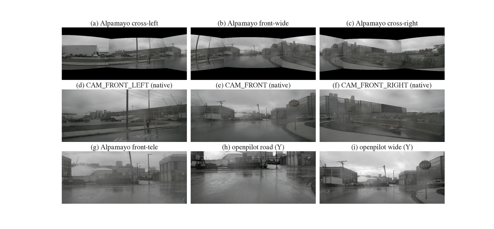
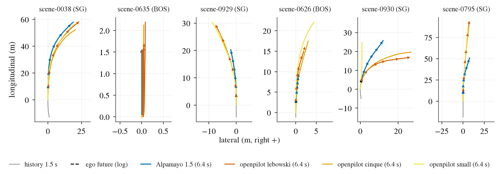
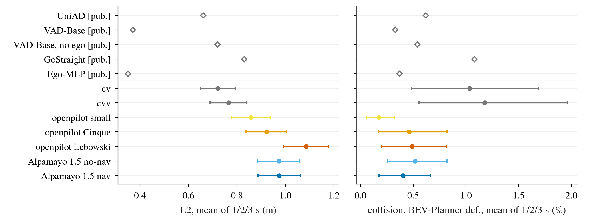
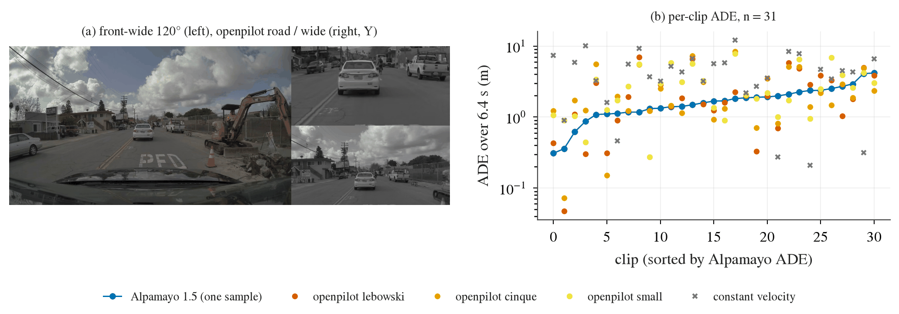

# Zero-shot 考试：nuScenes 开环规划，以及 openpilot 在 PhysicalAI-AV 上的反向检查

状态: done
主题: ../../research/openpilot-and-open-driving-models.md、../../research/benchmarks-and-evaluation.md
姊妹考试: [wod-e2e.md](wod-e2e.md)、[navsim.md](navsim.md)、[bench2drive.md](bench2drive.md)

## 目标

两件便宜的开环检查，模型还是 Alpamayo 1.5（NVIDIA 的 10B reasoning VLA，即直接输出驾驶轨迹的视觉语言模型）和
openpilot 的三个驾驶模型（small 30M、Cinque v3 382M、Lebowski 877M）。**不做任何 fine-tuning，不拟合任何参数**，只写输入输出适配层；
尽量复用 WOD-E2E / NAVSIM 考试已有的适配器（`jevdrive/camgeom.py` 的纯旋转重投影、`scripts/zeroshot_rigs.py` 的 Alpamayo 虚拟 rig、
`scripts/navsim_zs_alpamayo.py` 的模型封装和 prompt 分桶 batching、`jevdrive/openpilot/model.py`）。

1. **nuScenes 开环规划**：文献里 UniAD / VAD 那一套口径，val split 上的 L2（预测轨迹点和 GT 点的欧氏距离）@1/2/3 s 和
   collision rate（预测轨迹上的自车框和 GT 他车框相撞的比例）。把我们的 zero-shot 行和已发表的数字（UniAD、VAD、AD-MLP、
   BEV-Planner 的统一实现表）并排放，另外用我们自己的管线算一条 constant-velocity（CV，匀速直行）作为 sanity check。
2. **PhysicalAI-AV 反向检查**：把 openpilot 放到 Alpamayo 的主场（NVIDIA PhysicalAI-AV 数据集，Alpamayo 的训练分布）上，
   在 Alpamayo smoke run 用过的同一批 31 个 clip 上，用同样的 GT 和 horizon 算 openpilot 的 ADE（Average Displacement Error，
   逐点平均位移误差）。Alpamayo 自己在这 31 个 clip 上的 minADE_6（6 条采样里离 GT 最近那条的 ADE，oracle 读数）是 0.738 m。

## 已知的读法陷阱（写在看分数之前）

nuScenes 开环指标的问题是公认的，这里的数字只能在这些前提下读：

- **ego status 泄露**：AD-MLP（arXiv 2305.10430）只吃自车历史轨迹、速度、加速度和 command，不看任何图像，
  L2 平均 0.29 m、collision 0.19%，比所有看图的方法都好。BEV-Planner（"Is Ego Status All You Need"，arXiv 2312.03031，CVPR 2024）
  进一步指出 UniAD / VAD 的 BEVFormer 在感知阶段就把 ego status 注入了 BEV query，去掉之后规划指标明显变差；
  它还报告 VAD 的规划在输入全黑图时几乎不变。所以**L2 主要量的是「从自车状态外推未来」的能力**，不是场景理解。
- **数据分布**：val 的 5119 个有效样本里 4437 个（87%）的 command 是直行（按 VAD 的规则算，见下）。BEV-Planner 按 command
  拆开后，转弯子集的 collision 是直行的 5.6 倍。我们同样按 command 拆开报。
- **collision 的实现不统一**：ST-P3 / VAD 在 0.5 m 的 BEV 栅格上判断碰撞、自车框不随轨迹转向、按时间步取平均；
  BEV-Planner 改成用轨迹推出的朝向、并且「t 之前任何一步撞了就算撞」。不同论文的 collision 数字不能直接比，只能和同一实现的行比。
- **command 本身泄露答案**：UniAD / VAD / AD-MLP 的 driving command 是用 GT 未来 3 s 的横向位移算出来的（> 2 m 左 / 右，否则直行），
  所有文献行都用了它。我们的 Alpamayo nav 变体和 openpilot cmd 变体也用它，与文献可比，但它是泄露；无 command 的变体并排报。

## 预登记（2026-09-24，在看到任何分数之前写死）

以下选择在任何 nuScenes / PhysicalAI 分数出来之前提交。之后的改动记在文末「偏离记录」，写清楚改了什么、为什么、对数字的影响。
适配器验证只用**不在任何评测集里的** tail keyframe（scene 末尾没有完整 3 s 未来的 900 个 keyframe），只看图，不算分。

### nuScenes：数据与评测集

box 上 trainval 原来只解压了 CAM_FRONT（samples + sweeps）。为了 Alpamayo 的四路视图，从 `/autodl-pub` 的 trainval blob
里补解压 CAM_FRONT_LEFT / FRONT_RIGHT / BACK_LEFT / BACK_RIGHT 的 samples 和 sweeps（`scripts/extract_nuscenes.sh`）。
CAM_BACK 不解压：四路虚拟相机的视场都到不了正后方。sweeps 是相机的非关键帧，约 12 Hz；关键帧（keyframe，带标注的 sample）是 2 Hz。

索引由 `scripts/nusc_zs.py index` 直接从 v1.0-trainval 的 JSON 表建（`jevdrive/nuscenes_zs.py`），150 个 val scene、6019 个 keyframe：

| 集合 | 定义 | n | 用途 |
|---|---|---:|---|
| valid | keyframe 之后同一 scene 里还有 6 个 keyframe（UniAD / VAD / BEV-Planner 的有效样本定义，与 BEV-Planner 报的 5119 一致） | 5119 | 和文献同 n 的参照行（CV、openpilot） |
| **main（主表）** | valid 里 t0 距 scene 第一个 keyframe ≥ 1.5 s（Alpamayo 的 egomotion 历史窗口能完全落在 scene 内） | **4636** | 所有模型和 baseline 的主表 |
| fullhist | valid 里 t0 距 scene 开头 ≥ 5.0 s（openpilot 约 5 s 的 context 填满） | 3560 | openpilot 的次要读数 |
| half / quarter | main 用 seed 0 随机打乱后的前 1/2、前 1/4（按原顺序排列） | 2318 / 1159 | Alpamayo 算力不够时的子集，见下 |

main 比 valid 少的 483 个样本全是每个 scene 开头 1.5 s 内的 keyframe（没有历史），这会让 main 与文献的 5119 有轻微分布差，
所以 CV 和 openpilot 在 valid 上也报一遍，量这个差。

**GT**：每个样本之后 6 个 keyframe 的 LIDAR_TOP 位置，表示在 t0 的 ego 系（后轴中点，x 前 y 左）里、以 t0 的 LIDAR_TOP 为原点——
这是 VAD converter 的定义（lidar 系下的未来 lidar 位置；L2 与坐标轴朝向无关）。时间点用 keyframe 的真实时间差（约 0.5 s，有抖动），
模型输出在这些时刻插值。所有模型输出（后轴轨迹 + 朝向）按刚体关系换到 lidar 点：p(t) = rear(t) + R(ψ_t)·d − d。

**command**（VAD converter 的规则）：GT 在 3 s 处的横向位移 ≥ 2 m 为左、≤ −2 m 为右，否则直行。main 里 4027 直、259 左、350 右。

### nuScenes：指标

两套实现都算，各自只和同实现的文献行比：

| 实现 | L2@t | collision@t | 自车框 | 对照的文献行 |
|---|---|---|---|---|
| **VAD / ST-P3**（主） | t 之前各步 L2 的均值 | t 之前各步碰撞指示的均值（%） | 4.084 × 1.85 m，中心在轨迹点前 0.5 m，朝向固定为 t0 朝向 | VAD 论文、AD-MLP 论文 |
| **BEV-Planner** | 同上 | t 之前任何一步撞了就算撞（%） | 同尺寸，朝向由相邻轨迹点的位移方向推出（位移 < 0.1 m 沿用上一步） | BEV-Planner 表 1（UniAD、VAD、GoStraight、Ego-MLP 的统一重算） |

另报 UniAD 论文的逐点口径（L2 取 t 那一步的点，不做平均）。碰撞对象：未来每个 keyframe 上 category 为 `vehicle.*` 或
`human.pedestrian.*`、且 lidar + radar 点数 > 0 的标注框（VAD converter 的 valid_flag）。**GT 轨迹本身在该步撞上的步不计**（ST-P3
`evaluate_coll` 的做法），所以 logged future 的 collision 按定义为 0。

**和文献实现的差别（预登记为已知偏差）**：我们用连续几何（矩形分离轴判定），不做 0.5 m 栅格化。栅格会把框「涨」到格子边界，
所以我们的 collision 预计系统性偏低；这正是要用 CV 行校准的原因：我们的 CV 与 BEV-Planner 的 GoStraight（同样是「按当前速度直行」）
是同一个策略，两者 L2 应接近（GoStraight 0.38 / 0.79 / 1.33 m），collision 的差就是实现差。**如果我们的 CV 在 3 s 的 L2 与 1.33 m
相差 > 15%，先查管线，不解读模型。**

**统计**：均值的 95% CI 用 10 000 次 bootstrap，按 scene 整体重抽（150 个 cluster，同一 scene 的样本高度相关）；
和 CV 的比较一律**配对**（同一组重抽的样本上算差）。按 command（直行 / 转弯）拆开报。collision 是稀有事件（文献里 0.1–1%），
4636 个样本上 1 个百分点的差大约是 46 次碰撞，CI 会很宽，预先说明：**collision 的差若 CI 跨 0 就只报方向，不下结论**。

### nuScenes：Alpamayo 1.5

| 项 | 预登记 |
|---|---|
| 配置 | 与 NAVSIM 考试相同：VLM SDPA、`torch.compile` vision 与 expert、flow matching 默认 10 步、temperature 0.6、top-p 0.98、reasoning 上限 256 token；**每个样本 1 条轨迹**（n = 1，无 oracle），seed 取 sample token 前 8 位十六进制；按 nav 文本分桶 batching（同桶 prompt 等长） |
| 相机 | 四路虚拟 f-theta 相机（按入射角线性映射像素半径的鱼眼模型）用 `zeroshot_rigs.ALPAMAYO_CAMERAS`：cross-left（yaw +67°，120°）、front-wide（0°，120°）、cross-right（−67°，120°）、front-tele（0°，30°），直接渲染 576×320 模型图。源相机：CAM_FRONT（yaw 0，水平约 65°）、FRONT_LEFT / RIGHT（±55°）、BACK_LEFT / RIGHT（±110°），逐像素取「光轴离这条射线最近且看得到它」的那一路，双线性采样（`camgeom.choose_sources`，纯旋转、忽略相机间平移 = 场景在无穷远）。于是 front-wide 由 FRONT + FRONT_LEFT/RIGHT 拼成，cross 视图主要来自 FRONT_LEFT/RIGHT（外半边来自 BACK_LEFT/RIGHT），**front-tele 就是 CAM_FRONT 中心的一块裁剪**（tele 需要 1100 px/rad，CAM_FRONT 有 1266）。nuScenes 相机垂直视场只有约 ±20°，虚拟相机要 ±34°，上下各一条黑带；覆盖率在适配器验证里测出来补上。nuScenes 图像已经去畸变，按纯针孔投影 |
| 时间轴 | 每路 4 帧 @10 Hz（t0−0.3、−0.2、−0.1、t0），每路相机取时间戳最近的那一帧（sweeps 约 12 Hz，误差 ≤ 约 42 ms）；t0 那一格就是 keyframe 自己的图 |
| egomotion | 16 步 @10 Hz（t0−1.5 … t0），由 20 Hz 的 LIDAR_TOP ego pose 线性插值位置、slerp 插值完整旋转，转到 t0 后轴系。这是原生级别的输入，没有 NAVSIM 那种 2 Hz 折中 |
| 导航 | **nav（headline，与文献同口径）**：VAD command → "Turn left" / "Continue straight" / "Turn right"（与 WOD / NAVSIM 模板相同，不带距离）；**no-nav**：不给 route |
| 输出 | 64 点 @10 Hz（0.1 … 6.4 s，后轴）+ 旋转的 yaw → lidar 点 → 在 GT 的 6 个时刻线性插值 |

**n 的决定规则（算力决定，写在 bench 之前）**：GPU 预算是 GPU 1 上 ≤ 30 GB、约 1.5 h。先在 48 个 tail keyframe 上 bench
（B = 1、4，只量吞吐和显存，不算分），取峰值 ≤ 30 GB 的最快 B，得到 r 秒/样本。no-nav 固定跑 quarter（1159）。nav：
若 (4636 + 1159) · r ≤ 90 min 跑 **main 全量**；否则若 (2318 + 1159) · r ≤ 90 min 跑 half；否则跑 quarter。
nav 与 no-nav 的对比只在 quarter 上配对做；nav 如果只跑了子集，主表里其他行也在同一子集上配对报。

### nuScenes：openpilot

| 项 | 预登记 |
|---|---|
| 模型 | small（TensorRT EP，图精度）、Cinque v3（TRT fp16）、Lebowski（TRT fp16，20 Hz 逐步，外部队列与 modeld 一致），与 WOD / NAVSIM 考试相同的 backend |
| 相机 | road（focal 910，约 31°）和 wide（focal 455，约 59°）两个 512×256 calib frame，calib 系 = nuScenes ego 轴（水平、正前）放在 CAM_FRONT 处；用同一个纯旋转重投影从 CAM_FRONT 渲染（wide 的 ±29° 水平、+18°/−13° 垂直都在 CAM_FRONT 的 ±32° × ±20° 里，预计覆盖率 100%，若 < 1 则把 FRONT_LEFT/RIGHT 加进源相机，即 WOD 适配器的做法）；最近邻采样 libjpeg 自己的 YCbCr、色度 2×2 均值，打包成 6×128×256 |
| 时间轴 | **每个 scene 从第一个 keyframe 起连续地跑**，像 modeld 在车上那样：20 Hz 时钟（每个 keyframe 间隔均分 10 步，约 0.05 s，最后一步正好落在 keyframe 上），每步喂「这一时刻之前最新的 CAM_FRONT 帧」（keyframe 或 sweep，约 12 Hz，sample-and-hold），零状态起步。在每个 keyframe 那一步取 plan。scene 开头 5 s 内的样本 context 不满（fullhist 子集单独报） |
| desire | **none（主）**；cmd 变体：VAD command 左 / 右 → desire turnLeft / turnRight（每步用最近一个 keyframe 的 command），与文献同样的泄露 |
| traffic convention | Singapore 的 scene 给 [0, 1]（左行），Boston 给 [1, 0] |
| 输出 | plan 的 33 个点（MDN 均值，calib 系原点在相机）→ 后轴：rear(t) = d + p(t) − R(ψ_t)·d，d 是 CAM_FRONT 在 ego 系的 (x, y) → lidar 点 → 6 个 GT 时刻插值 |
| 不修正 | CAM_FRONT 离地约 1.5 m，comma 约 1.2 m；不做尺度修正（要用真值估，就不是 zero-shot 了），只诊断纵向误差的符号 |

### nuScenes：baseline 与文献行

| 行 | 来源 |
|---|---|
| **CV**（我们的管线） | 按 t0 的当前速度（过去 0.5 s 的位移 / 0.5 s）沿 t0 朝向直行 = BEV-Planner 的 GoStraight |
| CVV（我们的管线） | 匀速度矢量：速度大小同上，方向取过去 0.5 s 位移的方向 |
| logged future | GT 自己（L2 = 0，collision 按定义 = 0），只作管线检查 |
| BEV-Planner 表 1（统一实现，n = 5119） | UniAD 官方 0.35 / 0.63 / 0.99（均 0.66），col 0.16 / 0.43 / 1.27；VAD-Base 官方（planner 用 ego status）0.17 / 0.34 / 0.60（0.37），col 0.04 / 0.27 / 0.67；VAD-Base（planner 不用 ego status）0.41 / 0.70 / 1.06（0.72），col 0.04 / 0.43 / 1.15；GoStraight 0.38 / 0.79 / 1.33（0.83），col 0.15 / 0.60 / 2.50；Ego-MLP 0.15 / 0.32 / 0.59（0.35），col 0.00 / 0.27 / 0.85；BEV-Planner 0.30 / 0.52 / 0.83（0.55），col 0.10 / 0.37 / 1.30 |
| 各论文自报（VAD / ST-P3 实现，n 约 4819–5119） | VAD-Base 0.17 / 0.34 / 0.60（0.37），col 0.07 / 0.10 / 0.24（AD-MLP 表 1 转引 VAD）；AD-MLP 0.20 / 0.26 / 0.41（0.29），col 0.17 / 0.18 / 0.24；UniAD（逐点口径）0.48 / 0.96 / 1.65（1.03），col 0.05 / 0.17 / 0.71 |

所有文献行都是在 nuScenes train 上训的；两个 zero-shot 模型没见过 nuScenes。

### nuScenes：怎么判（跑之前写死）

| 结果（VAD 口径 L2 均值，main） | 读法 |
|---|---|
| 模型 − CV 的配对 Δ 的 CI 整体 < 0 | zero-shot 模型比「按当前速度直行」更会外推未来；因为 CV 本身已吃到 ego status，这只说明模型在 ego prior 之上有增量，不说明它懂场景 |
| CI 跨 0 | 在 L2 上与 CV 分不开 |
| CI 整体 > 0 | 比匀速直行还差：适配损失（相机高度 / 视角 / 黑边）或分布差大于模型带来的东西；按 command 和车速拆开看 |
| 模型 L2 ≤ Ego-MLP / AD-MLP（约 0.3–0.35 m） | 达到「在 nuScenes 上训过、只吃 ego status」的水平；预期达不到，因为那些 MLP 学到的是 nuScenes 自车的速度剖面 |
| collision 低于 CV 且 CI 不跨 0 | 模型比匀速直行更会避开他车（这是 L2 量不到的部分） |

分数本身不会被用来改任何适配选择。若全量跑完发现适配有 bug（例如坐标符号错），修掉重跑，把修正前后的数字都记进偏离记录。

### PhysicalAI-AV 反向检查：openpilot

| 项 | 预登记 |
|---|---|
| clip | Alpamayo smoke run 的同一批 31 个（`$DATA_DIR/datasets/physical_ai_av/hub/clips.json`），t0 = 5.1 s。**不下载更多**：Alpamayo 的对照数字只有这 31 个，多下的 clip 没有配对的 Alpamayo 读数 |
| GT 与 horizon | 官方 loader `load_physical_aiavdataset` 的 64 步未来（0.1 … 6.4 s，t0 rig 系 = 后轴），只用 xy；与 Alpamayo 的 0.738 m 完全同一口径 |
| 相机 | 只用 `camera_front_wide_120fov`（f-theta，约 920 px/rad，road frame 需要 910），road 和 wide 两个 calib frame 用该 clip 自己的标定（`calibration/camera_intrinsics` 的 fw_poly、`sensor_extrinsics` 的旋转）从 f-theta 图最近邻采样；calib 系 = rig 轴 |
| 时间轴 | 20 Hz 时钟，t0 − 5.0 s … t0 共 101 步（clip 在 t0 前约 5.1 s 开始，刚好填满 4.8 s 的 feature 队列），每步用官方 camera 接口 `decode_images_from_timestamps` 取该时刻的帧（30 Hz 视频），RGB → YCbCr（BT.601 full range）；零状态起步，desire 0，traffic [1, 0] |
| 输出 | t0 那一步的 plan → 后轴（d = front-wide 相机在 rig 系的 (x, y)）→ 在 0.1 … 6.4 s 线性插值 |
| 指标 | ADE@6.4 s（64 点均值，与 0.738 同一口径）、ADE@4 s、ADE@3 s、FDE@6.4 s。openpilot 每个 clip 只出**一条**确定性轨迹，所以它的 ADE 与 Alpamayo 的「单条采样 ADE」（6 条采样各自 ADE 的均值）比，**不和 minADE_6（oracle）比名次**；0.738 只作为 Alpamayo 自己的上限参照并列 |
| Alpamayo 的配对读数 | NAVSIM 考试的适配 ablation 里 `native` 配置（原生输入、6 条采样、同一 31 个 clip、同一 GT）的逐 clip 数：单条采样 ADE 的均值、minADE_6。smoke run 的 0.738 是另一次运行（FA2、seed 42），并列不配对 |
| baseline | CV（按 t0 的速度沿 t0 朝向直行，速度由官方 egomotion 历史最后 0.1 s 算） |
| 统计 | 10 000 次按 clip 重抽的 bootstrap，openpilot − Alpamayo 单条采样的配对 Δ。n = 31，CI 会很宽，**只在 CI 不跨 0 时下结论** |

判读：openpilot 在 PhysicalAI-AV 上的 ADE 若明显高于 Alpamayo 的单条采样 ADE，说明 Alpamayo 在自己主场有训练分布的优势，
而 WOD-E2E 上两者打平（Cinque 8.00 对 Alpamayo 7.86–7.88 RFS）是「Alpamayo 出了主场掉得更多」；若两者相近，说明两个模型的差距本来就不大，
与数据集主场关系不大。

### 适配器验证（只看图，不算分）

- Alpamayo：6 个 tail keyframe（`scripts/nusc_zs_alpamayo.py viz`），四路模型图和原生 CAM_FRONT_LEFT / FRONT / FRONT_RIGHT 并排；看接缝处车道线是否连续、地平线高度、黑带位置；记录每路覆盖率和用到的源相机。
- openpilot：tail keyframe 上 road / wide 模型帧（luma）与原生 CAM_FRONT 并排；PhysicalAI 上 road / wide 与原生 front-wide 并排。
- BEV：tail keyframe 上两类模型的预测轨迹（带朝向箭头）叠在 ego 实际走过的那段未来（tail 只有 < 3 s）上，查坐标符号、左右、原点。

### 预计算力

| 任务 | 规模 | 预计 | 资源 |
|---|---|---|---|
| 补解压 4 路相机 | 11 个 tgz 并行读完（约 300 GB gzip） | 约 1 h | CPU / IO |
| openpilot nuScenes | 150 scene × 约 400 步 × 3 模型 × 2 desire ≈ 36 万步 | 约 20–30 min | GPU 1，≤ 5 GB；JPEG 解码 16 进程 |
| openpilot PhysicalAI | 31 clip × 101 步 × 3 模型 | < 5 min | 同上 |
| Alpamayo nuScenes | 按上面的规则 2318–5795 次调用 | ≤ 90 min | GPU 1，≤ 30 GB（主 agent 批准的时段） |

## GPU 协调

`~/data/runs/zeroshot-exam/gpu-plan.md`：[NUSC-PAI] 开始 ≤ 15 GB；Alpamayo 由主 agent 批准在 GPU 1 上用 ≤ 30 GB、约 1.5 h。

## 结果

run：box 上 `$DATA_DIR/runs/nusc_zs/`（`preds/` 逐样本预测、`alpamayo/quarter_nav-nonav.jsonl` Alpamayo 全部输出含 CoC、`score/` 打分）
与 `$DATA_DIR/runs/pai_op/`；小结果文件在 [research/results/nuscenes-zeroshot/](../../research/results/nuscenes-zeroshot/)
（`results.csv` 全部行 × 四个集合、`by_command.csv`）和 [research/results/pai-openpilot/results.csv](../../research/results/pai-openpilot/results.csv)。

### 适配器验证（只看了 tail keyframe 和 PhysicalAI 的图）

图：tail keyframe `6266da95…`（scene-0633，Boston）上两个模型实际看到的输入。(a)–(c) 是 Alpamayo 的三路 120° f-theta 视图，(d)–(f) 是原生的
CAM_FRONT_LEFT / FRONT / FRONT_RIGHT，(g) 是 tele（CAM_FRONT 中心裁剪），(h)(i) 是 openpilot 的 road / wide（只画了 luma）。看三件事：
接缝处路沿、停车标志和建筑连续，说明外参和选相机逻辑对；地平线在三路里高度一致；三路 120° 视图上下各有黑带，就是预登记里说的「nuScenes 垂直只有 ±20°」。
（PNG 为控制体积降到 240 dpi，PDF 在 box 上。）

| 项 | 结果 |
|---|---|
| Alpamayo 覆盖率（6 个 tail keyframe，Boston / Singapore 都有） | cross-left 0.60、front-wide 0.60、cross-right 0.60、tele 1.00；各帧之间差 < 0.01 |
| Alpamayo 用到的源相机 | cross-left = FRONT + FRONT_LEFT + BACK_LEFT，front-wide = FRONT + FRONT_LEFT + FRONT_RIGHT，cross-right 对称，tele = FRONT |
| openpilot road / wide 覆盖率 | 150 个 scene 全部 1.000（只用 CAM_FRONT 就够，没有加 FRONT_LEFT/RIGHT） |
| openpilot 坐标符号（tail keyframe，n = 374，与 ego 自己走过的 ≤ 2 s 比） | 横向位移 > 1 m 的 36 帧，三个模型的左右方向 36/36 全对；中位位置误差 1.0–1.2 m |
| PhysicalAI 上 openpilot 的输入 | 31 个 clip 覆盖率全 1.000；取到的帧都在步时刻之前 0–33 ms（30 Hz 视频，不看未来） |

图：6 个 tail keyframe 的俯视图（后轴 t0 系，前向朝上，横轴向右为正），灰线 1.5 s 历史、黑虚线 ego 自己走过的未来（tail 帧离 scene 结束只剩 0–2.5 s，所以很短）、
彩线是两类模型 6.4 s 的轨迹，箭头是每秒的朝向。看的是方向和朝向：同一帧上 Alpamayo 和三个 openpilot 往同一边转、箭头沿着切线，
说明两条输出换算（Alpamayo 旋转矩阵的 yaw、openpilot 的 calib 系左右号与相机→后轴平移）都对。

### nuScenes 主表

**Alpamayo 的 n 按预登记规则落到 quarter（1159）**：bench 在 48 个 tail keyframe 上，B = 1 为 1.85 s/样本、峰值 24.5 GB，B = 4 为 1.14 s/样本、峰值 31.5 GB
（超过 30 GB 的上限，卡上同时有别人的 65 GB）。B = 1 下 main 全量 + no-nav 要 3.0 h，half 要 1.8 h，都超过 90 min，所以 nav 和 no-nav 都只跑 quarter。
下表因此用 quarter，所有行在同一 1159 个样本上配对；CV 与 openpilot 在 main（4636）和 valid（5119）上的数字见后。
VAD 口径 L2，括号是按 scene 重抽 10 000 次的 95% CI；Δ 是对 CV 的配对差。collision 单位 %。

| 行（quarter，n = 1159） | L2 1 / 2 / 3 s (m) | L2 均值 [CI] | Δ L2 vs CV [CI] | col VAD 口径 1 / 2 / 3 s | col BEV-Planner 口径 1 / 2 / 3 s | col BEV-P 均值 [CI] | Δ col vs CV [CI] |
|---|---|---|---|---|---|---|---|
| logged future | 0 / 0 / 0 | 0 | −0.72 | 0 / 0 / 0 | 0 / 0 / 0 | 0 | −1.04 |
| **CV（我们的管线）** | 0.28 / 0.67 / 1.21 | **0.72** [0.65, 0.79] | 0 | 0.09 / 0.15 / 0.62 | 0.09 / 0.35 / 2.67 | 1.04 [0.49, 1.69] | 0 |
| CVV | 0.31 / 0.72 / 1.26 | 0.77 [0.69, 0.84] | +0.04 [+0.03, +0.06] | 0.13 / 0.24 / 0.73 | 0.17 / 0.52 / 2.85 | 1.18 | +0.14 [0.00, +0.34] |
| openpilot small | 0.43 / 0.83 / 1.32 | 0.86 [0.78, 0.94] | +0.14 [+0.06, +0.21] | 0.00 / 0.04 / 0.20 | 0.00 / 0.00 / 0.52 | **0.17** [0.06, 0.32] | **−0.86** [−1.51, −0.31] |
| openpilot Cinque | 0.41 / 0.87 / 1.49 | 0.92 [0.84, 1.00] | +0.20 [+0.12, +0.28] | 0.00 / 0.17 / 0.37 | 0.00 / 0.43 / 0.95 | 0.46 | −0.58 [−1.18, 0.00] |
| openpilot Lebowski | 0.51 / 1.04 / 1.71 | 1.09 [0.99, 1.18] | +0.36 [+0.28, +0.46] | 0.04 / 0.13 / 0.36 | 0.09 / 0.26 / 1.12 | 0.49 | −0.55 [−1.15, +0.03] |
| **Alpamayo 1.5 nav** | 0.34 / 0.91 / 1.67 | 0.97 [0.89, 1.06] | +0.25 [+0.16, +0.35] | 0.00 / 0.04 / 0.27 | 0.00 / 0.17 / 1.04 | 0.40 [0.18, 0.66] | **−0.63** [−1.25, −0.09] |
| Alpamayo 1.5 no-nav | 0.34 / 0.91 / 1.67 | 0.97 [0.89, 1.06] | +0.25 [+0.16, +0.35] | 0.00 / 0.06 / 0.33 | 0.00 / 0.26 / 1.29 | 0.52 | −0.52 [−1.18, +0.06] |
| 文献，BEV-Planner 统一实现（n = 5119，都在 nuScenes train 上训） | | | | | | | |
| UniAD（官方 ckpt） | 0.35 / 0.63 / 0.99 | 0.66 | | | 0.16 / 0.43 / 1.27 | 0.62 | |
| VAD-Base（planner 用 ego status） | 0.17 / 0.34 / 0.60 | 0.37 | | | 0.04 / 0.27 / 0.67 | 0.33 | |
| VAD-Base（planner 不用 ego status） | 0.41 / 0.70 / 1.06 | 0.72 | | | 0.04 / 0.43 / 1.15 | 0.54 | |
| GoStraight（= 我们的 CV） | 0.38 / 0.79 / 1.33 | 0.83 | | | 0.15 / 0.60 / 2.50 | 1.08 | |
| Ego-MLP（只吃 ego status） | 0.15 / 0.32 / 0.59 | 0.35 | | | 0.00 / 0.27 / 0.85 | 0.37 | |
| 文献，各自 VAD / ST-P3 实现 | | | | | | | |
| VAD-Base（论文） | 0.17 / 0.34 / 0.60 | 0.37 | | 0.07 / 0.10 / 0.24 | | | |
| AD-MLP（只吃 ego status + command） | 0.20 / 0.26 / 0.41 | 0.29 | | 0.17 / 0.18 / 0.24 | | | |
| UniAD（论文，逐点 L2） | 0.48 / 0.96 / 1.65 | 1.03 | | 0.05 / 0.17 / 0.71 | | | |

图：上面五个空心菱形是 BEV-Planner 统一实现下的文献行（n = 5119，无 CI），下面是我们的行（quarter，n = 1159，scene bootstrap 95% CI）。
看两件事：左图 L2 上所有 zero-shot 模型都在 CV 的右边（更差），且离 Ego-MLP / VAD-Base 很远；右图 collision 上它们都在 CV 的左边（更少撞），
与 UniAD / VAD 同一量级，但 CI 很宽。

**管线校准先过关**：我们的 CV 在 valid（n = 5119，与 BEV-Planner 同集合）上是 0.38 / 0.82 / 1.40 m，GoStraight 是 0.38 / 0.79 / 1.33 m，
3 s 处差 5%，在预登记的 15% 以内；BEV-Planner 口径的 collision 0.14 / 0.63 / 3.05% 对 0.15 / 0.60 / 2.50%，也接近。
所以连续几何代替栅格的影响不大，文献行可以当量级参照。

**读法**（按预登记判据）：

1. **L2：两个模型都比匀速直行差**。所有 zero-shot 行对 CV 的配对 Δ 的 CI 整体 > 0（+0.14 到 +0.36 m），落在判据表第三行。
   主要来源是纵向：3 s 终点的纵向误差均值，CV −0.19 m，Alpamayo +1.15 m，openpilot +0.9 到 +2.2 m——两类模型都比 nuScenes 的司机开得更快更远。
   nuScenes 的 val 大部分是城区低速、直行（87%），「照当前速度走」几乎就是答案，任何对速度有自己主见的模型都会在 L2 上吃亏。
   在 PhysicalAI-AV 上 openpilot 没有这个纵向偏差（见下），所以这更像 nuScenes 司机 / 场景的速度剖面和两个模型的先验不同，而不是 openpilot 的相机高度问题（推测）。
2. **转弯样本上 zero-shot 模型比 CV 好**：转弯 command 的 150 个样本上 L2 均值 CV 1.43 m，Alpamayo nav 1.23、openpilot small 1.21、Cinque 1.19；
   直行的 1009 个上反过来（CV 0.62，模型 0.81–1.04）。也就是说它们在「需要看场景」的地方有增量，但被 87% 的直行样本上的速度偏差淹没。
3. **collision：两个模型都比 CV 少撞**。BEV-Planner 口径均值 CV 1.04%，Alpamayo nav 0.40%（Δ −0.63 [−1.25, −0.09]），openpilot small 0.17%
   （Δ −0.86 [−1.51, −0.31]）；Cinque / Lebowski / Alpamayo no-nav 的 Δ 为负但 CI 碰到 0，按预登记只报方向。
   这些数字与在 nuScenes 上训的 UniAD（0.62%）、VAD（0.33–0.54%）同量级。但 1159 个样本上 1% ≈ 12 次碰撞，CI 宽，不排名次。
4. **离「在 nuScenes 上训过、只吃 ego status」的水平很远**：Ego-MLP 0.35 m、AD-MLP 0.29 m、VAD-Base 0.37 m；zero-shot 模型 0.86–1.09 m。
   预登记预期达不到，结果确实达不到。这再次说明 nuScenes 的 L2 主要奖励「学会这个数据集的速度剖面」。
5. **nav 文本没用**：nav − no-nav 的 L2 差 +0.002 [−0.016, +0.019] m；collision −0.12 [−0.29, +0.03]%（转弯子集 −0.22）。
   与 WOD-E2E、NAVSIM 两场的结论一致：不带距离的模板 route 文本对轨迹几乎没有影响。
6. **openpilot 的 cmd 变体（turn desire）也没用**：三个模型 L2 差 ≤ 0.02 m。

### CV 与 openpilot 在 main（4636）和 valid（5119）上

| 行 | main：L2 均值 [CI] | main：Δ vs CV | main：col BEV-P 均值 | valid：L2 1 / 2 / 3 s | valid：L2 均值 | valid：col BEV-P 均值 |
|---|---|---|---|---|---|---|
| CV | 0.71 [0.64, 0.77] | 0 | 1.08 | 0.38 / 0.82 / 1.40 | 0.87 | 1.27 |
| openpilot small | 0.88 [0.81, 0.95] | +0.18 [+0.11, +0.24] | 0.35 | 0.58 / 1.08 / 1.67 | 1.11 | 0.88 |
| openpilot Cinque | 0.95 [0.88, 1.03] | +0.25 [+0.17, +0.33] | 0.50 | 0.50 / 1.01 / 1.66 | 1.06 | 0.82 |
| openpilot Lebowski | 1.10 [1.02, 1.19] | +0.40 [+0.32, +0.48] | 0.44 | 0.72 / 1.41 / 2.22 | 1.45 | 1.24 |

main 上的结论和 quarter 一样（quarter 是 main 的随机 1/4，两者的 CV 0.72 / 0.71 一致）。valid 多出来的 483 个样本是 scene 开头 1.5 s 内的 keyframe：
openpilot 在那里只有 0–3 帧 context，L2 和 collision 都明显变差（Lebowski 从 1.10 到 1.45 m），fullhist（context ≥ 5 s，n = 3560）上则与 main 几乎相同（small 0.87、Cinque 0.96、Lebowski 1.09）。

### PhysicalAI-AV 反向检查

同一 31 个 clip、同一 GT（官方 loader，0.1 … 6.4 s），openpilot 每个 clip 一条确定性轨迹。CI 按 clip 重抽 10 000 次；Δ 是对 Alpamayo「单条采样 ADE」的配对差。

| 行（n = 31） | ADE@6.4 s [CI] | ADE@4 s | ADE@3 s | FDE@6.4 s | Δ ADE@6.4 vs Alpamayo 单条 [CI] |
|---|---|---|---|---|---|
| **Alpamayo 1.5，单条采样（6 条各自 ADE 的均值）** | **1.77** [1.47, 2.09] | 0.73 | — | — | 0 |
| openpilot Lebowski | 2.35 [1.74, 3.03] | 1.28 | 0.89 | 5.73 | +0.58 [+0.03, +1.22] |
| openpilot Cinque v3 | 2.59 [1.93, 3.34] | 1.35 | 0.93 | 6.38 | +0.82 [+0.15, +1.58] |
| openpilot small | 2.86 [2.20, 3.60] | 1.41 | 0.95 | 7.35 | +1.09 [+0.44, +1.81] |
| CV（t0 速度直行） | 4.63 [3.64, 5.68] | 1.94 | 1.15 | 13.06 | +2.86 [+1.77, +3.99] |
| *ORACLE：Alpamayo minADE_6（同一次运行）* | *0.72* | *0.31* | | | *−1.05* |
| *ORACLE：Alpamayo minADE_6（smoke run，FA2、seed 42）* | *0.738* | | | | |

图：(a) 一个 clip 的原生 front-wide 120° 图和 openpilot 实际看到的 road / wide 帧（luma）；(b) 31 个 clip 的逐 clip ADE@6.4 s，按 Alpamayo 单条采样 ADE 排序（对数轴）。
看的是：openpilot 的点大多在 Alpamayo 的蓝线之上，而且散得更开——几个 clip 上 openpilot 很准（< 0.5 m），但也有一串 5–8 m 的大错；CV 几乎处处最差。

**读法**：三个 openpilot 都比 Alpamayo 的单条采样差，配对 Δ 的 CI 都不跨 0（Lebowski 刚好擦过：+0.58 [+0.03, +1.22]），都明显好于 CV。
按预登记判据，这支持「Alpamayo 在自己的主场有优势」：在 WOD-E2E 上 Cinque 与 Alpamayo 打平（RFS 8.00 对 7.86–7.88），
在 PhysicalAI-AV 上 Alpamayo 的 ADE 比最好的 openpilot 低 0.6 m（25%）。n = 31、clip 可能与 Alpamayo 训练集重叠（`clip_ids.parquet` 的 split 未注明），
所以这个优势的大小不可靠，只能说方向。openpilot 在这里的纵向偏差很小（6.4 s 终点纵向误差 −0.4 到 −0.9 m），与它在 nuScenes 上 +1 到 +2 m 的过冲形成对比。

### Wall time

| 步骤 | wall | 资源 |
|---|---|---|
| 补解压 4 路相机（samples + sweeps，约 100 GB） | 57 min | 11 个 tar，IO |
| openpilot nuScenes，3 模型 × 2 desire × 150 scene | 24 min（GPU 时间 small 5.3、Cinque 7.9、Lebowski 10.8 min） | GPU 1 约 1 GB，16 个解码进程 |
| openpilot PhysicalAI（帧准备 + 3 模型） | 约 8 min + 1 min | CPU / GPU 1 |
| Alpamayo bench（B = 1、4） | 11 min | GPU 1 ≤ 31.5 GB |
| Alpamayo quarter × {nav, no-nav}（2318 次调用） | 84 min（2.2 s/调用，卡上同时有别的任务） | GPU 1 约 24 GB |
| 打分（10 000 次 scene bootstrap，4 个集合） | 约 10 min | CPU |

## 偏离记录

1. **Alpamayo 只跑了 quarter**：这是预登记规则的结果，不是偏离——B = 4 的峰值 31.5 GB 超过批准的 30 GB，B = 1 下 main 与 half 都超过 90 min。
   影响：Alpamayo 的数字只在 1159 个样本上，CI 比 main 宽约一倍；与 CV / openpilot 的比较全部在同一 quarter 上配对。
2. **适配器 PNG 降到 240 dpi**（照片内容在 300 dpi 下超过 500 KB 的上限），PDF 保留 300 dpi 原图在 box 上。
3. **BEV 验证图里 ego 的未来很短**：tail keyframe 按定义离 scene 结束不足 3 s，挑中的 6 个大多只剩 0–1 s；坐标符号的定量检查改用 374 个 tail keyframe 上的左右方向一致率（36/36），见适配器验证表。
