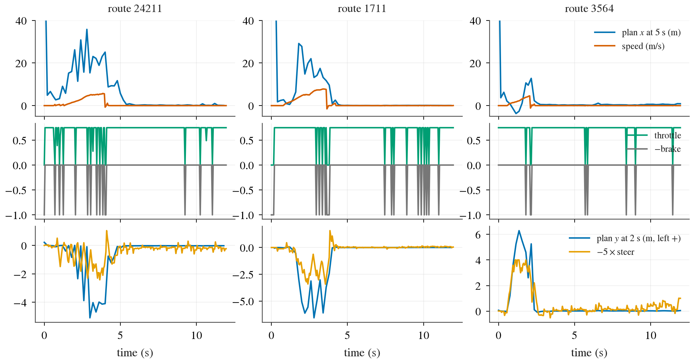
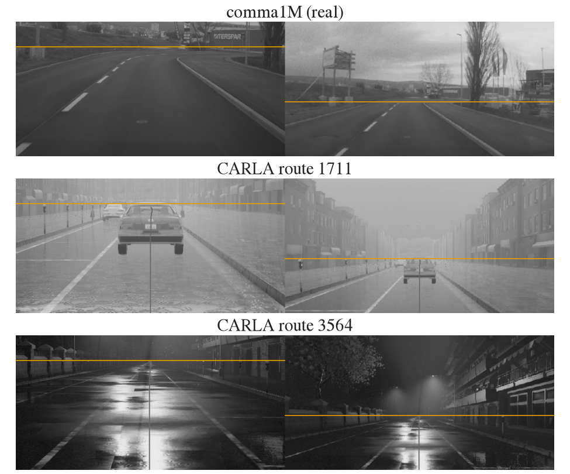
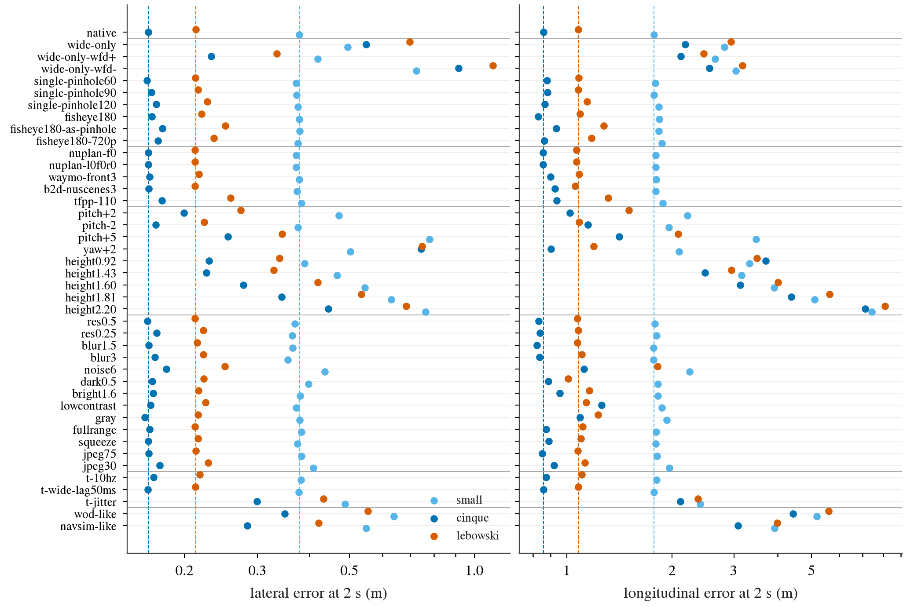
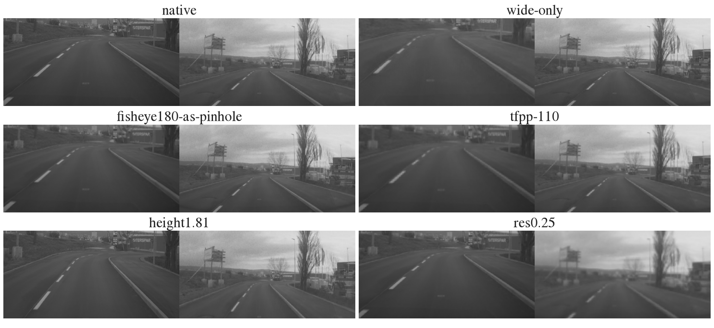

# openpilot 迁移计划：从 comma 车到闭环仿真器和别的相机 rig

状态: A 诊断完成、修复已实现；控制器已定（Zoo 官方 PID，D 节），smoke 与全量已排进 slot `op-b2d-smoke` / `op-b2d-full`；B 在 comma1M 与 WOD-E2E 上完成；C 见下
主题: ../../research/openpilot-and-open-driving-models.md、../../research/trajectory-to-control.md
相关: [openpilot smoke](../2026-09-24-openpilot-smoke/README.md)、[B2D 考试](bench2drive.md)、[WOD-E2E 考试](wod-e2e.md)、
[NAVSIM 考试](navsim.md)、[控制器 API](../../docs/b2d-controller.md)

## 结论先行

- **CARLA 失败的根因是适配 bug，不是模型看不懂 CARLA。** bug 1：plan 的原点在相机，适配器只平移了 1.78 m 就交给吃后轴轨迹的
  固定控制器，于是 t = 0 的点落在车头前 1.78 m，控制器读成 7.1 m/s 的速度指令；模型说“停着”的 tick 里 95.6% 在踩油门，
  5 条路线都是车被油门从静止拖起来之后 plan 才开始左右绕行（有前车的路线上此时离前车只剩 3–5 m），车冲出车道。bug 2：`sensor_tick = 0.2` 让 road / wide
  最多差 3 帧、context 间隔在 3–5 帧之间抖，comma1M 上同等抖动让横向误差 +83%。另外路线开头 feature 队列（模型自己的 5 s 隐状态历史）为空，第一次 plan
  的 5 s 距离是 85–90 m。三项都已修（后轴变换、每步渲染同帧配对、5 s 预热），记为偏离；warp、calibration、YUV、符号都查过是对的。
- **修复后的 DS（Driving Score，Bench2Drive 的闭环总分）暂缺**：用户在调固定控制器，CARLA 复跑推迟，7 个阶段（含 shadow mode：route oracle 开车、模型只出 plan 不控制的开环评测和 CARLA 真 3D 高度对照）
  已写成 `scripts/zeroshot_b2d_opfix.sh`，控制器定版后约 3 h 机时。
- **换 rig 基本不伤**（comma1M 8 段真实视频上合成，Cinque native 横 / 纵 0.16 / 0.86 m）：一台 60–120° pinhole、
  180° 鱼眼、nuPlan F0、Waymo 前三路拼接、nuScenes 式前三路、TF++ 式 110° 单相机，横向都在 +8% 以内；鱼眼不去畸变
  直接当 pinhole 用也只 +8%。这和“真车上一台鱼眼替两台中焦相机也能开”的经验一致。
- **真正伤的是朝向、时序和 NAVSIM 的时间轴**：yaw 标定错 2° 横向 ×4.6；帧时刻抖动横向 +83%、纵向 +146%；NAVSIM 式
  2 Hz sample-and-hold（每张 2 Hz 帧一直重复喂到下一张到来）加 1.5 s 历史横向 ×9、纵向 ×25（同样 1.5 s 历史但 20 Hz 只 +8% / +23%）。用 wide 相机单独喂
  road frame 时必须带上它的 `wide_from_device` 外参（不带横向 +236%，带上 +42%）。
- **安装高度在真实数据上不重要**：comma1M 的地面平面仿真里 1.81 m 纵向 +410%，但 WOD 真实 1.81 m 车顶相机上 5 s 纵向
  偏差只有 +0.29 m；用地面平面把视角虚拟降到 1.22 m 反而 RFS（Rater Feedback Score，WOD-E2E 主指标，0–10）−0.45 [−0.66, −0.24]（Lebowski）。所以不做虚拟降高，1.4–1.8 m 直接用。
- **推荐接法**：CARLA 一台 120° 相机或 road + wide 两台、每步渲染、后轴变换、5 s 预热、固定控制器；NAVSIM 必须回到
  nuPlan 原始 10 Hz 相机（现在的 2 Hz 输入基本不代表模型）；WOD-E2E 保持现状（FRONT 单相机与三路拼接 RFS 无差别）；
  HUGSIM 要先确认能按 ≥ 10 Hz 给帧；真车换 rig 的关键是 yaw / pitch 标定到 0.5° 以内。
- 全量 220 条（修复后）估计 4 worker 4–5.5 h、6 worker 2.5–3.5 h，约 30–42 GB，待控制器定版和用户批准。

## A. CARLA 里为什么 5 条路线都在 10 m 内驶出车道

下文的 model frame 指 openpilot 真正输入网络的 512×256 图（road 一张、wide 一张），由相机原图按 calibration 做透视 warp 得到；
calib frame 是与路面对齐的车体坐标系（x 前、y 右、z 下），plan 就表达在这个坐标系里、原点在相机。

预注册 smoke（[bench2drive.md](bench2drive.md)）里 openpilot Lebowski 5/5 条路线在起步后 5–10 m 内冲出车道、撞静物、
被判 blocked，DS 2.7。这里用 smoke 留下的逐次规划日志（`plans.jsonl`：每次 5 Hz 规划的输入帧号、plan、desired
curvature/accel）和逐 tick 日志（`ticks.jsonl`：throttle/steer/brake、速度）逐帧复盘，再对照 comma1M 真实视频上的离线
实验（B 部分）定位原因。结论是**两个适配 bug 加一个冷启动问题**，模型本身在 CARLA 画面上并没有“看不懂路”的证据。

### A1. 逐项排查

| 检查项 | 方法 | 结果 | 判定 |
|---|---|---|---|
| warp 与 calibration | CARLA model frame 与 comma1M model frame 并排，看地平线行（road 47.6、wide 151.8） | 地平线、消失点、车道线走向都在同一位置（图 2）；CARLA 相机水平安装、rpy = 0 就是 calib frame | 正确 |
| warp 实现 | 我们的 warp 索引与 modeld `_nn_index` 逐像素比较 | luma / chroma 索引 0 个不同；`0045b4fe` 前 5 帧的 model frame 与 smoke 缓存的 `model_frames.npy` 逐字节一致 | 正确 |
| YUV 转换 | B2D 用 BT.601 limited range，WOD/NAVSIM 用 JPEG 的 full range；在 comma1M 上把 range 故意弄错（`fullrange` / `squeeze`） | 横向 2 s 误差 0.212 → 0.211 / 0.212 m | 无影响 |
| plan 与 curvature 的符号 | smoke 里车速 > 2 m/s 且 |plan y@2s| > 0.5 m 的 36 次规划 | desired curvature 与 plan 的左右一致 94%，与车实际转向一致 89%，r = 0.77 | 正确 |
| **plan 原点（bug 1）** | plan 在相机处，适配器只做了 x + 1.78 m | 起点被放到后轴前 1.78 m，控制器把它读成 0.25 s 内要走 1.78 m，即 **7.1 m/s 的速度指令**。模型给出“停着”（5 s 内前进 < 3 m）的 6070 个 tick 里 **95.6% 仍在踩油门**；5 条路线都在第 4–7 次规划（车静止、模型要求停车）时被油门拖着起步 | **bug，已修** |
| **相机时序（bug 2）** | `plans.jsonl` 里每次规划的 road / wide 帧号 | `sensor_tick = 0.2` 让 road 与 wide 在 1–83% 的规划里差 1–3 帧（2390 起步时差 3 帧），road 自身间隔不等于 4 帧的比例 1–21%。comma1M 上同等程度的抖动（20% 帧提前或推后 50 ms，`t-jitter`）让 Cinque 横向误差 0.212 → 0.412 m、纵向 1.03 → 2.26 m | **bug，已修** |
| 队列冷启动 | 路线开始时 feature 队列为空 | 第一次规划的 5 s 处 x 为 85–90 m（3 条路线都这样，图 1 最左端），之后 0.2 s 内回到正常；comma1M 上只有 1.5 s 历史（`t-cold-1.5s`）时纵向 1.03 → 1.41 m | 小因素，加 5 s 预热 |
| 相机高度 | 1.43 m（为避开深色挡风玻璃，比 comma 名义 1.22 m 高） | comma1M 的地面平面仿真里抬到 1.43 m 纵向误差 1.03 → 2.95 m；但 WOD 真实 3D 数据（1.81 m）上纵向几乎无偏（见 B4），所以真实效应远小于仿真 | 次要，待 `shadow-h*` 核实 |
| 控制器 | 用 smoke 的 plan 离线重放固定控制器 | 重放出的方向盘锯齿与日志同相、幅度相当（重放用 5 Hz 位姿差分近似 yaw rate，逐 tick 差到 0.2），右打方向完全来自 plan 本身；5 Hz 更新带来的 D 项尖峰不是主因 | 正常 |

bug 1 是决定性的。它的连锁是：模型看到前方有停着的车（1711、24211）或还在等待（2390、2373），plan 给出“原地不动”；
适配器把相机原点当成后轴原点，控制器看到的是一条起点在车头前 1.78 m 的轨迹，于是全油门起步；车一动，模型从两帧的
光流里看到自己在加速，plan 随之拉长（图 1 第一行，plan x 从 5 m 涨到 25–35 m），同时离前车越来越近，plan 开始向右或向左
绕（第三行，plan y@2s 到 −5 ~ +6 m），控制器照着转向，车冲上人行道或撞到护栏。所有 smoke 里看到的“5 Hz 之间在直行和
急转之间来回跳”都出现在这段被强行起步、离前车 3–5 m 的时间里；在正常行驶的 comma1M 视频上同一个相位链是平滑的。



图 1：预注册 smoke 三条路线开头 12 s（24211、1711、3564）。第一行：plan 在 5 s 处的纵向距离（蓝，相机坐标，≈ 0 即
模型要求停车）与车速（橙）；第二行：油门与刹车；第三行：plan 在 2 s 处的横向位置（左正）与 −5×steer。看第二行：
模型要停时油门几乎一直是 0.75（上限），车被拖着起步，plan 随后才开始拉长并左右绕行，转向跟着 plan 走。



图 2：模型真正看到的 road（左半）与 wide（右半）model frame 的亮度通道，上为 comma1M 真实视频，下两行是 smoke 里
CARLA 的输入（1711 雨天白天、3564 雨夜；竖线是当时的 plan 投影）。橙线是两个 frame 的名义地平线行，CARLA 的消失点
和车道走向与真实视频一致，说明内参、外参和 warp 是对的；差别在外观（雨、雾、夜景的反光）。

### A2. 修复与需要的变换

所有修复都做成 `scripts/b2d_zeroshot_agent.py` 的配置开关，默认值复现预注册 smoke，修复版显式打开：

| 开关 | 预注册 smoke | 修复版 | 理由 |
|---|---|---|---|
| `plan_origin` | `camera`：rig = plan + d | `rear`：**rear(t) = d + p(t) − R(ψ_t)·d** | 见下 |
| `op_camera_tick` | 0.2 s（CARLA 自己挑触发帧） | 0.05 s，每个仿真步都渲染，规划只在 road 与 wide 帧号相同的帧上做，5 Hz context 严格是 4 帧 | bug 2 |
| `warmup_s` | 0 | 5.0：从第一组图开始先喂 5 s（25 个 context 步），期间刹车保持、plan 不进控制器 | 真车上 openpilot 在 modeld 跑起来之后才会被接管；冷启动第一帧 plan 不可用 |
| `drive` | `model` | `model`；另有 `oracle`（shadow mode：route oracle 开车，openpilot 只记录 plan，用来在 CARLA 画面上做开环评测） | 诊断用 |
| `op_mount` | [1.779, 0, 1.433] | 同左（高度问题见 C1） | — |
| `lateral` | `plan` | `plan`；另有 `curvature`（exploratory：模型 desired curvature 经单车模型直接转 steer） | 控制器对照用，不计分 |

plan → 控制器参考系的正确变换。openpilot 的 plan 是 calib frame（x 前、y 右、z 下）里**相机**在 t 时刻的位置 p(t) 和
朝向 ψ(t)（右正）；固定控制器要的是**后轴**在 t 时刻的位置、x 前 y 左。设相机在后轴系的位置 d = (1.779, 0)，车体
刚体运动下后轴位置 = 相机位置 − R(ψ_t)·d，写成后轴系：

    q(t) = (p_x(t), −p_y(t)),  ψ'(t) = −ψ(t)
    rear(t) = d + q(t) − R(ψ'(t)) · d

t = 0 时 rear = 0，所以模型的“停车”（p(t) ≈ 0）变成一条零长度轨迹，控制器进入 `stop_hold`，这和 openpilot 自己的
语义一致：它的纵向在 `should_stop`（plan 速度在 0–1 s 内都低于停车阈值）时直接刹停，而不是去追一个非零的起点。
这就是 WOD 考试里已经在用的 `jevdrive.wod_zeroshot.openpilot_to_wod`，B2D 适配器当时漏掉了后一半。

**这些修复在预注册的口径下都属于适配 bug 的修复（预注册第 7 节允许，并要求重跑受影响的 smoke），记为偏离，不是调分**：
它们都不看分数，只让输入输出的语义与 openpilot 在自己车上的一致。

### A3. 修复后的复跑：推迟

用户在调固定控制器（`Controller(preset="carla")`），现在的闭环分数会和控制器改动混在一起，所以 **CARLA 复跑推迟**，
修复前后的 DS / RC（route completion，路线完成比例）对比暂时没有。复跑的全部阶段已写好（`scripts/zeroshot_b2d_opfix.sh`，同样的 5 条预注册路线、TM seed 0），
控制器定版后直接跑：

| 阶段 | 配置 | 回答什么 |
|---|---|---|
| `shadow` | 修复版输入，oracle 开车 | CARLA 画面上 openpilot 的开环误差（与 comma1M 的 0.21 m 直接比），把“画面域差”与“闭环”分开 |
| `fixed` | 全部修复 | 修复后的 DS / RC（主结果，对照 smoke 的 2.7 / 5.6） |
| `origin-only` | 只修 bug 1 | 把 DS 的变化归因到 bug 1 还是 bug 2 + 预热 |
| `shadow-h122`、`shadow-h181` | 相机高 1.22 m（放在车头前沿 x = 3.8 m，看不到发动机盖）/ 1.81 m | CARLA 真 3D 下的高度效应，对照 B4 |
| `curvature`、`cinque` | exploratory | 控制器形式与模型大小，不进主结论 |

每阶段 1 个 CARLA worker（约 6.5 GB）+ 1 个 openpilot server（≤ 3.4 GB），5 条路线约 20–30 min，七个阶段合计约 3 h。
逐帧诊断用 `scripts/zeroshot_b2d_openpilot_diag.py`（plan 对真值轨迹的 1/2/4 s 横纵向误差、signed 纵向偏差、curvature 相关、
相邻规划的符号翻转率）。

## B. 相机 rig 鲁棒性

### B1. 方法

问题是：把 comma 的 road + wide 两台相机换成别的 rig、别的安装位置或别的图像管线，模型输出会差多少。在真实视频上
回答它，需要一个“同一段路、换一套相机”的数据源；我们用 comma1M 的原始两路视频合成别的 rig
（`jevdrive/openpilot/rigsim.py`），每个 model frame 像素走两步：

1. **物理**：虚拟 rig 的像素射线到 comma 源图取值。road frame 的信息取自 fcam（焦距 2648 px），wide frame 取自 ecam
   （567 px，高于 wide frame 的 455 px）；虚拟相机比源更粗时先按面积平均降采样到虚拟相机的焦距（粗像素积分光），
   再双线性采样；超出一路源图视场的射线从另一路补。安装高度的改变用地面平面近似：路面像素精确，路面上的物体被“压平”，
   地平线以上的射线不变。
2. **适配器**：model frame 像素 → 虚拟 rig 像素，按迁移时真正会用的做法：纯旋转重投影（假设景物在无穷远），多相机时取
   光轴最近的那一台，最近邻采样，chroma 按 modeld 的 (2x, 2y) 规则。适配器对 rig 的“认知”可以和真实 rig 不同，
   用来模拟标定误差（yaw/pitch 错）和“鱼眼当 pinhole 用”。

comma 的 wide 相机本身是鱼眼，openpilot 按 pinhole（焦距 567）处理，这里保持同样的约定，所以 **native 这一行与
modeld 的输入逐字节相同**（索引 0 差异、帧 0 差异，见 A1），其他每一行都是相对于“模型训练时看到的东西”的变化。
时序类变体不改像素，只改每一步喂哪一帧；`t-navsim-2hz-1.5s` 与 `t-cold-1.5s` 每 10 帧从零状态重跑 1.5 s。

评测与 openpilot smoke 相同（`scripts/openpilot_replay.py` 的口径）：plan 在 2 s / 4 s 处的横向与纵向位置与 localizer 真值
未来轨迹的平均绝对误差，每段前 100 帧不计。数据是 comma1M 的 8 段一分钟视频：smoke 用过的 4 段（按转弯量挑的）加上
按 seed 0 从其余 51 段可用段里随机抽的 4 段（`scripts/fetch_comma1m.py --random-extra 4`）。Cinque 在 8 段上评测
（n = 8800 帧），small 和 Lebowski 在前 4 段上（n = 4400 帧）；相对变化都是同一模型、同一批帧上与 native 的比值。
共 44 个变体 × 3 个模型，GPU 与 NAVSIM 共享，约 3 h 机时。

### B2. 结果

| 变体 | 含义 | Cinque lat@2s (m) | Cinque lon@2s (m) | Cinque lat@4s | small lat / lon @2s | Lebowski lat / lon @2s |
|---|---|---:|---:|---:|---:|---:|
| native | comma road + wide（modeld 原样） | 0.16 (+0%) | 0.86 (+0%) | 0.71 | 0.38 / 1.77 | 0.21 / 1.08 |
| wide-only | 一台 comma wide 相机喂两路（openpilot 的 wide-only 模式） | 0.55 (+236%) | 2.18 (+154%) | 1.45 | 0.50 / 2.82 | 0.70 / 2.94 |
| wide-only-wfd+ | 同上，road frame 带上 wide 相机外参（+ 号） | 0.23 (+42%) | 2.11 (+147%) | 0.92 | 0.42 / 2.66 | 0.33 / 2.46 |
| wide-only-wfd- | 同上，外参取 − 号 | 0.92 (+461%) | 2.55 (+198%) | 2.17 | 0.72 / 3.04 | 1.11 / 3.17 |
| single-pinhole60 | 一台 60° pinhole，1920×1080 | 0.16 (-1%) | 0.88 (+2%) | 0.71 | 0.37 / 1.79 | 0.21 / 1.08 |
| single-pinhole90 | 一台 90° pinhole | 0.17 (+2%) | 0.88 (+3%) | 0.72 | 0.37 / 1.78 | 0.22 / 1.08 |
| single-pinhole120 | 一台 120° pinhole | 0.17 (+4%) | 0.87 (+1%) | 0.75 | 0.38 / 1.83 | 0.23 / 1.14 |
| fisheye180 | 一台 180° 等距鱼眼 1920×1080，正确去畸变 | 0.17 (+2%) | 0.83 (-3%) | 0.74 | 0.38 / 1.83 | 0.22 / 1.09 |
| fisheye180-as-pinhole | 同上，但适配器当 pinhole 用 | 0.18 (+8%) | 0.93 (+9%) | 0.77 | 0.38 / 1.83 | 0.25 / 1.28 |
| fisheye180-720p | 180° 鱼眼 1280×720 | 0.17 (+6%) | 0.86 (+1%) | 0.77 | 0.38 / 1.87 | 0.24 / 1.17 |
| nuplan-f0 | nuPlan / NAVSIM CAM_F0（63.7°） | 0.16 (-0%) | 0.86 (-0%) | 0.71 | 0.37 / 1.79 | 0.21 / 1.07 |
| nuplan-l0f0r0 | nuPlan L0/F0/R0 拼接 | 0.16 (-0%) | 0.86 (-0%) | 0.71 | 0.37 / 1.79 | 0.21 / 1.07 |
| waymo-front3 | Waymo FRONT/FRONT_LEFT/FRONT_RIGHT 拼接（47°×3） | 0.16 (+1%) | 0.90 (+5%) | 0.72 | 0.38 / 1.80 | 0.22 / 1.08 |
| b2d-nuscenes3 | nuScenes 式前三路（70°，±55°） | 0.16 (+0%) | 0.93 (+8%) | 0.72 | 0.37 / 1.79 | 0.21 / 1.06 |
| tfpp-110 | TF++ 式单相机 110°，1024×512 | 0.18 (+8%) | 0.94 (+9%) | 0.79 | 0.38 / 1.88 | 0.26 / 1.31 |
| pitch+2 | 相机上仰 2°，适配器不知道 | 0.20 (+22%) | 1.02 (+19%) | 0.83 | 0.47 / 2.21 | 0.27 / 1.51 |
| pitch-2 | 下俯 2° | 0.17 (+4%) | 1.15 (+34%) | 0.74 | 0.38 / 1.96 | 0.22 / 1.09 |
| pitch+5 | 上仰 5° | 0.25 (+56%) | 1.41 (+65%) | 0.97 | 0.78 / 3.47 | 0.34 / 2.08 |
| yaw+2 | 右偏 2° | 0.75 (+356%) | 0.90 (+5%) | 1.78 | 0.50 / 2.09 | 0.75 / 1.19 |
| height0.92 | 安装高 0.92 m（地面平面仿真） | 0.23 (+40%) | 3.70 (+331%) | 0.97 | 0.39 / 3.32 | 0.34 / 3.49 |
| height1.43 | 1.43 m（CARLA 挡风玻璃上沿） | 0.23 (+38%) | 2.48 (+189%) | 0.92 | 0.47 / 3.15 | 0.33 / 2.95 |
| height1.60 | 1.60 m | 0.28 (+69%) | 3.13 (+265%) | 1.10 | 0.54 / 3.91 | 0.42 / 4.01 |
| height1.81 | 1.81 m（Waymo 车顶） | 0.34 (+110%) | 4.38 (+410%) | 1.33 | 0.63 / 5.10 | 0.53 / 5.62 |
| height2.20 | 2.20 m | 0.45 (+172%) | 7.12 (+731%) | 1.71 | 0.76 / 7.42 | 0.69 / 8.10 |
| res0.5 | 两路分辨率减半 | 0.16 (-1%) | 0.83 (-3%) | 0.71 | 0.37 / 1.79 | 0.21 / 1.07 |
| res0.25 | 两路分辨率 1/4 | 0.17 (+5%) | 0.84 (-2%) | 0.74 | 0.36 / 1.80 | 0.22 / 1.08 |
| blur1.5 | 高斯模糊 σ 1.5 px | 0.16 (+0%) | 0.82 (-4%) | 0.71 | 0.36 / 1.77 | 0.21 / 1.07 |
| blur3 | σ 3 px | 0.17 (+4%) | 0.84 (-2%) | 0.72 | 0.36 / 1.77 | 0.22 / 1.10 |
| noise6 | 亮度噪声 σ 6 | 0.18 (+11%) | 1.12 (+31%) | 0.80 | 0.44 / 2.24 | 0.25 / 1.82 |
| dark0.5 | 亮度 ×0.5 | 0.17 (+2%) | 0.89 (+3%) | 0.73 | 0.40 / 1.82 | 0.22 / 1.01 |
| bright1.6 | 亮度 ×1.6（截断） | 0.17 (+3%) | 0.95 (+11%) | 0.73 | 0.38 / 1.82 | 0.22 / 1.16 |
| lowcontrast | 对比度 ×0.6 | 0.17 (+1%) | 1.26 (+47%) | 0.73 | 0.37 / 1.87 | 0.22 / 1.14 |
| gray | 去掉色度 | 0.16 (-2%) | 1.09 (+27%) | 0.72 | 0.38 / 1.93 | 0.22 / 1.23 |
| fullrange | limited range 当 full range 用 | 0.16 (+1%) | 0.87 (+2%) | 0.70 | 0.38 / 1.80 | 0.21 / 1.11 |
| squeeze | 反过来压缩 | 0.16 (-0%) | 0.89 (+4%) | 0.71 | 0.37 / 1.80 | 0.22 / 1.10 |
| jpeg75 | JPEG 质量 75 | 0.16 (+0%) | 0.85 (-1%) | 0.70 | 0.38 / 1.81 | 0.21 / 1.08 |
| jpeg30 | JPEG 30 | 0.17 (+6%) | 0.92 (+7%) | 0.75 | 0.41 / 1.96 | 0.23 / 1.13 |
| t-10hz | 10 Hz 源，每帧喂两次（WOD 做法） | 0.17 (+3%) | 0.87 (+2%) | 0.73 | 0.38 / 1.80 | 0.22 / 1.10 |
| t-wide-lag50ms | wide 比 road 晚 50 ms | 0.16 (-0%) | 0.86 (+0%) | 0.71 | 0.38 / 1.78 | 0.21 / 1.08 |
| t-jitter | 20% 的帧早或晚 50 ms（CARLA sensor_tick） | 0.30 (+83%) | 2.11 (+146%) | 1.18 | 0.49 / 2.40 | 0.43 / 2.37 |
| t-cold-1.5s | 零状态，只有 1.5 s 历史（20 Hz） | 0.18 (+8%) | 1.05 (+23%) | 0.79 | 0.39 / 1.71 | 0.33 / 2.04 |
| t-navsim-2hz-1.5s | 零状态，1.5 s 的 2 Hz 帧 sample-and-hold（NAVSIM 考试做法） | 1.47 (+798%) | 21.54 (+2412%) | 4.82 | 1.49 / 15.07 | 1.96 / 15.56 |
| wod-like | Waymo 三路 + 1.81 m + JPEG 75 | 0.35 (+113%) | 4.42 (+416%) | 1.34 | 0.64 / 5.18 | 0.55 / 5.59 |
| navsim-like | nuPlan F0 + 1.60 m + JPEG 75 | 0.28 (+73%) | 3.08 (+260%) | 1.10 | 0.55 / 3.92 | 0.42 / 3.99 |

读法：括号里是相对 native 的变化。**一台相机、鱼眼、多相机拼接、分辨率、模糊、颜色、JPEG 基本都在 ±10% 以内**；
变大的只有四类：朝向标定（yaw 2° 横向 ×4.6，pitch ±2° 纵向 +20–34%）、时序（抖动横向 +83%、2 Hz 采样彻底失效）、
wide 相机单独充当 road 相机时没带上它自己的外参（横向 +236%，带上之后降到 +42%），以及地面平面仿真下的安装高度
（下一节解释为什么这一项在真实数据上并不成立）。三个模型的排序在每一行上都一致，大模型对 rig 变化并不更敏感。



图 3：每个变体的 2 s 横向（左）与纵向（右）误差，对数轴，三种颜色是三个模型，虚线是各自的 native。
看两件事：单相机 / 鱼眼 / 拼接 / 图像管线这几组的点几乎都压在虚线上；离开虚线的是 yaw、pitch、高度、抖动和 NAVSIM 式
时间轴。`t-navsim-2hz-1.5s` 与 `t-cold-1.5s` 只在每 10 帧上评测，不画在图里，数字在表中。



图 4：同一帧（comma1M `042d2870`，第 600 帧）在六种 rig 下的 road | wide model frame。wide-only 的 road frame 整体偏移
（ecam 相对 device 有约 2° 的 yaw），鱼眼当 pinhole 时 wide frame 边缘被压缩，TF++ 式 110° 单相机与 res0.25 的 road frame
明显变糊，1.81 m 的地面平面仿真把近处路面“拉远”。模型对后三者几乎不敏感，对前一种很敏感。

### B3. 单相机与鱼眼：和真车经验一致

用户在真车上把两台中焦相机换成一台广角鱼眼屏幕相机、模型仍能开。这里的对应行是 `fisheye180`（1920×1080 的 180° 等距
鱼眼，按真实鱼眼模型去畸变后喂两路）：Cinque 横向 +2%、纵向 −3%；即使**不去畸变**、把鱼眼当 pinhole 直接喂
（`fisheye180-as-pinhole`，wide frame 边缘有 9% 的桶形压缩），也只多 8–9%；720p 的鱼眼 +6%。原因在几何上：road frame
只看 ±16°，这个范围内 f·θ 与 f·tanθ 只差 2.4%；wide frame 看 ±30°，差 9%，模型本来就在 comma 自己的鱼眼 wide 相机上
被这样“错误地”当作 pinhole 训练过。road frame 的分辨率从 910 px/rad 降到 350–550 px/rad（120° pinhole、180° 鱼眼、
TF++ 110°）也只带来 +4–8%。

真正会伤的是朝向：wide-only 这一行就是“一台 wide 相机喂两路”，横向误差 ×3.4，原因不是鱼眼也不是分辨率，
而是 ecam 相对 device 的 1–2° 外参（`wide_from_device_euler`）没有进 road frame 的 warp：把它按 + 号约定加上
（`wide-only-wfd+`）横向回到 +42%，按 − 号加上（`wide-only-wfd-`）更糟（+461%），这同时确定了这个外参的符号约定。
剩下的纵向 +147% 在 signed 分析里是速度低估约 9%（plan 距离 / 真值 = 0.92），推测来自 ecam 焦距标称值 567 的误差
（openpilot 源码自己的注释：“focal length probably wrong? magnification is not consistent across frame”）。

### B4. 安装高度：仿真说很重要，真实数据说不重要

地面平面仿真里高度是最大的因素：Cinque 1.43 m 纵向 +189%，1.81 m +410%，2.20 m +731%；signed 分析显示这是一致的
速度低估，plan 距离 / 真值从 1.01（native）降到 0.89（1.43 m）、0.82（1.81 m）、0.72（2.20 m），0.92 m 则高估到
1.13（本节末的 signed 表）。这正是“模型用路面光流、按 1.22 m 的相机高度换算速度”时应有的方向，偏离幅度约为纯光流预期
（1.22/h）的 40–75%。

但仿真把路面上的物体压平了，真实世界里车、行人、车道宽度都还提供尺度。WOD-E2E 的相机真的装在 1.81 m 的车顶，
所以用它的 479 个 rater 帧直接检验（`scripts/wod_openpilot_rigs.py`，与 WOD 考试完全相同的输入，只改 model frame 的构造，
配对 bootstrap 5000 次）：

| 模型 | 变体 | 含义 | RFS（cluster mean） | RFS frame mean | Δ frame mean vs base [95% CI] | ADE@5s vs rater_best (m) | 5 s 纵向偏差 (m) | 同上，起始车速 > 5 m/s |
|---|---|---|---:|---:|---|---:|---:|---:|
| cinque | base | WOD 考试输入：三路拼接，相机 1.81 m | 8.005 | 7.942 | — | 2.46 | +0.85 | +2.08 |
| cinque | front-only | 只用 FRONT，wide frame 两侧黑 | 7.981 | 7.924 | -0.017 [-0.091, +0.059] | 2.44 | +0.96 | +2.69 |
| cinque | h1.52 | 地面平面虚拟降到 1.52 m | 8.050 | 7.985 | +0.043 [-0.086, +0.175] | 2.69 | +2.68 | +5.63 |
| lebowski | base | WOD 考试输入：三路拼接，相机 1.81 m | 7.886 | 7.805 | — | 2.67 | +0.29 | +0.64 |
| lebowski | front-only | 只用 FRONT，wide frame 两侧黑 | 7.858 | 7.822 | +0.017 [-0.054, +0.088] | 2.72 | -0.04 | +0.30 |
| lebowski | h0.92 | 虚拟降到 0.92 m | 6.364 | 6.308 | -1.497 [-1.727, -1.264] | 4.91 | +8.04 | +16.15 |
| lebowski | h1.22 | 虚拟降到 1.22 m（comma 名义高度） | 7.403 | 7.356 | -0.449 [-0.661, -0.242] | 3.39 | +4.48 | +8.53 |
| lebowski | h1.52 | 地面平面虚拟降到 1.52 m | 7.993 | 7.952 | +0.148 [+0.010, +0.295] | 2.70 | +2.38 | +4.75 |

表：WOD-E2E val 的 479 个 rater 帧，每个模型 10 s 预热、与考试完全相同的输入管线；Δ 是配对的逐帧 RFS 差，bootstrap 5000 次。base 两行与考试主表一致（Cinque 8.005、Lebowski 7.886），说明管线逐字节复现。

读法：base 就是 WOD 考试的输入（逐字节复现了考试的预测）。**真实 1.81 m 下 Lebowski 5 s 纵向偏差只有 +0.29 m**，
没有仿真预言的 −4 m 以上的低估；如果真存在那样的低估，把视角用地面平面虚拟降到 1.22 m 应该改善，实际上 RFS 掉
0.45、纵向偏到 +4.5 m（过度补偿），降到 0.92 m 更糟。只降 0.29 m 到 1.52 m 时 Lebowski RFS +0.15（CI 刚好不含 0）、Cinque +0.04（CI 含 0），两者的纵向偏差都同时变成
+2.4–2.7 m，我们不把它当作可推荐的修正（在测试集上挑高度等于调分）。FRONT 单相机（wide frame 两侧 ±23.5° 以外全黑）
与三路拼接在两个模型上都没有可分辨的差别（Δ −0.02 / +0.02，CI 都含 0）。

结论：comma1M 上的高度仿真测到的是“路面几何被一致地缩放时模型怎么反应”，不是真实安装高度的效应；在真实 3D 场景
里，1.8 m 的安装高度对 openpilot 几乎没有影响。CARLA 里的 `shadow-h122` / `shadow-h181` 两个阶段会在渲染的真 3D 场景里
再测一次。

| 变体 | 纯光流预期 1.22/h | Cinque plan/真值 | Cinque lon 偏差 (m) | Cinque lat 偏差 (m) | small plan/真值 | Lebowski plan/真值 |
|---|---:|---:|---:|---:|---:|---:|
| native | – | 1.011 | +0.26 | +0.00 | 0.983 | 0.983 |
| height0.92 | 1.326 | 1.125 | +3.84 | +0.03 | 1.112 | 1.124 |
| height1.43 | 0.853 | 0.893 | -2.25 | -0.02 | 0.893 | 0.891 |
| height1.60 | 0.762 | 0.866 | -3.09 | -0.05 | 0.861 | 0.834 |
| height1.81 | 0.674 | 0.824 | -4.47 | -0.05 | 0.803 | 0.765 |
| height2.20 | 0.555 | 0.716 | -7.42 | -0.05 | 0.703 | 0.667 |
| wide-only | – | 0.924 | -1.95 | -0.27 | 0.934 | 0.893 |
| wide-only-wfd+ | – | 0.924 | -1.93 | -0.08 | 0.939 | 0.913 |
| pitch+2 | – | 0.997 | -0.06 | -0.02 | 0.941 | 0.981 |
| pitch+5 | – | 0.986 | -0.39 | -0.05 | 0.907 | 0.945 |
| yaw+2 | – | 1.008 | +0.12 | -0.73 | 0.977 | 0.982 |
| noise6 | – | 0.994 | -0.33 | +0.02 | 0.976 | 0.959 |
| t-jitter | – | 1.009 | -0.31 | +0.00 | 0.977 | 0.987 |

表：signed 读数（2 s 处，车速 > 3 m/s 的帧；Cinque n = 7939，small / Lebowski n = 4030）。plan/真值是 plan 纵向距离与真实纵向距离之比的中位数，<1 即模型低估自车速度；lat 偏差为正即偏右。高度一组的比值随高度单调变化，方向与纯光流预期一致、偏离 1 的幅度约为纯光流预期的 40–75%；yaw 右偏 2° 表现为约 0.7 m 的恒定偏左（模型看到的世界向左转了 2°）。

## C. 迁移计划：每个目标怎么接

先把 A、B 的证据收成几条通用规则，再分目标写。规则里的数字都是 Cinque 在 comma1M 上的横向 / 纵向 2 s 误差（native
0.16 / 0.86 m），或 WOD 真实数据上的 RFS 配对差。

1. **plan 进控制器之前必须换到控制器的参考点**：rear(t) = d + q(t) − R(ψ'(t))·d（A2）。任何只做平移的适配都会在静止时
   发出一个等于 |d| / Δt 的速度指令。这一条对所有闭环目标都适用。
2. **时间轴要准，频率可以低一半，但不能抖、不能稀**：10 Hz 源、每帧喂两次几乎无损（+3% / +2%）；road 比 wide 晚 50 ms
   无损（±0%）；但 20% 的帧差一个 tick 就把横向误差翻倍（横向 +83%、纵向 +146%）；2 Hz sample-and-hold 加 1.5 s 历史直接失效
   （横向 1.47 m、纵向 21.5 m（native 的 9 倍和 25 倍））。同样只给 1.5 s 历史但 20 Hz 连续喂，只掉到 +8% / +23%，所以致命的是 2 Hz，不是历史短。
3. **一台相机就够**：只要这台相机覆盖 ±30° 水平、+18°/−13° 垂直（wide model frame 的视场），并且在 ±16° 以内有不低于
   约 900 px/rad 的分辨率就更好；60°–120° pinhole、180° 鱼眼（按真实鱼眼模型去畸变）、nuPlan F0、Waymo 前三路拼接、
   nuScenes 式前三路、TF++ 式 110° 单相机，横向误差都在 native 的 +10% 以内（B1、B2）。把鱼眼当 pinhole 直接喂
   （不去畸变）只多 +8% / +9%。这和“真车上把两路换成一台鱼眼屏幕相机也能开”的经验一致。
4. **朝向标定比什么都重要**：yaw 错 2° 横向误差 ×4.6，pitch 抬 2° 横纵向都掉 30% 以上（B3）。用 wide 相机单独喂
   road frame 时必须带上 wide 相机自己相对 device 的外参（`wide_from_device`，按 + 号约定），否则横向误差 ×3.4（B1）。
5. **安装高度：真实数据上是次要因素，不要用地面平面做“虚拟降高”**。comma1M 的地面平面仿真说 1.81 m 会让纵向误差 ×5.1，
   但 WOD 真实 3D 数据（1.81 m 车顶相机）上 Lebowski 纵向几乎无偏，而用地面平面把视角虚拟降到 1.22 m 反而让 RFS
   掉 0.45、纵向偏 +4.5 m（B4）。结论：模型在真实场景里不只靠路面光流定尺度，1.4–1.8 m 的安装高度可以直接用；
   地面平面重投影只适合做小幅（≤ 0.3 m）修正，而且要在目标数据上开环验证后再用。
6. **图像管线对横向基本无所谓，纵向对对比度有点敏感**：limited / full range 弄错、JPEG 75 / 30、亮度 ×0.5 / ×1.6、分辨率减半或 1/4、
   模糊都在横向 +6%、纵向 +11% 以内；低对比度（×0.6）纵向 +47%、去色 +27%、亮度噪声 σ 6 +31%（B2）。
7. **导航只能靠 desire**：openpilot 没有路线输入。WOD 上它转弯只有 log 的 60% 急（[wod-e2e.md](wod-e2e.md)），
   B2D smoke 里 turn desire 能让 plan 画出转弯但没有验证过能否可靠地把车带进路口。desire 脉冲的有效性需要单独测
   （见 C1 的实验 3）。

### 各目标的推荐接法

| 目标 | 输入构造（推荐） | 已知可行（数字） | 剩余风险 | 导航 | 控制器 | 工作量 |
|---|---|---|---|---|---|---|
| **CARLA / Bench2Drive** | road 40° + wide 119° pinhole 各一台，或一台 120° pinhole 同时喂两路（渲染减半，comma1M 上 +4% / +1%）；**每步渲染**，同帧配对，5 Hz context（Lebowski）或 20 Hz（Cinque）；1.43 m 挡风玻璃外；5 s 预热；plan 按规则 1 变换 | 适配修复已实现；预注册 smoke DS 2.7 是 bug 1 造成的，修复后分数待控制器定版 | CARLA 雨夜外观（smoke 里 5 条有 4 条是雨或夜）；B2D 场景常要求绕过停着的车，openpilot 没有 desire 就不会变道绕行；路口 route deviation | 路口前 20 m 起 turnLeft/Right 脉冲，变道段 laneChange；需实验验证 | 固定控制器吃后轴轨迹（主）；desired curvature → 单车模型 steer 作对照 | 复跑 3 h 机时 + 半天分析 |
| **NAVSIM** | 只用 CAM_F0（nuplan-f0 ≈ native）；**必须回到 nuPlan 原始 10 Hz 相机**，每帧喂两次、≥ 5 s 历史 | comma1M：F0 单相机 ±0%；10 Hz 双喂 +3% / +2% | 现在 NAVSIM 考试用的 2 Hz × 1.5 s 在 comma1M 上是 横向 1.47 m、纵向 21.5 m（native 的 9 倍和 25 倍），分数基本不代表模型；nuPlan 原始传感器数据体量大、要确认 navtest token 都能对上 10 Hz 原始帧 | command → desire（NAVSIM 考试的 `cmd` 变体） | 开环，无 | 下载 + 对齐 1–2 天 |
| **WOD-E2E** | 现状即可：FRONT + FRONT_LEFT/RIGHT 旋转拼接、10 Hz 双喂、10 s 预热；FRONT 单相机也行 | Cinque RFS 8.01、Lebowski 7.89；FRONT-only 与三路拼接 RFS 差 Cinque −0.02 [−0.09, +0.06]、Lebowski +0.02 [−0.05, +0.09]；10 Hz 双喂在 comma1M 上无损 | 高度：不修正最好（B4）；路口意图无法表达 | intent → desire 未测 | 开环，无 | 无需改动 |
| **HUGSIM** | 取其前向相机（nuScenes 式三路时用旋转拼接，comma1M 上 b2d-nuscenes3 +0% / +8%）；要求渲染器按 ≥ 10 Hz 给连续帧 | 无直接数据 | 3DGS 在偏离原轨迹时的伪影；**若闭环只以 2 Hz 给帧，按规则 2 openpilot 会失效**，需先确认 HUGSIM 的步长与能否插帧渲染 | route → desire | 同 B2D | 接口调研半天 + 适配 1 天 |
| **真车，别的 rig** | 一台 ≥ 120° 相机（鱼眼按真实模型去畸变到两个 model frame），20 Hz 稳定帧率；**精确标定 yaw / pitch**（在线标定或静态标定 < 0.5°）；安装高度 1.2–1.8 m 均可 | comma1M 上 fisheye180 +2% / −3%；单相机 120° +4% / +1% | yaw 标定误差（2° 即横向 ×4.6）；帧率抖动；夜间与噪声 | 打灯 desire（openpilot 原生行为） | openpilot 自己的横纵向控制（需车辆接口）或 curvature → 转角 | 取决于车辆接口 |

### C1. CARLA 复跑的具体顺序（控制器定版后）

1. `shadow`：先确认 CARLA 画面上的开环误差。判据：5 条路线合并的 2 s 横向误差若在 comma1M native（0.21 m）的 2 倍以内，
   说明 CARLA 画面本身可用，失败只可能来自闭环；若远大于它，瓶颈是渲染外观，需要换天气 / 时段做对照。
2. `fixed` 与 `origin-only`：修复后的 DS/RC，以及 bug 1 单独能解释多少。
3. desire 有效性：在 `shadow` 的日志里按路口统计“给了 turn desire 之后 3 s 内 plan 的终点方位角是否转向 route 方向”，
   这是纯日志分析，不需要新跑。
4. `shadow-h122` / `shadow-h181`：CARLA 真 3D 下的高度效应，和 WOD 的结论对照。

### C2. Bench2Drive 全量 220 条的估计（修复后，需用户批准才跑）

openpilot 在 B2D 上是仿真 bound（推理 < 20 ms/规划）。smoke 的 s/tick 是 0.06（Town01）到 0.13–0.17（Town12/13），
那时相机 5 Hz 渲染；修复版每步渲染两路 1928×1208，每 tick 多出的渲染时间没有测过，按 +30–60% 估，取 0.15–0.25 s/tick。
每条路线的 tick 数：修复后车会按模型意图开，平均路线 104 m，按 5 s 预热 + 8–10 m/s 行驶 + 路口与场景等待，
中心估计 1000 tick，悲观 1600（被静止障碍卡住、约 60 s 后判 blocked）。建场景 60–140 s/条。

| 配置 | 每条墙钟 | 220 条 worker 时间 | 4 worker | 6 worker | 显存 |
|---|---:|---:|---:|---:|---:|
| 两台相机每步渲染，中心 | 250–350 s | 15–21 h | 4–5.5 h | 2.5–3.5 h | 4×6.5 + 3.4 ≈ 30 GB / 6 worker 42 GB |
| 同上，悲观 | 350–500 s | 21–31 h | 5.5–8 h | 3.5–5 h | 同上 |
| 一台 120° 相机喂两路 | 约 −15% | | 3.5–4.5 h | 2–3 h | 同上 |

跑之前先用 `shadow` 阶段实测每步渲染的 s/tick，再把这张表换成实测值；全量需用户批准。

## D. 控制器换成 Bench2DriveZoo 官方 PID 之后的 smoke 与全量（预注册，写于运行之前，2026-09-25）

**控制器（用户决定，偏离预注册第 3 节）。** 主控制器换成 Bench2Drive(-Zoo) 的 UniAD / VAD / TCP 基线用的官方 PID，
原样运行：`scripts/b2d_zoo_pid.py` 是 Zoo `uniad/vad` 分支 `498c1f7` 的 `team_code/pid_controller.py` 逐字复制
（`PIDController.control_pid`：转向 PID 0.75/0.75/0.3、窗口 40，速度 PID 5/0.5/1、窗口 40，aim point 取中点离原点
最近 4 m 的那段，目标速度 = 相邻 waypoint 平均间距 × 2，desired speed < 0.4 m/s 或实际 > 1.1 倍刹车，油门 ≤ 0.75），
target point 用 Zoo 自带的 `RoutePlanner(4.0, 50.0)`（与 Alpamayo 考试同一条 `controller: zoo_pid` 路径，见
[bench2drive.md](bench2drive.md) 的偏离说明）。输入：openpilot plan 按 A2 的后轴变换后，在 0.5 … 3.0 s 取 6 个点
（UniAD / VAD 的格式），转成 (前, 右)。调用节奏跟着规划：Cinque 每 tick 规划、每 tick 调一次（与 UniAD / VAD 相同）；
Lebowski 5 Hz 规划、每次规划调一次、中间保持控制量（与 AD-MLP 的 2 Hz 相同）。要注意这个控制器在 target point 比
预测的 aim 更“直”、或预测突变而 target 在前方 10 m 内时，**改用路线上的下一个点转向**，也就是说它把一部分路线信息
直接带进了转向；UniAD / VAD 的 Bench2Drive 分数也是这样来的，所以这对 openpilot 是同等待遇，但结果要按“planner +
这个控制器”来读，不能当成 openpilot 自己会走路口。

**配对的次级控制器：openpilot 自己的执行语义（`controller: native`）。** 横向：desired curvature 经单车模型
（轴距 2.86 m、CARLA 的转向曲线、最大转角 70°）换成方向盘，限速率 2/s；纵向：desired accel（按 modeld 做 0.3 s 平滑）
作前馈，除以 MKZ 近似的满油门 / 满刹车加速度（3.0 / 8.0 m/s²），加 0.1 × 加速度误差的比例项（openpilot 的
`LongControl` 默认 ki = 0，基本是纯前馈），静止且 desired accel ≤ 0.2 m/s² 时刹车保持（openpilot 的 should_stop）。
这些数字在任何路线跑之前定死，不调。

**smoke（slot `op-b2d-smoke`，GPU 0，2 个 CARLA worker）**，同样 5 条预注册路线、TM seed 0，五个阶段：

| 阶段 | 模型 | 控制器 | 回答什么 |
|---|---|---|---|
| `zoo-lebowski` | Lebowski（预注册模型） | Zoo PID | 修复 + 新控制器后的主结果，对照 smoke 的 DS 2.7 |
| `zoo-cinque` | Cinque v3 | Zoo PID | 全量用哪个模型 |
| `native-cinque` | Cinque v3 | native | 主 / 次控制器配对 |
| `fixed-lebowski` | Lebowski | 预注册的固定控制器 | 同一控制器下修复前后（只差 A2 的三项修复） |
| `shadow-cinque` | Cinque v3 | route oracle 开车 | CARLA 画面上的开环误差（与 comma1M 比），把画面域差与闭环分开 |

A3 里的 `origin-only`、`shadow-h*`、`curvature` 这次不跑（控制 smoke 在约 1 h 内），留在 `scripts/zeroshot_b2d_opfix.sh`。

**全量（slot `op-b2d-full`，GPU 0，4 个 CARLA worker，220 条，`--towns all`）的选择规则，只看 smoke、在全量开始之前由
脚本自动执行（`scripts/zeroshot_b2d_op.sh full`，结果写入 `full-choice.txt`）：**

- 模型：Cinque v3（WOD-E2E 上最好）；只有当 smoke 里 `zoo-lebowski` 的平均 DS 比 `zoo-cinque` 高 ≥ 10 时改用 Lebowski。
- native 控制器也跑 220 条：只有当 smoke 里 `native-cinque` 的平均 DS 比 `zoo-cinque` 高 ≥ 10 时才加（排在主跑之后）；
  否则主 / 次控制器的对比只在 5 条 smoke 上报。
- 报告：DS（均值与按路线 bootstrap 的 95% CI）、SR（按 Bench2Drive `merge_route_json.py` 定义，Wilson CI）、RC、
  没跑完的路线数（上一轮全量有 11 条 Town12/13 路线因 CARLA 崩溃跑不完，≤ 15 条算 job 成功，分数连同完成数一起报）。

## 偏离记录（B2D 考试的 openpilot 部分）

1. **（2026-09-24 21:00，修复后未看任何分数）plan 原点**：`plan_origin = rear`，理由见 A2。
2. **（同上）相机逐帧渲染与同帧配对**：`op_camera_tick = 0.05`，规划只用 road / wide 同帧的组，理由见 A1 的时序行。
3. **（同上）5 s 预热**：`warmup_s = 5`，理由见 A1 冷启动一行和 A2。
4. 复跑推迟到控制器定版之后（用户决定，2026-09-24 21:00）。
5. **（2026-09-25，运行之前）控制器**：主控制器换成 Bench2DriveZoo 官方 PID（原样运行），openpilot 自己的 curvature / accel 执行语义作配对次级，规则与全量选择见 D 节。

## 复现

```bash
# box, repo root. comma1M: 4 turn-heavy segments (selected.json) + 4 random (extra.json)
PY=$DATA_DIR/envs/openpilot/bin/python
$PY scripts/fetch_comma1m.py --random-extra 4
for s in <segment ids>; do $PY scripts/openpilot_rig_study.py frames --seg $s --threads 2; done   # ~20 min/segment/2 cores
CUDA_VISIBLE_DEVICES=0 $PY scripts/openpilot_rig_study.py eval --models cinque     # small, lebowski likewise
$PY scripts/openpilot_rig_study.py bias                                             # signed biases -> bias.json
$PY scripts/openpilot_rig_study.py sheet --seg 042d2870d39e4742dde2f9ef28fde4a8 --frame 600
# WOD-E2E rater frames, same inputs as the exam plus virtual-height / FRONT-only variants
CUDA_VISIBLE_DEVICES=0 $PY scripts/wod_openpilot_rigs.py run --model lebowski
CUDA_VISIBLE_DEVICES=0 $PY scripts/wod_openpilot_rigs.py run --model cinque --variants base h1.52 front-only
.venv/bin/python scripts/wod_openpilot_rigs.py score
# CARLA re-smoke after the controller is frozen (deferred): 7 phases, 1 worker + 1 openpilot server
GPU=0 scripts/tmux_run.sh opm-carla scripts/zeroshot_b2d_opfix.sh
python3 scripts/zeroshot_b2d_openpilot_diag.py $DATA_DIR/runs/zeroshot-exam/b2d-opfix/{shadow,fixed} --out diag.csv
# Mac: figures
.venv/bin/python scripts/openpilot_migration_figs.py smoke <smoke-lebowski run dir> --routes 24211 1711 3564
.venv/bin/python scripts/openpilot_migration_figs.py rigs rows.jsonl --csv research/results/openpilot-migration/rigs.csv
.venv/bin/python scripts/openpilot_migration_figs.py sheet sheet_042d2870_600.npz --variants native wide-only fisheye180-as-pinhole tfpp-110 height1.81 res0.25
.venv/bin/python scripts/openpilot_migration_figs.py frames sheet_042d2870_600.npz --carla "route 1711.jpg" "route 3564.jpg"
```

## 产物

| 位置 | 内容 |
|---|---|
| `jevdrive/openpilot/rigsim.py` | 虚拟 rig → model frame（两步：物理采样、适配器查表），native 与 modeld 逐字节一致 |
| `scripts/openpilot_rig_study.py`、`scripts/wod_openpilot_rigs.py` | comma1M 与 WOD-E2E 的 rig 变体评测 |
| `scripts/b2d_zeroshot_agent.py`、`scripts/zeroshot_rigs.py`、`scripts/zeroshot_policy_server.py` | CARLA 适配修复（配置开关） |
| `scripts/zeroshot_b2d_opfix.sh`、`scripts/zeroshot_b2d_openpilot_diag.py` | 推迟的 CARLA 复跑与逐帧诊断 |
| `research/results/openpilot-migration/` | `rigs.csv`（每变体 × 模型的合并误差与相对 native 的配对差）、`rows.jsonl`（每段原始行）、`bias.json`、`wod_rigs.csv` |
| `research/figs/openpilot-migration-{smoke-start,frames,rigs,sheet}.png` | 图 1–4 |
| box `$DATA_DIR/runs/openpilot_rigs/` | 每段每变体的 model frame（`frames/<sid>/<variant>.npy`）与逐帧预测（`pred_*.npy`） |
| box `$DATA_DIR/processed/wod_zeroshot/preds/op_<model>@<variant>/` | WOD 变体的逐帧预测 |
