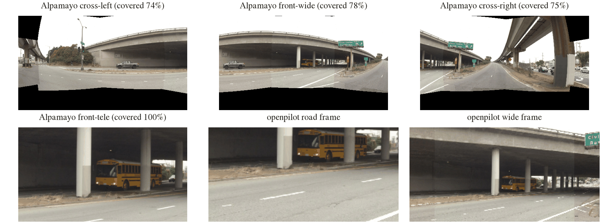
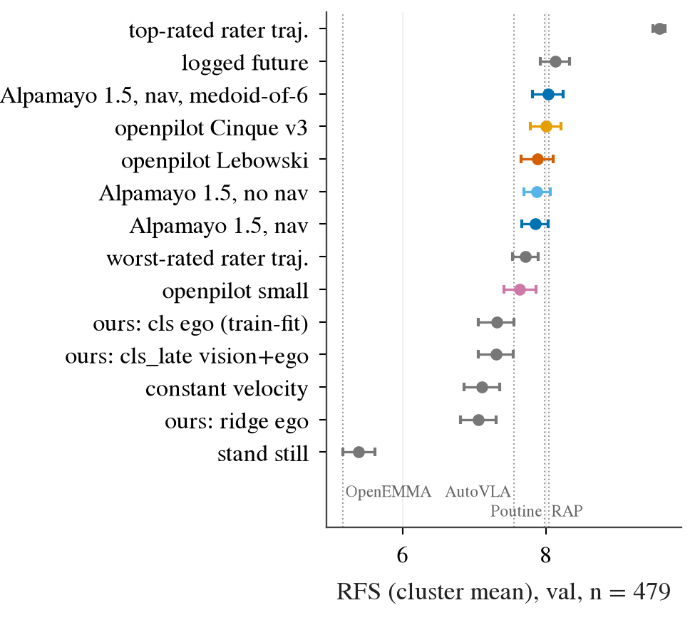
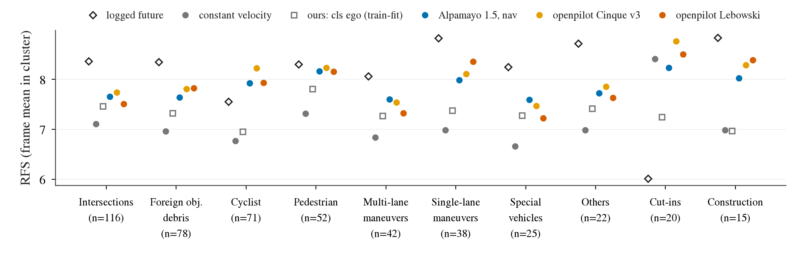
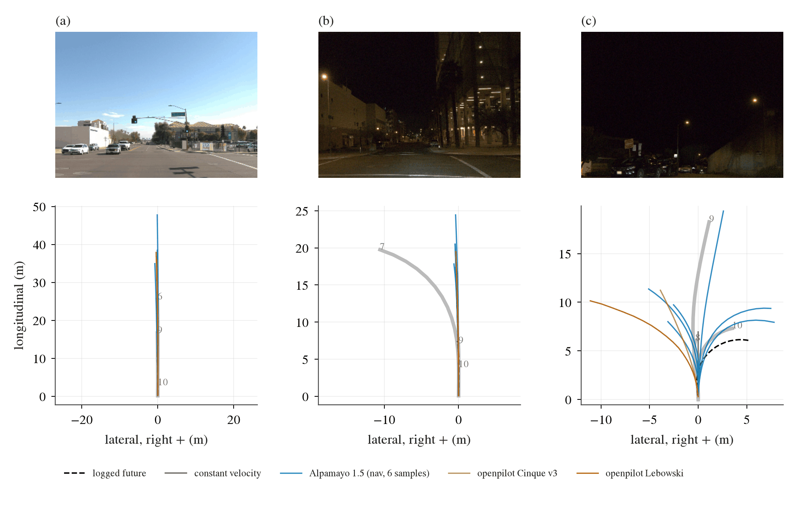

# Zero-shot 考试：Alpamayo 1.5 与 openpilot 在 WOD-E2E val 上的 RFS / ADE

状态: running（rater 帧主表已完成；ADE-extra 的 Alpamayo 行在跑）
主题: ../../research/openpilot-and-open-driving-models.md、../../research/benchmarks-and-evaluation.md

## 目标

把两个开源的驾驶专用大模型原样丢到它们没训练过的 benchmark 上，量它们的「通用驾驶能力」到底有多少。
benchmark 是 WOD-E2E（Waymo Open Dataset Vision-based End-to-End driving，Waymo 的纯视觉端到端驾驶数据集）的 val split，
主指标是 RFS（Rater Feedback Score，把预测轨迹和 3 条人工打过分的轨迹比，看是否落在它们的 trust region 里，0–10 分），
副指标是 ADE（Average Displacement Error，逐点平均位移误差）。打分用仓库里已有的 `jevdrive.waymo.rater_feedback_score`
（官方实现的 bit-exact 移植）和 `rfs_by_cluster`，与我们自己的 planner 完全同一口径。**不做任何 fine-tuning，不拟合任何参数。**

姊妹考试（NAVSIM、Bench2Drive，同样两个模型）由另外两个 agent 做，放在同目录下的其他文件里。

## 预登记（2026-09-24，在看到任何分数之前写死）

以下所有选择在跑全量 eval 之前提交。之后的任何改动都记在文末「偏离记录」里，写清楚改了什么、为什么、对数字的影响。
适配器验证阶段（步骤 2）只看图、不算任何 RFS/ADE；验证用的帧不在评测集里（见下）。

### 评测集与 n

| 集合 | 定义 | n | 用来算 |
|---|---|---:|---|
| **rater 帧（主表）** | val 里每个 sequence 唯一一帧带 3 条 rated trajectory 的帧（frame index 147–150，只有 1 帧在 203） | **479** | RFS（cluster mean 为榜单口径，frame mean 并列）、in-trust-region、floored、ADE@3s/5s vs rater_best（官方 ADE）、ADE@5s vs logged future |
| ADE-extra | 每个 val sequence 用 seed 0 均匀抽 2 帧：frame index ≥ 100、有完整 20 步未来、不是 rater 帧、与 rater 帧相距 ≥ 10 帧 | ≤ 958 | 只算 ADE@3s/5s vs logged future（没有 rater 轨迹，不能算 RFS） |
| 适配器验证帧 | 不在上面两个集合里的 val 帧，人工挑 8 帧（直行、左转、右转、停车、夜间各至少一帧） | 8 | 只看图，不算分 |

val 的 93 个 shard 全部在盘上、10 Hz 帧完全连续（docs/waymo-e2e.md），所以两种模型要的历史帧都是**精确命中**，不需要任何 padding；
rater 帧里 99.8% 往前有满 10 s 的帧，剩下 1 帧从 sequence 第一帧开始（见 openpilot 一节）。

### 模型与推理配置

| 模型 | 变体 | 配置 |
|---|---|---|
| Alpamayo 1.5（10B，`nvidia/Alpamayo-1.5-10B` @ `7aba829`） | **nav**、**no-nav** | smoke run 里「输出不变」档的最快配置：VLM 用 SDPA、`torch.compile` vision 和 expert（smoke 实测对默认 FA2 的 drift ≤ 0.02 m、CoC 100% 相同）；flow matching 保持默认 10 步；每帧 **K = 6** 条轨迹（`num_traj_samples=6`，每条配一次独立 reasoning rollout），temperature 0.6、top-p 0.98、reasoning 上限 256 token（官方默认）；每帧固定 seed 42 |
| openpilot small（30M） | — | onnxruntime TensorRT EP，图精度（不开 fp16 flag，smoke 里开了会在分布外输入上溢出） |
| openpilot Cinque v3（382M） | — | TensorRT EP fp16 |
| openpilot Lebowski（877M，0.11.2 big model） | — | TensorRT EP fp16 |

加载路径：Cosmos-Reason2-8B 的 HF gate 已经通过，Alpamayo 走官方 `from_pretrained`（不再需要 smoke run 里的 offline 绕法；如果官方路径仍失败，退回 offline 绕法并记为偏离，二者读的是同一份 sha 校验过的文件）。

### Alpamayo：相机映射

Alpamayo 要 4 路相机：cross-left（index 0）、front-wide（1）、cross-right（2）、front-tele（6），每路 1920×1080，
processor 再缩到 576×320。它的训练数据（NVIDIA PhysicalAI-AV）用的是 f-theta 鱼眼（一种按入射角线性映射像素半径的镜头模型）：
front-wide / cross 是 120° 水平视场，tele 是 30°。从 PhysicalAI-AV 的 `calibration/camera_intrinsics` 与 `sensor_extrinsics`
（chunk 0 的 100 个 clip，取逐项中位数）得到的虚拟 rig 是：

| 虚拟相机 | 光轴 yaw / pitch | 水平覆盖（yaw） | 垂直覆盖（相对光轴） |
|---|---|---|---|
| cross-left | +67° / 0° | +7° … +127° | ±34° |
| front-wide | −1° / −0.5° | −61° … +59° | ±34° |
| cross-right | −66° / 0° | −126° … −6° | ±34° |
| front-tele | 0° / 0° | ±15° | ±8.4° |

WOD-E2E 每帧有 8 路针孔相机，972×1079（后三路更矮），水平视场都是约 47°，光轴 yaw 分别是
FRONT 0°、FRONT_LEFT/RIGHT ±45°、SIDE_LEFT/RIGHT ±90°、REAR_LEFT/RIGHT ±135°、REAR 180°；
主点在第 719 行，所以光轴以上约 33°、以下只有约 18°。

**映射方法**：对每个虚拟相机的每个输出像素，按它的 f-theta 模型算出入射射线（vehicle 系），
在 WOD 的 7 路相机（除 REAR 外全部）里找能看到这条射线的相机，取光轴与射线夹角最小的那一路，
用该相机的内参（含 k1/k2/p1/p2/k3 畸变）投影、双线性采样。只做**纯旋转重投影**：忽略相机之间的平移，
等价于假设场景在无穷远。所以近处物体的位置会有视差误差（WOD 相机装在 1.81 m 高的车顶，
PhysicalAI 的 cross 相机在 0.9 m 高的翼子板、front 在 1.43 m），这是无深度信息时唯一可做的映射，预登记为已知的适配损失，不修正。

**看不到的地方填黑（RGB 0）**。WOD 相机光轴以下只有约 18°，虚拟相机要 34°，所以四路画面底部约一条带子是黑的
（在 PhysicalAI 上这里通常是引擎盖和近处路面）。水平方向 7 路相机覆盖 −158° … +158°，四路虚拟相机的水平范围全部有像。
tele 完全落在 FRONT 里面（FRONT 1115 px/rad，tele 缩到 576 宽之后是 1107 px/rad，分辨率基本不损失）。
每路的覆盖率（非黑像素比例）在适配器验证里测出来补到下面，不是分数。

**数据来源**：本地 slim shard 只留了 FRONT / FRONT_LEFT / FRONT_RIGHT。cross 相机有一半视场（yaw 68°–127°）
只有 SIDE / REAR 相机能提供，所以从 GCS 原始 val shard 按 TFRecord 帧头逐条走位置、只下载需要的记录（完整 8 路），
存成本地的小 shard。不下载任何别的东西。

### Alpamayo：历史帧与 egomotion

- **图像**：每路 4 帧 @10 Hz，即 WOD 的 frame f−3、f−2、f−1、f，全部精确命中（WOD 的 frame index 间隔实测 0.1000 s）。
  这正好是 Alpamayo 的原生帧率，不需要任何折中。
- **egomotion 历史**：Alpamayo 要 16 步 @10 Hz（t = −1.5 … 0 s）的 xyz 和 3×3 旋转，都在 t0 车体系里。
  WOD 只给 16 步 @4 Hz（t = −3.75 … 0 s）的 x/y、速度、加速度，没有 z 和朝向。
  预登记的换算：位置用 16 个 4 Hz 点做三次样条插值到 10 Hz 的 16 个时刻；z = 0；
  朝向只取 yaw，由速度矢量方向得到，再整体平移使 t0 的 yaw 为 0（车体系定义要求 t0 朝向为 +x）；
  速度 < 1 m/s 的步沿用最近一个运动步的 yaw，全程没动就取 0。roll、pitch 为 0。
- **坐标原点**：WOD 与 PhysicalAI 都是后轴中点（PhysicalAI 的 rig 原点在后轴、地面高度），所以不做平移。

### Alpamayo：导航

Alpamayo 训练时的 nav 文本形如 `Turn left in 11m`（`notebooks/nav_demo_samples.json`），放在 `<|route_start|>…<|route_end|>` 之间。
WOD 只有一个 intent（GO_STRAIGHT / GO_LEFT / GO_RIGHT / UNKNOWN），没有距离；用 logged future 推一个距离会泄露答案，所以不给距离。
预登记模板：

| WOD intent | nav 文本 |
|---|---|
| GO_STRAIGHT | `Continue straight` |
| GO_LEFT | `Turn left` |
| GO_RIGHT | `Turn right` |
| UNKNOWN | 不给 nav（rater 帧里没有出现） |

rater 帧里 427 帧直行、23 左、29 右。**no-nav 变体**用官方的无 nav prompt（`create_message(nav_text=None)`），其余完全相同。
两个变体都是主结果；nav 是否帮忙在直行帧和转弯帧上分开报。

### Alpamayo：输出重采样与轨迹选择

- 输出 64 点 @10 Hz（0.1 … 6.4 s）。在 t = 0 补上原点，按时间线性插值到 WOD 的 20 点（0.25 … 5.0 s），丢掉 z。
- **headline**：「一条采样轨迹的期望 RFS」= 每帧 6 条轨迹各自的 RFS 取平均，再按榜单口径聚合。
  它就是「每帧只部署 1 条采样」时 RFS 的无偏估计，方差比只用一条小。**第 0 条样本单独算一遍**，作为字面意义上的一次提交，并排报。
- 非 oracle 的次要读数：**medoid**（6 条里与其余 5 条平均 ADE@5s 最小的那条），标注为「medoid-of-6」。
- oracle 读数，只能单独列、明确标注：best-of-6 RFS、minADE_6 vs rater_best。**不进 headline，不和 baseline 直接比名次。**

### openpilot：相机映射、帧率与输出

- **相机**：模型要两路 512×256 的 model frame，已经是 calib frame（与车体朝向对齐的虚拟针孔相机）：
  narrow 焦距 910（水平约 31°，主点纵坐标 47.6），wide 焦距 455（水平约 59°，主点纵坐标 151.8）。
  用上面同一个纯旋转重投影，直接从 WOD 的 FRONT / FRONT_LEFT / FRONT_RIGHT 渲染 calib frame：
  等价于把一台 comma 装在 WOD FRONT 相机的位置，calibration 的 roll/pitch/yaw 全为 0。
  两路的视场都完全落在这三路相机的覆盖里（narrow 全在 FRONT 内，wide 的左右边缘来自 FRONT_LEFT/RIGHT），没有黑边。
  采样用最近邻，和 modeld 的 warp（tinygrad `compile_warp.py`）同一种插值；YUV 直接取 JPEG 自己的 YCbCr（BT.601 full range），
  色度按 2×2 取均值，按 modeld 的顺序打包成 6×128×256。
- **帧率与历史**：模型 20 Hz 运行、5 Hz 上下文（取 0.2 s 前的帧、4.8 s 的 feature 历史）。
  WOD 是 10 Hz，**每帧连喂两次**得到 20 Hz：这样 t−4 步正好是 2 个 WOD 帧前、0.2 s，与 modeld 的时间语义完全一致，只是同一帧出现两次。
  从 frame max(f − 100, sequence 第一帧) 开始、零状态起步，一直喂到 frame f（10 s 暖机，远多于 feature 队列要的 4.8 s），
  取最后一步的输出。desire 全 0（openpilot 没有路口导航输入，WOD intent 不给它），traffic convention [1, 0]（美国，右侧通行），
  action_t 同 smoke run（0.275 / 0.525 s）。
- **输出**：plan 的 33 个点（0–10 s，非均匀时间）取均值（MDN 的 μ），device 系（x 前、y 右、z 下）转成 WOD 的 x 前、y 左；
  plan 原点在相机，换到后轴：`rear(t) = d + plan(t) − R(ψ_t) d`，d 是 WOD FRONT 相机在车体系的 (x, y)，ψ_t 是 plan 自己的 yaw
  （转成左正）。然后按时间线性插值到 0.25 … 5.0 s。
- **不做尺度修正**：WOD 相机离地 1.81 m，comma 约 1.2 m，同一像素对应的地面距离会变，plan 的纵向可能有系统偏差。
  任何修正都要用带真值的数据估，那就不是 zero-shot 了，所以预登记为已知的适配损失，只在结果里诊断（纵向误差的符号），不修正。

### 指标与统计

- RFS：cluster mean（榜单口径：每个 scenario cluster 内求均值，再对 10 个出现的 cluster 不加权平均）为主，frame mean 并列；
  另报 in-trust-region 比例和 floored 比例（分数恰好等于下限 4.0 的比例，定义同 `rater_table`）。
- ADE：官方 ADE@3s、ADE@5s vs rater_best（评分最高的 rater 轨迹），以及 ADE@5s vs logged future。
- CI：10 000 次 bootstrap，percentile 95%。frame mean 按帧有放回重抽；cluster mean 在每个 cluster 内分层重抽（保证 10 个 cluster 都在）。
  和 baseline 的比较一律用**配对** bootstrap（同一组重抽的帧上算差），配对对象：cv、logged future、`cls ego`（我们 train 训出来的最好 RFS head，
  逐帧预测在 box 上）。ADE-extra 集按 sequence 重抽（每个 sequence 有 2 帧）。
- 按 scenario cluster 拆 RFS（10 个 cluster，n 从 15 到 116，n < 30 的格子标注「读不动」）；按 intent（直行/转弯）拆 nav 的效果。

### Baseline（全部是仓库里已有的数字或已存的逐帧预测，同一 479 帧）

| 行 | 来源 |
|---|---|
| rater_best / rater_worst | `report/rater.csv`（9.59 / 7.71） |
| logged future | 同上（8.13） |
| cv（匀速，零参数） | 同上（7.10） |
| zero（原地不动） | 同上（5.38） |
| ridge ego / `cls ego` / `cls_late` vision+ego | 第 3d / P0 条的 train 训 head（7.06 / 7.31 / 7.30，cluster mean） |
| 公开榜（**test split**，不是 val） | RAP 8.043、Poutine 7.986、AutoVLA 7.556、OpenEMMA 5.158 |

test 与 val 是不同的 sequence，而且榜单数字是各队自己挑的最好提交，所以只能作为量级参照，不能配对比较。

### 怎么判（跑之前写死）

| 结果 | 读法 |
|---|---|
| 模型 RFS 的配对 Δ vs cv 的 CI 整体 > 0 | 通用驾驶能力在这个分布外的 benchmark 上**有增量**，超过了「只看 ego 状态匀速外推」 |
| CI 跨 0 | zero-shot 下没有可测的增量：通用能力被分布差 + 适配损失吃光，或本来就没有超过 ego prior |
| CI 整体 < 0 | zero-shot 比匀速外推还差：适配损失（视差、黑边、相机高度、帧率）或分布差大于模型带来的东西；要看失败案例区分 |
| 模型 RFS ≥ logged future（8.13）的 CI 下界 | 达到「完美复现司机」的水平，和公开榜第一梯队同量级 |
| nav − no-nav 在转弯帧上 > 0、直行帧上 ≈ 0 | 模板化的 intent 文本被模型用上了 |

分数本身不会被用来改任何适配选择。如果全量跑完后发现适配有 bug（例如坐标符号错），修掉重跑，把修正前后的数字都记进偏离记录。

### 预计算力

Alpamayo：smoke 实测 SDPA + compile、K = 6 约 2.2–2.4 s/帧，479 帧 × 2 变体 + 958 帧 × 1 变体（ADE-extra 只跑 nav）≈ 1.2 h GPU。
openpilot：每个 rater 帧约 200 步 × 3 ms，三个模型合计约 15 分钟，瓶颈在 JPEG 解码（多进程）。
GCS 抓取：(479 + 958) × 4 条记录 × 约 2.3 MB ≈ 13 GB，按 10 MB/s 约 25 分钟。全部远低于 3 h，不需要 profiling pass。

## 适配器验证

8 个验证帧（不在评测集里），只看图、不算分。

图：验证帧 `f8af7b57…-135` 上两个模型实际看到的输入。上排和左下是 Alpamayo 的四路 f-theta 视图（由 WOD 7 路相机纯旋转重投影），
中下、右下是 openpilot 的 road / wide model frame（由 FRONT / FRONT_LEFT / FRONT_RIGHT 渲染，只画了 RGB，实际喂的是 YCbCr 打包）。
看三件事：相机之间的接缝处车道线和高架是连续的，说明外参、畸变和选相机的逻辑都对；地平线在各路里的高度与 PhysicalAI 的相机一致；
三路 120° 视图底部约 22% 是黑的，这就是预登记里说的「WOD 相机光轴以下只有 18°」。

| 项 | 结果 |
|---|---|
| Alpamayo 各路覆盖率（非黑像素，8 帧均值） | cross-left 0.746、front-wide 0.781、cross-right 0.752、front-tele 1.000；8 帧之间差别 < 0.01（WOD 的标定几乎不随 sequence 变） |
| 缺的是什么 | 几乎全部是画面底部（光轴以下 18°–34° 的带子），外加 cross 视图上角的小块（WOD 相机光轴以上只有 33°） |
| openpilot 两路覆盖率 | 1.000（代码里 assert 过） |
| GPU（torch `grid_sample`）与 CPU（cv2 `remap`）两条渲染路径 | 目视一致（同一帧两张图逐路对照） |
| 坐标符号 | 8 帧 BEV 上两类模型的预测都跟着 logged future 的左右转方向走（左转帧向左、右转帧向右），直行帧 5 s 终点与 log 差 < 2 m |
| Alpamayo 官方加载路径 | Cosmos-Reason2-8B gate 通过后 `from_pretrained` 在线加载成功，不再需要 offline 绕法 |

一个值得记下的观察（不是适配问题）：两个左转验证帧上，Alpamayo 的轨迹向左、和 log 一致，但它的 CoC 文本写的是 "Turn right at the intersection"。
轨迹方向由 egomotion 历史和图像共同决定，文本里的左右词却反了；NVIDIA 自己的 `nav_demo_samples.json` 里也有 nav "Turn left" 配 CoC "Turn right"
的样本。所以这像是模型文本侧的左右混淆，结果部分会在全部转弯帧上统计文本方向和轨迹方向的一致率（推测，待统计）。

### 算力与 GPU 排期（与 NAVSIM、Bench2Drive 两个考试共用一张卡）

共享文件 `~/data/runs/zeroshot-exam/gpu-plan.md` 上的约定：WOD 只起**一个** Alpamayo 进程（K = 6 时峰值 32 GB），
不用 B2D 的常驻 server（它按请求串行，K = 6 的一次调用会把 B2D 的每个 tick 堵 3–5 s）；openpilot 和 Alpamayo 同时跑，不单占时段；
B2D 的全量闭环排在 WOD 和 NAVSIM 的 Alpamayo 任务之后。实测：

| 任务 | 规模 | 单价 | wall | 瓶颈 |
|---|---|---|---|---|
| GCS 抓取 | 5 728 条记录（1 437 个目标帧 × 4 帧），约 13 GB | 走帧头约 1 s/条（经 Clash），之后约 95 条/分钟 | 约 60 min | 网络延迟（每个 shard 要顺序读 ~1 150 个 12 字节帧头）；与下面两项重叠 |
| openpilot 三个模型 | 1 437 目标 × 最多 101 帧 | GPU 0.83 s/目标（small 0.21、Cinque 0.46、Lebowski 0.16） | 2 124 s（1.48 s/目标） | CPU：每目标 303 张 JPEG 解码 + 重投影，16 个进程；GPU 只占 3.7 GB |
| Alpamayo，rater 帧 × 2 变体 | 958 次 K = 6 调用 | 3.2–5.6 s/调用（卡上同时有 B2D/NAVSIM 的 Alpamayo，GPU 100%）；smoke 在空卡上是 2.2–2.4 s | 约 1 h | GPU（与另两个考试共享） |
| Alpamayo，ADE-extra × nav | 958 次调用 | 同上 | 约 1 h | 同上 |

优化只做了配置层面、输出不变的那一档（SDPA + compile vision/expert，smoke 实测 K = 6 时比默认 FA2 快 12%，drift ≤ 0.02 m）；
K = 6 时 HF `generate` 把整段 prompt（16 张图）复制 6 份再 prefill，这 6 倍重复是最大的浪费，但要改模型代码才能去掉，
按 CLAUDE.md「第三方代码原样跑」不动它。总 wall 时间约 2 h，低于 3 h 的 profiling 门槛。输入准备（JPEG 解码 + GPU 重投影 + processor）
在后台线程里提前做 3 帧，与 GPU 推理重叠。

## 结果

run：box 上 `$DATA_DIR/runs/wod_zeroshot/{openpilot,alpamayo,score}/`；小结果文件在
[research/results/wod-zeroshot/](../../research/results/wod-zeroshot/)（`results.csv` 主表、`clusters.csv`、`intent.csv`、`nav_effect.csv`、
`extra.csv`、`per_frame.npz` 逐帧预测与 RFS、`cot.json` Alpamayo 全部推理文本、`cases.json`）。
所有 baseline 行都逐位复现了仓库里的数字（cv 7.103、logged future 8.131、zero 5.383、`cls ego` 7.311），说明打分管线和帧集合没有漂。

### 主表：val 的 479 个 rater 帧

RFS 是榜单口径（cluster mean），括号里是 95% bootstrap CI（cluster 内分层重抽 10 000 次）；Δ 是配对 bootstrap 的差。
「floored」是分数恰好等于下限 4.0 的比例；Alpamayo 的 headline 行按预登记取「一条采样的期望」（6 条各自的 RFS 求平均），
floored 一列对它取第 0 条样本的值（期望行的 floored 只数「6 条全被压到底」的帧，不可比）。ADE 单位 m。

| 行 | RFS (cluster) [CI] | Δ vs cv [CI] | Δ vs logged future [CI] | in trust region | floored | ADE@3s / 5s vs rater_best | ADE@5s vs log |
|---|---|---|---|---:|---:|---|---:|
| top-rated rater 轨迹 | 9.587 | — | — | 1.000 | 0.000 | 0 / 0 | 2.70 |
| logged future | 8.131 [7.93, 8.33] | +1.03 | 0 | 0.772 | 0.094 | 1.34 / 2.70 | 0 |
| **openpilot Cinque v3** | **8.005** [7.79, 8.22] | **+0.90** [+0.62, +1.18] | −0.13 [−0.35, +0.10] | 0.716 | 0.100 | **1.09 / 2.46** | 2.47 |
| **Alpamayo 1.5，no-nav** | 7.879 [7.69, 8.06] | +0.78 [+0.53, +1.02] | −0.25 [−0.46, −0.05] | 0.681 | 0.146 | 1.23 / 2.74 | 2.52 |
| openpilot Lebowski | 7.886 [7.66, 8.11] | +0.78 [+0.51, +1.05] | −0.25 [−0.49, −0.01] | 0.666 | 0.125 | 1.21 / 2.67 | 2.65 |
| **Alpamayo 1.5，nav** | 7.857 [7.67, 8.04] | +0.75 [+0.50, +1.00] | −0.27 [−0.48, −0.07] | 0.681 | 0.148 | 1.23 / 2.75 | 2.51 |
| openpilot small | 7.640 [7.41, 7.86] | +0.54 [+0.28, +0.80] | −0.49 [−0.75, −0.24] | 0.653 | 0.134 | 1.33 / 2.88 | 3.15 |
| worst-rated rater 轨迹 | 7.715 | +0.61 | −0.42 | 1.000 | 0.029 | 1.27 / 3.50 | 3.13 |
| 我们：`cls ego`（train 训） | 7.311 [7.06, 7.56] | +0.21 [−0.03, +0.45] | −0.82 | 0.628 | 0.213 | 1.40 / 3.27 | 2.57 |
| 我们：`cls_late` vision+ego | 7.301 [7.06, 7.55] | +0.20 | −0.83 | 0.618 | 0.207 | 1.40 / 3.23 | 2.52 |
| cv（匀速） | 7.103 [6.85, 7.35] | 0 | −1.03 | 0.551 | 0.271 | 1.49 / 3.35 | 3.72 |
| 我们：ridge ego | 7.059 [6.81, 7.31] | −0.04 | −1.07 | 0.539 | 0.271 | 1.33 / 3.16 | 2.43 |
| zero（原地不动） | 5.383 | −1.72 | −2.75 | 0.280 | 0.618 | 7.25 / 12.32 | 11.41 |
| 公开榜（**test** split，不可配对） | RAP 8.043、Poutine 7.986、AutoVLA 7.556、OpenEMMA 5.158 | | | | | RAP 2.65、Poutine 2.74（ADE@5s） | |

Alpamayo 的另外几种取法（同一批 6 条样本；oracle 行用了答案，**不能**和上表比名次）：

| Alpamayo 取法 | nav：RFS [CI] | no-nav：RFS [CI] | nav：ADE@5s vs rater_best |
|---|---|---|---:|
| 一条采样的期望（headline） | 7.857 [7.67, 8.04] | 7.879 [7.69, 8.06] | 2.75 |
| 第 0 条样本（字面意义的一次提交） | 7.673 [7.43, 7.90] | 7.688 [7.46, 7.91] | 2.88 |
| medoid-of-6（非 oracle） | 8.034 [7.82, 8.25] | 8.096 [7.88, 8.31] | 2.57 |
| ORACLE best-of-6 RFS | 8.950 | 8.909 | 2.16 |
| ORACLE minADE_6 | 8.673 | 8.635 | 1.62 |

图：各行的 RFS（cluster mean）和 95% bootstrap CI，灰色是 baseline，彩色是 zero-shot 模型；竖虚线是公开榜的 **test** 分数，只作量级参照。
看的是：五个 zero-shot 行全部落在 cv（7.10）和 logged future（8.13）之间，最好的 Cinque 和 Alpamayo medoid 的 CI 已经盖住 logged future 和 RAP 的 8.04；
我们自己 train 训出来的 head（7.06–7.31）在所有 zero-shot 模型之下。

**读法**（按预登记的判据表）：

1. **两个模型都有明确的「通用驾驶能力」增量**：五个 zero-shot 行对 cv 的配对 Δ 的 CI 全部在 0 以上（+0.54 到 +0.90）。
   预登记表的第一行成立。而且它们都**高于我们自己在 WOD train 上训出来的最好 head**（`cls ego` 7.31）：Cinque +0.69 [+0.44, +0.95]、
   Alpamayo nav +0.55 [+0.33, +0.76]。一个没见过 Waymo 任何一帧、没有导航、相机从 1.8 m 高的车顶被硬掰成 comma 视角的 382M 模型，
   比我们在 Waymo 上训的 head 高 0.7 RFS。
2. **没有一个达到 logged future**：最好的 Cinque 与 log 的 Δ 是 −0.13 [−0.35, +0.10]，CI 跨 0，所以「达到 log」这一格**没法排除但也没成立**；
   Alpamayo headline 和 Lebowski 的 CI 整体在 0 以下。榜单第一梯队（RAP 8.04、Poutine 7.99）落在 Cinque 和 Alpamayo medoid 的 CI 里，
   但那是 test、是各队自己挑的最好提交，只能说同量级。
3. **官方 ADE 上，Cinque（2.46 m）比 logged future（2.70 m）还低**，Alpamayo nav 2.75、Lebowski 2.67 与 log 同量级。
   这再次说明第 2 条「ADE 已经饱和、不能拿来排名」：一个 zero-shot 模型就能「越过完美预测 log」这条线。
4. **Alpamayo 的样本之间差得远**：同一批 6 条，期望 7.86、第 0 条 7.67、medoid 8.03、oracle best-of-6 8.95。
   medoid 比期望高 0.18，说明 6 条里的离群样本在拖分，一个不用答案的选择规则就能把它拉到 Cinque 的水平；
   oracle 8.95 与 rater_best 9.59 之间只差 0.6，说明**好答案通常就在 6 条里，差的是挑**。这和 smoke run 里 seed noise floor 1.28 m 的发现一致。

### nav 有没有用：没有

| 组 | n | nav − no-nav（frame mean RFS）[CI] |
|---|---:|---|
| 直行帧（GO_STRAIGHT → "Continue straight"） | 427 | −0.015 [−0.039, +0.008] |
| 转弯帧（GO_LEFT / GO_RIGHT → "Turn left/right"） | 52 | −0.016 [−0.190, +0.136] |
| 全部 | 479 | −0.015 [−0.042, +0.011] |

预登记的判据是「转弯帧上 > 0、直行帧上 ≈ 0」，结果是两组都 ≈ 0，转弯帧的 CI 很宽（n = 52）。
所以**模板化、不带距离的 intent 文本没有被模型用上**，或者说 rater 帧上的转弯方向已经被图像和 egomotion 历史决定了：
转弯帧上 Alpamayo 预测终点的平均方位角左转 +16°、右转 −20°，logged future 是 +30° / −32°，nav 与 no-nav 的差不到 1°。
openpilot 完全没有 nav 输入，转弯帧方位角是 +18 ~ 21° / −20 ~ −21°，和 Alpamayo 一样。两类模型都**转得不够急**（约为 log 的 60%）。

### 按 scenario cluster

| cluster | n | logged future | cv | 我们 `cls ego` | Alpamayo nav | Cinque | Lebowski | small |
|---|---:|---:|---:|---:|---:|---:|---:|---:|
| Intersections | 116 | 8.37 | 7.11 | 7.46 | 7.65 | 7.74 | 7.51 | 7.69 |
| Foreign Object Debris | 78 | 8.35 | 6.96 | 7.33 | 7.64 | 7.81 | 7.82 | 7.92 |
| Cyclist | 71 | 7.56 | 6.77 | 6.95 | 7.93 | **8.23** | 7.94 | 7.96 |
| Pedestrian | 52 | 8.31 | 7.32 | 7.81 | 8.17 | 8.23 | 8.16 | 7.89 |
| Multi-Lane Maneuvers | 42 | 8.06 | 6.84 | 7.27 | 7.60 | 7.54 | 7.32 | 7.23 |
| Single-Lane Maneuvers | 38 | 8.83 | 6.99 | 7.38 | 7.99 | 8.11 | 8.36 | 7.67 |
| Special Vehicles（读不动） | 25 | 8.25 | 6.66 | 7.28 | 7.59 | 7.47 | 7.23 | 7.07 |
| Others（读不动） | 22 | 8.72 | 6.98 | 7.42 | 7.73 | 7.86 | 7.63 | 6.64 |
| Cut-ins（读不动） | 20 | 6.02 | 8.42 | 7.25 | 8.24 | 8.77 | 8.50 | 7.81 |
| Construction（读不动） | 15 | 8.84 | 6.99 | 6.97 | 8.03 | 8.29 | 8.39 | 8.52 |

图：每个 cluster 内的 frame mean RFS（n 从 116 到 15，n < 30 的格子只看方向）。看两点：zero-shot 模型在 Cyclist 上**超过 logged future**
（Cinque 8.23 对 7.56），在 Cut-ins 上也是（log 只有 6.02，是 log 得分最低的一格）；差距最大的是 Intersections、Multi-Lane Maneuvers
和 Special Vehicles，模型比 log 低 0.6–1.0，这几格恰好是「路线怎么走」由导航决定、而 zero-shot 模型拿不到路线的地方。

### 按起始车速：停着的车是模型输的地方

| 起始车速 (m/s) | n | logged future | cv | 我们 `cls ego` | Alpamayo nav | Cinque | Lebowski | small |
|---|---:|---:|---:|---:|---:|---:|---:|---:|
| < 0.5 | 120 | 8.33 | 7.65 | 7.47 | 7.55 | 7.81 | 7.59 | 7.66 |
| 0.5–5 | 179 | 8.08 | 6.62 | 6.97 | 7.52 | 7.57 | 7.61 | 7.18 |
| 5–10 | 118 | 8.01 | 6.87 | 7.68 | 8.19 | 8.42 | 8.32 | 8.32 |
| > 10 | 62 | 8.47 | 7.45 | 7.54 | 8.40 | 8.37 | 7.78 | 8.07 |

（frame mean，Alpamayo 取 6 条的期望。）在车基本停着（< 0.5 m/s）的 120 帧上，zero-shot 模型**不比 cv（也就是「继续停着」）好**，
比 log 低 0.5–0.8；车动起来以后（5–10 m/s）它们反而**超过 log**（Cinque 8.42 对 8.01）。
也就是说，这两个模型最强的是「已经在开的时候怎么开」，最弱的是「什么时候走」。下面的失败案例三个全是这一类。

### 失败案例

图：每个模型相对 cv 丢分最多的一帧（按模型各挑一帧，sequence 互不相同）。上排是 WOD FRONT 相机（裁剪、降采样），
下排是俯视图：粗灰线是三条 rated trajectory（末端数字是评分），黑虚线 logged future，灰线 cv，彩线是模型（Alpamayo 画全部 6 条）。
- (a) Multi-Lane Maneuvers，车速 0.7 m/s，绿灯路口。评分最高（10）的是几乎不动的缓行，Alpamayo 6 条全部是「绿灯了，加速通过」
  （CoC 原文 "Accelerate to proceed through the intersection since the traffic light turns green"），两个 openpilot 也都开出 35–48 m，三个模型都被压到 4.0。
- (b) Intersections，夜间停在停止线前，0.3 m/s。rater 给「继续等」10 分、「左转」7 分；三个模型都选择直行起步
  （Alpamayo："Resume speed from stop at the stop sign since the intersection is clear"），都是 4.0。
- (c) Foreign Object Debris，夜间，1.4 m/s，路口前有车切入。log 右转（它本身也只有 4.0），rater 偏好直行（9）或慢速右转（10）；
  Lebowski 和 Cinque 左转，Alpamayo 的 6 条向左、直、右散开。没有路线信息时，路口的方向本来就是一个多模态的猜测。

这三帧的共同点是：从停着或低速起步、并且在路口。模型的 CoC 在 (a)(b) 都给出了一个说得通的理由（绿灯、路口清空），但 rater 的判断是还不该走；
这是规则层面的偏好差别（Waymo 的 rater 更保守），不是看错了东西。

### Alpamayo CoC 的左右方向

适配器验证时看到两个左转帧的 CoC 写着 "Turn right"。在全部 479 帧 × 6 条上统计（只看 CoC 里有 "turn left/right" 且轨迹终点方位角 > 10° 的样本）：
75 条里 67 条文本方向与轨迹一致、8 条相反，相反的 8 条全是「文本说右、轨迹向左」（其中 1 条是 "cut-in vehicle from the right ... turning into our lane"，关键词匹配把它算成了转向，真正的错配是 7 条）。所以验证帧上的现象是少数（11%），不是系统性的左右颠倒；
上面「推测」一句就此更正为：文本侧有少量、偏向单一方向的左右错配。

### 纵向偏差

5 s 终点的纵向位置减 logged future 的均值：cv +1.6 m（这些 12 s 标记帧上司机平均在减速），Alpamayo +3.3 m，Cinque +0.9 m，Lebowski +0.3 m。
Alpamayo 比 cv 还「往前冲」，在 > 10 m/s 的帧上是 +7.5 m（cv +9.7 m，中位数 +3.9 对 +2.5）。openpilot 的相机高度问题（1.81 m 对 1.2 m）
没有表现成大的系统性纵向偏差（Lebowski 平均 +0.3 m），所以预登记里担心的尺度偏差在这个口径下不大（推测：模型主要靠 feature 历史里的自车运动定速度，而不是靠地面几何）。

### ADE-extra（958 帧，只对 logged future）

（Alpamayo 这一行在跑，完成后补。）

| 行 | n | ADE@3s | ADE@5s [CI，按 sequence 重抽] |
|---|---:|---:|---|
| cv | 958 | 1.16 | 2.83 [2.65, 3.04] |
| ctra | 958 | 0.85 | 2.67 [2.47, 2.89] |
| 我们：ridge ego | 958 | **0.63** | **1.91** [1.79, 2.04] |
| 我们：`cls ego` | 958 | 0.82 | 2.05 [1.91, 2.22] |
| 我们：`cls_late` vision+ego | 958 | 0.83 | 2.02 [1.87, 2.19] |
| openpilot Cinque | 958 | 0.97 | 1.94 [1.80, 2.08] |
| openpilot Lebowski | 958 | 1.07 | 2.09 [1.94, 2.25] |
| openpilot small | 958 | 1.21 | 2.45 [2.30, 2.62] |

在随机帧上对 log 算 ADE 时，排序反过来：我们 train 训的 `ridge ego` 最好（1.91 m），Cinque（1.94）与它持平，Lebowski 和我们的分类头同量级。
这正是第 2 条说的指标冲突——回归 head 学的是条件均值、赢 ADE；zero-shot 模型输出的是「一种具体开法」、赢 RFS。
两种口径下 zero-shot 模型都不输给我们在 Waymo 上训的东西。

### Wall time

| 步骤 | wall |
|---|---|
| GCS 抓取 5 696 条记录（12.98 GB） | 约 102 min（与下面并行） |
| openpilot，1 437 目标 × 3 模型 | 35 min |
| Alpamayo，479 帧 × {nav, no-nav} | 63 min（7.9 s/帧，卡上同时有另两个考试的 Alpamayo，GPU 100%） |
| Alpamayo，958 帧 × nav | （在跑） |
| 打分（10 000 次 bootstrap） | < 1 min |

## 偏离记录

1. **Lebowski 按 5 Hz context 步进，而不是每个 WOD 帧喂两次。** 预登记写的是「每帧连喂两次得到 20 Hz」。small / Cinque 照此执行；
   Lebowski 的时间队列在 host 上，用了 B2D 考试新加的 `OPModel(context_rate=True)`：只在输出所在的相位上每 0.2 s 走一步（帧 f、f−2、…）。
   它的输出只依赖 t−4 与 t 两帧、t−96…t−4（步长 4）的 hidden state 和按 4 步窗口 max-pool 的 desire，所以在输出相位上与 20 Hz 逐步
   走法数值相同（`scripts/test_zeroshot_openpilot_context.py`）；desire 全 0，这里没有别的差别。影响：Lebowski 的 GPU 时间降到 1/4，分数应当不变。
2. **ADE-extra 的 CI 用 2 000 次按 sequence 重抽**，不是预登记的 10 000 次（代码里给这一张表设了上限）。RFS 主表是 10 000 次。
   2 000 次对 95% percentile 区间的蒙特卡洛误差在 0.01 m 量级，不影响读法。
3. **Alpamayo headline 行的 floored 一列取第 0 条样本**（见主表说明）。「一条采样的期望」这一行的 floored 按定义只数「6 条全被压到底」，与单轨迹行不可比。
4. **适配器验证帧按运动学挑**（直行快 2、左转 2、右转 2、停车 1、直行中速 1），没有专门按「夜间」挑；8 帧里有 3 帧恰好是夜间。只影响看图，不影响分数。
