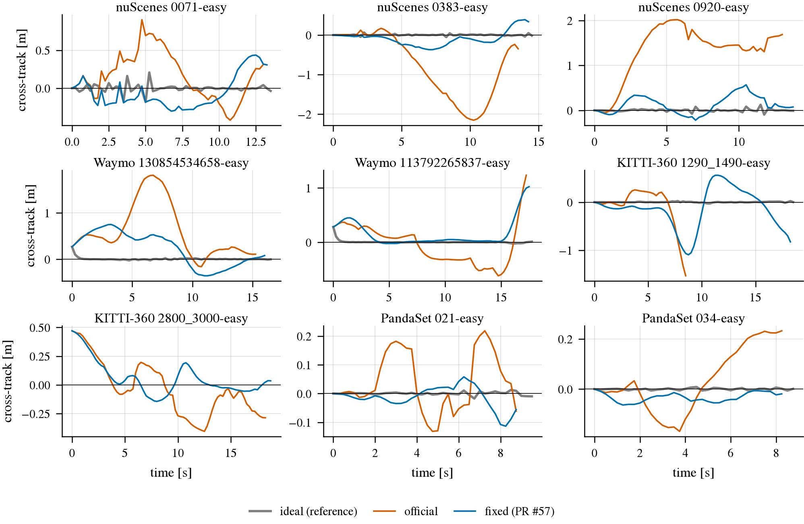
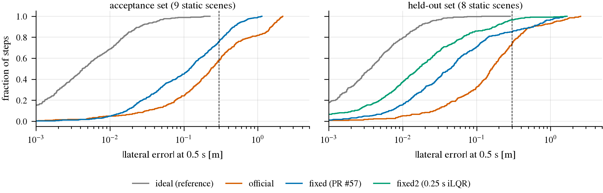

# HUGSIM 控制器验收：把场景自己的 logged 轨迹当 plan 喂给控制器

状态: 完成（2026-09-25 17:00）。**official 与 fixed（PR #57）都不过验收；候选 fixed2（PR #57 + iLQR 0.25 s 离散化 + 转向速率代价 1）
在 held-out 场景上四项全过，accept。** HUGSIM 考试恢复前要换成 fixed2，见文末 “结论”。
（预注册 2026-09-25 15:40 CST，commit badfbd0，写于任何验收场景运行之前）
上级: [闭环基础设施验收](../2026-09-25-closed-loop-infra-acceptance.md)；姊妹篇: [B2D 控制器验收](b2d-controllers.md)
接口: [docs/hugsim.md](../../docs/hugsim.md)
代码: `jevdrive/hugsim_preset.py`（logged 轨迹 → plan）、`scripts/hugsim/preset_agent.py`（agent）、
`patches/hugsim/optional/ideal-tracker.patch`（参考控制器）、`scripts/hugsim/zs_run.py`（`--agent preset`、`--controller ideal`）、
`scripts/hugsim/preset_accept.sh`（驱动）、`scripts/hugsim/preset_eval.py`（指标与判定）

## 问题

HUGSIM（3DGS 重建的闭环仿真器，4 Hz，每步 0.25 s；plan 是前相机原点、x 右 y 前、0.5 s 间隔的 waypoint）的闭环分数里，有多少是
控制器造成的？官方控制器（`traj2control` → nuPlan iLQR（iterative Linear Quadratic Regulator，把 plan 转成加速度与转向角速度）
→ kinematic bicycle）有 heading 转置缺陷，openpilot 在它下面 20/20 原地打转；修了 heading 的 fixed 控制器（上游 PR #57）
是否就够好，也没人量过。两条控制器路径都要验收：

| 路径 | 控制器树 | 适配层 |
|---|---|---|
| (a) official | `HUGSIM-zs/official`：上游 + 我们的非行为补丁 | `zs_agent.Agent` 的同一条 plan 路径：forward_only、straight_stop |
| (b) fixed | `HUGSIM-zs/fixed`：(a) + PR #57 heading fix | 同上 |
| 参考 ideal | `HUGSIM-zs/ideal`：(a) + `ideal-tracker.patch` | 同上 |

办法与 B2D 那篇相同：喂一份**已知是好的 plan**。控制器拿到它还开不好，就是控制器（或适配层）的问题，与模型无关。

## 设计

**Plan 来源：场景自己的 logged ego 轨迹（preset trajectory）。** 每个 HUGSIM 场景的 `ground_param.pkl` 存着录制时前相机的位姿
序列，仿真器拿它当路线（RC、“Far from preset trajectory”、`command` 都从它算）；`meta_data.json` 里同一批位姿带时间戳
（nuScenes 12 Hz、PandaSet 10 Hz 是秒；Waymo、KITTI-360 存的是帧号，按 10 Hz 换算）。`LoggedPlan` 每一步：

1. 把 ego（前相机）投影到 logged 路径上，得到弧长 s0（搜索窗 [s_last − 5, s_last + 30] m，防止路径自交处跳变）；
2. 从 ego 当前车速出发，以 +2.0 / −4.0 m/s² 的上限朝 logged 车速（该弧长处，0.5 s 窗口的平均速度）逼近，积分 3 s；
3. 在 t = 0.5 k s（k = 1..6）处取 logged 路径上对应弧长的点（过了终点就沿最后一段直线外推），换到 ego 的 plan 坐标系。

这就是一个知道路线和录制车速的完美 planner 在这一刻会给的 plan：从车现在的位置出发，回到录制路径上。为什么不直接按
录制时刻表回放：所有场景都以 1 m/s 起步，而录制车速是 4–15 m/s，原样回放的第一个 waypoint 要求 0.5 s 内加速到录制车速，
超出 iLQR 的 |a| ≤ 3 m/s² 与 HUGSIM comfort 的 2.40 m/s² 上限，测的就是饱和而不是跟踪；+2.0 m/s² 的 ramp 在两者之内。
为什么不用已有的 route follower（`agent_client.RoutePolicy`，清单里 official 下 7/10 完成）：它按固定 6 m/s 上限开，不带
录制车速，也不走 `zs_agent` 的 plan 后处理；这里要的是和模型 plan 一模一样的路径。

**同一条适配路径。** `preset_agent.PresetAgent` 是 `zs_agent.Agent` 的子类，只把“调模型”那一格换成 `LoggedPlan`，
其余（逐步循环、forward_only、straight_stop、`zs_steps.jsonl` 记录）是模型 run 的同一段代码。录制轨迹本身不倒车，
forward_only 预期不改动任何 plan；录制里有停车时 straight_stop 会接管，这正好也验一下它。两者改动了多少 plan 逐 run 统计。

**参考：ideal 控制器。** HD-Score（每步 PDMS 的均值 × RC，PDMS 按**计划轨迹**打分）的“参考值”不能拿 1.0：录制轨迹在
3DGS 重建里未必处处满足 DAC（drivable area compliance，footprint 下要有地面点）/NC（no collision）/TTC，
在插入了 actor 的场景里更可能撞上。所以参考是同一个 plan 来源在**完美执行**下的结果：`ideal-tracker.patch` 让 `closed_loop.py`
不调 `traj2control`，每步让 ego 严格沿 plan 走 0.25 s（过原点与前两个 waypoint 的二次曲线，终点取曲线的切向与速度），
碰撞、路线、actor、渲染、打分全是原样的 env 代码（实现上是预置 bicycle 一步的航向、速度、转角，使零控制的一步正好落到目标上；
env 类本身不改）。于是 “控制器 vs ideal” 的差就是控制器造成的全部差别。

**场景（14 个，选择只看数据集、难度、有无 actor，不看任何结果）。**

| 组 | 场景 | 说明 |
|---|---|---|
| static（9，无插入 actor） | nuScenes 0071-easy（直行）、0383-easy（左转）、0920-easy（右转）；Waymo 130854534658-easy、113792265837-easy；KITTI-360 1290_1490-easy、2800_3000-easy；PandaSet 021-easy、034-easy | 清单的 6 个 easy 场景，再给 Waymo / KITTI-360 / PandaSet 各补一个（`scored.txt` 里该数据集 easy 的第一个），每个数据集至少 2 个 |
| actor（5） | nuScenes 0062-medium-00（前方 30 m 静止车）、0383-hard-00（2 辆车）；Waymo 130854534658-hard-00；KITTI-360 1290_1490-hard-00；PandaSet 021-hard-01（AttackPlanner，冲向 ego 的车） | 清单的 2 个 actor 场景 + 每个其余数据集一个与 static 同 scene 的 hard 场景 |

列表：[hugsim-static.txt](hugsim-static.txt)、[hugsim-actor.txt](hugsim-actor.txt)。3 个控制器 × 14 = 42 个 run，每条 lane 一个
控制器、一个仿真器，GPU 0。

**actor 场景的参考怎么定。** 录制轨迹不知道后插进来的 actor，可能直接撞上。这里不把 “不碰撞” 当参考，而是**预注册：actor 场景
的参考 = ideal 控制器在同一场景上的结果**（包括它的结束原因与步数）。ideal 也撞了，那次碰撞就不算控制器的错；控制器要做的是
“和 ideal 一样”：结束原因相同、HD-Score 相差不大。

## 指标（跑之前定死）

跟踪误差逐步算，都用 `zs_steps.jsonl` 里仿真器给的 ego 位姿（前相机，地面投影）：

- **对所喂 plan（主）**，在第 k 步 plan 的坐标系里：第一个 waypoint（t = 0.5 s）对 k+2 步的实际位置，拆成 lateral（x，右为正）
  与 longitudinal（y，前为正）；heading 误差 = k+2 步航向 − plan 在该 waypoint 处的切向（过原点与前两点的二次曲线在 0.5 s 的切向，
  即第二个 waypoint 的方向）。另报一步（0.25 s）的版本：同一条二次曲线在 0.25 s 处对 k+1 步，ideal 在这上面按构造是 0，用来
  验证指标代码本身。
- **对 logged 路径**：每步 ego 到录制路径的有符号 cross-track 距离（右为正）、ego 航向 − 路径切向。
- **结束原因**：background collision / foreground collision / off-route（离路线 > 10 m）/ complete / 400 步。
- **分数**：HD-Score、RC、NC、DAC、TTC、C、PDMS（`eval.json`），逐场景对 ideal 配对相减。
- 统计范围：tracking 的主判定只用 static 场景的全部步（pooled，报 median 与 p95）；actor 场景的跟踪误差照报，不进判定
  （AttackPlanner 等可能提前结束 episode）。

## 通过标准（每条控制器路径分别判；四项都过才算 pass）

| # | 项 | 通过 |
|---|---|---|
| P1 | 跟踪所喂 plan（static，0.5 s） | median \|lateral\| ≤ 0.10 m 且 p95 ≤ 0.30 m；median \|longitudinal\| ≤ 0.20 m 且 p95 ≤ 0.50 m；median \|heading\| ≤ 1.5° 且 p95 ≤ 5° |
| P2 | 跟踪 logged 路径（static） | 每个 run 的 median \|cross-track\| ≤ 0.30 m；max \|cross-track\| ≤ 1.0 m 的 run ≥ 8/9 |
| P3 | 结束原因（static） | complete ≥ 8/9，且与 ideal 相同的 ≥ 8/9 |
| P4 | HD-Score 对 ideal | static：均值差 ≥ −0.05，且每个场景差 ≥ −0.15；actor：结束原因与 ideal 相同 ≥ 4/5，\|HD 差\| ≤ 0.15 的 ≥ 4/5 |

阈值的来由：0.5 s 内 iLQR 对一条可行、光滑的 plan 应做到厘米级；10 cm / 1.5° 留了 4 Hz 离散与 iLQR 0.5 s 离散不一致
（上游 issue #75）的余量。cross-track 0.3 m 是车道宽度（约 3.5 m）的一小部分，1 m 是开始可能压线的量级。HD 的 0.05 是我们
在 HUGSIM 上关心的模型差距（LTF official→fixed +0.057）的量级：控制器自身造成的差若大于它，就会淹没模型之间的比较。

**参考自身的 sanity（不是控制器判定，但先看）：** S1 ideal 的一步（0.25 s）误差 < 1 cm（否则指标代码或 ideal 实现有错，先修）；
S2 ideal 在 static 场景上 complete ≥ 8/9、HD 均值 ≥ 0.80。S2 不过说明录制轨迹在 3DGS 场景里本身不 “好”（地面点缺失、
重建偏差），照样拿 ideal 当参考做配对比较，但要在结论里写明参考本身的分数。

**预先写下的偏离规则：** 基础设施崩溃（不是 episode 结束）的 run 重跑一次；plumbing 问题修复后整组重跑，记偏离。
阈值、场景、plan 来源在看结果之后不改。

## Plumbing smoke（集合外，只验代码）

nuScenes scene-0051-easy-00（不在上面 14 个里），ideal 与 official 各一次，只用来确认 agent、ideal 树、`preset_eval.py`
能跑通、S1 成立。第一次 smoke 暴露一个 plumbing 问题并已修复：HUGSIM 的 env 类（`hugsim_env`）是 editable install，
**不论从哪棵树运行都从 `$DATA_DIR/third_party/HUGSIM` 导入**；`traj2control` 则从运行目录的树导入（已核对：official 树里
是未修 heading 的版本，fixed 树里是 PR #57 的版本，所以考试里 official / fixed 的区分是真的）。因此 ideal 补丁只改
`closed_loop.py`，不改 env 类。修复后的 smoke：ideal 的一步误差 median 0.3 mm、p95 0.9 mm（`zs_steps.jsonl` 的位姿只保留到 mm，S1 成立），每个 run 约 25 s。official 在这个集合外场景上的数字也看到了；上面的阈值在 smoke 之前已随 `preset_eval.py` 提交（commit c54f88a 的 `CRIT`），没有改动。

## 结果

数据：[accept_runs.csv](../../research/results/infra-acceptance/hugsim/accept_runs.csv)（逐 run）、
[accept_summary.json](../../research/results/infra-acceptance/hugsim/accept_summary.json)（逐控制器，含判定）、
[accept_results.csv](../../research/results/infra-acceptance/hugsim/accept_results.csv)（`zs_run.py` 原始行）。
box 上：`$DATA_DIR/runs/infra-accept/hugsim/`。42 个 run 全部跑完，无基础设施崩溃，每个 run 20–40 s。

### R1. 验收（预注册集合，2026-09-25 16:05）

**参考自身。** S1 成立：ideal 的一步误差 median 0.3 mm、p95 0.9 mm。S2 不成立：ideal 在 static 上 complete 8/9、HD 均值 0.792（< 0.80）。
唯一的例外是 KITTI-360 2800_3000-easy：场景从录制路径右侧 0.47 m 处起步，plan 要求 0.5 s 内横移 0.45 m（1 m/s 下是约 30° 的
急打），ideal 不受转向约束，第 1 步就把车身转进了路边的背景点里（bg collision，HD 0）。这是参考的缺陷（plan 的 “0.5 s 内回到路径”
在低速下不可行，而 ideal 照做），不是控制器的问题；按预注册它仍参与配对，但下面同时给出去掉它的数字。其余 8 个 static 场景上
ideal 的 HD 均值 0.891。

**跟踪与分数（static 9 个场景的全部步，pooled）：**

| | ideal（参考） | official | fixed（PR #57） | 阈值 |
|---|---:|---:|---:|---|
| lateral @0.5 s，median / p95 (m) | 0.004 / 0.043 | 0.233 / **1.806** | 0.120 / **0.627** | ≤ 0.10 / ≤ 0.30 |
| longitudinal @0.5 s，median / p95 (m) | 0.012 / 0.063 | 0.111 / 0.384 | 0.124 / 0.359 | ≤ 0.20 / ≤ 0.50 |
| heading @0.5 s，median / p95 (°) | 0.07 / 1.4 | 2.0 / **32.6** | 1.2 / **11.8** | ≤ 1.5 / ≤ 5 |
| cross-track 对录制路径，median / p95 / max (m) | 0.004 / 0.044 / 0.47 | 0.232 / 1.770 / 2.153 | 0.119 / 0.588 / 1.095 | — |
| 逐 run median \|cross-track\| 的最大值 (m) | 0.47（2800 起步） | **1.447**（0920 右转） | **0.358**（Waymo 1308） | ≤ 0.30 |
| max \|cross-track\| ≤ 1 m 的 run | 9/9 | **4/9** | **7/9** | ≥ 8/9 |
| 结束原因（static） | 8 complete，1 bg（2800 第 1 步） | 8 complete，1 bg（KITTI 1290，35 步） | 9 complete | complete ≥ 8/9 |
| 与 ideal 结束原因相同（static / actor） | — | 7/9 / 4/5 | 8/9 / 5/5 | ≥ 8/9 / ≥ 4/5 |
| HD 均值 static（去掉 2800） | 0.792（0.891） | 0.796（0.804） | 0.884（0.902） | — |
| HD 差对 ideal：static 均值 / 最差场景 | — | +0.004 / **−0.470**（KITTI 1290） | +0.092 / −0.020 | ≥ −0.05 / ≥ −0.15 |
| HD 差对 ideal：actor 5 个 | — | −0.007, +0.004, −0.005, +0.018, **−0.564**（Waymo 1308-hard） | −0.008, +0.004, −0.005, +0.006, −0.018 | \|差\| ≤ 0.15 的 ≥ 4/5 |
| P1 / P2 / P3 / P4 | | ✗ / ✗ / ✗ / ✗ | ✗ / ✗ / ✓ / ✓ | |
| **判定** | | **fail** | **fail** | |

读法：两条控制器路径的纵向都合格（p95 < 0.4 m），不合格的是横向与航向。official 在弯道里系统性地偏离 plan（0383 左转、0920 右转、
Waymo 两个场景的逐 run 中位横向偏差 0.3–1.4 m、航向 p95 32°），在 KITTI 1290 上擦到路边背景提前结束（HD 0.916 → 0.446），
在 Waymo 1308-hard 上撞上了 ideal 与 fixed 都没撞的车（HD 0.910 → 0.346）。fixed 把横向误差减半，结束原因与 ideal 全部一致，
HD 与 ideal 的差都在 ±0.02 以内（2800 之外），**分数层面已经可用**；但它仍在弯道里切内侧 0.3–0.5 m（Waymo 1308 右转段、
KITTI 1290、Waymo 1137 的 max cross-track 1.0–1.1 m），按预注册的跟踪标准不过。适配层（forward_only、straight_stop）在这 42 个
run 里没有改动任何 plan（录制轨迹不倒车、没有停车段），所以这里验证的是 “适配层对正常 plan 是恒等变换”，straight_stop 的停车
分支没被这组场景覆盖。actor 场景里 4/5 连 ideal 也撞（录制轨迹不知道插入的车），正是预注册用 ideal 当参考的原因。

HD 为什么几乎不受跟踪误差影响：HD 按每步**计划**轨迹打分，plan 从 ego 当前位置出发、终点在录制路径上，车偏了 0.5 m，
plan 仍然是一条合理的回归路径，NC / DAC / TTC 照样满分；跟踪误差只在车真的擦到背景、撞上 actor 或离开路线时才进入分数。
所以 HD 对控制器不敏感是这个打分方式的性质，而跟踪误差是更灵敏的验收量；fixed 的 “跟踪不过、分数过” 并不矛盾。

### R2. 诊断：误差来自 iLQR 的 0.5 s 离散化与转向速率代价（离线，不渲染）

`scripts/hugsim/ctrl_offline.py` 把同一个 `LoggedPlan` 交给 `traj2control` → iLQR → env 的 bicycle 方程（逐字照抄），从各场景的
起点状态开，不渲染、不判碰撞，在 static 9 个场景上比较控制器变体。先验证离线模型：它复现了仿真器里的数字（official lateral
median / p95 0.243 / 1.805 m 对仿真器 0.233 / 1.806；fixed 0.125 / 0.700 对 0.120 / 0.627），所以下面的差别可以当作控制器本身的。
数据：[offline_variants.csv](../../research/results/infra-acceptance/hugsim/offline_variants.csv)。

| 变体 | 改了什么 | lateral @0.5 s med / p95 (m) | heading med / p95 (°) | 逐 run median xt 的最大值 (m) | max xt (m) |
|---|---|---:|---:|---:|---:|
| official | 上游 | 0.243 / 1.805 | 2.07 / 32.4 | 1.451 | 2.15 |
| fixed | PR #57 | 0.125 / 0.700 | 1.29 / 13.1 | 0.358 | 1.13 |
| fixed-T | + 去掉 50 ms 求解时限 | 0.125 / 0.700 | 1.29 / 13.1 | 0.358 | 1.13 |
| central | PR #57 换成中心差分切向 | 0.130 / 0.711 | 1.28 / 13.9 | 0.387 | 1.17 |
| fixed-dt | + iLQR 离散化 0.5 → 0.25 s，plan 线性插到 0.25 s | 0.049 / 0.431 | 0.57 / 7.3 | 0.143 | 0.69 |
| fixed-dt-sr | fixed-dt + 转向速率上限 0.4 → 1.0 rad/s | 0.049 / 0.431 | 0.57 / 7.3 | 0.143 | 0.69 |
| fixed-dt-h | fixed-dt + heading 代价 10 → 30 | 0.050 / 0.393 | 0.55 / 5.9 | 0.167 | 0.66 |
| fixed-dt-xy | fixed-dt + 位置代价 1 → 3 | 0.037 / 0.383 | 0.51 / 6.4 | 0.087 | 0.57 |
| **fixed-dt-u** | fixed-dt + 转向速率输入代价 10 → 1 | **0.034 / 0.275** | **0.44 / 4.7** | **0.078** | **0.52** |
| fixed-dt-xyu | fixed-dt-xy + fixed-dt-u | 0.039 / 0.282 | 0.77 / 4.4 | 0.051 | 0.52 |

结论（离线、在验收集合上）：50 ms 的求解时限从不触发（fixed-T 与 fixed 逐位相同），转向速率上限也不起作用；换切向算法没用。
**最大的一项是离散化**：上游 iLQR 以 0.5 s 为一步积分，而仿真器每 0.25 s 就执行一次它的第一个输入（上游 issue #75），把离散化
改成 0.25 s 后横向误差 median 降到 0.4 倍、p95 降到 0.6 倍。剩下的弯道误差来自转向速率的输入代价（10），降到 1 后 p95 进阈值。
fixed-dt-u 在离线上满足 P1、P2 的全部阈值（lateral 0.034 / 0.275，longitudinal 0.107 / 0.321，heading 0.44 / 4.7，逐 run median
cross-track ≤ 0.08 m、max ≤ 0.52 m）。它是在验收集合上挑出来的，所以这只是一个候选，要在没见过的场景上、在仿真器里重新验收。

### V. 候选控制器 fixed2 的 held-out 验证（预注册，写于运行之前，2026-09-25 16:55 CST）

**候选。** `fixed2` = fixed + `patches/hugsim/optional/lqr-tracker-v2.patch`：`traj2control` 把 0.5 s 的 plan 线性插值到 0.25 s，
iLQR 离散化 0.25 s，转向速率输入代价 1，去掉 50 ms 求解时限（离线里不起作用，去掉后结果确定）。即离线的 fixed-dt-u，此后不再调参。

**场景（12 个，与验收集合不重叠，按规则选、不看结果）。** static 8 个：`scored.txt` 里每个数据集 easy 的第 2、3 个
（nuScenes 的第 1 个 0051 已用于 plumbing smoke，改取 0166、0167）：nuScenes 0166、0167；Waymo 164701907483、322492347634；
KITTI-360 570_770、5980_6180；PandaSet 039、040。actor 4 个：`scored.txt` 里每个数据集 hard 的第 1 个：nuScenes 0254-hard-00、
Waymo 100613054308-hard-00、KITTI-360 250_450-hard-00、PandaSet 034-hard-00。列表：[hugsim-val-static.txt](hugsim-val-static.txt)、
[hugsim-val-actor.txt](hugsim-val-actor.txt)。控制器 ideal、official、fixed、fixed2 各一遍（48 个 run，`preset_accept.sh validate`）。

**标准。** 与 P1–P4 完全相同（同一份 `preset_eval.py`，阈值不动）；“≥ 8/9” 在 8 个 static 上读作 ≥ 7/8，actor 的 “≥ 4/5” 读作
≥ 3/4（代码里是 n − 1）。fixed2 全过即 **accept**，作为此后 HUGSIM 考试的 fixed 控制器；official 与 fixed 在新场景上的结果
用来检查 R1 的结论是否可复现。fixed2 不过：不再调参，报告哪一项不过，结论写成 “HUGSIM 没有合格的控制器”。

### V 的结果（2026-09-25 16:55，48 个 run 全部跑完，无崩溃）

数据：[val_runs.csv](../../research/results/infra-acceptance/hugsim/val_runs.csv)、
[val_summary.json](../../research/results/infra-acceptance/hugsim/val_summary.json)、
[val_results.csv](../../research/results/infra-acceptance/hugsim/val_results.csv)；逐步表 `accept_steps.csv` / `val_steps.csv`。
ideal 在 8 个 static 场景上全部 complete、HD 均值 0.905（S2 这次成立），一步误差 0.3 mm（S1 成立）。

| static 8 个场景，pooled | ideal | official | fixed | **fixed2** | 阈值 |
|---|---:|---:|---:|---:|---|
| lateral @0.5 s，median / p95 (m) | 0.004 / 0.024 | 0.162 / **1.178** | 0.044 / **0.836** | **0.016 / 0.256** | ≤ 0.10 / ≤ 0.30 |
| longitudinal @0.5 s，median / p95 (m) | 0.009 / 0.056 | 0.105 / 0.288 | 0.082 / 0.288 | 0.076 / 0.253 | ≤ 0.20 / ≤ 0.50 |
| heading @0.5 s，median / p95 (°) | 0.06 / 0.39 | 1.22 / **16.3** | 0.36 / **9.9** | 0.17 / 3.4 | ≤ 1.5 / ≤ 5 |
| cross-track，median / p95 (m) | 0.004 / 0.024 | 0.156 / 1.248 | 0.042 / 0.840 | 0.016 / 0.261 | — |
| 逐 run median cross-track 的最大值 (m) | 0.010 | **0.319** | 0.132 | 0.079 | ≤ 0.30 |
| max cross-track ≤ 1 m 的 run | 7/8 | **5/8** | **5/8** | 7/8 | ≥ 7/8 |
| 结束原因（static） | 8 complete | 7 complete，1 bg（KITTI 570_770） | 8 complete | 8 complete | complete ≥ 7/8 |
| HD 均值 static | 0.905 | 0.840 | 0.903 | 0.911 | — |
| HD 差对 ideal：static 均值 / 最差场景 | — | −0.065 / **−0.517** | −0.002 / −0.035 | +0.006 / −0.001 | ≥ −0.05 / ≥ −0.15 |
| actor 4 个：结束原因同 ideal / \|HD 差\| ≤ 0.15 | — | 4/4 / 4/4 | 4/4 / 4/4 | 4/4 / 4/4 | ≥ 3/4 |
| P1 / P2 / P3 / P4 | | ✗ / ✗ / ✓ / ✗ | ✗ / ✗ / ✓ / ✓ | ✓ / ✓ / ✓ / ✓ | |
| **判定** | | **fail** | **fail** | **pass** | |

读法：R1 的结论在新场景上复现了：official 横向 p95 1.2 m、航向 p95 16°，在 KITTI 570_770 的弯道里擦到背景提前结束（HD 0.926 →
0.409）；fixed 分数与 ideal 一致，但弯道横向 p95 0.84 m、KITTI 570_770 / 5980_6180 的 max cross-track 1.06 / 1.47 m，跟踪不过。
fixed2 把横向 p95 降到 0.26 m、航向 p95 3.4°，逐 run 中位 cross-track 都 ≤ 0.08 m；唯一一个 max cross-track > 1 m 的 run 是 Waymo
164701907483，它和 ideal 一样是场景起点就在录制路径外 1.72 m（`start_ab`），不是跟踪误差。四个 actor 场景连 ideal 都在 13–15 步
内撞上插入的车，四个控制器结果一致。适配层这次同样没有改动任何 plan。

验收集合 9 个 static 场景里 ego 到录制路径的有符号 cross-track（右为正）随时间的变化。看 official（橙）在转弯场景（nuScenes
0383 左转、0920 右转、Waymo 1308）上 1.5–2 m 的系统性偏离，和 fixed（蓝）仍有的 0.3–1 m 弯道切角；ideal（灰）贴着 0，
KITTI 2800_3000 的 ideal 在第 1 步就结束了（见 R1）。

每一步 0.5 s 横向跟踪误差绝对值的经验分布（对数横轴，虚线 = P1 的 p95 阈值 0.30 m）；左为验收集合，右为 held-out 集合。
看 fixed2（绿）在 held-out 上整条曲线比 fixed 左移约 3 倍、95% 分位落在虚线左边，而 official 与 fixed 的尾部都越过 1 m。

## 结论

| 控制器路径 | 判定 | 横向 @0.5 s median / p95（held-out） | 航向 p95 | HD-Score 对 ideal（static 均值差 / 最差） | 结束原因同 ideal |
|---|---|---|---|---|---|
| (a) official + 适配层 | **fail**（P1、P2、P4；R1 里还有 P3） | 0.16 / 1.18 m | 16° | −0.065 / −0.52 | static 7/8 |
| (b) fixed（PR #57）+ 适配层 | **fail**（P1、P2） | 0.04 / 0.84 m | 10° | −0.002 / −0.04 | 全部 |
| fixed2（PR #57 + tracker v2）+ 适配层 | **pass** | 0.016 / 0.26 m | 3.4° | +0.006 / −0.001 | 全部 |

1. **official 控制器不可用**：heading 转置之外，它在正常的弯道 plan 上偏离 1–2 m，会提前把车开进路边背景（两个集合各 1/9、1/8）
   或撞上 ideal 不会撞的车（Waymo 1308-hard）。用它得出的 HD-Score 里有 −0.07 均值、单场景最多 −0.5 的控制器成分，与模型差距同量级。
   按 `docs/hugsim.md` 的旧 policy 它是 headline 控制器，这一条需要主会话重新定（见下）。
2. **fixed（PR #57）分数上几乎无偏（均值差 ≤ 0.01），但跟踪不过**：弯道里切内侧 0.3–1.5 m。原因（R2，离线）主要是 iLQR 以 0.5 s
   离散化、仿真器每 0.25 s 执行一次（上游 issue #75），其次是转向速率的输入代价 10。
3. **fixed2 在没见过的 12 个场景上四项全过。** 改动：`traj2control` 把 plan 线性插到 0.25 s，iLQR 离散化 0.25 s，转向速率输入代价
   10 → 1，去掉 50 ms 求解时限（`patches/hugsim/optional/lqr-tracker-v2.patch`，树 `HUGSIM-zs/fixed2`，`zs_run.py --controller fixed2`）。
4. 适配层（forward_only、straight_stop）对正常 plan 是恒等变换（90 个 run、3 904 个 plan，改动 0 个）；straight_stop 的停车分支没有
   被 logged plan 覆盖，它的验证仍是清单 R2 里的 “修复后车速 ≥ 0”。

**HUGSIM 考试恢复前要做的：**
- 把 fixed2 作为考试的控制器（至少作为 fixed 的替代）；已跑完的 hugsim-scored-op / scored-base 的 fixed 分数是 PR #57 控制器下的，
  分数层面与 ideal 的偏差 ≤ 0.04，可以保留作参照，但转弯多的模型行为（如 openpilot 的闭环打转）要在 fixed2 下重跑才能归因。
- official 是否仍作 headline（与已发表数字可比）由主会话决定：它能比，但不是一个合格的控制器，数字里混着 −0.07 均值的控制器成分。
- 参考本身的限制：logged plan 在场景起点偏离录制路径时要求 0.5 s 内回到路径，低速下不可行（KITTI 2800_3000 的 ideal 因此第 1 步
  就擦到背景）。以后用 ideal 当参考时，起点偏离的场景要单独看。
