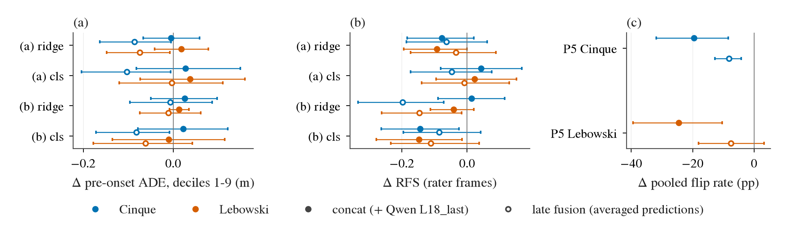
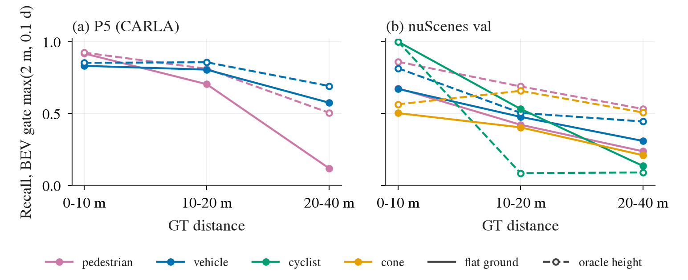

# 融合前诊断：谁看得见什么、谁对什么起反应、缺口在哪（9 项，1–2 张卡）

状态: 第 0–2 阶段完成（2026-09-25 20:50）；第 3 阶段（P5 v1 上复跑 Q9a、Q9b、Q1-P5、Q6）等 I1。预登记写于 18:00，任何新拟合、新抽取之前；18:06 分到 GPU 3，19:03 起 GPU 0 作第二张卡（排程 B），SAM 批量另借 GPU 1 / 4（main 批准）
用户决定（2026-09-25）: (1) SAM 3.1 权重直接用 ModelScope 同名副本，SAM License 已接受；(2) 新建 `envs/sam3`；(3) 卡由中央调度员分配，可能是 1 张也可能是 2 张，本文件不指定卡号，两种排程都写在下面。
上游: 第 22 条（judge 口径）、第 24 条（P3 阶梯）、第 25 条（continuation prior + reaction decoder）、第 32 条（P5 v0）、第 34 条（WOD zero-shot）、第 35 条（榜单 E 层）、
第 40 条及后续 (iii)（[driving-backbones](2026-09-24-driving-backbones/README.md)）、第 42 条（[reactivity](2026-09-25-reactivity-program.md) 的 D0 / M-C）、
[op-temporal-p5-and-route](2026-09-25-openpilot-temporal-p5-and-route.md)（实验 1、2a、2b）
主线: openpilot 冻结；闭环考试仍暂停。本文件全部是开环、离线，读已有特征和已有帧。

## 目的

融合架构有四个候选零件：openpilot 冻结的 `temporal` 特征（512 维，进 plan head 之前的时序 token）、Qwen3-VL-4B 原生视频 token（`L18_last` / `L18_mean`）、
SAM 3.1（Meta 的开放词表分割 / 跟踪模型，文本概念 prompt）作为结构化感知 schema（「这帧里有哪些物体、在 BEV 的哪里」的 JSON 状态）的来源、
Jev 式的 typed decision head（输出离散的动作类型 + 参数，而不是整条轨迹回归）。在选之前，先用盘上已有的数据量清楚三件事：
**谁看得见什么**（表征 / 感知的覆盖）、**谁对什么起反应**（读出之后的行为）、**缺口落在哪一层**（感知、决策、路线）。

已经知道的（本文件不重做，只当先验）：

| 来源 | 事实 |
|:--|:--|
| 第 40 条 | openpilot `temporal` + `ridge_late`（先拟合 ego ridge，再在 ego + 特征上拟合它的残差）在 WOD 上是全阶梯最强的冻结表征：pre-onset（机动开始前的帧）−0.29 / −0.32 m，RFS（Rater Feedback Score，0–10）cls 头 7.64 / 7.73 |
| 实验 1 | 同一 `ridge_late` 在 P5 上翻转率 42–47%，全部来自车辆 cut-in（HighwayCutIn 86–89%）；行人 family 与 Light 为 0%，行人 probe AUC 0.50–0.53，Qwen `L18_last` 0.62–0.88 |
| 实验 2a | 起始速度 < 0.5 m/s 的 120 个 rater 帧上 `cls_late` 与 cv（constant velocity）打平；Intersections 上与原生 plan 打平 |
| 第 42 条 D0 | 行人信息在 openpilot 的 vision encoder 输出里就没有（AUC 0.515 / 0.519），不是时序模块丢的 |
| 第 42 条 M-C | 配对差分监督的线性 reaction head（prior = openpilot `ridge_late`，输入 Qwen `L18_last` ⊕ `temporal`）：cut-in +13 pp，行人仍 0；**只 Qwen 流也是 0**；训练对上行人拟合斜率中位 0.12，瓶颈在 pooled 输入 |
| 第 22 条 | judge：主判 s_ego（ego-only readout 的残差）第 1–9 档上的 pre-onset ADE Δ，RFS 并排，DiD（pre-onset Δ − straight Δ），第 10 档单独 |
| 第 32 条 | P5 judge：定向翻转率（expert 在 x⁺/x⁻ 两侧的 2 s 速度差 Δ_expert 与模型 Δ 同号且 \|Δ_model\| > τ_model），τ 由各自 null（只换天气的对）定，报样本外 null false-flip |

所以 Q5 已完成、Q9 的 pooled 版本已完成（见下），Q1 在 P5 行人上的结果大概率是 0。本文件的新信息主要来自 Q1 的 WOD 半边、Q2、Q4、Q6、Q7、Q8 和 Q9 的空间 token 版本。

## 盘上已有什么（2026-09-25 17:55 在 box 上只读核对）

| 数据 | 路径（`$DATA_DIR` 下） | 规模 |
|:--|:--|:--|
| WOD index（含 `cluster`、`intent`、`n_pref`） | `processed/waymo_e2e/index.parquet` | train 415 663 / val 106 360 / test 738；val rater 帧 479（Interections 116、Foreign Object Debris 78、Cyclist 71、Pedestrian 52、Multi-Lane 42、Single-Lane 38、Special Vehicles 25、Others 22、Cut_ins 20、Construction 15；`Interections` 是 WOD 原拼写） |
| openpilot 特征，子集 | `features/op_{small,cinque,lebowski}_p3` | 20 237 行，`temporal` / `vision` / `hidden` / `plan` |
| openpilot 特征，train + val | `features/op_{cinque,lebowski}_p3_trainval` | 522 023 行，只有 `temporal` |
| Qwen3-VL-4B 视频，子集 | `features/qwenvid_p3` | 19 663 行，`L18_last` 2560 / `L18_mean` / `vis_mean` / `vit_mean` |
| Qwen3-VL-4B 视频，train thin=4 | `features/qwenvid_train_t4`（356 个 shard 目录，39 GB） | train 137 533 + val 19 663 行；另有 **`L18_grid`（4×4 空间网格）** |
| V-JEPA 2 | `features/vjepa2_p3`、`vjepa2_p3_trainval` | 19 663 / 506 517 行（前视） |
| 逐帧预测（第 40 条 (iii)） | `runs/drive_backbones/heads_train/20260925-110819/p3drive_heads_preds_dir0.npz` | val 106 360 帧：`ridge ego`、`ridge_late` × 2、`cls ego K1024`、`cls_late` × 2，外加 `fut`、`speed`、`s_ego`；**没有原生 plan 和 cv** |
| 原生 plan / cv 的 rater 帧打分 | `runs/wod_zeroshot/score/*/per_frame.npz`（479 帧，含 `cluster`、`intent`、三条 rater 轨迹与分数、cv） | openpilot 原生逐帧轨迹在 `runs/wod_zeroshot/openpilot`（执行时确认具体 run） |
| P5 v0 index | `processed/carla_p5/{index,obs,null}.parquet`、`pairs.csv` | 29 827 行（obs 9919 + train 19 908；P5 20 298、P4 9529）；165 对（`t_trig`/`t_vis`/`t_div`/`t_last`，单位 20 Hz tick） |
| P5 特征 | `processed/carla_p5/features`（Qwen，19 块 × 1500）、`op_{cinque,lebowski}`（`temporal`）、`op_*_vis`（`temporal`/`vision`/`hidden`） | 29 827 行；**没有 V-JEPA 2，没有 Qwen 空间网格** |
| P5 原始帧 | `runs/p5_pairs/gen/attempts/<run>/<attempt>/`：`cams/{front,front_left,front_right}/*.jpg`（972×1079）、`actors.npz`（frame/id/xyz/yaw/v）、`actor_kinds.json`（蓝图、scenario/background、bbox 尺寸）、`frames.jsonl`、`pose.jsonl`、`lights.json` | 420 个 attempt 目录（385 个完成的 run），128 328 张 JPEG（前视 42 776），27 GB；相机标定在 `processed/carla_p5/op_plan.json` 的 `calib` |
| openpilot lead 输出 | `runs/p5_pairs/lead_save` | **空**：P5 上 openpilot 的 lead 输出没存，Q4c 要重跑一次 stream |
| nuScenes | `datasets/nuscenes`（148 GB，`samples/CAM_*` 各 34 149 张 + `v1.0-trainval` 标注） | val 150 scene / 6019 个 keyframe；前三路 18 057 张 |
| P5 v1（I1） | `runs/p5v1/gen-pdm` 在生成（178 / 1029 done） | Q9a、Q1-P5 在 v1 出来后复跑 |
| SAM 3.1 | **不在盘上**。HF `facebook/sam3.1` 是 manual gated，我们的 token（`taitanpascal`）403；ModelScope `facebook/sam3.1` 可直接拉（`sam3.1_multiplex.pt` 3.50 GB，SAM License 2025-11-19） | 见 Q4 的阻塞项 |

box 状态：GPU 3 在 17:54 空闲（其余四张 40–57 GB 在用），load 约 90 / 125 核，数据盘剩 438 GB。

## 九项诊断

共同规则见文末「硬约束」。每项的资源估计在下面的汇总表里。

### Q1 互补矩阵：openpilot 和 Qwen 加在一起，比单个好多少

- **问题**：两路表征是冗余、互补在感知（行人存在），还是互补在决策（pre-onset）？
- **做法**：head 与 judge 一字不改（`ridge_late`、`cls_late` = K = 1024 anchor 的线性 softmax 分类头，以 `cls ego` logits 为冻结 offset）。arm：
  `ego`；Cinque / Lebowski `temporal`；Qwen `L18_last`、`L18_mean`；V-JEPA 2 `mean`；concat（Cinque `temporal` ⊕ Qwen `L18_last`，Lebowski 同）；late fusion（两个单 arm 的样本外预测等权平均；cls 头为 logits 相加）。
  concat 的两路先按训练行标准化、再各乘 1/√d，使两路总方差相等（与 M-C 相同）。
  - WOD (a)：`p2p3_v1` 的 19 663 帧，第 40 条的半/半 cross-fit，每个 rater 帧恰评一次。
  - WOD (b)：train 训、val 评，训练行 = `qwenvid_train_t4` 的 137 533 行 ∩ op trainval ∩ V-JEPA 2 trainval，评估行 = val 的 19 663 行（Qwen val 只覆盖这些）。
  - P5：29 827 行，`p5_exam` 按路线 5 折，一字不改；V-JEPA 2 在 P5 上没抽，列为可选（见资源表）。
- **输出**：每个 arm 的 pre-onset Δ（第 1–9 档）、RFS Δ（cluster mean 与 frame mean）、DiD、P5 按 family 的翻转率与 null false-flip；
  **concat − best single 的配对 Δ 与 95% CI**（WOD 按 sequence、P5 按路线 bootstrap）。best single 在 fit 半 / 训练 fold 上按同一读数选，不在评估行上选，避免选择偏差。
  另报每个 arm 按 WOD cluster 的 RFS，作为能力矩阵的一列。
- **已有数据**：全部特征都在；单 arm 的 WOD 数字大多已有（第 40 条），这里重算只为在同一批帧上配对。P5 上 Qwen 单 arm 0%、openpilot 42–47%、M-C 双流行人 0% 已知。
- **预期**：P5 行人上 concat 仍 0；WOD 上 concat 对 openpilot 的增益 ≤ 0.05 m，CI 大概率跨零。

### Q2 WOD 损失解剖：openpilot 输的帧，是没看见、看见了决策错，还是路线本身有歧义

- **问题**：在 WOD 的 rater 帧上，openpilot 输分的原因分布。
- **做法**：
  - 损失帧：rater 帧上 Cinque 原生 plan 或 Cinque `cls_late` 的 RFS ≤ max(三条 rater 轨迹的分) − 1。按 cluster 分组：Interections、Special Vehicles、Multi-Lane、Pedestrian、Cut_ins、Foreign Object Debris（其余 cluster 并成「其他」，只描述）。
  - **Q2a（纯 CPU，先做）**：rater_best 对 log 与对模型的差按方向分类：纵向（2 s / 5 s 纵向位移差 > 3 m，分停 / 走两支）、横向（终点横向差 > 2 m 或朝向差 > 15°）。
    横向差异的帧按 intent 判：intent 是转弯且 rater_best 朝 intent 方向、模型没有 → 「决策错（intent 解释得了）」；intent 是直行 / UNKNOWN 而分支是转弯或并道 → 「路线歧义」。
  - **Q2b（依赖 Q4 的 SAM 环境）**：纵向损失帧上，「原因物体」由 SAM 3.1 在前视图上标出（固定 prompt 列表，地面接触点经 WOD 标定抬到 BEV，ego 未来 5 s logged 路径 ±1.5 m 走廊内、40 m 以内）。
    hazard-presence probe：标签 = 走廊内是否有该 cluster 对应类别的物体（Pedestrian → pedestrian，Cyclist → cyclist，Cut_ins / Multi-Lane → vehicle，Foreign Object Debris → cone ∪ debris，Special Vehicles → emergency vehicle），
    在 19 663 帧子集上按 sequence 4 折 cross-fit 的 logistic probe，两份：openpilot `temporal` 上一份、Qwen `L18_last` 上一份；阈值取各自 90% specificity 的工作点（在训练折上定）。
  - 每个纵向损失帧归入：**看见了但决策错**（有原因物体且 openpilot probe 过阈值）/ **没看见**（有原因物体、openpilot probe 不过）/ **无可见原因**（SAM 在走廊内没标出物体；灯、规则、让行等）。
    另加一列「Qwen 看见而 openpilot 没看见」的比例，这是融合能补的那部分。
- **输出**：cluster × 类别的比例表（带按 sequence bootstrap 的 CI）；逐帧 CSV（帧名、cluster、方向、类别、两份 probe 分数）。
- **已有数据**：Q2a 全在盘上（per_frame.npz + preds npz）；Q2b 需要 SAM 在 WOD 前视 ~20 100 张图上跑（479 个 rater 帧 + 19 663 帧子集，probe 需要训练行）。
- **限定**：同一 cluster 里 rater 帧只有 15–116 个，损失帧更少，比例的 CI 会很宽；这是描述性读数，决策规则只用合并比例。

### Q3 真实数据镜像：P5 上的 family 结论在 WOD 的对应 cluster 上有没有影子

- **问题**：实验 1 里「openpilot 对 cut-in 有反应、对行人没有」在真实数据的 cluster 上是否同样成立。
- **做法**：零拟合。已有逐帧预测按 cluster 切：Cut_ins、Pedestrian、Cyclist、Foreign Object Debris（对照：Interections、全部）。
  两个配对差：`cls_late` − `cls ego`（表征的贡献，val 全部帧的 ADE 第 1–9 档 + rater 帧 RFS），原生 − cv（rater 帧 RFS；ADE 在 20 237 帧子集上用 `op_*_p3/plan`）。
- **输出**：cluster × 读数的 Δ 与 CI（sequence bootstrap）。
- **已有数据**：全部在盘上。

### Q4 感知 schema 的召回：SAM 3.1 看得见多少，抬到 BEV 准不准

- **问题**：如果行人这条线交给结构化感知（SAM → JSON 状态 → decision head），它在我们关心的距离和天气上召回够不够；openpilot 自己的 lead 输出又召回多少。
- **做法**：
  - **Q4a P5**：观测帧（x⁺ / x⁻ / null 两侧，obs 角色 9919 行 × 3 路 = 29 757 张图），固定 prompt 列表：pedestrian、cyclist、vehicle、cone、debris、emergency vehicle，image 模式逐帧检测。
    每个实例取 mask 最低处的地面接触点，用 `op_plan.json` 里的 CARLA 标定（intrinsic 含畸变，extrinsic 高 1.806 m）按平地假设抬到 ego BEV。
    GT = `actors.npz` + `actor_kinds.json`（同一 frame 的全部 actor，bbox 底面中心）。匹配：同类别、BEV 距离 ≤ max(2 m, 0.1 × 距离) 的 Hungarian。
    **可见性**：CARLA 没存深度，被遮挡的 actor 也在 GT 里，所以召回分两层报：(i) hazard actor 在 `factor_px` 大于阈值（obs.parquet 已有，因素可见的像素数）的 x⁺ 帧上的召回，这是主读数；
    (ii) 背景 actor 在视锥内、≤ 40 m 的召回，明确标注「含遮挡，偏低」。
  - **Q4b nuScenes val**：6019 个 keyframe × 前三路 = 18 057 张，同一 prompt，GT 是 devkit 的 3D box（visibility token ≥ 3，即 ≥ 40% 可见），抬 BEV 用 `calibrated_sensor` + `ego_pose`。
  - **Q4c openpilot lead**：在 P5 的同一批 stream 上重跑 Cinque / Lebowski（实验 1 的抽取器，只多存 `leads_v3` 输出），GT lead = ego 车道走廊（未来 route ±1.5 m）内最近的车辆，≤ 80 m。
  - **Q4d 延迟**：在我们的卡上量 batch 1 的 image 模式（1 路 / 3 路，6 个 prompt）和 video 模式（5 Hz stream，约 5 个对象），报 p50 / p95 与峰值显存。
- **输出**：召回、precision、BEV 位置误差中位数 / p90，按 类别 × 距离档（0–10、10–20、20–40、40–80 m）× 天气（白天 / 夜晚按 `sun_altitude` < 0 / 雨按 `precipitation` > 30；nuScenes 按 scene description）；
  openpilot lead 的召回与距离误差；延迟表。
- **已有数据**：帧和 GT 全在；SAM 3.1 权重、环境都没有。
- **权重与环境（已决定，2026-09-25）**：HF 上 `facebook/sam3.1` 是 manual gated（我们的 token 403），**直接拉 ModelScope 同名副本**（3.50 GB，走 Alpamayo 那条路），SAM License（Meta 自定义许可，2025-11-19 版）用户已接受。
  官方要求 Python ≥ 3.12、PyTorch ≥ 2.7、CUDA ≥ 12.6，没有 transformers 集成，走 `facebookresearch/sam3` 仓库；box 上的 `envs/jevdrive` 是 3.11，所以新建 `envs/sam3`（torch cu128 或 cu130，sm_120 已支持）。
  文本 prompt 在 video 模式下官方支持（`handle_request(start_session / add_prompt)`，SAM 3.1 的 release note 有 video PCS with text prompt 一栏）。未核实：SAM 3.1 的 multiplex checkpoint 是否也提供单独的 image 检测接口；若不提供，image 模式改用同一仓库的 SAM 3 检测器（`facebook/sam3`，ModelScope 同样有镜像），这一条写进偏离日志。
- **等价性 / 坐标检查（批量之前必须过，16 帧）**：挑 16 个 hazard 清楚可见的 P5 x⁺ 帧（8 个行人、8 个车辆，覆盖三路相机和 5–40 m）：
  (a) GT actor 底面中心投到图上，落在匹配的 SAM mask 外接框内，像素误差中位 ≤ 15 px；(b) SAM 地面点抬到 BEV 与 GT 的距离，≤ 20 m 的中位 ≤ 1.0 m；
  (c) 同一张图 batched 与单张推理的输出一致（mask IoU ≥ 0.99，分数差 ≤ 1e-3）；(d) nuScenes 取 4 帧做 (a)(b)。任何一条不过，先修再批量。

### Q5 vision 层 probe

已完成：[reactivity 计划的 D0](2026-09-25-reactivity-program.md)，第 42 条。行人合并 AUC 0.515 / 0.519，不过 0.60；信息在 openpilot 的 vision encoder 就没有。
本文件只引用，不重做；I1 的 P5 v1 出来后由 reactivity 计划复跑。

### Q6 反应有多少是几何：规则门在 GT 状态和 SAM 状态上各能拿多少

- **问题**：P5 里 expert 的反应，多少能被三条几何规则解释；换成 SAM 感知到的状态后还剩多少。
- **做法**：三条规则门，参数在 P4 训练路线（role = train，不含 P5 pair 路线）上定，之后冻结：
  (i) TTC 门：走廊内前方物体的 TTC < 3.0 s；(ii) 车道侵入：任一物体 BEV 位置进入 ego 未来 3 s 路径 ±1.2 m；(iii) 行人接近：行人朝走廊方向的速度分量 > 0.5 m/s 且距走廊 < 4 m、距离 < 30 m。
  任一门触发 → 预测「制动」方向，量级取 expert 在 P4 训练帧上触发时的中位减速。按 P5 协议算定向翻转率（x⁺ 触发、x⁻ 不触发、方向与 Δ_expert 同号）与 null false-flip。
  先在 GT 状态（`actors.npz` + `pose.jsonl`）上算，再在 SAM 状态（Q4a 的 BEV 点，5 Hz 最近邻 Hungarian 关联出速度）上算。
- **输出**：每个 family 的 rule floor（GT）与 perception-limited floor（SAM），以及二者之差。
- **已有数据**：GT 部分全在；SAM 部分依赖 Q4a。
- **限定**：BehaviorAgent 本身就是规则 expert（不提前减速），GT 规则门在 v0 上接近 expert 是半同义反复；I1 的 PDM-Lite 标签出来后复跑，决策规则以 PDM-Lite 那次为准，v0 只描述。

### Q7 模式词表：数据里到底有几种反应

- **问题**：typed decision head 的输出词表应该有哪些类型；openpilot 的 desire 输入能覆盖多少。
- **做法**：
  - P5：每个 reactive 帧的 expert 两侧差（`future.npy` 的 x⁺ 减 x⁻）取三维描述：2 s 纵向位移差、最大横向位移差、onset 时间（`t_div` − `t_vis`）。标准化后 GMM，k = 1…8 按 BIC 选。
  - WOD：rater 帧里 s_ego 第 10 档（约 48 帧）以及全部 rater 帧，rater_best − log 的 20 × 2 差，取同样三维（onset 取纵 / 横差首次超过 0.5 m 的时刻），同样聚类。
  - 每个聚类映射到 openpilot 的 desire（none、turnLeft、turnRight、laneChangeLeft、laneChangeRight、keepLeft、keepRight；第 8 位保留未用）：横向类能映射，纵向类（停、让、蠕行、提前减速）映射为「无」。
- **输出**：模式词表表（模式、定义、P5 与 WOD 各自的占比、desire 覆盖与否）；覆盖率 = 能映射到 desire 的帧占比。
- **已有数据**：全在盘上，CPU。

### Q8 反应时间窗：慢通道来得及吗

- **问题**：因素可见到 expert 必须分叉之间的时间，减去感知 + 决策延迟，还剩多少；哪些 family 必须留在快通道（20 Hz 的 policy）。
- **做法**：每对取 `t_div` − `t_vis`（20 Hz tick → s）的分布，按 family；减去三档延迟：openpilot Cinque 2.3 ms（p50，smoke）、SAM 3.1 在我们卡上的实测（Q4d）+ decision head、openjev 470 ms p50（3 路，docs/baselines.md，作为 VLM 慢通道的代表）。
  **「必须留在快通道」**：某 family 的窗口 p25 < 慢通道延迟 + 0.5 s（执行余量）。
- **输出**：family × 延迟档的剩余预算表与标记。
- **已有数据**：窗口全在（`pairs.csv`）；SAM 延迟依赖 Q4d。
- **限定**：BehaviorAgent 反应晚，`t_div` 偏晚，窗口偏宽；PDM-Lite（I1）出来后给第二个估计，判定取两者中较短的。

### Q9 读出能不能救 Qwen 的行人

- **Q9a（pooled，已完成）**：就是第 42 条 M-C 的「配对差分，只 Qwen」arm：行人翻转 0%，cut-in +1.1 pp，null 5.3%。按下表规则已经落在「still 0」。
  I1 的 P5 v1 出来后在加固版上复跑同一 arm 与 hard-example 重加权对照（分钟级，CPU），这是 Q9a 的最终读数。
- **Q9b（空间 token，新）**：M-C 的诊断说 pooled 输入连训练对都拟合不了，所以把输入换成 Qwen `L18_grid`（4×4 空间网格，`qwenvid_train_t4` 已用同一 recipe 抽过）。
  在 P5 obs 行（9919 行）上重抽 `L18_grid`；head = 在 16 个网格 token 上的单层 attention pooling + 线性输出（与 P2 的 attention readout 同构），配对差分 loss（同 M-C），
  对照 = 同结构的 hard-example 重加权；μ 项（直行帧上修正为零）由 null 对承担，不再读 role = train 行（因为 train 行没有网格特征；这一点与 M-C 不同，预先写明）。
  按路线 5 折，`p5_exam.exam` 一字不改。
- **输出**：行人合并翻转率 [CI]、cut-in 对 prior 的配对 Δ、样本外 null false-flip；训练对上的拟合斜率（同 M-C 偏离 5 的诊断）。
- **判据**（沿用 M-C）：行人 ≥ 20% 且路线 bootstrap CI 下端 > null false-flip，且 null ≤ 7%。

## 预登记的决策规则

「CI 不跨零」都是 95%，配对 bootstrap（WOD 按 sequence，P5 按路线，500 次）。

| 观测 | 操作化 | 含义 | 方向 |
|:--|:--|:--|:--|
| Q1 concat 不加分 | concat − best single 在 WOD pre-onset、RFS、P5 合并翻转率三个读数上 CI 都跨零（或偏负） | 冗余 | 只调 openpilot，去掉 Qwen |
| Q1 只在行人 family 上加分，且 Q4 SAM 召回够 | P5 行人合并翻转 concat − best single CI > 0，WOD 两个读数 CI 跨零；SAM：hazard 行人召回 ≥ 0.9（≤ 30 m、白天）且 ≥ 0.8（全部），≤ 20 m BEV 误差中位 ≤ 1 m，nuScenes 行人 ≤ 30 m 召回 ≥ 0.8 | Qwen 只贡献「存在」 | SAM → JSON 状态 → decision head；去掉 Qwen |
| Q1 在 pre-onset 上也加分 | WOD pre-onset concat − best single CI 整体 < 0（(a) 与 (b) 两个协议都成立） | Qwen token 带决策相关信息 | token 进 decision head（M-C）；SAM 只做离线标注 |
| Q2 损失多数是「看见了但决策错」 | 六个 cluster 合并的纵向损失帧里该类 > 50%，加上横向里「intent 解释得了」的帧 | 缺决策 | Jev 式 head 有理由，词表取自 Q7 |
| Q2 多数是「没看见」 | 合并比例 > 50% | 缺感知 | 先建 Q4 的感知层，decision head 其后 |
| Q6 GT 规则 floor 接近 expert | PDM-Lite 标签下，GT 规则门的 family 合并翻转率 ≥ 80%，null false-flip ≤ 7% | 反应主要是几何 | 规则 + 学习的混合就够；VLM 的价值必须在 Q2 的语义帧（无可见原因 / 看见但决策错）上单独证明 |
| Q9 翻转离开 0，null 不动 | Q9b 过 M-C 判据 | 是读出问题 | Qwen 保留为行人通道 |
| Q9 仍为 0 | Q9a 与 Q9b 都不过 | 是表征问题 | 行人走 SAM 通道 |

规则冲突时（比如 Q1 说「冗余」而 Q9b 说「读出问题」），按「越靠近行为的读数越优先」：Q9b > Q1 的 P5 行 > Q1 的 WOD 行；冲突本身写进「架构方向」一页。
Q2 两类都不过半，报三类比例，架构页写「混合」，不硬判。

## 交付物

1. **能力矩阵**：模型（ego、Cinque、Lebowski、Qwen `L18_last` / `L18_mean`、V-JEPA 2、concat、late fusion、原生 plan、SAM 规则门）× family / cluster，WOD（RFS、pre-onset Δ）与 P5（翻转率）并排。
2. **感知 schema 盲区表**：类别 × 距离档 × 天气的 SAM 召回 / precision / BEV 误差（P5 与 nuScenes 并排），加 openpilot lead 召回一行。
3. **模式词表表**：Q7 的聚类、占比、desire 覆盖。
4. **「架构方向」一页**：逐条填上面的决策规则，写明落在哪一格、证据是哪个数字。
5. 小 CSV 放 `research/results/fusion-diagnostics/`（每项一个子目录）；图按 CLAUDE.md 的规则由一个 doc 收录；结论进 decisions.md 新开一条（第 43 条，或当时的下一个号）。

## 资源估计与排程

预算：**一张专用 RTX PRO 6000（96 GB）+ 约 20 核**，其余卡和核不碰。box CPU 目前被 CARLA 压到 cgroup 上限附近（load 约 90 / 125），
D0 的考试就因此从「分钟级」拖到 60 min，所以下面 CPU 项的墙钟按 20 核、有争用估，上界放宽了。

| 项 | GPU·h | 峰值显存 | 核 | 墙钟 | 新增磁盘 | 依据 |
|:--|--:|--:|--:|:--|--:|:--|
| Q3 | 0 | — | 4 | 10–20 min | < 10 MB | 纯切片，预测都在 npz 里 |
| Q7 | 0 | — | 8 | 20–40 min | < 10 MB | GMM 在几千行上 |
| Q2a | 0 | — | 4 | 20–30 min | < 10 MB | 479 帧 |
| Q6（GT 部分） | 0 | — | 12 | 30–60 min | < 50 MB | 385 run 的 actors + pose，向量化 |
| Q1 ridge 全部 arm（WOD a/b + P5） | 0 | — | 12 | 30–60 min | < 200 MB | 最宽 3072 维，137.5k 行的 XᵀX 秒级；P5 `p5_exam` 上次 17 min |
| Q1 `cls_late` | 1.0–1.5 | ≤ 20 GB | 8 | 1.5–2 h | < 300 MB | 415k × 512 上 L-BFGS 每次约 8 TFLOP、15–30 min；137.5k × 3072 每次约 2.6 TFLOP → 每 arm 5–15 min，约 7 个特征 arm；19.6k 子集每 arm 1–2 min |
| Q1 可选：V-JEPA 2 在 P5 上抽 | 0.4–0.6 | ≤ 3 GB | 8 | 30 min | 150 MB | 48 ms / 4 帧 clip，29.8k 行 |
| Q4 环境 + 权重 | 0 | — | 4 | 工程半天；下载约 10 min | 约 12 GB（env 8 + 权重 3.5） | ModelScope 镜像 |
| Q4 等价性 16 帧 + 200 帧 profiling | 0.2 | ≤ 30 GB | 8 | 30 min | < 100 MB | 批量前必做 |
| Q4 SAM 批量（P5 29.8k + nuScenes 18.1k + WOD 前视 20.1k = 68k 张） | **1.5–3.8** | ≤ 30 GB（估） | 10（JPEG 解码 + 缩放） | 1.5–4 h | 3–6 GB（实例表 + RLE mask） | 下面单独说明 |
| Q4c openpilot lead 重跑 | 0.2–0.4 | < 10 GB | 12 | 15–25 min | < 100 MB | D0 同一批 stream 实测 11 min（12 核） |
| Q4d 延迟 | 0.1 | ≤ 10 GB | 2 | 10 min | — | |
| Q4 匹配 / 统计，Q6（SAM 部分），Q8，Q2b probe | 0 | — | 12 | 1–1.5 h | < 100 MB | Hungarian 按帧并行 |
| Q9a（I1 之后） | 0 | — | 8 | 5–20 min | — | M-C 实测 4 min（有争用时 20 min） |
| Q9b Qwen `L18_grid` 在 P5 obs 上重抽 + head | 0.8–1.7 | ≤ 12 GB | 8 | 1–2 h | < 1 GB | qwenvid train 抽取 compile b8 292 ms/帧，P5 上次 eager b2 619 ms/帧；9919 行 |
| **合计** | **约 3.8–7.7 GPU·h**（含可选的 V-JEPA 2 为 4.2–8.3；I1 v1 上 Q9b 再抽一次另加 1–2） | 同时 ≤ 60 GB | ≤ 20 | 计算关键路径 7–10 h；含工程约 2 个工作日 | 约 20 GB（盘上剩 438 GB） | |

**SAM 吞吐的估法**（最大的不确定性，所以批量前 200 帧实测，以实测为准）：官方数字是 SAM 3 在 H200 上 100+ 个对象每张 30 ms、SAM 3.1 在 H100 上约 5 个对象 32 fps（video）；
我们的卡按 bf16 算力和显存带宽比 H100/H200 慢约 1.5–2.5 倍，单 prompt 每张 45–75 ms。6 个文本 prompt 共享一次图像编码，每多一个 prompt 付一次融合编码器 + DETR decoder（估编码占单 prompt 时间的约 60%），
所以每张 80–200 ms（中位估 120 ms），68k 张 1.5–3.8 h。等效只算 P5 观测帧（29.8k 张）是 0.7–1.7 h。video 模式只用于 Q4d 的延迟和 Q6 的速度关联的抽查，不做全量。
**停机线**：200 帧 profiling 外推全量 > 7.6 h（估计上界的 2 倍）就停下来报，考虑的降档依次是：WOD 只做 479 个 rater 帧 + 5000 帧 probe 训练行、nuScenes 只做 CAM_FRONT、P5 只做 x⁺ 与 null。

**排程 A：分到一张卡**（并发与先后）：

1. **第 0 阶段（CPU，立刻）**：Q3、Q7、Q2a、Q6（GT）并行，总 ≤ 20 核，约 1 h 墙钟。同时装 `envs/sam3`、拉 ModelScope 权重。
2. **第 1 阶段（GPU 两路并发）**：
   - 路 A：Q4 的 16 帧检查 → 200 帧 profiling → SAM 批量（P5 → nuScenes → WOD 的顺序，逐数据集落盘、可续跑）。≤ 30 GB、10 核。
   - 路 B：Q1 的 `cls_late`（WOD a、b 与 P5）和 ridge，≤ 20 GB、8 核；它是 L-BFGS 的小矩阵乘，与 SAM 共卡会互相拖慢约 20–40%，但总墙钟仍短于串行。
   - Q4c（lead 重跑，< 10 GB、12 核）排在路 B 之后，避免两路同时吃 CPU 超过 20 核。
3. **第 2 阶段**：SAM 批量结束后，Q4 统计、Q6（SAM）、Q8、Q2b 在 CPU 上跑（约 1.5 h）；同时 GPU 跑 Q9b 的网格重抽（≤ 12 GB）。
4. **第 3 阶段**：I1 的 P5 v1 出来后（约 10–12 h 后），Q9a、Q1-P5、Q6 在 v1 上复跑（CPU 为主，约 1 h；Q9b 需在 v1 obs 帧上再抽一次网格，约 1–2 h GPU）。
5. 汇总四张表与架构页，写 decisions.md。

整个包：不等 I1 的部分约 **1.5–2 天**（其中计算关键路径 7–10 h，其余是 SAM 接入、BEV 抬升和匹配的工程）；加上 I1 v1 的复跑再加半天。

**排程 B：分到两张卡**。GPU·h 总量不变（3.8–7.7），变的是关键路径：
- 卡 1 只跑 SAM 链（16 帧检查 → 200 帧 profiling → 批量 → Q4d 延迟），不与任何 L-BFGS 共卡，批量不再被拖慢 20–40%，估 1.2–3 h。
- 卡 2 依次跑 Q1 `cls_late`（1.5 h）→ Q4c lead 重跑（20 min）→ Q9b 网格重抽 + head（1–2 h）→ 可选 V-JEPA 2 抽取（30 min）。
- CPU 仍是 20 核上限，是两张卡时的瓶颈：SAM 的 JPEG 解码 10 核、Q1 8 核已到顶，Q4c 与 Q9b 只能排在 Q1 之后；第 0 阶段的 CPU 项照旧先跑。
- 计算关键路径从 7–10 h 缩到约 **4–5 h**，整包仍约 1.5 天（工程时间不变）；I1 v1 后的复跑同 A。
- 两张卡时显存合计 ≤ 60 GB 的约束不变，每张 ≤ 30 GB。

## 硬约束

- judge 一字不改：WOD 用第 22 条口径（`waymo_ladder.rejudge`），P5 用 v0 的定向翻转率 + 样本外 null false-flip（`p5_exam.exam`）。新增的只是 arm、examinee 和描述性读数。
- 训练与考试按路线（P5）或 sequence（WOD）分开；所有阈值（probe 工作点、规则门参数、best single 的选择）只在训练行上定。
- SAM 部分必须先过上面的 16 帧坐标 / 等价性检查，才能批量。
- 只用中央调度员分给本任务的卡（1 张按排程 A，2 张按排程 B；卡号以 `runs/schedule.md` 为准，本文件不指定）和约 20 核；其他卡上什么都不跑。每个 > 1 min 的作业进 tmux，写 `log.txt` / `events.jsonl` / `tb/`，并在 `runs/zeroshot-exam/gpu-plan.md` 登记。
- 任何一步超出本表估计的 2 倍就停下来报，不自行加资源。
- 偏离写进下面的偏离日志，时间戳早于受影响的数字。

## 偏离与澄清日志

（执行时追加。）

- 2026-09-25 18:20 CST [Q3] 原生 plan 用 decision 40 (iii) `heads_readout` 读的同一份：`processed/drive_backbones/op_{cinque,lebowski}_native.npz`（20 237 帧子集的流式抽取，`wod` 即 `op_*_p3/plan` 换算成 WOD 后轴 waypoint 的版本，覆盖全部 479 个 rater 帧）。
  ADE 的 native − cv 按登记在这 20 237 帧上算，s_ego 分档取 `heads_train/20260925-110819` 在 val 全部 106 360 帧上的十分位（与 `rejudge` 同一口径），子集只是取其中的行。
  另加一行描述性读数：native − cv 在 val 全部帧上的 ADE（`op_*_trainval_native.npz`，实验 2a 用的那份），标为 side，不进判据。`cls_late − cls ego` 另报 pre-onset 第 1–9 档一列，同样标 side。
  CI 用 `waymo_p1.paired`（sequence bootstrap，1000 次）。
- 2026-09-25 18:20 CST [Q2a] (1) 原生 plan 同 [Q3]（`op_cinque_native.npz`）；`cls_late` = `heads_train/20260925-110819` 的 `cls_late op-cinque temporal`。
  (2) 损失帧 = 两者之一 RFS ≤ max(rater 分) − 1 的并集；方向按「输了的那个模型」判，两个都输时按原生 plan 判（问题问的是 openpilot 输的帧）；另附按模型分开的两张表。
  (3) 差值 = 模型 − rater_best，在 rater_best 自己的纵 / 横坐标系里量（与 RFS 同一个 `_rater_frames`）：纵向取 2 s（第 8 个点）与 5 s（第 20 个点）的纵向投影，任一 |·| > 3 m 算纵向，
  rater_best 在后（模型走得更远）为「停」支、rater_best 在前为「走」支；横向取 5 s 的横向投影 |·| > 2 m，或朝向差 > 15°（朝向 = 最后 0.5 s 的位移方向，两条轨迹这段都 ≥ 0.5 m 才判）。
  同时满足横向与纵向的帧归横向（因为横向要再按 intent 拆），另记一个 `both` 标记；两者都不满足记「无方向」（例如低速 trust region 缩小导致的输分）。
  (4) intent 拆分：intent = GO_LEFT / GO_RIGHT，且 rater_best 在 5 s 的弦方位角朝 intent 一侧超过 5°（`waymo.ONSET_BEARING`）而模型没有 → 「决策错（intent 解释得了）」；
  intent = GO_STRAIGHT / UNKNOWN → 「路线歧义」；intent 是转弯但不满足前一条（例如两者都转、只是车道不同）→ 「横向其他」。
  (5) rater_best − log 用同一套分类另存为描述列。比例的 CI：损失帧上的类别指示变量，sequence bootstrap（`traj.boot_ci`，1000 次）。Q2b 的列（SAM 原因物体、两份 probe 分数、类别）留空。
- 2026-09-25 18:20 CST [Q7] (1) P5 的 reactive 帧 = `p5_exam.exam` 的定义（|Δ_expert| > τ_exp，τ_exp = max(null |Δ_expert| 的 95 分位, 0.5)）。
  (2) 三维描述：2 s 纵向差 = x⁺ − x⁻ 在第 8 个点（2.0 s）的 x；最大横向差 = |Δy| 最大那一点的带符号 Δy（左正，desire 映射需要方向）；onset 按登记 P5 取 (t_div − t_vis) × 0.05 s（逐对常数），
  WOD 取 |Δx| 或 |Δy| 首次 > 0.5 m 的时刻（0.25–5 s；从不超过记 5.25 s，删失）。两边 onset 含义不同，所以**分开聚类**（各自标准化、各自 BIC 选 k），词表通过同一套命名规则对齐。
  (3) GMM：sklearn `GaussianMixture`，full covariance，n_init = 10，reg_covar = 1e-4，seed 0，k = 1…8 取 BIC 最小。WOD 聚类在全部 479 个 rater 帧上拟合，s_ego 第 10 档（val 全部帧的十分位）另报各簇占比，并单独拟合一次。
  (4) 簇 → 模式 → desire 的命名规则（按簇内中位数，物理单位，预先写死）：|最大横向差| ≥ 1.0 m 为横向类，≥ 6 m → turnLeft/Right，2.5–6 m → laneChangeLeft/Right，1.0–2.5 m → keepLeft/Right；
  否则为纵向类（desire「无」）：2 s 纵向差 < −1 m 为「减速 / 停」，> +1 m 为「加速 / 走」，其余为「近零差」。覆盖率 = 落在横向类簇的帧占比。
- 2026-09-25 18:20 CST [Q6] (1) **P4 的 attempt 目录里没有 `actors.npz`**（P4 录制器不存 actor），GT 状态下 P4 训练路线上算不出门是否触发，登记的「在 P4 训练路线上定参数」做不到。
  处理：三条门的阈值就用登记里写明的数值（TTC 3.0 s；±1.2 m；0.5 m/s、4 m、30 m），不做任何拟合；唯一要拟合的量是制动量级 m（门触发时 expert 的中位减速 v0 − v(2 s)），
  改在 P5 role = train 帧上按 `p5_exam.folds` 的路线 5 折**样本外**估（评估第 f 折时只用其余 4 折路线的训练帧，与 `p5_exam.heads` 的训练行口径相同，路线不相交）。
  注意：Δ_model = −m_f ·（门(x⁺) − 门(x⁻)），取值只有 {−m, 0, +m}，定向翻转率与 null false-flip 对 m 不敏感，m 只影响量级列。
  (2) 「ego 未来 3 s 路径」用路线中心线（`route.json`，从 ego 最近点向前 max(v0 × 3 s, 5 m)），**不用 logged 未来**：x⁺ 的 logged 未来已经含 expert 的制动，会把答案漏进门里。
  TTC 门的走廊 = 同一中心线向前 60 m、±1.2 m，TTC = 纵向间距（减 ego 前悬 = bbox 半长）/ 接近速度（v0 − 物体速度在路径切向的分量，> 0 才算）；行人门的走廊 = 中心线向前 30 m，
  「距走廊」= 到中心线横距 − 1.2 m，「朝走廊方向的速度分量」= 物体速度在指向中心线的法向上的分量；只对 walker 计（自行车按 vehicle 类进 (i)(ii)）。
  (3) 物体 = 同一 tick 的全部 actor（除 ego），与 ego 高差 > 8 m 的剔除（x⁻ 的 hazard 被藏在地下 500 m、生成前也在地下）。坐标用 CARLA 左手系取 y 反号转成右手系，ego BEV 原点在车辆位置（bbox 中心地面），x 前 y 左。
  (4) 考官：`p5_exam.exam` 一字不改，examinee = `gate any`（主读数，rule floor）以及三条门各自（描述）。
- 2026-09-25 18:22 CST [Q7] **事后诊断（看过 Q7 表之后加的，不改登记的表）**：P5 的三个「横向」簇（turn left / laneChange right / keep right）2 s 纵向差中位是 −1.5 到 −5.8 m，
  且 Light、StaticCutIn 占大头，怀疑是「一侧停、一侧沿弯道走」在 ego 坐标系里投出来的横向差，不是横向决策。另算一列 off-path 横向差：x⁺ 每个点到 x⁻ 折线（及反向）的最大横距，
  < 1.0 m 视为「同一路径、只差纵向」。只作为横向簇的解释列，覆盖率的登记口径不变。
  （18:25 CST 补记：上一行时间戳原写成 18:35，是按本机 JST 减错了，实际写于 box 时钟 18:22，早于 18:23 的 Q7 重跑。）
- 2026-09-25 18:25 CST [Q7] 同一 off-path 列扩到 WOD 的两次拟合（rater_best 对 log），只作解释列。
- 2026-09-25 18:30 CST [Q4] 以下全部写在任何 SAM 输出之前。
  (1) **image 模式用 SAM 3.1 自己的 detector**，不回退到 SAM 3：multiplex checkpoint 里 `detector.*` 那一半就是 `Sam3Image` 的子类（`Sam3MultiplexDetector`，Tri-head ViT neck），
  按 `build_sam3_multiplex_video_predictor` 的同一套构造加载，前后处理与仓库的 `Sam3Processor` 一致（1008×1008 resize、mean/std 0.5、score = sigmoid(logit) × sigmoid(presence)、mask 双线性上采样后 sigmoid > 0.5），
  bf16 autocast + TF32（仓库示例的设置）。我们只加了 batching（B 张图 × 6 个 prompt 一次 `forward_grounding`），由检查 (c) 验证。代码 `jevdrive/sam_detect.py`。若 detector 权重加载有缺键，再按登记回退并另记一条。
  (2) 置信阈值取仓库默认 0.5 为主读数；存盘到 0.3，只用于描述性的阈值扫描。
  (3) **GT 参考点**：mask 最低点抬到 BEV 得到的是物体离相机最近的那条底边（从车后看是后保险杠下沿），不是 bbox 底面中心；对一辆 4.8 m 长的车，两者相差约 2.4 m，
  已经超过匹配门 max(2 m, 0.1 × 距离)，按登记的底面中心匹配会把近处车辆系统性判成漏检。所以匹配、召回、BEV 误差和检查 (a)(b) 都以 **GT footprint 矩形上离相机最近的点**为参考点（行人上两者只差 ≤ 0.2 m），
  登记的底面中心口径并排报（同一匹配下的 BEV 误差，以及按底面中心重新匹配的召回），不进判据。
  (4) 类别映射：CARLA `walker.*` → pedestrian；`vehicle.*` → vehicle，其中 `carlamotors.firetruck`、`ford.ambulance`、`dodge.charger_police*` 同时算 emergency vehicle；P5 v0 里没有自行车 / 摩托车蓝图，也没有 cone / debris 这类 prop 的 GT，
  所以 P5 只报 pedestrian、vehicle、emergency vehicle 三类的召回与 precision（cyclist、cone、debris 的检测只计数）。nuScenes：`human.pedestrian.*` → pedestrian；`vehicle.bicycle` 且属性 `cycle.with_rider` → cyclist；
  `vehicle.{car,truck,bus.*,trailer,construction,motorcycle}` → vehicle；`vehicle.emergency.*` → vehicle + emergency vehicle；`movable_object.trafficcone` → cone；`movable_object.debris` → debris；其余（barrier、无人自行车等）不参与。
  (5) 可见性：P5 主读数 (i) 的「因素可见」= `obs.parquet` 的 `factor_px` ≥ 20（与 `p5_pairs.PX_ACTOR` 同一阈值，即 `factor_visible` 的定义）；`factor_px` 只在前视图里量，所以 (i) 只用前视相机的检测。
  (ii) 背景 actor：GT 参考点投到该相机图内、在相机前方、≤ 40 m，按相机分别匹配。nuScenes 登记写的是「visibility token ≥ 3，即 ≥ 40% 可见」，但 token 3 是 60–80%，≥ 40% 是 token ≥ 2：
  主读数按字面值 token ≥ 3，token ≥ 2 并排报；nuScenes 的 visibility 是对全部相机的，另加「参考点投在该相机图内」的条件。
  (6) precision：分母 = 该类别、抬升有效（射线打到地面且 ≤ 80 m）的检测；分子 = 与同类 GT（该相机视锥内、≤ 80 m，含被遮挡的）匹配上的检测。距离档按 GT 参考点到 ego 原点（后轴地面）的 BEV 距离。
  (7) 抬升：P5 用 `op_plan.json` 的 `calib`（Waymo 式 k1/k2 径向畸变，反解用不动点迭代），地面 = ego 坐标系 z = 0（P5 的 ego 原点在车底地面，相机高 1.806 m）；nuScenes 用 `calibrated_sensor`（针孔、无畸变），
  地面高度取 ego 坐标系 z = 0，检查 (d) 顺带报 GT box 底面在 ego 系下的 z 中位数，若偏离 > 0.15 m 再另记一条。
- 2026-09-25 18:50 CST [Q4] （仍在任何 SAM 输出之前）(8) 16 帧检查的选帧：`factor_px` 只量前视，侧视相机里的 scenario hazard 按场景设计多半藏在建筑 / 树后（把 GT 参考点画到图上逐张看过，
  24 张侧视候选里清楚可见的不到三分之一）。所以 16 帧 = 前视 11 个 hazard（`factor_px` ≥ 200：行人 6、车辆 5，7.5–34.5 m）+ 侧视 5 个**人眼确认可见**的物体（front_right 行人 hazard 2 个 15.5 / 16.6 m；
  车辆 3 个：front_right hazard 32.2 m，front_left 背景车 16.7 / 28.7 m）。选帧只看 GT 投影图，不看任何 SAM 输出；清单在 box 上 `processed/fusion_diag/lists/check16_sel.parquet`。
  (9) P5 的 precision 偏低是结构性的：CARLA 城镇里路边停着的车很多是静态 mesh，不是 actor，不在 `actors.npz` 里（投影图上肉眼可见无 GT 的停放车辆）。SAM 检出它们会被计成 false positive。
  所以 P5 的 precision 只作描述，precision 的正式读数以 nuScenes 为准；P5 的召回不受影响（GT 里的每个 actor 都是真的）。GT 参考点投影的正确性已在 4 张图上目检（行人落在脚下、车辆落在离相机最近的底角）。
- 2026-09-25 19:08 CST [Q4] 16 帧检查的结果与由此做的改动（写在任何批量统计之前）。
  (10) **检查 (c) 按登记的 batching 不过，改成逐图逐 prompt 的原样路径**。第一版把 B 张图 × 6 个 prompt 放进一次 `forward_grounding`：16 张图 96 个（图, prompt）里实例数全部一致，
  但 mask IoU 最低 0.988、分数差最大 4.2e-3，没过登记的 0.99 / 1e-3。原因是 bf16：任何 batch 形状的变化（多图、多 prompt、6 个 prompt 一起编码文本）都会改变数值，在 6 张图上逐一试过，
  只有「一张图、一个 prompt、prompt 单独编码文本」与 `Sam3Processor` 逐位相同；关掉 autocast 的 fp32 路径跑不起来（模型内部有 bf16 的权重 / 缓存）。所以批量改用这条原样路径（`Detector(mode="exact")`），
  图像编码在 6 个 prompt 之间共享（与 processor 一致）。修改后检查 (c)：96 对实例数全一致，mask IoU 全部 1.0，分数差 0。另外 JPEG 解码改用 PIL（processor 文档里的输入）：
  GPU 上的 nvjpeg 解码会让已保留实例的分数移动到 0.04、mask IoU 低到 0.94，这是解码器差异，不是模型差异，但既然要逐位对齐就一起去掉。
  (11) **检查 (a) 过、(b) 按字面不过，原因是平地假设，不是坐标链**。修正后（见 (12)）：16 个物体里 14 个被 SAM 检出且 GT 底面中心落在检出框内（剩下 2 个：一个 34 m 的车、一个被前车挡住大半的行人），
  接地点对 GT 参考点的像素误差中位 8.8 px（登记 ≤ 15 px，过）；≤ 20 m 的 8 个物体上平地抬升的 BEV 误差中位 1.07 m（登记 ≤ 1.0 m，**差 0.07 m 不过**），
  而把同一个接地点抬到物体真实地面高度（z = GT 底面在 ego 系下的高度，oracle）时中位 0.27 m。所以标定、投影、抬升这条链是对的，剩下的误差来自「路面是 z = 0 的平面」这个登记的方法假设：
  站在人行道 / 路缘上的行人比 ego 路面高 0.2–0.3 m，在 20–33 m 处被平地抬升推远 2–7 m，超出匹配门 max(2 m, 0.1 d)，于是 16 个里按登记的 BEV 匹配只配上 9 个；车辆还有「轮胎接地点 vs footprint 角点」约 0.7–1 m 的结构差。
  **处理**：这不是能在批量前「修掉」的 bug，而是被测方法的一部分，SAM 的输出（像素、mask）本身与抬升无关，抬升是批量之后的 CPU 后处理；所以批量照跑，主读数仍是登记的平地抬升，
  另加一个并排读数「oracle 高度抬升」（只有 P5 有 GT 高度，nuScenes 用 box 底面高度同样可做），把「SAM 没看见」和「看见了但 BEV 放错」分开报。判据用的仍是主读数，(b) 不过这一条会写进结论。
  (12) 这一轮查出并修掉的两处我们自己的错：P5 GT 原先没有计入 ego 的 pitch / roll（相机随车身俯仰），改为 CARLA `Transform` 的完整旋转；两个侧视行人的选帧脚本取了与人眼确认的不是同一个 walker（同一帧有多个 hazard 行人），改回人眼确认的那个。
  两处都在看任何批量数字之前改好。
  （这三条的时间戳原先写成 19:10 / 19:20，比 box 时钟快了几分钟，已按提交时刻就地更正为 19:08 / 19:11。）
  (13) 吞吐：原样路径在独占的卡上的实测见下一条 profiling；与 Q9b 的 Qwen 抽取共卡时 813 ms / 张（GPU 争用，不是 CPU：PIL 解码 12 ms / 张）。
- 2026-09-25 19:11 CST [Q4] profiling（200 张 P5，独占的 GPU 0）：原样路径 1 个进程 197 ms / 张；同卡 3 个进程合计 7.8 张 / s（每个 385 ms / 张，GPU 满载）。68 051 张按两张卡（GPU 0 三进程 + GPU 3 两进程，GPU 3 与 Q9b 共卡）估 1.5–2.5 h，
  在登记 1.5–3.8 h 之内，远低于停机线 7.6 h，不降档。批量按 500 张一块、进程抢块（原子 mkdir）数据并行；原样路径逐图独立，结果与哪个进程 / 哪张卡跑无关。峰值显存每进程 5.8 GB。
- 2026-09-25 19:11 CST [Q6-SAM]（写在 SAM 批量出结果之前）SAM 状态版的操作化：物体 = P5 批量里 score > 0.5 的检测，三路相机合并（侧视与前视约 2° 的重叠不去重，门只看「有没有」），
  pedestrian → 行人，vehicle / emergency vehicle / cyclist → 车辆（与 GT 版「自行车按车辆」一致），cone / debris 不进（GT 版的物体只有 actor，两边口径对齐）；接地点按登记的平地抬升，
  再平移到 Q6 的 ego 原点（车辆位置而非后轴）。速度：按类别、在世界坐标里（ego 位姿取 `pose.jsonl`，只用 yaw，与 GT 版相同）与前一帧相机帧（k − 4，0.2 s）做 Hungarian 关联，
  门限行人 1.5 m、车辆 4 m，速度 = 位移 / 0.2 s 再转回当前 ego 轴，关联不上的记 0。制动量级沿用 GT 门在训练帧上的拟合值（训练帧没有跑 SAM；Δ_model 只取 {−m, 0, +m}，翻转率与 m 无关）。
  预先写明的风险：平地抬升在 20 m 以外的抖动（上面 (11)）会被 0.2 s 的差分放大成假速度，行人门可能因此多触发——这正是 perception-limited floor 要量的东西，不做额外平滑。
  代码 `jevdrive/fusion_q6sam.py`（`fusion_diag.q6gt` 只加了一个替换观测帧状态的钩子，GT 版的数字不变）。
- 2026-09-25 19:15 CST [Q4]（写在批量统计之前）(14) 主读数 (i) 的可见性改为逐 actor：`obs.parquet` 的 `factor_px` 是一帧里所有因素 actor 的最大值，PedestrianCrossing 这类一组行人的 family 里，
  一帧 `factor_px` ≥ 20 并不说明每个 hazard 行人都可见。`frames.jsonl` 存有前视实例分割里每个 actor 的可见像素（`factor_px` 就是从它取的最大值），所以 (i) 改为「该 hazard actor 自己的前视像素 ≥ 20」，
  与登记的阈值、相机都相同，只是从帧级取到 actor 级。(15) 召回表另加两个并排读数：oracle 高度抬升（(11) 所说，把「放错」与「没看见」分开）、以及前视里可见（像素 ≥ 20）的背景 actor 召回（不含遮挡的 (ii)）。两者都不进判据。
- 2026-09-25 19:14 CST [Q2b]（写在 WOD 的 SAM 结果出来之前）(1) 走廊：logged 未来 5 s 的 20 个点加原点连成折线，物体接地点（score > 0.5，按该 sequence 自己的前视标定平地抬升）到折线的距离 ≤ 1.5 m、
  离 ego ≤ 40 m、在前方（x > 0）；折线两端之外 1.5 m 以内也算（到端点的距离）；ego 静止（折线总长 < 0.5 m）时用正前方 2 m 的短桩。
  (2) Interections 在登记的「cluster → 类别」映射里没有对应项；取「道路使用者」= vehicle ∪ pedestrian ∪ cyclist，单独一个 probe。其余按登记。
  (3) probe：sklearn `LogisticRegression(C = 1)` 在按训练折标准化的特征上，不调 C；「在训练折上定的 90% specificity 工作点」用训练折内部 3 折的样本外分数定（训练折上的样本内分数会过拟合，特异度虚高），
  评估折只用来出分数。正例 < 5 的折不拟合（该折记「没看见」）。特征：Cinque `temporal`（`op_cinque_p3`）与 Qwen `L18_last`（`qwenvid_p3`），两者共同覆盖的子集行。
  (4) 类别只按 Q2a 的「纵向」损失帧（停、走）在六个 cluster 里判；份额的 CI 按 sequence bootstrap 1000 次。代码 `jevdrive/fusion_q2b.py`。
- 2026-09-25 19:14 CST [Q8] 窗口 = (t_div − t_vis) × 0.05 s，取 `pairs.csv` 里 reason = ok 的对；SAM 档用 Q4d 实测的 3 路相机、6 个 prompt 的 p50 与 p95 各一档，decision head 记 0（线性头，微秒级）；
  openpilot 档 2.3 ms、openjev 档 470 ms 按登记。代码 `jevdrive/fusion_q8.py`。
- 2026-09-25 18:40 CST [Q1] 以下全部写于 Q1 任何拟合之前。代码 `jevdrive/fusion_q1.py`，run dir `$DATA_DIR/runs/fusion_diag/q1/<time>`。
  (1) **P5 只有 `ridge_late`**：`p5_exam` 本身没有分类头，加一个就不再是「一字不改」的考生；`cls_late` 只在 WOD 的 (a)(b) 上跑。P5 上 V-JEPA 2 没抽，按登记的「可选」跳过，P5 的 single 只有四个。
  (2) **late fusion 的定义**：配对与 concat 相同（Cinque `temporal` + Qwen `L18_last`，Lebowski 同）。ridge = 两个单 arm 样本外轨迹逐点平均；cls = 两个单 arm 的**完整** logits（各自的 ego offset + 自己那一项）相加后取 top-1 anchor，
  等价于两个 log-softmax 等权平均的 argmax（不是「offset + 两项相加」那种只加一次 offset 的写法）。
  (3) **concat 的标准化**：两路各自按训练行（WOD = fit 半 / train 行，P5 = 该折训练行）逐列 z-score，再各乘 1/√d，拼接后**不再**逐列标准化（否则 1/√d 被抵消）；single arm 仍用 head 自己的逐列 z-score，不变。λ 网格不变（`LAM_RIDGE`、`LAM_CLS`），选到网格边缘时照记，不扩网格。
  (4) **best single 的候选与选择**：候选 = 同一 head 的全部 single（WOD 5 个，P5 4 个），不只是 concat 的两个分量；另报 concat / late 对各自两个分量的配对 Δ（描述）。
  WOD (a)：每个方向的 best single 在**它的 fit 半**上选，用的是另一个方向在这半上的样本外预测（cross-fit，评估行从不参与选择）；pre-onset 读数按 pre-onset ∩ s_ego 第 1–9 档的 ADE 选，RFS 读数按该半 rater 帧的 RFS frame mean 选。
  WOD (b)：在 train 行的内层选择集 `sp.sel`（train 序列的 20%，按 sequence 与 `sp.fit` 不相交）上选：ridge 在 `sp.fit` 上重拟合（ego ridge 与残差 ridge 都只见 `sp.fit`，λ 由 `sp.fit` 内的分组 CV 定）后读 `sp.sel`；
  cls 取 λ 搜索阶段（`sp.fit` 拟合）在所选 λ 下对 `sp.sel` 的 top-1；`sp.sel` 上的 s_ego = 只用 `sp.fit` 拟合的 ego ridge 的逐帧 ADE，分档在 `sp.sel` 内取。**train 没有 rater 帧，所以 (b) 的 RFS 读数的 best single 也按 pre-onset 读数选**。
  P5：评估第 f 折时，在其余 4 折的 reactive 帧上按合并翻转率选，τ 用其余 4 折 null 帧的 95 分位；行人读数按其余 4 折的行人 family 合并翻转率选，并列时依次按合并翻转率、arm 顺序（Cinque、Lebowski、`L18_last`、`L18_mean`）破。
  best single 的预测 = 按方向 / 折拼起来的复合 examinee，judge 照常（P5 的复合 examinee 由 `exam` 按它自己的 null 定 τ）。
  (5) **CI**：每个 arm 对 `ridge ego`（cls arm 另对 `cls ego K1024`）的读数沿用 judge 原有的 bootstrap 次数（WOD 1000、P5 `exam` 2000）；登记的决策量「concat − best single」用 500 次（WOD 按 sequence，P5 按路线，`E.boot_ratio`）。
  P5 行人读数的行 = reactive 且 family ∈ `PED_FAMILIES` 的帧（与 M-C `criteria` 同一定义，含不进合并的 PedestrianCrossing）；合并读数的行 = `exam` 的 pooled families。
  (6) WOD (a) 的 per-arm 主读数是两方向合并的 cross-fit（`drive_backbones._pooled`，与第 40 条主表同一读法），每个方向的 `rejudge` 并列写出；(b) 只有一个方向，`rejudge` 即主读数。DiD 与 RFS 按 cluster 由同一批合并预测算（`traj.boot_did`、`waymo.rfs_by_cluster`）。
  (7) 等价性：(a) 的 `ridge_late` single 与第 40 条同一函数、同一行，应逐位复现第 40 条主表；cls 的新写法（为了留下 logits）先在 (a) 一个方向上对 `waymo_heads.cls_arm` 比 top-1；P5 的参数化 head 循环先对 `p5_exam.heads` 比输出。三项都在 Q1 的数字之前跑。
  (8) WOD (b) 行数以四个特征集与 P0 行的实际交集为准，run 的 `events.jsonl`（`q1_rows`）记录，若与登记的 137 533 / 19 663 不同，在这里补一行。
- 2026-09-25 18:45 CST [Q4c] 以下全部写于 Q4c 任何 lead 输出被解码、打分之前。代码 `jevdrive/fusion_q4c.py`，run dir `$DATA_DIR/runs/fusion_diag/q4c/<time>`。
  (1) **重跑范围**：`scripts/p5_openpilot.py --arrays temporal lead lead_prob --out-sub op_streams_lead`，只跑 key 以 `p5_` 开头的 stream（新加 `--key-prefix`；P4 训练路线的 stream 不含观测帧）。
  每条 stream 仍从 run 的第一帧零状态起步，与实验 1 完全相同，所以只是少跑了不需要的 stream。等价性：新 `temporal` 与 `op_streams/<model>/<key>.npz` 里实验 1 的 float32 `temporal` 逐位比较（实验 1 的 16 行检查是 max |diff| = 0），不过就停。
  (2) **openpilot lead 的约定（我的读法）**：`lead` 切片 144 维 = MDN 的 mean + std，`mdn_mu` 取前 72 维 reshape 成 (3, 6, 4)：3 个 selection（t = 0 / 2 / 4 s 的 lead），6 个未来时刻（0, 2, …, 10 s），4 列 = x, y, v, a；
  `lead_prob` 3 维取 sigmoid。读数用 selection 0、时刻 0：x = `lead[0, 0, 0]`，存在概率 = sigmoid(`lead_prob[0]`)，> 0.5 判「有 lead」。x 是 device（相机）坐标系的纵向距离：openpilot 的 radard 用 `dRel = x − RADAR_TO_CAMERA`（1.52 m）换到雷达，
  训练标签是雷达测到的前车**后端**距离加回 1.52 m。所以 GT 对应量 = GT lead footprint 上离相机最近的点（与 [Q4] (3) 同一参考点，`nearest_on_box`）的 ego x 减去相机 x：
  这里 openpilot 看到的是 renderer 按旋转重投影到前视相机光心的虚拟 road camera，光心在后轴系 (1.519, 0.026, 1.806)，所以 GT = x_ref − 1.519。误差 = x_pred − GT（正 = 报远了），报 |误差| 中位 / p90 与带符号中位。
  预期偏差（写在看数之前）：虚拟相机高 1.806 m，而 comma 设备一般装在 1.2–1.3 m，单目测距若依赖地面线索会系统性报近（约 × 0.7）；所以另报 x_pred / GT 的中位数，这一列只描述。
  (3) **GT lead**：观测帧（obs 角色 9919 行，x⁺ / x⁻ / null 三个世界）上，同一 frame 的全部 `vehicle.*` actor（除 hero，与 hero 高差 > 8 m 的剔除，同 [Q6] (3)），footprint 用 `actor_kinds.json` 的 bbox（同 `fusion_q4._p5_gt_attempt` 的变换，后轴系 x 前 y 左）。
  ego 车道走廊 = `route.json` 的路线中心线，从 ego 最近且朝向相容的点向前（同 `fusion_diag.gt_run` 的取法，但长度放到 90 m），±1.5 m；footprint 在 7 × 5 网格点上采样，任一点投影落在中心线上（`fusion_diag.project` 的 `inside`，弧长 s > 0，即在 ego 车辆位置之前）且 |横距| ≤ 1.5 m 即算相交。
  候选里取参考点 BEV 距离（到后轴原点）最小的一辆，≤ 80 m 才算有 GT lead。距离档按这个 BEV 距离（与 [Q4] (6) 同一口径）：0–10、10–20、20–40、40–80 m。
  (4) **读数**：召回 = GT lead 存在的帧里 prob > 0.5 的比例；false-alarm = 没有 GT lead 的帧里 prob > 0.5 的比例（另报「且 x_pred ≤ 80 m」的一列，只描述）；距离误差只在「有 GT lead 且 prob > 0.5」的帧上算。
  天气：夜 = `sun_altitude` < 0，雨 = `precipitation` > 30（与 [Q4] 同），表按 模型 × 天气（全部 / 白天 / 夜 / 雨）× 距离档（全部 + 四档）。召回与 false-alarm 附按路线（`base_id`）bootstrap 的 95% CI（500 次）。零拟合，没有阈值要在训练行上定（0.5 是 openpilot 自己的门槛）。
- 2026-09-25 18:45 CST [Q9b] 以下全部写于 Q9b 任何抽取、拟合之前。代码 `jevdrive/fusion_q9b.py`，run dir `$DATA_DIR/runs/fusion_diag/q9b/<time>`。
  (1) **抽取**：`waymo_qwenvid.make_fx(grid_hw=(4, 4))`，clip 与已存 P5 特征完全相同（`index.parquet` 的 `files`，3 路 × 4 帧），只抽 obs 角色 9919 行，落在 `processed/carla_p5/features_grid/`（按 chunk 可续跑）。
  `L18_grid` = 每路相机最后一个时间槽的 token 平均池化到 4 × 4，3 路共 **48 个 token** × 2560（`qwenvid_train_t4` 的存法；登记里说的「16 个网格 token」是每路 16 个，head 看三路全部 48 个，与 P2 的 attention readout 把所有相机的 token 放进一个集合相同）。
  数值配置由 profiling 定：候选 = 已存 P5 特征的配置（eager、batch 2）与 `qwenvid_train_t4` 的配置（compile、batch 8，或显存 ≤ 12 GB 所允许的最大 batch）。等价性检查在同一批行上比新抽的 `L18_mean` / `L18_last` 与已存的 P5 特征：
  eager b2 应逐位相同；compile 允许 `waymo_qwenvid` profile 已记录的量级（rel L2 ~1e-2，cos ≥ 0.999）。compile 过这一条就用 compile（更快、且与 `qwenvid_train_t4` 同配置），否则用 eager b2。
  (2) **head**：`waymo_ladder.AttnPool`（一个学习的 query 在 48 个 token 上做 softmax attention，d → 256 投影，dropout，256 → 40 线性输出，没有位置编码，与 P2 同构），输入按训练行逐通道标准化（`_chan_stats`，统计量取 (行, token)）。
  prior 与 M-C 完全相同（`reactivity_mc.fit_fold` 的 prior：openpilot `temporal` 上的 `ridge_late`，role = train、fold ≠ f 的行拟合），Cinque 为主，Lebowski 复现。Δ 只读 Qwen 网格（这是「只 Qwen」arm 的空间版，Q9a 的对照）。
  (3) **配对差分 arm（主）**：训练对 = fold ≠ f 的全部 obs 对（x⁺/x⁻，含 non-reactive）与 null 对（x⁺/x_null），损失 = 平均 ‖f(z⁺) − f(z⁻) − [(y⁺ − y⁻) − (p⁺ − p⁻)]‖²，**没有** role = train 行上的 μ 项（那些行没有网格特征）；
  「直行帧上修正为零」只由 null 对（expert 差 ≈ 0 的目标）承担，不加额外权重。非线性 head 的绝对水平不被配对损失约束，所以输出 = prior + f(z) − mean_{训练对的帧} f(z)（M-C 里 W(z − z̄) 的对应）。
  (4) **hard-example 对照**：同一 AttnPool，在训练对的全部帧上（各当单帧）拟合残差 y − p 的加权 MSE，w = s_ego / mean(s_ego)（s_ego = 同折 `ridge ego` 的逐帧 ADE，同 M-C），输出 = prior + f(z)；M-C 的对照还用了 role = train 行，这里没有（同 (3) 的原因）。
  (5) **训练**：`waymo_ladder._train` 的配方（AdamW，`planner.MLP_LR` / `MLP_WD` / `MLP_BS` / `MLP_EPOCHS`，cosine），早停在训练折内按路线分出的 20% 内层留出集上（配对损失或加权 MSE），再用选出的 epoch 数在全部训练对上重训；seed 0 为主读数，
  seed 1、2 只作敏感性描述。另跑一个只描述的比较 arm：同样去掉 train 行 μ 项的**线性**配对 arm，输入 pooled `L18_last`（闭式解，λ 同 M-C 的网格与 3 折路线 CV），用来在同一损失下隔离「网格 vs pooled」。
  (6) **读数与判据**：`p5_exam.exam` 一字不改，`reactivity_mc.criteria` 原样（行人 = 四个行人 family 的 reactive 帧合并，路线 bootstrap；cut-in 对 prior 的逐帧配对 Δ；样本外 null false-flip）；判据按登记：行人 ≥ 20% 且 CI 下端 > null false-flip，且 null ≤ 7%（cut-in 不掉照 M-C 一起报）。
  拟合斜率诊断同 M-C 偏离 5（训练对上 |Δ_expert| > 0.5 m/s 的对，2 s 速度差，拟合值对 expert 值的斜率，按行人 / cut-in，逐折报，取中位）。决策规则只读主读数（Cinque，seed 0，配对 arm）；Lebowski 与其余 seed 不一致时照实写。
- 2026-09-25 18:58 CST [Q9b] （profiling 之后、全量抽取与任何拟合之前）(7) **抽取配置**：64 行 profiling（`runs/fusion_diag/q9b-profile/`）。按已存 chunk `c000` 的原顺序（batch 配对相同）跑 eager b2，`L18_mean` / `L18_last` 64 / 64 行**逐位相同**，
  即加 `L18_grid` 不改动任何数值、recipe 与已存 P5 特征一致；换一种 batch 配对（obs 行的前 64 行）eager b2 就有 rel L2 3e-3 / 1.3e-2（cos ≥ 0.99983），说明 bf16 数值随 batch 里的另一个 clip 变，这是 recipe 本身的噪声量级。
  compile b8 在 12 GB 上限下 OOM（`qwenvid_train_t4` 的 b8 峰值 11.5 GB + 编译开销），compile b4：213 ms/帧、峰值 7.5 GB，对已存特征 rel L2 7.8e-3 / 1.5e-2、cos ≥ 0.99975，过 (1) 的门槛，所以按 (1) 的规则用 **compile b4**
  （eager b2 在同一张卡上 294 ms/帧）。预计 9919 × 213 ms ≈ 35 min。
- 2026-09-25 19:39 CST [Q9b] （全量抽取之后、任何拟合之前）(8) 全量 9919 行 compile b4 抽完（`runs/fusion_diag/q9b-extract/`，40 min，185–259 ms/帧，后半段与别的作业共卡变慢）。每个 chunk 对已存特征：`L18_mean` rel L2 7.9e-3–9.3e-3（与 profiling 一致），
  但最差单行 cos 在 chunk 5 / 9 是 0.99891 / 0.99879，略低于 (1) 写的 0.999（(1) 的门槛是按 profiling 那 64 行定配置用的，已过）。差异量级与 batch 配对造成的噪声同级，不重抽；照记。
- 2026-09-25 19:45 CST [Q9b] **事后敏感性（写于看过主读数之后，不改判定）**：主 run（`q9b-fit/20260925-193820`）里早停在多数折选到第 1 个 epoch（seed 0 / 2 与 hard arm 的中位都是 1），
  即内层留出路线上的损失第一轮之后就开始变差，主读数的 head 几乎没训练；seed 1 的内层划分不同，选到 5–27 个 epoch。为区分「空间 token 也拟合不了」与「拟合得了但跨路线不泛化」，
  另跑一次不早停、固定 40 个 epoch（`planner.MLP_EPOCHS`）的同一套 arm（seed 0–2），只作描述，判定仍按 seed 0 的主读数。

- 2026-09-25 20:49 CST [Q2b]（事后，看过登记口径的结果之后写，不改判）登记的走廊是 logged 未来 5 s 路径 ±1.5 m：ego 为某个物体停下或减速时，它 5 s 的路径只有几米长，根本到不了让它停下的那个物体，
  所以「无可见原因」在纵向「停」的帧上按构造偏高（登记口径的结果 89% 无可见原因，见结果段）。加一个敏感性读数：路径沿最后的朝向延长到离 ego 40 m（与登记的 40 m 距离上限一致），其余不变。只作描述，判格按登记口径。
- 2026-09-25 20:49 CST [Q4]（事后）(16) 登记的检查 (d)（nuScenes 取 4 帧做 (a)(b)）没有在批量之前做，漏了；批量之后补做为目检：4 张 CAM_FRONT 上 GT 参考点投影落在行人脚下、车辆离相机最近的底角，标定链正确。
  这一条不能再算「批量前通过」，照实记。

- 2026-09-25 23:28 CST [Q6-v1]（第 3 阶段，写在任何 v1 的 Q6 数字之前）Q6 在 P5 v1 上按 reactivity 偏离 7 的口径：PDM-Lite 集（`carla_p5v1_pdm`）与 BehaviorAgent 集（`carla_p5v1_ba`）分别跑、分别报，**判据用 PDM-Lite 集**（登记：「决策规则以 PDM-Lite 那次为准」）。
  代码不变（`fusion_diag.q6gt`，只把录制树换成该集合的 `runs/p5v1/gen-<expert>`），门、阈值、制动量级的拟合口径、考官都与 v0 相同。Q6-SAM 只在 PDM-Lite 集上跑（描述，不进判据）：对该集合 17 340 个观测帧 × 3 路跑同一条 SAM 原样路径，
  GT / 抬升 / 状态构造同 v0。
- 2026-09-26 [Q1-v1] 写于 v1 上任何 Q1 数字之前。Q1-P5 在 P5 v1 上复跑，口径按 reactivity todo 偏离 7：**两个 expert 的集合分开跑、分开报**（`P5_SET=carla_p5v1_pdm` 为主，`carla_p5v1_ba` 为与 v0 同口径的复现），不合并；
  PDM-Lite 集用 `p5v1-index` 产出的完整录制窗口（不用「截回 v0 窗口」那套，那套只供两 expert 对比，不在本项复跑）。arm、head、judge、best single 的选择与并列规则、500 次路线 bootstrap 与 [Q1] (1)–(5) 完全相同，代码同一个 `fusion_q1.run_p5`。
  特征：Qwen `L18_last` / `L18_mean` 取各集合 `features/`（`p5_qwen`，P3(d″) 抽取器）；openpilot `temporal` 取 D0 链抽的 `op_streams_vis`（`op_{cinque,lebowski}_vis/temporal.npy`，与 v0 实验 1 同一抽取器，只是多存了 vision / hidden），
  这是与 v0 的唯一输入来源差别（v0 读 `op_{model}` 的 temporal-only 副本）。BA 集等 `reactivity-v1-qwen-ba.done` 出现后再跑。run dir `$DATA_DIR/runs/fusion_diag/q1-p5v1_{pdm,ba}/<time>`。
  「Q1 的 P5 行是否相对 v0 改变」按决策规则表原文读：合并翻转率 concat − best single 的 CI 是否跨零 / 偏负，行人合并 concat − best single 的 CI 是否 > 0。
- 2026-09-25 23:32 CST [Q9b-v1]（第 3 阶段，写于 v1 上任何网格抽取、拟合之前）Q9b 在 P5 v1 上按 reactivity 偏离 7 的口径复跑：PDM-Lite 集（`carla_p5v1_pdm`）与 BehaviorAgent 集（`carla_p5v1_ba`）分开跑、分开报，**判据用 PDM-Lite 集**，BA 集是与 v0 同 expert 的复现。
  (1) **抽取**：与 v0 的 Q9b 完全相同的配方（`make_fx(grid_hw=(4, 4))`，compile、batch 4，见 [Q9b] (7)），只抽各集合 obs 角色的行，落在 `processed/carla_p5v1_<e>/features_grid/`。
  凡 12 张 JPEG 与某个 v0 obs 行是**同一批文件**（目录解析 symlink 后相同，与 `p5_qwen` 的复用规则同一个 `_file_keys`）的 v1 行，直接拷 v0 的网格行（float16 原样）到 `features_grid/r000`，不重算；
  这在 BA 集上是 v0 路线的那部分世界，PDM 集上预期没有。复用检查：从 r000 里均匀取 64 行重算，比网格与拷来的 v0 行（配方相同、batch 配对不同，预期与 [Q9b] (7) 里 batch 配对噪声同级：rel L2 ~1e-2，cos ≥ 0.998），
  再比这 64 行的 pooled `L18_mean` / `L18_last` 与该集合已存特征。新抽的 chunk 照 v0 一样逐 chunk 比已存 pooled 特征（v1 的已存特征是 eager b2，与 v0 同，预期 rel ~8e-3）。
  (2) **head、loss、对照、折、考试**：与 [Q9b] (2)–(6) 一字不改（AttnPool，48 token；配对 arm 的 null 对承担 μ；hard-example 对照；pooled `L18_last` 的线性配对比较 arm；`E.folds` 路线 5 折；`p5_exam.exam` 与 `reactivity_mc.criteria` 原样），
  主读数 = Cinque、seed 0、配对 arm、早停（与 v0 相同）。prior 的 openpilot `temporal` 取 D0 链抽的 `op_streams_vis`（`op_{cinque,lebowski}_vis`），与 Q1-v1、M-C v1 同一来源（v0 读的是 temporal-only 副本，数值相同）。
  PDM 集用 `p5v1-index` 的完整录制窗口。判据同登记：行人合并翻转 ≥ 20% 且路线 bootstrap CI 下端 > 样本外 null false-flip，且 null ≤ 7%（cut-in 不掉照报）。
  (3) **固定 40 epoch 敏感性**：与 v0 的事后敏感性（[Q9b] 19:45）完全同一设置（`--fixed-epochs 40`，seed 0–2），在 v1 上照跑、照标「事后、只描述、不改判定」。
  (4) 「Q9 的决策规则行是否相对 v0 改变」：只按 PDM 集主读数判；Q9a-v1 与 Q9b-v1 都不过 → 仍在「Q9 仍为 0」；Q9b-v1 过 → 改到「是读出问题」。BA 集与 PDM 集不一致时照实写，不改判。
  资源：GPU 0 与 GPU 3 各一个进程（≤ 30 GB，实际 compile b4 约 7.5 GB），合计 ≤ 16 核；run dir `$DATA_DIR/runs/fusion_diag/q9b-{extract,reuse-check,fit}-v1-<e>[-fixed40]/`；小表 `research/results/fusion-diagnostics/q9b-v1/<e>/`。
- 2026-09-25 23:32 CST [Q9a-v1]（写于读 v1 M-C 的任何数字之前）Q9a = reactivity 的 M-C 在 v1 上的「配对差分，只 Qwen」arm（`M-C pair qwen [<model>]`）与它的 hard-example 重加权对照（`M-C hard [<model>]`），
  直接读 `runs/reactivity/mc-carla_p5v1_<e>/` 的 `criteria.csv` / `flip_rates.csv`，不重拟合（那两次 run 就是 reactivity 偏离 7 的同一口径：预登记 λ 网格、role = train 行上的 μ 项）。
  注意：M-C 的 hard-example 对照是双流（Qwen `L18_last` ⊕ openpilot `temporal`），不是只 Qwen；登记里「Q9a 的 hard-example 重加权对照」就是指 M-C 的这一格，照读，读数表里写明双流。
  主读数 Cinque，PDM 集为判据，BA 集复现；判据同 M-C（行人 ≥ 20% 且 CI 下端 > null false-flip，null ≤ 7%）。

- 2026-09-25 23:36 CST [Q6-v1]（看过 v1 的 GT 门数字之后写）不在 v1 上跑 Q6-SAM：PDM-Lite 集的 GT 规则 floor 只有 4.2%，SAM 状态版只会更低或相等，作为「perception-limited floor」已无信息；省下的 GPU 给 Q9b-v1。这是取消一个描述项，不改任何判据。

## 结果

（跑完再填；box 上 run dir：`$DATA_DIR/runs/fusion_diag/<item>/<time>`。）

### 第 0 阶段（CPU，2026-09-25 18:20–18:35）：Q3、Q2a、Q7、Q6-GT

四项都在分钟级跑完（登记预算 10–60 min）。run dir：`$DATA_DIR/runs/fusion_diag/{q3,q2a,q6gt}/20260925-182051`、`q7/20260925-182408`；小表在 `research/results/fusion-diagnostics/{q3,q2a,q7,q6}/`；代码 `jevdrive/fusion_diag.py`。
口径的细节（原生 plan 取哪份、Q2a 的方向与 intent 操作化、Q7 分开聚类、Q6 的路径与制动量级）都在上面的偏离日志里，时间早于数字。

**Q3 真实数据镜像**（零拟合；Δ [95% CI]，sequence bootstrap，Cinque；Lebowski 同向、量级接近，全表见 `q3_deltas.csv`）。

| 读数 | Cut_ins | Pedestrian | Cyclist | FOD | Interections | 全部 |
|:--|:--|:--|:--|:--|:--|:--|
| `cls_late − cls ego`，ADE 第 1–9 档（m，负 = 表征有用） | **−0.21 [−0.36, −0.07]** | −0.10 [−0.19, +0.03] | −0.09 [−0.18, +0.00] | −0.01 [−0.14, +0.12] | −0.07 [−0.15, +0.02] | −0.04 [−0.09, +0.03] |
| `cls_late − cls ego`，rater RFS（正 = 有用） | +0.94 [−0.06, +2.16]（n = 20） | +0.20 [−0.22, +0.59] | **+0.61 [+0.15, +1.11]** | +0.32 [−0.07, +0.69] | **+0.39 [+0.09, +0.70]** | **+0.38 [+0.21, +0.54]** |
| 原生 plan − cv，rater RFS | +0.37 [−0.57, +1.37] | **+0.92 [+0.35, +1.51]** | **+1.46 [+0.82, +2.08]** | **+0.85 [+0.26, +1.43]** | **+0.63 [+0.13, +1.11]** | **+0.90 [+0.67, +1.13]** |
| 原生 plan − cv，ADE 第 1–9 档（20 237 帧子集） | **−0.77** | **−1.00** | **−0.85** | **−0.58** | **−0.87** | **−0.84** |

读法：冻结 `temporal` 经线性 head 读出之后，唯一在 ADE 上 CI 不跨零的 cluster 是 Cut_ins（Lebowski 在 Pedestrian 上也刚好不跨零，−0.09 [−0.16, −0.00]），Pedestrian 的 RFS 两个模型都跨零——
实验 1「cut-in 有反应、行人没有」在真实数据上有影子，但只是影子（Pedestrian 的 CI 下端离零不远）。反过来，openpilot **原生 plan** 相对匀速在 Pedestrian 上 RFS +0.92、Cut_ins 上反而跨零；
原生 plan 里含有我们线性读出拿不到的东西，这与第 42 条 D0「行人信息在 vision encoder 输出里就没有」并不矛盾（原生 plan 的行人增益可能来自路线 / 速度先验，而不是看见行人），但值得在 Q2b 里核对。

**Q2a WOD 损失解剖（CPU 部分）**。损失帧 = Cinque 原生或 `cls_late` 的 RFS ≤ max(rater 分) − 1：原生 239、`cls_late` 268、并集 308 / 479（64%）。六个 cluster 合并（并集，213 / 333）：

| 类别 | 占比 [95% CI] |
|:--|:--|
| 横向，决策错（intent 解释得了） | 3.8% [1.4, 6.6] |
| 横向，路线歧义 | 25.8% [19.8, 31.8] |
| 横向，其他 | 5.6% |
| 纵向，停（rater_best 停、模型走） | 24.4% [18.7, 30.2] |
| 纵向，走（rater_best 走、模型停或慢） | 35.7% [29.2, 42.0] |
| 无方向 | 4.7% |

读法：六成损失是纵向的，要等 Q2b（SAM 标原因物体 + 两份 probe）拆成「看见了但决策错 / 没看见 / 无可见原因」才能对决策规则那两行下判断。两条要一起记住的限定：479 帧里 427 帧的 intent 是 GO_STRAIGHT，
所以「路线歧义」按构造吸走了几乎全部横向损失，「intent 解释得了」的上限就是那 52 个转弯 intent 帧；登记的损失门槛（≤ max − 1）偏松，标出 64% 的 rater 帧。

**Q7 模式词表**（覆盖率 = 落在能映射到 openpilot desire 的横向类簇里的帧占比）：P5 reactive 帧 27.6%（503 帧），WOD 全部 rater 帧 0.6%，WOD s_ego 第 10 档 16.7%。
**P5 的 27.6% 不是真的横向**：事后诊断（写在算之前，见偏离日志）显示 100% 的 P5 reactive 帧 x⁺ 与 x⁻ 走在同一条路径上，所谓横向簇是「一侧停、另一侧开过弯道」造成的横向位移差，集中在 Light 与 StaticCutIn，
2 s 纵向差 −1.5 到 −5.8 m。BehaviorAgent 从不绕行，所以 P5 v0 上真实的横向 desire 覆盖约为 0；WOD 上 55% 是近零差、其余几乎全是纵向。**词表的主体是纵向类（停 / 让 / 走），openpilot 的 desire 输入覆盖不到它们。**
另记：两边 BIC 都一路降到登记上限 k = 8，是 onset 特征的离散取值（P5 逐对常数、WOD 0.25 s 删失网格）造成的点质量，簇数本身不可解读。

**Q6-GT 规则门**（`p5_exam.exam` 一字不改；阈值按登记数值、不拟合，见偏离日志 [Q6]）：

| examinee | 合并翻转率 [CI] | 非反应帧 false-flip | 样本外 null false-flip |
|:--|:--|--:|--:|
| `gate any`（主读数，rule floor） | **42.9% [24.7, 62.9]** | 9.6% | 0.0% |
| TTC 门 | 5.3% | 0.4% | 0.0% |
| 车道侵入门 | 26.1% | 5.6% | 0.0% |
| 行人接近门 | 19.8% | 4.4% | 0.0% |

按 family（`gate any`）：DynamicObjectCrossing 87%、ParkingCrossingPedestrian 76%、VehicleTurningRoutePedestrian 70%（n 小）、HighwayCutIn 100%、ParkingCutIn 8%、StaticCutIn 0%、Light 0%（没有灯的门）。
读法：在 GT 状态上，三条几何门已经把行人 family 拿到 70–87%——这正是 openpilot 与 Qwen 线性读出都是 0 的那几格；代价是行人门触发偏早，非反应帧上 DynamicObjectCrossing 48%、PedestrianCrossing 36% 误触发。
StaticCutIn 为 0 是门的形状问题：cut-in 车的参考点在 expert 已经刹车时仍在侧面 1.9–3.5 m，点状的 ±1.2 m 侵入门抓不到车身从侧面切入。
决策规则「GT 规则 floor ≥ 80% 且 null ≤ 7%」按登记要用 I1 的 PDM-Lite 标签判，v0 只描述；SAM 状态版（perception-limited floor）等 Q4a。

### Q1 互补矩阵（2026-09-25 18:21–18:41，GPU 3，约 0.3 GPU·h / 19 min，登记 1.5–2 h）

代码 `jevdrive/fusion_q1.py`；run：`$DATA_DIR/runs/fusion_diag/q1/20260925-182145`（等价性 + P5）、`20260925-182628`（WOD (a)(b)）；小表 `research/results/fusion-diagnostics/q1/`。
等价性先于任何 Q1 数字：新写的 cls arm（为了留下 logits）与 `waymo_heads.cls_arm` 在 (a) 一个方向的 10 021 帧上 top-1 完全相同；P5 的 head 循环与 `p5_exam.heads` 在 9 919 行上 max diff 0；
(a) 的单路 `ridge_late` 与第 40 条主表逐位相同（Cinque −0.141 [−0.247, −0.027]），P5 单路与实验 1 逐位相同（Cinque 46.7%、Lebowski 41.6%、Qwen 0%）；(b) 训练 137 533 行、评估 19 663 行，与登记一致。

**决策量：concat − best single**（best single 只在训练行上按同一读数选，几乎总是 openpilot；配对 bootstrap 500 次；WOD 负 = concat 好、RFS 与翻转率正 = concat 好）：

| 读数 | Cinque ⊕ `L18_last` | Lebowski ⊕ `L18_last` |
|:--|:--|:--|
| (a) ridge，pre-onset 第 1–9 档（m） | −0.005 [−0.067, +0.059] | +0.018 [−0.041, +0.078] |
| (a) cls，pre-onset | +0.027 [−0.082, +0.149] | +0.037 [−0.074, +0.160] |
| (b) ridge，pre-onset | +0.026 [−0.050, +0.097] | +0.013 [−0.008, +0.035] |
| (b) cls，pre-onset | +0.022 [−0.078, +0.122] | −0.010 [−0.136, +0.115] |
| (a) ridge，RFS | −0.077 [−0.183, +0.021] | −0.093 [−0.194, −0.000] |
| (a) cls，RFS | +0.043 [−0.081, +0.168] | +0.024 [−0.095, +0.151] |
| (b) ridge，RFS | +0.013 [−0.090, +0.115] | −0.042 [−0.112, +0.021] |
| (b) cls，RFS | **−0.144 [−0.263, −0.025]** | **−0.148 [−0.278, −0.016]** |
| P5 合并翻转率 | **−19.6 pp [−31.8, −8.4]**（27.1% 对 46.7%） | **−24.5 pp [−39.4, −10.4]**（22.2% 对 41.6%） |
| P5 行人翻转率（134 帧 / 10 条路线） | 0 对 0 | 0 对 0 |

**判格：「冗余 → 只调 openpilot，去掉 Qwen」。** WOD pre-onset 的 8 个 Δ 全部跨零，RFS 不是跨零就是偏负（(b) cls 两个显著为负），P5 合并两个都显著为负；
「只在行人上加分」不成立（P5 行人 Δ 恰好 0），「pre-onset 也加分」不成立（没有一个 concat 在 (a)(b) 两个协议上 CI 都 < 0）。与登记的预期一致。

几条读数要跟着这个判格一起记：
- (b) 的单路：Cinque / Lebowski `ridge_late` pre-onset −0.218 / −0.236，Qwen `L18_last` −0.019（跨零）、RFS −0.49；cls 头 RFS cluster mean Cinque 7.59、Lebowski 7.73（第 40 条 (iii) 是 7.64 / 7.73）、Qwen 7.22、concat 7.58 / 7.52。
- (a) 的 cls 行只当描述：约 1 万行的 fit 半撑不起 K = 1024 的分类头（`cls ego` 自己在 pre-onset 上就比 `ridge ego` 差 +1.19 m，所有 cls arm +0.9 到 +1.2 m），Qwen 的 λ 碰到网格上边。
- P5 上 concat 比单路 openpilot 差 20–25 pp，一部分是登记的 1/√d 缩放本身造成的：512 维的 openpilot 流在拼接后只占一半方差，2560 维的 Qwen 流稀释了它，τ 从 1.49 升到 1.62。这是读数的限定，不改判格（WOD 上 concat 也没有任何一格变好）。
- **late fusion（描述性，不在决策规则里）在 pre-onset 上反而赢了 best single**：(a) ridge Cinque −0.086 [−0.164, −0.005]、Lebowski −0.075 [−0.148, −0.008]，(a) cls Cinque −0.103，(b) cls Cinque −0.082 [−0.172, −0.009]；
  但同一批 arm 在 (b) ridge 的 RFS 上显著变差（−0.20 / −0.15），P5 合并翻转率也掉约 8 pp。推测是收缩效应：和一个几乎只给出 ego 预测的 Qwen 平均，等于把 openpilot 的修正量减半，
  在 pre-onset（log 往往比模型预测的更保守）上 ADE 变好、在 rater 分和反应量上变差。**这是推测，没有验证**；决策规则按登记只看 concat，不因为这一行改判。若要验证，对照是「openpilot 单路 × 0.5 收缩」，不需要 Qwen。

图：实心点 = concat、空心点 = late fusion，均为减去 best single 的配对差与 95% CI（WOD 按 sequence、P5 按路线 bootstrap）；(a) 负为好，(b)(c) 正为好。
要看的是实心点没有一个整体落在「好」的一侧，而 P5 上两个实心点都显著落在「坏」的一侧；空心点在 (a) 上偏好、在 (b)(c) 上偏坏，是上面说的收缩效应的样子。

### Q4c openpilot lead（2026-09-25 18:41–18:53，GPU 3，约 9 min，登记 15–25 min）

代码 `jevdrive/fusion_q4c.py`、`scripts/fd_q4c.sh`；run `$DATA_DIR/runs/p5_openpilot/stream-{0,1}of2/20260925-184141`、`fusion_diag/q4c/20260925-185129`；表 `research/results/fusion-diagnostics/q4c/`。
等价性：Cinque、Lebowski 各重跑 385 条 P5 stream，20 298 行 `temporal` 与实验 1 逐位相同（max |diff| = 0）。GT lead = 路线中心线 ±1.5 m 走廊里最近的车辆、≤ 80 m（9 919 个观测帧里 6 367 帧有）；
lead 的 x 从相机量起，GT 取离相机最近的 footprint 点的 x 减 1.519 m（打分前写进日志）。

| 模型 | 天气 | 召回 [CI] | 0–10 m | 10–20 m | 20–40 m | 40–80 m | 距离误差中位 / p90 (m) | false alarm [CI] |
|:--|:--|:--|--:|--:|--:|--:|:--|:--|
| Cinque | 全部 | 0.77 [0.65, 0.88] | 0.96 | 0.91 | 0.84 | 0.43 | 1.6 / 13.1 | 0.22 [0.09, 0.40] |
| Cinque | 夜 | 0.72 | 0.96 | 0.91 | 0.81 | 0.21 | 1.3 / 5.9 | 0.16 |
| Cinque | 雨 | 0.72 | 0.97 | 0.96 | 0.82 | 0.37 | 2.0 / 26.3 | 0.11 |
| Lebowski | 全部 | 0.73 [0.57, 0.87] | 0.96 | 0.92 | 0.85 | 0.28 | 1.4 / 7.3 | 0.21 [0.07, 0.39] |
| Lebowski | 夜 | 0.72 | 0.94 | 0.93 | 0.82 | 0.22 | 1.4 / 8.2 | 0.17 |

读法：openpilot 自己的 lead 头在 20 m 以内召回 ≥ 0.9、距离误差中位 1–1.5 m，这就是它在 cut-in 上有反应的那一半感知；40 m 以外召回掉到 0.2–0.4 且系统性报近（Cinque 距离比中位 0.67）。
false alarm 的一大块是 GT 构造的伪影：6 044 帧前方路线不足 80 m，路线一断，前面的车就不在走廊里了；只看前方路线 ≥ 80 m 的帧，false alarm 是 Cinque 14.5%、Lebowski 2.6%（这个拆分是看过数之后做的描述，`q4c_by_route_length.csv`）。

### Q9b Qwen 空间 token 读出（2026-09-25 18:53–19:47，GPU 3，约 55 min，登记 1–2 h）

代码 `jevdrive/fusion_q9b.py`、`scripts/fd_q9b.sh`；run `$DATA_DIR/runs/fusion_diag/q9b-{profile,extract,fit}/`、`q9b-fit-fixed40/20260925-194232`；网格特征 `processed/carla_p5/features_grid/`；表 `research/results/fusion-diagnostics/q9b{,-fixed40}/`。
抽取的等价性：按原 chunk 的 batch 配对重抽 eager b2，`L18_mean` / `L18_last` 64 / 64 行逐位相同；compile b4 213 ms / 帧（eager b2 294 ms / 帧，约 1.4×），cos ≥ 0.99975，两个 chunk 的最差单行 0.9988 / 0.9989 略低于预写的 0.999，照记未重抽。
head 吃 48 个 token（3 路相机 × 4×4；登记写的「16 个」是每路，日志已记）。

| arm（Cinque，seed 0） | 行人翻转 [CI] | null false-flip | cut-in 对 prior 的 Δ [CI] |
|:--|:--|--:|:--|
| prior（`ridge_late`） | 0% | 5.1% | — |
| **配对差分，网格（主读数）** | **0% [0, 0]** | 5.7% | −18.9 [−35.1, −4.4] pp |
| 配对差分，网格，seed 1 / 2 | 4.5% / 0% | 5.6 / 4.6% | +7.5 / −1.9 pp |
| hard-example 重加权，网格 | 0% | 6.0% | −24.7 [−41.1, −10.2] pp |
| 配对差分，pooled 线性（对照） | 0% | 5.0% | +4.7 [0, +10.9] pp |

Lebowski 同结论（行人 0–3%）。**判据（行人 ≥ 20% 且 CI 下端 > null、null ≤ 7%）不过，Q9a（第 42 条 M-C）与 Q9b 都不过 → 决策规则落在「Q9 仍为 0 → 表征问题 → 行人走 SAM 通道」。**
必须跟着这个判格记的限定：主读数的 head 几乎没训练，早停在多数折选了第 1 个 epoch，训练对上行人拟合斜率 0.09。事后敏感性（跑之前在日志标明「事后、不改判」）固定 40 epoch 不早停：
训练对上行人斜率升到 0.76–0.81（M-C pooled 是 0.12），**样本外**行人翻转仍只有 4.5% [0, 12.2]，null 4.9–6.1%。也就是说空间 token 在训练路线上拟合得出行人反应，但 25 条路线、134 个行人 reactive 帧上跨路线泛化不出去——
瓶颈更像数据量而不是 pooled 输入本身，这和第 42 条 M-C「瓶颈在输入」的读法不同。所以「表征问题」这个判格在 v0 上是弱的，I1（P5 v1）出来后第 3 阶段复跑 Q9b 是决定性的一步。

### Q4a SAM 3.1 在 P5 上（2026-09-25 19:12–19:54 批量，GPU 0 三进程 + GPU 3 两到三进程；统计 19:54）

29 757 张观测帧（obs 9 919 × 3 路），原样路径（与 `Sam3Processor` 逐位相同），score > 0.5。run：统计 `$DATA_DIR/runs/fusion_diag/q4/p5_report/20260925-195447`，检测 `processed/fusion_diag/sam/p5/`；表 `research/results/fusion-diagnostics/q4/p5_*.csv`。
匹配门 max(2 m, 0.1 d)，参考点 = GT footprint 离相机最近的点（日志 (3)）；「平地」= 登记的平地抬升（主读数），「oracle 高度」= 把接地点抬到物体真实地面高度（日志 (11)，只作分解用）。

**主读数 (i)：hazard actor，x⁺ 帧，前视里该 actor 自己可见（像素 ≥ 20），只用前视检测**：

| 类别 | 范围 | n（帧） | 召回（平地） | 召回（oracle 高度） | BEV 误差中位 / p90 (m) |
|:--|:--|--:|--:|--:|:--|
| 行人 | 全部 | 1 998（1 560） | **0.49 [0.23, 0.73]** | 0.77 | 0.50 / 1.62 |
| 行人 | ≤ 30 m，白天 | 1 311 | **0.65** | 0.86 | 0.47 / 1.56 |
| 行人 | ≤ 20 m | 943 | 0.88 | 0.92 | **0.46** / 1.53 |
| 行人 | 夜 / 雨 | 419 / 1 011 | 0.27 / 0.39 | 0.76 / 0.61 | 1.19 / 0.52 |
| 车辆 | 全部 | 1 746 | 0.78 [0.68, 0.85] | 0.83 | 1.04 / 1.88 |
| 车辆 | ≤ 20 m | 898 | 0.89 | 0.93 | 0.99 / 1.55 |
| 车辆 | 夜 | 409 | 0.66 | 0.78 | 1.05 / 1.78 |

CI 按 base 路线 bootstrap。按 family × 距离（`p5_hazard.csv`）：行人 hazard 在 0–10 m 几乎全召回（PedestrianCrossing 0.99、ParkingCrossingPedestrian 1.0、DynamicObjectCrossing 0.86），10–20 m 掉到约 0.5，20–40 m 掉到 0–0.05。

**(ii) 背景 actor（视锥内、≤ 40 m，含遮挡）与 precision**：

| 类别 | 0–10 m | 10–20 m | 20–40 m | 全部 | 全部（oracle 高度） | 前视、可见（px ≥ 20）| 白天 / 夜 / 雨 | precision |
|:--|--:|--:|--:|--:|--:|--:|:--|--:|
| 行人 | 0.92 | 0.70 | 0.12 | 0.50 | 0.71 | 0.46 | 0.66 / 0.45 / 0.37 | 0.60 |
| 车辆 | 0.83 | 0.81 | 0.58 | 0.65 | 0.74 | 0.82 | 0.69 / 0.67 / 0.58 | 0.53 |
| emergency vehicle | 0 | 0 | 0 | 0（n = 344） | 0 | 0 | — | 0（7 个检测） |

读法，三件事：
1. **近处看得见，远处主要是 BEV 放错了而不是没看见**。行人 20–40 m 平地召回 0.12、oracle 高度 0.50：一半以上的「漏检」其实是检出了、但站在人行道上的行人被平地抬升推远 2–7 m，出了匹配门（16 帧检查 (11) 的机制在全量上复现）；
   剩下的一半是真的没检出（前视可见的 20–40 m 行人只有 0.15）。夜里和雨里掉得最多（行人 0.27 / 0.39），而 oracle 高度下夜里回到 0.76——夜间的问题主要也在接地点。
2. **按登记判据，SAM 的行人召回不够**：hazard 行人 ≤ 30 m 白天 0.65（要 ≥ 0.9）、全部 0.49（要 ≥ 0.8）；≤ 20 m 的 BEV 误差中位 0.46 m 过了（≤ 1 m）。即便用 oracle 高度（0.86 / 0.77）也差一点。
   所以「SAM → JSON 状态」这条通道在 CARLA 上现成拿来用，**近处（≤ 20 m）可以、20 m 以外要么换掉平地假设（深度 / 地面估计）、要么接受漏检**。nuScenes 的读数等批量出来再补。
3. 开放词表的 "emergency vehicle" prompt 在 CARLA 的警车 / 消防车 / 救护车上几乎不触发（全量 7 个检测）；它们被 "vehicle" 覆盖。P5 的 precision 按日志 (9) 只作描述（静态停放车不在 GT 里，vehicle 0–10 m 的 0.25 就是这个）。
   另记：参考点换成登记原来的 bbox 底面中心，召回行人 0.51 / 车辆 0.66（与主读数 0.50 / 0.65 几乎一样，车辆的 BEV 误差中位 1.43 m），说明日志 (3) 的改动没有改变召回的量级。

### Q6-SAM 规则门在 SAM 状态上（2026-09-25 19:56，CPU）

run `$DATA_DIR/runs/fusion_diag/q6sam/20260925-195624`；表 `research/results/fusion-diagnostics/q6sam/`。9 919 个观测 / null 帧，平均每帧 6.1 个 SAM 物体。考官、门、阈值、制动量级与 GT 版相同，只换了观测帧上的物体状态（日志 [Q6-SAM]）。

| examinee | GT 状态翻转率 | **SAM 状态翻转率 [CI]** | SAM 非反应帧 false-flip | SAM 样本外 null false-flip | SAM 反方向 |
|:--|--:|:--|--:|--:|--:|
| `gate any` | 42.9% | **29.2% [13.2, 47.0]** | 10.8% | 4.3% | 2.9% |
| TTC 门 | 5.3% | 3.7% | 2.3% | 3.4% | 3.4% |
| 车道侵入门 | 26.1% | 23.5% | 6.9% | 0.8% | 0.2% |
| 行人接近门 | 19.8% | 8.2% | 2.5% | 1.3% | 0 |

按 family（`gate any`，GT → SAM）：DynamicObjectCrossing 87% → 31%、ParkingCrossingPedestrian 76% → 32%、VehicleTurningRoutePedestrian 70% → 40%（n 小）、HighwayCutIn 100% → 100%、ParkingCutIn 8% → 2%、StaticCutIn 0 → 0。
读法：**perception-limited floor 29%，比 rule floor 43% 低 14 pp，差距几乎全在行人 family**（行人接近门从 19.8% 掉到 8.2%），车辆侵入门基本保住（26.1% → 23.5%）；null false-flip 从 0 升到 4.3%，仍在 7% 以内。
这和 Q4a 一致：SAM 在 cut-in 这种近处、成块的车辆上够用，行人在 10–40 m 的距离上被平地抬升和漏检吃掉一大半，再经 0.2 s 差分速度放大。
**但 29% 的 SAM 规则门已经是全项目在 P5 行人 family 上第一个非零的非特权系统**（openpilot 与 Qwen 的所有读出都是 0，Q9b 也是 0），这是「行人走 SAM 通道」这个方向的正面证据；判据（PDM-Lite 标签下 GT 规则 floor ≥ 80%）仍等 I1。

### Q4b SAM 3.1 在 nuScenes val 上（批量 19:12–20:36；统计 20:38）

18 057 张（150 个 val scene × 前三路），同一路径、同一匹配；run `$DATA_DIR/runs/fusion_diag/q4/nusc_report/20260925-203817`；表 `research/results/fusion-diagnostics/q4/nusc_*.csv`。
检查 (d) 没有在批量前做，批量后补做了目检（日志 (16)），标定链正确。主读数 visibility token ≥ 3（token ≥ 2 并排，数值差 < 0.03）。

| 类别 | 0–10 m | 10–20 m | 20–40 m | ≤ 40 m 全部 | oracle 高度 | precision |
|:--|--:|--:|--:|--:|--:|--:|
| 行人 | 0.68 | 0.42 | 0.24 | **0.36**（n = 8 729） | 0.63 | 0.36 |
| 车辆 | 0.67 | 0.48 | 0.31 | 0.40 | 0.50 | 0.30 |
| cyclist（带骑手的自行车） | 1.0（n = 3） | 0.53 | 0.13 | 0.29（n = 139） | 0.11 | 0.39 |
| cone | 0.50 | 0.40 | 0.21 | 0.33 | 0.58 | 0.35 |
| debris / emergency vehicle | 0 | 0 | 0 | 0（n = 195 / 33） | 0 | 0 |

图：实线 = 登记的平地抬升，虚线空心 = oracle 高度抬升；背景物体、在图内、≤ 40 m。要看的是 (a) 里行人 20–40 m 实线与虚线之间的大缺口（放错而非漏检），和 (b) 里 nuScenes 所有类别在 0–10 m 就只有 0.5–0.7。
（cyclist 在 nuScenes 上只有 139 个，oracle 曲线低于实线是小样本 + 骑手接地点在车轮与脚之间的混合，不解读。）

读法：**nuScenes 上 SAM 3.1 的召回比 CARLA 低一大截**，近处行人 0.68、车辆 0.67。目检（上面 4 帧）看到的是：公交站一群站着的人、远处的小车没有被检出，位置投影是对的。
一个可能的原因是仓库原样的 1008 × 1008 正方形 resize 把 1600 × 900 的图横向压扁到 0.63，小物体更小（推测，没测）。debris 与 emergency vehicle 两个 prompt 在两个数据集上都几乎不出检测。
**登记的 SAM 召回判据全部不过**：hazard 行人 ≤ 30 m 白天 0.65（要 ≥ 0.9）、全部 0.49（要 ≥ 0.8）、nuScenes 行人 ≤ 30 m 约 0.5（要 ≥ 0.8）；只有 ≤ 20 m 的 BEV 误差中位 0.46 m 过了。

### Q4d 延迟（20:36，GPU 0 独占）

batch 1、6 个 prompt、原样路径（每个 prompt 一次 grounding，图像编码共享），从 pinned host 内存里的解码图到 GPU 上的 mask：
1 路相机 p50 **188 ms** / p95 197 ms，3 路 p50 **558 ms** / p95 587 ms，峰值显存 4.3 / 4.7 GB。表 `q4/q4d_latency.json`。
原样路径是为了过检查 (c) 选的（日志 (10)），它比 batch 版慢约 1.2–1.4×；video 模式没有量（登记里它只用于抽查，时间都给了批量）。

### Q8 反应窗口（20:38，CPU）

窗口 = (t_div − t_vis) × 0.05 s，129 对（reason = ok）；表 `q8/q8_windows.csv`。「必须留在快通道」= 窗口 p25 < 延迟 + 0.5 s。

| family | 对数 | 窗口 p25 / 中位 (s) | openpilot 2.3 ms | SAM 3 路 p50 558 ms | openjev 470 ms |
|:--|--:|:--|:--|:--|:--|
| Light | 15 | 0.10 / 0.10 | 快通道 | 快通道 | 快通道 |
| OppositeVehicleRunningRedLight | 9 | 0.05 / 4.4 | 快通道 | 快通道 | 快通道 |
| ParkingCrossingPedestrian | 15 | 0.53 / 1.9 | 可 | **快通道** | **快通道** |
| DynamicObjectCrossing | 15 | 1.20 / 1.45 | 可 | 可（余 0.64 s） | 可（余 0.73 s） |
| PedestrianCrossing | 15 | 3.2 / 17.5 | 可 | 可 | 可 |
| StaticCutIn / ParkingCutIn / HighwayCutIn | 15 / 15 / 15 | 6.9 / 8.1 / 8.9 | 可 | 可 | 可 |
| VehicleTurningRoutePedestrian | 15 | 9.9 / 18.9 | 可 | 可 | 可 |

读法：灯的两个 family 窗口几乎为 0（「可见」当 tick 两侧就分叉，这是 BehaviorAgent 对灯的即时反应，也可能是 t_vis 对灯定义偏晚），任何慢通道都来不及；行人里 ParkingCrossingPedestrian（从停着的车后面走出来）p25 只有 0.53 s，
SAM 3 路（558 ms）和 VLM（470 ms）都来不及，DynamicObjectCrossing 只余 0.6–0.7 s。cut-in 三个 family 窗口 7–9 s，慢通道绰绰有余。登记的限定照样成立：BehaviorAgent 反应晚、窗口偏宽，PDM-Lite 那次取两者中较短的。

### Q2b WOD 纵向损失帧的原因物体（20:41，CPU）

run `$DATA_DIR/runs/fusion_diag/q2b/20260925-204112`（事后敏感性 `q2b-extended/20260925-204938`）；表 `q2b/`。WOD 前视 20 237 张 SAM 检测，走廊内的物体：车辆 5 252 帧、行人 160、cyclist 82、cone | debris 94、emergency vehicle 86。
probe 在 19 663 帧上 4 折，两份特征各 6 个类别组。六个 cluster 的 167 个纵向损失帧：

| 类别 | 份额 [95% CI] |
|:--|:--|
| 看见了但决策错（有原因物体，openpilot probe 过阈值） | 4.2% [1.2, 7.7] |
| 没看见（有原因物体，openpilot probe 不过） | 6.6% [3.0, 10.2] |
| 无可见原因（走廊里 SAM 没标出该 cluster 对应类别的物体） | **89.2% [84.4, 94.0]** |
| 其中 Qwen 看见而 openpilot 没看见 | 1.2% [0, 3.0] |

按 cluster：Pedestrian（16 帧）、FOD（31）、Special Vehicles（8）全部「无可见原因」，Cut_ins（10）30% 看见了但决策错，Interections（49）78% 无可见原因、16% 没看见。事后把走廊延长到 40 m（日志）结果不变（89.2%）。
读法：**两类都不过半，按登记写「混合」**；但分布本身很偏：openpilot 在 WOD 上输的纵向帧里，能被「走廊里有该类物体」解释的只有约 11%，其中大半 openpilot 的 probe 其实读得出来。
这个读数的上界问题要跟着记：SAM 在真实数据上的召回低（nuScenes 行人 0.36、cone 0.33、debris 0），所以「无可见原因」里有一部分是 SAM 漏检；FOD cluster 的原因物体（路上的杂物）恰好是 SAM 的 debris prompt 完全不出检测的类别。
所以这一格能下的结论是否定式的：**没有证据表明 openpilot 在 WOD 上输分主要是因为「看见了但决策错」**，也没有证据表明是因为「没看见」——多数损失落在规则、让行、路线这类走廊里没有目标物体的情形（Q2a 的 60% 纵向本身多是「走」支，即 rater 要走、模型慢或停）。

## 架构方向（按预登记的决策规则逐条填；P5 v0 + WOD + nuScenes，I1 之前）

| 规则 | 落在哪一格 | 证据 |
|:--|:--|:--|
| Q1 concat 不加分 | **成立 → 只调 openpilot，去掉 Qwen** | WOD pre-onset 8 个 Δ 全跨零；RFS 跨零或偏负（(b) cls −0.14 / −0.15 显著）；P5 合并 −20 / −25 pp |
| Q1 只在行人上加分且 SAM 召回够 | 不成立（两个条件都不满足） | P5 行人 concat − best = 0；SAM hazard 行人 ≤ 30 m 白天 0.65 < 0.9、全部 0.49 < 0.8、nuScenes 行人约 0.5 < 0.8 |
| Q1 在 pre-onset 上也加分 | 不成立 | 没有一个 concat 在 (a)(b) 两个协议上 CI 都 < 0 |
| Q2 多数是「看见了但决策错」 | 不成立 | 4.2%（加横向 intent 解释得了的 3.8% 也远不到一半） |
| Q2 多数是「没看见」 | 不成立 | 6.6% |
| Q2 两类都不过半 | **「混合」**，但 89% 落在「走廊里无该类物体」 | 见 Q2b；上界受 SAM 在真实数据上的漏检影响 |
| Q6 GT 规则 floor 接近 expert | 待 I1（PDM-Lite 标签）；v0 描述：rule floor 42.9%、perception-limited floor 29.2%、null ≤ 4.3% | Q6-GT、Q6-SAM |
| Q9 翻转离开 0 | 不成立 | Q9b 主读数 0%，事后 40 epoch 4.5% [0, 12.2] |
| Q9 仍为 0 | **成立 → 表征问题 → 行人走 SAM 通道**（v0 上弱：空间 token 能拟合训练路线、泛化不出去） | Q9a（第 42 条）与 Q9b 都不过判据 |

**冲突与读法**。越靠近行为的读数越优先（Q9b > Q1 的 P5 行 > Q1 的 WOD 行）：这里三者方向一致——Qwen 在任何一格都不加分，openpilot 单路保留，行人不交给 Qwen。
真正的冲突在「行人走 SAM 通道」与「SAM 召回不够」之间：Q9 把行人推给 SAM，Q4 说现成的 SAM 3.1（仓库原样、平地抬升）在 20 m 以外不够、在真实数据上近处也只有约 0.7。
Q6-SAM 给出这条通道现在的实际值：P5 上 29% 翻转（行人 family 31–40%），比 GT 状态的 43% 低 14 pp，但是项目里第一个在行人 family 上非零的非特权读出。Q8 又说 ParkingCrossingPedestrian 这类「从车后走出」的行人窗口 p25 只有 0.5 s，
3 路 558 ms 的 SAM 来不及，这一类无论如何要留在 20 Hz 的快通道。

**方向（推测，按上面的格子推出，未验证）**：
1. 表征只留 openpilot `temporal`（cut-in、跟车这类纵向反应它已经有，Q3 在 WOD 上也看到了影子），Qwen 从融合架构里去掉。
2. 行人走结构化感知通道，但不是「现成 SAM 3.1 + 平地」：oracle 高度把 P5 行人召回从 0.50 提到 0.71、20–40 m 从 0.12 提到 0.50，说明最便宜的下一步是给接地点一个地面高度 / 深度估计，而不是换检测器；
   nuScenes 近处 0.68 的漏检另需查（非正方形输入、更低阈值、更多 prompt 同义词），这属于第 3 阶段之外的新实验，要另行登记。
3. typed decision head 的动机在 WOD 上没有得到支持（Q2 里「看见了但决策错」只有 4%），在 P5 上来自 Q6：几何门在 GT 状态上已经拿到行人 family 70–87%，决策层可以先是规则 + 学习的混合；
   Q7 的词表几乎全是纵向（停 / 让 / 走），openpilot 的 desire 覆盖不到，decision head 的输出词表应以纵向类型为主。
4. 两条限定决定这一页的强度：P5 v0 只有 25 条路线、一个不提前减速的 expert；Q9b 的事后读数提示行人读出的瓶颈可能是数据量。第 3 阶段（I1 的 P5 v1：PDM-Lite、101 条路线 × 3 seed）上 Q9b、Q6、Q1-P5 复跑是这一页能不能从「待定」变「已定」的关键。

### 资源与时间（第 0–2 阶段）

GPU：Q1 约 0.3 GPU·h，Q4c 约 0.15，Q9b 约 1.0，SAM 16 帧检查 + profiling 约 0.3，SAM 批量 68 051 张约 1.4 h 墙钟（GPU 0 三进程 + GPU 3 二到三进程，20:00 后加 GPU 1 / 4 各两进程）约 3.5 GPU·h，Q4d 0.05；合计约 5.3 GPU·h，在登记 3.8–7.7 之内。
关键路径 18:09 → 20:47，约 2.6 h（登记排程 B 4–5 h），CPU 峰值约 45 核（main 19:05 放宽到 50）。数据盘新增 131 MB（检测与 RLE）+ Q9b 网格特征。没有一步超过登记估计的 2 倍。
