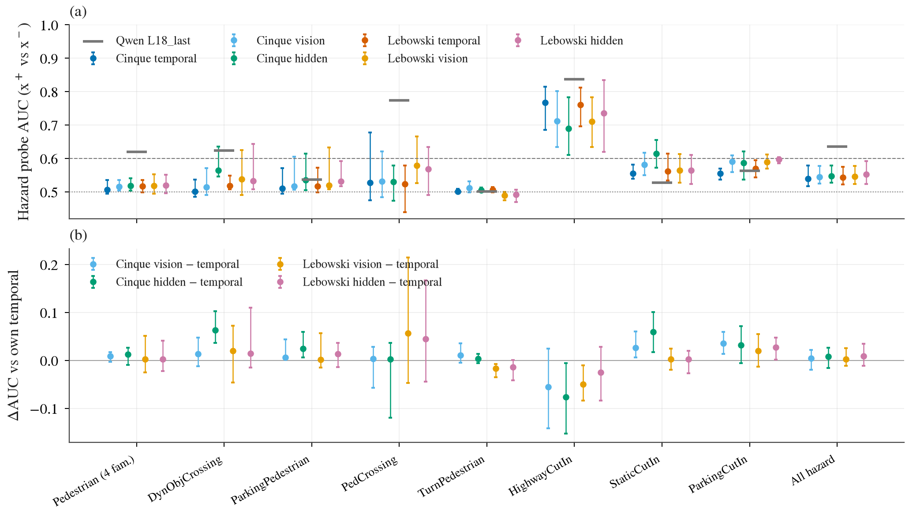
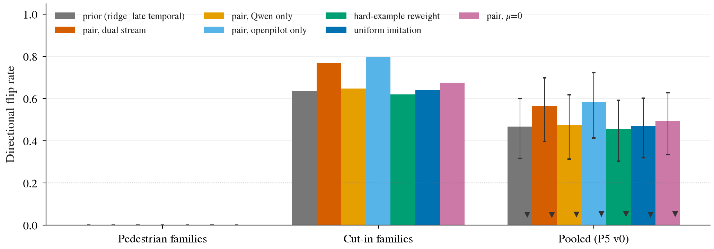

# reactivity 计划：决定性检查、方法实验、仪器加固（排 GPU 用）

状态: 进行中（预登记写于任何新抽取之前，2026-09-25）；D0、M-C（v0 smoke）、I3、I4 已出，I1 生成在跑，M-A 等用户
上游: [op-temporal-p5-and-route](2026-09-25-openpilot-temporal-p5-and-route.md)（实验 1、2a 已出，2b 在跑）、第 25 条（continuation prior + reaction decoder）、第 32 条（P5 v0）、第 40 条
主线: openpilot 冻结 vision；闭环考试仍暂停（memory：infra 验收未过）；本文件全部是开环或离线渲染。
不重复做的（别人已做，只当动机引用）：真实帧抹行人的 model-agnostic 考试（2609.22582，6 个 ckpt，1.9%）、meta-action 考试（CoLT-Drive，11 个）、闭环 shift（Fail2Drive，7 个）。
所以**不再**把更多公开 planner 拉过 P5 当 audit。

## 依赖图

```
D0 vision 层行人 probe ──┬─ 结果决定 M-A 单独够不够 ──► M-A（冻结 vision，重训 policy）
                         └─ vision 里没有行人 ─────────► M-C（双流 reaction head）
2b（在跑）──────────────────────────────────────────────► M-A 的 desire 输入用不用
I1 P5 加固（第二 expert、扩路线）── 独立，先排 CPU/CARLA ─► M-A / M-C 的考卷与 Δ 标签
I2 continuation share 表 ── 独立，CPU
I3 HUGSIM 3DGS 开环配对 ── 独立，GPU 渲染
I4 worldmodel-4B 是否 action-conditioned ── 独立，调研 + 一次前向
```

## 决定性检查

| # | 问题 | 做法 | 判据 | 资源 | 预算 |
|---|---|---|---|---|---|
| D0 | 行人信息是 vision 就没有，还是 policy 丢的 | 在 P5 那批 stream 上把 tap 从 `temporal` 换成 `driving_vision` 输出（`OPModel(taps=[...])` 已支持任意 ONNX tensor），Cinque + Lebowski；同一 hazard probe（按路线 5 折），按 family 报 x⁺/x⁻ AUC，与 `temporal`（行人 0.50–0.53）和 Qwen `L18_last`（0.62–0.88）并排 | 行人 family 上 vision AUC 对 `temporal` 的配对 Δ 的 CI 整体 > 0 且 AUC ≥ 0.60 → 信息在 vision 里，M-A 单独可行；否则 M-A + M-C | 1 卡 < 10 GB，12 核 | 抽取 24 min（同上一轮）+ probe 分钟级；工程半天 |
| 2b | intent → desire 进 backbone 有没有用 | 在跑，见上游 todo | 原生 plan 在 Intersections 上的 Δ；全集主表不变差 | 已占 GPU 2 | 已在预算内 |

## 方法实验（文章的「打法」）

共同规则：judge 一字不改（第 22 条口径 + P5 定向翻转率 / null false-flip）；训练与考试按路线或 sequence 分开；每个 arm 必带 **hard-example reweighting 对照**（第 21 条 D1，survey 标「没人做过」的那一格）；先在 P5 v0 的 165 对上做 smoke，I1 出来后再上加固版。

| # | 内容 | 训练信号 | 数据 | 判据 | 资源 | 预算 |
|---|---|---|---|---|---|---|
| M-A | 冻结 `driving_vision`，重训 temporal policy（结构照 comma：冻结特征上的小 temporal transformer；输出照原生 plan 头，不改 judge） | (i) WOD imitation（52 万帧）；(ii) + CARLA 配对差分 loss：Δ 只在 x⁺/x⁻ 之间有标签，null 上约束为零；(iii) 对照：(i) + 按 s_ego 的 hard-example 重加权 | WOD train（vision 特征需重抽，`temporal` 不够）、P5 pair 观测帧、nuScenes 作 held-out | 主：P5 按 family 翻转率对冻结 `ridge_late`（cut-in 86–89%、行人 0%）；副：WOD RFS 对原生 8.005 / 7.886 与 `cls_late` 7.73；静止帧对 cv；null false-flip 不高于 5–7% | 抽 vision 特征：1 卡，52 万帧 × 2 模型约 70 min；训练：1 卡 < 20 GB，每 arm 估 1–3 h（policy 几十 M 到几百 M 参数，特征常驻 RAM） | 抽取 1.5 h + 3 arm × 2 模型 ≈ 6–18 h GPU；工程 2 天（policy 结构复刻、loss、数据管线） |
| M-C | 双流 reaction head：openpilot 冻结当 continuation + 第 2 层；reaction 输入 = 带行人信息的特征（Qwen `L18_last` / 原生 video token，已抽）⊕ openpilot `temporal`；输出对 prior 的修正 Δ，plan 层相加 | 配对差分（同 M-A (ii)）；对照 hard-example 重加权；对照单流（只 Qwen、只 openpilot） | P5 观测帧 + P4 训练帧，特征全在 `processed/carla_p5/features` 与 op-p5 | 行人 family 翻转率离开 0（≥ 20% 且 CI 下端 > null false-flip）而 cut-in 不掉、null false-flip 不动 | 1 卡 < 10 GB，或 CPU | 每 arm 分钟级；工程 1 天 |

M-A 只在 D0 判「信息在 vision 里」时是完整方案；否则 M-A 负责静止 / 路口 / cut-in 强度，M-C 负责行人，两者一起是第 25 条的结构。

## 仪器加固（文章的「尺子」）

| # | 内容 | 为什么 | 资源 | 预算 |
|---|---|---|---|---|
| I1 | P5 v1：第二个 expert（PDM-Lite，需作者 scenario_runner fork）；路线 25 → ≥ 100 条；3 TM seed；两个行人 family 与 Light 进合并 | v0 合并 CI [32, 60]、行人 reactive 帧只有 45 + 76；单 expert（BehaviorAgent）不提前减速 | CARLA：8 实例并发，每实例 CPU 约 8 核、VRAM 7–9 GB；不需要模型 | 生成约 385 × 4 run，每 run 3–5 min → 8 并发约 8–10 h；先 2 对端到端 profiling |
| I2 | continuation share 表：同一 ego-only / cv / ctrv 基线跑过 nuScenes、WOD-E2E、NAVSIM、B2D（开环 shadow）、HUGSIM（已有 cv），报占顶分比例 | 文章第一张表；数字多数已有，缺统一口径 | CPU | 1 天整理，NAVSIM 基线若缺则 devkit 跑 < 1 h |
| I3 | 真实外观配对：HUGSIM 3DGS 沿 logged 轨迹渲染有 / 无 hazard actor 两版（attack planner 生成 actor），开环，不跑闭环控制器；标签用 expert 在 3DGS 场景几何上两侧重跑或 CV 规则 | 回应 2609.22582 的「编辑真实帧」：几何一致的重建替代 inpainting；survey 标「没人做过」 | 1 卡，渲染 2.4–6 GB / 实例；场景已在盘上 | 先 5 个场景验证 actor 插入与遮挡正确（1 天工程），再 50 场景 × 2 版渲染约 2–3 h |
| I4 | `commaai/worldmodel-4B` 是否接 action / plan 条件 | 若是，M-A 有 on-policy 环境，绕开 CARLA 域差 | 1 卡加载一次 | 半天调研 |

## 排程建议

1. 今天：D0（GPU 2 与 2b 共卡，< 10 GB）、I2（CPU）、I4（任一卡一次前向）。
2. D0 出来后：M-C 立刻上（特征都在盘上），M-A 先抽 vision 特征（1 卡 70 min），policy 复刻工程并行。
3. I1 与 I3 独立，CPU/CARLA 与渲染卡各占一路，与上面不抢。
4. 任何一步超预算 2 倍先停下来报；结论写回 decisions.md（D0、M-* 进第 40 条下面或新开第 42 条；I1 进第 32 条）。

## 执行记录

执行者：reactivity agent（2026-09-25 15:50 起）。I1、I3、I4 由三个子执行代理做，各写子文档
[i1-p5v1](2026-09-25-reactivity-program/i1-p5v1.md)、[i3-hugsim-pairs](2026-09-25-reactivity-program/i3-hugsim-pairs.md)、
[i4-worldmodel](2026-09-25-reactivity-program/i4-worldmodel.md)，结论由本文件汇总。M-A 等用户决定，不启动训练。

### 偏离与澄清日志（每条写于看到受影响的数字之前）

1. **D0 的 tap 口径（2026-09-25 15:55，抽取之前）**。表里写「`driving_vision` 输出」，而 Cinque / Lebowski 是单个合并的 ONNX，没有独立的
   `driving_vision.onnx`。按第 40 条 tap 表（[driving-backbones](2026-09-24-driving-backbones/README.md)）定：**主 tap 是 `vision`**
   （进时间模块之前的当前步 vision encoder pooled 输出：Cinque `mean` 512 维、Lebowski `view_40` 3072 维）；**次要 tap 是 `hidden`**
   （进 feature 队列的向量：Cinque 16 384 维 = 32 个未池化 vision token，Lebowski 512 维）。判定只用主 tap；`hidden` 只描述，
   若它过线而 `vision` 不过，记为「次要证据，需复现」，不改判定。
2. **D0 的「行人 family」（同上）**。P5 v0 里 hazard actor 是行人的 family 有四个：DynamicObjectCrossing、ParkingCrossingPedestrian、
   PedestrianCrossing、VehicleTurningRoutePedestrian。判据作用在**四个合并的行人集合**上（x⁺ 对 x⁻ 的观测帧，按路线 bootstrap，
   500 次，与 `probe_auc_paired` 同一套重采样）；逐 family 的 AUC 与配对 Δ 只描述。判定按模型分开：某个模型的 `vision` 在行人集合上
   AUC ≥ 0.60 且对同模型 `temporal` 的配对 Δ 的 95% CI 下端 > 0，就算「信息在该模型的 vision 里」；两个模型中至少一个过线 → M-A 单独可行
   （用过线的那个模型）；都不过 → M-A + M-C。
3. **D0 的 probe 与抽取（同上）**。probe、fold、λ 选择、训练行一字不改（`p5_exam.probes`），只加 examinee；抽取器、stream、渲染与实验 1 相同，
   只多存 `vision` / `hidden` 两个数组。新抽取的 `temporal` 与实验 1 已存的逐位比较，作为等价性检查。同一次 `p5_exam run` 也会给出这些 tap
   上 `ridge_late` 的翻转率，只描述，不进 D0 判定。
4. **M-C 的具体化（2026-09-25 16:10，写于任何 M-C 拟合之前，也早于 D0 的数字）**。表里只给了结构和判据，下面把会影响数字的选择全部定死：
   - **结构**：`pred(x) = prior(x) + Δ(x)`。prior 是实验 1 的 examinee 本身，即 openpilot `temporal` 上的 `ridge_late`
     （`p5_exam.heads` 原样，按路线 5 折，只在 role = train 的帧上拟合，所以对 pair 帧是样本外）；Δ(x) = W·z(x) + b，**线性**（thin，闭式解）。
     z 是 reaction 输入：Qwen `L18_last`（P3(d″) 原生视频 token，已抽）⊕ 同一模型的 `temporal`，每列按训练行标准化，每个 stream 再乘 1/√d_stream，
     使两路总方差相等（不让 2560 维的 Qwen 靠维数压过 512 维的 openpilot）。输出是整条 20 × 2 未来轨迹的修正，考试照旧读 2 s 速度。
     主 arm 用 Cinque，Lebowski 是复现。
   - **配对差分 arm（主）**：外层 fold f 内，训练行是 fold ≠ f 的全部 pair 帧（obs 的 x⁺/x⁻，含 non-reactive 帧，以及 null 的 x⁺/x_null），
     损失 Σ‖W(z⁺ − z⁻) − [(y⁺ − y⁻) − (p⁺ − p⁻)]‖²，y 是 expert 两侧各自的未来轨迹，p 是 prior；null 对的 expert 差≈0，所以「null 上约束为零」由它们自带。
     另加「直行帧上修正项为零」：fold ≠ f 的 role = train 帧上 μ‖W(z − z̄)‖²，μ 取使两项总权重相等（μ = n_pair / n_train），固定不调；
     μ = 0 只作敏感性描述。ridge λ 在训练 fold 内按路线分组 3 折选（网格 10^[−1..5]，最小化留出路线上的配对 MSE）。
   - **hard-example 重加权对照**：同一 z、同一 prior、同样的训练帧（fold ≠ f 的 role = train 帧，加上训练 fold 的 pair 帧，各当普通单帧），
     逐帧拟合残差 y − p 的加权 ridge，权重 w = s_ego / mean(s_ego)，s_ego = 同一批训练行上 `ridge ego` 的逐帧 ADE（Keyframe-Focused IL 2106.06452 的做法）；
     λ 同样按路线 3 折选（加权 MSE）。同时报 w ≡ 1 的均匀 imitation 一行作参照（只描述）。
   - **单流对照**：配对差分 arm，z 只用 Qwen `L18_last`，或只用 openpilot `temporal`。
   - **考试**：`p5_exam.exam` 一字不改（τ_model 由各自 null 定，定向翻转率、样本外 null false-flip、路线 bootstrap CI）。
   - **判据**（表里的三条写成数）：(a) 行人：四个行人 family 的 reactive 帧合并（v0 实际上只有 DynamicObjectCrossing 45、ParkingCrossingPedestrian 76 有量），
     翻转率 ≥ 20% 且路线 bootstrap CI 下端 > 该 arm 的样本外 null false-flip；(b) cut-in 不掉：三个 cut-in family 合并的翻转率对 prior 的逐帧配对差，
     路线 bootstrap 95% CI 上端 ≥ 0（没有显著变差）；(c) null false-flip 不动：样本外 null false-flip ≤ 7%。三条都过，这个 arm 判「过」。
     主问题是配对差分 arm 过、而 hard-example 对照不过（第 21 条 D1 的那一格）；两者都过，则配对结构不是必要的，照实写。
5. **M-C 的 λ 网格碰边（2026-09-25 16:15，写于看到 v0 smoke 的翻转数之后，所以只算事后敏感性，不改判定）**。预登记网格 10^[−1..5]：
   配对差分 arm 在 10 个 fold × 模型里多数选到下边 0.1，hard / uniform 选到上边 1e5。选 λ 只看内层留出路线上的 MSE，与翻转数无关，
   但放宽网格是看到结果之后才决定的，因此：主判定仍用预登记网格那次 run；另跑一次 10^[−5..7] 作敏感性，并加一个只描述的诊断——
   训练 fold 内配对目标（2 s 速度差，|Δ_expert| > 0.5 m/s 的对）上拟合值对 expert 值的斜率，按行人 / cut-in 分组，用来区分
   「训练集上都拟合不了」（表征）和「拟合得了但跨路线不泛化」（数据量）。
6. **D0 exam 里 Cinque `hidden` 只做 probe，不拟合 `ridge_late`（2026-09-25 16:12，D0 的任何 probe 数字出来之前）**。16 384 维的 ridge 每个 fold
   要 5 次 16 384² 的 CPU eigh，实测第一个 fold 卡了 9 分钟以上，估计全程约 6 h，超预算远不止 2 倍。`ridge_late` 翻转率在 D0 里本来只描述，
   D0 判定用的是 probe，所以这一个 tap 去掉 head、保留 probe；其余 tap 不变。同时按 main 的排程把 D0 exam 与 M-C 敏感性挪到 GPU 1（与 I4 共卡），
   我方 CPU 收到 196–201。

## 结果

代码：`scripts/p5_openpilot.py --arrays`（D0 抽取）、`p5_exam run --op-arrays --heads-skip`（D0 考试，新增 `probe_auc_paired_scopes`）、
`jevdrive/reactivity_mc.py`（M-C）、`jevdrive/reactivity_figs.py`（图）、入口 `scripts/reactivity.sh`。小表在
[research/results/reactivity/](../research/results/reactivity/)。

### 等价性与成本

| 检查 / 步骤 | 结果 |
|:--|:--|
| D0 新抽取的 `temporal` 对实验 1 已存的（抽查 12 条 stream、两个模型） | 最大差 **0**（逐位相同） |
| M-C 的 prior 对实验 1 的 `ridge_late` examinee | 翻转率逐位复现：Cinque 46.7% [31.7, 60.0]、Lebowski 41.6% [25.5, 56.3]，null false-flip 5.1% / 5.5% |
| D0 抽取：536 条 stream、48 046 帧 × 2 模型，多存 `vision` / `hidden` | 预算 24 min，实测 11 min（GPU 2，12 核） |
| D0 考试（7 个 tap 的 head + probe） | 预算分钟级，实测约 60 min：box CPU 被 CARLA 压到 cgroup 上限（load 125 / 125 核），加上 16 384 维 head（偏离 6 去掉后） |
| M-C 全部 arm × 2 模型 × 5 fold | 4 min（预登记网格）；宽网格那次 20 min（同样的 CPU 争用） |

### D0：行人信息在 openpilot 的 vision 层里有没有

x⁺ 对 x⁻ 观测帧上的 hazard probe AUC（probe 不改，按路线 5 折），路线 bootstrap 500 次；Δ 是对同模型 `temporal` 的逐帧配对差。

| 范围（观测帧 / 路线） | Qwen `L18_last` | Cinque `temporal` | Cinque **`vision`** [CI] | Δ vs `temporal` [CI] | Lebowski `temporal` | Lebowski **`vision`** [CI] | Δ vs `temporal` [CI] |
|:--|--:|--:|:--|:--|--:|:--|:--|
| **行人 4 family 合并（1999 / 20）** | 0.620 | 0.507 | **0.515** [0.503, 0.535] | +0.009 [−0.003, +0.017] | 0.517 | **0.519** [0.495, 0.552] | +0.002 [−0.025, +0.051] |
| DynamicObjectCrossing（179 / 5） | 0.624 | 0.501 | 0.515 | +0.013 [−0.013, +0.047] | 0.518 | 0.538 | +0.020 [−0.047, +0.072] |
| ParkingCrossingPedestrian（199 / 5） | 0.536 | 0.511 | 0.517 | +0.006 [+0.001, +0.044] | 0.518 | 0.519 | +0.002 [−0.015, +0.056] |
| PedestrianCrossing（725 / 5） | 0.774 | 0.528 | 0.532 | +0.004 [−0.058, +0.028] | 0.523 | 0.579 | +0.056 [−0.047, +0.215] |
| VehicleTurningRoutePedestrian（896 / 5） | 0.501 | 0.502 | 0.512 | +0.010 | 0.506 | 0.489 | −0.017 |
| HighwayCutIn（690 / 5） | 0.837 | 0.767 | 0.711 | −0.055 [−0.142, +0.024] | 0.761 | 0.710 | −0.050 [−0.084, −0.010] |
| StaticCutIn / ParkingCutIn | 0.53 / 0.56 | 0.56 / 0.56 | 0.58 / 0.59 | +0.03 / +0.04 | 0.56 / 0.57 | 0.56 / 0.59 | +0.00 / +0.02 |
| 全部 hazard（3744 / 37） | 0.635 | 0.540 | 0.544 | +0.005 [−0.020, +0.021] | 0.543 | 0.546 | +0.002 [−0.012, +0.025] |

次要 tap `hidden` 在行人合并上也是 0.519 / 0.519，Δ +0.012 [−0.010, +0.026] / +0.003 [−0.023, +0.041]；
唯一 CI 不跨零的是 Cinque `hidden`（32 个未池化 vision token）在 DynamicObjectCrossing 上 +0.063 [+0.037, +0.102]，AUC 0.564，仍低于 0.60，只描述。
四个 openpilot tap 在行人合并上都比 Qwen 低约 0.10（CI 全不跨零）。



(a) 每个范围上各 tap 的 probe AUC（点与 95% 路线 bootstrap CI），灰色短横是 Qwen `L18_last`，虚线是 0.60 门槛；(b) vision 层 tap 对同模型 `temporal` 的配对 ΔAUC。
要看的是左边五组：行人 family 上 vision 层和 `temporal` 一样贴着 0.5，Δ 全在零附近；车辆 cut-in 上 vision 层反而略低于 `temporal`。

**判定（按偏离 1、2 的口径）：两个模型的 `vision` 在行人合并集上 AUC 都 < 0.60，对 `temporal` 的 Δ CI 都跨零 → 行人信息在 openpilot 的 vision 层里就没有，
不是 policy（时间模块）丢的。M-A 单独不够，按预登记走 M-A + M-C。** 顺带：`ridge_late` 读 `vision` 时行人翻转仍全是 0（Cinque / Lebowski `vision` 合并翻转 47% / 46%，与 `temporal` 相同，
全部来自 cut-in），和 probe 一致。实验 1 里「bottleneck 滤掉了分布外的行人」这句话因此可以往前推一层：滤掉发生在 vision encoder，不在 temporal summarizer。

### M-C：双流 reaction head（P5 v0 的 165 对上的 smoke）

主表是预登记网格那次 run（`reactivity/mc/20260925-160059`），判据按偏离 4。

| arm（Cinque） | 行人翻转 [CI]（134 reactive 帧） | cut-in 翻转 | cut-in 对 prior 的配对 Δ [CI] | 合并翻转 [CI] | 样本外 null false-flip | 判定 |
|:--|:--|--:|:--|:--|--:|:--|
| prior（`ridge_late` `temporal`） | 0% | 63.6% | — | 46.7% [31.7, 60.0] | 5.1% | — |
| **配对差分，双流** | **0%** | **76.9%** | **+13.3 [+6.6, +20.8]** | 56.5% [39.6, 69.9] | 5.0% | 不过（a） |
| 配对差分，只 Qwen | 0% | 64.7% | +1.1 [−4.8, +8.1] | 47.6% | 5.3% | 不过（a） |
| 配对差分，只 openpilot | 0% | 79.7% | +16.1 [+9.3, +23.5] | 58.6% [41.3, 72.3] | 5.5% | 不过（a） |
| hard-example 重加权 | 0% | 61.9% | −1.7 [−4.1, +0.6] | 45.5% | 5.5% | 不过（a） |
| 均匀 imitation（参照） | 0% | 63.9% | +0.3 | 46.9% | 5.0% | 不过（a） |
| 配对差分，μ = 0（敏感性） | 0% | 67.5% | +3.9 [−8.7, +14.8] | 49.6% | 5.4% | 不过（a） |

Lebowski 复现同样的形状：配对双流行人 1.5% [0, 4.8]，cut-in +6.4 [−2.0, +14.7]，只 openpilot +16.1 [+7.8, +26.5]，hard 与均匀都 ≈ 0。
偏离 5 的宽网格（10^[−5..7]）结果逐项相同或只差 1 个百分点（`research/results/reactivity/mc-wide/`）。



Cinque 上每个 arm 在行人、cut-in、合并三个范围的定向翻转率；误差线是路线 bootstrap 95% CI，▼ 是样本外 null false-flip，点线是 20% 门槛。
要看的是：行人一栏全部是零；cut-in 一栏只有带配对差分、且输入里有 openpilot 的 arm 明显抬高，hard-example 重加权不动。

**判定：所有 arm 都不过（行人一条就挂）。** 按预登记的读法：

- **行人**：配对差分把行人 Δ 的量级放大了约 2.5 倍（|Δ|/τ 的 p90 从 0.22 到 0.52，与 expert 同号比例 58% → 67%），但仍在各自 τ 之下，翻转为 0。
  训练 fold 内的诊断（偏离 5）说明这不是跨路线泛化的问题：**在训练对上**，行人配对目标的拟合斜率只有 0.03–0.29（中位约 0.12；prior 0.01–0.03），
  cut-in 是 0.23–0.48。也就是说，Qwen `L18_last` ⊕ `temporal` 的线性 readout 连训练集上的行人配对差都拟合不了，瓶颈在输入（pooled 特征），不在监督信号。
  Qwen 在行人上的 probe AUC 只有 0.62（D0 同表），与这一点一致：「能分出 x⁺/x⁻」离「能读出该减多少速」还很远。
- **cut-in**：配对差分是唯一能在 prior 之上买到翻转的训练信号（+13 到 +16 个百分点，CI 不跨零），hard-example 重加权与均匀 imitation 都是 0。
  这是第 21 条 D1 那一格的第一个数：**在同样的数据、同样的特征上，配对结构有用，纯加权没用**；但它作用在 openpilot 已经会的 family 上，
  而且单 openpilot 流就够（加 Qwen 不加分，只 Qwen 流不动）。
- **null false-flip** 各 arm 都在 5.0–6.1%，没有动。

限定：P5 v0 只有 25 条路线、一个 expert，行人 reactive 帧 134 个（DynamicObjectCrossing 45、ParkingCrossingPedestrian 76 为主）；I1 的 v1 出来后在加固版上复跑。
下一步候选（未预登记，只是推测）：行人需要空间 token 而不是 pooled 向量（P2 的 attention readout 那一格），或者 I1 的 PDM-Lite 提前减速标签；
单靠换 loss 救不回来。

### I4：commaai/worldmodel-4B 是否 action-conditioned

详见 [i4-worldmodel](2026-09-25-reactivity-program/i4-worldmodel.md)。**是，但条件是 ego pose（每帧相对平移 + Euler 角），不是 action 向量**；
左 / 右转与刹车的方向都对（12/12、11/12、12/12），幅度只跟到指令的 45–52%；每次预测还吃 5 帧录像里的真实 future anchor，把 ego 拉回 logged 轨迹。
batch 8 约 108 ms/帧（15 步去噪），一张卡约 10 帧/s，可信的偏离窗口约 2 s。**结论**：可以给 M-A 当围绕 logged 轨迹的 recovery / covariate-shift 环境
（comma 的 `openpilot.distill/rl` 基本就是这套），但它不会凭空生成行人或 cut-in，替代不了 P5 / I3 的配对标签。

### I3：HUGSIM 3DGS 开环配对

详见 [i3-hugsim-pairs](2026-09-25-reactivity-program/i3-hugsim-pairs.md)。5 场景验证通过（x⁻ 与官方渲染逐位相同、actor 框外无变化、遮挡探针 94% / 96%），
按预登记渲了全部符合规则的 **65 个场景**（任务写 50），3559 个观测帧、1832 个 reactive 帧，family 为 static / cut-in / oncoming（车辆），null 792 帧；
实测 20 min。**缺口：HUGSIM 只有车辆资产，没有行人 family**；标签是匀速外推 + 碰撞规则，不是 expert 两侧重跑。接 p5_exam 还要少量胶水（无 TFv6 列、原点在前相机、openpilot 标定换 `hugsim_zs.calibs`）。

### I1：P5 v1 生成

详见 [i1-p5v1](2026-09-25-reactivity-program/i1-p5v1.md)。PDM-Lite 已接通（两对 x⁺/x⁻/null 逐 tick 确定，v0 的 BehaviorAgent run 逐位复现并复用 385 个），
101 条 base 路线 × 3 seed = 303 对 + 101 null，新跑 1029 个 run；`p5v1-gen` 17:01 起在 GPU 4 + GPU 2 上 11 个 CARLA 实例运行，估计 10–12 h，
`p5v1-index` 自动接在后面。偏离：PDM-Lite 的录制窗口放长到触发后 40 s（profiling 的两对在 v0 窗口里行人 scenario 没演到 ego 面前），
另出一套截回 v0 窗口的标签供两 expert 对比。
7. **P5 v1 上的复跑口径（2026-09-25 19:20，写于 v1 的任何特征或标签数字之前）**。D0 与 M-C 在 v1 上按上面第 1–4、6 条原样复跑，
   **两个 expert 的集合分别跑、分别报**（`processed/carla_p5v1_pdm` 与 `carla_p5v1_ba`，由 `p5v1-index` 产出），不合并；判定以 **PDM-Lite 集**为主
   （它是为行人 family 加进来的 expert），BehaviorAgent 集是与 v0 同口径的复现。特征：Qwen `L18_last` 用 `p5_pairs.extract`（P3(d″) 抽取器，不改），
   openpilot 用 `p5_openpilot`（`--arrays temporal vision hidden`），都按 `P5_SET` 指到对应集合。λ 网格仍用预登记的 10^[−1..5]。
