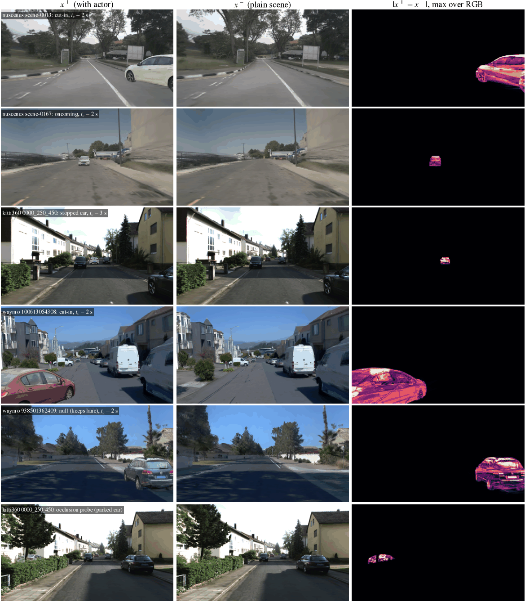

# I3：HUGSIM 3DGS 真实外观反事实配对（开环，沿 logged 轨迹渲染）

状态: done（2026-09-25 16:51）。5 场景验证已过；预登记写于全量渲染之前（16:29 CST 提交，16:30 开始渲染，此前只渲染过下面 5 个验证场景，没有计算过任何标签统计）；65 个场景已渲染并建好索引
上级: [reactivity 计划](../2026-09-25-reactivity-program.md) 的 I3 行；配对设计沿用 [P5 v0](../2026-09-24-p5-carla-pairs-v0.md)（x⁺ 有 hazard actor、x⁻ 没有、ego 相同、null pair）；决策第 32、40 条
代码: `jevdrive/hugsim_pairs.py`（logged 轨迹、actor 轨迹、标签规则、P5 形状的索引、验证图）、`scripts/hugsim/pairs_render.py`（HUGSIM venv 里的渲染器与验证检查）
数据: box 上 `$DATA_DIR/processed/hugsim_pairs/`（不进 git）

## 目标

P5 的配对考卷是 CARLA 渲染的，外观和真实驾驶视频差得远（P4：去均值后 domain AUC 仍 1.000）。2609.22582 那条线是在真实帧上用 inpainting 抹掉行人来造反事实，
几何不保证一致。I3 用 HUGSIM（在真实数据上重建的 3DGS 闭环仿真器；3DGS 即 3D Gaussian Splatting，把场景表示成几百万个带颜色和不透明度的 3D 高斯，
按深度排序后 alpha 合成出图）的重建场景，**沿录制时的 ego 轨迹开环渲染**（不跑控制器、不闭环）同一段相机流的几个版本：
x⁻ 是原场景，x⁺ 多插入一辆 3DRealCar（HUGSIM 自带的真实车辆 3DGS 资产）。actor 和场景高斯在同一次 rasterization 里按深度合成，
所以遮挡、透视、尺度都由几何决定，而不是由 inpainting 网络猜。两版之间唯一的差别就是那辆车。

## 设计

### 世界（world）与 family

每个场景渲染 5 个世界，ego 位姿逐帧相同（都取自录制轨迹）：

| world | 内容 | 对应 HUGSIM 的什么 | 对应 P5 family |
|:--|:--|:--|:--|
| `minus` | 不插车，原场景 | — | x⁻ |
| `static` | 一辆停着的车，放在 ego 车道上、logged ego 在 t_c 到达的位置 | 官方 medium 场景（ConstantPlanner，v = 0） | 前方静止车（HardBreakRoute 的终态） |
| `cutin` | 邻车道、ego 前方 10 m、与 ego 同速的车，t_e 起由 AttackPlanner 驾驶 | AttackPlanner（官方 extreme 场景用的对抗 actor） | StaticCutIn / ParkingCutIn / HighwayCutIn |
| `oncoming` | ego 车道内迎面 3 m/s 的车，t_e 起由 AttackPlanner 驾驶 | 官方 extreme 场景的配置（车头朝 ego、3 m/s） | 他车闯入 ego 路径（OppositeVehicleRunningRedLight 一类） |
| `null` | 与 `cutin` 同一辆车、同一起点，但一直沿本车道以 ego 的 logged 速度行驶 | — | null pair（外观变了、正确动作不变） |

AttackPlanner 是 HUGSIM 自带的对抗规划器：在一个 spline 轨迹格点里挑一条让自己与被攻击者「同一时刻同一位置」距离最小的轨迹，每隔几步重规划。
官方实现攻击的是 ego 的匀速外推；这里 ego 的未来是已知的（logged），所以喂给它的是 **logged ego 的真实未来**，它会真的截到 ego 的路径上。
代码一字未改，只是由我们的胶水按 0.1 s 步进调用（官方闭环里它的 0.1 s 计划被按 0.25 s 一步执行，actor 实际只走计划速度的 0.4 倍，这里没有这个问题）。

**行人 family 做不了**：HUGSIM 发布的 actor 资产只有 3DRealCar（110 辆车），没有行人或自行车的 3DGS 资产。P5 的四个行人类 family
在 I3 里没有对应，这是本数据集最大的缺口，见「未解决的问题」。

### 几何

- **ego 位姿**：HUGSIM env 自己的相机位姿公式（`hug_sim.py`：ego = rt2pose((0, θ, 0), (a, ground_height(a, b), b))，相机 = ego · v2front · inv(v2c) · cam_rect），
  (a, b, θ) 取自场景的录制前相机位姿（`meta_data.json`，与 `ground_param.pkl` 的路线逐位相同；nuScenes scene-0411 两者差 1.26 m，排除）。
  这样帧和 HUGSIM 闭环考试里 openpilot 看到的帧同分布（同样只有 yaw、同样的相机高度规则）。
- **actor 放置**：朝向用 HUGSIM planner 的 b2w（绕 y 轴 −yaw − π/2），高度取 actor 中心 1 m 内路面高斯（语义类 0）的中位高度；
  少于 20 个点时退回 HUGSIM 的规则（最近录制位姿的相机平面 + 相机高度）。验证里两者的差中位 −2.7 cm（路面高斯略高），最大 −12.6 cm（Waymo）。
  官方场景 yaml 在 nuScenes / Waymo 上额外抬高 0.3 m，我们不用这个偏置（路面高斯说车轮应在的位置比它低 0.3 m）。
- **路面与障碍检查**（每个 actor 轨迹，在它第一次与 logged ego 相撞之前）：footprint 上 5 × 3 个采样点离最近路面高斯 < 0.5 m 的比例，均值 ≥ 0.7 且每帧 ≥ 0.4；
  box 内不透明度 > 0.8 的障碍类高斯（语义类 > 1、非天空，即 HUGSIM 碰撞检测用的那批点）不超过 100 个（HUGSIM 判 ego 碰撞的门槛）。
  `cutin` 先试左邻车道再试右邻车道，取合格且路面覆盖更高的一侧；`null` 用 `cutin` 选中的那一侧（`cutin` 两侧都不合格时自己试两侧）。不合格的世界不渲染，记原因。
- **时间窗**：每个场景一个目标冲突时刻 t_c（见预登记），渲染窗口 [t_c − 6 s, t_c + 1 s]，5 Hz，actor 从窗口第一帧起就在（没有凭空出现的帧），
  AttackPlanner 在 t_e = t_c − 4 s 接管。

### 标签（规则 expert）

HUGSIM 里没有一个能在 3DGS 场景几何上「两侧各开一遍」的 expert：它的闭环只有被测 agent，没有特权规则驾驶器，自己搭一个就是闭环，超出本任务的开环约束。
所以按任务书用预登记的规则：

- x⁻ 的正确动作 = logged 轨迹（人类司机开的；已知不纯之处：录制时路上的其他车在重建里被删掉了，司机对它们的反应仍留在 logged 速度里，x⁺ 与 x⁻ 两侧相同）。
- x⁺ 在帧 t：只用相机在 t 时刻看得到的东西——actor 当前的位置、朝向、速度——做**匀速外推**，与 logged ego 未来 4 s 做逐 0.05 s 的碰撞检测
  （ego box = HUGSIM 的 3.0 × 1.6 m 以前相机为中心，前后各加 0.5 m、两侧各加 0.4 m；actor box = 资产的 wlh）。
  有冲突时，规则 expert 沿 logged 路径以 3 m/s² 的停车曲线在冲突位姿之前停住（速度取 logged 与停车曲线的较小者，最大减速 8 m/s²），否则就是 logged。
  用匀速外推而不是 actor 脚本里的真实未来，是为了不让标签用到画面里还没有的信息（cut-in 的车在 AttackPlanner 接管之前只是在自己车道里开）。
- 与 P5 同一套量：v2（2 s 处速度 = 1.75→2.0 s 的位移 / 0.25 s）、Δ_expert = v2(x⁺) − v2(x⁻)、stop（未来 3 s 内速度 < 0.5 m/s）。
  reactive 的门槛照 P5：τ_exp = max(null 上 |Δ| 的 p95, 0.5 m/s)；这里 null 的 Δ 按构造为 0，所以 τ_exp = 0.5 m/s。

## 5 场景验证（2026-09-25 16:10–16:23，box 上 `runs/i3-hugsim-pairs/val5/`）

场景：nuScenes scene-0013、scene-0167，KITTI-360 0000_250_450，Waymo 100613054308、938501362409（每个数据集至少一个，PandaSet 的录制只有 8 s，全部不满足时间窗）。

| 检查 | 怎么查 | 结果 |
|:--|:--|:--|
| x⁻ 与普通渲染逐像素相同 | 同一位姿渲两遍；再与 HUGSIM 自己的 `HUGSimEnv._get_obs()`（官方 env、无 actor、同一 ego 状态）逐像素比 | 5/5 场景 **max \|Δ\| = 0**（确定性和对官方 env 都是逐位相同） |
| x⁺ 与 x⁻ 只在 actor 附近不同 | 冲突前每帧，actor 高斯范围的投影框（外扩 12 px）以外的像素差 | 超过阈值（任一通道 > 8/255）的框外像素：**0**（305 个 actor 帧 × 3 相机）；有任何差异的框外像素 1 267 个（高斯尾部的亚阈值变化），对比 747 万个 actor 像素 |
| 遮挡由场景几何决定 | actor 单独渲染（同一渲染器、空场景）得到 actor 像素和深度；x⁻ 里有场景物体（语义类 > 1、非天空）在 actor 前 1 m 以上的像素应不变，场景表面在 actor 后 1 m 以上的像素应改变 | 轨迹上的 actor 很少被挡（299 个被挡像素，其中 32 个改变）。另做**遮挡探针**：每个场景把停着的车放在路边 4.5–9 m、前方 15–35 m、不与场景物体相交的 141 个位置：被挡像素 141 853 个中 **94.6% 不变**，不被挡像素 279 626 个中 95.8% 改变。剩下的来自半透明的场景高斯（树冠、栅栏） |
| 放在路上、尺度对 | 路面覆盖、障碍点、actor 底部对路面高斯的高差、目视 | 20 个 actor 世界里 17 个合格；3 个不合格都是按规则拒掉的：KITTI 的 cut-in 右侧车道停满车（box 内 6 297 个障碍点）、左侧不在路面上，它的 null 同样出路面；Waymo 100613054308 的 null 在窗口后段撞上路边停的车（618 个点）。车辆尺寸来自资产的 wlh（宽 1.5–1.75 m、长 3.5–4.3 m），与车道宽度目视相符 |
| 时机 | actor 第一次可见（3 相机上变化像素 ≥ 100）与第一次冲突 | 所有合格世界从第一个观测帧（窗口起点 + 0.6 s）起就可见；与 logged ego 的第一次冲突：static 恰在 t_c，cut-in 在 t_c − 1.6 至 − 1.0 s，oncoming 在 t_c − 1.45 至 − 1.05 s |

每行一个验证场景，左 x⁺、中 x⁻、右两者的逐像素差（RGB 三通道取最大）。要看的是右列：差异只落在车身上，背景一个像素都没变；
最后一行是遮挡探针，停在绿篱后面的车只露出车顶，被绿篱挡住的部分在差分图里是空的。

**判定：actor 插入几何正确，x⁻ 与普通渲染逐位相同，可以上全量。** 已知的外观局限：放置只有 yaw（HUGSIM 的约定），路面有横坡时一侧车轮会离地几厘米；
资产自带一块烘焙的车底阴影，但不会对场景投影；远处的车比近处更「贴」，近处（< 8 m）能看出 3DGS 资产的纹理比重建场景更锐利。

验证过程中改掉的两处（都写在代码里）：
1. HUGSIM 的 `Camera` 构造函数的 `dynamics` 默认值是一个**共享的可变 dict**，`render()` 会把规划出的 actor 写进去；用默认值建的相机会把上一次 x⁺ 的车带进之后所有的 x⁻。
   我们的每个相机都传自己的 `dynamics={}`，逐位相同的检查就是在这之后过的。
2. 遮挡检查最初把路面也算作遮挡物：掠射角下路面高斯的 alpha 加权深度不是表面深度，车身下缘被误判成「被路面挡住却变了」（nuScenes scene-0167 的 null 上 84%）。
   改成只把语义类 > 1 的场景物体当遮挡物之后，上表的数字才有意义。

## 预登记（2026-09-25 16:29 CST，全量渲染之前，commit 2f27f43）

**场景选择规则**：box 上全部 82 个 HUGSIM 场景 zip（nuScenes 19、KITTI-360 26、PandaSet 15、Waymo 22），排除录制路线与前相机位姿不一致的（nuScenes scene-0411），
每个场景取 t_c = 0.2 s 网格上最早满足三条的时刻：t_c − 6 s ≥ 0（完整的渲染前导）、t_c + 3 s ≤ 录制结束（最后一个观测帧有 3 s logged 未来）、
logged 速度在 [t_c − 4 s, t_c] 上始终 ≥ 3 m/s。没有这样的 t_c 的场景不用。结果：**65 个场景**（nuScenes 17、KITTI-360 26、Waymo 22；PandaSet 的录制只有 7.9 s，全部不满足；
nuScenes scene-0383 全程慢于 3 m/s）。任务书写的是 50 个，65 个全部渲染（成本见下），不再抽样。表：`processed/hugsim_pairs/scenes.csv`。

**actor 与参数**（`jevdrive/hugsim_pairs.py` 顶部常量是唯一来源）：

| 项 | 值 |
|:--|:--|
| 资产 | HUGSIM 发布场景里用过的 105 个 3DRealCar，按 crc32(scene/family) 取；`null` 与 `cutin` 用同一辆 |
| static | 停在 logged 路径上 s(t_c) + 2.0 m + 车长/2 处（logged ego box 在 t_c 碰到它），v = 0 |
| cutin | 邻车道 ±3.5 m、ego 前 10 m、速度 = logged ego 速度；t_e = t_c − 4 s 起 AttackPlanner（pred_steps 20、0.1 s 步、每 5 步重规划） |
| oncoming | ego 车道、车头朝 ego、3 m/s，按匀速在 t_c 与 ego 相遇的位置出发；t_e 起 AttackPlanner，同上 |
| null | 与 cutin 同车、同侧、同起点，全程沿邻车道、速度 = logged ego 速度 |
| 合格 | 路面覆盖均值 ≥ 0.7、每帧 ≥ 0.4；障碍点 ≤ 100；null 另要求全程不与 logged ego 相撞 |

**相机与帧率**：HUGSIM rig 的前三路（CAM_FRONT、CAM_FRONT_LEFT、CAM_FRONT_RIGHT，800 × 450，内参按数据集取 `configs/sim/<ds>_camera.yaml`），
即 HUGSIM openpilot 考试喂给 openpilot 的那三路；5 Hz（0.2 s），与 P5 的 Qwen clip 间隔和 openpilot 的 5 Hz context 步一致，所以 openpilot 这里不需要 1.25 倍的时钟拉伸。
JPEG q95。

**标签规则**：上面「标签」一节，参数 HORIZON 4 s、停车减速度 3 m/s²、最大减速 8 m/s²、ego box 4.0 × 2.4 m。null 帧的 Δ 按构造为 0，规则在 null 上报出的冲突数单列作为规则的误报检查。

**有效的 pair 帧**（obs）：x⁺ 世界合格且已渲染；帧序号 ≥ 3（4 帧 clip 完整）；actor 在该帧可见（三路相机上变化像素合计 ≥ 100）；
帧时刻早于该世界 actor 与 logged ego 的第一次真实冲突（之后 logged ego 会穿过那辆车，画面不再是物理的）；该帧之后还有 ≥ 3 s logged 未来。
null 帧：null 世界合格，帧序号 ≥ 3，null 车可见，≥ 3 s 未来；配对的另一侧是同一时刻的 x⁻。

**输出**（`$DATA_DIR/processed/hugsim_pairs/`，与 `processed/carla_p5` 同形状，p5_exam 和 P5 特征抽取器改一个根目录就能读）：

| 文件 | 内容 |
|:--|:--|
| `scenes/<key>/<world>/cams/<front,front_left,front_right>/<frame>.jpg` | 帧；frame = 4 × 帧序号（20 Hz tick 单位，与 CARLA P5 一致，`p5_openpilot.prepare` 的间隔检查照用） |
| `scenes/<key>/<world>/frames.jsonl` | 每帧 `{frame, t, files}`，P5 recorder 的格式 |
| `scenes/<key>/meta.json` | t_c、渲染时刻、每个世界的 actor 轨迹（0.05 s）、冲突、合格性、逐帧逐相机的变化像素、相机内外参、验证数字 |
| `index.parquet` | 每帧一行：frame_name、route_id（= 场景-世界，一条流）、files（3 相机 × 4 帧，P4 的顺序）、t、base_id（场景）、family、world（plus / minus / null）、intent（HUGSIM command 映射到 WOD intent）、actor_px、role（obs / stream） |
| `past.npy`、`future.npy` | (n, 16, 6)、(n, 20, 2)，P4 / WOD-E2E 的约定，但原点是前相机（HUGSIM 的 ego 就是前相机）；x⁺ 的 future 是规则 expert 的，录制之外为 NaN |
| `obs.parquet`、`null.parquet`、`pairs.csv` | P5 的列（fn_plus / fn_minus / fn_null、v0、v2_*、stop_*、d_expert、factor_px），另加 t_conf（规则的冲突时刻）、t_conf_true、ttc |

读法先定死：每个 family 的 pair 数、观测帧数、reactive 帧数和 Δ_expert 分布照 P5 的 label-validity 表报；一个 family 至少 5 个场景有 reactive 帧才进合并数（P5 同一规则）。
本文件只交付数据与标签，不打分考生。

## 成本与 profiling（我们的代码）

估计（验证的实测）：每场景 5 个世界 × 36 帧 × 3 相机 = 540 个视图；验证运行里每场景 23–48 s（含验证用的额外渲染和一次 HUGSimEnv 构造），
场景加载 1–3 s、actor 轨迹 1–2 s，其余是渲染。65 个场景单进程约 40 min，远低于 3 h 的 profiling 门槛；仍按规则量了一遍热路径（Waymo 938501362409，4.7 M 高斯，GPU 2 与 D0 共享）：

| 分项（每视图） | 优化前 | 优化后 |
|:--|--:|--:|
| `render()`（含 GPU→CPU） | 68 ms | **44 ms** |
| x⁺ 对 x⁻ 的差分统计（numpy） | 4.5 ms | 4.5 ms |
| JPEG 编码（另开 3 线程，与渲染重叠） | 0.8 ms | 0.8 ms |

瓶颈是渲染本身，其中一大块不是 rasterization：HUGSIM 的 `GaussianModel.get_full_*` 每次访问都重算激活函数、重新拼接 ground model，一个视图要访问六次。
我们把这六个张量在场景加载时算一次（`_FrozenPC`），交给同一个 `render()`。等价性：72 个视图（x⁺ 与 x⁻）逐像素相同（max |Δ| = 0）；全量运行里每个场景的 x⁻ 都会再与原始 GaussianModel 的渲染和官方 env 比一次。
全量用 4 个 worker 进程共享 GPU 2（每个 ≤ 8 GB、5 核），预计 15–25 min，实测 20.4 min（见下）。

## 全量渲染（2026-09-25 16:30–16:51，slot `i3-render` + `i3-final`，GPU 2，核 170–189）

4 个 worker 共享 GPU 2（与 D0 的一个进程同卡），全部场景都带验证检查运行。**实测 20.4 min**（渲染 19.5 min + 索引 1 min），
预估 15–25 min；每场景 GPU 时间均值 28.9 s（11–51 s，含验证用的额外渲染），actor 轨迹 1.4 s。数据 2.9 GB，26 136 张 JPEG，索引 7 986 行。
小结果文件在 [research/results/i3-hugsim-pairs/](../../research/results/i3-hugsim-pairs/)（`scenes.csv` 场景与 t_c，`worlds.csv` 每个世界的合格性与验证数字，`label_validity.csv`）。

**全量上的验证**（65 个场景，同验证一节的定义）：

| 检查 | 结果 |
|:--|:--|
| x⁻ 两遍渲染、对 `_FrozenPC` 之前的原始 GaussianModel、对官方 `HUGSimEnv._get_obs()` | 65/65 场景 max \|Δ\| = 0 |
| 框外超阈值像素（冲突前） | 667 个，落在 3 个世界里（static 496、oncoming 171），对比 6 930 万个 actor 像素；推测是车离相机 < 3 m 时投影框的保守裁剪，没有逐帧查 |
| 遮挡探针（65 个场景 1 535 个路边停车位置） | 被挡像素 258 万个中 93.6% 不变；不被挡像素 250 万个中 95.6% 改变 |
| 轨迹上的遮挡 | 被挡像素只有 26 万个（车几乎都在路中间），其中 17% 改变：cut-in / null 车贴着路边植被和栅栏，这些半透明高斯挡不住后面的车；这是 3DGS 本身的外观，不是插入错误 |
| actor 底部对路面高斯 − HUGSIM 地面规则 | 中位 −1.2 cm，范围 −15 至 +14 cm |

**每个 family 的世界数**（按预登记规则合格才渲染）：

| 数据集 | 场景 | static | cutin | oncoming | null |
|:--|--:|--:|--:|--:|--:|
| nuScenes | 17 | 17 | 14 | 16 | 12 |
| KITTI-360 | 26 | 26 | 0 | 22 | 0 |
| Waymo | 22 | 22 | 14 | 22 | 12 |
| 合计 | 65 | **65** | **28** | **60** | **24** |

cut-in 在 37 个场景里被拒：28 个是邻车道里有停着的车（box 内障碍点 > 100），9 个两侧都不在路面上；KITTI-360 一个都没有，那些路两侧都是路边停车。
null 跟着 cut-in 的一侧，被拒 41 个（25 个障碍、16 个出路面）。

**label-validity 表**（τ_exp = 0.5 m/s；Δ 单位 m/s，负 = x⁺ 更慢；TTC = 规则冲突时刻 − 帧时刻）：

| family | 场景 | 观测帧 | reactive 帧 | 占比 | 有 reactive 的场景 | reactive 的 Δ 中位 | Δ p10 | Δstop ≠ 0 的帧 | reactive 的 TTC 中位 |
|:--|--:|--:|--:|--:|--:|--:|--:|--:|--:|
| static | 65 | 1 730 | 959 | 0.554 | 65 | −4.76 | −8.71 | 535 | 1.60 s |
| cutin | 28 | 614 | 216 | 0.352 | 27 | −6.86 | −9.57 | 168 | 0.88 s |
| oncoming | 60 | 1 215 | 657 | 0.541 | 60 | −5.84 | −9.30 | 445 | 1.20 s |
| 合并 | 65 | **3 559** | **1 832** | 0.515 | 65 | −5.48 | −9.07 | 1 148 | 1.35 s |
| null | 24 | 792 | 0（按构造） | — | — | — | — | — | 规则在 null 帧上报冲突 17 次（2.1%） |

读法：三个 family 都远过 P5 的门槛（每个 family ≥ 5 个场景有 reactive 帧；合并 reactive 1 832 帧、占 51.5%，P5 v0 是 503 帧、21%），
所以按「考卷有没有题」这一关是成立的。Δ 的量级比 P5 大（中位 −5.5 m/s 对 P5 的 BehaviorAgent），因为规则 expert 一旦判定冲突就沿停车曲线停，
而 AttackPlanner 的车是冲着 ego 来的。x⁺ 比 x⁻ 快（Δ > 0.5）的帧只有 2 个（logged 速度的噪声）。
cut-in 和 oncoming 各有 322 / 375 帧是「真实未来里会撞、但按匀速外推还不会」：这些帧按预登记是 non-reactive（画面里还看不出车要切进来），
考生在这些帧上提前减速不算错，也不算对，照 P5 对 non-reactive 帧的处理只作描述。

**给考生的胶水**（本文件不打分）：
- P5 的 Qwen 特征抽取器与 `p5_exam`：`index.parquet` / `past.npy` / `future.npy` / `obs.parquet` / `null.parquet` / `pairs.csv` 与 `processed/carla_p5` 同列；
  `p5_pairs.processed()` 读环境变量 `P5_SET`，指到 `hugsim_pairs` 即可（`files` 是 3 相机 × 4 帧，P4 的顺序）。缺的只有 TFv6 的 `tf_*` 列（HUGSIM 里没有 TFv6 shadow），`p5_exam` 的考生表要去掉 TFv6。
  past / future 的原点是前相机，不是后轴。
- openpilot：每个 `scenes/<key>/<world>/frames.jsonl` 是一条 5 Hz 流（frame 以 20 Hz tick 计，间隔 4），`p5_openpilot.prepare` 的流构造照用；
  相机标定不能用它的 CARLA rig，要换成 HUGSIM exam 的 `hugsim_zs.calibs(cam_params, rect)`（按数据集的 camera yaml），
  帧已是 0.2 s 一步，**不需要** HUGSIM 闭环考试里的 1.25 倍时钟拉伸。

## 未解决的问题

- **没有行人**：HUGSIM 只发布车辆资产。补行人需要另找行人 3DGS 资产（例如从带行人的重建场景里导出动态高斯）并解决它的地面接触和步态，不在本次范围。
- **标签是规则，不是 expert 两侧重跑**：规则只做纵向（减速 / 停车），不会绕行；它在 cut-in 出现横向意图之后才反应（匀速外推），比会预判的 expert 晚。
- **x⁻ 的 logged 动作不纯**：重建删掉了录制时的其他交通参与者，司机对它们的反应（跟车、减速）还在 logged 速度里，两侧相同，不影响 Δ，但影响「x⁻ 的正确动作」这一假设。
- **actor 在冲突之后**：渲染窗口到 t_c + 1 s，AttackPlanner 的车在冲突后会穿过 ego；这些帧只作为 stream 的尾巴存在，不进观测帧。

## 现有考生零样本考试（2026-09-26 01:13–01:31，夜间队列第 5 项）

预登记在 [激发计划](../2026-09-26-elicitation-program.md) 偏离日志的 [I3-exam] 01:13 条（写于任何特征或数字之前）。代码 `jevdrive/elicit_i3.py`（`op-prepare`、`qwen-plan`、`exam`）、
`scripts/p5_openpilot.py`（加了按场景的标定与未覆盖像素填黑，全覆盖的 rig 输出不变）；run `$DATA_DIR/runs/elicitation/i3-exam/20260926-012841`，小表 [research/results/elicitation/i3/](../../research/results/elicitation/i3/)。
所有考生都在 P5 v1 BehaviorAgent 集上拟合（5 个路线 fold 各一个，fold head 对已存 run 的预测最大差 0.4 mm），在 I3 上不重训、不调，预测取 5 个 fold 的平均。
特征：openpilot `temporal` 242 条 5 Hz 流、8 712 帧（Waymo 场景的 wide 帧有 5% 未覆盖，填黑，同 HUGSIM 考试）；Qwen `L18_last` 6 232 帧（前三路 × 4 帧、0.2 s 间隔，800 × 450）。
judge 是 `p5_exam.exam` 原样（去掉 TFv6 列），τ 由 I3 的 24 个 null 场景定，CI 按场景 bootstrap。成本：GPU 0 约 15 min（Qwen 12 min、openpilot 10 min 并行，fit 与考试 2 min）。

**合并（三个 family，1 832 个 reactive 帧，65 个场景）的定向翻转率**：

| 考生（P5 v1 BA 拟合，零样本） | τ (m/s) | 翻转 [95% CI] | 反方向 | 非反应帧误翻 | 样本外 null false-flip |
|:--|--:|:--|--:|--:|--:|
| `ridge ego`（sanity：两侧 ego 相同） | 0 | 0.0% | 0 | 0 | 0 |
| Qwen `ridge_late L18_last` | 0.34 | 2.8% [1.3, 4.7] | 0.1% | 1.2% | 5.4% |
| openpilot `ridge_late` Cinque（= M-C prior） | 0.53 | **70.0% [65.5, 74.5]** | 9.2% | 18.0% | 4.4% |
| openpilot `ridge_late` Lebowski | 0.73 | 70.5% [65.8, 74.8] | 7.2% | 19.1% | 4.9% |
| **M-C 配对双流 Cinque** | 1.52 | **58.7% [54.2, 63.1]** | 5.0% | 4.6% | 5.8% |
| M-C 配对双流 Lebowski | 1.23 | 67.4% [62.8, 71.7] | 5.6% | 9.4% | 5.2% |
| M-C 只 Qwen / 只 openpilot（Cinque） | 1.23 / 0.71 | 59.6% / 68.7% | 5.3% / 8.5% | 5.7% / 16.2% | 5.1% / 5.1% |
| M-C hard-example / 均匀（Cinque） | 0.63 / 0.56 | 64.6% / 69.8% | 13.2% / 9.8% | 18.2% / 18.2% | 4.5% / 4.8% |

**逐 family（Cinque）**：

| family（reactive 帧 / 场景） | openpilot prior | M-C 配对双流 | 双流 − prior（逐帧配对差 [CI]） |
|:--|:--|:--|:--|
| static（959 / 65） | 77.1% [72.1, 81.8] | 67.2% [62.2, 71.9] | −9.9 pp [−12.7, −7.2] |
| cutin（216 / 27） | 66.7% [57.7, 75.4] | 46.3% [35.9, 56.1] | −20.4 pp [−29.1, −12.4] |
| oncoming（657 / 60） | 60.7% [54.8, 66.3] | 50.5% [44.9, 56.3] | −10.2 pp [−13.6, −6.9] |

Lebowski 的双流 − prior：合并 −3.1 pp [−4.5, −1.8]，三个 family 都小幅为负。

读法：

1. **CARLA 上拟合的 openpilot 读出在 3DGS 真实外观的车辆配对上直接可用**：零样本的 `ridge_late` 翻转 70%，样本外 null false-flip 4–5%，与它在 P5 BA 集 cut-in 上的 77% 同量级。
   openpilot `temporal` 读的是真实驾驶视频训出来的表征，CARLA 训的线性读出没有被 CARLA 外观绑住——至少对车辆这一类（I3 只有车），这和第 40 条「openpilot 保留突发车辆事件」一致。
   代价是非反应帧误翻 18%（static 28%）：车一出现在前方就减速，早于规则 expert 判定冲突；规则 expert 只看匀速外推的冲突，这些帧不一定是错，照 P5 的约定只描述。
2. **M-C 的 Δ 在 I3 上是负贡献**：Cinque 双流比它自己的 prior 少翻 11 pp（CI 不跨零），原因是 Δ 在 I3 的 null 对上也在动，τ 从 0.53 升到 1.52 m/s，把 prior 已有的翻转压到门槛之下；
   另一面是非反应帧误翻从 18% 降到 4.6%。和 E1 在 WOD 上的「有害」是同一个现象的温和版本：CARLA 上配对激发出来的修正项在真实外观上主要贡献噪声，而不是对着车辆的反应。
3. **Qwen 流单独不动**：Qwen `ridge_late` 只有 2.8%，和它在 P5 上 cut-in 近 0 一致（第 42 条：Qwen 流管行人、openpilot 流管车辆）；I3 没有行人，所以 M-C 设计上的主要收益（行人）在这里测不到。
4. 限定：只有车辆 family；标签是规则 expert（匀速外推 + 碰撞，只纵向）；null 只有 24 个场景（cut-in 同车同道版本），τ 与 null false-flip 都只由它们定；考题容易（reactive Δ 中位 −5.5 m/s，车从第一帧起就在）。

## 在 I3 上重训（real-data transfer G2，2026-09-26）

预登记与全部表在 [real-data transfer todo](../2026-09-26-real-data-transfer.md) 的 G2 节与偏离日志 [G2] 条目，小表 [research/results/real-data-transfer/g2/](../../research/results/real-data-transfer/g2/)，代码 `jevdrive/real_g2.py`。
做法：65 个场景按场景分 5 折（3 个分折 seed），每折只用其余场景的 4 337 个配对（x⁺ / x⁻ 与 null）训 M-C 双流（配对差分闭式解，同 M-C）、hard-example 与均匀对照、E5 的 student A / B（openpilot ⊕ YOLO 检测 embedding）；
prior 冻结为上一节 CARLA 拟合的 `ridge_late`（零样本 70%），judge 是 `p5_exam.exam` 原样，τ 由 held-out 的 null 定。登记的判据：I3 held-out 翻转 ≥ CARLA 训的 M-C（58.7%）且 null ≤ 7%，并且 WOD Cut_ins RFS Δ CI 不整体 < 0、直行激活 ≤ 7%。

| Cinque，合并 1 832 个 reactive 帧 | CARLA 训（零样本） | I3 训（held-out 场景，3 seed） | 对 prior（pp） | cut-in（prior 66.7%） | WOD Cut_ins RFS Δ | WOD 直行激活 |
|:--|:--|:--|:--|:--|:--|:--|
| M-C pair | 58.7% | 62.4–64.3% | −5.7 … −7.6 | 46.3% → 65.3–66.7% | −3.4 … −3.5（CI < 0） | 86–87% |
| student A | 59.8–62.9% | 65.0–67.7% | −2.2 … −5.0 | 64.8% → 62.0–65.3% | −0.06 … −0.12（跨零） | 6.7–8.9% |

读法：I3 自己的配对把 CARLA 训的 M-C 在 I3 上的害去掉大半（cut-in +20 pp），过了登记的 I3 那条线，但没有一个 head（含对照）超过 prior，也就是在这 65 个场景上配对差分没有学到 openpilot 读出之外的东西；
搬到 WOD / NAVSIM 上，I3 训的线性 M-C 比 CARLA 训的更有害（WOD 全部帧 −3.4、NAVSIM 接近车辆 token −33 PDMS），student 在 WOD Cut_ins 上跨零、直行激活贴着 7% 线，判格随 seed 变。
这套数据作为**考卷**仍然成立（外观真实、几何一致）；作为**训练集**，65 个场景、规则标签、5 Hz 的量不够把一个在真实 log 上有用的车辆 Δ 训出来。详见 todo 的 G2 结果与[第 44 条](../../research/decisions.md)。
