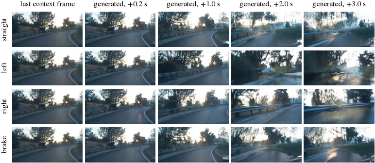
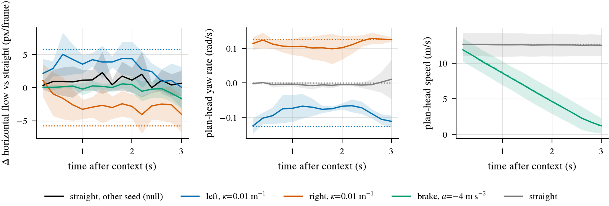

# I4：`commaai/worldmodel-4B` 是否接受 action 条件，能否当 M-A 的 on-policy 环境

状态: 完成（调研 + 3 段 clip × 4 个动作 × 4 个 noise seed 的前向实验）
上级: [reactivity 计划](../2026-09-25-reactivity-program.md) 的 I4 行；M-A = 冻结 openpilot `driving_vision`、重训 temporal policy
代码: `scripts/i4_worldmodel_probe.py`（我们的 glue：准备输入、批量 rollout、计时、度量、出图；模型本身走 comma 发布的代码，未改动）
数据: box 上 `$DATA_DIR/runs/reactivity-i4/probe2/20260925-161605/`（rollout latent、解码帧、plan、`results.json`、`summary.csv`）；
权重 `$DATA_DIR/models/comma/{worldmodel-4B,vit-ae-2x-f8c32,openpilot.distill}`，环境 `$DATA_DIR/envs/comma-wm`（torch 2.13 + torchao，5.8 GB）
小结果: [results.json](../../research/results/reactivity-i4/results.json)、[summary.csv](../../research/results/reactivity-i4/summary.csv)

## 结论

**是，action-conditioned，但通道是 ego pose，不是 action 向量；方向可靠，幅度只跟到一半左右。**
模型对要生成的那一帧接收一个相对上一帧的 ego pose（平移 x/y/z + Euler roll/pitch/yaw，`pose_mask=0` 表示给了 pose），
comma 的 RL 环境用一个运动学小模型把 (curvature, accel) 换成这个 pose。同一段 context、同一个 noise seed 下只改动作，
生成视频的横向光流在 12/12 次 rollout 里都朝指令方向（右转 11/12），plan head 读出的 yaw rate 跟到指令的 67–88%；
刹车让画面的径向扩张流在 12/12 次里都变小。但幅度偏小：横向流平均只有几何预期的约 52%，刹车后画面前进速度只减掉约 30%，
而指令速度减掉约 67%。这和 comma 论文自己的说法一致（"simulates the commanded deviation, but not to its full extent"）。

对 M-A 的含义：它**能**当一个 on-policy 环境，而且 comma 已经在 `openpilot.distill/rl` 里做了几乎就是 M-A 的事
（冻结 vision、只训 `on_policy_temporal`，用 world model 的 plan head 当标签）。但它是一个**绕着 logged 轨迹做 recovery 的环境**，
不是能凭空造出行人、cut-in 的反事实环境：条件只有 ego pose，其他交通参与者由模型自己生成，并且每次 rollout 都被 5 帧真实的
未来 anchor 拉回录制的轨迹。所以它能补 M-A 的 covariate shift（偏离 logged 轨迹后怎么回来），替代不了 CARLA P5 / HUGSIM I3
那种「同一场景有无 hazard」的配对标签。成本上，一张 RTX PRO 6000 每秒约生成 9–10 帧（15 步去噪），够做 DAgger 规模的数据，不够做大规模 RL。

## 模型是什么（调研）

来源：HF model card（`commaai/worldmodel-4B`，2026-09-18 更新）、tokenizer card（`commaai/vit-ae-2x-f8c32`）、
torchpackage 里打包的 `model.py` / `model_for_inference.py`、`YassineYousfi/openpilot.distill` 的 `rl/`（2026-08-31）、
论文 *Learning to Drive from a World Model*（arXiv 2504.19077，2025-04）和 comma 博客 mlsim。

| 项 | 内容 |
|:--|:--|
| 结构 | video DiT（Diffusion Transformer，在 latent patch 上做去噪的 transformer），4B 参数；RMSNorm 版 adaptive normalization（条件经 adaLN 调制每个 block）；rectified flow（沿直线从噪声走到数据的 flow matching 目标），推理用 Euler 积分，默认 15 步（训练脚本默认 30） |
| 权重格式 | 单个 3.2 GB 的 `torch.package`：attention 权重 FP8、MLP 权重 NVFP4、KV cache FP8；meta 写明 `minimum_compute_capability = 10.0`，即只能跑在 Blackwell 上（box 的卡满足） |
| tokenizer | `vit-ae-2x-f8c32`：ViT autoencoder（encoder 43M、decoder 85M），输入是 narrow + wide 两路路面相机、各自标定后缩到 128×256、按通道拼成 6×128×256，压成 32×16×32 的 latent；每帧在 DiT 里是 128 个 token（2×2 patch） |
| 帧率与窗口 | 5 Hz；一次预测的输入 15 帧 = 5 帧 future anchor + 9 帧 history + 1 帧待生成的 target。block-causal mask（按帧分块的因果注意力）：anchor 之间因果，history 能看 anchor，target 看全部 |
| future anchor | 录像里 rollout 终点之后的 5 帧真实 latent。论文叫 future anchoring：告诉模型「你最终要回到这里」，制造 recovery pressure（偏离后往录制轨迹回拉的压力） |
| **pose 条件** | 每帧一个 `augments_pos_ref_augment`（3 维相对平移）和 `ref_augment_from_augments_euler`（3 维相对 Euler 角），再加 `pose_mask`（0 = 给了 pose，1 = 遮掉）和 `fidxs`（帧序号，0–49）。四者各经一个 embedder 加到 timestep embedding 上，一起调制每个 DiT block |
| CFG | classifier-free guidance（有条件和无条件两次预测外推，放大条件的作用）的无条件分支正是「pose 清零 + `pose_mask=1`」，即 guidance 专门放大 ego pose 的作用；README 示例 cfg = 2.0 |
| action → pose | `rl/env.py` 的 `Physics`：输入 curvature（1/m）和 accel（m/s²），speed += accel/5，yaw = speed·κ/5，dx = d·cos(yaw/2)，dy = d·sin(yaw/2)；只给 target 帧 pose，history 和 anchor 的 pose 全遮掉。符号：+κ 是右转（WASD 的 D 键） |
| 输出 | target 帧的 latent（再用 VAE 解码成两路 128×256 图）和 plan head 输出：33 个时间点 × 15 维（位置、速度、加速度、姿态、角速度，openpilot 的 `Plan` 布局）× 均值/方差。plan head 是 inverse dynamics（从前后帧反推动作的模型）风格的，按人类轨迹训练，RL 里把它换算成 (curvature, accel) 当 policy 的标签 |
| 预期数据 | comma 设备的双路路面相机（`openpilot.distill` 默认 comma four；VAE 是在各代 comma 设备上训的）。我们盘上的 comma1M（comma 3/3X，1928×1208，ar0231/ox03c10 内参）能直接用；WOD、nuScenes、CARLA 没有 comma 的 wide 相机和标定，不能直接喂 |
| license | 模型、VAE、`openpilot.distill` 都是 MIT |

## 前向实验

**设置。** comma1M 里 3 段有视频的 segment，各取一段 context（速度 10.6 / 12.8 / 14.6 m/s；第 1 段是白天右弯山路，后 2 段是夜间），
每段从同一 context 出发做 4 个动作：`straight`（κ=0, a=0）、`left`（κ=−0.01 m⁻¹）、`right`（κ=+0.01 m⁻¹）、`brake`（a=−4 m/s²），
每个动作 4 个 noise seed，自回归生成 15 帧（3 s）。同一 seed 的不同动作共享每一步的初始噪声，所以它们和 `straight` 的差只来自动作；
null 是 `straight` 换 seed。设置照 comma 的 `Env.step`：anchor 用 rollout 终点之后的 5 帧真实 latent，cfg=2.0，15 步 Euler。
横向指令 κ=0.01 在这些速度下是 1.1–2.1 m/s² 的侧向加速度，属于正常驾驶范围。

**度量。** 解码后在 wide 相机上算相邻帧的 Farneback 光流：(1) 平均水平流，自车左转时景物右移、流为正，
几何预期约为 227.5 px（wide 视图焦距）× 每帧 yaw；(2) 径向扩张流，前进越快越大。另读 plan head 在 t=0 的 yaw rate 和速度。
所有差值都是对同一 seed 的 `straight` 配对取的。



第 1 段（白天、右弯）seed 0 的 wide 相机。0.2 s 时四行几乎一样（一帧的位移很小），1 s 起分开：`right` 沿弯道走、护栏一直在画面里；
`straight` 和 `left` 冲出弯道，2 s 后画面里是树和护栏，并开始模糊变形；`brake` 的前进明显慢。2–3 s 的退化说明 ego 一离开可行驶区域，生成质量就掉得很快。



左：水平流相对 `straight` 的差，实线是 3 段 × 4 seed 的均值，阴影是 ±1 sd，点线是几何预期；中：plan head 的 yaw rate，点线是指令值；
右：plan head 的速度和指令速度。左右转的流从 0.4 s 起就分到两侧并保持，但只到预期的一半左右；plan head 跟指令跟得更紧。

**结果（n = 3 clip × 4 seed = 12 次 rollout / 动作；null 为 3 clip × 3 seed = 9）：**

| 动作 | Δ 水平流，0.8–3 s（px/帧） | 几何预期 | 跟随比例（逐 clip） | 方向正确 | plan yaw rate（rad/s） | 指令 yaw rate |
|:--|--:|--:|:--|:--|--:|--:|
| null（换 seed） | +1.08 ± 1.33 | 0 | — | — | +0.003 | 0 |
| left | **+2.98 ± 1.49** | +5.76 | 0.91 / 0.35 / 0.38 | 12/12 | −0.085 | −0.127 |
| right | **−2.97 ± 1.70** | −5.76 | 0.52 / 0.25 / 0.74 | 11/12 | +0.112 | +0.127 |

| 动作 | 径向扩张流比 brake / straight，1.2–3 s | 指令速度比 | 扩张变小 | plan 速度，3 s 时（m/s） | 指令速度，3 s 时 |
|:--|:--|:--|:--|--:|--:|
| brake | 0.70（逐 clip 0.69 / 0.65 / 0.77） | 0.33（0.23 / 0.34 / 0.43） | 12/12 | 1.21 | 1.14 |

读法：null 的 ± 是 seed 之间的离散度，null 均值不为零是因为 3 个 seed 都拿 seed 0 当参照、彼此相关。left − right 的间隔是 5.95 px/帧，
预期 11.5，约 52%。刹车时画面的前进速度只降到 straight 的 70%，而指令降到 33%，只跟上约 45% 的减速。plan head 的速度几乎精确等于指令，
但它读的是 target token，本身就带着 pose 条件，所以这一列只说明条件被读进了网络，像素是否跟上要看光流那两列。

**像素距离不能单独作证据。** 同 seed 下 `left` 对 `straight` 第 1 帧的像素 MAE 是 7.9（0–255），换 seed 的 null 是 5.3；到第 5 帧是 24.7 对 13.6，
到第 15 帧两者都在 25–30。换句话说，采样随机性造成的差异和动作造成的差异是同一个量级，只有带方向的量（光流符号、plan）才分得开。
按 seed 配对的比较（同一初始噪声）是这次能看出效果的前提。

## 作为 M-A 环境的成本

计时在 GPU 1 上测（与一个 HUGSIM 作业共卡，所以是偏保守的数），15 或 30 步 Euler，cfg=2（每步两份 batch）：

| batch | 15 步：ms / 调用 | 15 步：ms / 帧 | 30 步：ms / 帧 |
|--:|--:|--:|--:|
| 1 | 527 | 527 | 1002 |
| 8 | 865 | **108** | 226 |
| 16（实验里的 rollout，3 段中位数） | 1483–1882 | 93–118 | — |
| 32 | 3690–4860 | 115–152 | 266 |

VAE 解码 3.5 ms/帧。显存峰值 21.5 GB allocated / 30.6 GB reserved（batch 32 + cfg），权重 3.2 GB；batch 8–16 在 40 GB 上限内很宽松。
batch 1 时每次去噪约 35 ms，对 4B 模型、~2k token 来说偏慢，看起来是 launch-bound（kernel 启动开销主导）；batch 8 以上才把卡用起来。
按官方代码原样跑，没有做优化。

据此估算：

- **吞吐**：一张卡约 9–10 帧/s（15 步）、4–5 帧/s（30 步，comma `rl/train.py` 的默认）；actor 自己的前向（openpilot vision + policy）另算，相比之下很小。
- **单次 rollout 长度**：受 anchor 结构限制，每条最多 50 − 9 − 5 = 36 帧（7.2 s，5 Hz）。从图上看，ego 偏离道路后 2–3 s 画面就明显变形，
  所以真正可信的偏离窗口大约 2 s。
- **数据量**：一轮 DAgger 收 5 万帧 on-policy 数据，15 步下约 1.4–1.6 GPU·h，30 步约 3 GPU·h；和 M-A 计划里 52 万帧的 WOD imitation 比，是一个小的补充量级。
  上千万帧的 RL 在一张卡上不现实。
- **数据来源**：只能用 comma 的双路相机视频。盘上 comma1M 82 个 segment 目录里只有 8 个带视频（每个 1 min、300 帧 5 Hz，约 7 条不重叠的 rollout），要用就得从 HF 补下 comma1M 视频。

## 用在 M-A 上的限制

| 问题 | 影响 |
|:--|:--|
| 条件只有 ego pose | 不能指定「前面有个行人」或「旁车 cut-in」；场景里的其他 agent 由模型自由生成，hazard 只有录像里本来就有才会出现 |
| future anchor 来自录像 | 环境知道录制的未来，并把 ego 往回拉。它教的是「偏了怎么回到人类轨迹」，和我们要的「为 hazard 偏离 prior」方向相反；刹停这类与录像矛盾的动作只被部分执行（上表 45%） |
| 幅度只跟到约一半 | policy 在里面学到的动作—后果关系偏弱，可能会学成过度转向或过度刹车；comma 用 plan head 标签加 DAgger 而不是 reward 优化，部分就是为了绕开这一点 |
| 域 | 输出是 comma 相机 5 Hz、每路 128×256 的帧。openpilot 的 `driving_vision` 吃的正是 narrow + wide 两路 YUV（`openpilot.distill` 的 actor 就是把 WM 帧放大 2 倍转 YUV 喂进去），格式能对上，但分辨率是一半，帧率是 5 Hz 不是 20 Hz。M-A 反正要重训 temporal policy，按 5 Hz 训可以接受；WOD / CARLA 的帧不能进这个环境 |
| 标签 | plan head 是按人类轨迹训的 inverse dynamics，给的是「人类会怎么开回去」，不是 hazard 反应的标签 |

**推测（未验证）**：如果 M-A 想要这个环境，最省事的路径是直接复用 `openpilot.distill/rl`（它的 `SupercomboActor` 已经是冻结 vision + `on_policy_temporal`
的结构），把 actor 换成我们的 openpilot `driving_vision` + 新 temporal policy，拿它做 recovery 方向的 DAgger 补充，reactivity 本身仍由 P5 / I3 配对来教。
值不值得做，取决于 M-A 的失败模式是不是 covariate shift；可以先在 comma1M 上用 WM 跑一次原生 openpilot 的 closed-loop 偏离曲线来判断。

## 复现

```bash
# box, GPU 1, 4 cores; weights and env under $DATA_DIR/models/comma and $DATA_DIR/envs/comma-wm (uv sync of openpilot.distill)
D=$DATA_DIR/datasets/comma1M
CUDA_VISIBLE_DEVICES=1 taskset -c 166-169 $DATA_DIR/envs/comma-wm/bin/python scripts/i4_worldmodel_probe.py run \
  --segment $D/010be91c698aff5aa6203adaf31aea92 $D/02698689e33c25f3c94030b9a3542269 $D/03c3757f950a7026e2625cb2a10a5f60 \
  --start 100 150 150 --seeds 4 --timing --tag probe2          # ~9 min incl. torch.compile autotune
$DATA_DIR/envs/jevdrive/bin/python scripts/i4_worldmodel_probe.py plot <run_dir> --clip 0
```
