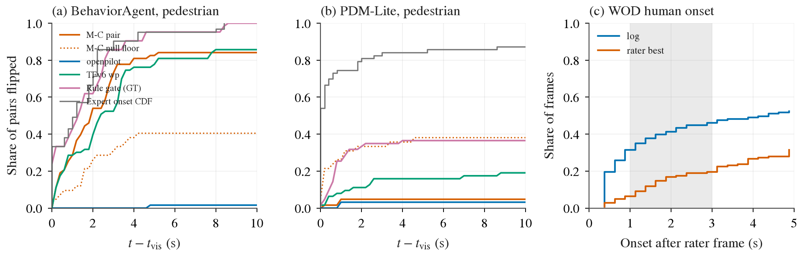
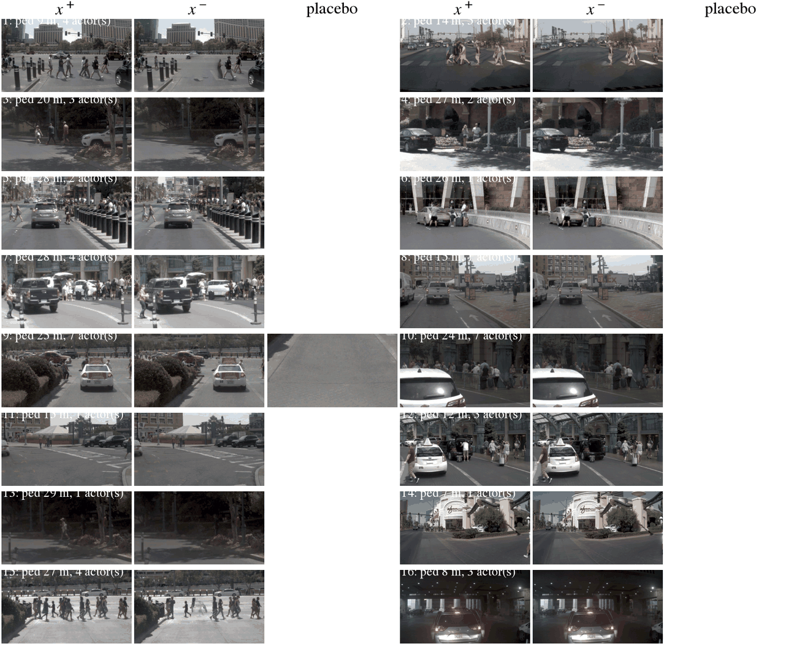
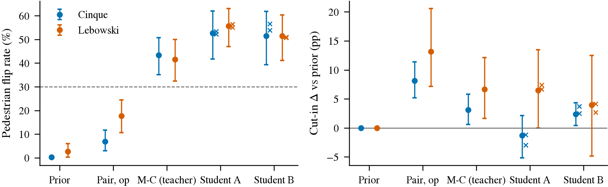

# 激发计划：冻结组件 + 配对差分，从 CARLA 走到真实开环数据（E1–E5）

状态: 本轮完成（2026-09-26 05:30）：E1 有害（WOD + NAVSIM）、E2 不过、E3 可行性不过（用户关闭）、E4 不过（BA 继续主判）、E4c 已出（[L, 3 s] 面积登记为并列读数）、E5 过（CARLA 内）、E6 到 TransFuser 水平（R 层配方）；夜间补 seed 见 overnight-queue。预登记写于 2026-09-26 任何新拟合之前
上游: 第 25 条（continuation prior + reaction decoder）、第 42 条（M-C 在 P5 v1 上行人 43%）、第 43 条（融合诊断，2026-09-26 就地修正）、
[reactivity 计划](2026-09-25-reactivity-program.md)、[融合前诊断](2026-09-25-fusion-diagnostics.md)、[fast-perception](2026-09-26-fast-perception.md)、
[openpilot 开环对比](2026-09-25-openpilot-openloop-comparison.md)（第 37 条修正：冻结 `temporal` + 薄 head 在 WOD / nuScenes / NAVSIM 三个数据集上都超过 ego-only）
主线: 不拼接、不重训 backbone。组件冻结（ego 历史、openpilot `temporal` + lead 头、Qwen `L18_last` pooled、快检测器 embedding），
能力靠**配对差分**激发：head 只在 x⁺ / x⁻ 的差上有标签，直行帧与 null 上约束为零；对照永远带均匀 imitation 与 hard-example 重加权。评测只看 reactivity（P5 口径）与 WOD 第 22 条口径。

## 已经知道的（本计划的起点）

| 事实 | 数字 | 出处 |
|:--|:--|:--|
| 同一批 Qwen ⊕ openpilot 特征、同一批 P5 v1 行人帧，三种训练信号 | 均匀拼接 0.2–0.7%；hard-example 0%；**配对差分 43.3% [35.0, 50.7]** | Q1-v1、M-C v1 |
| 激发需要的数据量 | v0 134 个行人 reactive 帧 → 0；v1 406 个 → 43% | 第 42 条修正 |
| 各组件里能提取的 | ego：gate；openpilot：车辆纵向反应、20 m 内 lead 召回 0.9；Qwen pooled：行人存在性；openpilot vision 层无行人（AUC 0.51） | 第 40、42 条，Q4c |
| CARLA ↔ Waymo 特征域差 | Waymo 训的 head 读不出 CARLA 特征，domain AUC 1.0 | P4（第 32 条前置） |
| PDM-Lite 集 | 所有考生逐帧翻转 ≈ 0，GT 规则门 4.2%：expert 在相机可见前 0.4 s 已反应 | reactivity todo I1 结果 |
| 快通道时间窗 | ParkingCrossingPedestrian p25 0.53 s；Qwen 流 200–300 ms / 帧、SAM 3 路 558 ms 都来不及 | Q8 |
| 冻结 `temporal` 跨数据集成立 | NAVSIM navtest 全量 12 146 token：Cinque `temporal` + 薄 head PDMS 77.9 / EPDMS 77.4，ego-only 68.4 / 67.8，原生 plan 52.1 / 46.2（2 Hz 协议所致），TransFuser 文献 84.0 / 76.7；单 seed，EPDMS 两边 devkit 版本不同只能说同量级 | 开环对比最终报告，第 37 条 |
| 特征比原生 plan 头对输入协议更鲁棒 | 同一份 2 Hz 输入，原生 plan 掉到 cv 以下，`temporal` 经 head 仍比 ego 高 9.6 EPDMS | 同上 |
| NAVSIM / nuPlan 的附加条件 | 全部 agent 有 GT 轨迹（原因物体不经感知可查）；自带 PDM scorer 可对任意 proposal 打分；scorer 是可调优的代理（第 35 条），只能当标签之一 | 第 35、37 条 |

## 五项

### E1. M-C 的 head 零样本套到 WOD（迁移检查，其余各项的前置）

- **问题**：在 CARLA 配对上激发出来的 reaction head，放到真实特征上还动不动。
- **做法**：取第 42 条 v1 BA 集上过判据的 M-C 双流 head（Cinque 与 Lebowski 各一，预登记网格里选出的那一个，**不重训、不调**），
  prior 换成 WOD train 训的 `ridge_late` openpilot（第 40 条 (iii) 那一个），Δ 加在 prior 上；在 WOD 完整 val 上评。
  特征：WOD 的 `op_*` `temporal` 与 `qwenvid L18_last` 已在盘上（第 40 条与 P3e 抽取），做标准化时用 CARLA 训练行的统计量（head 自带），并列一版用 WOD 行的统计量（描述）。
- **NAVSIM 列（新增）**：同一个 head 套到 navtest，prior 换成开环对比里 navtrain 训的 `temporal` 薄 head；用官方 devkit 报 PDMS / EPDMS 的配对 Δ，并按 navhard 与「走廊内 ≤ 30 m 有行人 / cyclist 的 token」（GT 轨迹判定，不经感知）分组；直行帧激活率同样报。
- **读数**：按 cluster（Pedestrians、Cyclists、Cut_ins、FOD、Intersections、全部）报 (i) 加 Δ 后 − prior 的 RFS 配对 Δ 与 ADE 第 1–9 档 Δ（第 22 条口径，sequence bootstrap）；
  (ii) Δ 的激活率：|Δ| 超过该 head 在 P5 null 上定的 τ 的帧占比，在 straight_yaw 帧对 pre-onset / Pedestrians 帧上分别报（激活该集中在后者）。
- **判据（写死）**：
  - **转移得过去**：Pedestrians 或 Cyclists 上 RFS Δ 的 CI 整体 > 0，且 straight_yaw 帧上激活率 ≤ P5 null false-flip（约 5–7%）、全部 rater 帧 RFS Δ 的 CI 不整体 < 0。
  - **转不过去但无害**：所有 Δ 跨零、激活率在直行帧 ≤ 7%。
  - **有害**：全部 rater 帧 RFS Δ CI 整体 < 0，或直行帧激活率 > 7%。
- **预期**：转不过去但无害（P4 的域差）。若转移得过去，E3 的挖掘对可以只做标签复核；否则 E2/E3 是必需。
- **资源**：CPU，特征在盘上（WOD 与 navtrain / navtest 的 `temporal`、Qwen `L18_last` 都已抽），< 1 h；NAVSIM devkit 打分约 20 min；工程半天（head 的加载与 prior 对接）。

### E2. 真实帧的反事实编辑对（SAM 的位置：离线造对，不进回路）

- **问题**：能不能在 WOD / nuScenes 帧上批量造 x⁻，让配对差分在真实特征上训练。
- **做法**：只做「删除」不做「插入」。用 SAM 3.1（已在 `envs/sam3`）按 pedestrian / cyclist prompt 出 mask，视频一致 inpainting（先用仓库原样的 LaMa 或 ProPainter 之一，登记时定一个），
  x⁺ = 原帧，x⁻ = 抹掉该 actor 的帧；只取 actor 在走廊内、≤ 30 m、像素 ≥ 20 的帧（Q2b 的走廊定义）。**安慰剂对照**（必带）：同样大小的 patch 贴到空路面。
  标签：无 expert，三种并列，各自单独报：(a) log 自己的未来当 x⁺ 侧、x⁻ 侧标签 = CTRA 外推（继续）；(b) 规则裁判（Q6 的三条门）；(c) navtrain 上加 PDM scorer：对「继续」与「刹停」两条 proposal 各打分，分差的符号当标签（第 35 条：scorer 是可调优代理，只作第三来源，不单独定判格）。
- **数据**：WOD 与 navtrain 都做，**navtrain 为主**：它有 GT 3D 框，抹掉的 actor 是不是走廊内的原因物体、有没有抹干净、还有没有被遮挡的第二个行人，都能对着 GT 验；WOD 只能靠 SAM 自己的检出，作为第二数据集。
- **验证（造对之前先过）**：16 对目检；独立检测器（YOLO26 COCO person）在 x⁻ 上的残留检出率 ≤ 10%（2609.22582 报 8.5%）；navtrain 上再按 GT 框核对「被抹 actor 的框内无残留、其他 actor 未受影响」；安慰剂对上 Qwen 与 openpilot 特征的位移中位数当噪声地板。
- **读数**：在 E1 的 head 上，x⁺ − x⁻ 的 Δ 幅值对安慰剂对的比；用编辑对**训练**的 M-C 在 P5 v1 BA 集上的行人翻转（真实 → 仿真方向的迁移）与 WOD Pedestrians 的 RFS Δ（按 sequence 分折）。
- **判据**：编辑对上 |Δ| 中位数 ≥ 2 × 安慰剂对，且用编辑对训的 head 在 WOD Pedestrians 上 RFS Δ CI > 0 而直行帧激活率 ≤ 7%。
- **资源**：SAM 已量 188 ms / 张单路；WOD 走廊内行人帧约 160（Q2b）太少，扩到 train 全量前视 41.5 万帧里走廊内有行人 / cyclist 的帧（估 1–3%，4–12k 张）：SAM 约 0.5–1 h GPU，inpainting 约 1–3 h GPU；head 训练分钟级。约 3–5 GPU·h，工程 1–2 天。

### E3. 从 log 里挖孪生帧（新增，真实 expert、不编辑图像；主数据集 navtrain，WOD 并列）

- **问题**：navtrain（约 10 万 token，GT agent 轨迹齐全）和 WOD train（52 万帧，无 3D 框）里，有没有足够多的「ego 历史匹配、未来分叉」的帧对，能当配对差分的标签。
- **为什么主做 navtrain**：孪生对的价值在于「未来差只能由场景解释」，这句话在 navtrain 上可以直接用 GT 轨迹核对（x⁺ 侧走廊内有接近的行人 / 车辆、x⁻ 侧没有），不经 SAM；WOD 上只能靠 SAM（行人召回 0.36）判原因物体，上界受感知限制。PDM scorer 还能给每一侧的「继续 / 刹停」打分当第三标签。
- **做法**：每帧的 ego 历史向量（16 步 × 位置 / 速度 / 加速度，第 40 条 ego 特征）+ intent one-hot；在同 intent 内做最近邻（标准化后 L2，容差 τ_ego 在 null 分布上定：同一 sequence 相邻 0.25 s 的帧对之间的距离 p95），
  排除同一 sequence 与同一路段（用 sequence id 与 GPS 近邻）；未来分叉 = 5 s 未来的纵向速度差 ≥ 2 m/s 或横向偏移差 ≥ 1 m（与 P5 τ_exp 的量级对齐，登记时定死）。
  分叉的一侧当 x⁺（反应）、另一侧当 x⁻（继续）；方向由未来自己给出。**噪声对照**：ego 匹配但未来也匹配的对（孪生 null），它们的特征差分定 τ。
- **可行性统计（本项的第一交付，纯 CPU）**：两个数据集各一张：匹配对数按 τ_ego 与分叉阈值的网格；分叉对里 x⁺ 侧走廊内有原因物体的比例（navtrain 用 GT 轨迹：≤ 30 m、接近速度 < −0.5 m/s；WOD 用 Q2b 已有的前视 SAM 检测，20 237 帧，不够再补）；
  分叉对与 navhard、pre-onset、Pedestrians、Cut_ins 等分组的重叠；navtrain 上另报 PDM scorer 对两侧「继续 / 刹停」的分差分布，看它与人类未来的符号一致率。
- **判据**：任一数据集上分叉对 ≥ 1 000 且其中走廊内有原因物体的比例显著高于孪生 null 对（CI 不跨零）→ 在该数据集上开训练；两个都不过就记「log 里挖不出足够的配对」，只留 E2。navtrain 上另加一条描述：scorer 分差与人类未来符号一致率（不进判格）。
- **训练与读数（可行性过了才做）**：M-C 同一 head，训练行 = 孪生对，按 sequence / log 分折；navtest 上按有无行人分组的 PDMS / EPDMS 配对 Δ（官方 devkit）与 navhard；WOD Pedestrians / Cut_ins 的 RFS Δ、pre-onset ADE Δ；P5 v1 BA 行人翻转（真实 → 仿真）。对照：均匀 imitation、hard-example。
- **资源补充**：navtrain 的 `temporal` 与 Qwen 特征已在开环对比里抽好；GT 轨迹在 navtrain 的 log 里，走廊判定纯 CPU。
- **文献核查（写入结果之前）**：按 ego 状态匹配从 log 里挖配对做差分监督有没有先例（关键词 matched pairs / twin frames / counterfactual mining from logs / state-matched contrastive imitation）；有就引，claim 相应缩。
- **资源**：最近邻 52 万 × 100 维 CPU 小时级；SAM 若要补帧按 E2 的量估；head 分钟级。工程 1 天。

### E4. PDM-Lite 集的计分窗口（让 v1 主判定集可用）

- **问题**：PDM-Lite 在因素可见前 0.4 s 已反应，逐帧口径下所有考生 ≈ 0。
- **做法（预登记两种，主判用 (a)）**：(a) **可见门控**：reactive 帧只保留 t ≥ t_vis + L 的帧，L = 考生的感知 + 决策延迟（openpilot 0.1 s、Qwen 流 0.3 s、SAM 0.6 s，按 Q8 与 baselines 实测），并要求该帧的 Δ_expert 仍 > τ_exp；
  (b) **按对计分**：窗口内任意 reactive 帧翻对即算这对过（第 32 条已用过的口径）。两种都报，null false-flip 同样按窗口重算。
- **读数**：所有现有考生（TFv6 两通道、ridge ego、openpilot、Qwen、M-C 各 arm、Q6 规则门）在 PDM-Lite 集上按 (a)(b) 重报；与 BA 集并排。
- **判据**：(a) 下 M-C 双流行人翻转与 BA 集的差在 ±15 pp 内且 null ≤ 7% → PDM-Lite 集成为主判定集；否则继续以 BA 为主、PDM-Lite 只报 (b)。
- **资源**：CPU 分钟级（预测都存着），工程半天。
- **E4c（2026-09-26 新增，描述性读数，写于任何曲线数字之前）：reaction latency 曲线与人类 onset 锚。** 两套 expert 标签分歧的本质是 onset 不同（PDM-Lite 可见后约 0.4 s、BehaviorAgent 中位 5.6 s），二选一会丢掉一种能力，所以把两者放到同一条曲线上：
  (i) 对每一对，x = t − t_vis（0–10 s，步长 0.2 s），y = 到该时刻为止已定向翻转的对的比例（按对计分，翻转门槛 τ 仍由各考生在 null 上定），两个 expert 各画自己的 onset 分布作参照；null 对给出同一曲线的地板。
  每个考生报：曲线、物理可行窗口 [L, 窗口终点] 内的面积（L = 该考生的感知 + 决策延迟）、首次翻转时刻对两个 expert onset 的中位差。
  (ii) **人类 onset 锚**（WOD，CPU 分钟级）：在 Cut-ins、Pedestrians、Cyclists cluster 的 rater 帧上，算 rater_best 与 log 各自的减速起点（纵向速度剖面首次比 CTRA 外推低 0.5 m/s 的时刻），报两者的分布；
  它回答 PDM-Lite 的 0.4 s 和 BehaviorAgent 的 5.6 s 哪个离人类偏好近，也就是曲线上哪一段该当主判定。
  **当下的口径（写死）**：主判定用 BA 集（所有考生都得 0 的考卷没有区分度），PDM-Lite 集按 (a) 门控窗口当预判读数并列；E4c 出来后若人类 onset 落在 1–3 s，则主判定改为曲线在 [L, 3 s] 的面积，这个改动要先登记再用。

### E5. 20 Hz student：把 M-C 蒸馏到快通道（等 fast-perception 出延迟后登记细节）

- **问题**：M-C 的 Qwen 流 200–300 ms / 帧，ParkingCrossingPedestrian 一类来不及。
- **做法**：teacher = M-C 双流 head 的 Δ；student 输入 = openpilot `temporal` ⊕ 快检测器 embedding（fast-perception 里延迟 ≤ 20 ms 且 P5 行人 ≤ 20 m 召回 ≥ 0.8 的那个，候选 YOLOE-26 / EfficientSAM3；embedding = 走廊内前 k 个检测的 (类别, x, y, 尺寸, score) 经一个小 MLP，k = 8）；
  标签 = 同一批 P5 v1 配对差分（不是 teacher 输出）+ teacher 的 Δ 当辅助目标，两者各一 arm。对照：openpilot 单流配对差分（第 42 条 7–18%）。
- **读数**：P5 v1 BA 行人翻转、cut-in Δ、null false-flip、非反应帧误刹；端到端延迟（检测 + head）。
- **判据**：行人 ≥ 30% 且 CI 下端 > null、cut-in 不掉、延迟 ≤ 50 ms。
- **资源**：检测器在 P5 观测帧上跑一遍（YOLOE-26x 640 估 < 10 ms / 张，29.8k 张约 5 min）；head 分钟级。工程 1 天。**登记条件**：fast-perception 的延迟 × 召回表出来后再补检测器名与数字，之后才算预登记完成。

### E6（可选，不进主线）. NAVSIM 上那 6 分 PDMS 是不是 R 层配方

- **问题**：冻结 `temporal` + ridge 77.9 PDMS，TransFuser 84.0；差距是表征还是 head 配方。第 35 条判 R 层配方不稀缺，这里只是量一下。
- **做法**：同一份 navtrain 特征，两个 head 各一：(a) WOD 那种 K=1024 轨迹词表分类头（第 40 条 (iii) 的 `cls_late`）；(b) Hydra-MDP 式按 PDM 子指标各一个打分头、推理时加权选 proposal（权重只在 navtrain 内的 held-out 上定）。均匀 imitation 训练，与 E1–E5 的配对差分无关。
- **读数**：navtest PDMS / EPDMS，navhard 并列；报与 ridge 的配对 Δ。
- **判据**：只作描述，不改任何方向；(b) 若 ≥ 84 就在 backbone 一节写「512 维冻结特征 + 配方 head 到 TransFuser 水平」，否则写「差距不在配方」。
- **资源**：特征在盘上；(a) L-BFGS 小时级 GPU，(b) 离线在候选词表上跑 PDM scorer 一次（Hydra-MDP++ 的做法，CPU 多核小时级）+ head 分钟级。工程 1 天。排在 E1–E5 之后，卡空了再做。

## 顺序与依赖

```
E4（CPU，半天）──────────────────────────────► v1 主判定集可用，E2/E3/E5 的仿真侧读数都用它
E1（CPU，半天，WOD + NAVSIM 两列）──转移得过去──► E2/E3 只做标签复核
      └──────────────────────转不过去──────► E2 与 E3 并行（都以 navtrain 为主、WOD 并列；E3 先出可行性统计，纯 CPU）
fast-perception 延迟表 ───────► E5 登记完成 → 跑
E6（可选）──────────────────────► E1–E5 之后、卡空时
```

## 硬约束

- 组件全部冻结；head 只有配对差分、均匀 imitation、hard-example 三种训练信号，每项都三者并列。
- judge 一字不改：WOD 第 22 条口径，P5 v0 / v1 的定向翻转率 + 样本外 null false-flip；E4 新增的窗口口径先登记后使用。
- 训练 / 评估按 sequence（WOD）、log（navtrain / navtest 按官方 split）或路线（P5）分开；E2 / E3 的对不得与评估 sequence / token 同源。
- NAVSIM 的读数一律用官方 devkit 打分并注明版本；EPDMS 与文献只能写「同量级」，不写「超过」；所有 head 报 seed 数。
- 闭环仍暂停；本计划全部开环。
- 任何一步超估计 2 倍先停下报。结论：E1–E3 进 decisions.md 新条目「配对差分从 CARLA 到真实数据」；E4 补进第 42 条；E5 进第 42 条或新条目。

## 交付

1. E1：WOD 一张 cluster × {RFS Δ, ADE Δ, 激活率} 的表，NAVSIM 一张分组 × {PDMS Δ, EPDMS Δ, 激活率} 的表 + 判格。
2. E2：编辑对样例 16 组图、验证表（残留检出、安慰剂地板）、训练后的 WOD / P5 两向读数。
3. E3：navtrain 与 WOD 各一张可行性统计表（对数 × 阈值网格、原因物体比例、分组重叠；navtrain 另有 scorer 符号一致率）；过线则加训练读数；文献核查一段。
4. E4：PDM-Lite 集在两种窗口下的全考生表，与 BA 并排。
5. E5：student 的翻转 / 延迟表。
6. E6（可选）：navtest 上两种 head 对 ridge 的配对 Δ，一段结论。
小表进 `research/results/elicitation/`。

## 偏离与澄清日志

（执行时追加，时间戳早于受影响的数字。）

- 2026-09-26 00:25 CST（box 时钟，下同）[E1] 写于 E1 的任何数字之前。执行分工：本计划由 elicitation agent 负责，E1 自做，E4、E3 可行性各一个子执行代理并行（各自在本日志里记 [E4] / [E3] 条目）。E1 的操作化：
  (1) **head 是哪一个**。M-C 没有存 W；它是按路线 5 折 cross-fit 的，v1 BA 集上「过判据的 head」其实是 5 个 fold head（每个 fold 自己的 λ、自己的训练行标准化统计量）。
  做法：用 `reactivity_mc.fit_fold` 同一段代码、v1 BA 集、`op_streams_vis`、预登记 λ 网格，把 5 个 fold 的 `M-C pair`（双流）W 逐 fold 重算出来，
  先核对它在 obs 行上的预测与 `runs/reactivity/mc-carla_p5v1_ba/20260925-233126/preds_obs.npz` 一致（max |diff| 预期 0 或 fp32 噪声级，≤ 1e-4 m），
  λ 与该 run 的 `mc_fold` 事件一致；不一致就停。迁移用的 Δ = 5 个 fold head 的 Δ 取平均（每个 fold head 用它自己的 CARLA 训练行统计量做标准化、减它自己的训练行均值），
  不重新拟合、不选 λ。Cinque 与 Lebowski 各一（各配同模型的 prior），Cinque 为主。
  (2) **WOD 评测集**。登记写「WOD 完整 val」，但 Qwen `L18_last` 在 val 上只抽过 `qwenvid_p3` 的 19 663 帧（`p2p3_v1` 子集，与 P5 同一个 P3(d″) 抽取器、eager batch 2），
  完整 val（106 360）要再抽约 8.7 万帧（约 9–10 GPU·h）。所以评测集改为 `p2p3_v1` ∩ Qwen = 19 663 帧（其中 rater 帧 478、pre_onset 与 straight_yaw 按子集标记），
  与第 40 条 cross-fit 那一版的帧相同。prior = 第 40 条 (iii) 的 train 训 `A ridge_late op-<model> temporal`（`runs/drive_backbones/heads_train/20260925-110819/p3drive_heads_preds_dir0.npz`），
  openpilot `temporal` 取 `op_<model>_p3_trainval`（考试协议）。s_ego 分档的 decile 边界在完整 val 的 106 360 帧上定（与第 22 条 (iii) 一致），再限到这 19 663 帧。
  (3) **描述版标准化**（「用 WOD 行的统计量」）：两路特征各用 WOD **train** 行的均值 / 标准差（`qwenvid_train_t4` 的 137 533 个 train 行，openpilot 取同一批行；不用评测行），
  其余不变（W 不变，减的均值换成 WOD train 行在该标准化下的均值，即 0）。只描述，不进判格。
  (4) **读数**。cluster = index 的 `cluster` 列：Pedestrian、Cyclist、Cut_ins、Foreign Object Debris、Interections（原拼写）、全部。
  (i) RFS Δ = RFS(prior + Δ) − RFS(prior)，rater 帧（每 sequence 一帧，frame bootstrap 即 sequence bootstrap，`traj.boot_ci`）；ADE Δ 在 s_ego 第 1–9 档（对 log，sequence bootstrap），另报 pre_onset 第 1–9 档一行。
  (ii) **激活率**：P5 的 τ 是 null 对上 |v₂(pred(x⁺)) − v₂(pred(x_null))| 的 p95（v₂ = 2 s 速度），单帧上没有对，所以激活定义为 |v₂(prior + Δ) − v₂(prior)| ≥ τ，
  τ 取 v1 BA run 的 `flip_rates.csv` 里 `M-C pair [<model>]` 的 `tau_model`（Cinque 1.628、Lebowski 1.655 m/s，已存的数，不是新拟合）；分别报 straight_yaw、pre_onset、Pedestrian cluster、全部帧。
  判格里「直行帧」= straight_yaw 帧，7% 门槛照登记。另报 |Δ| 的 ADE 幅值（m）中位数作描述。
  (5) **NAVSIM 列的前提不成立，推迟**：登记写「navtrain / navtest 的 Qwen `L18_last` 都已抽」，实际盘上 NAVSIM 只有 openpilot `temporal`（`runs/navsim_zs/openpilot/<split>/<model>_temporal.npz`），没有任何 Qwen 特征。
  双流 head 在 navtest 上要先抽 Qwen：P3(d″) 抽取器原样，clip = NAVSIM agent 可见的 4 帧（−1.5 / −1.0 / −0.5 / 0 s，2 Hz，与 P5 / WOD 的 0.2 s 间隔不同，这是又一处输入分布差，照记），
  相机 CAM_F0 / CAM_L0 / CAM_R0 → front / front_left / front_right；navtest 12 146 token 约 1.1–1.4 GPU·h，要等 GPU 1 / 2。NAVSIM 列的其余口径现在定死：
  prior = navtrain 训的 `ridge_late <model> temporal`（`runs/navsim_zs/heads/20260925-232810`，与 P5 / M-C 一样是连续回归 prior，Δ 可以直接相加）；`cls_late` + Δ 只描述。
  Δ 在 0.25 s 网格上，取 0.5 … 4.0 s 的 8 个点（索引 1, 3, …, 15）加到 prior 的 (x, y) 上，heading 保持 prior 的不变；官方 devkit（v1.1 出 PDMS、main @ 0a380a9 出 EPDMS，`OPENBLAS_CORETYPE=Haswell`）打分；
  分组：navhard two-stage（EPDMS）、「走廊内 ≤ 30 m 有行人 / cyclist」的 navtest token（GT agent：logged 未来 4 s 路径 ±1.5 m、前方 ≤ 30 m，与 E3 的原因物体定义同一函数）、其余 token；激活率同 (4)(ii)。
  (6) 判格里「转移得过去」的直行帧门槛写的是「≤ P5 null false-flip（约 5–7%）」：取该 head 自己在 v1 BA 上的样本外 null false-flip（Cinque 5.1%、Lebowski 5.0%）；「无害 / 有害」的 7% 照登记。
  两个模型分别判，主判 Cinque。fold head 的重算在 CPU 上做（GPU 都有人），与已存预测的差按 fp32 噪声级核对，λ 必须逐 fold 相同。
  (7) 2026-09-26 00:31 [E1]（WOD 的任何数字出来之前）fold head 在 CPU 上重算只复现到 1.3 cm（fold 0 Cinque，λ = 0.1 在网格下沿，3072 维的解病态，CPU 与 GPU 的 fp32 累加顺序差被放大），
  没过 (1) 的 ≤ 1e-3 m 核对。病态方向正是域外特征可能投影上去的方向，所以不放宽门槛，改在 GPU 上重算（原 run 是 GPU fit，同型号卡），占 GPU 1 几分钟、< 5 GB，gpu-plan 记一行；其余读数仍在 CPU。
  (8) 2026-09-26 00:37 [E1]（NAVSIM 的任何数字之前）NAVSIM 列补充口径：navhard two-stage 也要 Qwen 特征（5 912 token，同一抽取器，接在 navtest 后面，GPU 1，约 1 h）；
  激活率里 prior 只有 0.5 s 间隔的位姿，v₂ 所需的 1.75 s 点取 1.5 s 与 2.0 s 的线性插值；NAVSIM 的「直行帧」按 `waymo.subsets` 的 straight_yaw 同一套阈值在 2 Hz 位姿上算
  （最近 0.5 s 的 yaw rate < 1°/s、最近 1 s 位移 ≥ 1 m、logged 未来 3 s 弦方位 ≤ 5° 且弦长 ≥ 3 m）；行人 / cyclist 组 = E3 的 `corridor_objects`（logged 路径延长到 30 m、±1.5 m）里有 pedestrian 或 bicycle 类 GT agent，不要求接近速度。
  打分名 `e1_<prior>_<model>_plus_mc`，配对 Δ 对 `heads_<prior>_<model>_temporal`（G3 的已存打分），token bootstrap。
  登记的三格判据都是 WOD 上的量（Pedestrians / Cyclists 的 RFS Δ、straight_yaw 激活率、全部 rater 帧 RFS Δ），所以 E1 的判格由 WOD 列下；NAVSIM 列按登记报表，不改判格。

- 2026-09-26 00:25 CST（box 时钟；原写 00:30 是手填的估计，已按提交 c160f08 的时间改正，E4 run 在 00:26:32）**[E4] 两种窗口的操作化**（写于任何 E4 数字之前；此前只见过 v1 两套集合的官方逐帧数，即第 42 条已记的那些）。
  输入全部是已存的逐帧打分，不重拟合：PDM-Lite 集 `runs/p5_pairs/exam-d0-carla_p5v1_pdm/20260925-230423`（TFv6 三通道、`ridge ego`、Qwen 与 openpilot 的 `ridge_late`）、
  `runs/reactivity/mc-carla_p5v1_pdm/20260925-230424`（M-C 全部 arm 与 prior）、`runs/fusion_diag/q6gt_carla_p5v1_pdm/20260925-233007`（Q6 GT 规则门）；BA 集用对应的三个 run 并排。
  Q6-SAM 在 v1 上按融合诊断 23:36 的决定没有跑，SAM 状态版考生缺，记为缺项，不补。Q1-v1 的拼接 arm 不在本项考生名单里。
  (1) **可见门控 (a)**：t_vis 取 `pairs.csv` 该对的 `t_vis`（20 Hz tick），观测帧 k 只保留 k ≥ t_vis + L / 0.05；reactive 的定义不变（|Δ_expert| > τ_exp，τ_exp 用官方 run 的值），
  所以「该帧的 Δ_expert 仍 > τ_exp」由保留下来的 reactive 帧自动满足。L 按考生：openpilot 流（`ridge_late op-*`、M-C `prior`、M-C `pair op`）0.1 s（Q8 的 2.3 ms 加一拍相机 tick，按登记的 0.1 s）；
  Qwen 流（`ridge_late L18_*`、M-C `pair qwen`）0.3 s；M-C 双流 arm（`pair`、`pair (mu=0)`、`hard`、`uniform`）取两路较慢者 0.3 s；
  TFv6 三通道 0.1 s（三 seed ensemble 前向在 3090 上约 51 ms、agent 每 tick 约 110 ms，见 todos/remote_carla.md，向上取到 0.1 s）；`ridge ego` 0（只读自车状态，无感知）；
  Q6 GT 规则门 0（特权 GT 状态，无感知延迟，是上界），另加一行只描述的「GT 规则门 + L = 0.6 s」当 SAM 状态版在 SAM 延迟下的上界。
  观测帧间隔 0.2 s，所以 L = 0.1 只去掉 k = t_vis 那一帧，0.3 去掉前两帧，0.6 去掉前三帧。
  τ_model 不重算（沿用官方 run 在全部 null 帧上的值，judge 不改）；null false-flip 按同一窗口重算：null 帧用该 base 的 seed-0 对的 `t_vis`（seed-0 对没有 t_vis 的 fallback null 窗口用 `t_trig`，与 `p5_pairs` 取 null 帧的规则一致）按同一 L 门控，
  样本外口径与官方相同（null 按 base 路线对半，τ 在一半上定、在另一半的门控帧上算，两个方向平均）。翻转率、非反应帧误翻、CI（base 路线 bootstrap 2000 次）其余一字不改。
  (2) **按对计分 (b)**：窗口 = 该对的整个观测窗口（t_vis ≤ k < t_div − 1，即官方的观测帧，不加 L 门控，与第 32 条的按对口径相同）；一对（base_id, seed）在某个 scope 里有 ≥ 1 个 reactive 帧才进分母，
  其中任意一个 reactive 帧定向翻对（同号且 |Δ_model| ≥ τ_model）即算过；CI 按 base 路线 bootstrap。对应的 null 口径：一个 null case（每个 base 一个）只要窗口内任意一帧 |Δ_model| ≥ τ_model 就算误翻，
  报样本内与样本外（同 (1) 的对半 τ）两个数；这是与「任意一帧翻对就算过」对称的地板，预期会远高于逐帧的 5%，判据 (a) 不用它。
  (3) **scope**：官方的合并 family（pooled）、行人（4 个行人 family 的 reactive 帧，同 M-C criteria）、cut-in（3 个 cut-in family）。
  (4) **判据**按登记：(a) 下 M-C 双流（`M-C pair [cinque]`，Lebowski 复现）行人翻转与 BA 集官方逐帧的 43.3%（Lebowski 41.6%）差在 ±15 pp 内，且 (a) 下样本外 null false-flip ≤ 7% → PDM-Lite 集成为主判定集；
  否则 BA 仍为主，PDM-Lite 只报 (b)。以 Cinque 判，Lebowski 不一致时照实写。BA 集上同样算 (a)(b) 作并排描述，不进判据。代码 `jevdrive/elicit_e4.py`，run `runs/elicitation/e4/<time>`。

- 2026-09-26 00:28 CST（box 时钟）**[E3] 可行性统计的操作化**（写于 E3 的任何挖掘、任何数字之前；只看过数据格式）。不训练，纯 CPU（≤ 24 核），代码 `jevdrive/elicit_e3.py`，run `runs/elicitation/e3-feas/<time>`。
  (1) **ego 历史向量**。WOD：第 40 条的 ego 特征原样，`past.npy` 16 步 × (x, y, vx, vy, ax, ay)（0.25 s 间隔、4 s，t0 自车系）= 96 维。navtrain：NAVSIM agent 合法可见的全部 ego 量，
  4 个历史位姿 (x, y, yaw，−1.5 … 0 s、2 Hz) + 4 个速度 + 4 个加速度 = 28 维（`navsim_heads.ego_features` 去掉 command 那 4 维；t0 位姿恒为 0 的列标准差置 1）。
  「16 步」在 NAVSIM 上不存在，只能用这 4 步。两边都按本数据集挖掘池的列均值 / 标准差标准化，距离 = 标准化后的 L2。
  (2) **分层**：同 intent / command 内找近邻（WOD `intent` 0–3；navtrain 取 t0 的 driving command one-hot 的 argmax）。
  (3) **挖掘池与近邻**：WOD 主读数用 train（415 663 帧）**抽稀到 2 Hz**（`frame % 5 == 0`，与 navtrain 的 2 Hz 对齐，也去掉 10 Hz 下几乎重复的相邻帧），且要求 `has_future`；
  全 10 Hz 池只作描述。每帧取**一个**最近邻（同层、不同 sequence / log、且不在同一路段），距离 ≤ τ_ego 才成对；(A, B) 与 (B, A) 去重。
  「同一路段」：navtrain 用 log 里的 `ego2global` 平移，两帧同 `map_location` 且全局距离 < 30 m 即排除；WOD-E2E 的 index 与 past 都在 t0 自车系、没有全局位姿，**只能排除同一 sequence**（照记，不补）。
  另报「不排除同一路段」的 navtrain 对数作描述。
  (4) **τ_ego**：同一 sequence / log 内时间上最近的两帧之间的 ego 向量距离的 p95。WOD：同一 sequence 相隔 3 帧（0.3 s，10 Hz 下最接近且不短于 0.25 s 的间隔）；
  navtrain：同一 log 内相邻 2 Hz token（时间戳差 0.5 s ± 0.05 s，nuPlan / OpenScene 能给的最小间隔）。网格 τ ∈ {0.5, 1, 2} × τ_ego，主格 1 ×。
  (5) **未来与分叉**。WOD `future.npy` 20 点 × 0.25 s = 5 s；navtrain `navtrain_future.npz` 8 点 × 0.5 s = **4 s**（NAVSIM 只有 4 s，登记的「5 s」在 navtrain 上改为 4 s）。
  终端纵向速度 v_T = 最后 1 s 的平均速度（|p_T − p_{T−1 s}| / 1 s）；横向偏移 y_T = 终点在各自 t0 自车系里的 y。分叉 = |Δv_T| ≥ θ_v 或 |Δy_T| ≥ θ_y；网格 (θ_v, θ_y) ∈ {(1, 0.5), **(2, 1)**, (3, 2)}（m/s, m），主格 (2, 1)。
  **孪生 null** = 同样 ego 匹配、但 |Δv_T| ≤ 0.5 m/s 且 |Δy_T| ≤ 0.3 m 的对。
  (6) **哪一侧是 x⁺**：两侧各算未来对自己的匀速直行外推（t0 速度沿 t0 朝向）的 ADE，偏离 continuation 更大的一侧是 x⁺（反应），另一侧 x⁻（继续）；null 对用同一规则挑「x⁺」侧，保证比较对称。
  (7) **原因物体（navtrain，GT）**：x⁺ 那一帧 t0 的 GT agent（log 的 `anns`：框、名字、`gt_velocity_3d`，自车系；先核对它是绝对速度——自车在动时 traffic_cone 的速度中位数 < 0.3 m/s，不是就停）。
  走廊 = 原点 + 该帧自己的 8 个 logged 未来位姿连成的折线，沿最后朝向延长到弧长 30 m（Q2b 事后敏感性那一版 `fusion_q2b.extend`，这里登记为主读数：刹车一侧的 4 s 路径到不了让它刹车的物体）；
  物体在走廊内 = 框 footprint（中心 + 4 角）任一点到折线横距 ≤ 1.5 m、投影弧长 0 < s ≤ 30 m；原因物体 = 走廊内且接近速度（位置单位向量 ·(v_obj − v_ego)，v_ego 取 `ego_dynamic_state` 的 vx, vy）< −0.5 m/s，类别不限，另按 vehicle / pedestrian / bicycle / 其他分列。
  同一个函数（`elicit_e3.corridor_objects`）给 E1 的 NAVSIM 分组用。另报两条描述：走廊内有物体（不要求接近）的比例；x⁻ 侧同一定义的比例（对内配对差）。
  (8) **原因物体（WOD，SAM）**：Q2b 的 SAM 3.1 前视检测（score > 0.5，按该 sequence 的标定平地抬升）只覆盖 val 的 20 237 帧（`p2p3_v1` 子集 + rater 帧），**train 上没有检测**。
  所以 WOD 的原因物体比例在这 20 237 帧**内部**另做一次同口径挖掘（池 = 这 20 237 帧，不再抽稀，其余规则同 (1)–(6)）上算：走廊同 (7)（logged 5 s 路径延长到 30 m、±1.5 m、前方 ≤ 30 m），
  单帧检测没有速度，**不要求接近速度**，类别 = vehicle / pedestrian / cyclist / cone | debris / emergency vehicle 任一。这些 val 对只用于可行性统计，不会进训练（评测 sequence 不得同源）。
  WOD 判据里的「分叉对 ≥ 1 000」用 train 池的对数，「原因物体比例高于 null」用 val 子集的对；两者不同源，照记。
  (9) **判据的检验**：主格上，分叉对的 x⁺ 原因物体比例 − 孪生 null 对的 x⁺ 原因物体比例，95% CI 用按 log / sequence 的 cluster bootstrap（以 x⁺ 帧的 log / sequence 为单位，2000 次）；CI 下端 > 0 且分叉对 ≥ 1 000 → 该数据集「过」。
  (10) **分组重叠**（描述）：navtrain——x⁺ 侧走廊内有行人 / bicycle、t0 静止（v₀ < 0.5 m/s）、command 左 / 右 / 直；navhard 由 navtest 系场景构造，与 navtrain token 按 token 核对重叠（预期为 0，照报）。
  WOD train——pre_onset、straight_yaw、turn_yaw（`waymo.subsets`）、静止起步；cluster 只在 val 上有标，所以 Pedestrian / Cyclist / Cut_ins 等的重叠只在 (8) 的 val 子集对上报。
  (11) **PDM scorer 符号一致率**（描述，不进判格）：navtrain 没有 metric cache，全量缓存超过 1 h CPU，所以**抽样**：主格分叉对里两侧 t0 速度都 ≥ 2 m/s 的对，seed 0 随机取 300 对（600 个 token），
  只为这些 token 建 v1.1 metric cache（`scripts/navsim_zs_score.sh cache v1 navtrain` 加 token 过滤）。每个 token 两条 proposal，几何都沿该帧 logged 未来路径：
  「继续」= 以 t0 速度匀速，「刹停」= 从 t0 速度以 3 m/s² 减速到停；官方 PDMS（v1.1）各打一次，分差 = PDMS(刹停) − PDMS(继续)。
  人类符号：logged 4 s 弧长比匀速弧长短 2 m 以上记「人类减速」，长 2 m 以上记「人类加速 / 继续」，其余不判。报 (a) 逐 token：|分差| ≥ 0.05 且人类可判的 token 上，分差符号与人类符号一致的比例；
  (b) 逐对：sign(分差_x⁺ − 分差_x⁻) 与 sign(人类减速量_x⁺ − 人类减速量_x⁻) 一致的比例。token bootstrap CI。缓存或打分若实测超过 1 h 就停在已完成的子集上，照记。
  (12) **特征可得性**：统计主格分叉对里两侧都有现成特征的对数——navtrain / navtest 只有 openpilot `temporal`（无 Qwen）；WOD train 的 Qwen `L18_last` 只有 thin=4 的 137 533 个 train 行（`qwenvid_train_t4`），openpilot `temporal` 覆盖全部 trainval。
  并按 0.33–0.40 s / 帧 / 卡估双流训练所需的 Qwen 抽取量（GPU·h）。
- 2026-09-26 00:33 CST [E2] 写于任何编辑对生成之前，也不读 E1 的任何数字（造对与 E1 无关；E2 的训练与读数开不开仍按 E1 判格）。卡：GPU 1（main 00:30 分配）。
  (1) **inpainting**：LaMa（big-lama，官方权重的 TorchScript 版，`simple-lama-inpainting` v0.1.0 release 的 `big-lama.pt`，原样调用），**逐帧**，不用 ProPainter。
  理由：NAVSIM 只有 2 Hz 帧，相邻两帧间 ego 位移常达数米、行人位移 0.5–1 m，ProPainter 的光流传播在这种间隔上不成立（它为 24–30 fps 视频设计）；WOD 的 clip 是 0.2 s 间隔，同样逐帧 LaMa，两个数据集一个配方。
  逐帧的代价是 4 帧之间的填充纹理不严格一致，这正是安慰剂对照要量的东西。为了分辨率，LaMa 在 mask 外接框放大 2.5 倍（至少 384 px，边长补到 8 的倍数）的裁块上运行，输出只贴回（膨胀后的）mask 内，mask 外逐像素不变。
  (2) **mask**：SAM 3.1（`envs/sam3`，`sam_detect.Detector` 原样的 exact 路径），prompt 只用 pedestrian、cyclist，保留 score ≥ 0.5（Q4 的分析阈值）。
  被抹 actor 的身份由 GT 决定（navtrain）：把它的 3D 框投到每张图，取与投影框 IoU 最大且 ≥ 0.3 的 SAM mask（cyclist 取 pedestrian ∪ cyclist 里与框重叠 ≥ 0.3 的全部 mask 的并，人和车一起抹）；
  mask 膨胀 max(7 px, 框高 × 8%)。SAM 在某张图上没配上时，退回投影 3D 框的凸包（膨胀同上），逐图记来源（sam / box），报比例。
  (3) **候选（navtrain，主）**：navtrain 官方 token（103 288），t0 帧 GT 里 `pedestrian` 或 `bicycle`，中心在 ego 前方（x > 0）、距离 ≤ 30 m、到 logged 未来 4 s 路径折线（原点 + 8 个位姿，
  折线两端外 1.5 m 也算，即 Q2b 的走廊定义）≤ 1.5 m，且 CAM_F0 上投影框高 ≥ 20 px。每个 token 只抹一个 actor（离 ego 最近的那个）；同一 actor 在同一 log 里只取一个 token（最早的），避免同一事件重复成几十个对。
  (4) **编辑覆盖的帧**：特征读到的每一张图都要编辑——Qwen P3(d″) 的 clip 用前视三路 × 4 帧，NAVSIM 上对应 CAM_F0 / CAM_L0 / CAM_R0 × NAVSIM agent 可见的 4 帧（−1.5 / −1.0 / −0.5 / 0 s，2 Hz）；
  openpilot 读 CAM_F0 的同 4 帧。所以每对最多 12 张图：该 actor（按 track token 在每一帧的 GT 里找）投影可见的图都抹，不可见的图原样。x⁺ = 原图，x⁻ = 抹掉后的图。
  (5) **安慰剂**：同一 token、同样的 mask 形状，平移到「空路面」上再走同一条 inpainting 管线（没有物体被删，只量管线本身的特征位移）。
  空路面 = ego logged 未来路径上一个固定的世界点（t0 帧里距离与被抹 actor 最接近、且在 5–30 m 之间的路径点），在每一帧里把 mask 的底边中点平移到该点的投影上；
  平移后的 mask 与任何 GT agent 的投影框重叠 > 0 的候选点跳过，取下一个；找不到就记为无安慰剂。
  (6) **验证门（批量之前，64 个 navtrain 候选）**：(a) 16 对目检（我看图：x⁺ / x⁻ / 安慰剂并排）；(b) 残留检出：YOLO26x-seg（COCO，`envs/ultralytics`，conf 0.25 的发布默认）在 x⁻ 上被抹 actor 投影框内仍有 person 检出（IoU ≥ 0.3）的比例，
  分母 = x⁺ 上同一框内 YOLO 有 person 检出的图，门槛 ≤ 10%（2609.22582 报 8.5%）；(c) navtrain GT 核对：其他 GT 行人 / 车辆的投影框在 x⁻ 上 YOLO 仍检出的比例（相对 x⁺）≥ 95%，被 mask 覆盖 > 20% 的其他 actor 单独计数报出；
  (d) 安慰剂对上 Qwen `L18_last` 与 openpilot `temporal` 的位移地板：要等特征抽取（NAVSIM 上目前没有 Qwen 特征），届时再量，不是批量前的门。(a)–(c) 任一不过就停下报。
  (7) **WOD（第二数据集）**：候选 = Q2b 的前视 SAM 检测（val 的 20 237 帧，pedestrian / cyclist，score > 0.5，走廊同 (3) 但用 5 s 路径、≤ 30 m）；train 上没有检测，太少时在 train 前视帧上补跑 SAM（量按 E2 登记的估计）。
  WOD 没有 3D 框，actor 身份由 t0 的 SAM mask 定，历史帧里按「同 prompt、框中心最近、IoU ≥ 0.2」逐帧往回关联；(c) 的 GT 核对在 WOD 上不适用。WOD 的 clip 是前视三路 × 4 帧、0.2 s 间隔。WOD 排在 navtrain 批量之后。
  (8) 产物：`$DATA_DIR/processed/elicit_e2/<dataset>/`，按 chunk 锁文件认领、可续跑；每对存 x⁻ 与安慰剂的编辑图（JPEG q95）、mask（RLE）、元数据（token、actor、每图 mask 来源）。代码 `jevdrive/elicit_e2.py`。
- 2026-09-26 00:34 CST [E6] 写于 E6 的任何拟合、任何打分之前（main 00:3x 让卡空时做 E6；只描述，不改方向）。卡：GPU 2（CTL-P7 结束后；这一项的 GPU 用量只有分钟级），CPU ≤ 16 核。代码 `jevdrive/elicit_e6.py`，run `runs/elicitation/e6/<time>`。
  (0) **澄清**：E6 正文写「冻结 `temporal` + ridge 77.9 PDMS」，这个数是 `cls_late`（Cinque）的；`ridge_late` 是 73.5（开环对比 G3、standing 文档第 3 节）。所以 (a)（K = 1024 词表分类头 `cls_late`）已经就是 G3 的那一行：
  **(a) 不重拟合，直接重报 G3**（`runs/navsim_zs/heads/20260925-232810`，同一批官方打分）。比较照登记写成「(a)、(b) 各对同模型 `ridge_late` 的配对 Δ」。Cinque 为主，Lebowski 若时间允许作复现。
  (1) **(b) 的候选集 = (a) 的词表**：G2 / G3 同一个 K = 1024 k-means 词表（`navsim_heads.vocabulary`，seed 0，重算；核对 G3 的 `cls_late` navtest 输出的每一条都是重算词表里的某个 anchor，差 ≤ 1e-4 m，不过就停）。
  不用 Hydra-MDP 的 8192：候选集相同，(b) 对 (a) 的差只来自「怎么选」，而且逐 anchor 打分的成本与 K 成正比。
  (2) **逐 anchor 的子分目标**：v1.1 devkit 的 `PDMSimulator` + `PDMScorer` 原样（`default_scoring_parameters`），metric cache 由 v1.1 devkit 的 metric caching 原样构建（navtrain 子集，见 (3)）。
  每个 token 一次调用打 [PDM-Closed] + 1024 个 anchor；由 scorer 的逐 proposal 数组算每个 anchor 的**官方两两口径**子分：NC、DAC、DDC（乘性）、TTC、C（加权）照取，
  EP 只对 PDM-Closed 归一化（raw_k·mult_k / max(raw_pdm·mult_pdm, raw_k·mult_k)，该最大值 ≤ 5 m 时按 devkit 取 1 或 0），使每个 anchor 的 PDMS 与 `pdm_score()` 单独打这条轨迹完全相同。
  批量前核对：5 个 token × 20 个 anchor，逐项与 `pdm_score()` 比，必须相等（≤ 1e-9）。EPDMS 的额外子项不训练，(b) 的 EPDMS 只作为同一条输出轨迹的 v2 打分报出。
  (3) **navtrain 子集**：profiling（v1 navtest 缓存上 3 个 token，1025 条 proposal）：读缓存 0.05 s、建轨迹 1.6 s、仿真 1.2 s、打分 3.0 s，约 6 core·s / token；
  navtrain 全部 10.3 万 token 要约 170 core·h（16 核约 11 h）另加缓存，对一个可选项太贵。登记 **N = 20 000 个 token**：从 G2 / G3 的训练行（navtrain stage-one、未来完整）里均匀抽（seed 0），
  估计打分约 2.1 h + 缓存（先在 200 个 token 上实测缓存速度再定，超过估计 2 倍就停下报）。只有子分 head 的训练行被抽样；模仿项（`cls_late` 的 logits）照旧用全部 navtrain。
  (4) **head**：每个子分 m ∈ {NC, DAC, DDC, TTC, EP, C} 一个线性层，输入 = 标准化的 ego 32 维 ⊕ 标准化的 `temporal` 512 维（统计量取全部 navtrain 训练行，同 G3），输出 1024 个 logit，
  对该 anchor 的子分做 BCE（NC 的 0.5、DDC 的 0.5、EP / TTC / C 的连续值都当软标签），L-BFGS 全批量；λ ∈ {1e-5, 1e-4, 1e-3, 1e-2}（按样本平均的 BCE 上 λ/2 |W|²），在子集的留出 log（20% 的 log，seed 1）上按 BCE 选，再在全部 20 000 个上重拟合。
  (5) **推理聚合**（Hydra-MDP 的对数分加权）：s_k = w_im·log softmax(`cls_late` logits)_k + w_mul·Σ_{NC,DAC,DDC} log σ(ŝ_{k,m}) + w_TTC·log σ(ŝ_TTC) + w_EP·log σ(ŝ_EP) + w_C·log σ(ŝ_C)，取 argmax。
  权重网格 w_im ∈ {0, 0.1, 0.5, 1}、w_mul ∈ {1, 2, 5, 10}、w_TTC、w_EP、w_C ∈ {0, 0.5, 1, 2, 5}（2000 组），只在留出 log 上选：指标 = 选中 anchor 在 (2) 的逐 anchor 表上的平均 PDMS。
  留出 log 上的模仿 logits 必须样本外：`cls ego` 与 `cls_late` 在去掉留出 log 的 navtrain 上按 G3 的 λ 重拟合一次，只用于调权重；最终推理的模仿 logits 用全部 navtrain、G3 的 λ 重拟合（核对其 argmax 与 G3 的 navtest 输出一致率 ≥ 99%，否则停）。
  另报两条描述：留出 log 上词表的 oracle PDMS（每个 token 取最好的 anchor）和只用模仿项（(a)）的留出 PDMS。
  (6) **打分与读数**：navtest 用 `scripts/navsim_zs_score.sh`（v1.1 出 PDMS、main @ 0a380a9 出 EPDMS，`OPENBLAS_CORETYPE=Haswell`），navhard two-stage 出 EPDMS；
  配对 Δ（逐 token，10 000 次 token bootstrap，同 `openloop_standing.navsim`）：(b) − `ridge_late`、(a) − `ridge_late`、(b) − (a)。seed 各 1 个（k-means seed 0、子集 seed 0、留出 seed 1）。
  判据照登记：(b) PDMS ≥ 84 → 写「512 维冻结特征 + 配方 head 到 TransFuser 水平」；否则写「差距不在配方」。
- 2026-09-26 00:37 CST [E6] 写于任何逐 anchor 打分、任何 head 拟合之前。(1) 的核对没过：重算的 K = 1024 词表与 G3 的不同（G3 `cls_late` navtest 输出到最近 anchor 的差最大 0.70 m）。
  原因是 `traj.kmeans` 在 GPU 上不可复现：`index_add_` 用浮点 atomic 累加，同一数据、同一 seed 连跑两次，inertia 相同（0.141 m²）而个别中心差到 1.8 m；G3 的输出里只能找回 1014 个不同的 anchor。
  所以不能「复用 G3 的候选集」。改为：k-means 在 CPU 上跑一次（seed 0，确定性），词表存盘，之后一切（ids、子分表、head）都读这个文件；
  **(a′)** = 同一配方（`cls ego` → `cls_late`，G3 的 λ 不重选）在新词表上重拟合，作为 (b) 的模仿项和 (b) 的直接对照（候选集相同）；G3 的 (a) 行照报，(a′) 对 (a) 的差就是「词表随机性」的量级（等于一个免费的 seed 读数）。
  原登记里「argmax 与 G3 一致率 ≥ 99%」的核对作废，改报 (a′) 输出与 G3 输出 (x, y) 差 < 0.5 m 的 token 比例（描述）。(a′) 另在 navtest / navhard 上用官方 devkit 打分。
  另外澄清 (2)/(4)：v1.1 的 `driving_direction_weight` 是 0，DDC 不进 PDMS，所以子分 head 是 NC、DAC、EP、TTC、C 五个（登记里的 DDC 去掉），w_mul 只乘 NC 与 DAC。
- 2026-09-26 00:36 CST **[E3] 事后描述（看过 navtrain 登记口径的数字之后写，不改判格）**：登记口径下 navtrain 分叉对的 x⁺ 原因物体比例**低于**孪生 null（null 以跟车为主，前车在走廊内、缓慢接近），
  而分叉对六成是纯横向（|Δy_T| ≥ 1 m、|Δv_T| < 2 m/s，路形 / 路线）。为了看「刹 vs 继续」这一类是否有可用的子集，加一个只描述的读数：同一主格（1 × τ_ego）里两侧 t0 速度都 ≥ 2 m/s、|Δv_T| ≥ 2 m/s 且 |Δy_T| < 1 m 的纵向对，
  比较终端速度较低的一侧（刹）与较高一侧（继续）的原因物体比例（对内配对差），以及刹的一侧对同样速度条件下孪生 null 的比例；按 log cluster bootstrap。代码 `elicit_e3.posthoc`。
- 2026-09-26 00:38 CST [E2] 写于看到候选数之后、任何编辑对或特征数字之前。(3) 的走廊按登记的 Q2b 口径（logged 4 s 路径折线 ±1.5 m，不延长）在 navtrain 上只有 198 个 token / 113 个 actor
  （px 过滤之前），原因与 Q2b 事后日志写的相同：ego 为行人减速或停下时，它 4 s 的路径只有几米，够不到让它停下的那个人。改用 Q2b 的延长版（`fusion_q2b.extend`：路径沿最后朝向延长到离 ego 30 m），
  即 E3 偏离 (7) 已经用的走廊：3 565 个 token / 2 818 个 actor（px 过滤之前）。其余 (1)–(8) 不变，仍每个 (log, actor) 只取最早的一个 token。bicycle 类含无人骑的自行车（nuPlan 类别定义），照收，按类别分开报。
- 2026-09-26 00:49 CST [E2] 写于验证集（64 个候选）的 16 对目检之后、批量与任何特征数字之前；残留检出第一次读数 9.7%（176 个 x⁺ 上有 YOLO person 的 actor 图），边缘过门。目检发现登记口径的两个毛病，改：
  (a) **只抹最近的一个人不够**：成群过街时 x⁻ 的走廊里还站着别的行人（16 对里约 5 对），x⁻ 就不是「走廊里没有原因物体」。改为抹掉 t0 走廊内（(3) 的延长走廊、≤ 30 m）**全部** GT pedestrian / bicycle，
  每个 actor 在每张图里各自配 SAM mask，取并；最近的那个仍是「主 actor」（距离、px 门槛、去重、安慰剂锚点都按它）。
  (b) **被遮挡的 actor 不能退回画框**：登记 (2) 的「SAM 没配上就用投影 3D 框凸包」在 16 对里有 6 对落在被前车完全挡住的行人上，抹掉的是前车的一块。改为只用 SAM mask：
  某张图里一个 actor 都没配上就不编辑这张图（记数）；t0 CAM_F0 上主 actor 必须被 SAM 配上，否则这一对不要（`valid`）。
  配对规则放宽为「IoU ≥ 0.3，或 SAM 框 ≥ 60% 落在投影框内且高度 ≥ 投影框的 40%」（行人 cuboid 的投影框比人影宽，第一次读数里 IoU 中位只有 0.11）。
  残留检出门与其他 GT 核对照登记，但分母改成「有效对里被编辑的图上的每个 actor」；验证集重跑后按新口径判门。
- 2026-09-26 00:57 CST [E2] 训练与读数的登记（E1 已判「有害」，按预登记 E2 必做；写于任何编辑对特征、任何拟合之前）。
  (1) **特征**：navtrain 编辑对的 x⁺ / x⁻ / 安慰剂三份 clip 各抽一次——Qwen `L18_last` 用 `navsim_qwen`（P3(d″) 原样，NAVSIM 2 Hz clip，CAM_F0 / L0 / R0 × 4 帧，未编辑的图用原图），
  openpilot `temporal`（Cinque 主、Lebowski 复现）用 `scripts/navsim_zs_openpilot.py feat` 原样（CAM_F0 × 4 帧）。x⁺ 也重抽（不复用 navtrain 已存的 `temporal`），让三份出自同一次运行。只用 `valid` 对。
  (2) **输出格式**：head 输出 WOD / P5 的 20 × 2（0.25 s 网格，5 s）。navtrain 的标签只有 0.5 … 4.0 s 的 8 个位姿：(x, y) 连同原点线性插到 0.25 … 4.0 s 的 16 个点，只在这 16 个点上训练（32 维输出）；
  用到 WOD / P5 时第 17–20 点按第 15→16 点的 Δ 速度线性外推。
  (3) **prior 与配对目标**：prior = navtrain 上拟合的 `ridge ego` + `ridge_late <model> temporal`（`navsim_heads` 同一配方重拟合一次，全 navtrain 的 W，插到同一 16 点网格）；
  两侧 ego 相同，p⁺ − p⁻ 只来自 `temporal` 之差。配对差分 loss 与 M-C 相同：Σ‖W(z⁺ − z⁻) − [(y⁺ − y⁻) − (p⁺ − p⁻)]‖² + λ‖W‖²，z = 两路按训练行（全部有效对的 x⁺ 与 x⁻）逐列标准化再乘 1/√d。
  M-C 的 μ 项（role = train 帧上 Δ 为零）在这里没有对应的「直行帧」特征（navtrain 没有 Qwen 特征），改用安慰剂对当 null 对（目标 0，与 M-C 里 null 对的作用相同），μ = 0；这与 M-C 的主 arm 不同，照记。
  (4) **标签（三个来源各一 arm，分开报）**：(a) y⁺ = logged 未来，y⁻ = CTRA 外推（t0 速度、t0 纵向加速度、最后两帧 0.5 s 的 yaw rate，速度截到 ≥ 0）；
  (b) 规则裁判：Q6 的三条门在 GT 状态上各判一次 x⁺（场景原样）与 x⁻（被抹的 actor 从 GT 里去掉）——门只在 x⁺ 触发时 y⁺ − y⁻ = 沿同一条 CTRA 路径以 3 m/s² 减速到停 − 匀速继续（与 E3 (11) 的「刹停 / 继续」同一对 proposal），否则 0；
  门的阈值照 Q6 登记（TTC < 3 s；侵入 3 s 路径 ±1.2 m；行人朝走廊速度分量 > 0.5 m/s 且距走廊 < 4 m、距离 < 30 m），走廊 = logged 路径延长版；
  (c) PDM scorer：x⁺ 场景上对同一对「继续 / 刹停」proposal 用官方 v1.1 PDMS 各打一次（metric cache 只建这些 token，E3 的脚本口径），PDMS(刹停) > PDMS(继续) 时 y⁺ − y⁻ = 刹停 − 继续，否则 0；
  scorer 不能在 x⁻ 场景（去掉 actor）上打分，x⁻ 侧一律当「继续」。(c) 只作第三来源（第 35 条），不单独定判格；cache 超过 1 h CPU 就停在已完成的子集上照记。**判格用 (a)**，(b)(c) 描述。
  (5) **对照**：同一 z、同一 prior、同一批帧：均匀 imitation（x⁺ 帧目标 y⁺ − p⁺、x⁻ 帧目标 y⁻ − p⁻ 的逐帧 ridge）与 hard-example 重加权（权重 = 该 token 上 navtrain `ridge ego` 的 ADE / 均值，Keyframe-Focused IL 的口径）；
  单流对照（只 Qwen、只 openpilot）照 M-C。λ 网格 = M-C 的 10^[−1..5]，按 log 分组的内层 3 折选（配对 arm 最小化留出 log 上的配对 MSE，单帧 arm 最小化（加权）MSE）；选定后在全部有效对上重拟合一次。
  编辑对全部用于训练：读数都在别的数据集（P5 v1 BA、WOD val）上，与 navtrain 不同源，不需要再分折。
  (6) **读数**：R1（E1 的 head 上）：E1 迁移用的 M-C fold 平均 head 在 x⁺ − x⁻ 与安慰剂对（原图 − 安慰剂图）上的 Δ 差幅值，幅值 = 20 点平均 ‖Δ(x) − Δ(x′)‖（m），报两者中位数之比与 bootstrap（按 log）CI；
  R2：E2 训出的 head 放到 P5 v1 BA 集（prior = M-C 的 prior，`p5_exam.exam` 原样，τ 由该考生自己的 P5 null 定）报行人翻转、cut-in Δ、样本外 null false-flip；
  R3：同一 head 放到 WOD（E1 的 19 663 帧、E1 的 prior 与读数函数原样），报 Pedestrians / 全部 rater 帧 RFS Δ 与 straight_yaw 激活率（τ 用 R2 里该考生的 P5 τ）。
  z 的标准化统计量一律用 head 自己的训练行（navtrain 编辑对），与 E1 的主口径一致；各数据集自带统计量的版本只描述。
  判据照登记：编辑对上 |Δ| 中位数 ≥ 2 × 安慰剂对（R1 与 R2 所用的训练后 head 各报一次，判格用训练后 head 的 (a) arm），且 WOD Pedestrians RFS Δ CI > 0、直行帧激活率 ≤ 7%。
  WOD 编辑对（第二数据集）在 navtrain 这一轮之后另做，结果单列。
- 2026-09-26 01:00 CST [E2] WOD（第二数据集）的候选扫描，写于任何 WOD 检测之前。train 上没有 SAM 检测，(7) 的「补跑」定为：train 前视帧每个 sequence 每 0.8 s 取一帧（frame % 8 == 0，约 5 万帧），
  有 future、且在 `op_calib_trainval.json` 里有标定的 sequence；SAM 3.1 原样（`sam_detect.detect`，exact 路径），只用 pedestrian / cyclist 两个 prompt，score > 0.5 与 Q2b 相同。全量 41.5 万帧要约 20 GPU·h，抽到 0.8 s 一帧把成本压到约 2.5 GPU·h，
  代价是同一事件只被看到一次或几次（候选本来就每个事件只取一帧）。WOD 编辑对的 clip 与 openpilot 输入怎么编（WOD 的 openpilot 特征按 sequence 流式抽，历史远长于 Qwen 的 0.6 s clip）在扫描出候选数后另行登记。

- 2026-09-26 01:11 CST（box 时钟；原写 01:15 是手填的估计，已按提交 4a8d5d0 的时间改正，E4c run 在 01:13:12）**[E4c] 曲线与人类 onset 的操作化**（写于任何 E4c 数字之前；此前见过的只有 E4 的表，即 reactive 帧离可见的分位数与 (a)(b) 翻转率）。
  输入与 E4 相同（`jevdrive.elicit_e4.load` 读的三个官方 run × 两套集合，29 个考生 + 「GT 规则门 L = 0.6 s」描述行），只用已存逐帧 Δ，不重拟合。代码 `jevdrive/elicit_e4c.py`，run `runs/elicitation/e4c/<time>`。
  (1) **对的方向**：一对（base_id, seed）进曲线当且仅当它在该 scope 里有 ≥ 1 个 reactive 帧（与 E4 (b) 同一分母）；方向 d = sign(该对 reactive 帧 Δ_expert 之和)。
  (2) **考生在某帧「定向翻转」** = |Δ_model| ≥ τ_model（官方 τ，不改）且 sign(Δ_model) = d；**看该对的全部观测帧**（不只 reactive 帧），因为首次翻转要能早于 expert onset；只数 reactive 帧的版本（终点 = E4 (b)）作副读数。
  (3) **曲线**：x = (k − t_vis) × 0.05 s，网格 0, 0.2, …, 10.0 s；C(x) = 在 t − t_vis ≤ x 的帧里至少翻转过一次的对的比例（累积）。观测窗口在 x 之前结束的对保持其状态。
  (4) **null 地板**：每个 null case 的方向取同一 base 的 seed-0 对的 d（该 base 没有带 reactive 帧的 seed-0 对时取 −1，即制动），x 用 null 帧的 k 减同一 base seed-0 的 t_vis（缺则 t_trig，与 E4 同），同样的累积定义。
  (5) **面积**：A = C(x) 在网格点 x ∈ [L, 10] 上的平均（归一化到 0–1，L 同 E4 的考生延迟）；报 A、null 的 A、A − A_null，base 路线 bootstrap 2000 次的 CI（对与 null 各自按 base 重抽，差用同一套 base 抽样）。
  另报 [L, 3 s] 的面积作**描述**，不当判据：登记里写的「人类 onset 落在 1–3 s 则主判定改为 [L, 3 s] 面积」本项只报告是否触发，不切换，切换要另行登记。
  (6) **首次翻转 vs expert onset**：expert onset = 该对第一个 reactive 帧的 t − t_vis；两个集合的对按 (base_id, seed) 配上，给出 BA onset 与 PDM-Lite onset（另一集合没有该对或该对无 reactive 帧就缺）；
  对每个考生、在它首次翻转的对上报 median(t_flip − onset_BA) 与 median(t_flip − onset_PDM) 及 n。scope：pooled（官方合并 family）、行人、cut-in，与 E4 同。
  (7) **人类 onset 锚（WOD）**：val 的 rater 帧，cluster ∈ {Cut_ins, Pedestrian, Cyclist}（143 帧）。轨迹 = log（`future.npy` 的 x, y）与 rater_best（该帧得分最高的 rater 轨迹，并列取 traj 编号最小者；取前 20 点，点数不足按项目惯例重复最后一点），
  都是 t = 0.25 … 5.0 s。速度剖面 = 原点起相邻点位移 / 0.25 s，时刻记在区间中点（0.125 … 4.875 s）。CTRA 外推的速度 v_ctra(t) = max(v0 + a0·t, 0)，v0、a0 取 `waymo.past_kinematics(past, k=4)` 的 v 与 a（位置差分的速度与纵向加速度，项目已有的定义）；
  转向不影响速度剖面，所以 CTRA 的角速度项不进速度比较。onset = 第一个 v(t) < v_ctra(t) − 0.5 m/s 的区间中点；5 s 内没有就记「无 onset」。报每个 cluster 与合并的：有 onset 的比例、onset 的分位数（p10/25/50/75/90），log 与 rater_best 并列，
  以及同一帧上两者都有 onset 时的配对差。时间零点是 rater 帧本身（WOD 没有「可见」时刻），和 P5 的 t − t_vis 不是同一个零点，读的时候必须带这句。

- 2026-09-26 01:13 CST [I3-exam]（夜间队列第 5 项，写于 I3 上任何特征或考生数字之前；结果写进 [i3 子文档](2026-09-25-reactivity-program/i3-hugsim-pairs.md) 的新一节）
  I3 的 65 个 HUGSIM 场景上零样本跑现有考生，不重训、不调。
  (1) **特征**。openpilot `temporal`（Cinque、Lebowski）：每个 `scenes/<key>/<world>/frames.jsonl` 一条 5 Hz 流、从零状态开始，`scripts/p5_openpilot.py` 的渲染与步进原样（Cinque 每帧保持 4 个 20 Hz 步、Lebowski context-rate 一步），
  只换标定：每个场景用自己 `meta.json` 的 `cams`（K 与 c2front，即 `hugsim_zs.calibs` 的 E = v2front·inv(v2c)·rect）写成 camgeom 记录，openpilot calib 取 rpy = 0（HUGSIM 考试的约定），不做 1.25 倍时钟拉伸（渲染已是 0.2 s 一步）。
  Qwen `L18_last`：P3(d″) 抽取器原样（eager、batch 2，`p5_qwen.work`），clip = 前三路 × 4 帧、间隔 0.2 s（渲染是 5 Hz，正好是 P5 的 clip 间隔），`index.parquet` 的 `files` 原样；只抽 obs / null 表引用到的帧。
  图像是 800 × 450（P5 972 × 1079），由 processor 自己 resize，照记。
  (2) **考生（全部在 P5 v1 BA 集上拟合、在 I3 上零样本）**：每个 fold f 的模型用 `reactivity_mc.fit_fold` 原样拟合（训练行 = BA 集 role = train 且 fold ≠ f，与存下来的 run 相同，fold head 先对已存预测核对 ≤ 1e-3 m），
  I3 的帧作为不参与任何训练 / 标准化的附加行一起过同一个 forward，考生的预测 = 5 个 fold 模型的预测取平均。考生：`ridge ego`（两侧 ego 相同，理论上翻转 0，作 sanity）、
  `ridge_late op-<model> temporal`（= M-C 的 prior）、`ridge_late L18_last`（Qwen，p5_exam.heads 同一配方、同样按 fold 平均）、**M-C pair [<model>]（主考生）**、以及 M-C 其余 arm（只 Qwen、只 openpilot、hard-example、均匀、μ = 0）作描述。
  **prior 就是 M-C 自己的 prior**（每个 fold 的 `ridge_late op-<model> temporal`），不另选；cv 不列（两侧 ego 相同，Δ 恒为 0）。
  (3) **judge**：`p5_exam.deltas` + `p5_exam.exam` 原样（`P5_SET=hugsim_pairs`），唯一改动是去掉 TFv6 三列（I3 没有 TFv6 shadow）；τ_model 由 I3 的 null 对定，定向翻转率、非反应帧误翻、样本外 null false-flip（null 场景两半互定 τ）、
  CI 按 base_id（场景）bootstrap 2000 次；family = static / cutin / oncoming 与合并（合并规则照 p5_exam：≥ 5 个 pair 有 reactive 帧的 family 进合并）。
  (补 01:19，仍在任何数字之前) HUGSIM Waymo 场景的前三路相机覆盖不满 openpilot wide 帧（22 个 Waymo 场景 wide 覆盖 0.949，road 1.0；nuScenes / KITTI-360 全覆盖），P5 渲染器对此直接断言失败。
  处理照 HUGSIM 考试（`hugsim_zs.OpenpilotFrames`）：未覆盖像素填黑（full-range YCbCr (0, 128, 128)）；全覆盖的 rig 走原路径，输出逐位不变。
  I3 的 null 只有 24 个场景、792 帧（cut-in 的同车同道版本），τ 与样本外 null false-flip 都只由它定，照记为限定。主读数：M-C pair [cinque] 的合并与逐 family 翻转率、样本外 null false-flip；与 `ridge_late op` prior 的配对差按 reactivity_mc.criteria 的 cut-in 口径（逐帧配对差、场景 bootstrap）描述，不设过线判格（本项在队列里是描述性读数）。

- 2026-09-26 01:14 CST（box 时钟，按提交 c6c4a97 的时间；人类 onset 的 from2 列在 01:15:01 算出）**[E4c] 事后偏离（看过人类 onset 的登记口径数字之后写，只加描述列，不改登记口径）**：rater_best 的 onset 有一半以上落在第一个区间（0.125 s）。
  核查：rater 轨迹的第一个点不在 0.25 s——479 帧 × 3 条 rater 轨迹上，第一个区间的速度中位是 v0 的 0.71，之后各区间 0.97–1.01（log 是 0.99、0.98…），也就是第一个点大约在 0.18 s，
  登记口径把这个时间基差读成了「减速」。所以加一个描述变体 `from2`：两种轨迹都从第二个区间（0.375 s 中点）起找 onset，其余不变。登记口径的数照报，但 rater_best 的登记口径数是伪影，读的时候用 `from2`。
- 2026-09-26 01:22 CST [E2] WOD 编辑对的造法，写于扫描出候选、任何 WOD 编辑对与特征之前（`elicit_e2.wod_candidates / wod_build`）。
  (1) 候选：扫描检测（pedestrian / cyclist，score > 0.5，框高 ≥ 20 px）按该 sequence 的前视标定平地抬升，走廊 = logged 5 s 路径延长到 30 m、±1.5 m、前方、≤ 30 m；
  每个 sequence 每 5 s 最多一帧（没有 track id，同一事件在 0.8 s 抽样里会连续出现）；clip 行 f−6 / f−4 / f−2 / f 必须全在（与 qwenvid 同一个 `history_rows(3, 2)`）。
  (2) 造对：12 张 clip 图（front / front_left / front_right × 4 帧，0.2 s 间隔）都跑 SAM（pedestrian / cyclist / vehicle，vehicle 只用于安慰剂避让）。t0 前视的 actor = 候选的走廊检测（与本次检测 IoU ≥ 0.5 对上）；
  在前视里逐帧往回跟（同 prompt、IoU ≥ 0.2、中心最近）；侧视只抹抬升点离该帧前视 actor 抬升点 ≤ 2 m 的行人 / cyclist mask。LaMa 同 navtrain。t0 前视上一个 actor 都没对上的候选不要（`valid`）。
  安慰剂：同一 union mask 平移，使 t0 前视主 actor 框底中点落到 ego 路径上同距离、框下没有任何 SAM 检测的地面点，**四帧用同一个像素平移**（WOD 没有逐帧 ego 位姿的现成接口；安慰剂只量管线噪声，像素固定的补丁够用），只在前视上做。
  x⁺ 也逐张写成 JPEG 文件（原始字节），三份 clip 都从文件走 `navsim_qwen` 的 ClipFiles 路径抽 Qwen。
  (3) **openpilot 流在 WOD 对上不编辑**：WOD 的 openpilot 特征是按 sequence 流式抽的（有效记忆远长于 0.6 s 的 clip），要让 x⁻ 的 `temporal` 真的「没见过」这个人，得把 10 s 左右的前视 / 广角历史都抹掉，成本是 clip 的约 30 倍。
  第 42 条 D0 已经量过 openpilot 的 vision 层对行人 AUC ≈ 0.51，所以 x⁻ 的 `temporal` 取 x⁺ 的（exam 协议、t0 行），即 WOD 对上 op 流的配对差为 0。这个假设用 navtrain 对直接检验：
  navtrain 上 x⁺ / x⁻ 的 `temporal` 都是真抽的，报其差的幅值对安慰剂差之比；若比值 ≥ 2（openpilot 其实「看得见」被抹的人），WOD 对的双流训练作废、只报只 Qwen arm，照记。
  (4) 训练与读数照 00:57 的 (3)–(6)，标签只有 (a)（y⁺ = logged 未来 20 点，y⁻ = CTRA；WOD 没有 GT 状态与 PDM scorer，(b)(c) 不适用）；prior = 第 40 条 (iii) 的 WOD `ridge_late`（train 行上的样本内预测，
  x⁺ 与 x⁻ 的 prior 相同，因为 op 流不变、ego 不变）；WOD 对全部来自 train sequence，读数在 val 的 19 663 帧上，不同源。WOD 对与 navtrain 对各训一个 head、也合训一个，分别报。
- 2026-09-26 01:40 CST [E5] 登记补齐（写于 E5 的任何检测、拟合、延迟数字之前；fast-perception 表已出）。
  (1) **检测器**：YOLO26x-seg 640（Ultralytics COCO 闭集，`yolo26x-seg.pt`，`envs/ultralytics`，`jevdrive.fastperc` 的 `yolo:yolo26x-seg.pt:640:half` 后端原样），部署用 fp16。
  fast-perception 的数：3 路 batch 1 p50 / p95 17 / 20 ms、1 路 12 ms，P5 hazard 行人 ≤ 20 m 召回 0.89（全部 0.50），满足登记条件「延迟 ≤ 20 ms 且 ≤ 20 m 行人召回 ≥ 0.8」。
  阈值用 Ultralytics 默认 conf 0.25（fast-perception 的主读数）；类别映射同 `fastperc.COCO_MAP`（person → pedestrian，bicycle → cyclist，car / motorcycle / bus / truck → vehicle）。
  (2) **跑在哪些帧上**：P5 v1 BA 集 `index.parquet` 的全部 46 703 行（obs 19 428：x⁺ / x⁻ / null；role = train 27 275，含 P4 的 9 529 行），每行 3 路相机的当前帧（`files[4i+3]`），共 140 109 张。
  接地点 = mask 最低 3 行平均列（`sam_detect.contact`），按 `fusion_q4.lift` 平地抬升（P5 标定 `op_plan.json`，该集合的 `p5_calib()`），再平移到车辆原点（x += `REAR_AXLE_X`，与 Q6-SAM 相同）。
  (3) **embedding（agent 合法输入）**：走廊只用导航与自车定位——该帧的 `route.json` 路线中心线（CARLA / B2D 给 agent 的合法导航输入）与 `pose.jsonl` 位姿，取法同 `fusion_diag.gt_run`
  （最近且朝向相容的路线点起、向前 60 m，转到 ego 坐标）；检测投影到中心线得弧长 s 与横距 d，保留 |d| ≤ 4 m、0 < s ≤ 40 m、`lift_ok` 的检测，按 s 升序取前 k = 8 个，
  每个检测 7 维：类别 one-hot（pedestrian / cyclist / vehicle）、x、y（ego 坐标，m）、框高 / 图高、score；不足 8 个补零，另加 1 位 mask，共 8 × 8 = 64 维；三路相机的检测合并后再排序（重叠不去重）。
  64 维在训练行上逐列标准化（mask 位不标准化）。
  (4) **student**：Δ_s(x) = MLP([z_op(x), e(x)])，z_op = openpilot `temporal`（与 M-C 同一抽取 `op_streams_vis`，训练行标准化后乘 1/√512），e = 标准化后的 64 维 embedding 乘 1/√64（两路总方差相等，同 M-C 的做法）；
  MLP 576 → 256 → 256 → 40，GELU，输出层零初始化（初始 Δ ≡ 0）；AdamW lr 1e-3、weight decay 1e-4、全批（每步全部训练行），最多 3 000 步；早停：训练 fold 内按 base 路线 GroupShuffleSplit 留出 20%（seed 0），
  每 25 步在留出路线的配对 MSE 上评估，patience 300 步，取最好的一步的权重（不在全部训练 fold 上重训）。seed {0, 1, 2}（torch 初始化），主读数 seed 0，另两个只报。
  (5) **两个 arm**（prior 同 M-C：`ridge_late` openpilot，`reactivity_mc.fit_fold` 原样按 fold 重算，与已存 run 逐 fold 核对）：
  A = 配对差分：mean_pair ‖Δ_s(x⁺) − Δ_s(x⁻) − [(y⁺ − y⁻) − (p⁺ − p⁻)]‖² + mean_train ‖Δ_s(x)‖²（M-C 的 μ = n_pair / n_train 在求和形式下就是两项等权，这里用均值形式等价；
  M-C 用 (z − z̄)W 让训练行均值为零，MLP 有偏置，直接罚二阶矩）；B = A + 1.0 × mean_{pair 两侧与训练行} ‖Δ_s(x) − Δ_t(x)‖²，Δ_t = 同一 fold 的 M-C 双流 teacher（`fit_fold` 的 `M-C pair` − prior）。
  配对行、训练行、fold（`E.folds`，5 个路线 fold）与 M-C 完全相同；Cinque 为主，Lebowski 复现。
  (6) **对照与 judge**：teacher（M-C 配对双流）与 `M-C pair op`（openpilot 单流配对差分）直接用 `runs/reactivity/mc-carla_p5v1_ba/20260925-233126/preds_obs.npz` 的已存预测；
  `p5_exam.exam` 与 `reactivity_mc.criteria` 一字不改（τ 各自由 null 定），另报 non-reactive 帧误翻（DynamicObjectCrossing 与全部）。
  (7) **端到端延迟**：GPU 上 batch 1：YOLO26x-seg 640 fp16 三路一次调用（fastperc `latency` 协议）+ 抬升 / 走廊 / embedding（CPU numpy）+ MLP 前向（GPU），分别计时，p95 相加作保守的端到端；openpilot `temporal` 的 2.3 ms 加上。
  判据照登记：行人 ≥ 30% 且 CI 下端 > 样本外 null false-flip、cut-in 对 prior 的配对 Δ CI 上端 ≥ 0、延迟 ≤ 50 ms，三条都过才「过」；按 arm × 模型分别判，主判 arm A 与 B 的 Cinque seed 0。

- 2026-09-26 01:48 CST **[决定] 用户决定（经 main 转达）**，写于下述新读数的任何数字之前：
  (1) **E3 纵向子集版不登记**：那个子集是看过数之后挑的，真实数据这条路由 E2 覆盖；E3 在本计划里作为已关闭的选项，不再开。
  (2) **E4c 的 [L, 3 s] 面积登记为并列读数**（从现在起两个 v1 集合都报；主判定仍是 BA 集的逐帧定向翻转率，登记的触发条件没有触发：人类 onset 中位 0.9 s）。
  定义（写死）：沿用 E4c 的曲线 C(x)（按对、全部观测帧、官方 τ，x = t − t_vis，0.2 s 网格）；A₃ = C 在 x ∈ [L, 3.0 s] 网格点上的平均高度，L 同 E4（openpilot 0.1、Qwen 流与 M-C 0.3、SAM / 规则门 0.6 描述行、TFv6 0.1、`ridge ego` 0）；
  null 地板同一定义在 null case 上；报 A₃、A₃ − null 与 base 路线 bootstrap 95% CI（2000 次，与 E4c 相同的重采样），两个集合、全部考生、行人 / cut-in / 合并三个 scope。只用已存预测，不重拟合。
  (3) **标定深度 / 地面高度估计不做**（fast-perception 的 D-depth 已说明发布版单目深度原样不行；要做是新登记，今晚不排）。
- 2026-09-26 01:58 CST [E5] 执行记录（写于正式 run 之前）：(i) 检测器按三段互不重叠的图像列表在 GPU 0 上开 3 个进程（单进程在争用的 GPU 0 上 45 ms / 张，估 105 min；三进程合计约 52 张 / s，约 45 min），检测配置不变；
  (ii) prior 的逐 fold 核对门槛从 1e-3 m 放到 1e-2 m：GPU 上重算 `fit_fold` 的 prior 与已存 run 差 0.4–1.8 mm（fp32 累加顺序），训练目标与 student 预测都用重算的 prior，teacher 与 `pair op` 用已存预测；
  (iii) 01:45 在只有约 4% 行有检测的部分 embedding 上、每个 student 只训 50 步做了一次管线 smoke（`runs/elicitation/e5-smoke/`），只验证代码路径与已存 teacher / 对照的复现，登记的任何选择都没有因它改动。
- 2026-09-26 02:15 CST [E2] 写于 WOD 对的任何训练 / 读数数字之前，只用 navtrain 的门 (d) 读数应用 01:22 (3) 的预登记规则：navtrain 编辑对上 openpilot `temporal` 的位移对安慰剂之比 Cinque **2.40 [2.03, 2.76]**、Lebowski 1.92 [1.67, 2.31]（Qwen 1.21）。
  按规则 Cinque 过 2 倍线（openpilot 对「抹人」有反应，不能假定 x⁻ 的 `temporal` 等于 x⁺），**WOD 对上 Cinque 的双流与只 openpilot arm 作废、只报只 Qwen arm**；Lebowski 在线下，双流照报但标注「边缘」。
  WOD 对训练与读数的代码此前已经排好、在跑（`elicit_e2_train wod`），这条只决定哪些行进判格。

## 结果

### E1：M-C head 零样本套到 WOD（2026-09-26 00:31–00:34，GPU 1 几分钟重算 head，其余 CPU）

代码 `jevdrive/elicit_e1.py`（`fold_heads` 重算、`correction` 迁移、`readouts` 读数、`figs`），run `$DATA_DIR/runs/elicitation/e1-wod/20260926-003138`，
小表 [research/results/elicitation/e1/](../research/results/elicitation/e1/)（`wod_deltas.csv`、`wod_activation.csv`、`wod_verdict.csv`）。口径见偏离日志 [E1] 00:25 与 (7) 00:31。

**head 核对**：10 个 fold head（2 模型 × 5 fold）的 λ 与原 run 逐 fold 相同（全是 0.1，网格下沿，与第 42 条偏离 5 一致），在 obs 行上对已存预测的最大差 0.06–0.40 mm（GPU 重算；CPU 重算只到 1.3 cm，见 (7)）。
评测 19 663 帧（rater 478、pre_onset 1 458、straight_yaw 11 597）。

**主读数（CARLA 训练行标准化，head 自带）**，Δ = (prior + Δ) − prior，RFS 正 = 更好，ADE 负 = 更好：

| cluster | rater 帧 | RFS Δ Cinque [CI] | RFS Δ Lebowski [CI] | ADE Δ 第 1–9 档 Cinque / Lebowski (m) | 激活率 Cinque / Lebowski |
|:--|--:|:--|:--|:--|:--|
| 全部 | 478 | **−1.02 [−1.21, −0.82]** | **−1.52 [−1.74, −1.30]** | +1.39 / +2.07 | 15.6% / 33.1% |
| Pedestrians | 52 | −1.19 [−1.86, −0.52] | −1.35 [−2.10, −0.58] | +1.45 / +2.12 | 14.4% / 29.8% |
| Cyclists | 71 | −1.12 [−1.65, −0.60] | −1.45 [−2.02, −0.88] | +1.21 / +1.93 | 14.3% / 30.9% |
| Cut_ins | 20 | −1.23 [−2.33, −0.19] | −1.92 [−2.91, −0.97] | +1.25 / +1.76 | 13.4% / 28.6% |
| FOD | 78 | −1.09 [−1.54, −0.63] | −1.25 [−1.77, −0.74] | +1.58 / +2.29 | 17.4% / 37.1% |
| Intersections | 116 | −0.83 [−1.22, −0.43] | −1.48 [−1.90, −1.08] | +1.31 / +2.04 | 13.8% / 33.5% |
| straight_yaw（激活判格用） | — | — | — | — | **16.7% [14.8, 18.6] / 40.7% [37.7, 43.5]** |
| pre_onset | — | — | — | +0.95 / +1.33（第 1–9 档 ∩ pre_onset） | 12.8% / 25.0% |

ADE Δ 的 CI 全部不跨零（全为正，也就是更差），见 `wod_deltas.csv`；|Δ| 的 ADE 幅值中位 2.0 m（Cinque）/ 3.0 m（Lebowski）。

**描述版（WOD train 行标准化，偏离 (3)）**：去掉特征均值的域偏移后，幅值降到约 1 m、激活率降到 6.0–7.4%，但 RFS 仍然变差：
全部 rater 帧 −0.53 [−0.69, −0.37]（Cinque）/ −0.48 [−0.63, −0.33]（Lebowski），Pedestrians −0.49 [−0.99, +0.03] / −0.63 [−1.14, −0.12]，ADE 第 1–9 档 +0.63 / +0.65 m；
激活率在 Pedestrians 帧（4.5% / 6.6%）并不高于 straight_yaw（6.5% / 7.4%）。


左：每个 cluster 在 rater 帧上的 RFS 配对 Δ（sequence bootstrap 95% CI）；右：激活率（|v₂(prior + Δ) − v₂(prior)| ≥ τ 的帧占比），虚线是登记的 7%。实心 = head 自带的 CARLA 标准化（判格用），空心 = WOD train 标准化（描述）。
要看的是：所有点都在零线以下，没有一个 cluster 往上走；激活率不集中在行人帧，直行帧上反而最高。

**判定（按登记，WOD 列）：有害，两个模型都是。** 全部 rater 帧 RFS Δ 的 CI 整体 < 0（−1.02 / −1.52），直行帧激活率 16.7% / 40.7% 都超过 7%，两条「有害」条件各自单独成立；
Pedestrians / Cyclists 上 RFS Δ 全为负，「转移得过去」一条也不沾。预登记的预期是「转不过去但无害」，**这个预期错了**：CARLA 上配对激发出来的 Δ 不是在真实特征上安静地不动，
而是在所有帧上加一个 1–3 m 的修正，方向与场景无关（行人帧上的激活率不高于直行帧）。WOD 统计量的描述版说明其中约一半来自特征均值的域偏移，另一半是 head 的读出方向本身在真实特征上没有意义。
这和 P4 的 domain AUC 1.0（Waymo 训的 head 读不出 CARLA 特征）是同一件事的反方向。**按登记：E2 / E3 是必需的**，而且任何在 CARLA 配对上训出来的反应通道，放到真实数据上之前都必须有门控或在真实数据上重训，不能直接相加。

**NAVSIM 列（偏离 (5)(8)，2026-09-26 02:07–03:02）**。navtest 12 146 + navhard 5 912 个 token 的 Qwen `L18_last` 用 `jevdrive/navsim_qwen.py` 抽（P3(d″) eager b2，clip = 2 Hz 的 4 帧 × CAM_F0/L0/R0，GPU 1/3/4 三个进程认领 chunk，约 1.1 h 墙钟，约 0.8–1.3 s / token），
head 在 GPU 3 上重算（与 WOD 那次同样的核对，最大差 ≤ 0.4 mm），predictions 与激活率在 run `$DATA_DIR/runs/elicitation/e1-navsim/20260926-020742`，官方 devkit（v1.1 PDMS、main @ 0a380a9 EPDMS）10 次打分，
配对表 run `e1-navsim-table/20260926-030219`，小表 `navsim_paired.csv`、`navhard.csv`、`navsim_activation.csv`。prior 的分数与 G3 逐位相同（ridge_late Cinque 73.52 PDMS），所以 Δ 就是加 Δ 的效应。

| prior + Δ − prior（token bootstrap 95% CI） | 全部 12 146 | 走廊内有行人 / cyclist（897） | 其余（11 249） | 直行（4 365） | 激活率 全部 / 直行 / 行人组 |
|:--|:--|:--|:--|:--|:--|
| Cinque `ridge_late`（登记行），PDMS | **−8.2 [−8.9, −7.5]** | −6.0 [−8.6, −3.3] | −8.3 | −5.1 | 18.0% / 14.1% / 18.4% |
| Cinque `ridge_late`，EPDMS | **−13.0 [−13.7, −12.3]** | −11.2 [−13.7, −8.6] | −13.2 | −13.8 | |
| Lebowski `ridge_late`，PDMS | −11.2 [−11.9, −10.4] | −12.3 [−15.1, −9.5] | −11.1 | −8.0 | 60.5% / 64.3% / 54.8% |
| Lebowski `ridge_late`，EPDMS | −15.8 [−16.6, −15.1] | −18.2 [−20.9, −15.6] | −15.7 | −16.5 | |
| Cinque / Lebowski `cls_late`（描述），PDMS | −11.6 / −14.9 | −10.2 / −15.7 | | | |
| Cinque / Lebowski `cls_late`（描述），EPDMS | −15.9 / −18.7 | −15.5 / −20.3 | | | |

navhard two-stage EPDMS（聚合，官方两阶段加权不是逐 token，没有 CI）：Cinque `ridge_late` 16.8 → **22.1**，Lebowski 17.1 → 20.9。|Δ| 的 4 s 内 ADE 幅值中位 3.0 m（Cinque）/ 5.1 m（Lebowski），比 WOD（2.0 / 3.0 m）更大。

读法：NAVSIM 上和 WOD 同向而且更重——所有分组 PDMS 降 5–15、EPDMS 降 11–20，行人组并不比其余 token 好；激活率在直行 token 上与行人组同量级（Lebowski 直行反而更高），和 WOD 一样没有「只在该反应的地方动」。
比 WOD 更重的一个直接原因是输入协议：NAVSIM 的 Qwen clip 间隔 0.5 s、openpilot 是 2 Hz sample-and-hold（开环对比第 2 节），离 CARLA 的 0.2 s clip 更远。
唯一的例外是 navhard 的聚合 EPDMS 升了 4–5 分（没有 CI，只能描述）：navhard 的第二阶段是偏离后的合成场景，推测一个普遍偏慢 / 偏保守的修正在那里少撞（NC、TTC 项），不是 head 读出了场景；这需要看子分项，没做。
**NAVSIM 列与 WOD 列的判格一致（有害），E1 判格不变。**

### E4：PDM-Lite 集的两种计分窗口（2026-09-26 00:27，CPU，< 1 min）

代码 `jevdrive/elicit_e4.py`，run `$DATA_DIR/runs/elicitation/e4/20260926-002723`，小表 [research/results/elicitation/e4/](../research/results/elicitation/e4/)（`e4_all.csv` 是全部考生 × 窗口 × scope，`criterion.csv` 是判格，`reactive_lead_times.csv` 是 reactive 帧离可见的时间）。
口径见偏离日志 [E4] 00:25。等价性：「逐帧」一列在两个集合的 29 个考生上逐项复现官方 run 的合并翻转率（最大差 1e-16），样本外 null false-flip 逐项相同（差 0）。

**先看 reactive 帧落在哪**（从因素对相机可见算起，秒）：

| 集合 | 组 | reactive 帧 | p10 | p25 | 中位 | p75 |
|:--|:--|--:|--:|--:|--:|--:|
| PDM-Lite | 行人 | 309 | 0.0 | 0.4 | 0.8 | 2.4 |
| PDM-Lite | cut-in | 474 | 0.3 | 1.6 | 2.8 | 3.6 |
| BehaviorAgent | 行人 | 406 | 0.2 | 1.0 | 2.2 | 3.2 |
| BehaviorAgent | cut-in | 676 | 5.5 | 6.2 | 7.0 | 7.9 |

所以 (a) 的 0.1–0.6 s 门控只去掉 PDM-Lite 行人 reactive 帧的 11–35%、cut-in 的 5–15%，大部分帧早已在任何考生的延迟之后。

**PDM-Lite 集，行人 reactive 帧的定向翻转率 %（[route bootstrap 95% CI]），与 BA 集官方逐帧并排**：

| 考生 | L (s) | BA 逐帧 | PDM 逐帧 | PDM (a) 门控 | PDM (b) 按对 |
|:--|--:|:--|:--|:--|:--|
| TFv6 waypoint 2 s | 0.1 | 29.3 [22.0, 36.7] | 10.4 [3.3, 19.6] | 11.6 [3.8, 22.1] | 25.4 [10.8, 41.7] |
| TFv6 target speed | 0.1 | 0.0 | 6.1 [2.6, 10.4] | 6.5 [2.4, 11.5] | 23.8 [9.7, 39.3] |
| `ridge ego` | 0 | 7.6 [4.9, 10.4] | 11.7 [8.1, 15.7] | 11.7 | 52.4 [37.5, 67.2] |
| openpilot `ridge_late` = M-C prior（Cinque） | 0.1 | 0.2 | 0.6 | 0.7 | 3.2 |
| Qwen `ridge_late L18_last` | 0.3 | 0.0 | 0.0 | 0.0 | 0.0 |
| **M-C 配对双流（Cinque）** | 0.3 | **43.3 [35.0, 50.7]** | 1.0 [0.0, 2.7] | **0.8 [0.0, 2.9]** | 4.8 [0.0, 13.1] |
| M-C 配对双流（Lebowski） | 0.3 | 41.6 [32.4, 50.0] | 0.3 | 0.4 [0.0, 1.2] | 1.6 |
| M-C 只 Qwen / 只 openpilot | 0.3 / 0.1 | 42.1 / 6.9 | 0.6 / 0.6 | 0.8 / 0.7 | 3.2 / 3.2 |
| M-C hard-example / 均匀 | 0.3 | 0.0 / 0.0 | 0.3 / 0.6 | 0.4 / 0.8 | 1.6 / 3.2 |
| Q6 GT 规则门（any） | 0 | 80.0 [75.4, 85.6] | 10.7 [5.7, 16.6] | 10.7 | 36.5 [21.0, 53.5] |
| Q6 GT 规则门，L = 0.6 s（SAM 延迟下的上界，描述） | 0.6 | 80.0 | 10.7 | 12.4 [5.7, 22.8] | 36.5 |

**cut-in 与合并**（同样的列，只列主要考生）：

| 考生 | cut-in：BA / PDM 逐帧 / (a) / (b) | 合并：BA / PDM 逐帧 / (a) / (b) |
|:--|:--|:--|
| TFv6 waypoint 2 s | 32.5 / 13.9 / 14.4 / 26.0 | 30.4 / 12.5 / 13.4 / 25.7 |
| M-C prior（Cinque） | 76.9 / 0.4 / 0.4 / 2.6 | 48.2 / 0.5 / 0.6 / 2.9 |
| M-C 配对双流（Cinque） | 80.0 / 1.7 / 1.9 / 7.8 | 66.3 / 1.4 / 1.5 / 6.4 |
| M-C 配对双流（Lebowski） | 77.2 / 6.5 / 7.3 / 15.6 | 63.9 / 4.1 / 4.8 / 9.3 |
| Q6 GT 规则门 | 34.2 / 0.0 / 0.0 / 0.0 | 50.8 / 4.2 / 4.2 / 16.4 |

null false-flip：(a) 下所有学习考生的样本外 null 仍是 4.5–5.5%（规则门 0，`ridge ego` 0.3%）；(b) 的对称地板是「一个 null case 里任意一帧动了就算误翻」，
学习考生在 PDM-Lite 上是 45–56%（BA 上 25–55%），`ridge ego` 2.2%，规则门 0。也就是 (b) 的按对通过率只有和这个地板并排读才有意义，
M-C 双流行人 4.8% 远在它自己 56% 的 null case 地板之下。

**判定（按登记）**：(a) 下 M-C 双流行人翻转 0.8%（Lebowski 0.4%），对 BA 集官方 43.3%（41.6%）差 −42.5 pp（−41.2 pp），出了 ±15 pp；null 5.1% 过了第二条。
**不过 → BA 集继续为主判定集，PDM-Lite 集只报 (b)。** 两个模型一致。

读法：

1. **登记时的机制假设不成立。** E4 的前提是「PDM-Lite 在视觉证据出现之前就反应，reactive 帧落在考生来得及看之前」，据此设计了按延迟门控。
   实测 PDM-Lite 行人 reactive 帧中位在可见后 0.8 s、cut-in 2.8 s，门控只去掉少数帧，翻转率在门控前后几乎不变（M-C 1.0 → 0.8%）。
   所以 PDM-Lite 集的零不是「早了几百毫秒」，窗口口径修不好它。
2. **更可能的原因是 PDM-Lite 反应的依据不是几何上可见的威胁**（推测）：GT 状态上的规则门（TTC、车道侵入、行人接近，都用特权 GT 位置和速度）在 BA 集行人上 80%、cut-in 34%，
   在 PDM-Lite 集上只有 10.7% 与 0%。也就是 PDM-Lite 减速的那些帧里，连 GT 几何都还没显示「有威胁」；cut-in 里它在对方开始并线之前约 4 s（7.0 → 2.8 s）就开始让，
   读的应该是 scenario 的特权状态（对方的计划路径或触发器），不是画面。M-C 各 arm 与 expert 的同号比例（不看 τ）也掉到接近机会水平：行人 0.57–0.64（BA 0.74–0.87）、cut-in 0.57–0.70（BA 0.96–0.98）。
   验证办法：把 PDM-Lite reactive 帧按「GT 规则门是否已触发」分开计翻转，看考生在已触发的那部分上是否恢复到 BA 的量级（本项没做，不在登记里）。
3. **`ridge ego` 在 PDM-Lite 上反而是按对最高的学习考生（行人 52%）**：它的 τ_model = 0，任何非零差都算动；它只读自车历史，所以这说明 PDM-Lite 集的一部分 reactive 帧上两侧 ego 历史已有亚阈值差
   （t_div 的阈值之下，PDM-Lite 已开始微减速），属于标签伪影（推测），不是 `ridge ego` 看见了什么。
4. TFv6 在 PDM-Lite 集上比 BA 集低（waypoint 29 → 10%），但 target speed 通道反而从 0 升到 6%（TFv6 的训练 expert 就是 PDM-Lite 一族，推测它学到了同样的提前量），只作描述。


主要考生在行人（a）与 cut-in（b）reactive 帧上的定向翻转率；灰色是 BA 集官方逐帧，三种蓝 / 橙是 PDM-Lite 集的逐帧、(a) 门控、(b) 按对；误差线是 base 路线 bootstrap 95% CI，点线是 20% 门槛。
要看的是：蓝色两根几乎等高（门控不改变 PDM-Lite 的读数），而且连 GT 规则门在 PDM-Lite 上也从 0.8 掉到 0.1，问题在标签，不在窗口。

### E4c：reaction latency 曲线与 WOD 人类 onset（2026-09-26 01:13–01:16，CPU 8 核，< 2 min）

代码 `jevdrive/elicit_e4c.py`，run `$DATA_DIR/runs/elicitation/e4c/20260926-011619`（01:13 那次与它逐文件相同，只少了按 scope 分的 expert onset，图用的是后者），
小表 [research/results/elicitation/e4c/](../research/results/elicitation/e4c/)。口径见偏离日志 [E4c] 01:11，事后加的 `from2` 列见 [E4c] 01:14。
曲线 C(x) 是「到 t − t_vis = x 为止已经定向翻转过的对」的比例（按对、看全部观测帧、τ 用官方值）；A 是 C 在 [L, 10 s] 上的平均高度；null 地板是同一定义在 null case 上（方向取同 base 的 seed-0 对），A − null 是能读的量。

**expert onset**（每对第一个 reactive 帧离可见的秒数）：

| 集合 | 行人：p25 / 中位 / p75 | cut-in：p25 / 中位 / p75 | 对数（行人 / cut-in） |
|:--|:--|:--|:--|
| BehaviorAgent | 0.0 / 1.2 / 2.2 | 5.7 / 6.2 / 7.2 | 63 / 78 |
| PDM-Lite | 0.0 / **0.0** / 1.3 | 0.0 / 1.8 / 2.4 | 63 / 77 |

**曲线面积 A − null [base bootstrap 95% CI]**（A 本身在括号里；L 同 E4）：

| 考生 | 行人 BA | 行人 PDM-Lite | cut-in BA | cut-in PDM-Lite |
|:--|:--|:--|:--|:--|
| M-C 配对双流（Cinque） | **+0.38 [+0.22, +0.55]**（0.72） | −0.31 [−0.46, −0.15]（0.05） | +0.15 [−0.00, +0.30]（0.41） | −0.18 [−0.31, −0.06]（0.06） |
| M-C 配对双流（Lebowski） | **+0.48 [+0.29, +0.67]**（0.70） | −0.38（0.02） | +0.07 [−0.07, +0.20]（0.42） | −0.17（0.13） |
| M-C 只 Qwen / 只 openpilot | +0.42 / +0.00 | −0.28 / −0.23 | +0.12 / +0.21 | −0.21 / −0.16 |
| M-C hard-example / 均匀 | −0.25 / −0.19 | −0.19 / −0.19 | +0.28 / +0.28 | −0.11 / −0.22 |
| openpilot `ridge_late`（= prior） | −0.20（0.01） | −0.26（0.03） | +0.23 [+0.08, +0.36]（0.41） | −0.21（0.03） |
| Qwen `ridge_late L18_last` | −0.09（0） | −0.18（0） | −0.36（0） | −0.26（0） |
| TFv6 waypoint 2 s | +0.40 [+0.26, +0.55]（0.67） | −0.22 [−0.40, −0.05]（0.15） | +0.17 [+0.05, +0.29]（0.43） | +0.06 [−0.08, +0.20]（0.23） |
| `ridge ego` | +0.38（0.40） | +0.43（0.47） | +0.06（0.06） | +0.19（0.19） |
| Q6 GT 规则门 | +0.83（0.83） | **+0.33 [+0.19, +0.47]**（0.33） | +0.17（0.17） | 0.00（0） |

**首次翻转对 expert onset 的中位差（s，只算考生翻了的对）**：

| 考生（BA 集） | 行人：− BA onset / − PDM onset（n） | cut-in：− BA onset / − PDM onset（n） |
|:--|:--|:--|
| M-C 配对双流（Cinque） | +0.8 / +2.1（53 / 38） | +0.2 / +4.4（76 / 75） |
| TFv6 waypoint 2 s | +0.9 / +2.4（54 / 43） | −1.4 / +3.2（61 / 61） |
| Q6 GT 规则门 | +0.2 / +1.7（63 / 44） | 0.0 / +5.0（44 / 43） |
| openpilot `ridge_late` | —（1） | +0.2 / +4.0（77 / 76） |

**WOD 人类 onset**（Cut_ins / Pedestrian / Cyclist 的 143 个 rater 帧；时间零点是 rater 帧本身，不是「可见」）：

| 轨迹 | 5 s 内有 onset 的帧 | p10 | p25 | 中位 | p75 | p90 | onset 落在 1–3 s 的比例 |
|:--|--:|--:|--:|--:|--:|--:|--:|
| log（登记口径，与 `from2` 相同） | 75 / 143（52%） | 0.38 | 0.38 | **0.88** | 1.62 | 3.12 | 28% |
| rater_best，登记口径（第一个区间是伪影，见 [E4c] 01:14） | 79 / 143 | 0.12 | 0.12 | 0.12 | 0.25 | 2.38 | 11% |
| rater_best，`from2`（事后） | 45 / 143（31%） | 0.62 | 1.12 | **1.88** | 3.62 | 4.68 | 42% |
| 分 cluster 的 log 中位：Cut_ins 0.38（15/20）、Pedestrian 1.50（22/52）、Cyclist 0.62（38/71）；rater_best `from2`：3.12（5）、1.88（24）、1.50（16） | | | | | | | |



(a)(b) BA 与 PDM-Lite 集行人对上主要考生的累积定向翻转曲线（实线）、M-C 的 null 地板（点线）和该集合 expert 在行人对上的 onset CDF（灰）；(c) WOD 三个 cluster 上 log 与 rater_best（`from2`）减速 onset 的累积分布（分母是全部 143 帧，没到 1 的部分是 5 s 内没有减速），灰带是 1–3 s。
要看的是：BA 上 M-C 与 TFv6 的曲线紧跟 expert onset 起来、明显高于地板；PDM-Lite 上除特权规则门外，所有考生都在地板之下，而 expert 近一半的对在 t_vis 当刻就已反应。

读法：

1. **BA 集上的反应是跟着 expert 走的，不是提前**：M-C 双流在行人对上的首次翻转中位比 BehaviorAgent onset 晚 0.8 s（只 8% 的对早于 onset），在 cut-in 上晚 0.2 s；
   相对 PDM-Lite 的 onset 则晚 2–4 s。曲线面积减地板在 BA 行人上 +0.38 到 +0.48（CI 不跨零），与 E4 / 第 42 条的逐帧 43% 一致；hard-example 与均匀 imitation 在行人上低于地板。
2. **PDM-Lite 集上没有一个传感器考生高于地板**，唯一显著为正的是特权 GT 规则门（+0.33），以及 τ = 0 的 `ridge ego`（它读的是 t_div 阈值以下的自车差，E4 已说明是标签伪影）。
   PDM-Lite 行人对的 onset 中位就是 0.0 s（可见的当刻），这与 E4 的结论一致：它读的是特权状态，不是画面。
3. **人类 onset 锚没有给出干净的「1–3 s」**：log 在三个 cluster 合并上的中位是 0.88 s（Pedestrian 1.50 s），rater_best（修掉第一个 waypoint 的时间基伪影后）中位 1.88 s；
   落在 1–3 s 的只有 28% / 42%，一半左右的帧 5 s 内根本没有减速。零点也不一样（WOD 是 rater 帧，P5 是可见时刻），所以两者只能比量级：人类的减速在「看到之后 1–2 s」这个量级，
   比 PDM-Lite 的 0 s 晚、比 BehaviorAgent cut-in 的 6 s 早，行人上与 BehaviorAgent 的 1.2 s 同量级。
4. **对登记规则**：「人类 onset 落在 1–3 s 则主判定改为 [L, 3 s] 面积」——log 的合并中位 0.88 s 不在区间内，rater_best `from2` 的 1.88 s 在，但 `from2` 是看过数后加的变体；按登记的两种轨迹读，**不触发**。
   本项只报告，不切换；是否换主判定、用哪条轨迹当锚，要 owner 另行登记。[L, 3 s] 面积已作为描述列存在 `areas.csv`（`area_L_3_descriptive`）：行人上 BA 集 M-C 0.44、TFv6 0.35、规则门 0.55，PDM-Lite 集 M-C 0.04、规则门 0.26。


**并列读数 A₃（按 [决定] 01:48 的定义，2026-09-26 01:48:13 run `$DATA_DIR/runs/elicitation/e4c/20260926-014813`）**：A₃ = C(x) 在 0.2 s 网格 x ∈ [L, 3.0 s] 上的平均高度，null 同定义，
CI 为 base 路线 bootstrap 2000 次（与 E4c 同一套重采样）。这次 run 的其余输出与 011619 逐文件相同（`areas.csv` 的原有列差 0，A₃ 点估计与原来的描述列 `area_L_3_descriptive` 差 0），只多了 A₃ 的 null 与 CI 列。
格式：A₃ / A₃ − null [95% CI]。主判定仍是 BA 集逐帧定向翻转率。

| 考生 | 行人 BA | 行人 PDM-Lite | cut-in BA | cut-in PDM-Lite | 合并 BA | 合并 PDM-Lite |
|:--|:--|:--|:--|:--|:--|:--|
| M-C 配对双流（Cinque） | 0.44 / **+0.25 [+0.07, +0.43]** | 0.04 / −0.26 [−0.40, −0.10] | 0.02 / −0.10 [−0.22, +0.00] | 0.02 / −0.10 [−0.21, −0.02] | 0.20 / +0.03 [−0.08, +0.14] | 0.03 / −0.20 [−0.30, −0.11] |
| M-C 配对双流（Lebowski） | 0.40 / **+0.25 [+0.05, +0.45]** | 0.02 / −0.29 | 0.02 / −0.12 | 0.04 / −0.20 | 0.18 / +0.01 | 0.03 / −0.26 |
| M-C 只 Qwen / 只 openpilot | 0.45 / +0.26 ; 0.08 / −0.08 | 0.02 / −0.25 ; 0.02 / −0.19 | 0.01 / −0.12 ; 0.03 / −0.05 | 0.01 / −0.12 ; 0.01 / −0.10 | 0.20 / +0.04 ; 0.05 / −0.07 | 0.02 / −0.20 ; 0.01 / −0.16 |
| M-C hard-example / 均匀 | 0.00 / −0.21 ; 0.00 / −0.13 | 0.01 / −0.18 ; 0.02 / −0.16 | 0.02 / −0.05 ; 0.01 / −0.06 | 0.00 / −0.07 ; 0.00 / −0.13 | 0.01 / −0.14 ; 0.01 / −0.12 | 0.01 / −0.14 ; 0.01 / −0.15 |
| openpilot `ridge_late`（prior） | 0.00 / −0.15 | 0.02 / −0.22 | 0.01 / −0.07 | 0.00 / −0.11 | 0.01 / −0.12 | 0.01 / −0.18 |
| Qwen `ridge_late L18_last` | 0.00 / −0.06 | 0.00 / −0.16 | 0.00 / −0.26 | 0.00 / −0.19 | 0.00 / −0.17 | 0.00 / −0.17 |
| TFv6 waypoint 2 s | 0.35 / +0.15 [−0.02, +0.33] | 0.10 / −0.20 [−0.33, −0.06] | 0.06 / +0.03 | 0.09 / +0.04 | 0.18 / +0.05 | 0.10 / −0.11 |
| TFv6 target speed | 0.03 / +0.03 | 0.15 / +0.02 | 0.00 / −0.08 | 0.17 / −0.10 | 0.01 / −0.02 | 0.16 / −0.02 |
| `ridge ego`（τ = 0，E4 说明的伪影） | 0.16 / +0.16 | 0.35 / +0.32 | 0.00 / 0.00 | 0.02 / +0.02 | 0.13 / +0.13 | 0.17 / +0.15 |
| Q6 GT 规则门 | 0.55 / +0.55 [+0.39, +0.71] | 0.26 / +0.26 [+0.14, +0.38] | 0 / 0 | 0 / 0 | 0.24 / +0.24 | 0.12 / +0.12 |
| Q6 GT 规则门，L = 0.6 s（描述行） | 0.61 / +0.61 | 0.31 / +0.31 | 0 / 0 | 0 / 0 | 0.26 / +0.26 | 0.14 / +0.14 |

读法：在 3 s 之内，只有 BA 集的行人上有学习考生高于地板（M-C 双流与只 Qwen 流 +0.25 左右，CI 不跨零；TFv6 waypoint +0.15，CI 碰零）；
cut-in 上所有学习考生在 3 s 内都不高于地板。这是定义决定的：BA 与 PDM-Lite 的 cut-in onset 中位分别是 6.2 s 与 1.8 s，cut-in 的反应主要发生在 3 s 以后，所以 A₃ 在 cut-in 上量的几乎全是 null 噪声。
PDM-Lite 集上的排序与 [L, 10 s] 面积相同：所有传感器考生都在地板下，只有特权规则门和 τ = 0 的 `ridge ego` 为正。
另注：A₃ 是 [L, 3] 上的平均高度，L 越大平均区间越靠后，曲线又是单调不减，所以同一考生换更大的 L 反而得分更高（规则门 L = 0.6 的行比 L = 0 高）；跨 L 不同的考生比 A₃ 时要带上这一点。

### E3 可行性：从 log 里挖孪生帧（2026-09-26 00:33–01:08，CPU ≤ 20 核）

代码 `jevdrive/elicit_e3.py`（`run` 挖掘与统计、`posthoc`、`features`、`scorer-prep` / `scorer-read`）与 `scripts/elicit_e3_scorer.sh`，run `$DATA_DIR/runs/elicitation/e3-feas/20260926-003309`，
小表 [research/results/elicitation/e3/](../research/results/elicitation/e3/)。口径见偏离日志 [E3] 00:28（事后描述见 [E3] 00:36）。墙钟：navtrain 挖掘约 1 min，WOD 2 Hz / 10 Hz 共约 5 min，
PDM scorer 抽样（600 个 token 的 metric cache + 两次打分）6 min。核对：navtrain 的 GT 速度是绝对速度（自车在动时 traffic_cone 速度中位数 < 0.3 m/s，断言通过）；navhard 与分叉对的 token 重叠为 0。

**文献核查**（写在结果之前）。按「ego 状态匹配 + 从 log 里挖未来分叉的帧对 + 用对内差分做监督」检索（matched pairs / twin frames / counterfactual mining from logs / state-matched contrastive imitation），没有找到同一做法的先例。
最近的几类：causal confusion（de Haan 等，arXiv 1905.11979）与 copycat 系列（ChauffeurNet 1812.03079 的 past-motion dropout、Fighting Copycat Agents 2010.14876、Keyframe-Focused IL 2106.06452）把「ego 历史解释了动作」当成要压掉的捷径，但不构造配对；
copycat 基准（2504.14709）在**同一段历史**上换目标合成不同未来，BranchDrive（2609.27275）在 CARLA 里从同一历史执行 12 条干预分支——两者都是仿真 / 合成的分叉，不是从真实 log 里挖；
CLASS（2508.01600）在机器人上按动作序列相似度做对比学习（状态相近、动作不同的推开），是最接近「状态匹配的对比监督」的，但不做状态匹配后的差分标签；Counterfactual BC（2505.10760）的「反事实动作集」是对同一状态的噪声容忍，不是跨 log 的配对。
所以「从真实驾驶 log 里按 ego 状态挖孪生对」这一格目前看是空的；但这是检索结果，不是证明，claim 写成「未见先例」。

**分叉对数（主格 1 × τ_ego、θ = (2 m/s, 1 m)；全网格见 `navtrain_grid.csv`、`wod_grid.csv`）**：

| 数据集 / 池 | 池大小 | τ_ego | 匹配对 | 分叉对 | 不同 log / sequence 对 | 孪生 null |
|:--|--:|--:|--:|--:|--:|--:|
| navtrain（2 Hz，排除同路段 30 m） | 103 288 | 2.80 | 87 744 | **40 388** | 29 557 | 15 450 |
| navtrain，不排除同路段（描述） | 103 288 | 2.80 | 86 055 | 35 074 | — | 17 112 |
| WOD train 2 Hz（主） | 83 508 | 4.30 | 69 715 | **39 721** | 27 633 | 9 628 |
| WOD train 10 Hz（描述） | 415 663 | 4.30 | 364 965 | 209 371 | 54 163 | 50 603 |
| WOD val SAM 子集（只为原因物体比例） | 20 237 帧 | 3.85 | 16 059 | 10 381 | 4 776 | 1 230 |

对数不是瓶颈：两个数据集的分叉对都是 4 万量级，远过 1 000；最紧的格（0.5 × τ、(3, 2)）也有 1.7 万。τ_ego 在两边都偏宽（相邻 0.5 s / 0.3 s 的帧在 28 / 96 维标准化空间里已经差很多），所以「匹配」的历史并不很像，这是下面结果的背景之一。

**原因物体比例（判据）**：

| 数据集 | 原因物体定义 | 分叉对 x⁺ | 孪生 null x⁺ | 差 [log / sequence cluster bootstrap 95% CI] | 分叉对 x⁻ | 对内 x⁺ − x⁻ [CI] |
|:--|:--|--:|--:|:--|--:|:--|
| navtrain | GT，走廊内且接近（< −0.5 m/s），任一类 | 36.3% | 73.5% | **−37.2 pp [−38.8, −35.6]** | 38.3% | −2.0 pp [−3.1, −0.9] |
| navtrain | GT，走廊内（不要求接近） | 52.2% | 85.8% | −33.6 pp [−35.5, −31.7] | 53.0% | −0.8 pp [−2.2, +0.5] |
| navtrain | GT，接近的行人 | 7.2% | 9.8% | −2.5 pp [−3.4, −1.7] | 9.1% | −1.9 pp [−2.5, −1.2] |
| WOD val | SAM，走廊内任一类（无速度） | 27.0% | 29.6% | −2.6 pp [−8.7, +3.0] | 25.7% | +1.3 pp [−1.7, +4.2] |
| WOD val | SAM，走廊内行人 | 0.8% | 1.2% | −0.4 pp [−2.0, +0.7] | 1.2% | −0.4 pp [−1.0, +0.3] |

分组重叠（主格分叉对的 x⁺ 侧，`navtrain_overlap.csv`、`wod_overlap.csv`）：navtrain 上 **60% 是纯横向分叉**（|Δy_T| ≥ 1 m 而 |Δv_T| < 2 m/s），x⁺ 比 x⁻ 慢的只占 43%，t0 静止 6%，走廊内有行人 / bicycle 8.3%，command 左 / 直 / 右 36 / 46 / 18%，与 navhard 不重叠；
WOD train 2 Hz 上 pre_onset 2.6%、straight_yaw 48%、turn_yaw 12%、静止起步 14%；WOD val 子集的 x⁺ 里 Pedestrian 8.7%、Cyclist 17.0%、Cut_ins 4.5%、FOD 17.7%、Interections 22.5%。

**判定（按登记）：两个数据集都不过，记「log 里挖不出足够的配对」，只留 E2。** 对数都够（≥ 1 000），但「分叉对里原因物体比例显著高于孪生 null」两边都不成立：
navtrain 上反而显著更低（−37 pp，CI 整体 < 0），WOD 上跨零。读法：按 ego 历史匹配、按未来分叉挑出来的对，多数的未来差来自路形、路线和横向（60% 纯横向），不是来自走廊里的物体；
孪生 null 则以稳定跟车为主（73% 有接近中的前车），所以「有接近物体」在 null 里比在分叉对里更常见。对内比较也一样：x⁺（偏离 continuation 更大的一侧）并不比 x⁻ 更常有原因物体（−2.0 pp）。
按预登记，E3 的训练不开；E2 与 E3 并行的安排收缩为只做 E2。

**事后描述（[E3] 00:36，不改判定）**：把分叉限定为纵向「刹 vs 继续」（两侧 t0 ≥ 2 m/s、|Δv_T| ≥ 2 m/s、|Δy_T| < 1 m），navtrain 主格剩 4 134 对，结构就变了（`navtrain_posthoc_longitudinal.csv`）：

| 原因物体定义 | 刹的一侧 | 继续的一侧 | 刹 − 继续（对内）[CI] | 行驶中孪生 null（9 946） | 刹 − null [CI] |
|:--|--:|--:|:--|--:|:--|
| 走廊内且接近，任一类 | 61.7% | 36.8% | **+24.9 pp [+22.6, +27.3]** | 80.6% | −18.9 pp [−20.9, −16.7] |
| 走廊内且接近，车辆 | 56.2% | 31.5% | +24.7 pp [+22.4, +27.2] | 76.4% | −20.2 pp |
| 走廊内且接近，行人 | 6.6% | 3.9% | +2.8 pp [+1.7, +3.8] | 8.7% | −2.1 pp |

也就是在纵向对里，刹的一侧比继续的一侧多 25 pp 的接近物体（主要是车辆，行人只多 2.8 pp、绝对量 6.6%）——这是「未来差能被场景解释」的正向信号，但它来自看过登记数字后收窄的子集，
而且对 null 的比较仍是负的（null 以跟车为主，不是好的对照）。要把它变成训练依据，得重新预登记（纵向子集、对内比较作判据、换一个不以跟车为主的 null），这是一个新决定，不在本项里自动开。

**PDM scorer 与人类符号的一致率（描述，不进判格）**：主格分叉对里两侧 t0 ≥ 2 m/s 的 32 540 对中按 seed 0 抽 300 对（600 token），v1.1 官方 PDMS 给「继续」（沿 logged 路径以 t0 速度匀速）与「刹停」（同一路径 3 m/s² 减到停）各打一次：

| 层级 | 打分数 | 可判（|分差| ≥ 0.05 且人类可判） | 符号一致率 [token / pair bootstrap 95% CI] |
|:--|--:|--:|:--|
| 逐 token（scorer 偏好刹 vs 人类减速） | 600 | 341 | 63.3% [57.8, 68.6] |
| 逐对（两侧分差之差 vs 两侧人类减速量之差） | 300 | 118 | 78.8% [71.2, 85.6] |

分差（PDMS 刹 − 继续）中位 −0.20（p10 −0.28，p90 +0.70），scorer 在 21% 的 token 上偏好刹。逐 token 的一致率只比掷硬币高一截，说明 scorer 的绝对偏好主要被 ego progress / comfort 项主导；
逐对的相对比较好得多（79%），即 scorer 更擅长说「这两个几乎一样的局面里哪边更该刹」——与它作为 E2 第三标签来源（只用符号、只作第三来源）的定位一致。

**特征可得性与抽取量**（`features.csv`）：

| 数据集 | 主格分叉对 | 两侧都有 openpilot `temporal` | 两侧都有 Qwen `L18_last` | 缺 Qwen 的帧 | Qwen 抽取（0.33–0.40 s / 帧 / 卡） |
|:--|--:|--:|--:|--:|:--|
| navtrain | 40 388 | 40 388 | 0（NAVSIM 上没有任何 Qwen 特征） | 55 837 | 5.1–6.2 GPU·h |
| WOD train 2 Hz | 39 721 | 39 721 | 6 848（`qwenvid_train_t4` 覆盖） | 35 400 | 3.3–3.9 GPU·h |

事后的纵向子集（4 134 对，≤ 8 268 个 token）若将来重登记，Qwen 抽取约 0.8–0.9 GPU·h。

### E2：真实帧反事实编辑对——造对与批量前验证（2026-09-26 00:43–01:20，GPU 1 / 2，与 E1 的 Qwen 抽取共卡）

代码 `jevdrive/elicit_e2.py`（candidates / build / validate / fig / feat-index / WOD 扫描），`jevdrive/elicit_e2_train.py`（训练与读数），链 `scripts/elicit_e2_chain.sh`。
产物在 box 的 `$DATA_DIR/processed/elicit_e2/navtrain/{candidates.pkl, val64/, main/}`；run：build `runs/elicitation/e2-build/`，验证 `runs/elicitation/e2-validate/20260926-005349`（64 候选）与 `…/20260926-011552`（全量），
图 `runs/elicitation/e2-fig/20260926-011529`。小表 [research/results/elicitation/e2/](../research/results/elicitation/e2/)。口径见偏离日志 [E2] 00:33、00:38、00:49。

**候选与产量（navtrain）**。按登记的 Q2b 走廊（不延长）只有 198 个 token，改用延长走廊（偏离 00:38）后，t0 帧里走廊内（≤ 30 m、±1.5 m）有 GT pedestrian / bicycle、CAM_F0 上主 actor ≥ 20 px 的 token，
每个 (log, 主 actor) 取最早一个，得 1 389 个候选；SAM 3.1 在 t0 CAM_F0 上配上主 actor 的（`valid`）911 对，来自 340 个 log（行人 891、bicycle 20）。
每对最多 12 张图（CAM_F0 / L0 / R0 × 4 帧），有效对里 6 733 张图上有 actor 的投影，其中 5 007 张被编辑，1 726 张没有任何 actor 被 SAM 配上（多是被前车挡住）而保持原样。
安慰剂（同形 mask 平移到 ego 路径上无 agent 的地面、同一条 LaMa 管线）只在 175 对（669 张图）上找得到落点：城市场景里路径附近几乎总有 GT agent（含 generic_object）挡着。
批量耗时：两个进程共约 0.6 GPU·h（与 E1 共卡，0.4–0.6 s / 张），低于登记的量级，所以没有另做 profiling。

**批量前验证门**（登记 (6)，分母是有效对里被编辑的图上的每个 actor）：

| 门 | 64 个候选（37 有效对） | 全量（911 有效对） | 门槛 | 过否 |
|:--|--:|--:|:--|:--|
| (b) 残留检出：x⁺ 上 YOLO26x 有 person（IoU ≥ 0.3）的 actor 框里，x⁻ 上仍有 person | 6.5%（n = 341） | **7.8%**（n = 7 838） | ≤ 10% | 过 |
| 　其中 SAM 配上的 actor | 5.9% | 7.3% | — | — |
| 　按框高：60–120 px / > 120 px | 8.6% / 4.2% | 9.6% / 6.9% | — | — |
| 　按相机：CAM_F0 / L0 / R0 | — | 8.4% / 4.9% / 6.2% | — | — |
| (c) 其他 GT agent 在 x⁻ 上仍被 YOLO 检出（相对 x⁺，未被主 actor 框盖住 > 20%） | 97.8%（n = 1 463） | **96.9%**（n = 37 725；行人 95.8%、车辆 99.4%、bicycle 92.1%） | ≥ 95% | 过 |
| (a) 16 对目检 | 过（见下） | 过（见下） | — | 过 |

第一次验证（偏离 00:49 之前的口径：只抹最近一人、SAM 不配就退回投影框）残留 9.7%，边缘过门，但目检不过——成群过街时 x⁻ 走廊里还站着别人，被前车挡住的行人被「抹」成前车上的一块补丁；
改成「抹掉走廊内全部 GT 行人 / bicycle、只用 SAM mask、t0 前视主 actor 必须配上」之后重跑，才是上表的数。



全量有效对里随机 16 对（seed 0）的 t0 CAM_F0 裁块：每组左 x⁺、中 x⁻、右安慰剂（只有找到落点的对才有）；标注是类别、主 actor 距离、被抹的 actor 数。
要看的是中间一列：走廊里的行人都没了、填充与路面连贯，没被抹的只有走廊外的行人；最明显的缺陷在大群过街（第 15 组）——LaMa 在一大片人群的位置留下糊状纹理，这类对的 x⁻ 不是干净的空路面。

**目检结论**：单人或两三人的对（多数）抹得干净；被挡住的 actor 不再被误抹；大群（≥ 4 人，占有效对的一部分，n_actors 最大 18）留有可见的填充纹理，走廊外的行人保留（按定义）。门 (a) 记「过」，限定是大群对的 x⁻ 质量偏低，读数里按 n_actors 分组各报一次。
安慰剂对上 Qwen / openpilot 特征的位移地板（门 (d)）在特征抽取之后报。

### E2：navtrain 编辑对上的训练与读数（2026-09-26 01:15–02:14，GPU 1 / 3 / 4）

run `$DATA_DIR/runs/elicitation/e2-train/20260926-020936`；小表 [research/results/elicitation/e2/navtrain/](../research/results/elicitation/e2/navtrain/)。口径见 [E2] 00:57。
911 个有效对、175 个安慰剂对，Qwen `L18_last` 与 openpilot `temporal` 在 x⁺ / x⁻ / 安慰剂三份 clip 上各抽一次（Qwen 1.3 s / clip，与 E1 共卡；openpilot 0.1–0.6 s / token）。
规则门标签 (b) 在 160 对上触发（x⁺ 上门开 430、x⁻ 上 270）；PDM scorer 标签 (c) 没做（这批 token 没有 metric cache，排在后面，不进判格）。配对 arm 的 λ 与 M-C 一样落在网格下沿（0.1）。

**门 (d)：安慰剂上的特征位移地板**（每路按 x⁺ 行逐维标准化后的 RMS 位移，中位数之比，按 log bootstrap）：

| 流 | 编辑对 | 安慰剂对 | 比 [95% CI] |
|:--|--:|--:|:--|
| Qwen `L18_last` | 0.322 | 0.267 | 1.21 [1.08, 1.28] |
| openpilot Cinque `temporal` | 0.070 | 0.029 | 2.40 [2.03, 2.76] |
| openpilot Lebowski `temporal` | 0.076 | 0.040 | 1.92 [1.67, 2.31] |

读法：抹掉走廊里的行人，Qwen 特征的变化只比「在空路面上补一块」大 21%——LaMa 管线本身在 Qwen 特征里留下的位移与抹人相当；openpilot 的绝对位移小一个量级，但对安慰剂的比值反而是 2 倍左右（它对行人不是完全瞎的，至少对大面积画面变化有反应）。

**R1：x⁺ − x⁻ 的 Δ 幅值对安慰剂**（20 点平均 ‖Δ(x) − Δ(x′)‖，中位数之比；判据 ≥ 2）：

| head（Cinque；Lebowski 在括号里） | 编辑对中位 (m) | 安慰剂中位 (m) | 比 [95% CI] |
|:--|--:|--:|:--|
| E1 迁移的 M-C 双流 head | 0.394 | 0.274 | 1.43 [1.26, 1.57]（1.48） |
| E2 配对差分双流 (a) | 0.547 | 0.381 | **1.44 [1.29, 1.70]**（1.53） |
| E2 配对差分双流 (b) 规则标签 | 0.552 | 0.383 | 1.44（1.62） |
| E2 配对差分只 Qwen (a) | 0.539 | 0.397 | 1.36（1.37） |
| E2 配对差分只 openpilot (a) | 0.142 | 0.062 | 2.28（—） |
| hard-example / 均匀 imitation | 0.070 / 0.133 | 0.051 / 0.098 | 1.37 / 1.36 |

按 n_actors 分：1–3 人的对比值 1.3–1.5，≥ 4 人的大群对 1.4–1.9；没有一个双流或只 Qwen 的 head 过 2 倍。训练对本身就是这 911 对（样本内），过不了说明 head 在编辑对上读到的「抹人」信号并不比管线噪声大多少。

**R2：P5 v1 BA 集（真实 → 仿真）**：

| arm（Cinque；Lebowski） | 行人翻转 [CI] | cut-in 对 prior 的 Δ [CI] | 样本外 null false-flip |
|:--|:--|:--|--:|
| prior | 0.2%（2.7%） | — | 5.1% |
| E2 配对差分双流 (a) | 0.0%（0.5%） | −16.3 [−22.7, −10.7]（−15.7） | 5.1% |
| E2 配对差分双流 (b) | 1.2%（5.4%） | +1.9 [+0.6, +3.4]（+1.2） | 4.9% |
| E2 只 Qwen (a) / 只 openpilot (a) | 0.0% / 0.0% | −14.5 / −3.3 | 4.7% / 4.9% |
| hard-example / 均匀 | 0.2% / 0.2% | 0 / 0 | 4.8% / 4.7% |

真实编辑对训出来的 head 在 CARLA 行人上一个都翻不动，(a) 标签还把 cut-in 翻转拉低 16 pp。

**R3：WOD val（E1 的 19 663 帧、prior 与读数原样）**：

| arm（Cinque） | RFS Δ 全部 rater 帧 [CI] | Pedestrians | Cyclists | ADE 第 1–9 档 Δ (m) | straight_yaw 激活率 | WOD 上 Δ 幅值中位 (m) |
|:--|:--|:--|:--|--:|--:|--:|
| E2 配对差分双流 (a) | **−2.16 [−2.38, −1.95]** | −2.39 [−3.01, −1.77] | −2.27 | +1.71 | 4.7% | 2.39 |
| E2 配对差分双流 (b) | −1.68 | −1.60 | −0.78 | +2.43 | 71.1% | 3.38 |
| E2 只 Qwen (a) | −2.09 | −2.53 | −1.99 | +1.95 | 15.7% | 2.51 |
| E2 只 openpilot (a) | −1.43 | −1.47 | −1.82 | +1.82 | 30.2% | 2.56 |
| hard-example (a) | −0.60 | −0.49 | −1.02 | +0.58 | 0.0% | 1.34 |
| 均匀 imitation (a) | −1.51 | −1.47 | −1.82 | +1.53 | 17.4% | 2.46 |

Lebowski 同形（配对双流 (a) RFS −2.13、Pedestrians −2.57、直行激活 12.4%）。全部 CI 在零以下。
读法：同一个 head 在 navtrain 编辑对上的 Δ 幅值中位 0.55 m，放到 WOD 帧上变成 2.4 m——输入分布差把 head 推离了训练域：NAVSIM 的 clip 是 2 Hz、0.5 s 间隔，WOD 的是 0.2 s 间隔，openpilot 在 NAVSIM 上是 2 Hz sample-and-hold 协议、在 WOD 上是 10 Hz 流式协议，
按训练行（navtrain 编辑对）标准化的 z 在 WOD 上整体偏移。连只用 openpilot 的 arm 也是 2.6 m，所以主因不是 Qwen 流。

**判格（按登记）**：编辑对上 |Δ| 中位 ≥ 2 × 安慰剂 → **不过**（1.44）；WOD Pedestrians RFS Δ CI > 0 → **不过**（−2.39，整体 < 0）；直行激活 ≤ 7% → 过（4.7%）。E2 在 navtrain 这一轮**不过**，而且在 WOD 上有害。
两条原因要分开记：(i) 编辑本身：LaMa 在 Qwen 特征里留下的位移与抹人同量级（门 (d) 1.21），编辑对的信噪比天生低；(ii) 训练域：navtrain 的 2 Hz 输入与 WOD / P5 的 0.2 s / 10 Hz 输入不是同一个特征分布，任何在 navtrain 特征上拟合的线性修正项搬到 WOD 都会整体偏移（E1 方向反过来也一样）。
WOD 自己的编辑对（第二数据集，输入协议与读数一致）在跑，结果单列。

### E5：20 Hz student——openpilot `temporal` ⊕ YOLO26x-seg 检测 embedding（2026-09-26 01:40–02:24，GPU 0，≤ 12 核）

代码 `jevdrive/elicit_e5.py`（`imglist` / `embed` / `fit` / `latency` / `figs`），检测用 `jevdrive.fastperc detect`（`envs/ultralytics`，`yolo:yolo26x-seg.pt:640:half`，conf 0.25）；
run：检测 `$DATA_DIR/runs/fastperc/detect/e5-p5v1ba-s{0,1,2}/`（输出 `processed/elicit_e5/dets/`），拟合 `$DATA_DIR/runs/elicitation/e5-fit/20260926-021421`，head 延迟 `runs/elicitation/e5-latency/20260926-014239`；
小表 [research/results/elicitation/e5/](../research/results/elicitation/e5/)。口径见偏离日志 [E5] 01:40 与 01:58。

**成本**：检测 140 109 张图，GPU 0 上 3 个进程、与 E2 的 SAM worker 共卡，01:42–02:14 约 32 min（单进程估 105 min）；embedding CPU 12 核约 1 min；60 次 student 拟合（2 模型 × 5 fold × 2 arm × 3 seed）加 exam 约 10 min，
早停步数中位 300（A）/ 450（B），最多 750，没有顶到 3 000 步上限。prior 的逐 fold 重算对已存 run 差 ≤ 1.8 mm。embedding：81.6% 的行走廊内至少一个检测，平均 2.2 个，5.7% 的行有行人。

**主表**（P5 v1 BA 集，行人 406 个 reactive 帧 / 49 条路线；Δ 与 CI 为 base 路线 bootstrap；student 为 seed 0，括号里 seed 1 / 2）：

| arm | 输入 | 行人翻转 [CI] | cut-in 对 prior 的 Δ (pp) [CI] | 合并翻转 | 样本外 null false-flip | 非反应帧误翻：全部 / DynamicObjectCrossing | 判定 |
|:--|:--|:--|:--|--:|--:|:--|:--|
| prior（Cinque） | op | 0.2% | — | 48.2% | 5.1% | 4.2% / 0.3% | — |
| `M-C pair op`（对照） | op | 6.9% [3.0, 11.6] | +8.1 [+5.2, +11.4] | 55.8% | 5.0% | 4.1% / 0.9% | 不过 |
| M-C 配对双流（teacher） | op + Qwen | 43.3% [35.0, 50.7] | +3.1 [+0.6, +5.8] | 66.3% | 5.1% | 4.0% / 11.7% | 过 |
| **student A**（配对差分） | op + YOLO | **52.7% [41.7, 62.1]**（52.2 / 53.4） | −1.3 [−5.1, +2.1]（−1.2 / −3.0） | 67.1% | 5.1% | 3.8% / 12.7% | **过** |
| **student B**（+ teacher Δ） | op + YOLO | **51.5% [39.3, 61.9]**（53.9 / 56.7） | +2.4 [+0.4, +4.3]（+3.7 / +2.5） | 69.2% | 5.0% | 4.0% / 12.3% | **过** |
| Lebowski：teacher / student A / student B | | 41.6% / 55.7% / 51.5% | +6.7 / +6.5 / +4.0 | 63.9 / 69.1 / 66.0% | 5.0 / 5.1 / 5.1% | 4.0 / 4.9 / 3.4%；DOC 10.4 / 11.4 / 10.1% | 过 / 过 / 过 |

**延迟**（batch 1，GPU）：YOLO26x-seg 640 fp16 三路一次调用 p50 / p95 17.2 / 20.1 ms（fast-perception 在独占 GPU 4 上量的，`research/results/fast-perception/latency.csv`），
抬升 + 走廊 + embedding（CPU）p95 2.6 ms，MLP 前向 p95 4.5 ms（争用中的 GPU 0；中位 1.2 ms），openpilot `temporal` 2.3 ms；p95 相加的端到端约 **29.5 ms**，登记门槛 50 ms。



左：行人 reactive 帧的定向翻转率（点 = seed 0 与路线 bootstrap 95% CI，× = seed 1 / 2），虚线是 30% 门槛；右：cut-in 对 prior 的逐帧配对差。蓝 = Cinque，橙 = Lebowski。
要看的是：只用 openpilot 的配对差分停在 7–18%，加上 YOLO 检测 embedding 的 student 两个 arm 都到 51–57%，高于带 Qwen 的 teacher；cut-in 上 student A（Cinque）略低于 prior 但 CI 跨零，加 teacher 目标的 B 不掉。

**判定（按登记）：过。** 两个 arm、两个模型、三个 seed 全部满足三条：行人 ≥ 30% 且 CI 下端（39–48%）> 样本外 null false-flip（4.9–5.1%）；cut-in 对 prior 的 CI 上端 ≥ 0；端到端延迟约 30 ms ≤ 50 ms。
读法：

1. **快通道不需要 Qwen**：在 P5 BA 集上，20 ms 的 COCO 检测器 + 路线走廊的 k = 8 检测 embedding，经配对差分训出的 student 行人翻转 52%（Cinque）/ 56%（Lebowski），不低于、点估计还高于 200–300 ms 的 Qwen 双流 teacher（43% / 42%，CI 大部分重叠，差别不显著，不写「更好」）。
   这与第 43 条 / fast-perception 的读数一致：CARLA 里近处行人 YOLO26 看得见（≤ 20 m 召回 0.89），缺的是读出，配对差分把它读了出来。
2. **teacher 目标（B）的作用是保住 cut-in**，不是加行人：B 与 A 行人持平，但 Cinque 上 cut-in 从 −1.3 回到 +2.4 pp（CI 不跨零）。
3. **代价与 teacher 同级**：DynamicObjectCrossing 的非反应帧误翻 10–14%（teacher 10–12%），也就是行人一进走廊就减速、早于 expert；全部非反应帧 3–5% 不变。
4. **限定**：这是 CARLA 内（BA 集）的结果；E1 说明 CARLA 上训的 Δ 直接加到真实特征上是有害的，这里的 student 同样只在 CARLA 上训过，真实数据上的行为没有测。
   检测 embedding 只用单帧（没有速度），走廊来自路线中心线（B2D 给 agent 的合法导航输入）；PDM-Lite 集不在本项里（E4 已判它不做主判定集）。

### E2：WOD 编辑对（第二数据集）与 navtrain + WOD 合训（2026-09-26 01:01–02:26，GPU 0 / 1 / 2 / 4）

口径见 [E2] 01:00、01:22、02:15。run：扫描 `runs/elicitation/e2-wod-sam/`（4 个进程、GPU 0 / 2，约 1.3 GPU·h），造对 `runs/elicitation/e2-wod-build/`，残留检查 `runs/elicitation/e2-wod-validate/20260926-020631`，
训练与读数 `runs/elicitation/e2-train-wod/20260926-021847`（`wod/` 只 WOD 对，`nav+wod/` 两者合训）。小表 [e2/wod/](../research/results/elicitation/e2/wod/)、[e2/nav+wod/](../research/results/elicitation/e2/nav+wod/)。

**产量**：train 前视每 0.8 s 一帧，51 970 帧（2 037 个 sequence）里走廊内有行人 / cyclist 检测的 628 帧（1.2%），每 sequence 每 5 s 取一帧后 216 个候选、216 个有效对（177 个 sequence），780 张被编辑的图，181 对有安慰剂。
残留检出（YOLO26x，抹掉的 SAM 框里 x⁺ 有 person 的 916 个框）**3.5%**，过 10% 门；WOD 没有 GT，门 (c) 不适用。目检 16 对（t0 前视）：单人、两人过街抹得干净；一对夜间与一对摩托车（cyclist prompt）只抹掉了一部分，因为候选的走廊检测只对应其中一个目标。
op 流按 02:15 的规则：Cinque 的双流 / 只 openpilot 行作废，只看只 Qwen；Lebowski 双流照报。WOD 对上 op 不编辑，所以只 Qwen 与双流的配对 head 数值相同。

| head（Cinque 只 Qwen；Lebowski 双流） | R1 编辑 / 安慰剂 Δ 中位 (m) | R1 比 [CI] | P5 行人翻转 | P5 cut-in Δ | WOD RFS Δ 全部 [CI] | WOD Pedestrians [CI] | 直行激活 | WOD Δ 幅值中位 (m) |
|:--|:--|:--|--:|--:|:--|:--|--:|--:|
| 只 WOD 对，配对差分 (a) | 0.021 / 0.010 | 2.16 [1.77, 2.56] | 0.5%（2.7%） | +0.3 | +0.007 [−0.013, +0.027] | −0.009 [−0.081, +0.065] | 0.0% | 0.09 |
| 只 WOD 对，hard-example | 0.032 / 0.021 | 1.49 | 0.2% | −1.3 | −0.23 [−0.36, −0.11] | −0.18 | 2.0% | 1.03 |
| 只 WOD 对，均匀 imitation | 0.024 / 0.016 | 1.48 | 0.2% | −0.1 | −0.13 [−0.25, −0.02] | +0.08 | 0.3% | 0.71 |
| navtrain + WOD 合训，配对差分 (a) | 0.454 / 0.284 | 1.60 | 0.0% | −46.2 | −2.26 [−2.47, −2.04] | −2.10 | 0.6% | 2.07 |

读法：只用 WOD 对训出来的配对 head 在编辑对上的 Δ 只有 2 cm（λ = 10，内层 CV 选的不是网格边），比值刚过 2 倍但绝对量在噪声里；放到 WOD val 上 Δ 中位 9 cm，RFS、Pedestrians 都跨零、直行不激活——**无害但没有学到东西**：
216 对上「logged 未来 − CTRA」这个标签里，能被「走廊里有没有这个人」的 Qwen 特征差解释的部分太小，ridge 把它收缩到近零。合训版被 navtrain 部分主导，WOD 读数与 navtrain 单训一样有害。

**E2 总判格（按登记）**：三个训练集（navtrain、WOD、合训）没有一个同时满足「|Δ| 中位 ≥ 2 × 安慰剂」与「WOD Pedestrians RFS Δ CI > 0」。navtrain 与合训在 WOD 上**有害**（RFS −2.1 到 −2.3，来自 2 Hz → 10 Hz 的输入分布差）；
只 WOD 对**无害但转不动**（Δ ≈ 0）。P5 v1 BA 上所有 E2 head 行人翻转 0–5%（真实 → 仿真方向也不过）。所以「用 SAM + LaMa 在真实帧上造反事实对来激发配对差分」这一格在本轮**不成立**，限定如下：
编辑对的信噪比低（Qwen 特征上抹人的位移只比安慰剂大 21%）、WOD 对只有 216 个（CARLA 上激发需要约 400 个行人 reactive 帧，第 42 条）、标签 (a) 不是 expert 的两侧重跑而是 log 与 CTRA 之差。

### E6：NAVSIM 上 Hydra-MDP 式打分头（2026-09-26 00:51–03:33，CPU 24 核 + GPU 2 约 1 min）

口径见偏离日志 [E6] 00:34 与 00:37：(a) = G3 的 `cls_late`（不重拟合）；(a′) = 同一配方在确定性（CPU）k-means 词表上重拟合，是 (b) 的同候选集对照；
(b) = 同一个 K = 1024 词表上，五个子分 head（NC、DAC、EP、TTC、C，输入标准化 ego ⊕ Cinque `temporal`，BCE、L-BFGS）加 `cls_late` 模仿项，按 Hydra-MDP 的对数分加权取 argmax。
子分标签来自 navtrain 里均匀抽的 20 000 个 token，每个 token 用 v1.1 devkit 的 simulator + scorer 原样给 1024 个 anchor 打分（与 `pdm_score()` 单独打分逐项核对，最大差 2.9e-8）。
权重只在子集 20% 的留出 log（4 046 个 token）上选。navtest 12 146 个 token 官方 devkit 打分（PDMS v1.1，EPDMS main @ 0a380a9），navhard two-stage 出 EPDMS；每行一个 seed。
run：prep `runs/elicitation/e6-prep/20260926-003758`，fit `runs/elicitation/e6-fit/20260926-025946`，打分 `runs/navsim/eval/*_e6_{hydra,clsref}_cinque`；小表 [research/results/elicitation/e6/](../research/results/elicitation/e6/)。

| 行（Cinque `temporal`） | PDMS [95% CI] | EPDMS [95% CI] | navhard EPDMS | NC / DAC / EP / TTC（PDMS 口径） |
|:--|:--|:--|--:|:--|
| `ridge_late`（G3） | 73.5 [72.9, 74.2] | 73.9 [73.2, 74.5] | 16.8 | 94.7 / 84.3 / 69.7 / 87.4 |
| (a) `cls_late`（G3） | 77.9 [77.2, 78.5] | 77.4 [76.8, 78.0] | 19.8 | 96.6 / 87.1 / 73.2 / 90.9 |
| (a′) `cls_late`，新词表重拟合 | 77.9 [77.3, 78.5] | 77.4 [76.7, 78.0] | 18.2 | 96.6 / 87.1 / 73.0 / 91.0 |
| **(b) Hydra 式打分头** | **84.2 [83.7, 84.7]** | **82.6 [82.1, 83.1]** | **25.7** | 98.0 / 93.4 / 76.8 / 94.4 |
| *文献* TransFuser / DiffusionDrive | 84.0 / 88.1 | 76.7 / 84.5 | 23.1 / 27.5 | |

| 配对 Δ（逐 token，10 000 次 token bootstrap） | PDMS | EPDMS |
|:--|:--|:--|
| (b) − `ridge_late` | **+10.7 [+10.0, +11.4]** | **+8.7 [+8.0, +9.4]** |
| (a) − `ridge_late` | +4.3 [+3.6, +5.1] | +3.5 [+2.8, +4.3] |
| (b) − (a′)（同一候选集，只差「怎么选」） | **+6.3 [+5.7, +6.9]** | **+5.2 [+4.6, +5.8]** |
| (a′) − (a)（只差 k-means 的随机性） | −0.0 [−0.5, +0.5] | −0.0 [−0.6, +0.5] |

读法：同一份 512 维冻结 `temporal`、同一套 1024 条候选，只把「选哪条」从模仿 softmax 换成「按 PDM 子分预测加权」，PDMS 就从 77.9 到 84.2，增益主要在 DAC（87 → 93）与 NC、TTC 上，
EP 也略升；EPDMS 的 extended comfort 从 80 降到 75（选择更跳，head 没有学帧间一致性），其余 v2 子项基本不动。(a′) 与 (a) 在 navtest 上打平，而逐 token 的输出只有 38% 落在 0.5 m 内，
说明 k-means 词表的随机性对总分几乎无影响。留出 log 上：词表 oracle 99.8，只用模仿项 81.2，(b) 86.8。

**判定（按登记）**：(b) PDMS 点估计 84.2 ≥ 84 → 「512 维冻结特征 + 配方 head 到 TransFuser 水平」。要一起记的限定：CI 下端 83.7 跨过 84，所以只能说与 TransFuser 同一水平，不能说超过；
EPDMS 两边 devkit 版本不同，只作量级；单 seed；五个子分 head 的 λ 全部选在登记网格的下沿 1e-5（碰边，没有放宽网格重跑）；子分标签只用了 navtrain 的 1/5（20 000 个 token）；
选出的权重 (w_im, w_mul, w_TTC, w_EP, w_C) = (0.1, 1, 1, 2, 0)，留出网格前五名差 < 0.001。这个增益的性质要按第 35 条读：训练标签就是评测所用的同一个 PDM scorer，
(b) 学的是「对准 metric 的选择」，属于 R 层配方，不是 E 层能力；它说明 NAVSIM 上那 6 分差距可以由配方补上，**不**说明 openpilot 特征比 TransFuser 的表征好。

成本：v1.1 metric cache（20 000 token）35 min、逐 anchor 打分 92 min（24 核，约 7 core·s / token，与 profiling 的 6 core·s 一致）、head 拟合 + 权重网格约 1 min GPU、6 次官方打分约 30 min；
总墙钟约 2.7 h，在登记估计（打分约 2.1 h + 缓存）的 2 倍以内。先在 200 个 token 上跑过一次 smoke（缓存 199 s、打分 374 s），smoke 的 fit 目录改名为 `…-smoke200`，不进结果。
