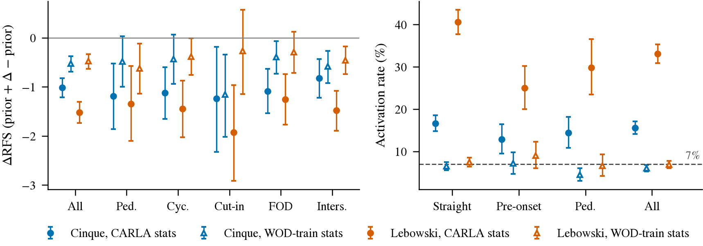
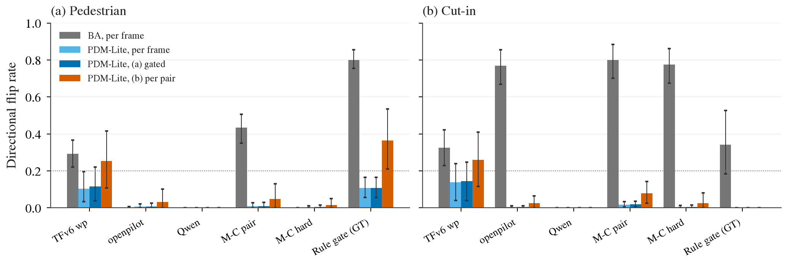

# 激发计划：冻结组件 + 配对差分，从 CARLA 走到真实开环数据（E1–E5）

状态: 待排（预登记，2026-09-26，写于任何新拟合、新挖掘之前；2026-09-26 按 openpilot 开环对比最终结果修订：E1 加 NAVSIM 列，E3 主数据集改 navtrain，新增 E6 可选）
上游: 第 25 条（continuation prior + reaction decoder）、第 42 条（M-C 在 P5 v1 上行人 43%）、第 43 条（融合诊断，2026-09-26 就地修正）、
[reactivity 计划](2026-09-25-reactivity-program.md)、[融合前诊断](2026-09-25-fusion-diagnostics.md)、[fast-perception](2026-09-26-fast-perception.md)、
[openpilot 开环对比](2026-09-25-openpilot-openloop-comparison.md)（第 37 条修正：冻结 `temporal` + 薄 head 在 WOD / nuScenes / NAVSIM 三个数据集上都超过 ego-only）
主线: 不拼接、不重训 backbone。组件冻结（ego 历史、openpilot `temporal` + lead 头、Qwen `L18_last` pooled、快检测器 embedding），
能力靠**配对差分**激发：head 只在 x⁺ / x⁻ 的差上有标签，直行帧与 null 上约束为零；对照永远带均匀 imitation 与 hard-example 重加权。评测只看 reactivity（P5 口径）与 WOD 第 22 条口径。

## 已经知道的（本计划的起点）

| 事实 | 数字 | 出处 |
|:--|:--|:--|
| 同一批 Qwen ⊕ openpilot 特征、同一批 P5 v1 行人帧，三种训练信号 | 均匀拼接 0.2–0.7%；hard-example 0%；**配对差分 43.3% [35.0, 50.7]** | Q1-v1、M-C v1 |
| 激发需要的数据量 | v0 134 个行人 reactive 帧 → 0；v1 406 个 → 43% | 第 42 条修正 |
| 各组件里能提取的 | ego：gate；openpilot：车辆纵向反应、20 m 内 lead 召回 0.9；Qwen pooled：行人存在性；openpilot vision 层无行人（AUC 0.51） | 第 40、42 条，Q4c |
| CARLA ↔ Waymo 特征域差 | Waymo 训的 head 读不出 CARLA 特征，domain AUC 1.0 | P4（第 32 条前置） |
| PDM-Lite 集 | 所有考生逐帧翻转 ≈ 0，GT 规则门 4.2%：expert 在相机可见前 0.4 s 已反应 | reactivity todo I1 结果 |
| 快通道时间窗 | ParkingCrossingPedestrian p25 0.53 s；Qwen 流 200–300 ms / 帧、SAM 3 路 558 ms 都来不及 | Q8 |
| 冻结 `temporal` 跨数据集成立 | NAVSIM navtest 全量 12 146 token：Cinque `temporal` + 薄 head PDMS 77.9 / EPDMS 77.4，ego-only 68.4 / 67.8，原生 plan 52.1 / 46.2（2 Hz 协议所致），TransFuser 文献 84.0 / 76.7；单 seed，EPDMS 两边 devkit 版本不同只能说同量级 | 开环对比最终报告，第 37 条 |
| 特征比原生 plan 头对输入协议更鲁棒 | 同一份 2 Hz 输入，原生 plan 掉到 cv 以下，`temporal` 经 head 仍比 ego 高 9.6 EPDMS | 同上 |
| NAVSIM / nuPlan 的附加条件 | 全部 agent 有 GT 轨迹（原因物体不经感知可查）；自带 PDM scorer 可对任意 proposal 打分；scorer 是可调优的代理（第 35 条），只能当标签之一 | 第 35、37 条 |

## 五项

### E1. M-C 的 head 零样本套到 WOD（迁移检查，其余各项的前置）

- **问题**：在 CARLA 配对上激发出来的 reaction head，放到真实特征上还动不动。
- **做法**：取第 42 条 v1 BA 集上过判据的 M-C 双流 head（Cinque 与 Lebowski 各一，预登记网格里选出的那一个，**不重训、不调**），
  prior 换成 WOD train 训的 `ridge_late` openpilot（第 40 条 (iii) 那一个），Δ 加在 prior 上；在 WOD 完整 val 上评。
  特征：WOD 的 `op_*` `temporal` 与 `qwenvid L18_last` 已在盘上（第 40 条与 P3e 抽取），做标准化时用 CARLA 训练行的统计量（head 自带），并列一版用 WOD 行的统计量（描述）。
- **NAVSIM 列（新增）**：同一个 head 套到 navtest，prior 换成开环对比里 navtrain 训的 `temporal` 薄 head；用官方 devkit 报 PDMS / EPDMS 的配对 Δ，并按 navhard 与「走廊内 ≤ 30 m 有行人 / cyclist 的 token」（GT 轨迹判定，不经感知）分组；直行帧激活率同样报。
- **读数**：按 cluster（Pedestrians、Cyclists、Cut_ins、FOD、Intersections、全部）报 (i) 加 Δ 后 − prior 的 RFS 配对 Δ 与 ADE 第 1–9 档 Δ（第 22 条口径，sequence bootstrap）；
  (ii) Δ 的激活率：|Δ| 超过该 head 在 P5 null 上定的 τ 的帧占比，在 straight_yaw 帧对 pre-onset / Pedestrians 帧上分别报（激活该集中在后者）。
- **判据（写死）**：
  - **转移得过去**：Pedestrians 或 Cyclists 上 RFS Δ 的 CI 整体 > 0，且 straight_yaw 帧上激活率 ≤ P5 null false-flip（约 5–7%）、全部 rater 帧 RFS Δ 的 CI 不整体 < 0。
  - **转不过去但无害**：所有 Δ 跨零、激活率在直行帧 ≤ 7%。
  - **有害**：全部 rater 帧 RFS Δ CI 整体 < 0，或直行帧激活率 > 7%。
- **预期**：转不过去但无害（P4 的域差）。若转移得过去，E3 的挖掘对可以只做标签复核；否则 E2/E3 是必需。
- **资源**：CPU，特征在盘上（WOD 与 navtrain / navtest 的 `temporal`、Qwen `L18_last` 都已抽），< 1 h；NAVSIM devkit 打分约 20 min；工程半天（head 的加载与 prior 对接）。

### E2. 真实帧的反事实编辑对（SAM 的位置：离线造对，不进回路）

- **问题**：能不能在 WOD / nuScenes 帧上批量造 x⁻，让配对差分在真实特征上训练。
- **做法**：只做「删除」不做「插入」。用 SAM 3.1（已在 `envs/sam3`）按 pedestrian / cyclist prompt 出 mask，视频一致 inpainting（先用仓库原样的 LaMa 或 ProPainter 之一，登记时定一个），
  x⁺ = 原帧，x⁻ = 抹掉该 actor 的帧；只取 actor 在走廊内、≤ 30 m、像素 ≥ 20 的帧（Q2b 的走廊定义）。**安慰剂对照**（必带）：同样大小的 patch 贴到空路面。
  标签：无 expert，三种并列，各自单独报：(a) log 自己的未来当 x⁺ 侧、x⁻ 侧标签 = CTRA 外推（继续）；(b) 规则裁判（Q6 的三条门）；(c) navtrain 上加 PDM scorer：对「继续」与「刹停」两条 proposal 各打分，分差的符号当标签（第 35 条：scorer 是可调优代理，只作第三来源，不单独定判格）。
- **数据**：WOD 与 navtrain 都做，**navtrain 为主**：它有 GT 3D 框，抹掉的 actor 是不是走廊内的原因物体、有没有抹干净、还有没有被遮挡的第二个行人，都能对着 GT 验；WOD 只能靠 SAM 自己的检出，作为第二数据集。
- **验证（造对之前先过）**：16 对目检；独立检测器（YOLO26 COCO person）在 x⁻ 上的残留检出率 ≤ 10%（2609.22582 报 8.5%）；navtrain 上再按 GT 框核对「被抹 actor 的框内无残留、其他 actor 未受影响」；安慰剂对上 Qwen 与 openpilot 特征的位移中位数当噪声地板。
- **读数**：在 E1 的 head 上，x⁺ − x⁻ 的 Δ 幅值对安慰剂对的比；用编辑对**训练**的 M-C 在 P5 v1 BA 集上的行人翻转（真实 → 仿真方向的迁移）与 WOD Pedestrians 的 RFS Δ（按 sequence 分折）。
- **判据**：编辑对上 |Δ| 中位数 ≥ 2 × 安慰剂对，且用编辑对训的 head 在 WOD Pedestrians 上 RFS Δ CI > 0 而直行帧激活率 ≤ 7%。
- **资源**：SAM 已量 188 ms / 张单路；WOD 走廊内行人帧约 160（Q2b）太少，扩到 train 全量前视 41.5 万帧里走廊内有行人 / cyclist 的帧（估 1–3%，4–12k 张）：SAM 约 0.5–1 h GPU，inpainting 约 1–3 h GPU；head 训练分钟级。约 3–5 GPU·h，工程 1–2 天。

### E3. 从 log 里挖孪生帧（新增，真实 expert、不编辑图像；主数据集 navtrain，WOD 并列）

- **问题**：navtrain（约 10 万 token，GT agent 轨迹齐全）和 WOD train（52 万帧，无 3D 框）里，有没有足够多的「ego 历史匹配、未来分叉」的帧对，能当配对差分的标签。
- **为什么主做 navtrain**：孪生对的价值在于「未来差只能由场景解释」，这句话在 navtrain 上可以直接用 GT 轨迹核对（x⁺ 侧走廊内有接近的行人 / 车辆、x⁻ 侧没有），不经 SAM；WOD 上只能靠 SAM（行人召回 0.36）判原因物体，上界受感知限制。PDM scorer 还能给每一侧的「继续 / 刹停」打分当第三标签。
- **做法**：每帧的 ego 历史向量（16 步 × 位置 / 速度 / 加速度，第 40 条 ego 特征）+ intent one-hot；在同 intent 内做最近邻（标准化后 L2，容差 τ_ego 在 null 分布上定：同一 sequence 相邻 0.25 s 的帧对之间的距离 p95），
  排除同一 sequence 与同一路段（用 sequence id 与 GPS 近邻）；未来分叉 = 5 s 未来的纵向速度差 ≥ 2 m/s 或横向偏移差 ≥ 1 m（与 P5 τ_exp 的量级对齐，登记时定死）。
  分叉的一侧当 x⁺（反应）、另一侧当 x⁻（继续）；方向由未来自己给出。**噪声对照**：ego 匹配但未来也匹配的对（孪生 null），它们的特征差分定 τ。
- **可行性统计（本项的第一交付，纯 CPU）**：两个数据集各一张：匹配对数按 τ_ego 与分叉阈值的网格；分叉对里 x⁺ 侧走廊内有原因物体的比例（navtrain 用 GT 轨迹：≤ 30 m、接近速度 < −0.5 m/s；WOD 用 Q2b 已有的前视 SAM 检测，20 237 帧，不够再补）；
  分叉对与 navhard、pre-onset、Pedestrians、Cut_ins 等分组的重叠；navtrain 上另报 PDM scorer 对两侧「继续 / 刹停」的分差分布，看它与人类未来的符号一致率。
- **判据**：任一数据集上分叉对 ≥ 1 000 且其中走廊内有原因物体的比例显著高于孪生 null 对（CI 不跨零）→ 在该数据集上开训练；两个都不过就记「log 里挖不出足够的配对」，只留 E2。navtrain 上另加一条描述：scorer 分差与人类未来符号一致率（不进判格）。
- **训练与读数（可行性过了才做）**：M-C 同一 head，训练行 = 孪生对，按 sequence / log 分折；navtest 上按有无行人分组的 PDMS / EPDMS 配对 Δ（官方 devkit）与 navhard；WOD Pedestrians / Cut_ins 的 RFS Δ、pre-onset ADE Δ；P5 v1 BA 行人翻转（真实 → 仿真）。对照：均匀 imitation、hard-example。
- **资源补充**：navtrain 的 `temporal` 与 Qwen 特征已在开环对比里抽好；GT 轨迹在 navtrain 的 log 里，走廊判定纯 CPU。
- **文献核查（写入结果之前）**：按 ego 状态匹配从 log 里挖配对做差分监督有没有先例（关键词 matched pairs / twin frames / counterfactual mining from logs / state-matched contrastive imitation）；有就引，claim 相应缩。
- **资源**：最近邻 52 万 × 100 维 CPU 小时级；SAM 若要补帧按 E2 的量估；head 分钟级。工程 1 天。

### E4. PDM-Lite 集的计分窗口（让 v1 主判定集可用）

- **问题**：PDM-Lite 在因素可见前 0.4 s 已反应，逐帧口径下所有考生 ≈ 0。
- **做法（预登记两种，主判用 (a)）**：(a) **可见门控**：reactive 帧只保留 t ≥ t_vis + L 的帧，L = 考生的感知 + 决策延迟（openpilot 0.1 s、Qwen 流 0.3 s、SAM 0.6 s，按 Q8 与 baselines 实测），并要求该帧的 Δ_expert 仍 > τ_exp；
  (b) **按对计分**：窗口内任意 reactive 帧翻对即算这对过（第 32 条已用过的口径）。两种都报，null false-flip 同样按窗口重算。
- **读数**：所有现有考生（TFv6 两通道、ridge ego、openpilot、Qwen、M-C 各 arm、Q6 规则门）在 PDM-Lite 集上按 (a)(b) 重报；与 BA 集并排。
- **判据**：(a) 下 M-C 双流行人翻转与 BA 集的差在 ±15 pp 内且 null ≤ 7% → PDM-Lite 集成为主判定集；否则继续以 BA 为主、PDM-Lite 只报 (b)。
- **资源**：CPU 分钟级（预测都存着），工程半天。

### E5. 20 Hz student：把 M-C 蒸馏到快通道（等 fast-perception 出延迟后登记细节）

- **问题**：M-C 的 Qwen 流 200–300 ms / 帧，ParkingCrossingPedestrian 一类来不及。
- **做法**：teacher = M-C 双流 head 的 Δ；student 输入 = openpilot `temporal` ⊕ 快检测器 embedding（fast-perception 里延迟 ≤ 20 ms 且 P5 行人 ≤ 20 m 召回 ≥ 0.8 的那个，候选 YOLOE-26 / EfficientSAM3；embedding = 走廊内前 k 个检测的 (类别, x, y, 尺寸, score) 经一个小 MLP，k = 8）；
  标签 = 同一批 P5 v1 配对差分（不是 teacher 输出）+ teacher 的 Δ 当辅助目标，两者各一 arm。对照：openpilot 单流配对差分（第 42 条 7–18%）。
- **读数**：P5 v1 BA 行人翻转、cut-in Δ、null false-flip、非反应帧误刹；端到端延迟（检测 + head）。
- **判据**：行人 ≥ 30% 且 CI 下端 > null、cut-in 不掉、延迟 ≤ 50 ms。
- **资源**：检测器在 P5 观测帧上跑一遍（YOLOE-26x 640 估 < 10 ms / 张，29.8k 张约 5 min）；head 分钟级。工程 1 天。**登记条件**：fast-perception 的延迟 × 召回表出来后再补检测器名与数字，之后才算预登记完成。

### E6（可选，不进主线）. NAVSIM 上那 6 分 PDMS 是不是 R 层配方

- **问题**：冻结 `temporal` + ridge 77.9 PDMS，TransFuser 84.0；差距是表征还是 head 配方。第 35 条判 R 层配方不稀缺，这里只是量一下。
- **做法**：同一份 navtrain 特征，两个 head 各一：(a) WOD 那种 K=1024 轨迹词表分类头（第 40 条 (iii) 的 `cls_late`）；(b) Hydra-MDP 式按 PDM 子指标各一个打分头、推理时加权选 proposal（权重只在 navtrain 内的 held-out 上定）。均匀 imitation 训练，与 E1–E5 的配对差分无关。
- **读数**：navtest PDMS / EPDMS，navhard 并列；报与 ridge 的配对 Δ。
- **判据**：只作描述，不改任何方向；(b) 若 ≥ 84 就在 backbone 一节写「512 维冻结特征 + 配方 head 到 TransFuser 水平」，否则写「差距不在配方」。
- **资源**：特征在盘上；(a) L-BFGS 小时级 GPU，(b) 离线在候选词表上跑 PDM scorer 一次（Hydra-MDP++ 的做法，CPU 多核小时级）+ head 分钟级。工程 1 天。排在 E1–E5 之后，卡空了再做。

## 顺序与依赖

```
E4（CPU，半天）──────────────────────────────► v1 主判定集可用，E2/E3/E5 的仿真侧读数都用它
E1（CPU，半天，WOD + NAVSIM 两列）──转移得过去──► E2/E3 只做标签复核
      └──────────────────────转不过去──────► E2 与 E3 并行（都以 navtrain 为主、WOD 并列；E3 先出可行性统计，纯 CPU）
fast-perception 延迟表 ───────► E5 登记完成 → 跑
E6（可选）──────────────────────► E1–E5 之后、卡空时
```

## 硬约束

- 组件全部冻结；head 只有配对差分、均匀 imitation、hard-example 三种训练信号，每项都三者并列。
- judge 一字不改：WOD 第 22 条口径，P5 v0 / v1 的定向翻转率 + 样本外 null false-flip；E4 新增的窗口口径先登记后使用。
- 训练 / 评估按 sequence（WOD）、log（navtrain / navtest 按官方 split）或路线（P5）分开；E2 / E3 的对不得与评估 sequence / token 同源。
- NAVSIM 的读数一律用官方 devkit 打分并注明版本；EPDMS 与文献只能写「同量级」，不写「超过」；所有 head 报 seed 数。
- 闭环仍暂停；本计划全部开环。
- 任何一步超估计 2 倍先停下报。结论：E1–E3 进 decisions.md 新条目「配对差分从 CARLA 到真实数据」；E4 补进第 42 条；E5 进第 42 条或新条目。

## 交付

1. E1：WOD 一张 cluster × {RFS Δ, ADE Δ, 激活率} 的表，NAVSIM 一张分组 × {PDMS Δ, EPDMS Δ, 激活率} 的表 + 判格。
2. E2：编辑对样例 16 组图、验证表（残留检出、安慰剂地板）、训练后的 WOD / P5 两向读数。
3. E3：navtrain 与 WOD 各一张可行性统计表（对数 × 阈值网格、原因物体比例、分组重叠；navtrain 另有 scorer 符号一致率）；过线则加训练读数；文献核查一段。
4. E4：PDM-Lite 集在两种窗口下的全考生表，与 BA 并排。
5. E5：student 的翻转 / 延迟表。
6. E6（可选）：navtest 上两种 head 对 ridge 的配对 Δ，一段结论。
小表进 `research/results/elicitation/`。

## 偏离与澄清日志

（执行时追加，时间戳早于受影响的数字。）

- 2026-09-26 00:25 CST（box 时钟，下同）[E1] 写于 E1 的任何数字之前。执行分工：本计划由 elicitation agent 负责，E1 自做，E4、E3 可行性各一个子执行代理并行（各自在本日志里记 [E4] / [E3] 条目）。E1 的操作化：
  (1) **head 是哪一个**。M-C 没有存 W；它是按路线 5 折 cross-fit 的，v1 BA 集上「过判据的 head」其实是 5 个 fold head（每个 fold 自己的 λ、自己的训练行标准化统计量）。
  做法：用 `reactivity_mc.fit_fold` 同一段代码、v1 BA 集、`op_streams_vis`、预登记 λ 网格，把 5 个 fold 的 `M-C pair`（双流）W 逐 fold 重算出来，
  先核对它在 obs 行上的预测与 `runs/reactivity/mc-carla_p5v1_ba/20260925-233126/preds_obs.npz` 一致（max |diff| 预期 0 或 fp32 噪声级，≤ 1e-4 m），
  λ 与该 run 的 `mc_fold` 事件一致；不一致就停。迁移用的 Δ = 5 个 fold head 的 Δ 取平均（每个 fold head 用它自己的 CARLA 训练行统计量做标准化、减它自己的训练行均值），
  不重新拟合、不选 λ。Cinque 与 Lebowski 各一（各配同模型的 prior），Cinque 为主。
  (2) **WOD 评测集**。登记写「WOD 完整 val」，但 Qwen `L18_last` 在 val 上只抽过 `qwenvid_p3` 的 19 663 帧（`p2p3_v1` 子集，与 P5 同一个 P3(d″) 抽取器、eager batch 2），
  完整 val（106 360）要再抽约 8.7 万帧（约 9–10 GPU·h）。所以评测集改为 `p2p3_v1` ∩ Qwen = 19 663 帧（其中 rater 帧 478、pre_onset 与 straight_yaw 按子集标记），
  与第 40 条 cross-fit 那一版的帧相同。prior = 第 40 条 (iii) 的 train 训 `A ridge_late op-<model> temporal`（`runs/drive_backbones/heads_train/20260925-110819/p3drive_heads_preds_dir0.npz`），
  openpilot `temporal` 取 `op_<model>_p3_trainval`（考试协议）。s_ego 分档的 decile 边界在完整 val 的 106 360 帧上定（与第 22 条 (iii) 一致），再限到这 19 663 帧。
  (3) **描述版标准化**（「用 WOD 行的统计量」）：两路特征各用 WOD **train** 行的均值 / 标准差（`qwenvid_train_t4` 的 137 533 个 train 行，openpilot 取同一批行；不用评测行），
  其余不变（W 不变，减的均值换成 WOD train 行在该标准化下的均值，即 0）。只描述，不进判格。
  (4) **读数**。cluster = index 的 `cluster` 列：Pedestrian、Cyclist、Cut_ins、Foreign Object Debris、Interections（原拼写）、全部。
  (i) RFS Δ = RFS(prior + Δ) − RFS(prior)，rater 帧（每 sequence 一帧，frame bootstrap 即 sequence bootstrap，`traj.boot_ci`）；ADE Δ 在 s_ego 第 1–9 档（对 log，sequence bootstrap），另报 pre_onset 第 1–9 档一行。
  (ii) **激活率**：P5 的 τ 是 null 对上 |v₂(pred(x⁺)) − v₂(pred(x_null))| 的 p95（v₂ = 2 s 速度），单帧上没有对，所以激活定义为 |v₂(prior + Δ) − v₂(prior)| ≥ τ，
  τ 取 v1 BA run 的 `flip_rates.csv` 里 `M-C pair [<model>]` 的 `tau_model`（Cinque 1.628、Lebowski 1.655 m/s，已存的数，不是新拟合）；分别报 straight_yaw、pre_onset、Pedestrian cluster、全部帧。
  判格里「直行帧」= straight_yaw 帧，7% 门槛照登记。另报 |Δ| 的 ADE 幅值（m）中位数作描述。
  (5) **NAVSIM 列的前提不成立，推迟**：登记写「navtrain / navtest 的 Qwen `L18_last` 都已抽」，实际盘上 NAVSIM 只有 openpilot `temporal`（`runs/navsim_zs/openpilot/<split>/<model>_temporal.npz`），没有任何 Qwen 特征。
  双流 head 在 navtest 上要先抽 Qwen：P3(d″) 抽取器原样，clip = NAVSIM agent 可见的 4 帧（−1.5 / −1.0 / −0.5 / 0 s，2 Hz，与 P5 / WOD 的 0.2 s 间隔不同，这是又一处输入分布差，照记），
  相机 CAM_F0 / CAM_L0 / CAM_R0 → front / front_left / front_right；navtest 12 146 token 约 1.1–1.4 GPU·h，要等 GPU 1 / 2。NAVSIM 列的其余口径现在定死：
  prior = navtrain 训的 `ridge_late <model> temporal`（`runs/navsim_zs/heads/20260925-232810`，与 P5 / M-C 一样是连续回归 prior，Δ 可以直接相加）；`cls_late` + Δ 只描述。
  Δ 在 0.25 s 网格上，取 0.5 … 4.0 s 的 8 个点（索引 1, 3, …, 15）加到 prior 的 (x, y) 上，heading 保持 prior 的不变；官方 devkit（v1.1 出 PDMS、main @ 0a380a9 出 EPDMS，`OPENBLAS_CORETYPE=Haswell`）打分；
  分组：navhard two-stage（EPDMS）、「走廊内 ≤ 30 m 有行人 / cyclist」的 navtest token（GT agent：logged 未来 4 s 路径 ±1.5 m、前方 ≤ 30 m，与 E3 的原因物体定义同一函数）、其余 token；激活率同 (4)(ii)。
  (6) 判格里「转移得过去」的直行帧门槛写的是「≤ P5 null false-flip（约 5–7%）」：取该 head 自己在 v1 BA 上的样本外 null false-flip（Cinque 5.1%、Lebowski 5.0%）；「无害 / 有害」的 7% 照登记。
  两个模型分别判，主判 Cinque。fold head 的重算在 CPU 上做（GPU 都有人），与已存预测的差按 fp32 噪声级核对，λ 必须逐 fold 相同。
  (7) 2026-09-26 00:31 [E1]（WOD 的任何数字出来之前）fold head 在 CPU 上重算只复现到 1.3 cm（fold 0 Cinque，λ = 0.1 在网格下沿，3072 维的解病态，CPU 与 GPU 的 fp32 累加顺序差被放大），
  没过 (1) 的 ≤ 1e-3 m 核对。病态方向正是域外特征可能投影上去的方向，所以不放宽门槛，改在 GPU 上重算（原 run 是 GPU fit，同型号卡），占 GPU 1 几分钟、< 5 GB，gpu-plan 记一行；其余读数仍在 CPU。
  (8) 2026-09-26 00:37 [E1]（NAVSIM 的任何数字之前）NAVSIM 列补充口径：navhard two-stage 也要 Qwen 特征（5 912 token，同一抽取器，接在 navtest 后面，GPU 1，约 1 h）；
  激活率里 prior 只有 0.5 s 间隔的位姿，v₂ 所需的 1.75 s 点取 1.5 s 与 2.0 s 的线性插值；NAVSIM 的「直行帧」按 `waymo.subsets` 的 straight_yaw 同一套阈值在 2 Hz 位姿上算
  （最近 0.5 s 的 yaw rate < 1°/s、最近 1 s 位移 ≥ 1 m、logged 未来 3 s 弦方位 ≤ 5° 且弦长 ≥ 3 m）；行人 / cyclist 组 = E3 的 `corridor_objects`（logged 路径延长到 30 m、±1.5 m）里有 pedestrian 或 bicycle 类 GT agent，不要求接近速度。
  打分名 `e1_<prior>_<model>_plus_mc`，配对 Δ 对 `heads_<prior>_<model>_temporal`（G3 的已存打分），token bootstrap。
  登记的三格判据都是 WOD 上的量（Pedestrians / Cyclists 的 RFS Δ、straight_yaw 激活率、全部 rater 帧 RFS Δ），所以 E1 的判格由 WOD 列下；NAVSIM 列按登记报表，不改判格。

- 2026-09-26 00:30 CST（box 时钟）**[E4] 两种窗口的操作化**（写于任何 E4 数字之前；此前只见过 v1 两套集合的官方逐帧数，即第 42 条已记的那些）。
  输入全部是已存的逐帧打分，不重拟合：PDM-Lite 集 `runs/p5_pairs/exam-d0-carla_p5v1_pdm/20260925-230423`（TFv6 三通道、`ridge ego`、Qwen 与 openpilot 的 `ridge_late`）、
  `runs/reactivity/mc-carla_p5v1_pdm/20260925-230424`（M-C 全部 arm 与 prior）、`runs/fusion_diag/q6gt_carla_p5v1_pdm/20260925-233007`（Q6 GT 规则门）；BA 集用对应的三个 run 并排。
  Q6-SAM 在 v1 上按融合诊断 23:36 的决定没有跑，SAM 状态版考生缺，记为缺项，不补。Q1-v1 的拼接 arm 不在本项考生名单里。
  (1) **可见门控 (a)**：t_vis 取 `pairs.csv` 该对的 `t_vis`（20 Hz tick），观测帧 k 只保留 k ≥ t_vis + L / 0.05；reactive 的定义不变（|Δ_expert| > τ_exp，τ_exp 用官方 run 的值），
  所以「该帧的 Δ_expert 仍 > τ_exp」由保留下来的 reactive 帧自动满足。L 按考生：openpilot 流（`ridge_late op-*`、M-C `prior`、M-C `pair op`）0.1 s（Q8 的 2.3 ms 加一拍相机 tick，按登记的 0.1 s）；
  Qwen 流（`ridge_late L18_*`、M-C `pair qwen`）0.3 s；M-C 双流 arm（`pair`、`pair (mu=0)`、`hard`、`uniform`）取两路较慢者 0.3 s；
  TFv6 三通道 0.1 s（三 seed ensemble 前向在 3090 上约 51 ms、agent 每 tick 约 110 ms，见 todos/remote_carla.md，向上取到 0.1 s）；`ridge ego` 0（只读自车状态，无感知）；
  Q6 GT 规则门 0（特权 GT 状态，无感知延迟，是上界），另加一行只描述的「GT 规则门 + L = 0.6 s」当 SAM 状态版在 SAM 延迟下的上界。
  观测帧间隔 0.2 s，所以 L = 0.1 只去掉 k = t_vis 那一帧，0.3 去掉前两帧，0.6 去掉前三帧。
  τ_model 不重算（沿用官方 run 在全部 null 帧上的值，judge 不改）；null false-flip 按同一窗口重算：null 帧用该 base 的 seed-0 对的 `t_vis`（seed-0 对没有 t_vis 的 fallback null 窗口用 `t_trig`，与 `p5_pairs` 取 null 帧的规则一致）按同一 L 门控，
  样本外口径与官方相同（null 按 base 路线对半，τ 在一半上定、在另一半的门控帧上算，两个方向平均）。翻转率、非反应帧误翻、CI（base 路线 bootstrap 2000 次）其余一字不改。
  (2) **按对计分 (b)**：窗口 = 该对的整个观测窗口（t_vis ≤ k < t_div − 1，即官方的观测帧，不加 L 门控，与第 32 条的按对口径相同）；一对（base_id, seed）在某个 scope 里有 ≥ 1 个 reactive 帧才进分母，
  其中任意一个 reactive 帧定向翻对（同号且 |Δ_model| ≥ τ_model）即算过；CI 按 base 路线 bootstrap。对应的 null 口径：一个 null case（每个 base 一个）只要窗口内任意一帧 |Δ_model| ≥ τ_model 就算误翻，
  报样本内与样本外（同 (1) 的对半 τ）两个数；这是与「任意一帧翻对就算过」对称的地板，预期会远高于逐帧的 5%，判据 (a) 不用它。
  (3) **scope**：官方的合并 family（pooled）、行人（4 个行人 family 的 reactive 帧，同 M-C criteria）、cut-in（3 个 cut-in family）。
  (4) **判据**按登记：(a) 下 M-C 双流（`M-C pair [cinque]`，Lebowski 复现）行人翻转与 BA 集官方逐帧的 43.3%（Lebowski 41.6%）差在 ±15 pp 内，且 (a) 下样本外 null false-flip ≤ 7% → PDM-Lite 集成为主判定集；
  否则 BA 仍为主，PDM-Lite 只报 (b)。以 Cinque 判，Lebowski 不一致时照实写。BA 集上同样算 (a)(b) 作并排描述，不进判据。代码 `jevdrive/elicit_e4.py`，run `runs/elicitation/e4/<time>`。

- 2026-09-26 00:28 CST（box 时钟）**[E3] 可行性统计的操作化**（写于 E3 的任何挖掘、任何数字之前；只看过数据格式）。不训练，纯 CPU（≤ 24 核），代码 `jevdrive/elicit_e3.py`，run `runs/elicitation/e3-feas/<time>`。
  (1) **ego 历史向量**。WOD：第 40 条的 ego 特征原样，`past.npy` 16 步 × (x, y, vx, vy, ax, ay)（0.25 s 间隔、4 s，t0 自车系）= 96 维。navtrain：NAVSIM agent 合法可见的全部 ego 量，
  4 个历史位姿 (x, y, yaw，−1.5 … 0 s、2 Hz) + 4 个速度 + 4 个加速度 = 28 维（`navsim_heads.ego_features` 去掉 command 那 4 维；t0 位姿恒为 0 的列标准差置 1）。
  「16 步」在 NAVSIM 上不存在，只能用这 4 步。两边都按本数据集挖掘池的列均值 / 标准差标准化，距离 = 标准化后的 L2。
  (2) **分层**：同 intent / command 内找近邻（WOD `intent` 0–3；navtrain 取 t0 的 driving command one-hot 的 argmax）。
  (3) **挖掘池与近邻**：WOD 主读数用 train（415 663 帧）**抽稀到 2 Hz**（`frame % 5 == 0`，与 navtrain 的 2 Hz 对齐，也去掉 10 Hz 下几乎重复的相邻帧），且要求 `has_future`；
  全 10 Hz 池只作描述。每帧取**一个**最近邻（同层、不同 sequence / log、且不在同一路段），距离 ≤ τ_ego 才成对；(A, B) 与 (B, A) 去重。
  「同一路段」：navtrain 用 log 里的 `ego2global` 平移，两帧同 `map_location` 且全局距离 < 30 m 即排除；WOD-E2E 的 index 与 past 都在 t0 自车系、没有全局位姿，**只能排除同一 sequence**（照记，不补）。
  另报「不排除同一路段」的 navtrain 对数作描述。
  (4) **τ_ego**：同一 sequence / log 内时间上最近的两帧之间的 ego 向量距离的 p95。WOD：同一 sequence 相隔 3 帧（0.3 s，10 Hz 下最接近且不短于 0.25 s 的间隔）；
  navtrain：同一 log 内相邻 2 Hz token（时间戳差 0.5 s ± 0.05 s，nuPlan / OpenScene 能给的最小间隔）。网格 τ ∈ {0.5, 1, 2} × τ_ego，主格 1 ×。
  (5) **未来与分叉**。WOD `future.npy` 20 点 × 0.25 s = 5 s；navtrain `navtrain_future.npz` 8 点 × 0.5 s = **4 s**（NAVSIM 只有 4 s，登记的「5 s」在 navtrain 上改为 4 s）。
  终端纵向速度 v_T = 最后 1 s 的平均速度（|p_T − p_{T−1 s}| / 1 s）；横向偏移 y_T = 终点在各自 t0 自车系里的 y。分叉 = |Δv_T| ≥ θ_v 或 |Δy_T| ≥ θ_y；网格 (θ_v, θ_y) ∈ {(1, 0.5), **(2, 1)**, (3, 2)}（m/s, m），主格 (2, 1)。
  **孪生 null** = 同样 ego 匹配、但 |Δv_T| ≤ 0.5 m/s 且 |Δy_T| ≤ 0.3 m 的对。
  (6) **哪一侧是 x⁺**：两侧各算未来对自己的匀速直行外推（t0 速度沿 t0 朝向）的 ADE，偏离 continuation 更大的一侧是 x⁺（反应），另一侧 x⁻（继续）；null 对用同一规则挑「x⁺」侧，保证比较对称。
  (7) **原因物体（navtrain，GT）**：x⁺ 那一帧 t0 的 GT agent（log 的 `anns`：框、名字、`gt_velocity_3d`，自车系；先核对它是绝对速度——自车在动时 traffic_cone 的速度中位数 < 0.3 m/s，不是就停）。
  走廊 = 原点 + 该帧自己的 8 个 logged 未来位姿连成的折线，沿最后朝向延长到弧长 30 m（Q2b 事后敏感性那一版 `fusion_q2b.extend`，这里登记为主读数：刹车一侧的 4 s 路径到不了让它刹车的物体）；
  物体在走廊内 = 框 footprint（中心 + 4 角）任一点到折线横距 ≤ 1.5 m、投影弧长 0 < s ≤ 30 m；原因物体 = 走廊内且接近速度（位置单位向量 ·(v_obj − v_ego)，v_ego 取 `ego_dynamic_state` 的 vx, vy）< −0.5 m/s，类别不限，另按 vehicle / pedestrian / bicycle / 其他分列。
  同一个函数（`elicit_e3.corridor_objects`）给 E1 的 NAVSIM 分组用。另报两条描述：走廊内有物体（不要求接近）的比例；x⁻ 侧同一定义的比例（对内配对差）。
  (8) **原因物体（WOD，SAM）**：Q2b 的 SAM 3.1 前视检测（score > 0.5，按该 sequence 的标定平地抬升）只覆盖 val 的 20 237 帧（`p2p3_v1` 子集 + rater 帧），**train 上没有检测**。
  所以 WOD 的原因物体比例在这 20 237 帧**内部**另做一次同口径挖掘（池 = 这 20 237 帧，不再抽稀，其余规则同 (1)–(6)）上算：走廊同 (7)（logged 5 s 路径延长到 30 m、±1.5 m、前方 ≤ 30 m），
  单帧检测没有速度，**不要求接近速度**，类别 = vehicle / pedestrian / cyclist / cone | debris / emergency vehicle 任一。这些 val 对只用于可行性统计，不会进训练（评测 sequence 不得同源）。
  WOD 判据里的「分叉对 ≥ 1 000」用 train 池的对数，「原因物体比例高于 null」用 val 子集的对；两者不同源，照记。
  (9) **判据的检验**：主格上，分叉对的 x⁺ 原因物体比例 − 孪生 null 对的 x⁺ 原因物体比例，95% CI 用按 log / sequence 的 cluster bootstrap（以 x⁺ 帧的 log / sequence 为单位，2000 次）；CI 下端 > 0 且分叉对 ≥ 1 000 → 该数据集「过」。
  (10) **分组重叠**（描述）：navtrain——x⁺ 侧走廊内有行人 / bicycle、t0 静止（v₀ < 0.5 m/s）、command 左 / 右 / 直；navhard 由 navtest 系场景构造，与 navtrain token 按 token 核对重叠（预期为 0，照报）。
  WOD train——pre_onset、straight_yaw、turn_yaw（`waymo.subsets`）、静止起步；cluster 只在 val 上有标，所以 Pedestrian / Cyclist / Cut_ins 等的重叠只在 (8) 的 val 子集对上报。
  (11) **PDM scorer 符号一致率**（描述，不进判格）：navtrain 没有 metric cache，全量缓存超过 1 h CPU，所以**抽样**：主格分叉对里两侧 t0 速度都 ≥ 2 m/s 的对，seed 0 随机取 300 对（600 个 token），
  只为这些 token 建 v1.1 metric cache（`scripts/navsim_zs_score.sh cache v1 navtrain` 加 token 过滤）。每个 token 两条 proposal，几何都沿该帧 logged 未来路径：
  「继续」= 以 t0 速度匀速，「刹停」= 从 t0 速度以 3 m/s² 减速到停；官方 PDMS（v1.1）各打一次，分差 = PDMS(刹停) − PDMS(继续)。
  人类符号：logged 4 s 弧长比匀速弧长短 2 m 以上记「人类减速」，长 2 m 以上记「人类加速 / 继续」，其余不判。报 (a) 逐 token：|分差| ≥ 0.05 且人类可判的 token 上，分差符号与人类符号一致的比例；
  (b) 逐对：sign(分差_x⁺ − 分差_x⁻) 与 sign(人类减速量_x⁺ − 人类减速量_x⁻) 一致的比例。token bootstrap CI。缓存或打分若实测超过 1 h 就停在已完成的子集上，照记。
  (12) **特征可得性**：统计主格分叉对里两侧都有现成特征的对数——navtrain / navtest 只有 openpilot `temporal`（无 Qwen）；WOD train 的 Qwen `L18_last` 只有 thin=4 的 137 533 个 train 行（`qwenvid_train_t4`），openpilot `temporal` 覆盖全部 trainval。
  并按 0.33–0.40 s / 帧 / 卡估双流训练所需的 Qwen 抽取量（GPU·h）。
- 2026-09-26 00:33 CST [E2] 写于任何编辑对生成之前，也不读 E1 的任何数字（造对与 E1 无关；E2 的训练与读数开不开仍按 E1 判格）。卡：GPU 1（main 00:30 分配）。
  (1) **inpainting**：LaMa（big-lama，官方权重的 TorchScript 版，`simple-lama-inpainting` v0.1.0 release 的 `big-lama.pt`，原样调用），**逐帧**，不用 ProPainter。
  理由：NAVSIM 只有 2 Hz 帧，相邻两帧间 ego 位移常达数米、行人位移 0.5–1 m，ProPainter 的光流传播在这种间隔上不成立（它为 24–30 fps 视频设计）；WOD 的 clip 是 0.2 s 间隔，同样逐帧 LaMa，两个数据集一个配方。
  逐帧的代价是 4 帧之间的填充纹理不严格一致，这正是安慰剂对照要量的东西。为了分辨率，LaMa 在 mask 外接框放大 2.5 倍（至少 384 px，边长补到 8 的倍数）的裁块上运行，输出只贴回（膨胀后的）mask 内，mask 外逐像素不变。
  (2) **mask**：SAM 3.1（`envs/sam3`，`sam_detect.Detector` 原样的 exact 路径），prompt 只用 pedestrian、cyclist，保留 score ≥ 0.5（Q4 的分析阈值）。
  被抹 actor 的身份由 GT 决定（navtrain）：把它的 3D 框投到每张图，取与投影框 IoU 最大且 ≥ 0.3 的 SAM mask（cyclist 取 pedestrian ∪ cyclist 里与框重叠 ≥ 0.3 的全部 mask 的并，人和车一起抹）；
  mask 膨胀 max(7 px, 框高 × 8%)。SAM 在某张图上没配上时，退回投影 3D 框的凸包（膨胀同上），逐图记来源（sam / box），报比例。
  (3) **候选（navtrain，主）**：navtrain 官方 token（103 288），t0 帧 GT 里 `pedestrian` 或 `bicycle`，中心在 ego 前方（x > 0）、距离 ≤ 30 m、到 logged 未来 4 s 路径折线（原点 + 8 个位姿，
  折线两端外 1.5 m 也算，即 Q2b 的走廊定义）≤ 1.5 m，且 CAM_F0 上投影框高 ≥ 20 px。每个 token 只抹一个 actor（离 ego 最近的那个）；同一 actor 在同一 log 里只取一个 token（最早的），避免同一事件重复成几十个对。
  (4) **编辑覆盖的帧**：特征读到的每一张图都要编辑——Qwen P3(d″) 的 clip 用前视三路 × 4 帧，NAVSIM 上对应 CAM_F0 / CAM_L0 / CAM_R0 × NAVSIM agent 可见的 4 帧（−1.5 / −1.0 / −0.5 / 0 s，2 Hz）；
  openpilot 读 CAM_F0 的同 4 帧。所以每对最多 12 张图：该 actor（按 track token 在每一帧的 GT 里找）投影可见的图都抹，不可见的图原样。x⁺ = 原图，x⁻ = 抹掉后的图。
  (5) **安慰剂**：同一 token、同样的 mask 形状，平移到「空路面」上再走同一条 inpainting 管线（没有物体被删，只量管线本身的特征位移）。
  空路面 = ego logged 未来路径上一个固定的世界点（t0 帧里距离与被抹 actor 最接近、且在 5–30 m 之间的路径点），在每一帧里把 mask 的底边中点平移到该点的投影上；
  平移后的 mask 与任何 GT agent 的投影框重叠 > 0 的候选点跳过，取下一个；找不到就记为无安慰剂。
  (6) **验证门（批量之前，64 个 navtrain 候选）**：(a) 16 对目检（我看图：x⁺ / x⁻ / 安慰剂并排）；(b) 残留检出：YOLO26x-seg（COCO，`envs/ultralytics`，conf 0.25 的发布默认）在 x⁻ 上被抹 actor 投影框内仍有 person 检出（IoU ≥ 0.3）的比例，
  分母 = x⁺ 上同一框内 YOLO 有 person 检出的图，门槛 ≤ 10%（2609.22582 报 8.5%）；(c) navtrain GT 核对：其他 GT 行人 / 车辆的投影框在 x⁻ 上 YOLO 仍检出的比例（相对 x⁺）≥ 95%，被 mask 覆盖 > 20% 的其他 actor 单独计数报出；
  (d) 安慰剂对上 Qwen `L18_last` 与 openpilot `temporal` 的位移地板：要等特征抽取（NAVSIM 上目前没有 Qwen 特征），届时再量，不是批量前的门。(a)–(c) 任一不过就停下报。
  (7) **WOD（第二数据集）**：候选 = Q2b 的前视 SAM 检测（val 的 20 237 帧，pedestrian / cyclist，score > 0.5，走廊同 (3) 但用 5 s 路径、≤ 30 m）；train 上没有检测，太少时在 train 前视帧上补跑 SAM（量按 E2 登记的估计）。
  WOD 没有 3D 框，actor 身份由 t0 的 SAM mask 定，历史帧里按「同 prompt、框中心最近、IoU ≥ 0.2」逐帧往回关联；(c) 的 GT 核对在 WOD 上不适用。WOD 的 clip 是前视三路 × 4 帧、0.2 s 间隔。WOD 排在 navtrain 批量之后。
  (8) 产物：`$DATA_DIR/processed/elicit_e2/<dataset>/`，按 chunk 锁文件认领、可续跑；每对存 x⁻ 与安慰剂的编辑图（JPEG q95）、mask（RLE）、元数据（token、actor、每图 mask 来源）。代码 `jevdrive/elicit_e2.py`。
- 2026-09-26 00:34 CST [E6] 写于 E6 的任何拟合、任何打分之前（main 00:3x 让卡空时做 E6；只描述，不改方向）。卡：GPU 2（CTL-P7 结束后；这一项的 GPU 用量只有分钟级），CPU ≤ 16 核。代码 `jevdrive/elicit_e6.py`，run `runs/elicitation/e6/<time>`。
  (0) **澄清**：E6 正文写「冻结 `temporal` + ridge 77.9 PDMS」，这个数是 `cls_late`（Cinque）的；`ridge_late` 是 73.5（开环对比 G3、standing 文档第 3 节）。所以 (a)（K = 1024 词表分类头 `cls_late`）已经就是 G3 的那一行：
  **(a) 不重拟合，直接重报 G3**（`runs/navsim_zs/heads/20260925-232810`，同一批官方打分）。比较照登记写成「(a)、(b) 各对同模型 `ridge_late` 的配对 Δ」。Cinque 为主，Lebowski 若时间允许作复现。
  (1) **(b) 的候选集 = (a) 的词表**：G2 / G3 同一个 K = 1024 k-means 词表（`navsim_heads.vocabulary`，seed 0，重算；核对 G3 的 `cls_late` navtest 输出的每一条都是重算词表里的某个 anchor，差 ≤ 1e-4 m，不过就停）。
  不用 Hydra-MDP 的 8192：候选集相同，(b) 对 (a) 的差只来自「怎么选」，而且逐 anchor 打分的成本与 K 成正比。
  (2) **逐 anchor 的子分目标**：v1.1 devkit 的 `PDMSimulator` + `PDMScorer` 原样（`default_scoring_parameters`），metric cache 由 v1.1 devkit 的 metric caching 原样构建（navtrain 子集，见 (3)）。
  每个 token 一次调用打 [PDM-Closed] + 1024 个 anchor；由 scorer 的逐 proposal 数组算每个 anchor 的**官方两两口径**子分：NC、DAC、DDC（乘性）、TTC、C（加权）照取，
  EP 只对 PDM-Closed 归一化（raw_k·mult_k / max(raw_pdm·mult_pdm, raw_k·mult_k)，该最大值 ≤ 5 m 时按 devkit 取 1 或 0），使每个 anchor 的 PDMS 与 `pdm_score()` 单独打这条轨迹完全相同。
  批量前核对：5 个 token × 20 个 anchor，逐项与 `pdm_score()` 比，必须相等（≤ 1e-9）。EPDMS 的额外子项不训练，(b) 的 EPDMS 只作为同一条输出轨迹的 v2 打分报出。
  (3) **navtrain 子集**：profiling（v1 navtest 缓存上 3 个 token，1025 条 proposal）：读缓存 0.05 s、建轨迹 1.6 s、仿真 1.2 s、打分 3.0 s，约 6 core·s / token；
  navtrain 全部 10.3 万 token 要约 170 core·h（16 核约 11 h）另加缓存，对一个可选项太贵。登记 **N = 20 000 个 token**：从 G2 / G3 的训练行（navtrain stage-one、未来完整）里均匀抽（seed 0），
  估计打分约 2.1 h + 缓存（先在 200 个 token 上实测缓存速度再定，超过估计 2 倍就停下报）。只有子分 head 的训练行被抽样；模仿项（`cls_late` 的 logits）照旧用全部 navtrain。
  (4) **head**：每个子分 m ∈ {NC, DAC, DDC, TTC, EP, C} 一个线性层，输入 = 标准化的 ego 32 维 ⊕ 标准化的 `temporal` 512 维（统计量取全部 navtrain 训练行，同 G3），输出 1024 个 logit，
  对该 anchor 的子分做 BCE（NC 的 0.5、DDC 的 0.5、EP / TTC / C 的连续值都当软标签），L-BFGS 全批量；λ ∈ {1e-5, 1e-4, 1e-3, 1e-2}（按样本平均的 BCE 上 λ/2 |W|²），在子集的留出 log（20% 的 log，seed 1）上按 BCE 选，再在全部 20 000 个上重拟合。
  (5) **推理聚合**（Hydra-MDP 的对数分加权）：s_k = w_im·log softmax(`cls_late` logits)_k + w_mul·Σ_{NC,DAC,DDC} log σ(ŝ_{k,m}) + w_TTC·log σ(ŝ_TTC) + w_EP·log σ(ŝ_EP) + w_C·log σ(ŝ_C)，取 argmax。
  权重网格 w_im ∈ {0, 0.1, 0.5, 1}、w_mul ∈ {1, 2, 5, 10}、w_TTC、w_EP、w_C ∈ {0, 0.5, 1, 2, 5}（2000 组），只在留出 log 上选：指标 = 选中 anchor 在 (2) 的逐 anchor 表上的平均 PDMS。
  留出 log 上的模仿 logits 必须样本外：`cls ego` 与 `cls_late` 在去掉留出 log 的 navtrain 上按 G3 的 λ 重拟合一次，只用于调权重；最终推理的模仿 logits 用全部 navtrain、G3 的 λ 重拟合（核对其 argmax 与 G3 的 navtest 输出一致率 ≥ 99%，否则停）。
  另报两条描述：留出 log 上词表的 oracle PDMS（每个 token 取最好的 anchor）和只用模仿项（(a)）的留出 PDMS。
  (6) **打分与读数**：navtest 用 `scripts/navsim_zs_score.sh`（v1.1 出 PDMS、main @ 0a380a9 出 EPDMS，`OPENBLAS_CORETYPE=Haswell`），navhard two-stage 出 EPDMS；
  配对 Δ（逐 token，10 000 次 token bootstrap，同 `openloop_standing.navsim`）：(b) − `ridge_late`、(a) − `ridge_late`、(b) − (a)。seed 各 1 个（k-means seed 0、子集 seed 0、留出 seed 1）。
  判据照登记：(b) PDMS ≥ 84 → 写「512 维冻结特征 + 配方 head 到 TransFuser 水平」；否则写「差距不在配方」。
- 2026-09-26 00:37 CST [E6] 写于任何逐 anchor 打分、任何 head 拟合之前。(1) 的核对没过：重算的 K = 1024 词表与 G3 的不同（G3 `cls_late` navtest 输出到最近 anchor 的差最大 0.70 m）。
  原因是 `traj.kmeans` 在 GPU 上不可复现：`index_add_` 用浮点 atomic 累加，同一数据、同一 seed 连跑两次，inertia 相同（0.141 m²）而个别中心差到 1.8 m；G3 的输出里只能找回 1014 个不同的 anchor。
  所以不能「复用 G3 的候选集」。改为：k-means 在 CPU 上跑一次（seed 0，确定性），词表存盘，之后一切（ids、子分表、head）都读这个文件；
  **(a′)** = 同一配方（`cls ego` → `cls_late`，G3 的 λ 不重选）在新词表上重拟合，作为 (b) 的模仿项和 (b) 的直接对照（候选集相同）；G3 的 (a) 行照报，(a′) 对 (a) 的差就是「词表随机性」的量级（等于一个免费的 seed 读数）。
  原登记里「argmax 与 G3 一致率 ≥ 99%」的核对作废，改报 (a′) 输出与 G3 输出 (x, y) 差 < 0.5 m 的 token 比例（描述）。(a′) 另在 navtest / navhard 上用官方 devkit 打分。
  另外澄清 (2)/(4)：v1.1 的 `driving_direction_weight` 是 0，DDC 不进 PDMS，所以子分 head 是 NC、DAC、EP、TTC、C 五个（登记里的 DDC 去掉），w_mul 只乘 NC 与 DAC。
- 2026-09-26 00:36 CST **[E3] 事后描述（看过 navtrain 登记口径的数字之后写，不改判格）**：登记口径下 navtrain 分叉对的 x⁺ 原因物体比例**低于**孪生 null（null 以跟车为主，前车在走廊内、缓慢接近），
  而分叉对六成是纯横向（|Δy_T| ≥ 1 m、|Δv_T| < 2 m/s，路形 / 路线）。为了看「刹 vs 继续」这一类是否有可用的子集，加一个只描述的读数：同一主格（1 × τ_ego）里两侧 t0 速度都 ≥ 2 m/s、|Δv_T| ≥ 2 m/s 且 |Δy_T| < 1 m 的纵向对，
  比较终端速度较低的一侧（刹）与较高一侧（继续）的原因物体比例（对内配对差），以及刹的一侧对同样速度条件下孪生 null 的比例；按 log cluster bootstrap。代码 `elicit_e3.posthoc`。
- 2026-09-26 00:38 CST [E2] 写于看到候选数之后、任何编辑对或特征数字之前。(3) 的走廊按登记的 Q2b 口径（logged 4 s 路径折线 ±1.5 m，不延长）在 navtrain 上只有 198 个 token / 113 个 actor
  （px 过滤之前），原因与 Q2b 事后日志写的相同：ego 为行人减速或停下时，它 4 s 的路径只有几米，够不到让它停下的那个人。改用 Q2b 的延长版（`fusion_q2b.extend`：路径沿最后朝向延长到离 ego 30 m），
  即 E3 偏离 (7) 已经用的走廊：3 565 个 token / 2 818 个 actor（px 过滤之前）。其余 (1)–(8) 不变，仍每个 (log, actor) 只取最早的一个 token。bicycle 类含无人骑的自行车（nuPlan 类别定义），照收，按类别分开报。
- 2026-09-26 00:49 CST [E2] 写于验证集（64 个候选）的 16 对目检之后、批量与任何特征数字之前；残留检出第一次读数 9.7%（176 个 x⁺ 上有 YOLO person 的 actor 图），边缘过门。目检发现登记口径的两个毛病，改：
  (a) **只抹最近的一个人不够**：成群过街时 x⁻ 的走廊里还站着别的行人（16 对里约 5 对），x⁻ 就不是「走廊里没有原因物体」。改为抹掉 t0 走廊内（(3) 的延长走廊、≤ 30 m）**全部** GT pedestrian / bicycle，
  每个 actor 在每张图里各自配 SAM mask，取并；最近的那个仍是「主 actor」（距离、px 门槛、去重、安慰剂锚点都按它）。
  (b) **被遮挡的 actor 不能退回画框**：登记 (2) 的「SAM 没配上就用投影 3D 框凸包」在 16 对里有 6 对落在被前车完全挡住的行人上，抹掉的是前车的一块。改为只用 SAM mask：
  某张图里一个 actor 都没配上就不编辑这张图（记数）；t0 CAM_F0 上主 actor 必须被 SAM 配上，否则这一对不要（`valid`）。
  配对规则放宽为「IoU ≥ 0.3，或 SAM 框 ≥ 60% 落在投影框内且高度 ≥ 投影框的 40%」（行人 cuboid 的投影框比人影宽，第一次读数里 IoU 中位只有 0.11）。
  残留检出门与其他 GT 核对照登记，但分母改成「有效对里被编辑的图上的每个 actor」；验证集重跑后按新口径判门。
- 2026-09-26 00:57 CST [E2] 训练与读数的登记（E1 已判「有害」，按预登记 E2 必做；写于任何编辑对特征、任何拟合之前）。
  (1) **特征**：navtrain 编辑对的 x⁺ / x⁻ / 安慰剂三份 clip 各抽一次——Qwen `L18_last` 用 `navsim_qwen`（P3(d″) 原样，NAVSIM 2 Hz clip，CAM_F0 / L0 / R0 × 4 帧，未编辑的图用原图），
  openpilot `temporal`（Cinque 主、Lebowski 复现）用 `scripts/navsim_zs_openpilot.py feat` 原样（CAM_F0 × 4 帧）。x⁺ 也重抽（不复用 navtrain 已存的 `temporal`），让三份出自同一次运行。只用 `valid` 对。
  (2) **输出格式**：head 输出 WOD / P5 的 20 × 2（0.25 s 网格，5 s）。navtrain 的标签只有 0.5 … 4.0 s 的 8 个位姿：(x, y) 连同原点线性插到 0.25 … 4.0 s 的 16 个点，只在这 16 个点上训练（32 维输出）；
  用到 WOD / P5 时第 17–20 点按第 15→16 点的 Δ 速度线性外推。
  (3) **prior 与配对目标**：prior = navtrain 上拟合的 `ridge ego` + `ridge_late <model> temporal`（`navsim_heads` 同一配方重拟合一次，全 navtrain 的 W，插到同一 16 点网格）；
  两侧 ego 相同，p⁺ − p⁻ 只来自 `temporal` 之差。配对差分 loss 与 M-C 相同：Σ‖W(z⁺ − z⁻) − [(y⁺ − y⁻) − (p⁺ − p⁻)]‖² + λ‖W‖²，z = 两路按训练行（全部有效对的 x⁺ 与 x⁻）逐列标准化再乘 1/√d。
  M-C 的 μ 项（role = train 帧上 Δ 为零）在这里没有对应的「直行帧」特征（navtrain 没有 Qwen 特征），改用安慰剂对当 null 对（目标 0，与 M-C 里 null 对的作用相同），μ = 0；这与 M-C 的主 arm 不同，照记。
  (4) **标签（三个来源各一 arm，分开报）**：(a) y⁺ = logged 未来，y⁻ = CTRA 外推（t0 速度、t0 纵向加速度、最后两帧 0.5 s 的 yaw rate，速度截到 ≥ 0）；
  (b) 规则裁判：Q6 的三条门在 GT 状态上各判一次 x⁺（场景原样）与 x⁻（被抹的 actor 从 GT 里去掉）——门只在 x⁺ 触发时 y⁺ − y⁻ = 沿同一条 CTRA 路径以 3 m/s² 减速到停 − 匀速继续（与 E3 (11) 的「刹停 / 继续」同一对 proposal），否则 0；
  门的阈值照 Q6 登记（TTC < 3 s；侵入 3 s 路径 ±1.2 m；行人朝走廊速度分量 > 0.5 m/s 且距走廊 < 4 m、距离 < 30 m），走廊 = logged 路径延长版；
  (c) PDM scorer：x⁺ 场景上对同一对「继续 / 刹停」proposal 用官方 v1.1 PDMS 各打一次（metric cache 只建这些 token，E3 的脚本口径），PDMS(刹停) > PDMS(继续) 时 y⁺ − y⁻ = 刹停 − 继续，否则 0；
  scorer 不能在 x⁻ 场景（去掉 actor）上打分，x⁻ 侧一律当「继续」。(c) 只作第三来源（第 35 条），不单独定判格；cache 超过 1 h CPU 就停在已完成的子集上照记。**判格用 (a)**，(b)(c) 描述。
  (5) **对照**：同一 z、同一 prior、同一批帧：均匀 imitation（x⁺ 帧目标 y⁺ − p⁺、x⁻ 帧目标 y⁻ − p⁻ 的逐帧 ridge）与 hard-example 重加权（权重 = 该 token 上 navtrain `ridge ego` 的 ADE / 均值，Keyframe-Focused IL 的口径）；
  单流对照（只 Qwen、只 openpilot）照 M-C。λ 网格 = M-C 的 10^[−1..5]，按 log 分组的内层 3 折选（配对 arm 最小化留出 log 上的配对 MSE，单帧 arm 最小化（加权）MSE）；选定后在全部有效对上重拟合一次。
  编辑对全部用于训练：读数都在别的数据集（P5 v1 BA、WOD val）上，与 navtrain 不同源，不需要再分折。
  (6) **读数**：R1（E1 的 head 上）：E1 迁移用的 M-C fold 平均 head 在 x⁺ − x⁻ 与安慰剂对（原图 − 安慰剂图）上的 Δ 差幅值，幅值 = 20 点平均 ‖Δ(x) − Δ(x′)‖（m），报两者中位数之比与 bootstrap（按 log）CI；
  R2：E2 训出的 head 放到 P5 v1 BA 集（prior = M-C 的 prior，`p5_exam.exam` 原样，τ 由该考生自己的 P5 null 定）报行人翻转、cut-in Δ、样本外 null false-flip；
  R3：同一 head 放到 WOD（E1 的 19 663 帧、E1 的 prior 与读数函数原样），报 Pedestrians / 全部 rater 帧 RFS Δ 与 straight_yaw 激活率（τ 用 R2 里该考生的 P5 τ）。
  z 的标准化统计量一律用 head 自己的训练行（navtrain 编辑对），与 E1 的主口径一致；各数据集自带统计量的版本只描述。
  判据照登记：编辑对上 |Δ| 中位数 ≥ 2 × 安慰剂对（R1 与 R2 所用的训练后 head 各报一次，判格用训练后 head 的 (a) arm），且 WOD Pedestrians RFS Δ CI > 0、直行帧激活率 ≤ 7%。
  WOD 编辑对（第二数据集）在 navtrain 这一轮之后另做，结果单列。
- 2026-09-26 01:12 CST [E2] WOD（第二数据集）的候选扫描，写于任何 WOD 检测之前。train 上没有 SAM 检测，(7) 的「补跑」定为：train 前视帧每个 sequence 每 0.8 s 取一帧（frame % 8 == 0，约 5 万帧），
  有 future、且在 `op_calib_trainval.json` 里有标定的 sequence；SAM 3.1 原样（`sam_detect.detect`，exact 路径），只用 pedestrian / cyclist 两个 prompt，score > 0.5 与 Q2b 相同。全量 41.5 万帧要约 20 GPU·h，抽到 0.8 s 一帧把成本压到约 2.5 GPU·h，
  代价是同一事件只被看到一次或几次（候选本来就每个事件只取一帧）。WOD 编辑对的 clip 与 openpilot 输入怎么编（WOD 的 openpilot 特征按 sequence 流式抽，历史远长于 Qwen 的 0.6 s clip）在扫描出候选数后另行登记。

## 结果

### E1：M-C head 零样本套到 WOD（2026-09-26 00:31–00:34，GPU 1 几分钟重算 head，其余 CPU）

代码 `jevdrive/elicit_e1.py`（`fold_heads` 重算、`correction` 迁移、`readouts` 读数、`figs`），run `$DATA_DIR/runs/elicitation/e1-wod/20260926-003138`，
小表 [research/results/elicitation/e1/](../research/results/elicitation/e1/)（`wod_deltas.csv`、`wod_activation.csv`、`wod_verdict.csv`）。口径见偏离日志 [E1] 00:25 与 (7) 00:31。

**head 核对**：10 个 fold head（2 模型 × 5 fold）的 λ 与原 run 逐 fold 相同（全是 0.1，网格下沿，与第 42 条偏离 5 一致），在 obs 行上对已存预测的最大差 0.06–0.40 mm（GPU 重算；CPU 重算只到 1.3 cm，见 (7)）。
评测 19 663 帧（rater 478、pre_onset 1 458、straight_yaw 11 597）。

**主读数（CARLA 训练行标准化，head 自带）**，Δ = (prior + Δ) − prior，RFS 正 = 更好，ADE 负 = 更好：

| cluster | rater 帧 | RFS Δ Cinque [CI] | RFS Δ Lebowski [CI] | ADE Δ 第 1–9 档 Cinque / Lebowski (m) | 激活率 Cinque / Lebowski |
|:--|--:|:--|:--|:--|:--|
| 全部 | 478 | **−1.02 [−1.21, −0.82]** | **−1.52 [−1.74, −1.30]** | +1.39 / +2.07 | 15.6% / 33.1% |
| Pedestrians | 52 | −1.19 [−1.86, −0.52] | −1.35 [−2.10, −0.58] | +1.45 / +2.12 | 14.4% / 29.8% |
| Cyclists | 71 | −1.12 [−1.65, −0.60] | −1.45 [−2.02, −0.88] | +1.21 / +1.93 | 14.3% / 30.9% |
| Cut_ins | 20 | −1.23 [−2.33, −0.19] | −1.92 [−2.91, −0.97] | +1.25 / +1.76 | 13.4% / 28.6% |
| FOD | 78 | −1.09 [−1.54, −0.63] | −1.25 [−1.77, −0.74] | +1.58 / +2.29 | 17.4% / 37.1% |
| Intersections | 116 | −0.83 [−1.22, −0.43] | −1.48 [−1.90, −1.08] | +1.31 / +2.04 | 13.8% / 33.5% |
| straight_yaw（激活判格用） | — | — | — | — | **16.7% [14.8, 18.6] / 40.7% [37.7, 43.5]** |
| pre_onset | — | — | — | +0.95 / +1.33（第 1–9 档 ∩ pre_onset） | 12.8% / 25.0% |

ADE Δ 的 CI 全部不跨零（全为正，也就是更差），见 `wod_deltas.csv`；|Δ| 的 ADE 幅值中位 2.0 m（Cinque）/ 3.0 m（Lebowski）。

**描述版（WOD train 行标准化，偏离 (3)）**：去掉特征均值的域偏移后，幅值降到约 1 m、激活率降到 6.0–7.4%，但 RFS 仍然变差：
全部 rater 帧 −0.53 [−0.69, −0.37]（Cinque）/ −0.48 [−0.63, −0.33]（Lebowski），Pedestrians −0.49 [−0.99, +0.03] / −0.63 [−1.14, −0.12]，ADE 第 1–9 档 +0.63 / +0.65 m；
激活率在 Pedestrians 帧（4.5% / 6.6%）并不高于 straight_yaw（6.5% / 7.4%）。



左：每个 cluster 在 rater 帧上的 RFS 配对 Δ（sequence bootstrap 95% CI）；右：激活率（|v₂(prior + Δ) − v₂(prior)| ≥ τ 的帧占比），虚线是登记的 7%。实心 = head 自带的 CARLA 标准化（判格用），空心 = WOD train 标准化（描述）。
要看的是：所有点都在零线以下，没有一个 cluster 往上走；激活率不集中在行人帧，直行帧上反而最高。

**判定（按登记，WOD 列）：有害，两个模型都是。** 全部 rater 帧 RFS Δ 的 CI 整体 < 0（−1.02 / −1.52），直行帧激活率 16.7% / 40.7% 都超过 7%，两条「有害」条件各自单独成立；
Pedestrians / Cyclists 上 RFS Δ 全为负，「转移得过去」一条也不沾。预登记的预期是「转不过去但无害」，**这个预期错了**：CARLA 上配对激发出来的 Δ 不是在真实特征上安静地不动，
而是在所有帧上加一个 1–3 m 的修正，方向与场景无关（行人帧上的激活率不高于直行帧）。WOD 统计量的描述版说明其中约一半来自特征均值的域偏移，另一半是 head 的读出方向本身在真实特征上没有意义。
这和 P4 的 domain AUC 1.0（Waymo 训的 head 读不出 CARLA 特征）是同一件事的反方向。**按登记：E2 / E3 是必需的**，而且任何在 CARLA 配对上训出来的反应通道，放到真实数据上之前都必须有门控或在真实数据上重训，不能直接相加。

NAVSIM 列（偏离 (5)）：navtest 的 Qwen `L18_last` 正在 GPU 1 上抽（`processed/navsim_qwen/navtest`，约 0.6 s / token，估约 2 h），抽完按 (5) 的口径打分补表，不改上面的判格。

### E4：PDM-Lite 集的两种计分窗口（2026-09-26 00:27，CPU，< 1 min）

代码 `jevdrive/elicit_e4.py`，run `$DATA_DIR/runs/elicitation/e4/20260926-002723`，小表 [research/results/elicitation/e4/](../research/results/elicitation/e4/)（`e4_all.csv` 是全部考生 × 窗口 × scope，`criterion.csv` 是判格，`reactive_lead_times.csv` 是 reactive 帧离可见的时间）。
口径见偏离日志 [E4] 00:30。等价性：「逐帧」一列在两个集合的 29 个考生上逐项复现官方 run 的合并翻转率（最大差 1e-16），样本外 null false-flip 逐项相同（差 0）。

**先看 reactive 帧落在哪**（从因素对相机可见算起，秒）：

| 集合 | 组 | reactive 帧 | p10 | p25 | 中位 | p75 |
|:--|:--|--:|--:|--:|--:|--:|
| PDM-Lite | 行人 | 309 | 0.0 | 0.4 | 0.8 | 2.4 |
| PDM-Lite | cut-in | 474 | 0.3 | 1.6 | 2.8 | 3.6 |
| BehaviorAgent | 行人 | 406 | 0.2 | 1.0 | 2.2 | 3.2 |
| BehaviorAgent | cut-in | 676 | 5.5 | 6.2 | 7.0 | 7.9 |

所以 (a) 的 0.1–0.6 s 门控只去掉 PDM-Lite 行人 reactive 帧的 11–35%、cut-in 的 5–15%，大部分帧早已在任何考生的延迟之后。

**PDM-Lite 集，行人 reactive 帧的定向翻转率 %（[route bootstrap 95% CI]），与 BA 集官方逐帧并排**：

| 考生 | L (s) | BA 逐帧 | PDM 逐帧 | PDM (a) 门控 | PDM (b) 按对 |
|:--|--:|:--|:--|:--|:--|
| TFv6 waypoint 2 s | 0.1 | 29.3 [22.0, 36.7] | 10.4 [3.3, 19.6] | 11.6 [3.8, 22.1] | 25.4 [10.8, 41.7] |
| TFv6 target speed | 0.1 | 0.0 | 6.1 [2.6, 10.4] | 6.5 [2.4, 11.5] | 23.8 [9.7, 39.3] |
| `ridge ego` | 0 | 7.6 [4.9, 10.4] | 11.7 [8.1, 15.7] | 11.7 | 52.4 [37.5, 67.2] |
| openpilot `ridge_late` = M-C prior（Cinque） | 0.1 | 0.2 | 0.6 | 0.7 | 3.2 |
| Qwen `ridge_late L18_last` | 0.3 | 0.0 | 0.0 | 0.0 | 0.0 |
| **M-C 配对双流（Cinque）** | 0.3 | **43.3 [35.0, 50.7]** | 1.0 [0.0, 2.7] | **0.8 [0.0, 2.9]** | 4.8 [0.0, 13.1] |
| M-C 配对双流（Lebowski） | 0.3 | 41.6 [32.4, 50.0] | 0.3 | 0.4 [0.0, 1.2] | 1.6 |
| M-C 只 Qwen / 只 openpilot | 0.3 / 0.1 | 42.1 / 6.9 | 0.6 / 0.6 | 0.8 / 0.7 | 3.2 / 3.2 |
| M-C hard-example / 均匀 | 0.3 | 0.0 / 0.0 | 0.3 / 0.6 | 0.4 / 0.8 | 1.6 / 3.2 |
| Q6 GT 规则门（any） | 0 | 80.0 [75.4, 85.6] | 10.7 [5.7, 16.6] | 10.7 | 36.5 [21.0, 53.5] |
| Q6 GT 规则门，L = 0.6 s（SAM 延迟下的上界，描述） | 0.6 | 80.0 | 10.7 | 12.4 [5.7, 22.8] | 36.5 |

**cut-in 与合并**（同样的列，只列主要考生）：

| 考生 | cut-in：BA / PDM 逐帧 / (a) / (b) | 合并：BA / PDM 逐帧 / (a) / (b) |
|:--|:--|:--|
| TFv6 waypoint 2 s | 32.5 / 13.9 / 14.4 / 26.0 | 30.4 / 12.5 / 13.4 / 25.7 |
| M-C prior（Cinque） | 76.9 / 0.4 / 0.4 / 2.6 | 48.2 / 0.5 / 0.6 / 2.9 |
| M-C 配对双流（Cinque） | 80.0 / 1.7 / 1.9 / 7.8 | 66.3 / 1.4 / 1.5 / 6.4 |
| M-C 配对双流（Lebowski） | 77.2 / 6.5 / 7.3 / 15.6 | 63.9 / 4.1 / 4.8 / 9.3 |
| Q6 GT 规则门 | 34.2 / 0.0 / 0.0 / 0.0 | 50.8 / 4.2 / 4.2 / 16.4 |

null false-flip：(a) 下所有学习考生的样本外 null 仍是 4.5–5.5%（规则门 0，`ridge ego` 0.3%）；(b) 的对称地板是「一个 null case 里任意一帧动了就算误翻」，
学习考生在 PDM-Lite 上是 45–56%（BA 上 25–55%），`ridge ego` 2.2%，规则门 0。也就是 (b) 的按对通过率只有和这个地板并排读才有意义，
M-C 双流行人 4.8% 远在它自己 56% 的 null case 地板之下。

**判定（按登记）**：(a) 下 M-C 双流行人翻转 0.8%（Lebowski 0.4%），对 BA 集官方 43.3%（41.6%）差 −42.5 pp（−41.2 pp），出了 ±15 pp；null 5.1% 过了第二条。
**不过 → BA 集继续为主判定集，PDM-Lite 集只报 (b)。** 两个模型一致。

读法：

1. **登记时的机制假设不成立。** E4 的前提是「PDM-Lite 在视觉证据出现之前就反应，reactive 帧落在考生来得及看之前」，据此设计了按延迟门控。
   实测 PDM-Lite 行人 reactive 帧中位在可见后 0.8 s、cut-in 2.8 s，门控只去掉少数帧，翻转率在门控前后几乎不变（M-C 1.0 → 0.8%）。
   所以 PDM-Lite 集的零不是「早了几百毫秒」，窗口口径修不好它。
2. **更可能的原因是 PDM-Lite 反应的依据不是几何上可见的威胁**（推测）：GT 状态上的规则门（TTC、车道侵入、行人接近，都用特权 GT 位置和速度）在 BA 集行人上 80%、cut-in 34%，
   在 PDM-Lite 集上只有 10.7% 与 0%。也就是 PDM-Lite 减速的那些帧里，连 GT 几何都还没显示「有威胁」；cut-in 里它在对方开始并线之前约 4 s（7.0 → 2.8 s）就开始让，
   读的应该是 scenario 的特权状态（对方的计划路径或触发器），不是画面。M-C 各 arm 与 expert 的同号比例（不看 τ）也掉到接近机会水平：行人 0.57–0.64（BA 0.74–0.87）、cut-in 0.57–0.70（BA 0.96–0.98）。
   验证办法：把 PDM-Lite reactive 帧按「GT 规则门是否已触发」分开计翻转，看考生在已触发的那部分上是否恢复到 BA 的量级（本项没做，不在登记里）。
3. **`ridge ego` 在 PDM-Lite 上反而是按对最高的学习考生（行人 52%）**：它的 τ_model = 0，任何非零差都算动；它只读自车历史，所以这说明 PDM-Lite 集的一部分 reactive 帧上两侧 ego 历史已有亚阈值差
   （t_div 的阈值之下，PDM-Lite 已开始微减速），属于标签伪影（推测），不是 `ridge ego` 看见了什么。
4. TFv6 在 PDM-Lite 集上比 BA 集低（waypoint 29 → 10%），但 target speed 通道反而从 0 升到 6%（TFv6 的训练 expert 就是 PDM-Lite 一族，推测它学到了同样的提前量），只作描述。



主要考生在行人（a）与 cut-in（b）reactive 帧上的定向翻转率；灰色是 BA 集官方逐帧，三种蓝 / 橙是 PDM-Lite 集的逐帧、(a) 门控、(b) 按对；误差线是 base 路线 bootstrap 95% CI，点线是 20% 门槛。
要看的是：蓝色两根几乎等高（门控不改变 PDM-Lite 的读数），而且连 GT 规则门在 PDM-Lite 上也从 0.8 掉到 0.1，问题在标签，不在窗口。
