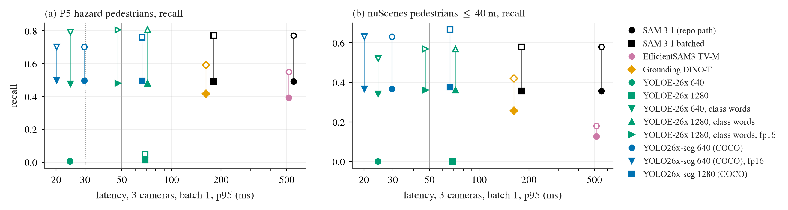

# 快通道感知：SAM 3.1 的提速选项与更快的替代检测器（延迟 × 召回，同一批帧）

状态: done（2026-09-26 01:40）。预登记写于 2026-09-25 23:33 CST（box 时钟），任何候选的延迟或召回输出之前
主题: [decisions 第 43 条](../research/decisions.md)、[融合前诊断](2026-09-25-fusion-diagnostics.md) 的 Q4 / Q4d / Q8
卡: GPU 0（独占）；CPU ≤ 20 核；slot 记在 `$DATA_DIR/runs/zeroshot-exam/gpu-plan.md`，标 `[FASTPERC]`

## 目的

融合前诊断里 SAM 3.1（Meta 的开放词表分割模型，文本 prompt）是唯一在 P5 行人 family 上给出非零读出的结构化状态来源
（规则门翻转 31–40%），但有两个问题：

1. **延迟**：Q4d 在我们的卡上 batch 1、6 个 prompt，1 路相机 p50 188 ms，3 路 558 ms；Q8 说 ParkingCrossingPedestrian 的反应窗口 p25 只有 0.53 s，
   558 ms 的感知进不了快通道（20 Hz policy，一拍 50 ms）。
2. **召回**：P5 hazard 行人全部 0.49（≤ 20 m 0.88），nuScenes 行人 ≤ 40 m 0.36（0–10 m 0.68）。远处的「漏检」一半以上是 BEV 放错：
   平地假设把站在人行道上的行人推远 2–7 m，oracle 地面高度把 P5 行人 20–40 m 从 0.12 提到 0.50。

用户问：更快的「segment anything」变体（量化、蒸馏、只做 image 而不做 video）能不能同时解决延迟和读出。
本文件把两件事分开量：**延迟**是模型选择的问题；**BEV 放置**是深度 / 地面高度的问题，换一个更快的 2D 分割器原则上不改变它。
每个候选都报平地召回和 oracle 高度召回，两者之差就是「放错」那一份。

## 调研（2026-09-26，网页与模型仓库，权重逐个核实过是否真的可下载）

| 候选 | 类型 | 接受文本概念？ | 权重（核实日期 2026-09-26） | 备注 |
|:--|:--|:--|:--|:--|
| SAM 3.1 detector（现役） | 开放词表检测 + 分割 | 是 | ModelScope `facebook/sam3.1`，盘上 | 3.1 的改动（2026-03-27 release note）全在 video：Object Multiplex、torch.compile 融合、减少 CPU-GPU 同步；image 检测器没有新的提速项，也没有官方 fp8 / int8 / TensorRT |
| SAM 3.1 + 官方开关 | 同上 | 是 | 同上 | 仓库自带：`Sam3Processor(resolution=…)`、backbone `compile_mode`、`use_rope_real`；flash-attn-3 只支持 Hopper，Blackwell 用不上 |
| SAM 3 / 3.1 video 模式 | 检测 + 跟踪 | 是 | 同上 | 每帧仍跑检测器再加跟踪器，单帧只会更慢；不作为提速选项 |
| EfficientSAM3（Zeng 等，arXiv 2511.15833） | SAM 3 的蒸馏学生：EfficientViT / RepViT / TinyViT 视觉编码器 + MobileCLIP 文本编码器，decoder 冻结沿用 SAM 3 | 是（同一 `Sam3Processor` 接口） | HF `Simon7108528/EfficientSAM3`（Apache-2.0，未 gated）：Stage 3 全模型 `efficientsam3_ft/efficientsam3_{efficientvit,repvit,tinyvit}.pt` 各约 0.47–0.49 GB，2026-06-11 发布 | 参数 89–95 M，对 SAM 3 的 862 M；作者没报延迟和 SA-Co 精度 |
| SAM3-LiteText（同一作者，arXiv 2602.12173） | 只换文本编码器 | 是 | 同上 `sam3_litetext/`、`sam3p1_litetext/`，各 2.2–2.6 GB | 视觉编码器不变；固定 prompt 时文本特征本来就可以缓存，对我们的延迟没有帮助，不测 |
| YOLOE-26（Ultralytics，YOLOE 为 ICCV 2025） | 实时开放词表检测 + 实例分割 | 是（`set_classes`，MobileCLIP2 文本编码器，prompt 嵌入可预算） | Ultralytics assets `v8.4.0`：`yoloe-26{n,s,m,l,x}-seg.pt`，2026-04-16；x 172 MB | 文本 prompt 一次前向覆盖全部类别，延迟与 prompt 数无关 |
| YOLO26-seg（Ultralytics，arXiv 2606.03748） | COCO 闭集检测 + 实例分割 | 否（80 类固定） | 同上 `yolo26{n..x}-seg.pt`，2026-01-13；x 142 MB | 论文报 COCO 40.9–57.5 mAP，T4 TensorRT 1.7–11.8 ms；COCO 没有 cone / debris / 特种车 |
| Grounding DINO tiny | 开放词表检测（只出框） | 是 | HF `IDEA-Research/grounding-dino-tiny`（Apache-2.0） | 只出框，接地点只能用框底中点；公开报告一般在 50–100 ms 量级，排第四优先 |
| YOLO-World v2 | 开放词表检测 | 是 | Ultralytics / AILab-CVC | 已被同一路线的 YOLOE 取代，不测 |
| MobileSAM、EfficientSAM、EdgeSAM、SAM 2 tiny / small、EdgeTAM | 可提示分割 | **否**，要点 / 框 prompt | 都在 HF / GitHub | 需要上游检测器给框，本身解决不了「这帧里有哪些行人」；不测 |
| FastSAM | 无 prompt 全图分割 + CLIP 文本筛选 | 间接 | GitHub | 文本是后接 CLIP 打分，行人这种小目标上不可靠；不测 |
| nuImages 上训练的 2D 检测器（mmdet3d 的 Mask R-CNN 等） | 闭集 | 否 | mmdet3d model zoo | 与 nuScenes 同城同相机，nuScenes 上的召回会偏乐观；不测 |
| YOLO26-depth（Ultralytics，2026-07-16） | 单目度量深度 | — | `yolo26{n..x}-depth.pt` | **不是分割器**，但它直接针对 BEV 放置：接地点沿射线用预测深度定位，不再依赖平地；见下「可选 D」 |

来源：[facebookresearch/sam3 RELEASE_SAM3p1.md](https://github.com/facebookresearch/sam3/blob/main/RELEASE_SAM3p1.md)、
[EfficientSAM3 GitHub](https://github.com/SimonZeng7108/efficientsam3) 与 [HF 仓库](https://huggingface.co/Simon7108528/EfficientSAM3)、
[Ultralytics YOLOE 文档](https://docs.ultralytics.com/models/yoloe)、[YOLO26 论文 arXiv 2606.03748](https://arxiv.org/abs/2606.03748)、
[Ultralytics depth 任务文档](https://docs.ultralytics.com/tasks/depth)、[ultralytics/assets releases](https://github.com/ultralytics/assets/releases)。

## 候选（按优先级）

- **A. SAM 3.1，同一个模型的提速**（`envs/sam3` 只读使用，不改）：
  A0 原样路径（Q4d 的复测，作为同一天的基线）；
  A1 `batched`：6 个 prompt 一次 grounding，3 路相机一个 batch（`sam_detect.Detector(mode="batched")`，Q4 日志 (10) 里它与原样路径的差是 mask IoU ≥ 0.988、分数差 ≤ 4e-3）；
  A2 只留 pedestrian + vehicle 两个 prompt（batched）；A3 只留 pedestrian；
  A4 = A1 + 官方 `compile_mode`（backbone 编译）；A5 = A1 + 输入分辨率 672（`Sam3Processor(resolution=…)` 这个官方参数；ViT 窗口 24 × patch 14 = 336 的整数倍才合法，若模型在 672 上跑不起来就记下原因、不改模型）；
  A6 fp8（torchao 的 float8 动态量化，只作用于 Linear）：只有在 torchao 与 torch 2.13 能直接装上时才测，不另建一套量化流程。
- **B. EfficientSAM3 Stage 3 全模型**：EV-M、RV-M、TV-M 三个里先量延迟，取召回测试的是 TV-M（作者 quick start 的默认）与最快的一个；新建 `envs/efficientsam3`，仓库原样（作者 fork 的 `sam3` 包，不能装进 `envs/sam3`）。
- **C. Ultralytics**（新建 `envs/ultralytics`）：C1 YOLOE-26x-seg，文本 prompt = 同样 6 个词；C2 YOLO26x-seg，COCO 闭集；各跑 `imgsz` 640（默认）与 1280 两档，
  小尺寸（l / m）只量延迟。映射（C2）：person → pedestrian；bicycle → cyclist；car、motorcycle、bus、truck → vehicle；COCO 没有 cone / debris / emergency vehicle，这三类记「不适用」。
- **D. Grounding DINO tiny**（HF transformers，新建 `envs/gdino`）：时间允许才做；只出框。
- **可选 D-depth（只描述，时间允许才做）**：YOLO26x-depth 在同一批图上出度量深度，接地点按「射线上深度 = 预测深度」定位，替代平地；只对胜出的检测器的接地点做，
  报 P5 hazard 行人与 nuScenes 行人的召回，回答「BEV 放置能不能靠一个快的深度头修」。不进判据。

每个第三方模型按作者发布的方式跑：作者的预处理、默认阈值、默认 NMS；我们只写外面的循环、计时、存盘。

## 帧、GT 与投影（全部复用 Q4，不改一行评测代码）

- **帧**：融合诊断 Q4 的两个列表的固定子集 S（写在看任何候选输出之前）：
  - P5：所有「至少一个 hazard actor 在前视里自己可见（像素 ≥ 20）的 x⁺ 帧」× 3 路 = 3 306 帧 × 3 = **9 918 张**。主读数 (i)（hazard 行人 / 车辆，前视）在 S 上与全量完全相同（它本来就只看这些帧）。
  - nuScenes val：150 个 scene 按名字排序取第 0、3、6… 个（50 个 scene）× 全部 keyframe × 前三路 = **6 024 张**。
  - SAM 3.1 在 S 上的基线直接取 Q4 已有的检测（`processed/fusion_diag/sam/{p5,nusc}`）按 key 过滤，不重跑。
  - 快的候选（全量 < 20 min）另在全量 47 814 张上跑一次，作为 side 读数，确认 S 上的差与全量一致。
- **GT、匹配、抬升**：`jevdrive.fusion_q4` 原样（`p5_gt.parquet`、`nusc_gt.parquet`、`lift_dets`、`match`、`evaluate`、`hazard_reading`），匹配门 max(2 m, 0.1 d)，参考点 = GT footprint 离相机最近的点，平地抬升为主读数、oracle 高度为分解读数。
- **接地点**：出 mask 的候选用同一个 `sam_detect.contact`（mask 最低 3 行的平均列）；只出框的（D）用框底中点。为了隔离「mask 接地 vs 框接地」本身的差，SAM 3.1 的已有检测另报一次「框底中点」版本（side）。
- **类别与阈值**：文本类候选用同样的 6 个 prompt；阈值用各自发布的默认（SAM 系 0.5，Ultralytics `conf` 0.25，Grounding DINO box 0.35 / text 0.25）作主读数。存盘阈值放低（SAM 系 0.3，其余 0.05），
  另报 side 读数「同 precision 下的召回」：把阈值调到 nuScenes 行人 precision 等于 SAM 3.1 的 0.36（S 上重算的值）时的行人召回，排除「阈值松紧」造成的假差异。

## 指标

- **延迟**（Q4d 的口径）：GPU 0 独占，batch 1，列表 `lists/p5_prof200.parquet`（Q4d 同一个），20 次 warm-up 后计 n ≥ 150（1 路）/ ≥ 50（3 路）；
  「1 路」= 每次一张图，「3 路」= 每次 3 张图一次调用（模型支持 batch 就 batch）；计时从 host 上已解码的 uint8 图（SAM 系为 pinned 的 CHW tensor，Ultralytics 为 HWC numpy，这是它们各自的输入形式）
  到 GPU 上拿到每个实例的分数、框、原图分辨率的 mask（`torch.cuda.synchronize` 之后）。包括上传、预处理、模型、后处理（NMS、mask 上采样）；不含 JPEG 解码与接地点提取。报 p50 / p95、峰值显存（`max_memory_allocated`）。
  compile 的候选先编译、再 warm-up。
- **召回**：P5 主读数 (i) hazard 行人（全部、≤ 20 m、≤ 30 m 白天）与 hazard 车辆（全部）；P5 (ii) 背景行人 / 车辆按距离档（0–10、10–20、20–40 m）；nuScenes 行人 / 车辆 ≤ 40 m（visibility token ≥ 3）按距离档；
  每项同时报平地召回与 oracle 高度召回；nuScenes precision；≤ 20 m 的 hazard 行人 BEV 误差中位。

## 判据（写死）

- **延迟过关**（主）：3 路 p95 ≤ **50 ms**，即一拍 20 Hz 之内出完三路状态。另报严格档：3 路 p50 ≤ **30 ms**，这是 Q8 的规则
  （窗口 p25 < 延迟 + 0.5 s 则必须留在快通道）下 ParkingCrossingPedestrian（p25 0.53 s）不再被判「来不及」的上限。
- **召回不劣**：在子集 S 上、与 SAM 3.1（S 上重算）比，下面三项的平地召回都不低于 SAM 3.1 − 0.03：P5 hazard 行人（全部）、P5 hazard 行人（≤ 20 m）、nuScenes 行人（≤ 40 m）；
  且 ≤ 20 m hazard 行人 BEV 误差中位 ≤ 1.0 m（Q4 的登记门槛）。
- **候选通过** = 延迟过关（主）且召回不劣。通过的候选里取 3 路 p95 最低者为推荐；没有候选通过时，报延迟过关的里召回最好的、以及召回不劣的里延迟最低的，两者都写出差距。
- Q4 原来的绝对门槛（hazard 行人 ≤ 30 m 白天 ≥ 0.9、全部 ≥ 0.8；nuScenes 行人 ≤ 30 m ≥ 0.8）照报，预计平地抬升下没有候选能过；过不过都不影响本文件的判定。
- 召回的 CI：P5 hazard 行人按 base 路线 bootstrap（`fusion_q4.boot_recall`，2000 次），对 SAM 3.1 的配对差也按路线 bootstrap。

## 资源估计

| 步骤 | GPU·h | 显存 | CPU 核 | 墙钟 | 盘 |
|:--|--:|:--|--:|:--|:--|
| 三个 env + 权重（EfficientSAM3 ~1.5 GB、Ultralytics ~0.6 GB、GDINO 0.7 GB、MobileCLIP ~0.3 GB） | 0 | — | 4 | 30–60 min | ~15 GB |
| 延迟：A0–A6、B×3、C 各档、D | 0.3 | ≤ 20 GB | 4 | 20–30 min | — |
| 召回：S 上 A1、A2、A5、B×2、C1×2、C2×2（~16k 张 × 9 个配置） | 0.8–1.5 | ≤ 30 GB | 12（解码） | 1–1.5 h | < 2 GB |
| 评测（CPU，`fusion_q4` 原样） | 0 | — | 12 | 每个配置 ~2 min | — |

超过估计 2 倍就停下来重估。下载与 WOD test 共用链路，只下上面列的文件，单文件都 < 0.5 GB（GDINO 0.7 GB）。

## 偏离与澄清日志

- 2026-09-25 23:44 CST（box 时钟，下同）**延迟改到 GPU 4 上量**。GPU 0 在我开始之前（23:29）就被融合诊断第 3 阶段的 `fusion_q9b extract v1-pdm` 占着（9 GB、100% 利用率），
  第一次在 GPU 0 上量的 SAM 3.1 原样路径是 1 路 795 ms、3 路 2389 ms（Q4d 是 188 / 558 ms），被争用污染，整批作废（目录改名 `runs/fastperc/latency-contended-gpu0`）。
  reactivity 链 23:41 结束、GPU 1 / 2 / 4 空出，延迟改在 GPU 4 上单进程量（每个配置约 1 min，全部不到 1 h），召回的检测批量仍在 GPU 0（吞吐受争用影响，结果不受）。gpu-plan 里记了一行。
  GPU 4 上复测的原样路径 1 路 182 ms、3 路 540 ms，与 Q4d 的 188 / 558 ms 一致，说明这张卡上的数字与 Q4d 可比。
- 23:45 SAM 3.1 在 S 上的基线（Q4 已有检测按 key 过滤）：hazard 行人全部 0.492、≤ 20 m 0.880，与 Q4 全量一致（(i) 本来就只看这些帧）；nuScenes 行人 ≤ 40 m 0.356（全量 0.36），precision 0.377。
  「框底中点接地」的 side 读数与 mask 接地几乎相同（hazard 行人 0.502 对 0.492），所以只出框的候选（Grounding DINO）不会因为接地点定义吃亏。
- 23:48 **A2 / A3（少 prompt）不另跑召回**：原样路径里每个 prompt 是独立的一次 grounding，少 prompt 只是少算几次，留下的 prompt 的输出逐位不变；batched 路径里 prompt 之间也只通过 bf16 的 batch 形状噪声相关
  （Q4 日志 (10)）。所以 A2 / A3 的召回 = A0 / A1 的对应类别，只量延迟。召回只重跑 A1（batched，确认 bf16 噪声不改召回）和 A5（672，若能跑）。
- 23:49 **A5（672 输入）跑不起来**：ViT 的全局注意力块里 RoPE 频率表按 1008（72 × 72 个 patch）预先算好，`vitdet.reshape_for_broadcast` 的形状断言失败；
  position encoding 也是 `precompute_resolution=1008`。`Sam3Processor(resolution=…)` 只改前处理，模型本身不支持别的分辨率，要改就得按新尺寸重建 ViT（改模型配置），按登记不做。
  EfficientSAM3 自带的 TensorRT 导出脚本里也写明「输入分辨率固定在 1008」。
- 23:52 **A4（官方 compile）几乎不提速**：`compile_mode="max-autotune"` 编译的是 ViT 的 forward（fullgraph），3 路 p50 180 → 176 ms。
  **A6（fp8）不测**：torchao 不在 `envs/sam3` 里、按规则不能动这个 env；而且下面的分解说明它最多只能省图像编码器那一块，到不了 50 ms。
- 23:59 **SAM 3.1 延迟分解**（GPU 4，batch 1，bf16，一张图）：图像编码器 26 ms；grounding（融合 encoder + DETR decoder + 分割头，都在 1008 分辨率的 72 × 72 特征上）1 个 prompt 36 ms、6 个 prompt 51 ms；整次调用 73–83 ms。
  **瓶颈是 grounding 头，不是视觉 backbone**。EfficientSAM3 只蒸馏了视觉和文本编码器、decoder 冻结沿用 SAM 3，所以它的 batched bf16 也只到 1 路 54 ms、3 路 112 ms（与 SAM 3.1 只留 pedestrian 一个 prompt 的 112 ms 一样）。
  由此，任何保持 SAM 3 grounding 头、1008 输入的变体（量化、蒸馏编码器、编译）3 路都到不了 50 ms：光 grounding 一项就是 3 × 36 ms。
- 00:00 **EfficientSAM3 的召回批量改到 GPU 4**：在争用的 GPU 0 上原样路径（fp32、逐 prompt）1.3 s / 张，16k 张要 5–6 h；GPU 1 / 2 又被别人占了，所以等 GPU 4 的延迟跑完后在 GPU 4 上跑（165 ms / 张，约 45 min）。
  另外修了三处我们自己的环境问题：EfficientSAM3 的 `[stage1]` extra 会拉 mmcv 源码编译（只训练需要，去掉，补 `omegaconf`）；GitHub 资产断流改成可续传；hf-mirror 上小文件的 HEAD 返回 20 字节，改用 tree 列表里的大小。
- 00:02 **YOLOE 加一个 side 变体「类别词」**（写于任何 YOLOE 召回数字之前，只看过 6 张图的检测个数：YOLO26 在同样 6 张图上检出 1–3 个行人，YOLOE 用 "pedestrian" 一个都没有）：
  文本 prompt 改用 COCO 式类别词（person、bicycle、car、motorcycle、bus、truck、traffic cone、debris、ambulance、fire truck、police car），再映射回 Q4 的类别（`fastperc.YOLOE_WORDS`）。
  主读数仍是登记的 6 个 prompt；这个变体不进判据，只回答「YOLOE 的问题是模型还是措辞」。
- 00:03 Grounding DINO 的 transformers 实现对「一个框都没有」的图返回 labels `['']`，与空的 scores 对不上，修了我们的循环后重跑检测（之前的部分作废）。
- 00:26 **加一个 side 读数「图像平面召回」**（写于看过 SAM 3.1 与 YOLO26 的 BEV 召回之后，属于事后描述，不进判据）：GT 参考点投到图上，落在同类检测框（每边放宽框尺寸的 10%，至少 4 px）内即算看见，
  完全不经过 BEV 抬升，用来把「没检出」与「放错」分开，比 oracle 高度更干净（oracle 只修高度，不修接地点本身的偏差）。只报行人：车辆的参考点是 footprint 离相机最近的角，近处常落在框外（0–10 m 车辆图像召回 0.17），这个读数对车辆没有意义。
- 00:30 **可选 D-depth 做了**（SAM 3.1 与 YOLO26x-640 两份检测）：YOLO26x-depth 按发布方式跑（不给相机内参），接地点沿射线放到预测深度处。
- 00:40 追加三个 side 召回（GPU 4，写于它们的任何数字之前）：YOLO26x-640 fp16、YOLOE-26x 类别词 640 fp32、YOLOE-26x 类别词 1280 fp16，以及类别词变体的延迟。目的：判据里的延迟用的是 fp32 还是 fp16 要与召回同一配置。
- Grounding DINO 的车辆召回是 0：它把相邻 token 合成一个短语（例如 "vehicle emergency vehicle"），我们的映射取包含的最长 prompt，于是车辆全被记成 emergency vehicle。这是我们映射的问题，但判据只看行人，GDINO 在延迟上已经不过，没有修。

## 结果

run：延迟 `$DATA_DIR/runs/fastperc/latency/`（GPU 4 独占；两处例外见日志），检测 `processed/fastperc/dets/<tag>/`，评测 `runs/fastperc/eval/<tag>/`；
小表 [research/results/fast-perception/](../research/results/fast-perception/)（`latency.csv`、`recall.csv`，由 `python -m jevdrive.fastperc summary` 生成）。代码 `jevdrive/fastperc.py`、`scripts/fastperc.sh`、`scripts/fastperc_setup.sh`。

### 延迟（batch 1，Q4d 口径，RTX PRO 6000）

| 配置 | 3 路 p50 / p95 (ms) | 1 路 p50 (ms) | 峰值显存 3 路 (GB) | 延迟判据（p95 ≤ 50） |
|:--|--:|--:|--:|:--|
| SAM 3.1 原样路径（6 prompt 逐个，= Q4d） | 540 / 550 | 182 | 4.7 | 不过 |
| SAM 3.1 batched，6 prompt | 180 / 181 | 73 | 10.7 | 不过 |
| SAM 3.1 batched，pedestrian + vehicle | 125 / 126 | 57 | 6.3 | 不过 |
| SAM 3.1 batched，只 pedestrian | 113 / 119 | 52 | 5.2 | 不过 |
| SAM 3.1 batched + 官方 compile（max-autotune） | 176 / 177 | 73 | 12.0 | 不过 |
| SAM 3.1 输入 672 | 跑不起来（RoPE 固定 1008） | — | — | — |
| EfficientSAM3 TV-M，原样（fp32，逐 prompt） | 484 / 514 | 163 | 2.4 | 不过 |
| EfficientSAM3 TV-M / EV-M / RV-M，batched bf16 | 115 / 112 / 116（p95 115 / 114 / 118） | 55 / 54 / 58 | 6.9 | 不过 |
| Grounding DINO tiny | 148 / 162 | 66 | 3.6 | 不过 |
| YOLOE-26x-seg 640（6 prompt 或类别词） | 21–22 / 24 | 14 | 0.9 | **过** |
| YOLOE-26x-seg 1280 fp32 / fp16（类别词） | 65 / 72，42 / 47 | 23 / 17 | 2.6 / 1.5 | 不过 / **过（贴线）** |
| YOLO26x-seg 640 fp32 / fp16 | 23 / 30，17 / 20 | 13 / 12 | 0.9 / 0.5 | **过** |
| YOLO26x-seg 1280 fp32 / fp16 | 65 / 66，42 / 44 | 22 / 15 | 2.6 / 1.6 | 不过 / 过 |
| YOLO26l-seg 640 fp16 | 17 / 19 | 12 | 0.4 | 过（未测召回） |

YOLO26x-640 fp32 的数取的是 01:32 在 GPU 0 上的复测（23 / 30 ms），GPU 4 上第一次是 22 / 24 ms，两次都过线。Ultralytics 的 1 路延迟里约一半是 CPU 上的 letterbox 与后处理，不是 GPU。

读法：**SAM 3 系的延迟下限由 grounding 头决定，不是视觉 backbone**。分解（日志 23:59）：图像编码器 26 ms，grounding 1 个 prompt 36 ms、6 个 51 ms。
所以把视觉编码器蒸馏成 EfficientViT / TinyViT（EfficientSAM3）只省 20 ms，编译几乎不省，分辨率在模型里写死，最好的同模型配置（batched、只 pedestrian）3 路 113 ms，是 50 ms 预算的两倍多。
真正进预算的是 YOLO 系的一阶段检测 + 分割：3 路 17–30 ms，比 SAM 3.1 原样快 20–30 倍。

### 召回（子集 S：P5 9 918 张、nuScenes 6 024 张；平地抬升为主读数）

| 配置（阈值） | P5 hazard 行人全部 [对 SAM 的配对差 95% CI] | ≤ 20 m [配对差 CI] | ≤ 30 m 白天 | ≤ 20 m BEV 误差中位 (m) | nuScenes 行人 ≤ 40 m | 同 precision 下 | nuScenes precision | 召回判据 |
|:--|:--|:--|--:|--:|--:|--:|--:|:--|
| SAM 3.1 原样（0.5） | **0.492** | 0.880 | 0.650 | 0.46 | 0.356 | 0.351 | 0.377 | 基线 |
| SAM 3.1 batched（0.5） | 0.492 [0, 0] | 0.880 [0, 0] | 0.650 | 0.46 | 0.356 | 0.356 | 0.377 | 不劣 |
| EfficientSAM3 TV-M（0.5） | 0.394 [−0.16, −0.04] | 0.785 [−0.15, −0.05] | 0.529 | 0.50 | 0.127 | 0.265 | 0.586 | **劣** |
| Grounding DINO tiny（0.35） | 0.416 [−0.18, +0.02] | 0.726 [−0.28, −0.02] | 0.554 | 0.32 | 0.257 | 0.210 | 0.370 | **劣** |
| YOLOE-26x 640，6 个 prompt（0.25） | 0.004 [−0.73, −0.23] | 0.008 | 0.005 | — | 0.000 | 0.044 | — | **劣** |
| YOLOE-26x 1280，6 个 prompt | 0.012 | 0.019 | 0.013 | — | 0.000 | 0.018 | — | **劣** |
| YOLOE-26x 640，类别词（side） | 0.478 [−0.031, −0.004] | 0.860 [−0.048, −0.004] | 0.634 | 0.47 | 0.342 | 0.333 | 0.348 | 不劣（−0.014 / −0.020 / −0.014） |
| YOLOE-26x 1280 fp16，类别词（side） | 0.481 [−0.030, +0.008] | 0.856 [−0.048, −0.011] | 0.637 | 0.48 | 0.361 | 0.342 | 0.321 | 不劣 |
| **YOLO26x-seg 640（0.25）** | **0.497 [−0.010, +0.019]** | **0.890 [−0.004, +0.029]** | 0.656 | 0.44 | **0.366** | 0.363 | 0.365 | **不劣** |
| YOLO26x-seg 640 fp16（side） | 0.499 [−0.007, +0.021] | 0.890 | 0.658 | 0.44 | 0.367 | 0.364 | 0.365 | 不劣 |
| YOLO26x-seg 1280（0.25） | 0.494 [−0.008, +0.013] | 0.884 | 0.656 | 0.44 | 0.377 | 0.360 | 0.344 | 不劣 |

CI 按 base 路线 bootstrap 2000 次（同一批 GT 行上的配对差）。「同 precision 下」= 把阈值调到 nuScenes 行人 precision ≥ SAM 3.1 的 0.377 时能拿到的最高召回（阈值扫描 0.05–0.95）。车辆的 hazard 召回：SAM 0.78、YOLO26x-640 0.80、YOLOE 类别词 0.66–0.70、EfficientSAM3 0.53。

**判定（按登记）**：延迟过关且召回不劣的只有 **YOLO26x-seg 640**（登记的 fp32：3 路 p95 30 ms、p50 23 ms，严格档 ≤ 30 ms 也过；三项召回差 +0.005 / +0.010 / +0.010，BEV 误差 0.44 m），它是推荐项；
事后加的 fp16 side 召回与 fp32 逐位接近（差 ≤ 0.002）、3 路 17 / 20 ms，部署时用 fp16。YOLOE-26x 的类别词变体（640 fp32、1280 fp16）也过了两条线，但它是看过 6 张图后加的 side 变体、不进判据；
登记的 6 个 prompt 版本在 "pedestrian" 这个词上几乎什么都不出（P5 0.004、nuScenes 0.000），换成 "person" 就回到 SAM 的水平——轻量开放词表模型对措辞很脆，SAM 3 对同一个词是稳的。
SAM 3.1 的所有同模型提速、EfficientSAM3、Grounding DINO 都在延迟上不过；EfficientSAM3 与 Grounding DINO 召回也明显更差（nuScenes 行人 0.13 / 0.26 对 0.36）。
Q4 的绝对门槛（hazard 行人全部 ≥ 0.8、≤ 30 m 白天 ≥ 0.9、nuScenes ≤ 30 m ≥ 0.8）没有任何候选过，与预期一致。

图：横轴 3 路 batch 1 的 p95 延迟（对数），竖线 50 ms（主判据）与 30 ms（严格档）；实心 = 登记的平地抬升召回，空心 = oracle 地面高度召回，同一配置用竖线连起来。
要看的是：50 ms 线左边只有 YOLO 系；而所有「能看见行人」的候选实心点都挤在同一高度（P5 约 0.48–0.50、nuScenes 约 0.34–0.38），差别全在空心点和竖线长度上，即放置而不是检测。

### 两个问题分开：延迟由模型选择解决，BEV 放置不由它解决

图像平面召回（side，事后加：GT 参考点落在同类检测框内就算看见，不经过 BEV）与平地 BEV 召回按距离档对比（行人，≤ 40 m，背景 actor / nuScenes 全部）：

| | P5 0–10 / 10–20 / 20–40 m，图像平面 | P5 同档，平地 BEV | nuScenes 0–10 / 10–20 / 20–40 m，图像平面 | nuScenes 同档，平地 BEV |
|:--|:--|:--|:--|:--|
| SAM 3.1 | 0.91 / 0.80 / 0.58 | 0.90 / 0.68 / 0.13 | 0.66 / 0.60 / 0.56 | 0.65 / 0.44 / 0.21 |
| YOLO26x-seg 640 | 0.91 / 0.79 / 0.46 | 0.90 / 0.71 / 0.13 | 0.74 / 0.66 / 0.61 | 0.67 / 0.44 / 0.22 |
| YOLOE-26x 640 类别词 | 0.89 / 0.78 / 0.60 | 0.88 / 0.64 / 0.12 | 0.69 / 0.55 / 0.44 | 0.67 / 0.42 / 0.19 |

三个完全不同的检测器，20–40 m 在图上看见了 46–61% 的行人，BEV 里都只剩 12–22%；10 m 以内图像与 BEV 几乎相等。**远处的缺口是平地抬升，任何 2D 检测器都不改变它**。
nuScenes 近处（0–10 m）图像平面也只有 0.66–0.74，这一块是真的漏检 / 截断（近处行人常被图像边缘截掉，脚不在图里），YOLO26 比 SAM 高 0.08。

**可选 D-depth**（YOLO26x-depth 按发布方式跑、不给内参，接地点放到射线上的预测深度处）：

| 检测 + 放置 | P5 hazard 行人全部 / ≤ 20 m | P5 背景行人 0–10 / 10–20 / 20–40 m | nuScenes 行人 0–10 / 10–20 / 20–40 m / ≤ 40 m |
|:--|:--|:--|:--|
| SAM 3.1 + 平地 | 0.49 / 0.88 | 0.90 / 0.68 / 0.13 | 0.65 / 0.44 / 0.21 / 0.36 |
| SAM 3.1 + 深度 | 0.21 / 0.44 | 0.49 / 0.03 / 0.00 | 0.83 / 0.61 / 0.12 / 0.41 |
| YOLO26x-640 + 深度 | 0.20 / 0.43 | 0.48 / 0.03 / 0.00 | 0.92 / 0.64 / 0.12 / 0.43 |

发布版的单目深度不给内参，尺度系统性偏近：同一批检测上「深度放置距离 / 平地放置距离」的中位数，P5 0–10 / 10–20 / 20–40 m 是 0.74 / 0.64 / 0.47，nuScenes 是 0.86 / 0.86 / 0.70。
所以在 CARLA 上它比平地差得多，在 nuScenes 近处（≤ 20 m）比平地好（0.65 → 0.92），20 m 以外仍然不行。结论：**单目深度头原样不能替代平地抬升**；要修放置，得给它按相机标定尺度
（Ultralytics 自带两参数的 `calibrate`，或用平地抬升在近处的点在线拟合尺度），或者直接估计地面高度。这是下一个实验，不是换检测器能解决的。

### 推荐

1. 快通道的结构化感知用 **YOLO26x-seg 640 fp16**（COCO 闭集，person / bicycle / car / motorcycle / bus / truck）：3 路 batch 1 p95 20 ms、显存 0.5 GB，行人召回与 SAM 3.1 不劣（配对差 CI 跨零），车辆略好。
   按 Q8 的规则，感知延迟 20–30 ms 时 ParkingCrossingPedestrian（p25 0.53 s）不再被判「来不及」。代价是没有开放词表：cone / debris / 特种车拿不到（SAM 的 debris / emergency vehicle 本来也几乎为 0）。
   要长尾类别时用 YOLOE-26x 640 + 类别词（3 路 p95 24 ms，行人召回差 −0.01 到 −0.02），但它对措辞敏感，词表要先在我们的数据上验过。
2. SAM 3.1 留给慢通道和离线标注（它的召回并不比 YOLO26 好，唯一优势是开放词表对措辞稳）。
3. 召回的主要缺口不在检测器：下一步是接地点的高度 / 深度（按相机标定尺度的单目深度，或地面高度估计），在同一个子集 S 上用同一套评测，先看 oracle 高度这条上界（P5 hazard 行人 0.70–0.81）能拿回多少。

### 资源与时间

墙钟 23:33 → 01:40，约 2.1 h（登记 3–4 h）。GPU：GPU 0（与融合第 3 阶段、ELICIT 共用）召回批量约 1.5 h 墙钟，GPU 4 延迟与 EfficientSAM3 批量约 1 h；约 2.5 GPU·h。CPU ≤ 20 核（180–199）。
盘：三个 env 约 12 GB，权重 2.9 GB，检测 < 1 GB。全量 47.8k 张的 side 复核没有做：在争用的 GPU 0 上最快的 YOLO 也要约 70 min，超过登记的「< 20 min」条件。
