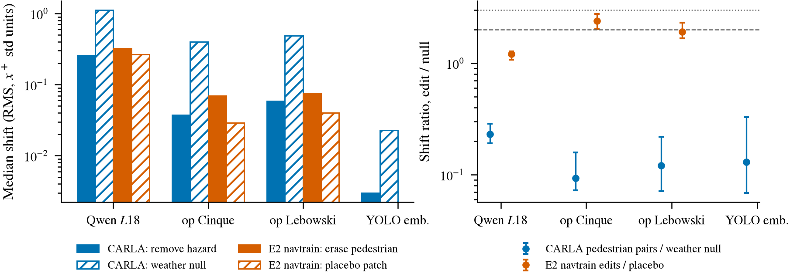
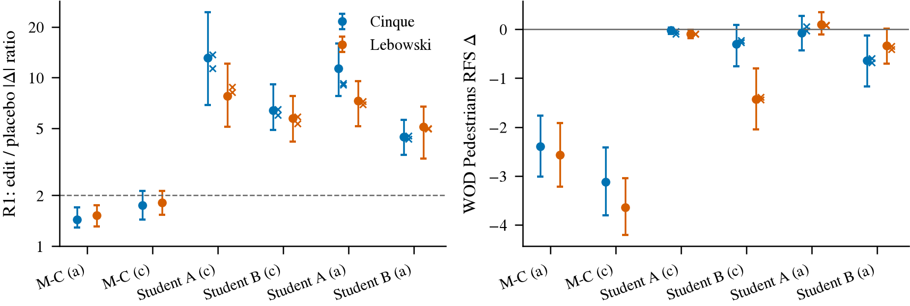
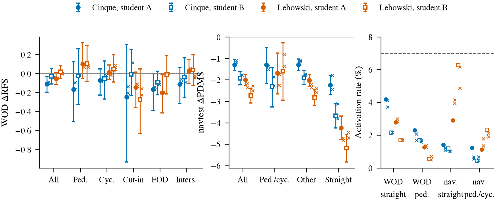
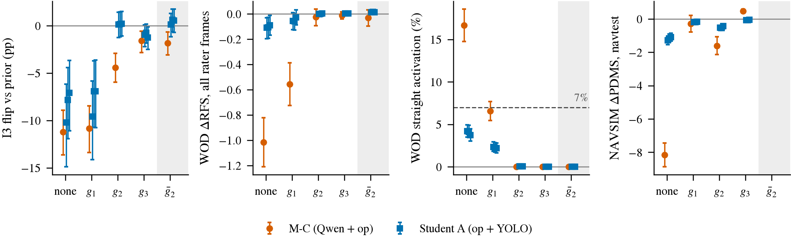

# 配对差分走到真实数据（第二轮）：G0 student 零样本、G1 门控、G3 编辑对诊断、G2 HUGSIM 车辆配对重训；附第 40 条 3 seed 重判

状态: 待排（预登记，2026-09-26 上午，写于任何新拟合之前；用户 2026-09-26 决定顺序 G0 → G1 → G3 诊断 → G2，第 40 条重判随时可做）
上游: 第 44 条（E1 零样本有害、E2 编辑对不过、E3 关闭）、第 42 条（M-C 3 seed 过；E4c 人类 onset 0.9–1.9 s；E5 student 52.7%、p95 30 ms）、
第 45 条（YOLO26x-seg 行人召回不劣于 SAM、延迟 1/25）、[I3](2026-09-25-reactivity-program/i3-hugsim-pairs.md)（65 个 3DGS 车辆场景，openpilot 读出零样本 70%、M-C Δ −11 pp）、
[激发计划](2026-09-26-elicitation-program.md)、[夜间汇总](../tmp/2026-09-26-overnight.md)
主线: 组件冻结、配对差分激发不变。本轮只回答一个问题：**CARLA 里激发出来的反应通道，怎样在真实数据上不有害、并在有行人的帧上为正**。全部开环。

## 夜里量到的失败形状（本轮的起点）

| 事实 | 数字 | 含义 |
|:--|:--|:--|
| CARLA 训的 Δ 在真实特征上到处开火 | E1 直行帧激活率 Cinque 16.7%、Lebowski 40.7%（门槛 7%）；I3 null 对上 Δ 也动、τ 被抬高 | 缺的是 gate，不是方向 |
| openpilot 读出跨真实外观成立 | I3（3DGS 车辆配对）`ridge_late` 零样本 70.0% [65.5, 74.5]，null 4.4% | 驾驭训练过的 backbone 自己就能迁移 |
| Qwen 是唯一跨域失效的那一路 | I3 上 Qwen `ridge_late` 2.8%；E1 的害主要来自 Δ 头 | student 不用 Qwen（E5：YOLO embedding + openpilot） |
| 编辑对的信号量 | 抹人在 Qwen `L18_last` 上只比安慰剂多移 21%；openpilot 2.4 倍 | pooled 全图特征对小目标不敏感，未必是编辑质量的问题 |
| 「什么时候该反应」真实数据教得会 | P2(e) 的 gate 沿 s_ego 单调上升 | gate 可以来自 WOD 自己 |
| HUGSIM 没有行人资产 | 只有 3DRealCar 110 辆车 | G2 只能做车辆版 |

## 五项

### G0. E5 的 20 Hz student 零样本上真实数据（最先做）

- **问题**：不含 Qwen 的行人通道（openpilot `temporal` ⊕ YOLO26x-seg 检测 embedding → MLP，P5 v1 BA 配对差分训出，3 seed 行人 51–57%）放到真实特征上是有害、无害、还是有用。
- **为什么先做它**：它的两路输入都不吃 CARLA 外观。检测框在任何渲染器里都是同一个物体；openpilot 特征在 I3 真实外观上零样本 70%。E1 的害来自 Qwen pooled 的 Δ，student 里没有这一路。
- **做法**：student A 与 B（E5 登记的两个 arm，3 seed 各自套，不重训、不调）。YOLO26x-seg 640 fp16 在 WOD val `p2p3_v1` 子集 19 663 帧前视（与 E1 同一批帧，可配对）和 navtest 全部 token 前视上跑一遍，
  走廊内前 8 个检测的 embedding 与 E5 完全同一段代码；prior 分别是 WOD train 训的 `ridge_late` openpilot 和 navtrain 训的薄 head（与 E1 相同）。
- **读数**：与 E1 逐列相同：WOD 全部 rater 帧与 Pedestrians / Cyclists / Cut_ins cluster 的 RFS 配对 Δ、ADE 第 1–9 档 Δ、直行帧与行人帧的激活率；NAVSIM 全部 token 与「走廊内有行人 / cyclist」的 897 个 token 的 PDMS / EPDMS 配对 Δ（官方 devkit，版本注明）。
- **判据（写死）**：
  - **有用**：Pedestrians（WOD）或有行人 token（NAVSIM）的主指标 Δ CI 整体 > 0，直行激活率 ≤ 7%，全部帧 Δ CI 不整体 < 0。
  - **无害但没用**：所有 Δ 跨零、直行激活率 ≤ 7%。
  - **有害**：全部帧 Δ CI 整体 < 0 或直行激活率 > 7%。
- **预期**：至少「无害」；行人上是否为正取决于 CARLA 与真实里行人相对 ego 的分布差。若「有害」，说明 MLP 在 embedding 上也学了 CARLA 的分布，G1 的 gate 是必需。
- **资源**：YOLO 三路 fp16 约 20 ms / 帧，WOD 19.6k + navtest 12.1k × 3 路约 30–40 min 单卡；head 与打分 CPU，devkit 约 20 min。工程半天。

### G1. 门控：gate 来自真实数据，Δ 来自 CARLA 配对（第一优先）

- **问题**：给 Δ 乘一个在真实数据上训的 gate g(x) ∈ [0, 1]，E1 与 I3 的害是否消失，行人帧上是否为正。
- **gate 的三个候选（各一 arm，同一批帧）**：
  - g₁ **P2(e) 的 gate**：WOD train 上按第 23 条 (e) 的配方（`waymo_ladder.gated_arm`，L1 稀疏，输入 ego + openpilot `temporal`）重训，只取 gate 分支；NAVSIM 上在 navtrain 同样训一个。
  - g₂ **hazard 存在性 probe**：YOLO 检测 embedding 上的 logistic probe，标签 = 走廊内 ≤ 30 m 有行人 / cyclist / 接近车辆（WOD 用 Q2b 的 SAM 检测当标签，navtrain 用 GT 轨迹），按 sequence / log 分折；输出经 Platt 校准。
  - g₃ **openpilot 自带信号**：lead_prob 与 TTC（Q4c 的 lead 头，20 m 内召回 0.9）经一个单调映射，无训练。
- **Δ 的两个来源**：M-C 双流（Qwen ⊕ openpilot，E1 那五个 fold head）与 G0 的 student；共 3 × 2 = 6 个 arm，加「无 gate」（E1 / G0 本身）作对照。
- **在 I3 上先过一遍**：同一 gate（g₂ 用 I3 的 GT actor 当标签、g₃ 直接用）乘到 M-C 的 Δ 上，M-C 对 `ridge_late` 的 −11 pp 应变为 ≥ 0，null false-flip ≤ 7%。这是 gate 有没有作用的最便宜检查。
- **读数**：与 E1 / G0 逐列相同，另加 gate 自己的描述：直行帧 / 行人帧上 g 的均值与 g > 0.5 的比例。
- **判据（写死）**：**成立** = 直行激活率 ≤ 7% 且全部帧 Δ CI 不整体 < 0（害消失），且 Pedestrians / 有行人 token 的主指标 Δ CI 不整体 < 0；**有用** = 上面成立且该子集 Δ CI 整体 > 0。三个 gate 里由训练行上的 AUC 选主 arm，不看评测数。
- **预期**：g₂、g₃ 能让害消失；能否为正取决于 Δ 的方向在真实特征上有没有意义，G0 的 student 比 M-C 更可能为正。
- **资源**：全部 CPU（特征、检测、预测都在盘上），gate 训练分钟级；工程一天（三个 gate 的接口）。

### G3. 编辑对（E2）的两项诊断，先于任何视频 inpainting

- **G3a 位移比值的 CARLA 参照**：在 P5 v1 BA 的 x⁺ / x⁻ 对上算与 E2 完全相同的统计：Qwen `L18_last`、openpilot `temporal`、YOLO embedding 三种特征上 |f(x⁺) − f(x⁻)| 的中位数，除以 null（天气）对上的同一量。
  与 E2 的 1.44（Qwen）、2.4（openpilot）并排。**读法写死**：CARLA 上 Qwen 的比值也 < 2 而激发仍成立 → 编辑质量不是 E2 的瓶颈，瓶颈在标签与对数，视频 inpainting 不投；CARLA 上比值 ≥ 3 → 编辑信号确实弱，再登记视频一致 inpainting。CPU 分钟级。
- **G3b 标签 (c)**：E2 已造的 navtrain 911 对上补 PDM scorer 标签（「继续」与「刹停」两条 proposal 各打一次，分差符号当 Δ 方向；E3 里量过它与人类未来的一致率逐对 79%），用它重训 M-C 与 student，
  评测同 E2（P5 BA 行人翻转、WOD Pedestrians RFS Δ、直行激活）。判据同 E2。CPU 加 devkit 打分小时级。
- **G3c（描述）**：WOD 编辑对从 216 扩到 train 全量走廊内行人帧（E2 估 4–12k 张）的 SAM + LaMa 成本表，只估不跑；等 G3a 判定后决定。

### G2. HUGSIM 车辆配对上重训 M-C（等 G0、G1 出来后排）

- **问题**：在真实外观的车辆配对（I3，65 场景，1 832 reactive 帧，static / cutin / oncoming）上用配对差分重训 M-C 与 student，Δ 是否不再有害，WOD Cut_ins 上是否为正。
- **限定先写死**：HUGSIM 只有 3DRealCar 车辆资产，**没有行人**，本项测不到行人缺口；行人 3DGS 资产（从带行人的重建场景导出动态高斯，或 SAM 3D Body 一类的人体重建）是另一个调研项，不在本轮，查到可用资产再单独登记。
- **做法**：训练行 = I3 的 x⁺ / x⁻ / null 帧（按场景 5 折），特征 openpilot `temporal` ⊕ Qwen `L18_last`（已抽）与 YOLO embedding（需在 I3 帧上跑一遍，分钟级）；对照：CARLA 训的同一 head、hard-example 重加权、均匀 imitation。
- **读数**：I3 held-out 场景翻转率与 null；WOD Cut_ins / 全部 rater 帧 RFS Δ、直行激活率；NAVSIM 有接近车辆的 token 的 PDMS Δ。
- **判据**：I3 held-out 翻转 ≥ CARLA 训的 M-C（58.7%）且 null ≤ 7%；WOD Cut_ins RFS Δ CI 不整体 < 0、直行激活 ≤ 7%。
- **资源**：YOLO 在 I3 帧上分钟级 GPU；其余 CPU；工程半天。

### R40. 第 40 条「Lebowski `cls_late` 够到原生」按原判据 3 seed 重判

- **做法**：第 40 条 (iii) 的预登记配对比较（`cls_late` − 原生，frame mean，sequence bootstrap；缺口比例 G）在 seed 0 / 1 / 2 各算一次，再对三个 seed 的预测取平均算一次；Cinque 与 Lebowski 都算。零拟合，预测在 `research/results/elicitation/seeds/` 与 heads_train run dir。
- **判据**：原判据不变（`cls_late` − 原生的 CI 跨零 = 够到）。**报法写死**：三个 seed 中有任一不够到，本格写「是否够到随词表 seed 变，均值 G = …」，第 40 条与中期 artifact 里「收回原生差距的 0.4–0.7」一行改成 3 seed 的 G 范围。
- **预期**：Lebowski 只 seed 0 够到（均值 7.59 对 7.89），Cinque 三个都不够；两模型 G 约 0.3–0.5。
- **资源**：CPU 分钟级。

## 顺序与依赖

```
R40（CPU，随时）
G0（YOLO 30–40 min GPU + CPU）──有用 / 无害──► G1 只做「有 gate 是否更好」
                                └──有害───────► G1 必需
G1（CPU；先在 I3 上验 gate）
G3a（CPU 分钟级）──比值 < 2──► 不投视频 inpainting，做 G3b
                └──比值 ≥ 3──► 另登记视频一致 inpainting
G2 等 G0、G1 出来后排；行人资产另行调研
```

## 硬约束

- 组件冻结；Δ 头不在真实数据上重训（G2 除外，它在 3DGS 配对上训）；gate 只在真实数据上训，且不看评测数选。
- judge 不改：WOD 第 22 条口径、NAVSIM 官方 devkit 注明版本、P5 / I3 的定向翻转率 + null false-flip；所有 head 报 3 seed。
- 训练 / 评估按 sequence、log、场景分开；G0 / G1 的 WOD 评测帧与 E1 同一批（19 663 帧），保证可配对。
- 闭环仍暂停。任何一步超估计 2 倍先停。
- 结论：G0–G3 补进第 44 条（就地修正「三条路都没通」那一句，写明第几条通了、在什么条件下）；G2 进 I3 子文档与第 44 条；R40 就地修正第 40 条与中期 artifact 的那一行。

## 交付

1. G0：WOD 一张 cluster 表、NAVSIM 一张分组表（Δ、激活率）+ 判格。
2. G1：I3 上 gate 前后一张；WOD / NAVSIM 上 3 gate × 2 Δ 的表 + gate 描述 + 判格。
3. G3a：三种特征在 CARLA 与 E2 上的位移比值并排 + 读法；G3b：重训后的 E2 表；G3c：成本表。
4. G2：I3 held-out 与 WOD Cut_ins 的表。
5. R40：3 seed 的配对比较表，第 40 条与 artifact 的修正。
小表进 `research/results/real-data-transfer/`。

## 偏离与澄清日志

（执行时追加，时间戳早于受影响的数字。）

- 2026-09-26 08:30 CST [main] 执行分工与两条澄清（写于本轮任何数字之前）。
  (1) 并行四路：G0 + 共享 YOLO embedding（一个代理）、G1（一个代理）、G3a/G3c/G3b（一个代理）、R40（一个代理）；G2 等 G0、G1 判格出来后再派。
  各代理在本日志里只写自己标签的条目（[G0] / [G1] / [G3] / [R40]），提交前 `git pull --rebase`。
  (2) GPU：YOLO26x-seg 的检测一次性在 5 张卡上分片跑完（WOD val 子集、navtest、I3 帧、g₂ 需要的 WOD train / navtrain 训练帧），由 G0 代理负责，其余代理复用；之后的小 GPU 任务各自挑最空的卡。
  (3) G3a 的读法补一格：比值落在 [2, 3) 时照做 G3b，并在结果里标「灰区」；比值 ≥ 3 时停在 G3a，视频一致 inpainting 的登记交给用户。
  (4) E5 的 embedding 用的是 CARLA `route.json` 走廊与三路相机的平地抬升；真实数据上走廊（WOD / NAVSIM 没有路线中心线）、相机标定与只有前视这三处的操作化，由 [G0] 在任何 G0 数字之前登记，G1 / G2 / G3b 的 student 一律沿用。
- 2026-09-26 08:28 CST（box 时钟，下同；原写 08:33 是手填的估计，已按提交 1b2795a 的时间改正，G3a 的 run 在 08:30:05 开始）[G3] 分步时间估计与 G3a 的操作化，写于 G3 的任何数字之前（此前只读过 E2 / E5 的已发表数字与代码）。代码 `jevdrive/real_g3.py`，run `runs/real-data-transfer/g3*/<time>`，小表 `research/results/real-data-transfer/g3/`。
  **时间估计**：G3a 工程 30 min + CPU < 5 min；G3c 桌面估算 45 min（复用 E2 WOD 扫描 / 造对 / Qwen 抽取的实测速率）；G3b 若开：PDM 标签（911 个 token 的 v1.1 metric cache + 两条 proposal 各打一次，E3 实测 600 token 16 线程 345 s）约 15 min 墙钟，
  M-C 按 E2 代码重训 + R1–R3 约 20 min，student（等 G0 的 embedding 定义；编辑图上 YOLO 几千张约 5 min GPU、3 seed 拟合 + 读数约 30 min）工程约 2 h。合计约 4.5 h，不含等 G0 的时间。
  **G3a 口径**：(1) 统计量就是 E2 门 (d) 的 `elicit_e2_train.feature_floor`：每路按 x⁺ 行逐维标准化（std ≤ 1e-6 的维取 1）、逐行 RMS 位移，编辑对中位数 / null 对中位数，`_ratio_ci` 原样（2000 次，seed 0），
  分组从 log 换成 base 路线（P5 的独立单位），编辑对与 null 对按路线联合重抽。函数直接 import，不改。
  (2) **对照数的澄清**：本节正文写的「E2 的 1.44（Qwen）」是 R1（训练后 dual head 的 Δ 幅值比），不是特征位移；与 G3a 同一统计量的 E2 数是门 (d)：Qwen **1.21**、openpilot Cinque **2.40**、Lebowski 1.92。
  并排表以门 (d) 为对照；另加一行 R1 同款的 CARLA 描述（M-C 已存的样本外 Δ = `M-C pair` − `prior`，`preds_obs.npz`，|Δ(x⁺) − Δ(x⁻)| 对 |Δ(x⁺) − Δ(x_null)| 的 20 点平均幅值中位数之比），与 E2 的 1.43（E1 head）/ 1.44 并排，不进判格。
  (3) **对与 null**：x⁺ / x⁻ = P5 v1 BA 的 `obs` 表（每对 t_vis ≤ k < t_div − 1 的全部观测帧，即 hazard 已可见），null = `null` 表（seed 0 case 的 x⁺ 对「昼夜互换」的天气世界，同一组 k）。
  **判格 scope = 行人四个 family**（PedestrianCrossing、DynamicObjectCrossing、VehicleTurningRoutePedestrian、ParkingCrossingPedestrian）的 obs 帧，理由：E2 抹的是行人 / 骑车人，比的是「抹掉一个行人」的特征位移；
  分母用全部 null 帧（天气互换与 family 无关，样本多）。描述 scope：全部 family、cut-in 三个 family、行人 family 只取 reactive 帧（|d_expert| > τ_exp）、行人 family 的 null 只取行人 family 的 case、按 `factor_px` 三分位。
  (4) **特征**：Qwen `L18_last`（`p5_pairs.load_features`）、openpilot `temporal`（`p5_openpilot.load`，`op_streams_vis`，与 M-C / E5 同一抽取）、YOLO embedding = E5 的 `processed/elicit_e5/embed.npy`（64 维原样，mask 位也按同一公式逐维标准化）。
  YOLO 的 E2 侧数要等 G0 定真实数据上的 embedding，在 G3b 里补（描述，不进判格）。
  (5) **判格读 Qwen `L18_last` 行人 scope 的点估计**（本节读法写的是「CARLA 上 Qwen 的比值」）：< 2 → 编辑质量不是 E2 的瓶颈，做 G3b；[2, 3) → 做 G3b，标「灰区」；≥ 3 → 停在 G3a。openpilot 与 YOLO 两行只描述。
  (6) **限定先写下**：E2 的分母是「同形补丁贴空路面」的安慰剂（只量管线噪声），CARLA 的分母是昼夜互换（全图外观大变），两者不是同一种 null；按登记用天气 null 判。
  为了不让这一点被数字掩盖，另报一个描述量：两边编辑对的分子本身（各自 x⁺ 标准差单位下的 RMS 位移中位数，CARLA 行人 vs E2 的 0.322 / 0.070 / 0.076）。
- 2026-09-26 08:36 CST [G3] G3a 判格与 G3b 的登记（写于 G3b 的任何标签、拟合与读数之前）。G3a run `runs/real-data-transfer/g3a/20260926-083003`：CARLA 行人 scope 的 Qwen 比值 **0.23 [0.19, 0.29]** < 2，
  按读法做 G3b（不是灰区）。数字与读法见结果节。
  **G3b (1) PDM 标签**：911 个有效对的 token，官方 v1.1（`third_party/navsim-v1.1`，`envs/navsim1`）只为这些 token 建 metric cache（`scripts/elicit_e3_scorer.sh` 同一口径：`run_metric_caching.py` 加 token 过滤、`run_pdm_score.py` 经 `navsim_agent.PrecomputedAgent` 回放）。
  两条 proposal 的几何**就是 E2 标签 (b) / (c) 自己的轨迹**：「继续」= `elicit_e2_train.cv_path`（t0 速度匀速、最后 0.5 s 的 yaw rate），「刹停」= `ctra(decel=3)`（同一弧线 3 m/s² 减到停）；
  在 0.5 … 4.0 s 取 (x, y, yaw)，yaw = yaw rate × t（与 CTRA 的积分一致）。这与 E3 (11) 量 79% 时用的几何（沿 logged 路径）不同：00:57 (c) 写的是「同一对 proposal」，标签的数值就是这两条轨迹之差，打分必须打同一对。
  结果写成 E2 `load_data` 读的 `processed/elicit_e2/navtrain/main/pdm_scores.csv`（token, continue, brake）；打分失败的 token 两列写 NaN，经 E2 原代码 `brake > continue` 为假即标签 0，个数报出。
  另报描述：刹停优于继续的对数、分差分布、与标签 (b)（规则门）触发的交叉表。
  **(2) M-C 重训**：`elicit_e2_train.run` 原样重跑（拟合全部 arm、R1 / R2 / R3 的代码一字不改），新增的只是 `E2 pair (c)`（双流；E2 代码里 (c) 只进双流）。**判格读 `E2 pair (c) [cinque]`**，Lebowski 复现；
  判据同 E2：R1 编辑 / 安慰剂 Δ 幅值中位比 ≥ 2，且 WOD Pedestrians RFS Δ CI 整体 > 0，且直行激活率 ≤ 7%；P5 BA 行人翻转、cut-in Δ、null false-flip 照报。navtrain 对上 openpilot 是真编辑过的，Cinque 双流有效（02:15 的作废只针对 WOD 对）。
  **3 seed**：E2 的 ridge head 是闭式解，唯一的选择是内层 λ（`reactivity_mc._inner_splits` = 按 log 的 `GroupKFold`，确定性）。seed s ≥ 1 = 把 log 先按 `default_rng(s)` 随机排列再做 3 折（只替换 `_inner_splits`，在 `real_g3` 里包一层，E2 与 M-C 的模块不改）；
  seed 0 就是原函数，并与已存 E2 run（`e2-train/20260926-020936`）的 (a) / (b) arm 逐项核对（R1 / R2 / R3 表相同，否则停）。λ 若三个 seed 都落在同一格，三个 seed 的数逐位相同，照报。
  **(3) student**：E5 arm A / B 的配方搬到 navtrain 编辑对（MLP [z_op, e] → 16 点 × 2，零初始化输出层、AdamW、早停与 seed 0–2 同 E5），标签 (c) 为判格 arm、(a) 作描述；
  e = G0 登记的真实数据 embedding，编辑图上的 YOLO 我在最空的卡上补跑（x⁺ / x⁻ / 安慰剂三侧 t0 帧、三路，约 6 千张，检测配置 = E5 / G0 原样）。损失里的「非配对行 Δ 二阶矩」项、P5 与 WOD 上 embedding 的来源，
  在看到 G0 的交接说明之后、任何 student 数字之前另起一条登记。
- 2026-09-26 08:54 CST [G3] G3b student 的登记（写于任何 student 拟合与读数之前；此前已出的 G3b 数只有 PDM 标签描述、M-C (c) 的 seed 0 表，G3a 另有一个描述数：E2 侧 YOLO embedding 的编辑 / 安慰剂位移比）。
  (1) **输入**：e = G0 的真实数据 embedding（`real_g0` 的定义：ego 历史圆弧走廊、逐 token 标定、前向三路、框高按焦距归一），navtrain μ 行用 G0 的 `navtrain` 集，WOD val 用 G0 的 `wod_val` 集；
  编辑对三侧的 t0 三路图我在 GPU 0 上补跑 YOLO（`scripts/real_g3_detect.sh`，E5 / G0 配置原样，5 991 张，4.4 min），再用 `real_g0.geometry` 与同一段 embedding 计算（`real_g3.edit_embed`）；
  R2 需要在 P5 上用**同一定义**：E5 已存的 P5 检测、P5 rig 标定、P5 ego 过去 1 s 的位置定圆弧（`real_g3.p5_embed`），不用 E5 的路线中心线。z = [openpilot `temporal` / √512 ⊕ e / √64]，两路都用 μ 行的统计量逐列标准化（mask 位不标准化，同 E5）。
  若 G0 之后登记的定义与此不同，按 G0 的重算后再拟合。
  (2) **损失**（E5 arm A 搬过来）：mean_pair ‖Δ_s(x⁺) − Δ_s(x⁻) − [(y⁺ − y⁻) − (p⁺ − p⁻)]‖² + mean_μ ‖Δ_s(x)‖²。配对行 = 911 个编辑对 + 175 个安慰剂对（目标 −(p⁺ − p_pl)，与 E2 M-C 把安慰剂当 null 对相同）；
  μ 行 = E2 prior 的 navtrain 训练行（stage one、未来完整）里有 G0 embedding 的全部（E5 的二阶矩项在 CARLA 上用的是 role = train 帧）。arm B = A + 1.0 × mean ‖Δ_s − Δ_t‖²，只在训练切分内的配对三侧上（μ 行没有 Qwen 特征，teacher 算不了），
  Δ_t = 同标签的 E2 M-C 双流 head（seed 0 重训的那一个）。输出 16 点 × 2（navtrain 网格），用到 P5 / WOD 时按 E2 的 `extend20` 外推到 20 点。MLP 结构、AdamW、早停（配对行按 log 的 GroupShuffleSplit 留出 20%，seed 0）、seed {0, 1, 2} 全部同 E5。
  (3) **标签**：(c) 判格，(a) 描述。**读数与判格**同 E2 / M-C：R1（编辑 / 安慰剂 Δ 幅值中位比 ≥ 2）、WOD Pedestrians RFS Δ CI 整体 > 0、直行激活 ≤ 7%；P5 BA 行人翻转、cut-in Δ、null false-flip 照报；
  按 arm × 模型分别判，主判 arm A 与 B 的 Cinque seed 0（E5 的主读数口径），seed 1 / 2 与 Lebowski 照报。
- 2026-09-26 08:40 CST（box 时钟）[G1] 分步时间估计与 g₁ / g₃ / 统一接口 / I3 的操作化，写于 G1 的任何数字之前（此前只读过 E1 / E5 / I3 / 第 23 条 (e) 的已发表数字与代码）。
  代码 `jevdrive/real_g1.py`，run `runs/real-data-transfer/g1-*/<time>`，小表 `research/results/real-data-transfer/g1/`。g₂ 的标签与训练行、student 的 Δ 等 G0 的交接说明，另记一条，时间早于 g₂ / student 的任何数字。
  **时间估计**（墙钟）：接口 + g₁ + g₃ 工程 1.5 h；g₁ 训练（WOD train 41 万行 × 3 个 L1 × 2 模型，外加 5 折 OOF；navtrain 同样）GPU 约 40 min；lead 头补跑（I3 8.7k 帧、WOD val 那 19 663 帧所在的流、navtest 12k token、
  AUC 用的训练行抽样）单卡约 1 h，可与 g₁ 并行；I3 过一遍 15 min；WOD 表 CPU 15 min；NAVSIM 官方 devkit 打分（每个 arm v1.1 PDMS 约 3 min、main EPDMS 约 6 min，16 线程，6 路并行）约 1 h；
  g₂ 与 student 两路（G0 交接后）约 2 h；写表、图、第 44 条约 1.5 h。合计约 8–9 h，不含等 G0 的时间。
  (1) **统一接口**：gate 是逐帧标量 g(x) ∈ [0, 1]，gated arm = prior + g(x)·Δ(x)（软乘，不二值化）；Δ 与 prior 都是 E1 / G0 已有的那一个（M-C 用 E1 存下的 `wod_delta_<m>.npz` / `navtest_delta_<m>.npz`，即 CARLA 训练行标准化的主口径）。
  读数函数一字不改：WOD 用 `elicit_e1.readouts(d, prior, g·Δ, τ)`，τ 仍是该 Δ 头在 P5 null 上定的那个（M-C Cinque 1.628、Lebowski 1.655 m/s）；NAVSIM 按 `elicit_e1.run_navsim` 的写法把 g·Δ 加到 `ridge_late` prior 上，官方 devkit 打分，`navsim_table` 同一段配对 bootstrap。
  I3 上 g 逐帧作用（x⁺ 帧用 g(x⁺)、x⁻ / null 帧各用自己的 g），τ 由 `p5_exam.exam` 在 gated 预测的 null 对上照常重定（judge 原样）。gate 与 Δ 按模型配对（Cinque gate × Cinque Δ），主判 Cinque。
  (2) **g₁**（第 23 条 (e) 的配方）：`waymo_ladder.GatedResidual('mlp')`，输入 = 标准化的 [ego（`waymo_p0.load_all` 的 ego_state + intent，与 P5 / I3 的 `ego_input` 同一函数）⊕ op-<m> `temporal`]，
  目标 = 同一批 WOD train 行上 `ridge ego` 的残差，L1 ∈ {0, 1e-3, 1e-2} 按 inner split 的 pre-onset ADE 选，训练与早停是 `waymo_ladder._train` 原样（train_context 的 direction 0：fit = 全部 WOD train，不碰 val）；只取 gate 分支。
  标准化统计量用 gate 自己的 WOD train 行，I3 / WOD val 上同一张映射。NAVSIM：navtrain stage-one 行，输入 [32 维 ego（`navsim_heads.ego_features`）⊕ op-<m> `temporal`]，目标 = `ridge ego` 的 OOF 残差（x, y，8 点），
  早停与 L1 选择用按 log 分的 20% inner split（NAVSIM 没有 pre-onset 子集，改用 inner 整体 ADE），其余同 WOD。单 seed（0），gate 不是 Δ 头，不在「所有 head 报 3 seed」之列；如判格落在边界上再补 seed。
  (3) **g₃**：g₃ = p_lead · h(TTC)，p_lead = sigmoid(lead_prob[0])，lead 取 Q4c 的解码（`mu[:, 0, 0]` 的 x 与 v，selection 0、t = 0）；TTC = x_lead / (v_ego − v_lead)，仅当 v_ego − v_lead > 0.1 m/s，否则 TTC = ∞；
  h(TTC) = clip((6 − TTC) / (6 − 2), 0, 1)，即 TTC ≤ 2 s 全开、≥ 6 s 全关、中间线性。常数现在写死，不调。v_ego = 当前自车速度（WOD / I3：`past` 最后一步的 |(vx, vy)|；NAVSIM：`vel[-1]` 的模）。
  前提核对（任何 g₃ 数字之前）：openpilot 的 lead v 是对地速度——I3 `static` 世界里停着的车，v_lead 中位数应接近 0 而不是 −v_ego；不成立就改用相对速度并照记。
  lead 头输出不在盘上，补跑：WOD 用 `op_<m>_p3_trainval` 的同一流协议，只跑含评测帧的流并核对 `temporal` 与已存逐位相同；I3 用 `p5_openpilot.py` 的 I3 plan；navtest 用 `navsim_zs_openpilot.py feat` 的同一 rollout。三处都只加 `lead` / `lead_prob` 两个原始输出切片，默认输出不变。
  (4) **主 arm 的选择**（不看评测数）：每个数据集 × 模型一次，候选 g₁ / g₂ / g₃，比较量 = gate 在「训练行」上对 g₂ 的 hazard 标签的 AUC；g₁ 与 g₂ 用按 sequence / log 的 5 折 OOF 值，g₃ 无训练直接算。
  训练行 = g₂ 的训练行（WOD 与 navtrain 各自的，具体见 G0 交接后的 g₂ 条目）；g₃ 在这些行上补跑 lead 头。AUC 最高者为主 arm，平手（差 < 0.005）取更简单的（g₃ > g₂ > g₁）。
  (5) **I3 上的检查**（登记原文）：M-C Cinque 的双流翻转对 `ridge_late` prior 的逐帧配对差（`paired_vs_prior` 同一算法，场景 bootstrap）点估计 ≥ 0 且样本外 null false-flip ≤ 7% 记「gate 起作用」；g₁、g₃ 先，g₂ 用 I3 的 GT actor 标签训（按场景 5 折），等 I3 的 YOLO embedding。
  g₁ 在 I3 上用 WOD train 训的那一个（I3 的 ego / op 特征与 P5 同格式），不在 I3 上重训。
  (6) **NAVSIM 范围**：navtest 全部 12 146 token 与 E1 的分组（走廊内行人 / cyclist 897、直行、其余），`ridge_late` prior，PDMS（v1.1，主指标）与 EPDMS（main @ 0a380a9）；
  navhard two-stage 与 `cls_late` prior 不做（g₂ / g₃ 在 navhard 的合成帧上没有输入，`cls_late` 在 E1 里也只是描述）。
  (7) **判格**按 G1 节写死的两格，WOD 与 NAVSIM 各判一次（WOD：straight_yaw 激活率、全部 rater 帧与 Pedestrians 的 RFS Δ；NAVSIM：直行 token 激活率、全部与行人组的 PDMS Δ）；每个 arm 都报，主 arm 的格是 G1 的结论。
- 2026-09-26 08:35 CST [G0] 分步时间估计、共享检测的帧集与 student 权重恢复（写于任何检测数字与 G0 数字之前）。代码 `jevdrive/real_g0.py`，run `runs/real-data-transfer/g0-*/<time>`，小表 `research/results/real-data-transfer/g0/`。
  **帧集**（281 190 帧 × 3 路 = 843 570 张）：WOD val `p2p3_v1` 全部 20 237 帧（E1 的 19 663 帧是其子集，多出的 574 帧留给 G1 与 Q2b 的 SAM 标签对齐）；WOD train `qwenvid_train_t4` 的 137 533 帧（train 每 4 帧取 1、已有 Qwen 与 openpilot 特征的那批，
  给 G1 的 g₁ / g₂ 当训练行）；navtest 全部 12 146 token；navtrain 全部 103 288 token（有 openpilot `temporal` 的全部）；I3 `index.parquet` 全部 7 986 行（obs + stream）。
  **每帧三路**：front / front_left / front_right 的当前帧（E5 就是这三路）。WOD-E2E 自带这三路，且逐序列标定与 P5 rig 逐项相同（P5 的 CARLA 相机就是按 WOD rig 建的：同内参、同外参、972 × 1079）；NAVSIM 用 CAM_F0 / L0 / R0，I3 用 HUGSIM 的前三路。
  main (4) 里的「只有前视」我按「前向三路」执行：三路都是 agent 推理时可得的输入、与 E5 同一 rig 语义，只取正前一路会系统性丢掉走廊近端（≤ 8 m）从侧面进来的行人。
  **检测配置 = E5 原样**：`jevdrive.fastperc detect`，`yolo:yolo26x-seg.pt:640:half`，`--keep 0.25`（读取时 score > 0.25），`COCO_MAP`，接地点 = mask 最低 3 行平均列（`sam_detect.contact`），batch 16。
  分片：全部图像按帧集优先级（I3 → WOD val → navtest → WOD train → navtrain）交错切成 5 卡 × P 个进程的互不重叠切片，P 由单卡试跑定；每个切片的结果与哪张卡、哪个进程跑无关（同一 E5 调用，逐图独立）。
  **student 权重恢复**：E5 的 fit 只存了 obs 行预测（`runs/elicitation/e5-fit/20260926-021421/preds_obs.npz`），没有存 MLP 权重与标准化统计量。做法同 E1 (1)：用 `elicit_e5.fit` 同一段代码、同一 seed、同一 GPU 型号逐 fit 重拟合，
  只加「把每个 fold 的网络权重与训练行统计量存盘」，核对两条：每个 fit 的 early-stop 最佳步数与原 run 的 `e5_fit` 事件相同，obs 行预测对已存预测的最大差 ≤ 1e-2 m（E5 自己的 prior 核对门槛，prior 重算本身就差 0.4–1.8 mm）；任一不过就停。
  迁移用的 Δ = 5 个 fold student 的 Δ 取平均（每个 fold 用它自己的 CARLA 训练行统计量标准化），每个 arm × 模型 × seed 各一份，不重训、不调。
  **分步估计**：(a) 图像列表与分片启动器，工程 30 min；单卡吞吐试跑 5 min。(b) 检测：E5 在争用卡上单进程 17 张 / s，空卡每卡多进程估 120–150 张 / s，5 卡 600–750 张 / s → 20–25 min 墙钟（约 2 GPU·h），读盘约 200 GB；预算 40 min，超 80 min 停。
  (c) 真实数据 embedding 代码 + 少量帧的抬升几何核对（不看任何 Δ / 指标）1 h，CPU。(d) student 权重恢复，工程 30 min + GPU 约 10 min。(e) WOD 读数 CPU 15 min；NAVSIM 2 模型 × 2 arm × 3 seed = 12 组预测 × PDMS / EPDMS 共 24 次官方 devkit 打分，并行约 1 h。
  (f) 表、图、交接说明、第 44 条与结果节 1.5 h。合计约 5–6 h 墙钟。
- 2026-09-26 09:00 CST [R40] 判定前的一条澄清：seed 0（`heads_train/20260925-110819`，第 40 条源 run）逐位复现第 40 条已有数字；
  用 `--seed 0` 显式重跑一次不能逐位复现（cls 头 GPU k-means / L-BFGS 非确定性，[SEEDS] 队列 01:31 已定性为 WOD cluster mean 差 0.00–0.05），
  实测差 0.015 / 0.051，在该范围内。按已有定性，判为已知噪声、不是新问题，不停，用 seed 0（源 run）+ seed 1 + seed 2 三点继续判定；
  `--seed 0` 重跑另列一行作噪声参照，不计入三点。三个 seed 的逐帧预测另按元素平均、走同一套代码算一遍，作为 ensemble 读数单独报告。
- 2026-09-26 08:50 CST（box 时钟）[G1] g₂ 与 AUC 选择的操作化，写于 g₂ 的任何拟合、任何 AUC 与任何 G1 读数之前（embedding 按 [G0] 08:35 与 `real_g0.embed_set`，reader `real_g0.load_embed`）。
  (1) **g₂ 的输入**：G0 的 64 维检测 embedding（历史弧走廊 ±4 m、≤ 40 m、k = 8），逐维按训练行标准化（std ≤ 1e-6 取 1）。
  (2) **标签**。WOD：训练行 = G0 的 WOD train 帧集（`qwenvid_train_t4` 137 533 帧）。登记写「用 Q2b 的 SAM 检测当标签」，但 SAM 只跑过 val 的 20 237 帧（E3 (8) 已记），train 上没有，
  所以改用 G0 的 YOLO 检测（score > 0.25、`lift_ok`）；走廊 = logged 5 s 路径延长到 30 m（`elicit_e3.extend`）、±1.5 m、0 < s ≤ 30 m，与 E3 (8) 和 E1 NAVSIM 分组同一走廊（不是 embedding 自己的历史弧走廊）。
  行人或 cyclist 在走廊内 → 1；车辆：同一 sequence 的前一个 t4 帧（frame − 4，0.4 s 前）也在帧集里时，本帧走廊内最近车辆的距离比前一帧（它自己的走廊）最近车辆小 ≥ 0.2 m（接近 ≥ 0.5 m/s，对应 E3 的 −0.5 m/s）→ 1；没有前一帧时车辆项记 0。
  **限定先写下**：WOD 的标签与 g₂ 的输入来自同一个检测器，g₂ 在 WOD 上的 AUC 会因此偏高；选择照登记不修正，另报一个不循环的描述：WOD val 上以 Q2b 的 SAM 检测按 E3 (8) 同一口径（score > 0.5，行人 / cyclist / 车辆在走廊内，单帧不要求接近）为标签，三个 gate 的 AUC，不进选择。
  navtrain：GT，`elicit_e3.cause_flags_nav`（E1 NAVSIM 分组同一函数）的 in_pedestrian | in_bicycle | cause_vehicle（车辆接近速度 < −0.5 m/s）。
  I3（登记写「GT actor 当标签」）：规则 expert 的冲突，x⁺ 帧且该对 reactive（|Δ_expert| > τ_exp）→ 1，x⁻、null 与非 reactive 的 x⁺ → 0。
  (3) **probe 与 Platt**：`sklearn` LogisticRegression（L2），C ∈ {0.01, 0.1, 1, 10} 按 sequence / log / 场景分组 5 折的 OOF log-loss 选；Platt = 在所选 C 的 OOF logit 上拟一维 logistic；
  最终 probe 在全部训练行上重拟，gate = Platt(最终 logit)。评测帧（WOD val 19 663、navtest）用最终 probe；I3 的帧既是训练行又是评测行，用按场景 5 折的 OOF 值经 Platt。
  (4) **AUC 选择的行**：g₃ 要在训练行上补跑 lead 头，WOD t4 全量要跑约 55 万流帧（约 2 h 卡），所以按 sequence / log 抽 10%（`numpy` rng 0）：WOD 203 / 2 037 个 sequence、13 531 帧；navtrain 119 / 1 192 个 log、12 690 token。
  三个 gate 都在这同一批行上算 AUC（对 (2) 的标签）；g₁ 的 OOF 只在这批行上做（按 sequence / log 5 折，L1 固定为主拟合选出的那个），g₂ 的 OOF 取 (3) 的 5 折。这改掉 08:40 (4) 里「g₁ 5 折 OOF 覆盖全部训练行」的写法，只缩行、不改量。
  (5) 同一个 gate 乘 M-C 与 student 两种 Δ；选择与 Δ 无关，每个数据集 × 模型各选一次，主判 Cinque。
- 2026-09-26 08:52 CST [G0] **真实数据上的 embedding 操作化**（main (4) 交给 G0 的三处；写于任何 G0 数字之前，此前只看过下面的几何核对，没算过任何 Δ 或指标）。G1 / G2 / G3b 的 student 一律沿用；读取用 `jevdrive.real_g0.load_embed(<set>)`。
  除下面三处替换外，与 E5 同一段逻辑（`elicit_e5._embed_group` 的走廊筛选与排序原样搬进 `real_g0._embed_frames`）：检测 score > 0.25、三类（pedestrian / cyclist / vehicle）、`lift_ok`、|d| ≤ 4 m、0 < s ≤ 40 m、按 s 取前 8 个，每个 7 维 + mask 位，三路合并不去重。
  (1) **走廊：路线中心线 → ego 历史圆弧**。WOD / NAVSIM / I3 都没有路线；agent 推理时合法的输入里，最接近「自车接下来要走的路」而又不依赖任何模型或拟合的是自车历史。定义：过当前原点、与当前朝向相切、并经过自车 1 s 前位置 (x₁, y₁)（当前帧坐标）的圆，
  κ = 2y₁ / (x₁² + y₁²)，1 s 内位移 < 2 m 时取直线，|κ| ≤ 0.1 m⁻¹（R ≥ 10 m）；弧长 60 m，按 `_route_path` 同样的方式构造（车辆中心原点、从第一个在原点前方的点起）。
  不用 prior 的预测路径：那会让 e(x) 随模型与拟合变（Cinque / Lebowski 各一套），而且 WOD train / navtrain 上没有样本外的 prior 预测；不用 logged 未来：非法。
  **几何核对（描述，不看任何 Δ）**：在 P5 v1 BA 的 E5 检测上把路线走廊换成圆弧，46 703 行里 embedding 逐位相同 61.8%（obs 行 69.0%），「有行人」标记一致 99.5%，路线走廊里有行人的行 94.6% 在圆弧走廊里仍有；
  WOD val 上圆弧对 logged 5 s 路径（延长到 60 m，oracle，只作尺度参照）逐位相同 66.6%，行人标记一致 96.5%。差别集中在弯道上的车辆排序，行人几乎不受影响。
  (2) **相机与地面**：每帧用自己的标定平地抬升（`fusion_q4.lift` 原样）。WOD：逐序列三路标定（`op_calib*.json` 的 1 / 2 / 3），与 P5 rig 逐项相同，原点后轴、地面 z = 0（与 P5、Q2b 相同），检测 x 加 `REAR_AXLE_X` 移到车辆中心（E5 原样）。
  NAVSIM：逐 token 当前帧 CAM_F0 / L0 / R0 的 K、Brown 畸变、sensor2ego（lidar2ego 为单位阵）；**地面 z = −0.36 m**：NAVSIM 的原点是后轴、在车轮中心高度而不在路面上，navtrain 上 5–30 m 的 GT 车辆框底面中位数 −0.36 m（15 万个框；navtest −0.37），
  按 z = 0 抬升时行人被系统性拉近（射程比中位 0.94 / 0.87）；改后 navtest 上检测到的行人对最近 GT 行人的距离中位 0–10 m 0.75 m、10–20 m 1.9 m、20–40 m 5.9 m。x 同样加 `REAR_AXLE_X`。
  I3：HUGSIM 的 ego 就是前相机、高于路面 `ground_param.pkl` 的相机高度（1.49–2.2 m），相机外参 = meta 的 `c2front`（含 cam_rect），无畸变；原点移到车辆中心 = 前相机后方 1.73 m（nuScenes rig 的 CAM_FRONT 到后轴）再加 `REAR_AXLE_X`。
  插入车辆对最近的抬升车辆检测：0–10 m 中位 1.5 m、10–20 m 2.2 m、20–40 m 6.3 m（接地点是车尾而不是车心，远处是平地假设的误差，与第 45 条「召回缺口在 BEV 放置」同一件事）。
  (3) **框高**：E5 的「框高 / 图高」换成「框高 / 焦距 fᵥ × (P5 rig 的 fᵥ / H = 1.032)」，同一物体在同一距离上在任何相机里给同一个数；在 P5 与 WOD（fᵥ 1112 vs 1113.5）上与 E5 的定义逐位相差 < 0.2%，NAVSIM（fᵥ 1545、H 1080）与 I3（fᵥ 626–772、H 450）上才有差别。
  **帧集的 embedding 统计**（描述）：走廊内至少一个检测的帧 WOD val 66.5%、navtest 64.5%、I3 63.8%（E5 的 P5 是 81.6%）；有行人的帧 7.0% / 7.3% / 1.4%（P5 5.7%）。
  **G0 的口径**（照 E1 逐列，写死）：Δ = 5 个 fold student 的平均（每个 fold 用自己的 CARLA 训练行统计量，与 E1 主读数同）；WOD 另报一个用 WOD train（共享帧集 137 533 帧）统计量标准化的描述版，只描述。
  prior：WOD 用第 40 条 (iii) 的 train 训 `ridge_late`，NAVSIM 用 navtrain 训的 `ridge_late`（`runs/navsim_zs/heads/20260925-232810`），都与 E1 相同；Δ 加法、NAVSIM 上取 0.5 … 4.0 s 八点、heading 不动，均与 E1 相同。
  τ = 该 student 自己在 P5 null 上的 τ（E5 run `flip_rates.csv` 里 `E5 <arm> s<seed> [<model>]` 的 `tau_model`）。WOD 读数 = `elicit_e1.readouts` 原样（19 663 帧，rater 478）；NAVSIM = 官方 devkit（v1.1 出 PDMS、main @ 0a380a9 出 EPDMS，与 E1 同），
  打分名 `g0_<arm>_s<seed>_<model>_plus_student`，与已存的 `heads_ridge_late_<model>_temporal` 配对、token bootstrap 10 000 次（E1 的代码），分组 = E1 的 `nav_scopes`（全部、走廊内有行人 / cyclist 的 897、其余、直行）。navhard 不在 G0 登记里，不做。
  **判格的实现**：NAVSIM 的「主指标」= PDMS（EPDMS 并列报，不进判格）。每个 模型 × arm × seed 单独判：**有害** = WOD 全部 rater 帧 RFS Δ CI 整体 < 0，或 navtest 全部 token PDMS Δ CI 整体 < 0，或 WOD straight_yaw 激活率 > 7%，或 NAVSIM 直行 token 激活率 > 7%；
  **有用** = 不有害，且 WOD Pedestrians RFS Δ 的 CI 下端 > 0 或 NAVSIM 行人组 PDMS Δ 的 CI 下端 > 0；**无害但没用** = 不有害、不有用，且主指标的全部分组 Δ（WOD 全部 + 5 个 cluster 的 RFS，NAVSIM 4 组的 PDMS）CI 都跨零；其余记「三格都不沾」照实写。ADE 与 EPDMS 只描述。
  一个 arm 的总判格 = 三个 seed 一致时的那一格，否则写「随 seed 变」并列出；主判 Cinque，Lebowski 复现。
- 2026-09-26 09:04 CST [G0] **共享检测与 embedding 已 READY，交接说明 `$DATA_DIR/processed/real_transfer/HANDOFF.md`**（`runs/real-data-transfer/HANDOFF.md` 是它的链接）。
  五个帧集 i3 / wod_val / navtest / wod_train / navtrain 全部 READY（每个 `yolo/<set>/READY.json`），读法 `jevdrive.real_g0.load_embed(<set>)` → (frames, (n, 64))；逐帧原始检测在 `yolo/<set>/dets.parquet`（含抬升点、走廊坐标与 embedding 槽位）。
  检测 08:40–09:02 墙钟 22 min（5 卡 × 6 进程，843 570 张，约 645 张 / s；估计 20–25 min，未超），卡已释放；中间第一次启动因 30 个进程的线程池按宿主 208 核铺开、负载冲到约 480 而卡住，限线程后重启，结果不受影响（每张图独立）。
  student 权重恢复：60 个 fit 的 early-stop 步数与原 run 全部相同，obs 行预测对已存预测**逐位相同**（最大差 0.0 m），权重在 `g0/students.pt`；student 在 WOD val、navtest、I3 全部行上的 Δ 已存（`g0/*_delta_<model>_<arm>_s<seed>.npz`），给 G1 当 Δ 来源。
- 2026-09-26 09:10 CST（box 时钟）[G1] student 作为 Δ 来源的口径，写于 G1 的任何 student 读数之前（G0 交接说明已读；此时已看过 I3 与 WOD 上 M-C × g₁ / g₃ 的数，没看过任何 G0 或 student 的数）。
  (1) Δ = G0 存的 `g0/<set>_delta_<model>_<arm>_s<seed>.npz`（5 个 fold student 的平均、CARLA 训练行统计量），不重算；τ = E5 run `flip_rates.csv` 的 `E5 <arm> s<seed> [<model>]` pooled `tau_model`（与 [G0] 08:52 同）。
  (2) **主 arm 的 student = A**（纯配对差分，与 M-C pair 同一种训练信号）；B（+ teacher Δ）在 WOD 与 I3 上并列（CPU 便宜），NAVSIM 只做 A（3 seed × 3 gate × 2 模型 × 2 指标 = 36 次 devkit 打分，B 再加一倍，超出本项预算）。
  (3) 3 seed 各自一行、各自判格；student 的总判格按 [G0] 的规则：三个 seed 一致取那一格，否则写「随 seed 变」并列出。无 gate 的 student 行就是 G0 的读数（同一函数、同一文件），在 G1 表里照抄作对照。
  (4) I3 上 student 的 prior 同 M-C（`ridge_late op-<model> temporal`，`preds_i3.npz`），gated = prior + g·Δ_student，judge 同 08:40 (5)。
- 2026-09-26 09:30 CST（box 时钟）[G1] **事后加一个描述对照（看过 I3 / WOD 的 g₁–g₃ 数之后，不进判格）**：g₂ 在 WOD val 上的均值只有 0.16、g > 0.5 的帧 < 2%，害的消失可能只是 Δ 被整体缩小。
  对照 c₂ = 常数 gate，取 g₂ 在同一批评测帧上的均值（WOD 19 663 帧上的均值、I3 全部帧上的均值），乘同一个 Δ、走同一套读数；c₂ 与 g₂ 的差才是「按帧选择」的贡献。NAVSIM 不做（要再打分，且 WOD / I3 已足够回答）。
  另记一个实现修正：I3 的 gate 描述表第一版把每个 Δ 来源的最后一个 gate 重复写了 7 遍（只影响描述表，翻转数逐位不变，重跑 `i3/20260926-092702` 已核对）。
- 2026-09-26 10:50 CST（box 时钟）[G2] 分步估时、G1c 的定义与读法、G2 的操作化，写于 G1c 与 G2 的任何数字之前（此前只读过 G0 / G1 / G3 已发表的数与 I3 的索引结构：
  I3 有 Qwen 特征的帧 6 232 = x⁺ 3 559、x⁻ 1 881、null 792，其中 24 帧的未来是 NaN）。代码 `jevdrive/real_g2.py`，run `runs/real-data-transfer/g2-*/<time>`，小表 `research/results/real-data-transfer/g2/`。
  **估时**（墙钟；box 负载 ~400 / 125 核，devkit 限 2 路 × 8 线程）：G1c 工程 20 min + WOD / I3 读数 5 min + NAVSIM 6 次打分约 30 min；G2 工程 1.5 h，I3 上 3 seed × 2 模型 × 5 折的 M-C 与对照（闭式，GPU）5 min、
  student 60 次 MLP 拟合约 15 min，WOD 读数 10 min，NAVSIM 16 次 PDMS 打分约 1–1.5 h（与 G1c 的打分错峰）；表、图、I3 子文档与第 44 条 1.5 h。合计约 5–6 h。任何一步超估计 2 倍先停。
  **G1c 常数减速的定义**：对每个模型、每个数据集，c = Σᵢ g₃,ᵢ Δᵢ / Σᵢ g₃,ᵢ（Δ = E1 存的 M-C Δ，20 点 × 2，求和在该数据集全部评测帧上，g₃ 同 G1），**只保留纵向（x）分量、横向置 0**；
  arm = prior + g₃(x) · c。也就是「M-C Δ 在 g₃ 开门帧上的平均纵向形状」，与 g₃ × M-C 的平均开度、平均减速量相同，只去掉 Δ 随帧变化的方向。选它而不选「训练行上拟合的剖面」，因为它回答的是「同样大小的刹车、同一个门，去掉 CARLA 配对学到的逐帧方向后还剩多少」；
  拟合剖面会用人类标签另学一个幅值，混进第二个问题。均值只用模型输出与 g₃，不用标签。描述另报 2D 版（横向也保留均值）。
  **G1c 读数**：NAVSIM navtest（`ridge_late` prior，v1.1 PDMS 主、main EPDMS 并列）与 WOD 19 663 帧（`elicit_e1.readouts`），读数函数不改；另报 g₃ × M-C 对 g₃ × c 的逐 token 配对差（token bootstrap，全部 token 与 g₃ > 0.01 的 token）。I3 作描述。
  **G1c 读法（写死）**：主读数 = NAVSIM 全部 token 上 PDMS 的配对差 (g₃ × M-C) − (g₃ × c)。CI 整体 > 0 → g₃ × M-C 的收益里有 CARLA 配对学到的逐帧方向的贡献，g₃ 值得作为车辆通道的部署门、带着配对 Δ 单独登记；
  CI 跨零或整体 < 0 → NAVSIM 的正数由「lead 门 + 一个与场景无关的刹车」解释，与 CARLA 配对无关，第 44 条的「唯一正数」改写成这一句；此时若 g₃ × c 自己按 G1 的判据「有用」，另记「lead 门 + 常数刹车」是一个与配对无关的车辆规则候选。
  另报比值（g₃ × c 的收益 / g₃ × M-C 的收益）。WOD 上 g₃ 几乎不开（G1），两个 arm 预期都 ≈ 0，只描述，不进读法。
  **G2 的操作化**：(1) **训练行**：I3 的 obs 对（x⁺ = plus 世界、x⁻ = 同帧 minus 世界）与 null 对（minus 对 null 世界），目标 = (y⁺ − y⁻) − (p⁺ − p⁻)，未来含 NaN 的对不进训练；65 个场景按 `default_rng(s)` 排列后轮流分 5 折（`p5_exam.folds` 同一规则），每折的 head 只用其余 4 折的场景训。
  (2) **prior** = I3 考试里 CARLA 拟合的 `ridge_late op-<m> temporal`（`preds_i3.npz`，冻结），I3 上所有 arm 与翻转判据都对它；hard / uniform 的 s_ego 用同一文件的 CARLA `ridge ego`。
  (3) **μ 行**（M-C 的零均值与方差惩罚、student 的二阶矩项、标准化统计量）= 训练折场景的 minus 世界帧（有特征的全部，含 stream），即 I3 里「没有插入车辆的原始驾驶」，对应 P5 的 train 行；与 x⁻ 侧重叠（P5 里不重叠），照记。
  (4) **M-C**：`reactivity_mc` 的配对闭式解、λ 网格、μ = n_pair / n_μ、按场景的内层 3 折一字不改；特征 Qwen `L18_last` ⊕ openpilot `temporal`（`op_streams`，与 I3 考试同），每路按 μ 行标准化再除 √d。对照 hard-example 重加权与均匀 imitation = `fit_fold` 同名 arm 的配方（行 = μ 行 ∪ 配对帧，Y = F − prior）；另一对照 = CARLA 训的同一 head（I3 考试已存的 M-C pair / hard / uniform 与 G0 的 student）。
  (5) **student**：E5 配方原样（MLP、AdamW、零初始化输出、按场景的 GroupShuffleSplit 20% 早停、random_state 0），输入 [z_op, z_e]，e = G0 的 I3 embedding（`load_embed("i3")`），统计量用 μ 行；arm A 主判，B 的 teacher = 同折同 seed 的 I3 M-C pair head。
  (6) **3 seed**：s ∈ {0, 1, 2} 同时是场景分折排列与 MLP 初始化种子；M-C 是闭式解，seed 间只差分折。
  (7) **I3 读数**：每个场景用没见过它的那一折的 head；`p5_exam.exam` 原样（去掉 TFv6 列），τ 由 held-out null 定；报合并与逐 family 翻转、样本外 null false-flip、非反应帧误翻，以及对 prior 与对 CARLA M-C 的逐帧配对差（场景 bootstrap）。
  (8) **迁移**：Δ = 5 个 fold head 的平均，每个 head 用自己的 I3 μ 行统计量（主，与 E1 用 CARLA 训练行同理）；WOD train 统计量的版本只描述。WOD：E1 的 19 663 帧、WOD train `ridge_late` prior、`elicit_e1.readouts` 原样，τ = 该 head 在 I3 held-out null 上的 τ（同 seed）；
  NAVSIM：navtest、navtrain `ridge_late` prior、0.5 … 4.0 s 八点、heading 不动（同 E1），官方 v1.1 PDMS；分组 = 全部、**有接近车辆**（`elicit_e3.cause_flags_nav` 的 cause_vehicle，接近速度 < −0.5 m/s，与 g₂ 的 navtrain 标签同一函数）、走廊内行人 / cyclist、直行。
  NAVSIM 打分的 arm：M-C pair 与 student A 各 3 seed，hard / uniform 只 seed 0，两个模型（16 次）；EPDMS 不打。
  (9) **判格**（todo 写死的两条，逐 模型 × head × seed）：**过** = I3 held-out 合并翻转点估计 ≥ 同模型 CARLA 训的 M-C（Cinque 58.7%、Lebowski 67.4%）且样本外 null false-flip ≤ 7%，且 WOD Cut_ins RFS Δ CI 不整体 < 0、straight_yaw 激活 ≤ 7%；否则不过，写明哪条。
  主判 Cinque 的 M-C pair 与 student A；三个 seed 一致取那一格，否则「随 seed 变」。student 也用 M-C 的 58.7% 这条线（登记原文），CARLA student 的 I3 数并列。限定先写下：prior 自己就有 70%，这条线对「回到 prior」的 head 也会过，所以另报对 prior 的配对差，不进判格。
  (10) **g₂ × G2 Δ（并列描述，不进判格）**：G1 的主 gate g₂ 乘在 G2 的 M-C 与 student A 的 Δ 上，WOD 用 G1 存的 g₂（`wod/20260926-092810/wod_gates_<m>.npz`），I3 用 G1 同一段代码重算的 I3 OOF probe；NAVSIM 不打分。
- 2026-09-26 11:05 CST（box 时钟）[G2] 两处实现细节，写于任何 G2 拟合之前。(1) student 的标准化用 `planner.standardize` 的规则（std ≤ 1e-6 的维取 1），不用 E5 的 `clamp_min(1e-6)`：
  I3 的 μ 行（minus 世界）里 embedding 的若干行人 one-hot 槽位恒为 0，E5 的写法会把 x⁺ 帧与 WOD 帧上这些维放大 10⁶ 倍；两种写法在 μ 行上逐位相同。
  (2) M-C 与对照的闭式解用 `reactivity_mc` 的 N6 选项 `EIGH_DEVICE = "cuda"`（float64 eigh 放 GPU），同一个解，只因 box 的 CPU 饱和（负载 ~400 / 125 核）。

## 结果

### R40（2026-09-26，完成）

代码原样：`jevdrive.drive_backbones.heads_train` + `heads_readout`（第 40 条 (iii) 的配方，seed 只改 K=1024 词表的
k-means 种子与 cls λ 的内层 sequence 划分）。复现检查：第 40 条源 run（`heads_train/20260925-110819`，等价 seed 0）
逐位复现第 40 条写的两个数（Cinque −0.29 [−0.47, −0.10]、Lebowski −0.10 [−0.29, +0.09]）；用 `--seed 0` 显式重跑一次
不能逐位复现（cluster mean 差 0.015 / 0.051），在 [SEEDS] 队列 01:31 已定性的 GPU k-means / L-BFGS 非确定性范围（0.00–0.05）内，
按已有定性不停，继续判定。

| 模型 | seed | `cls_late` − 原生 [95% CI] | 够到原生？ | G [95% CI] |
|:--|:--|:--|:--|:--|
| Cinque | 0（第 40 条源 run） | −0.289 [−0.472, −0.100] | 否 | 0.403 [−0.021, 0.753] |
| Cinque | 1 | −0.460 [−0.661, −0.256] | 否 | 0.048 [−0.515, 0.426] |
| Cinque | 2 | −0.419 [−0.602, −0.227] | 否 | 0.132 [−0.376, 0.477] |
| Lebowski | 0（第 40 条源 run） | −0.101 [−0.292, +0.094] | **是** | 0.696 [0.167, 1.418] |
| Lebowski | 1 | −0.352 [−0.555, −0.165] | 否 | −0.058 [−1.224, 0.469] |
| Lebowski | 2 | −0.230 [−0.419, −0.042] | 否 | 0.310 [−0.487, 0.860] |

**判定**：Cinque 三个 seed 都判「没补上」，不随 seed 变。Lebowski 只在 seed 0 上「够到原生」，seed 1、2 都「没补上」——
按预登记报法，本格写「是否够到原生随词表 seed 变，均值 G = 0.32（Lebowski）/ 0.19（Cinque）」。两模型三个 seed 共 6 个
G 点从 −0.06 到 0.70，第 40 条原写的「0.4–0.7」只是 seed 0 一次的读数。3-seed 预测取平均（同一套代码，ensemble 读数）：
Cinque −0.262 [−0.429, −0.069]（判「补上部分缺口」）、Lebowski −0.106 [−0.286, +0.075]（判「够到原生」）。

**改动**：第 40 条（`research/decisions.md`）与 `todos/2026-09-24-driving-backbones/README.md` 的对应段落已就地修正
（写明原来只是 seed 0 的读数、为什么改）。「openpilot 中期检验」claude.ai artifact（`https://claude.ai/artifact/1iH872HuP5eq5Tr4KjFJrs`）
里同一行只存在于该发布页面，未改；应改成的句子：把「薄 head 收回原生 plan 差距的 0.4–0.7」换成
「薄 head 收回原生 plan 差距的比例随词表 seed 大幅波动（两模型三个 seed 共 6 个 G 点从 −0.06 到 0.70）；Lebowski『够到原生』只在 seed 0 成立，Cinque 三个 seed 都没补上」。

小表与说明：[research/results/real-data-transfer/r40/](../research/results/real-data-transfer/r40/)。

### G3：编辑对（E2）的诊断与标签 (c) 重训（2026-09-26 08:30–09:16，CPU 为主，GPU 0 / 4 各约 10 min）

代码 `jevdrive/real_g3.py`（`g3a` / `g3c` / `pdm-prep` / `pdm-read` / `mc` / `edit-list` / `edit-embed` / `p5-embed` / `student` / `figs`），`scripts/real_g3_pdm.sh`、`scripts/real_g3_detect.sh`；
run 在 box 的 `runs/real-data-transfer/g3*/`；小表 [research/results/real-data-transfer/g3/](../research/results/real-data-transfer/g3/)。口径见偏离日志 [G3] 08:28、08:36、08:54。
实际用时约 50 min（登记估计 4.5 h，没有一步超估计）：G3a 20 s，G3c 1 min，PDM 标签 8.5 min（48 线程），M-C 重训 3 seed 约 15 min（与 G0 的检测共卡），编辑图检测 4.4 min，student 24 次拟合加读数约 12 min（其中 9 min 是读 navtrain 索引）。

**G3a：位移比值的 CARLA 参照。** 统计量是 E2 门 (d) 的原函数（每路按 x⁺ 行逐维标准化，逐行 RMS 位移，中位数之比，按路线 / log 联合 bootstrap 95% CI）；CARLA 侧是 P5 v1 BA 行人四个 family 的观测帧（4 414 帧、42 条路线），
分母是昼夜互换的天气 null（3 176 帧、95 条路线）；E2 侧是 navtrain 911 个编辑对，分母是同形补丁的安慰剂（175 对）。

| 特征 | CARLA：去掉 hazard | CARLA：天气 null | CARLA 比 [95% CI] | E2：抹人 | E2：安慰剂 | E2 比 [95% CI] |
|:--|--:|--:|:--|--:|--:|:--|
| Qwen `L18_last` | 0.260 | 1.119 | **0.23 [0.19, 0.29]** | 0.322 | 0.267 | 1.21 [1.08, 1.28] |
| openpilot Cinque `temporal` | 0.038 | 0.402 | 0.09 [0.07, 0.16] | 0.070 | 0.029 | 2.40 [2.03, 2.76] |
| openpilot Lebowski `temporal` | 0.059 | 0.490 | 0.12 [0.07, 0.22] | 0.076 | 0.040 | 1.92 [1.67, 2.31] |
| YOLO embedding | 0.003 | 0.023 | 0.13 [0.07, 0.33] | 0.566 | 0.004 | 152 [116, 246] |

YOLO 行两边的 embedding 定义不同：CARLA 是 E5 的路线走廊版，E2 是 G0 的真实数据版（ego 历史圆弧走廊）；E2 侧是描述，不进判格。描述 scope（`g3a_feature_shift.csv`）：只取行人 reactive 帧（406 帧）时 CARLA 的 Qwen 比 0.32、openpilot 0.34 / 0.41、YOLO 37；
cut-in family 的 Qwen 比 0.31。M-C 已存的样本外 Δ 上做 R1 同款（|Δ(x⁺) − Δ(x⁻)| 对 |Δ(x⁺) − Δ(x_null)|）：行人 scope 0.47（Cinque）/ 0.50（Lebowski），行人 reactive 帧 2.26 / 2.22，E2 的对应数是 1.43 / 1.44。



左：四种特征上编辑位移（实心）与 null / 安慰剂位移（斜线）的中位数，单位是各自 x⁺ 的逐维标准差，蓝 = CARLA 行人对，橙 = E2 navtrain 编辑对；右：两者之比与 95% CI，虚线 2、点线 3。
要看的是左图的实心柱：在 Qwen 与 openpilot 上，CARLA 里整个去掉行人让特征移动的量不比真实帧上抹掉行人大；以及右图 YOLO 一列：真实编辑在检测 embedding 里是安慰剂的 150 倍。

**判格（按登记）：Qwen 比值 0.23 < 2 → 编辑质量不是 E2 的瓶颈，视频 inpainting 不投，做 G3b（不是灰区）。** 读法要带两条限定：
(i) 两边的分母不是同一种 null——天气互换是全图外观的大变化，所以 CARLA 的比值小于 2 几乎是构造决定的（登记时已写下）；真正有信息的是分子：Qwen 上 CARLA 去掉 hazard 的位移中位 0.26，比 E2 抹人的 0.32 还小，openpilot 0.04–0.06 对 0.07–0.08。
配对差分在 CARLA 上用这么小的特征位移就激发出了 43% 的行人翻转（第 42 条），所以 E2 的「抹人只比安慰剂多移 21%」不是编辑造得不够干净，而是 pooled 全图特征本来就只为一个行人移动这么多。
(ii) 检测 embedding 是另一回事：真实编辑在那里信号极强（抹掉的行人整条检测消失，安慰剂几乎不改检测），这一点直接决定了下面 student 的 R1。

**G3c：WOD 编辑对扩量的成本（只估不跑）。** E2 的 0.8 s SAM 扫描（51 970 帧，WOD train 全部 2 037 个 sequence）里走廊内有行人 / cyclist 的帧 628 张（1.21%），按「同一 sequence 里 0.8 s 相邻」连成事件只有 **230 个事件、182 个 sequence**，
事件时长中位 1.6 s、p90 4.0 s（0.8 s 抽样下的下界）。所以 E2 登记里「扩到 4–12k 张」的 4–12k 是帧数，对应的独立事件只有约 230 个。速率用 E2 实测：SAM 扫描 90 ms / 帧、造对 1.7 s / 对（空卡）、Qwen 0.25 s / clip；YOLO 按第 45 条取 SAM 的 1/25。

| 方案 | 对数 | 独立事件 | 扫描 GPU·h | 造对 | Qwen | openpilot 流编辑 | 合计 GPU·h | 5 卡墙钟 h |
|:--|--:|--:|--:|--:|--:|--:|--:|--:|
| E2 实际（0.8 s SAM 扫描，每 sequence 每 5 s 一对） | 216 | 216 | 1.30 | 0.10 | 0.05 | — | 1.45 | 0.29 |
| 10 Hz 全量 SAM 扫描，仍每 5 s 一对 | 247 | 247 | 10.40 | 0.12 | 0.05 | — | 10.57 | 2.11 |
| 10 Hz 全量 SAM 扫描，每个走廊帧一对 | 5 023 | 230 | 10.40 | 2.37 | 1.06 | — | 13.83 | 2.77 |
| 10 Hz YOLO 扫描 + 造对时才跑 SAM，每个走廊帧一对 | 5 023 | 230 | 0.42 | 2.37 | 1.06 | — | 3.85 | 0.77 |
| 现有 0.8 s 扫描，每个走廊帧一对（不新扫） | 628 | 230 | 0 | 0.30 | 0.13 | — | 0.43 | 0.09 |
| 同第 4 行，另把 openpilot 的 10 s 前视历史逐帧抹掉 | 5 023 | 230 | 0.42 | 2.37 | 1.06 | 3.50 | 7.35 | 1.47 |

读法：扩量买到的是同一批约 230 个事件的近重复帧，不是新事件；按 E2 的去重规则全量扫描只多 31 对却要 10 GPU·h。要做帧级扩量，YOLO 扫描那一行最便宜（约 4 GPU·h，5 卡 < 1 h）。
作为参照，CARLA 上激发用的行人数据是 42 条 base 路线、4 414 个观测帧——事件数 WOD 已经不少，帧数全量扩后与 CARLA 同量级。视频一致 inpainting 按 G3a 的读法不投，这一行只列逐帧 LaMa 的下界。

**G3b：PDM scorer 标签 (c)。** 911 个 token 全部打分成功（v1.1 官方 devkit，metric cache 197 s、两次打分合计 512 s，48 线程）。刹停的平均 PDMS 0.735、继续 0.494，分差（刹 − 继续）中位 +0.11（p10 −0.26，p90 +0.84），
**标签 (c) 在 456 / 911 对（50%）上触发**；与规则门 (b)（160 对）的交叉：两者都触发 61、只有 (c) 395、只有 (b) 99。描述：在人类可判（logged 4 s 弧长与匀速差 > 2 m）且 |分差| ≥ 0.05 的 553 个 x⁺ token 上，scorer 偏好与人类是否减速一致 85.5%
（E3 的 63% / 79% 用的是沿 logged 路径的几何与分叉对，不可直接比）。

**G3b：重训与 E2 同款读数**（Cinque；括号里 Lebowski；student 是 seed 0，seed 1 / 2 的范围见下；R1 = 训练后 head 在编辑对上的 |Δ(x⁺) − Δ(x⁻)| 对安慰剂对上 |Δ(x⁺) − Δ(x_pl)| 的中位数之比，20 点平均，m）：

| head | R1 比 [95% CI] | 编辑对 Δ 中位 (m) | P5 行人翻转 | P5 cut-in Δ (pp) | WOD RFS Δ 全部 [CI] | WOD Pedestrians [CI] | 直行激活 | WOD Δ 中位 (m) | 判格 |
|:--|:--|--:|--:|--:|:--|:--|--:|--:|:--|
| M-C (a)（E2 原数，重跑逐项复现） | 1.44 [1.29, 1.70]（1.53） | 0.55 | 0.0%（0.5%） | −16.3（−15.7） | −2.16 [−2.38, −1.95] | −2.39 [−3.01, −1.77] | 4.7%（12.4%） | 2.39 | 不过 |
| **M-C (c)** | 1.75 [1.44, 2.13]（1.81） | 2.21 | 0.0%（0.0%） | −32.7（−28.6） | **−2.98 [−3.21, −2.75]**（−3.33） | −3.12 [−3.80, −2.42]（−3.64） | 51.4%（77.5%） | 8.40 | **不过（有害）** |
| **student A (c)** | **13.1 [6.9, 24.5]**（7.8） | 0.15 | 2.0%（16.3%） | −2.1（−1.3） | −0.02 [−0.05, +0.01]（−0.11 [−0.20, −0.03]） | −0.03 [−0.09, +0.03]（−0.09 [−0.19, −0.01]） | 0.1%（1.7%） | 0.06 | **不过（R1 过，WOD 无害但不为正）** |
| **student B (c)** | 6.4 [4.9, 9.1]（5.7） | 0.55 | 1.2%（3.7%） | −13.2（−8.4） | −0.24 [−0.37, −0.12]（−1.19） | −0.31 [−0.75, +0.09]（−1.43） | 2.6%（38.8%） | 0.59 | **不过（有害）** |
| student A (a)（描述） | 11.3 [7.8, 15.9]（7.3） | 0.20 | 0.0%（1.2%） | −0.3（−2.8） | −0.31 [−0.43, −0.19]（−0.13） | −0.07 [−0.43, +0.27]（+0.10） | 0.2%（0.1%） | 0.62 | — |
| student B (a)（描述） | 4.4 [3.5, 5.6]（5.1） | 0.22 | 0.2%（2.0%） | −3.4（−0.6） | −0.99 [−1.18, −0.81]（−0.58） | −0.64 [−1.17, −0.13]（−0.34） | 5.8%（0.1%） | 1.90 | — |

**3 seed**：M-C 的三个 seed 逐位相同——内层 λ 无论怎么分 log 都落在网格下沿 0.1（E2 原 run 也是），闭式解没有别的随机性。student 的 seed 间差很小（`g3b_summary.csv`）：A (c) Cinque 的 R1 11.3–13.7、WOD Pedestrians −0.09 到 −0.03（三个 seed 的 CI 都跨零）、直行激活 0.1%；
B (c) Cinque 的全部帧 RFS −0.31 到 −0.22（三个都整体 < 0）；Lebowski A (c) 的 P5 行人 16.3–17.2%、全部帧 RFS 三个 seed 都整体 < 0（−0.12 左右）。早停步数 75–150（A / B），远离 3 000 步上限。



左：R1（对数轴，虚线 = 判据 2）；右：WOD Pedestrians RFS Δ（实线 = 0）；点 = seed 0 与 95% CI，× = seed 1 / 2（M-C 三个 seed 相同，不画 ×）。蓝 = Cinque，橙 = Lebowski。
要看的是：student 的四个 arm 都在 2 倍线以上而 M-C 都在线下，但右图没有任何一个 arm 的 CI 整体在 0 以上；student A 贴着 0，其余在 0 以下。

**G3b 判格（按登记）：不过。** 主判的 M-C (c) 与 student A / B (c)（Cinque seed 0）没有一个同时满足「R1 ≥ 2」「WOD Pedestrians RFS Δ CI 整体 > 0」「直行激活 ≤ 7%」。读法：

1. **标签 (c) 救不了线性 M-C，反而更坏**：scorer 在一半的对上偏好刹停，目标是「刹停 − 继续」这条几米量级的差，双流 head 在 navtrain 的 2 Hz 特征上把它学成大修正，搬到 WOD 的 10 Hz 特征上 Δ 中位 8.4 m、直行激活 51%（E2 已记的输入分布差被更大的目标放大）。
2. **检测 embedding 读得出编辑，Qwen / openpilot 读不出**：student 的 R1 在 4–14（全部 arm、两个模型、三个 seed 都过 2 倍线），与 G3a 里 YOLO 上 152 倍的编辑 / 安慰剂位移一致。所以「编辑对信噪比低」只对 pooled 特征成立，不是编辑本身的问题。
3. **但读出来的修正很小，搬到 WOD 上没有用**：student A (c) 在编辑对上的 Δ 中位 0.15 m（早停在第 75 步，配对留出 MSE 被一半对上的刹停目标主导），WOD 上 Δ 中位 6 cm、Pedestrians 跨零：无害但没用；
   加 teacher 目标（B）把 M-C 的大修正带回来，全部帧 RFS 整体 < 0。真实 → 仿真方向也不通：P5 上 Cinque student 行人翻转 1–2%，Lebowski A (c) 16–17%（< 30%）。
4. 合起来：E2 这条路的瓶颈既不在编辑质量（G3a），也不只在标签来源（G3b 换成 scorer 标签不过），而在「911 个 2 Hz navtrain 对 + 与评测不同的输入协议」训不出一个在 WOD 行人帧上为正的修正；G3c 说明 WOD 自己的对要扩也只有约 230 个独立事件。

### G0：E5 的 20 Hz student 零样本上 WOD 与 NAVSIM（2026-09-26 08:25–09:40，GPU 5 卡 22 min 检测 + GPU 0 约 9 min 重拟合，其余 CPU）

代码 `jevdrive/real_g0.py`（`lists` / `embed` / `geom` / `students` / `wod` / `navsim` / `navsim-table` / `verdict` / `i3` / `figs`），`scripts/real_g0_detect.sh`、`scripts/real_g0_navsim.sh`；
run 在 box 的 `runs/real-data-transfer/g0-*/`；小表 [research/results/real-data-transfer/g0/](../research/results/real-data-transfer/g0/)；口径见偏离日志 [G0] 08:35、08:52，交接说明见 [G0] 09:04。
实际用时约 1 h 15 min（登记估计 5–6 h，没有一步超估计）：检测 22 min（5 卡 × 6 进程，843 570 张，约 645 张 / s，约 1.8 GPU·h），embedding 五个帧集合计约 1 min（CPU），student 重拟合 9 min（逐位复现），WOD 读数 20 s，NAVSIM 24 次 devkit 打分 22 min（6 路并行）。
NAVSIM 用官方 devkit：v1.1 出 PDMS、navsim main @ 0a380a9 出 EPDMS（与 E1 相同）。

**共享检测与 embedding**（五个帧集，统计是描述）：

| 帧集 | 帧 | 图像 | 走廊内至少一个检测 | 走廊内平均检测数 | 有行人的帧 |
|:--|--:|--:|--:|--:|--:|
| I3（全部 index 行） | 7 986 | 23 958 | 63.8% | 1.23 | 1.4% |
| WOD val `p2p3_v1` | 20 237 | 60 711 | 66.5% | 2.50 | 7.0% |
| navtest | 12 146 | 36 438 | 64.5% | 1.88 | 7.3% |
| WOD train（`qwenvid_train_t4`） | 137 533 | 412 599 | 59.2% | 1.95 | 7.9% |
| navtrain | 103 288 | 309 864 | 66.5% | 2.04 | 10.5% |
| 参照：E5 的 P5 v1 BA（路线走廊） | 46 703 | 140 109 | 81.6% | 2.2 | 5.7% |

**student 权重恢复**：60 个 fit 的 early-stop 步数全部与原 run 相同，obs 行预测对已存预测最大差 0.0 m（逐位相同），过登记的两条核对。

**WOD（E1 的 19 663 帧；prior + Δ − prior，rater 帧 sequence bootstrap 95% CI；seed 0，括号里 seed 1 / 2 的点估计）**：

| cluster | rater 帧 | Cinque A | Cinque B | Lebowski A | Lebowski B |
|:--|--:|:--|:--|:--|:--|
| 全部 | 478 | **−0.11 [−0.20, −0.03]**（−0.11 / −0.09） | −0.03 [−0.11, +0.05]（−0.04 / −0.05） | −0.05 [−0.12, +0.01]（−0.06 / −0.04） | +0.02 [−0.05, +0.09]（−0.00 / +0.00） |
| Pedestrians | 52 | −0.17 [−0.51, +0.12] | −0.03 [−0.33, +0.26] | +0.10 [−0.05, +0.32] | +0.10 [−0.08, +0.30] |
| Cyclists | 71 | −0.07 [−0.23, +0.05] | −0.05 [−0.27, +0.13] | +0.01 [−0.06, +0.09] | +0.04 [−0.09, +0.20] |
| Cut_ins | 20 | −0.25 [−0.93, +0.31] | −0.01 [−0.23, +0.25] | −0.15 [−0.36, +0.01] | −0.27 [−0.63, +0.05] |
| FOD | 78 | −0.17 [−0.39, −0.00] | −0.09 [−0.22, +0.02] | −0.20 [−0.42, −0.01] | −0.01 [−0.22, +0.19] |
| Intersections | 116 | −0.11 [−0.32, +0.06] | −0.04 [−0.25, +0.16] | +0.03 [−0.10, +0.15] | +0.04 [−0.13, +0.20] |
| ADE Δ 第 1–9 档（m，全部） | — | +0.30 [+0.27, +0.34] | +0.20 [+0.17, +0.22] | +0.22 [+0.20, +0.25] | +0.17 [+0.15, +0.19] |
| 激活率 straight_yaw（三个 seed） | — | 4.2 / 4.1 / 3.7% | 2.2 / 2.2 / 2.2% | 2.8 / 2.8 / 3.0% | 1.7 / 1.7 / 1.7% |
| 激活率 Pedestrians / 全部（seed 0） | — | 2.3 / 3.2% | 1.7 / 1.8% | 1.3 / 1.9% | 0.5 / 1.2% |

对照 E1（M-C 双流，Cinque）：全部 −1.02、Pedestrians −1.19、ADE +1.39 m、直行激活 16.7%。描述版（WOD train 行统计量标准化，seed 0）：全部帧 RFS Δ −0.02 … −0.05、CI 都跨零，Pedestrians −0.11 … +0.19、跨零，直行激活 1.7–2.7%。

**NAVSIM（navtest；prior = navtrain `ridge_late`，Cinque 73.52 / Lebowski 72.41 PDMS；token bootstrap 95% CI；seed 0，括号里 seed 1 / 2）**：

| 分组 | token | 指标 | Cinque A | Cinque B | Lebowski A | Lebowski B |
|:--|--:|:--|:--|:--|:--|:--|
| 全部 | 12 146 | PDMS | **−1.30 [−1.55, −1.04]**（−1.17 / −1.10） | **−1.93 [−2.23, −1.63]**（−1.77 / −1.79） | **−2.00 [−2.27, −1.74]**（−2.17 / −2.34） | **−2.73 [−3.08, −2.39]**（−2.29 / −2.50） |
| | | EPDMS | −1.34 [−1.61, −1.06] | −1.75 [−2.08, −1.43] | −2.07 [−2.35, −1.79] | −2.88 [−3.25, −2.53] |
| 走廊内有行人 / cyclist | 897 | PDMS | −1.30 [−2.17, −0.49] | −2.31 [−3.26, −1.41] | −1.70 [−2.66, −0.75] | −1.59 [−2.95, −0.27]（−0.81 / −1.37，CI 上端 +0.61 / +0.02） |
| | | EPDMS | −1.59 [−2.53, −0.71] | −1.96 [−3.03, −0.94] | −2.08 [−3.22, −1.00] | −2.41 [−3.89, −0.97] |
| 其余 | 11 249 | PDMS | −1.29 | −1.90 | −2.02 | −2.82 |
| 直行 | 4 365 | PDMS | −2.24 [−2.69, −1.79] | −3.68 [−4.24, −3.12] | −4.24 [−4.79, −3.69] | −5.18 [−5.83, −4.55] |
| 激活率 全部 / 直行 / 行人组（seed 0） | | | 1.6 / 1.4 / 1.2% | 1.3 / 1.2 / 0.4% | 1.6 / 2.9 / 1.1% | 3.7 / 6.3 / 2.3% |

对照 E1（Cinque）：全部 −8.2、行人组 −6.0、直行 −5.1 PDMS，激活 18.0 / 14.1 / 18.4%。Δ 的 0.5–4 s 平均幅值中位 0.10 m（A）/ 0.20–0.22 m（B），E1 是 3.0 m。
PDMS 子项（描述，Cinque A seed 0，token 平均的差）：NC −0.9、DAC −0.6、EP −0.8、TTC −1.5、comfort −0.3、DDC −0.5 pp，也就是既慢了一点、又多了一点碰撞 / TTC 违规。



左：WOD 各 cluster 的 RFS 配对 Δ；中：navtest 各组的 PDMS 配对 Δ（点 = seed 0 与 95% CI，× = seed 1 / 2）；右：激活率，虚线是 7%。蓝 = Cinque，橙 = Lebowski，实心 = student A，空心 = student B。
要看的是：WOD 上所有点都贴着零（量级是 E1 的 1/10），NAVSIM 上所有点都在零下、直行组掉得最多、行人组并不比其余好；激活率全部在 7% 线以下——害不是从「动得多」来的。

**判定（按登记，[G0] 08:52 的实现）：12 组全部「有害」，每个 arm 三个 seed 一致。**

| arm | 判格（seed 0 / 1 / 2） | 触发的条件 |
|:--|:--|:--|
| Cinque A（主判） | 有害 / 有害 / 有害 | navtest 全部 PDMS CI 整体 < 0；WOD 全部 rater 帧 RFS CI 整体 < 0 |
| Cinque B（主判） | 有害 / 有害 / 有害 | navtest 全部 PDMS CI 整体 < 0（WOD 全部帧跨零） |
| Lebowski A | 有害 / 有害 / 有害 | 同上（WOD 全部帧跨零，CI 上端 +0.001 … +0.016） |
| Lebowski B | 有害 / 有害 / 有害 | 同上（WOD 全部帧跨零） |

激活率一条（> 7%）在 12 组里都没有触发；「有用」一条也都不沾：WOD Pedestrians 与 NAVSIM 行人组的 CI 下端没有一个 > 0。只看 WOD 一列（描述）的话，Cinque A 有害，其余三个 arm 的全部帧跨零、激活 ≤ 3%，是「无害」或「三格都不沾」（FOD 上个别 CI 略 < 0）。

读法：
1. **预期「至少无害」错了，但错得比 E1 小一个量级。** 去掉 Qwen 这一路之后，Δ 的幅值从 E1 的 2–3 m 降到 0.1–0.2 m、激活率从 16–40% 降到 1–6%，WOD 上三个 arm 已经跨零；剩下的害集中在 NAVSIM，而且主要在直行 token 上。
2. **student 在真实数据上没有读出行人。** 行人组的 Δ 不比其余 token 好（NAVSIM）、WOD Pedestrians 不为正（Lebowski 点估计 +0.1，CI 跨零）；它加的是一个与场景无关的小偏置（稍慢、TTC / 碰撞稍多）。
   按登记的预期，「有害」说明 MLP 在 embedding 上也学了 CARLA 的分布，**G1 的 gate 是必需的**；而且害来自低于 τ 的系统偏移，gate 要把非 hazard 帧上的 Δ 乘到零，只按激活门槛截断不够。
3. **NAVSIM 比 WOD 重**，与 E1 同向：NAVSIM 的 openpilot 输入是 2 Hz sample-and-hold，离 CARLA 的 20 Hz 更远；WOD 的相机 rig 与 P5 逐项相同，检测 embedding 的几何也最接近训练分布。
4. **限定**：走廊是 ego 历史圆弧（P5 上与路线走廊行人标记一致 99.5%，但弯道上车辆排序不同）；20–40 m 的平地放置误差中位约 6 m（第 45 条的 BEV 放置缺口）；NAVSIM 地面高度 −0.36 m 由 navtrain GT 车辆框定；只有 BA 一个 CARLA 训练集。

结论写进第 44 条（标题与「对方向的含义」就地修正，另加 G0 一段）。

### G1：门控（2026-09-26 08:29–10:35 box 时钟，约 2 h 墙钟；登记估计 8–9 h，没超）

代码 `jevdrive/real_g1.py`（`g1-wod` / `g1-nav` / `g2` / `select` / `i3` / `wod` / `nav-write` / `nav-table` / `summary` / `figs`），两个 openpilot runner 只加了可选的 lead 输出与帧子集（默认输出不变），打分 `scripts/real_g1_score.sh`。
run：`runs/real-data-transfer/{g1-g1-wod,g1-wod,g1-nav,g2,select,i3,wod,nav-write,nav-table}/<time>`；小表 [research/results/real-data-transfer/g1/](../research/results/real-data-transfer/g1/)。口径见偏离日志 [G1] 08:40、08:50、09:10、09:30。
核对：三处补跑 lead 头时顺带重算的 `temporal` 与盘上已存的逐位相同（WOD 102 621 流帧、I3 7 986 帧、navtest 与 navtrain 抽样，max |diff| = 0）；无 gate 的行逐位复现 E1（WOD RFS −1.02 / −1.52、直行激活 16.7% / 40.7%，NAVSIM 激活 18.0% / 60.5%）、I3 考试（70.0% / 58.7%）与 G0 的 student 行；
openpilot 的 lead v 是对地速度（I3 `static` 世界里停着的车 v_lead 中位 1.5–1.7 m/s，自车 8.4–8.5 m/s），g₃ 的 TTC 按登记算。

**主 arm 的选择（训练行 AUC，登记 08:40 (4) / 08:50 (4)，不看评测数）**。标签 = g₂ 的 hazard 标签，行 = 10% 按 sequence / log 抽的训练行，g₁ / g₂ 用 5 折 OOF：

| 数据集（行，正例比例） | g₁ Cinque / Lebowski | g₂ | g₃ Cinque / Lebowski | 主 arm |
|:--|:--|:--|:--|:--|
| WOD train t4（13 531 帧，16.7%） | 0.538 / 0.577 | **0.741** | 0.544 / 0.548 | **g₂** |
| navtrain（12 690 token，42.4%） | 0.257 / 0.299 | **0.732** | 0.543 / 0.580 | **g₂** |

两个数据集、两个模型都选 g₂。WOD 上 g₂ 的标签与输入来自同一个检测器（登记时已写明会偏高）；不循环的描述是 WOD val 上以 Q2b 的 SAM 检测为标签的 AUC：g₂ 0.77（行人 / cyclist 0.76），g₁ 0.49–0.52，g₃ 0.50–0.53，排序不变。
g₁ 在 navtrain 上 AUC 0.26–0.30，也就是它在**没有** hazard 的 token 上开得更大：第 23 条 (e) 的 gate 学的是「ego prior 要失灵」（它在 WOD pre-onset 帧上确实开得最大，0.90 对直行 0.69），这和「前方有 hazard」不是一回事。

**I3 上 gate 前后**（P5 v1 BA 拟合的 Δ、I3 零样本，合并 1 832 个 reactive 帧 / 65 个场景；「对 prior」= 逐帧配对差，场景 bootstrap；登记的检查 = 点估计 ≥ 0 且样本外 null false-flip ≤ 7%）：

| Cinque（student A 三个 seed 写成范围） | 无 gate | × g₁ | × g₂（主） | × g₃ | × ḡ₂（事后常数对照） |
|:--|:--|:--|:--|:--|:--|
| M-C 翻转（prior 70.0%） | 58.7% | 59.1% | 65.6% | 68.4% | 68.1% |
| M-C 对 prior（pp） | −11.2 [−13.6, −8.9] | −10.9 [−13.4, −8.5] | −4.4 [−6.0, −2.9] | −1.6 [−2.8, −0.6] | −1.9 [−3.1, −0.7] |
| M-C 样本外 null false-flip | 5.8% | 5.2% | 5.4% | 4.4% | 5.1% |
| student A 对 prior（pp） | −10.2 … −7.1 | −9.6 … −6.9 | **+0.1 … +0.2**（CI 都跨零） | −1.3 … −0.8 | +0.1 … +0.6 |
| student A 样本外 null false-flip | 4.9–5.2% | 4.8–5.1% | 4.7–4.8% | 4.4% | 4.5–4.9% |
| Lebowski：M-C / student A 对 prior | −3.1 / −3.5 … −3.1 | −1.6 / −2.3 … −2.0 | +0.4 [−0.2, +1.0] / −0.4 … −0.1 | −0.4 / −0.2 … −0.1 | +1.9 [+1.1, +2.6] / −0.4 … −0.2 |

读法：登记的检查只有 **student A × g₂（Cinque，三个 seed）** 与 **M-C × g₂（Lebowski）** 过（点估计 ≥ 0、null ≤ 7%）；主判的 M-C Cinque 没有一个 gate 把 −11 pp 拉回 0（g₃ 最接近，−1.6，CI 不跨零）。
过的方式都是「回到 prior」：student × g₂ 的翻转 70.1–70.2%，就是 prior 的 70.0%。I3 上 g₂ 在各世界之间几乎不分（均值 static 0.30、cutin 0.34、minus 0.27、null 0.32，g > 0.5 的帧 ≤ 2%）：
I3 的 probe 在场景 5 折里只学到 OOF log-loss 0.60（选中的 C 是网格下沿 0.01），单帧检测 embedding 线性地分不开「车在走廊里且规则 expert 判冲突」与「车在走廊里（null、x⁻ 里的背景车）」。

**WOD（E1 的 19 663 帧、478 rater 帧，读数函数原样；Cinque 为主，student A 三个 seed 写成范围）**：

| arm | RFS Δ 全部 [CI] | RFS Δ Pedestrians（52） | RFS Δ Cyclists（71） | ADE 第 1–9 档 Δ (m) | 激活率 直行 / 行人 / 全部 | 判格 |
|:--|:--|:--|:--|--:|:--|:--|
| M-C 无 gate（E1） | −1.02 [−1.21, −0.82] | −1.19 [−1.86, −0.52] | −1.12 [−1.65, −0.60] | +1.39 | 16.7% / 14.4% / 15.6% | 不成立 |
| M-C × g₁ | −0.56 [−0.73, −0.39] | −0.61 [−1.18, −0.04] | −0.80 [−1.29, −0.32] | +0.89 | 6.5% / 6.8% / 7.5% | 不成立 |
| **M-C × g₂（主）** | **−0.03 [−0.09, +0.04]** | +0.09 [−0.04, +0.23] | −0.12 [−0.32, +0.06] | +0.08 | 0.0% / 0.1% / 0.0% | **成立** |
| M-C × g₃ | −0.01 [−0.04, +0.02] | +0.00 [+0.00, +0.00] | +0.06 [+0.00, +0.19] | +0.00 | 0.0% / 0.0% / 0.0% | 成立 |
| M-C × ḡ₂（事后） | −0.03 [−0.10, +0.03] | +0.08 [−0.02, +0.19] | −0.16 [−0.35, +0.01] | +0.06 | 0.0% / 0.0% / 0.0% | （描述） |
| student A 无 gate（G0） | −0.11 … −0.09（CI < 0） | −0.17 … −0.10 | −0.08 … −0.07 | +0.30 | 3.7–4.2% / 1.7–2.3% / 2.9–3.2% | 不成立 |
| student A × g₁ | −0.06 … −0.03 | −0.08 … −0.01 | −0.06 … −0.04 | +0.19 | 2.2–2.3% / 1.2–1.6% / 1.8–2.0% | 成立 |
| **student A × g₂（主）** | **−0.00 … +0.00** | −0.00 … +0.01 | +0.01 … +0.02 | +0.02–0.03 | 0.0–0.1% / 0.1–0.3% / 0.1% | **成立（3 seed）** |
| student A × g₃ | +0.00 | +0.00 | +0.02 | 0.00 | 0.0% | 成立 |
| Lebowski：M-C × g₂ / student A × g₂ | −0.10 [−0.19, −0.01] / −0.00 | +0.05 / −0.00 | −0.42 / −0.01 | +0.12 / +0.02 | 0.0% / 0.1% | 不成立 / 成立（3 seed） |

student B（+ teacher Δ）只描述：无 gate 已经三格「成立」（RFS 全部 −0.05 … +0.02，CI 跨零），× g₂ 后 −0.00 … +0.01，同样没有一格「有用」。全部行见 `wod_table.md`。

**NAVSIM（navtest 12 146 token，`ridge_late` prior，官方 devkit v1.1 PDMS / main @ 0a380a9 EPDMS，token bootstrap；Cinque 为主）**：

| arm | PDMS Δ 全部 [CI] | PDMS Δ 行人 / cyclist（897） | EPDMS Δ 全部 | 激活率 直行 / 行人组 | 判格 |
|:--|:--|:--|:--|:--|:--|
| M-C 无 gate（E1） | −8.17 [−8.87, −7.45] | −5.99 [−8.64, −3.29] | −13.02 | 14.1% / 18.4% | 不成立 |
| M-C × g₁ | −0.28 [−0.79, +0.22] | +2.08 [+0.03, +4.16] | −1.72 [−2.22, −1.22] | 0.1% / 0.0% | 有用（边缘） |
| **M-C × g₂（主）** | **−1.61 [−2.14, −1.08]** | +0.10 [−2.20, +2.43] | −5.06 | 0.8% / 2.0% | **不成立** |
| M-C × g₃ | **+0.46 [+0.34, +0.59]** | **+1.53 [+0.82, +2.32]** | +0.28 [+0.16, +0.40] | 0.0% / 0.0% | 有用 |
| student A 无 gate（G0） | −1.30 … −1.10（CI < 0） | −1.51 … −1.30 | −1.34 … −1.15 | 1.1–1.4% / 0.6–1.2% | 不成立 |
| student A × g₁ | −0.20 … −0.18（CI < 0） | −0.42 … −0.18 | −0.20 … −0.19 | 0.2% / 0.1% | 不成立 |
| **student A × g₂（主）** | **−0.54 … −0.44（CI < 0）** | −0.88 … −0.58 | −0.46 … −0.41 | 0.1–0.2% / 0.2–0.6% | **不成立（3 seed）** |
| student A × g₃ | −0.08 … −0.06（CI < 0） | +0.00 | −0.08 … −0.06 | 0.0% | 不成立 |
| Lebowski：M-C × g₂ / × g₃ | −4.37 [−4.99, −3.75] / +0.36 [+0.22, +0.52] | −4.21 / +1.55 [+0.74, +2.41] | −7.88 / −0.09 | 24.4% / 15.4%；0.0% | 不成立 / 有用 |
| Lebowski：student A × g₂ | −1.16 … −1.03（CI < 0） | −1.14 … −1.03 | −1.21 … −0.99 | 1.0–1.6% | 不成立（3 seed） |

M-C × g₃ 的正数全部来自 g₃ 开着的少数 token：Cinque 上 g₃ > 0.01 的 608 个 token（5%）贡献了全部 +0.46（这些 token 上平均 +9.2 PDMS，其余 token 合计 −0.00），子项是 no-at-fault-collision +0.105、TTC +0.185；Lebowski 同样（943 个 token，+4.7）。
也就是说这是「openpilot 看到前车、TTC < 6 s 时，把 M-C 那个普遍偏慢的修正加上去」，在 NAVSIM 的非反应式回放里少撞前车；student 的 Δ 在这些 token 上不减速，所以 student × g₃ 没有这个收益。

**gate 自己的描述**（均值 / g > 0.5 的比例；WOD 的「行人」= Pedestrians cluster 的全部帧，NAVSIM 的「行人」= 走廊内有行人 / cyclist 的 897 个 token；g₂ 与模型无关）：

| gate | WOD 直行 | WOD 行人 | WOD pre-onset | NAVSIM 直行 | NAVSIM 行人 | I3 x⁻ | I3 static |
|:--|:--|:--|:--|:--|:--|:--|:--|
| g₁ Cinque | 0.69 / 77.9% | 0.76 / 86.8% | 0.90 / 97.4% | 0.25 / 3.6% | 0.30 / 4.8% | 0.86 / 90.0% | 0.95 / 99.0% |
| g₁ Lebowski | 0.59 / 62.6% | 0.67 / 77.0% | 0.81 / 95.3% | 0.43 / 29.1% | 0.51 / 50.2% | 0.74 / 84.8% | 0.86 / 96.2% |
| **g₂** | 0.16 / 0.5% | 0.19 / 1.6% | 0.14 / 1.6% | 0.50 / 70.7% | 0.49 / 64.4% | 0.27 / 0.4% | 0.30 / 0.6% |
| g₃ Cinque | 0.01 / 0.7% | 0.01 / 0.4% | 0.01 / 0.5% | 0.02 / 0.8% | 0.02 / 0.8% | 0.00 / 0.0% | 0.36 / 36.3% |
| g₃ Lebowski | 0.02 / 1.1% | 0.01 / 0.6% | 0.03 / 1.2% | 0.04 / 1.0% | 0.03 / 0.3% | 0.00 / 0.2% | 0.38 / 39.1% |

没有一个 gate 在行人帧上明显比直行帧开得大：g₂ 在 WOD 上 0.19 对 0.16，在 NAVSIM 上反而直行略高（NAVSIM 的标签里「接近车辆」占 40%，直行跟车正是它）。
g₁ 到处开（WOD 0.6–0.9）；g₃ 在真实 log 里几乎从不开（WOD / NAVSIM ≤ 1% 的帧 g > 0.5：人类司机很少把 TTC 压到 6 s 以内），只在 I3 的 static 世界开到 36–39%。



从左到右：I3 上 Cinque 的翻转对 prior 的配对差（pp，场景 bootstrap 95% CI）；WOD 全部 rater 帧的 RFS Δ（sequence bootstrap）；WOD 直行帧激活率（虚线 7%）；NAVSIM navtest 全部 token 的 PDMS Δ（token bootstrap）。
橙 = M-C，蓝 = student A（三个 seed 并排）；灰底一列是事后加的常数对照 ḡ₂（NAVSIM 没做）。要看的是：害随 gate 变小的程度与 gate 的平均开度同步，g₂ 与同均值的常数 ḡ₂ 几乎重合，按帧选择没有带来额外的东西。

**判格（按登记；主 arm = g₂，主判 Cinque）**：

| Δ 来源 | WOD | NAVSIM | I3 检查 |
|:--|:--|:--|:--|
| M-C（Cinque） | **成立**（害消失：全部帧 −0.03 跨零、直行激活 0%；Pedestrians +0.09 跨零，不是「有用」） | **不成立**（全部 token −1.61，CI 整体 < 0） | 不过（−4.4 pp） |
| student A（Cinque，3 seed） | **成立**（三个 seed 一致） | **不成立**（三个 seed 一致，−0.54 … −0.44） | 过（+0.1 … +0.2 pp，null ≤ 4.8%） |
| M-C（Lebowski） | 不成立（全部帧 −0.10 [−0.19, −0.01]） | 不成立（−4.37，直行激活 24%） | 过（+0.4 pp，null 6.6%） |
| student A（Lebowski，3 seed） | 成立 | 不成立 | 不过（−0.4 … −0.1 pp） |

主 arm 没有一格「有用」；两个数据集的判格不一致（WOD 成立、NAVSIM 不成立），按 G1 节的写法 G1 的结论是：**gate 能在 WOD 上让害消失，在 NAVSIM 上只能把害压到 E1 的五分之一；行人帧上不为正**。
非主 arm 里有一个稳定的正数：M-C × g₃ 在 NAVSIM 上两个模型都判「有用」（PDMS 全部 +0.46 / +0.36、行人组 +1.53 / +1.55，CI 都 > 0），但它按登记不是主 arm（g₃ 的训练行 AUC 0.54–0.58），WOD 上无从印证（g₃ 在 rater 帧上几乎不开，Δ 为 0），I3 上 −1.6 pp。

读法：

1. **门控能让 WOD 上的害消失，靠的是把 Δ 整体缩小，不是在该开的地方开**。g₂ 在 WOD val 上的均值 0.16、g > 0.5 的帧 < 2%，M-C 的 Δ 被压到原来的约六分之一（ADE 第 1–9 档的改变量从 1.39 m 降到 0.08 m），激活率归零，RFS 回到 prior。
   事后的常数对照 ḡ₂（把 g₂ 的均值当常数乘上去）在 WOD 与 I3 的每一行上都与 g₂ 持平（差在 CI 内）或更好（WOD M-C Cinque −0.03 对 −0.03，I3 −1.9 对 −4.4 pp），所以 g₂ 的逐帧选择没有贡献；这是事后描述，但方向很清楚。
2. **NAVSIM 上主 arm 不成立，原因同一个**：g₂ 在 navtest 上的均值 0.43、直行 token 上 0.50（navtrain 的标签里「接近车辆」占 40%，直行跟车正是它），Δ 只被缩到四成，E1 的 −8.2 变成 −1.6，仍整体 < 0；Lebowski 的 Δ 更大，直行激活 24%。
3. **行人帧上主 arm 没有一格为正**。WOD Pedestrians 在 g₂ 下 +0.09（M-C）/ ±0.01（student），NAVSIM 行人组 +0.10（M-C）/ −0.88 … −0.58（student），都跨零或 < 0。
   G1 节的预期「g₂、g₃ 能让害消失」在 WOD 上对、在 NAVSIM 上只对 g₃；「G0 的 student 比 M-C 更可能为正」不成立：student 的 Δ 在真实帧上本来就小（G0：中位 0.1–0.2 m），乘上 gate 之后什么也不剩，而且方向不对。
4. **唯一的正数是 g₃ × M-C 在 NAVSIM 上，它是车辆的纵向减速，不是行人反应**。收益集中在 openpilot lead 头报 TTC < 6 s 的 5% token，子项是碰撞与 TTC；Δ 的角色是「一个足够大的减速」，student 的 Δ 不减速就没有收益。
   这说明 openpilot 自带的 lead 信号是一个在真实数据上有用的门，但它没有说明 CARLA 配对激发出来的 Δ 在真实数据上有方向：一个与场景无关的常数减速乘上同一个 g₃ 很可能做得一样好（没测，下一步的对照）。行人组的 +1.5 也只来自 g₃ > 0 的 token（g₃ = 0 时预测就是 prior；行人 token 里 g₃ 均值 0.02），不是 gate 对行人开。
5. **三个 gate 各自学到的东西不同，都不是「前方有要反应的行人」**：g₁ 学的是 ego prior 何时失灵（pre-onset 上最大，但对 hazard 标签的 AUC 0.54，在 navtrain 上反向）；g₂ 学的是「走廊里有检测」（对 SAM 标签 AUC 0.77），但 Platt 校准后的概率本身就低，行人帧与直行帧差 0.03；
   g₃ 只对车辆、只在 TTC < 6 s 时开，真实 log 里几乎不出现。门控的前提是「Δ 在该开的帧上方向对」，E1 / G0 说明它在真实特征上的方向与场景无关，gate 只能把它关小。
6. **限定**：g₂ 的 WOD 标签与输入同源（YOLO），车辆「接近」用 0.4 s 前一帧的最近车距近似；I3 只有车辆、g₂ 在 I3 上是 I3 自己的 probe（按场景 OOF）；NAVSIM 只做了 student A；gate 单 seed；ḡ₂ 是看过数之后加的。
   NAVSIM 上 M-C × g₁ 也判「有用」（行人组 +2.08 [+0.03, +4.16]），但全部 token 跨零、Lebowski 不成立、WOD 与 I3 都不成立，32 行 NAVSIM 表里的边缘格，记作不稳。
   **会改变结论的证据**：(a) 一个在行人帧上开度明显高于直行帧（g > 0.5 的比例差 ≥ 20 pp）的 gate 仍给不出正的 Pedestrians Δ，才能说「Δ 的方向在真实特征上没有意义」，这一轮的 gate 没有一个满足前半句；
   (b) 「g₃ × 常数减速」在 NAVSIM 上与 g₃ × M-C 持平，就说明 NAVSIM 的正数与 CARLA 配对无关；不持平才值得把 g₃ 当车辆通道的部署门登记下去。
