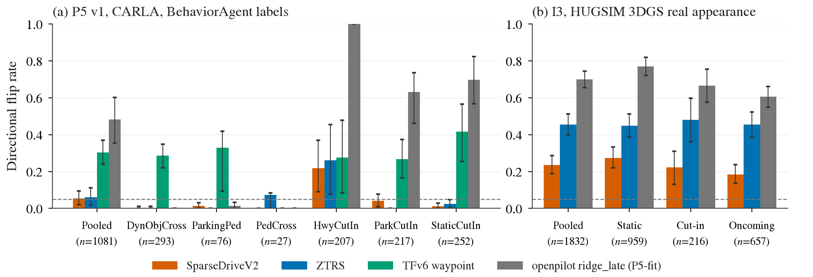

# 多榜前 10 交集：哪些方法族在多个榜上都靠前，装机 smoke，考试预登记

状态: draft（榜单汇总、装机与 smoke 已完成；**考试一个都没跑**，交给中央执行员按下文预登记执行）
主题: ../research/leaderboard-vs-ability.md
前提: [hack 审计](2026-09-24-hack-audit/README.md)、[榜单文本分析](2026-09-24-leaderboard-text-analysis/README.md)（204 个跨榜分数）、decisions 第 35、38 条
附件: [boards.md](2026-09-26-top10-intersection/boards.md)（12 张榜逐条前 10 明细）、`2026-09-26-top10-intersection/boards/*.csv`（完整字段，含 notes）、
`2026-09-26-top10-intersection/raw_snapshots/`（HF NAVSIM 榜原始抓取）；smoke 代码 `scripts/top10_smoke/*_smoke.py`，表格生成 `scripts/make_top10_tables.py`

## 目标

用户的判断是：真正好的模型应该在开环榜上都靠前，或者开环、闭环都靠前。之前的审计每个榜只取了前 4–7，且漏了几个榜的第一名。
这里把 8 类榜单（12 张子榜）都放大到前 10，按方法族（同一代码库，或同一作者组的衍生）求交集，挑出 ≤ 6 个值得研究的族，
把其中代码 + 权重开源、box 上还没有的装好并 smoke，最后给出进我们考卷的预登记方案。

## 0. 一页结论

1. **上次漏掉的第一名**（全部本次补齐，出处见第 1 节）：Bench2Drive 是 BridgeDrive（96.34，2026-09-24 才进官方榜），不是 TFv6；
   NAVSIM v1 与 navhard 的 HF 官方榜第一是匿名队 EABOT.AI&NJU（95.61 / 58.63），可查身份的是 FPD-Drive-Pro（95.57 / 58.07），TOAD 实际第 8；
   WOD-E2E 是 ZSD-Titan（8.1667），DriveMA-4B 第 5，RAP 掉出前 10；CARLA LB2 MAP 赛道是 Kyber-E2E（12.455）；HUGSIM 是 DriveZero-Scale（46.6，但与 WA-JEPA 的 436 场景协议不同，同协议下第一仍是 WA-JEPA）。
   漏统计的根因是上次用 sota2 转录和论文表，没有直接拉官方榜的 JSON（HF competition space、Waymo 页面、Bench2Drive README、leaderboard.carla.org）。
2. **没有一个族同时在「真实数据开环」和「CARLA 闭环」两类榜上都稳居前 10。** CARLA 系（B2D / Longest6 / LB2）由 TransFuser-LEAD 和 SimLingo 两族主导；
   真实数据系（NAVSIM / HUGSIM / WOD）被 DrivoR 系和 AFARI（WA-JEPA）占据；nuScenes 前 10 与其他所有榜零交集；nuPlan 三榜全是吃 GT 目标 + 地图的 planner，与传感器榜零交集。
   唯一两边都挂名的是 SparseDrive（B2D #10、navtest-v2 #7，但 B2D 版本读 CARLA 真值位姿）。**跨榜交集主要由训练数据和输入契约决定**，不是能力的直接信号。
3. HUGSIM 前 10 几乎全是 navtrain 上训、零样本进 HUGSIM 的 NAVSIM 模型，所以「NAVSIM + HUGSIM 双榜」不是两份独立证据；它是唯一一个真实外观的闭环，仍有价值。
4. 建议研究的 6 个族（第 3 节）：**DrivoR 系、AFARI（WA-JEPA）、TransFuser-LEAD（TFv6 + BridgeDrive）、SimLingo（SimLingo + BLUE）、SparseDrive、NVlabs Hydra（ZTRS，作对照）**。
   本次新装 6 个模型，全部装通并在真实输入上 smoke 过：DrivoR、WA-JEPA、SparseDriveV2、ZTRS、BridgeDrive、BLUE（第 4 节）；TFv6、SimLingo、Alpamayo 1.5、openpilot、AutoVLA 核对能跑。

## 1. 各榜前 10（2026-09-26 快照）

每格是名次对应的方法，括号里是族的缩写；`*` 表示无代码或无权重。逐条的分数、日期、出处、代码 / 权重、license、输入、hack 机制、是否本次新补在 [boards.md](2026-09-26-top10-intersection/boards.md)。
族缩写：**DR** = DrivoR 系（valeo DrivoR/TOAD，及在其架构 / 代码上衍生的 Xiaomi DriveZero、Mila Gigapixel-DrivoR、NUS NTR）；**AF** = AFARI（WA-JEPA / ChainFlow-VLA / CoWorld-VLA）；
**LEAD** = TransFuser-LEAD（TF++、TFv5/v6、LTF、BridgeDrive，及他组衍生的 LTFv7）；**SL** = SimLingo（SimLingo / CarLLaVA、BLUE，及按数据 / agent 归入的 LinkVLA、FIVE-VLA、SteerVLA、RoG-DAgger、TakeVLA）；
**SD** = SparseDrive；**HY** = NVlabs Hydra（Hydra-MDP / GTRS / ZTRS）；**FPD** = FPD-Drive（NIO/HKUST）；**UV** = UniAD/VAD 系；**ZR** = Zeron；**MA** = DriveMA；**VAIL** = 基于 Alpamayo 1.5 的 VAIL；**anon** = HF 匿名队。

| 榜（主指标，出处） | #1 | #2 | #3 | #4 | #5 | #6 | #7 | #8 | #9 | #10 |
|:--|:--|:--|:--|:--|:--|:--|:--|:--|:--|:--|
| nuScenes 开环（avg L2，各论文表；协议不统一，全部用了 ego status） | IK-VLA* 0.06† | OWMDrive* 0.18 | AutoDrive-R² 0.19 | Senna*(UV) 0.22 | Reasoning-VLA* 0.22 | SparseOccVLA 0.23 | EvoDriveVLA 0.26 | ORION+plug-in* 0.26 | VLA-World* 0.26 | DiMA+*(UV) 0.27 |
| WOD-E2E test（RFS，[官方榜](https://waymo.com/open/challenges/2025/e2e-driving/) JSON） | ZSD-Titan*(ZR) 8.167 | ZSD*(ZR) 8.090 | PlusAI-WorldVLA* 8.087 | VAIL+*(VAIL) 8.082 | DriveMA-4B*(MA) 8.079 | DriveMA-2B(MA) 8.075 | VAIL*(VAIL) 8.061 | Zero-1*(ZR) 8.048 | NTR ens.*(DR) 8.046 | TTVLM* 8.043 |
| NAVSIM v1 navtest（PDMS，[HF 榜](https://huggingface.co/spaces/AGC2024-P/e2e-driving-navtest)） | EABOT*(anon) 95.61 | FPD-Drive-Pro*(FPD) 95.57 | CooWAIM*(anon) 95.43 | minfish*(anon) 95.37 | DriveZero-Scale*(DR) 95.31 | iDriveVLA*(anon) 94.95 | EvaDrive* 94.9 | TOAD+DrivoR(DR) 94.88 | FPD-Drive*(FPD) 94.88 | ChainFlow-VLA(AF) / TransDiffuser* 94.85 |
| NAVSIM v2 navhard two-stage（EPDMS corrected，[HF 榜](https://huggingface.co/spaces/AGC2025/e2e-driving-navhard)） | EABOT*(anon) 58.63 | FPD-Drive-Pro*(FPD) 58.07 | CooWAIM*(anon) 57.61 | guest9527*(anon) 57.41 | Aqua10086*(anon) 57.41 | zzzzz*(anon) 57.24 | DriveZero-Scale*(DR) 56.81 | TOAD+DrivoR(DR) 56.51 | FPD-Drive*(FPD) 55.87 | DriveFuture* 55.5 |
| NAVSIM v2 navtest（EPDMS，只有论文自报，无官方榜） | WA-JEPA(AF) 91.7 | NTR*(DR) 90.9 | BeyondDrive 90.5 | CLOVER / Discrete-WAM* 90.4 | — | SimWAM 90.2 | SparseDriveV2(SD) / READ* / LTFv7(LEAD) 90.1 | — | — | CoWorld-VLA(AF) 90.0 |
| Bench2Drive（DS，[官方榜](https://github.com/autonomousvision/Bench2Drive-Leaderboard)） | BridgeDrive(LEAD) 96.34 | TFv6(LEAD) 95.28 | LinkVLA*(SL) 91.01 | FIVE-VLA*(SL) 90.95 | SteerVLA*(SL) 90.71 | BLUE(SL) 90.58 | RoG-DAgger*(SL) 90.34 | TakeVLA*(SL) 89.72 | AutoMoT+ (部分开源) 89.42 | SparseDriveV2(SD) 89.15 |
| Longest6 v2（DS，论文表；只找到 7 个学习式传感器方法） | TFv6(LEAD) 62 | RoG-DAgger*(SL) 44 | CLEAR* 39.89 | BLUE(SL) 36 | TFv5/TF++(LEAD) 23 | SimLingo(SL) 22 | HiP-AD 7 | — | — | — |
| CARLA LB2 官方 test（DS，[leaderboard.carla.org](https://leaderboard.carla.org) JSON；SENSORS / MAP） | S: CarLLaVA(SL) 6.87；M: Kyber-E2E* 12.46 | S: TF++(LEAD) 5.18；M: CarLLaVA(SL) 6.25 | S: CaRINA* 1.23；M: TF++(LEAD) 5.56 | 其余为匿名或 < 3 DS | | | | | | |
| nuPlan Val14（CLS-NR；吃 GT 目标 + 地图） | Mosaic 95.56 | LAP* 95.03 | CarPLAN* 95.0 | FlowDrive* 94.81 | Plan-R1* 94.72 | CoPlanner* 94.45 | CaRL 94.38 | EMoE* 94.35 | Flow Planner 94.31 | Diffusion Planner 94.26 |
| nuPlan Test14-hard（CLS-NR） | CarPLAN* 82.2 | FlowDrive* 81.86 | EMoE* 80.96 | G2DP* 80.76 | SDD* 80.32 | BIBeR* 80.30 | EMoE w/o post* 80.12 | PLUTO 80.08 | G2DP w/o refine* 80.05 | DFP-FM* 79.43 |
| interPlan（score） | RAD-LAD* 74 | RAD（规则）72 | TerraZero* 70.87 | SAH-Drive 64 | SPDM（规则）63.66 | Diffusion-ES* 57.41 | BIRDriver* 55.29 | Mosaic 54.1 | HybridLLMPlanner* 53 | PLUTO 48.92 |
| HUGSIM（HD-Score ×100；至少 3 种协议） | DriveZero-Scale*(DR) 46.6 | WA-JEPA(AF) 44.62‡ | DriveZero*(DR) 39.4 | Gigapixel-DrivoR*(DR) 38.5 | DrivoR+SimScale(DR) 38.1 | DrivoR(DR) 35.7 | ZTRS(HY) 32.9 | UniAD(UV) 32.7 | MM-Future* 32.3 | Latent-WAM* 28.9 |

† IK-VLA 的 1 s L2 = 0.04 m，且只评了 5869/6019 个样本，基本可判无效；可信度高的第一是 OWMDrive 0.18（无代码），有代码 + 权重的最好是 SparseOccVLA 0.23。
‡ WA-JEPA 用 436 场景加权平均且修过 HUGSIM 控制器（审计 HUG-WA-001），DriveZero / DrivoR 用 345 场景协议，数字不直接可比；同一个 UniAD 在三种协议下是 32.7 / 31.24 / 28.9。

**本次新补**（相对 204 个跨榜分数 + 审计抽样）：nuScenes 前 10 里 8 个、WOD 前 10 里 7 个、NAVSIM v1 前 10 里 10 个、navhard 前 10 里 8 个、navtest-v2 大部分、
B2D 的 BridgeDrive / TakeVLA / AutoMoT+、Longest6 的 CLEAR 与 BLUE 分数、LB2 的 Kyber-E2E 12.455 与匿名条目、nuPlan 三榜全部（base 里没有 nuPlan）、HUGSIM 的 DriveZero 系 / ZTRS / MM-Future / Latent-WAM。
逐条 `new` 列见 [boards.md](2026-09-26-top10-intersection/boards.md)。

**读这张表要记住的口径问题**（逐条出处在 CSV 的 notes 列）：
- NAVSIM v1 有 9 个学习式条目超过 human 94.8；能查到机制的新条目（FPD-Drive、DriveZero、ChainFlow、CLOVER、EvaDrive）都用 learned PDM 子分数 scorer 选轨（`metric_proxy_candidate_selection`，依据是论文 / 代码，未正式审计）。
  TransDiffuser 94.85、EvaDrive 94.9 用其自报子分数按公式只能算到约 92.6 / 93.4，存疑。前 10 里 4 个（v1）/ 6 个（navhard）是匿名队，输入是否 non-privileged 无法核验。
- navhard 前 8 个学习式条目全部超过 privileged PDM-Closed 56.6（上一轮的 v2 榜首判断「PDM-Closed #1」因此作废）。
- B2D：SteerVLA 论文 90.71、官方榜四舍五入为 91；SimLingo / BLUE 自带评测器注释掉了 4000-tick 截断（simlingo#44），BLUE 另把完成阈值改为 90%（官方 99%，`atomic_criteria.py:1553`）；
  BridgeDrive 用 route + target speed 控车并带 creep（`sensor_agent_bridgedrive.py:840-905`）；SparseDriveV2 的 B2D agent 读 CARLA lidar actor 真值位姿（`sparsedrive_b2d_agent.py:360-361`，审计 B2D-SPARSE-001 由本次代码复核确认）。
  B2D 第 2–10 名总分差 < 7 DS，按第 38 条单次噪声 ±2.3 DS，名次本身多数分不开。
- CarLLaVA 就是 SimLingo-BASE，上次把 SENSORS 6.87 与 MAP 6.25 当成两个方法。Kyber-E2E 12.455 这次提交无文档，是模块化栈不是 E2E。
- WOD 新条目全部只有榜单行（无论文、无代码），single / ensemble、是否拿 RFS 当奖励都不知道；能确认拿 RFS 当奖励的只有 DriveMA（审计 REAL-WOD-001）和 Poutine（论文）。
  2025 挑战赛的奖项不按 RFS 排（1st UniPlan 7.779），Poutine 7.986 是截止时最高分但只拿 special mention。
- nuScenes 前 10 **全部用了 ego status**；纯 ego 的 AD-MLP 就有 0.29，所以 0.29 以下的差距要先扣掉 ego prior（第 35 条 (a)）。不用 ego 的最好是 GeRo 0.27。
- nuPlan 前排几乎全是 hybrid（学习式候选 + PDM 式规则 scorer / refine），纯学习且无后处理的只有 CaRL（Val14 #7）和 TerraZero（interPlan #3）；R2LPL 83.51 在测试场景上做 rollout 更新，没排名。

## 2. 交集：方法族 × 榜单

格子里是该族最好成员的名次（同族多条列前两个）；「—」是不在前 10。开环 = nuScenes、WOD、NAVSIM v1、navhard、navtest-v2；闭环 = B2D、Longest6、LB2、nuPlan（三张子榜算一个）、HUGSIM。
排序：先按上榜总数，同数按「代码 + 权重开源」优先。「开源」指该族至少一个前 10 成员两者都有。

| 族（代表成员） | nuSc | WOD | v1 | navhard | navtest-v2 | B2D | L6 | LB2 | nuPlan | HUGSIM | 开环 | 闭环 | 开源 | box |
|:--|:--|:--|:--|:--|:--|:--|:--|:--|:--|:--|--:|--:|:--|:--|
| **DR** DrivoR 系（DrivoR / TOAD；DriveZero*、Gigapixel*、NTR*） | — | 9 | 5, 8 | 7, 8 | 2 | — | — | — | — | 1, 3 | **4** | 1 | 是（valeo DrivoR / TOAD；衍生成员都没有权重） | DrivoR 本次新装 |
| **LEAD** TransFuser-LEAD（BridgeDrive、TFv6、TF++；LTFv7） | — | — | — | — | 7（LTFv7，他组衍生） | 1, 2 | 1, 5 | S2 / M3 | — | — | 1 | **3** | 是 | TFv6 已有；BridgeDrive 本次新装 |
| **SL** SimLingo（BLUE、SimLingo/CarLLaVA；5 个无代码成员） | — | — | — | — | — | 3, 4 | 2, 4 | S1 / M2 | — | — | 0 | **3** | 是（SimLingo、BLUE） | SimLingo 已有；BLUE 本次新装 |
| **AF** AFARI（WA-JEPA、ChainFlow-VLA、CoWorld-VLA） | — | — | 10 | — | 1, 10 | — | — | — | — | 2（436 协议下 1） | 2 | 1 | 是 | WA-JEPA 本次新装 |
| **FPD** FPD-Drive（NIO/HKUST） | — | — | 2, 9 | 2, 9 | — | — | — | — | — | — | 2 | 0 | 否（仓库只有 README） | — |
| **SD** SparseDrive（SparseDriveV2） | — | — | —（92.2，第 20 名外） | — | 7 | 10 | — | — | — | — | 1 | 1 | 是（NAVSIM 与 B2D 两套权重） | NAVSIM 版本次新装；B2D 版未装（mmcv 1.7 / torch 2.0 栈） |
| **UV** UniAD/VAD 系（UniAD；Senna*、DiMA+*） | 4, 10 | — | — | — | — | — | — | — | — | 8 | 1 | 1 | 部分（UniAD / VAD 原版 nuScenes 权重；前 10 的衍生成员无） | — |
| **HY** NVlabs Hydra（ZTRS、GTRS） | — | — | — | 第 15（去掉匿名队后第 10） | — | — | — | — | — | 7 | 1（弱） | 1 | 是 | ZTRS 本次新装 |
| **anon** EABOT / CooWAIM（HF 匿名） | — | — | 1, 3 | 1, 3 | — | — | — | — | — | — | 2 | 0 | 否 | — |
| **VAIL**（基于 Alpamayo 1.5 + Qwen3-VL） | — | 4, 7 | — | — | — | — | — | — | — | — | 1 | 0 | 否（底座 Alpamayo 1.5 开源） | Alpamayo 1.5 已有 |
| **ZR** Zeron（ZSD、Zero-1） | — | 1, 2 | — | — | — | — | — | — | — | — | 1 | 0 | 否 | — |
| **MA** DriveMA | — | 5, 6 | —（91.2） | — | — | — | — | — | — | — | 1 | 0 | 是（仅 2B） | — |
| nuPlan planner 各族（KIT FlowDrive/Mosaic、CarPLAN、EMoE、PLUTO、Diffusion Planner、G2DP、RAD-LAD、autonomousvision PDM / CaRL） | — | — | — | — | — | — | — | — | 各 1–3 张子榜 | — | 0 | 1 | 部分 | —（输入是 GT 目标 + 地图，不吃传感器） |
| 只上一个榜的其余方法（nuScenes 8 个、WOD 3 个、v1 4 个、navtest-v2 5 个、B2D AutoMoT+、L6 CLEAR / HiP-AD、HUGSIM 2 个） | | | | | | | | | | | 1 | 或 1 | 多数否 | — |

**读法**

- **开环、闭环都靠前的族：严格意义上没有。** 若把 HUGSIM 算闭环，DR、AF、HY、UV 四族算「两边都有」；但 HUGSIM 前 10 除 UniAD 外全是 navtrain 上训的 NAVSIM 模型零样本迁过去的，
  和 NAVSIM 共享训练数据、相机契约和 PDM 式评分（HD-Score 本身就是 NC × DAC × (TTC, C)），所以它更像 NAVSIM 的「真实外观、会反应的版本」，不是一个独立的能力来源。
  若只认 CARLA 闭环，两边都挂名的只有 SD（B2D #10 + navtest-v2 #7），而它的 B2D 版读真值位姿，LEAD 在开环上只靠他组衍生的 LTFv7 挂名（LEAD 自己的 LTFv6 是 v1 85.4 / navhard 28.3）。
- **只在一类榜上靠前的族**：CARLA 闭环由 LEAD 与 SL 两族主导（B2D 前 8 名全是这两族、Longest6 前 7 名里 5 个、LB2 两条赛道端到端方法的前两名），这两族在所有真实数据榜上都不在前 10；
  真实数据开环被 DR、AF、FPD 与匿名队占据；WOD 的前 10 与 NAVSIM 只共享 DR（NTR）；nuScenes 前 10 与其余所有榜零交集，而且全部靠 ego status。
  所以「多榜靠前」首先是「训练数据属于哪个生态（CARLA 专家数据 / nuPlan-navtrain / WOD / nuScenes）」，其次才可能是能力。第 35 条 (b)「跨榜排序只在同代码族内和代际分层上一致」在前 10 的尺度上仍然成立。
- **多榜覆盖最广的 DR 系，也是配方证据最多的一族**：它的成员全部靠 learned PDM 子分数 scorer 选轨；TOAD 的 CEM 在 v2 上把 5 个基座都收敛到 49–56（第 35 条），DrivoR 的长目标 v1 +0.6 / v2 −1.6（审计 NAV1-DRIVOR），
  NAVSIM 顶部 4 分基本是配方。它的多榜覆盖可能主要是「同一个 scorer 在同一套 PDM 式公式上反复拿分」。这正是要用我们的配对考卷去分开的。

## 3. 建议研究的 6 个族与理由

| # | 族（我们用的成员） | 为什么选 | 能力的证据 | 配方 / hack 的证据 | 要回答的问题 |
|:--|:--|:--|:--|:--|:--|
| 1 | **DR**（DrivoR v1 ckpt，可选 TOAD） | 上榜最多（开环 4 + HUGSIM）、衍生成员占 HUGSIM 第 1/3/4 | DrivoR SimScale 合成困难场景 +6.3 EPDMS（W1，C 级，预算未配平）；衍生 DriveZero 在 HUGSIM 零样本第一 | scorer 选轨、v2 手工改权、交集 warmup 调参、长目标（审计 3 个 `yes`）；TOAD 收敛 49–56 | 多榜覆盖在我们的 E 层配对（P5 v1 / I3）上还剩多少：scorer 会不会对突发车辆 / 行人翻转 |
| 2 | **AF**（WA-JEPA） | navtest-v2 第一、HUGSIM 436 协议第一、v1 靠 ChainFlow 进前 10；唯一「表征驱动」的多榜族 | V-JEPA 2 预训练 +5.7–6.4 PDMS（W1，C）；无 hack finding | HUGSIM 分数是在修过的控制器上跑的（HUG-WA-001），不能与原版控制器 baseline 直接比 | 视频预训练的世界模型在配对考卷上是否比 scorer 族更会反应；和我们第 24 条「V-JEPA 2 效应在 train split 上没活下来」对照 |
| 3 | **LEAD**（TFv6 已有 + BridgeDrive） | CARLA 三榜第一（B2D 1–2、Longest6 1、LB2 前 3） | TFv6 waypoint 通道 P5 翻转 39% / 按对 73%（第 32 条）；LiDAR +3.1 DS、SR +6.1 | route + target speed 接口 +14.3 DS（第 31 条）；拿分通道只翻 2%；BridgeDrive 同样用 route + target speed + creep 控车 | BridgeDrive 的 +1 DS 是网络（diffusion bridge）还是接口；它的 waypoint / target speed 两通道各翻多少 |
| 4 | **SL**（SimLingo 已有 + BLUE） | CARLA 三榜第 2 梯队且成员最多；**BLUE 是第 38 条里唯一在突发 hazard 上显著更好的方法**（SR 93.8%，比 SparseDriveV2 高 18.5 [7.7, 29.2]） | BLUE gate +5.51 DS / SR +8.91（W1，B 级） | 一半来自「关掉语言」；评测器删 4000-tick 截断、完成阈值 90%、creep；simlingo#43 DS +11 而 SR 不变 | BLUE 的突发 hazard 优势在 P5 配对上是否复现；gate 是否在 hazard 帧上改变输出 |
| 5 | **SD**（SparseDriveV2 NAVSIM 版） | 唯一在真实数据开环（navtest-v2 #7）和 CARLA 闭环（B2D #10）都进前 10、两套权重都公开的族 | 词表打分式规划，参数 50M，14 ms | B2D 版读真值位姿（B2D-SPARSE-001，本次复核确认）；标题即「Scoring is All You Need」 | 同一族在两个生态里的反应能力是否一致（先考 NAVSIM 版，B2D 版按需另装） |
| 6 | **HY**（ZTRS，对照） | HUGSIM #7、navhard 去匿名后 #10，GTRS 自述为 CVPR 2025 NAVSIM 挑战赛冠军（分数未查到；HF 2025 私榜第一是 SimpleVSF 53.06，两者关系未核） | — | **只用 PDM 奖励训练（EPO 策略梯度，无模仿）**，固定 8192 / 16384 条词表 + 8 个子分数头选轨（本次代码确认） | 纯指标训练、完全没有人类轨迹的 policy 有没有 E 层反应：是 scorer 族的「配方上限」对照 |

没选的：FPD-Drive、DriveZero、Zeron、匿名队（都没有代码或权重；**DriveZero 若放出 NAVSIM / HUGSIM 权重应补进 DR 族**）；UniAD/VAD（B2D 只有 42–46 DS，代际落后）；DriveMA（只上 WOD 一个榜，且 RFS 当奖励，审计 REAL-WOD-001）；
nuPlan planner（不吃传感器，进不了我们的考卷）。Alpamayo 1.5 与 openpilot 不在任何前 10 里，但 VAIL（Alpamayo 1.5 + Qwen3-VL）在 WOD 第 4 / 7，与第 34 条「Alpamayo 在 WOD 上超过 ego-only」方向一致。

## 4. 装机与 smoke（2026-09-26 09:00–09:50，全部是新的独立 env，没动已有 env）

所有 env 都是 `~/data/envs/<name>`（uv venv；box 上已有 env 都是 uv venv，照同一惯例），代码在 `~/data/third_party/<name>`，权重在 `~/data/models/<name>/`，smoke 输出在 `~/data/runs/top10_smoke/<name>/<时间>/summary.json`。
latency 口径同 [docs/baselines.md](../docs/baselines.md)：batch 1，5 次 warmup + 20 次计时，`torch.cuda.synchronize()`；计时范围写在表里（都不含 CPU 端特征构建）。测时各卡多为空闲，所以是偏乐观的数字。

| 模型 | env / 代码 commit | checkpoint（来源，license） | 装机耗时 | 依赖冲突与处理 | smoke 样本与结果 | latency mean / p50 / p95（范围） | 峰值显存 |
|:--|:--|:--|:--|:--|:--|:--|:--|
| DrivoR | `drivor`，py3.10 torch 2.8 cu128；valeoai/DrivoR `fc6e5aa` | `drivor_Nav1_25epochs.pth`（[release](https://github.com/valeoai/DrivoR/releases/tag/model_weights)，PDMS 93.7 那一行；Apache-2.0）+ timm ViT-S DINOv2 reg4 | 约 10 min（env 69 s） | 上游 py3.9/torch 2.1 → torch 2.8 直接能跑；无编译扩展；GitHub release 直连卡住，走 Clash | navtest `0f206a62842b59b2`：ADE 0.20 m、FDE 0.19 m（CV 2.89 m） | 85 / 90 / 92 ms（`agent.forward`，fp32）；特征构建 136 ms CPU | 0.48 GB |
| WA-JEPA | `wajepa`，py3.10 torch 2.14 cu130；AFARI-Research/WA-JEPA `bec2966` | `model_state_dict.pt` 1.58 GB（[HF](https://huggingface.co/AFARI-Research/WA-JEPA)，Apache-2.0）；自带 V-JEPA 2.1 encoder，缓存里的 V-JEPA 2 用不上也不需要 | 约 12 min | navsim 钉的 torch 2.0.1 / numpy 1.23.4 去掉，navsim、nuplan-devkit `--no-deps` | navtest `8781cde1032354cb`：ADE 0.67 m、FDE 1.97 m | NAVSIM 评测路径（fp32）614 / 549 / 867 ms；HUGSIM 路径（bf16 autocast）151 / 151 / 152 ms | 3.7 / 4.7 GB |
| SparseDriveV2 | `sparsedrivev2`，py3.10 torch 2.8 cu128；swc-17/SparseDriveV2 `696ef77` | `sparsedrive_navsimv1_92p2.ckpt`（[HF](https://huggingface.co/wenchaosun/SparseDriveV2)，Apache-2.0） | 约 12 min（env 376 s） | 编译 deformable_aggregation（`TORCH_CUDA_ARCH_LIST=12.0`）一次过；torch 2.8 的 `weights_only` 需手动 load | navtest `b111bb8716b756d2`（9.1 m/s）：ADE 2.75 m、FDE 6.41 m，方向对、速度偏保守（第二个 log 2.73 m 同样） | 13.8 / 13.8 / 14.0 ms（`agent.forward`）；特征 84 ms CPU | 1.0 GB |
| ZTRS | `gtrs`，py3.10 torch 2.8 cu128；woxihuanjiangguo/ZTRS `50a52f2`（仓库也含 GTRS / Hydra-MDP） | `ztrs_vov.ckpt` 958 MB（[HF](https://huggingface.co/Zzxxxxxxxx/ZTRS)，Apache-2.0）；V2-99 init 取 HF 同源副本 | 约 5 min | 不装 xformers，补 diffusers；nuplan-devkit 用本地 v1.2 | navtest `ff8c1dd3f49254f6`（3.0 m/s 加速）：8192 词表 ADE 2.98 m（CV 3.89 m），直行但偏慢 | 68 / 68 / 69 ms（原样，含一次只进 loss 的 t−0.5 s 前向；去掉后 34 ms，输出逐位相同） | 0.87 GB |
| BridgeDrive | `bridgedrive`（复制 scout-tfv6 的 freeze + einops）；BridgeDrive `85aa089` + 作者钉的 lead `a41d116` | `model_BridgeDrive_m2_k60_0030.pth`（[HF](https://huggingface.co/liushu-ethz/BridgeDrive)，README 称 m2 更好；**哪个变体对应 96.34 未写明；仓库无 LICENSE 文件**） | 约 17 min | 无编译扩展；作者代码 3 处 bug 用运行时 shim 绕过（GPU 名单、未定义的 `debug_mode`、anchor 路径） | 自跑 B2D 路线 26966（Town05，路口右转）254 tick，RC 100%；dump 两帧离线前向：ADE 0.25 / 0.66 m（对照是它自己开出的路径，只是自洽性） | 118–131 ms（`ClosedLoopInference.forward`，含 20 步 ODE bridge 与两个 PID）；每 tick 含预处理 381 ms | 1.5 GB |
| BLUE | `blue`（照搬 simlingo env 的 90 条 pin）；George-Ling3/BLUE `6970cb6` | 仓库自带 `gate/weights/blue_simlingo_gate.pt`（sha256 对上，Apache-2.0）+ 已缓存的 SimLingo ckpt | 约 1 min（全部命中 uv cache） | 无；gate .pt 在 torch ≥ 2.6 下需 `add_safe_globals` | 自开 CARLA Town10HD 抓一帧（红灯前 4.7 m/s）：gate 0.032 → 关语言、直出动作，预测 2.8 m 内停车（autopilot 1.36 m），ADE 1.22 m | 95 / 94 / 97 ms（gate 判直出）；强制开语言 658 ms；预处理 60 ms | 2.2 GB |

作者代码里的附带发现（都会影响考试怎么读，出处是本次代码复核）：
- BridgeDrive 的 ODE 采样把第 10 个 route 点的 y 恒置 0（`model_diffusion_head_ddbm.py:371,383`），route 与 waypoint 两个 head 共用同一组 decoder query（`planning_decoder_bridgedrive.py:171-178`，自增被注释）；
  控车用 route + target speed，P(target speed = 0) > 0.9 时强制刹车（`open_loop_inference_bridgedrive.py:113`），creep 默认开、停牌规则默认关（`config_closed_loop.py:59,67`）。
- BLUE 的直出分支要做两次完整 prefill（一次给 gate，一次带驾驶 token）；creep：静止 800 tick 后强制油门 ≥ 0.4 共 15 帧（`agent_simlingo.py:864-877`）。
- ZTRS 选轨公式（`HydraTrajHead.forward`）：0.05·log softmax(rl) + 0.5·log σ(TLC / NC / DAC / DDC 各项) + 8·log(5σ(TTC) + 5σ(EP) + 5σ(LK))，comfort 预测了但不用。
  它的 checkpoint README 写 EPDMS 45.5，是旧协议；HF 榜 48.1 是修复后协议（boards 里两者分列）。
- WA-JEPA 的 NAVSIM 评测路径没读 config 里的 `tf32: true`（推测是 fp32 慢 4 倍的原因，未验证）。

**已在 box 上的模型只核对能跑**（2026-09-26 10:00 前后）：TFv6（`envs/scout-tfv6`，torch 2.8 cu128，CUDA 可用；最近一次闭环 `runs/tfv6_rules/B1.rep0`，09-25）、
SimLingo（`envs/simlingo`，transformers 4.46.3；`runs/simlingo-catalogue`，09-25）、Alpamayo 1.5（`third_party/alpamayo1.5/.venv` import 通过；`runs/wod_zeroshot`、`runs/navsim_zs` 里有 09-24 的 alpamayo run）、
openpilot（`envs/openpilot`，onnxruntime 1.30 带 TensorRT EP；`runs/p5_openpilot`，09-26 01:14）、AutoVLA（`envs/autovla`，torch 2.8 cu128）。都没有重新推理。

## 5. 考试预登记（交给中央执行员；**本文件不跑任何考试**）

### 5.1 每个模型进哪几张卷

| 模型 | P5 v1 BA 集配对翻转 | I3 HUGSIM 车辆配对 | WOD-E2E val 零样本 | NAVSIM navtest devkit | nuScenes |
|:--|:--|:--|:--|:--|:--|
| DrivoR | 进（缺后视：B0 槽喂黑图，标「适配折中」） | 进（先补渲 CAM_BACK，见 5.2） | 进 | 进（复现 PDMS 93.7；v2 ckpt 复现 EPDMS） | 进（需补解压 CAM_BACK） |
| WA-JEPA | 次要（缺后视 + 0.5 s 历史不在 5 Hz 网格上，标「domain 混杂」） | 进（补渲 CAM_BACK + 10 Hz） | 进 | 进（复现 navtest EPDMS 91.7，用它的评测路径原样） | 进（需补解压 CAM_BACK） |
| SparseDriveV2 | **进，契约直接对得上** | **进** | 进 | 进（复现 PDMS 92.2） | 进 |
| ZTRS | **进** | **进** | 进 | 进（复现 navhard EPDMS 48.1） | 进 |
| BridgeDrive | 进，但要**重录**：P5 recorder 只存了 TFv6 的输出（`tf_*` 列），没存 TFv6 rig 的原始输入 | 不进（LiDAR + 4 radar 契约） | 不进 | 不进 | 不进 |
| BLUE | 进，同样要重录（单前视 1024×512、FOV 110） | 不进 | 不进（单前视 110° 与 WOD 47° 针孔差太多） | 不进（BLUE 自报的 NAVSIM 87.0 不是这个 agent） | 不进 |

BridgeDrive 与 BLUE 另建议一项闭环：Bench2Drive 官方 220 路线，**用官方评测器（保留 4000-tick 截断、完成阈值 99%）**，与它们自带目录各跑一次（第 35 条 7.4 的实验 2，BLUE 属于 SimLingo 系）。这一项不在本文件的判据范围内，另立 todo。

### 5.2 输入契约怎么对到我们的记录

| 记录 | 我们有什么 | 对 NAVSIM 式模型（DrivoR / WA-JEPA / SparseDriveV2 / ZTRS） | 对 CARLA 原生模型（BridgeDrive / BLUE） |
|:--|:--|:--|:--|
| P5 v1 BA（`$DATA_DIR/runs/p5v1/gen-ba/attempts/<route>/<n>/cams/<front,front_left,front_right>/<frame>.jpg`，索引 `processed/carla_p5v1_ba`） | 5 Hz、Waymo 式标定三路前视（左右 ±45°）；past / future 为 P4 / WOD 约定 | f0 ← front，l0 / r0 ← front_left / front_right（nuPlan 的 L0 / R0 约 ±55°，视角差预登记为适配损失）；SparseDriveV2 按真实标定喂 `projection_mat`；ZTRS 用它的裁剪拼接规则拼全景；DrivoR 的 B0 与 WA-JEPA 的 back 喂黑图。命令：route intent → NAVSIM 4 维 one-hot（left / straight / right / unknown）；ego vx, vy, ax, ay 取自 `past.npy`。WA-JEPA 的 4 帧 0.5 s 历史取最近的 5 Hz 帧（t, t−0.4, t−1.0, t−1.4 s，最大误差 0.1 s） | 5 Hz 三路图用不上。按 TFv6 shadow 的方式在 recorder 上挂它们自己的 rig **重录**：BridgeDrive = 3×384² FOV 60 相机（yaw ±54.5°）+ 2 LiDAR + 4 radar + 3 个 target point，要用作者钉的 lead `a41d116`；BLUE = 单前视 1024×512 FOV 110（x = −1.5, z = 2.0）+ 2 个 target point + 速度文本。P5 生成是确定性的（v0 的确定性检查），重录同一批 322 个 run |
| I3（`processed/hugsim_pairs/scenes/<key>/<world>/cams/<front,front_left,front_right>/<frame>.jpg`） | 5 Hz、800×450、HUGSIM 前三路，原点在前相机 | 同上映射；DrivoR / WA-JEPA 需要后视：I3 渲染器按 HUGSIM rig 补渲 CAM_BACK（WA-JEPA 自己的 HUGSIM 适配器就用 CAM_BACK），WA-JEPA 另需 0.5 s 间隔的历史，建议整体重渲为 10 Hz 四路；输出轨迹从后轴换到前相机原点 | 不适用 |
| WOD-E2E val（479 rater 帧 + ADE-extra，10 Hz，8 路针孔） | FRONT、FRONT_LEFT/RIGHT（±45°）、SIDE（±90°）、REAR 全有；intent 命令 | F0 ← FRONT，L0 / R0 ← FRONT_LEFT / RIGHT（或按 Alpamayo 适配器的纯旋转重投影到 ±55°，二选一，跑前写死），B0 ← REAR；2 Hz 历史从 10 Hz 精确取帧；intent → 4 维 one-hot；ego 取自 WOD 的 4 Hz 历史。**这些模型只出 4 s（2 Hz 或 10 Hz），RFS 要 5 s 点：预登记用最后两点匀速外推到 5 s**，这是已知对它们不利的折中 | 不适用 |
| NAVSIM navtest / navhard | 原生 | 原生；它们都是 2 Hz 输入训出来的，第 36、37 条「2 Hz 协议惩罚」只针对 openpilot 这类原生高帧率模型，不适用于这四个 | 不适用 |
| nuScenes val main（4636） | 关键帧 2 Hz；box 上只解压了 FRONT / FRONT_LEFT / FRONT_RIGHT / BACK_LEFT / BACK_RIGHT，**没有 CAM_BACK** | F0 / L0 / R0 ← CAM_FRONT / FRONT_LEFT / FRONT_RIGHT（nuScenes 侧前约 ±55°，与 nuPlan 接近）；B0 ← CAM_BACK（先 `scripts/extract_nuscenes.sh trainval samples/CAM_BACK`）；命令沿用 VAD converter 规则（GT 3 s 横向位移，属于 `future_label_conditioning`，与 nuscenes-physicalai 同口径）；ego 取 CAN bus | 不适用 |

输出到考卷量的换算：P5 / I3 的 v2 = 1.75 → 2.0 s 位移 / 0.25 s。2 Hz 输出的模型（DrivoR、WA-JEPA、SparseDriveV2）先对 (0, 0) + 8 个点做三次样条插到 0.25 s 网格再算；ZTRS 是 10 Hz、BridgeDrive / BLUE 的 waypoint 是 0.25 s 间隔，直接算。
BridgeDrive 与 TFv6 一样两个通道都报：waypoint 通道（2 s 处）与 route + target speed 通道（target speed 标量），P5 v1 的「每个考生固定申明读数通道，多通道全部报」照用。BLUE 报 speed waypoints，另记每帧 gate 是否开语言。

### 5.3 判据（照抄现有 todo，不新设门槛）

- **P5 v1 BA 集**：照抄 [p5-v1-e-layer](2026-09-24-p5-v1-e-layer.md) 的「指标与判据」与「读法」：纵向定向翻转率（expert 真反应的帧里，考生 Δ 与 expert 同号且超过考生自己在 null 上的 95 分位数的比例，逐帧与按对各报）、
  横向定向翻转率（只在 expert 横向反应的帧上）、反应类别一致率（4×4 混淆矩阵）、null false-flip；按 family 分报加合并，CI 按路线整组 bootstrap。
  「有 E 层能力」= 纵向或横向翻转率的 CI 下界明显高于它自己的 null false-flip，且反应类别一致率高于 expert 类别分布的随机基线。BA 集为主判定集，PDM-Lite 集只报按对（第 42 条 E4 的决定）。
  judge 是 `p5_exam.exam` 原样。TFv6 规则触发帧单独报的做法推广到 BridgeDrive（creep）与 BLUE（creep）。
- **I3**：照抄 [i3-hugsim-pairs](2026-09-25-reactivity-program/i3-hugsim-pairs.md)「现有考生零样本考试」一节：judge 是 `p5_exam.exam` 原样（去掉 TFv6 列），τ 由 I3 的 24 个 null 场景定，CI 按场景 bootstrap；
  报合并与逐 family（static / cutin / oncoming）的定向翻转、反方向、非反应帧误翻、样本外 null false-flip。一个 family 至少 5 个场景有 reactive 帧才进合并数。只有车辆 family。
- **WOD-E2E val**：照抄 [zeroshot-exam/wod-e2e](2026-09-24-zeroshot-exam/wod-e2e.md) 的「指标与统计」与「怎么判」（对 cv 配对 Δ 的 CI 整体 > 0 / 跨 0 / < 0 三档；≥ logged future 8.13 的 CI 下界），
  并按第 22 条：**主判用 s_ego 第 1–9 档的 ADE，RFS 并排，顶档单独报**。配对对象 cv、logged future、`cls ego`；另加 Alpamayo 1.5 与 openpilot Cinque 的已存逐帧预测作配对行。
- **NAVSIM navtest**：照抄 [zeroshot-exam/navsim](2026-09-24-zeroshot-exam/navsim.md) 的 devkit 版本（v1.1 出 PDMS，main @ 0a380a9 出 EPDMS）、n = 12146、`OPENBLAS_CORETYPE=Haswell`、官方打分原样。
  那份的阈值表（EPDMS ≥ 77 等）是给零样本模型的，这四个模型在 navtrain 上训，阈值自动满足，不作判据；只报与论文值的差，作为复现检查（第 6.1 节的复现差距表口径），不设门槛。
- **nuScenes**：照抄 [zeroshot-exam/nuscenes-physicalai](2026-09-24-zeroshot-exam/nuscenes-physicalai.md) 的指标（VAD / ST-P3 为主，BEV-Planner 口径并报）、main 4636、按 scene 的 bootstrap、「怎么判」表（对 CV 的配对 Δ；≤ AD-MLP；collision CI 跨 0 只报方向）。
  这四个模型都没在 nuScenes 上训，是零样本。

### 5.4 算力估计（GPU·h 按一张 RTX PRO 6000 计；CPU 打分另列）

| 考试 | DrivoR | WA-JEPA | SparseDriveV2 | ZTRS | BridgeDrive | BLUE | 共用的准备 |
|:--|--:|--:|--:|--:|--:|--:|:--|
| P5 v1 BA（离线，观测帧 + null 约 2 万帧） | 0.5 | 1.0（bf16） | 0.2 | 0.4 | 重录内 | 重录内 | 重录：P5 v1 BA 生成原本 322 run、23.6 server·h（`runs/p5v1/gen-ba/summary.json`），挂 shadow 后估 30–35 server·h，按每卡 6 server 约 5–6 卡·h，墙钟约 1.5 h（5 卡 30 server）；两个模型 shadow 前向合计约 1.5 GPU·h |
| I3（约 1 万帧） | 0.3 | 0.5 | 0.1 | 0.2 | — | — | 补渲 CAM_BACK + 10 Hz：原渲染 20 min（4 进程一卡），四路 × 2 倍帧率估 1 GPU·h |
| WOD val（479 + 958 帧） | < 0.1 | 0.1 | < 0.1 | < 0.1 | — | — | 相机映射适配器（按 Alpamayo 适配器改），主要是工程时间 |
| NAVSIM navtest + navhard | 0.5 | 2.5（原样 fp32 路径） | 0.2 | 0.4 | — | — | metric cache 已有；每次 devkit 打分 CPU 10–15 min × 2 |
| nuScenes main | 0.2 | 0.4 | 0.1 | 0.2 | — | — | 解压 CAM_BACK（CPU / IO，约 20–30 min） |
| 合计 | 约 1.6 | 约 4.5 | 约 0.7 | 约 1.3 | 约 3.5（含重录分摊） | 约 3.5 | 约 2 GPU·h + CPU |

总计约 17 GPU·h，另加重录与补渲的约 7 卡·h。除 P5 重录外每项都远低于 3 h 的 profiling 门槛；**P5 重录超过 3 h 墙钟时按 CLAUDE.md 先做 2 对的 profiling**（v0 的流程）。
建议顺序：先做契约直接对得上、最便宜的 SparseDriveV2 / ZTRS 的 P5 + I3（半天内出数），再做 DrivoR / WA-JEPA 的 I3 补渲与 WOD，最后做 BridgeDrive / BLUE 的重录；NAVSIM 复现与 nuScenes 可以插空跑。

### 5.5 这些考试能改变什么（写在数字之前）

- 若 DR / HY（scorer 族）在 P5 与 I3 上的定向翻转不高于它们自己的 null false-flip，而 AF（WA-JEPA）明显更高：多榜覆盖主要是 PDM 式评分器的配方，表征驱动的族才带 E 层能力，第 35 条的判断推广到前 10 的多榜族。
- 若 scorer 族在 I3 车辆配对上也与 openpilot `ridge_late`（70%）同量级：PDM 子分数头学到了对车辆的反应，「scorer = 纯配方」要降级。
- 若 BridgeDrive 的 target speed 通道翻转仍像 TFv6 一样接近 0、waypoint 通道 ≥ 30%：B2D 榜首的增量属于接口与规则，不属于 E 层。
- 若 BLUE 在 P5 v1 突发 family 上显著高于 SimLingo：第 38 条「BLUE 在突发 hazard 上真的更好」从公开逐路线数据升级为我们的配对证据。

## 执行分派（中央执行员）

- 2026-09-26 10:00 CST [main] 按 5.4 的建议顺序拆成三路，插进空出来的卡（用户：谁先完成、卡空了就插谁）：
  T1 = SparseDriveV2 + ZTRS：P5 v1 BA + I3 先出数，再 WOD / NAVSIM 复现 / nuScenes；契约直接对得上，最便宜，现在卡空着就先开，放 GPU 4（与 night-queue-2 B 的零散 GPU 共用）。
  T2 = DrivoR + WA-JEPA：I3 补渲 CAM_BACK + 10 Hz，再 P5 / WOD / NAVSIM / nuScenes；等下一个执行员收工空出卡再开。
  T3 = BridgeDrive + BLUE 的 P5 重录（约 30 个 CARLA server）：等 night-queue-2 A 的 N1 批量结束、CARLA 容量空出来再开。
  各路在本节下写 [T1] / [T2] / [T3] 条目，结果写「结果」。B2D 闭环那一项仍按 5.1 另立 todo，不在这里跑。
- 2026-09-26 10:05 CST [T1] 开工，分步估时（GPU 4 为主，box load ~146，CPU 池子按空余核数开、不超过 12 个 worker）：

  | 步 | 内容 | 墙钟 | GPU·h |
  |:--|:--|--:|--:|
  | 1 | 相机适配器（虚拟 nuPlan 相机渲染）+ navtest 256 token 上的适配器等价检查 | 1.5 h | < 0.1 |
  | 2 | P5 v1 BA（19 428 帧）+ I3（6 232 帧）推理，两个模型 | 0.5 h | 0.3 |
  | 3 | judge（`p5_exam.exam` 原样 + E4 的按对）、表 | 0.5 h | — |
  | 4 | WOD-E2E val（479 + 958 帧）适配 + 推理 + RFS / ADE | 1.5 h | < 0.1 |
  | 5 | NAVSIM 复现：SparseDriveV2 navtest PDMS（v1.1）、ZTRS navhard two-stage EPDMS；devkit 打分等别人的打分空出来 | 2 h | 0.6 |
  | 6 | nuScenes main 4636（两个模型都只用 L0 / F0 / R0，不需要补解压 CAM_BACK） | 1 h | 0.1 |
  | 7 | 写结果、leaderboard-vs-ability、decisions | 1 h | — |
  | 合计 | | 约 8 h | 约 1.2 |

- 2026-09-26 10:05 CST [T1] P5 / I3 的操作性选择（写于任何 SparseDriveV2 / ZTRS 的 P5、I3 输出之前）：
  1. **judge 的范围**：5.3 写「judge 是 `p5_exam.exam` 原样」，而它（与 I1 的 BA 集标签）只有纵向 Δ，没有横向标签和绕行 family，所以横向翻转率与 4 类反应一致率在这张卷上**算不出来，不报**；
     判格只用纵向那一半：「有 E 层能力（纵向）」= 合并逐帧定向翻转率的 CI 下界 > 该考生的样本外 null false-flip（第 42 条的用法）。逐帧是主读数，按对用 `elicit_e4.score` 的 (b) 原样并报。
     I3 同 `elicit_i3` 的 judge（`p5_exam.exam`，去掉 TFv6 列，τ 由 I3 null 定，场景 bootstrap）。P5 表里 TFv6、openpilot prior、M-C 用已发表的 run 作参照行，不重算。
  2. **相机**：两个模型的预处理都把输入写死成 nuPlan 的 1920×1080（SparseDriveV2 的 resize 用 config 里的 H / W 而不是实际图宽，ZTRS 按固定像素裁剪拼接），所以不能直接喂 972×1079 / 800×450 的图。
     适配器渲染虚拟 nuPlan 相机：nuPlan 内参（f = 1545，主点 (960, 560)）与 nuPlan 畸变（k1 = −0.356，模型训练时看的是未去畸变的原图），朝向 = nuPlan CAM_F0 的朝向绕 z 转到映射源相机的 yaw
     （5.2 的映射原样：f0 ← front，l0 / r0 ← front_left / front_right；P5 为 0 / ±45°，I3 为各场景 rig 的实际 yaw，约 ±55°），纯旋转重投影：映射源相机看得到的像素取它，看不到的取其余源相机里离光轴最近的（`camgeom.choose_sources`），都看不到的填黑（10:15 改定，原写「每个像素都取离光轴最近的源相机」，改成映射源优先是为了让 f0 ← front 字面成立；仍在任何输出之前）。
     SparseDriveV2 的 `projection_mat` 用虚拟相机自己的标定算（NAVSIM 的 lidar 系 = 后轴 ego 系）；相机位置取映射源相机的安装位置，I3 的前相机原点放在 nuPlan CAM_F0 的 (1.67, 0, 1.52) m，输出轨迹再平移回前相机原点（对 2 s 速度无影响）。
  3. **ego 输入**：照 night-queue-2 [B] 09:58 (2) 的 NAVSIM ego 构造（`past` 的 t0 速度、每步速度变化 / 0.25 s，旋到该步车体系；GO_LEFT → left、GO_STRAIGHT → straight、GO_RIGHT → right、UNKNOWN → unknown）。
     SparseDriveV2 只读当前帧；ZTRS 的 t−0.5 s 状态与图像只进 `ec_target` 那一遍，而那一遍只进 loss（`no_cond = True`，smoke 已核对关掉后选中轨迹逐位相同），所以关掉 `ec_target`，其余原样。
  4. **checkpoint 与推理配置**：SparseDriveV2 = `sparsedrive_navsimv1_92p2.ckpt` + 仓库 `run_pdm_score_navtest_v1.sh` 的推理设置（smoke 同款）；ZTRS = `ztrs_vov.ckpt` + `docs/ztrs_inference.md` 的 8192 词表（NAVSIM 复现用同一套）。
  5. **输出换算**：5.2 原样，(0, 0) + 模型输出点做三次样条插到 0.25 s 网格（ZTRS 的 10 Hz 同样处理）；4 s 以后按最后两点匀速外推到 5 s（只有 WOD 的 RFS 用到）。
  6. **适配器等价检查（先于任何考卷数字）**：navtest 256 个 token，把 nuPlan 自己的 F0 / L0 / R0 当作源相机走同一条渲染路径，与模型原生管线的输出比：两个模型选中同一条轨迹（SparseDriveV2 为同一 path / velocity 组合，ZTRS 为同一词表项）的比例 ≥ 90% 才开考；不过就停下查。
- 2026-09-26 10:25 CST [T1] WOD / NAVSIM / nuScenes 的操作性选择（写于这三张卷的任何输出之前）：
  1. **WOD 的「二选一」写死为保留源相机的 yaw**：F0 ← FRONT、L0 / R0 ← FRONT_LEFT / FRONT_RIGHT（WOD 标定实测 ±45°），与 P5 同一个适配器（10:05 (2)），不做 ±55° 的重投影；B0 不用（两个模型都只读 L0 / F0 / R0）。
     帧 = rater 479 + ADE-extra 958，图取 zero-shot 考试已存的 package（帧 f 本身），标定每个 sequence 一套；ego 同 10:05 (3)，intent → NAVSIM one-hot 同 P5。
     判：RFS cluster mean（榜单口径）与 frame mean，对 cv、logged future、`ours cls ego`、Alpamayo 1.5 nav（E[1 sample]）、openpilot Cinque 的配对 Δ（cluster 分层 bootstrap 10 000）；
     第 22 条主判 = rater + extra 共 1 437 帧上 s_ego 第 1–9 档的 ADE@5 s（对 logged future），档界用 P0 run 全 val 的 s_ego，配对 Δ 按 sequence bootstrap；顶档单独报。5 s 点按最后两点匀速外推（5.2）。
  2. **nuScenes**：main 4 636，只用 CAM_FRONT / FRONT_LEFT / FRONT_RIGHT 关键帧（两个模型都不读后视，所以**不需要**补解压 CAM_BACK），yaw 保留源相机的（nuScenes 侧前约 ±55°）；
     box 上没有 CAN bus，ego 速度 / 加速度改由 20 Hz ego pose 算（±50 ms 中心差分，再按 P4 的约定存成每 0.25 s 的速度变化），与 zero-shot 考试的 CV 同源；
     command 用 VAD converter 规则（GT 3 s 横向位移，`future_label_conditioning`，与 nuscenes-physicalai 同口径）映射到 NAVSIM one-hot；输出（后轴轨迹 + heading）用 `nuscenes_zs.to_lidar_point` 换到 LIDAR_TOP 点（与 Alpamayo 行同一换算），打分是 `scripts/nusc_zs.py` 的 `cmd_score` 原样。
  3. **NAVSIM 复现**：两个模型都走**自己的**特征代码（我们的 runner 的 native 路径，与适配器等价检查里的 native 同一段代码），全部 token 推理后存 8 个 0.5 s 位姿，
     用回放 agent + 官方 devkit 打分（`scripts/navsim_zs_score.sh`，与 zero-shot 考试同一套 metric cache）：SparseDriveV2 = navtest、navsim v1.1、PDMS（论文 92.2）；
     ZTRS = navhard two-stage、navsim main @ 0a380a9、EPDMS（HF 榜 48.1；README 45.5 是旧协议）。ZTRS 的 10 Hz 输出取 0.5 … 4.0 s 的点。复现差距只报不判。
- 2026-09-26 11:16 CST [T1] **适配器等价检查的结果与处理**（还没有任何考卷数字；表在 `research/results/top10-exams/t1_adapter_check_*.{json,csv}`）。检查分两臂：(a) 虚拟相机 = 该帧真实的 nuPlan L0 / F0 / R0 标定（渲染应为恒等），
  (b) 虚拟相机按考卷的构造法生成（10:05 (2)），源仍是 nuPlan 自己的三路。10:05 (6) 的文字没写清门槛套在哪一臂上，我原意是 (b)。

  | 版本（n） | 模型 | (a) 同一条轨迹 | (a) 平均位移差 | (b) 同一条轨迹 | (b) 平均位移差 / p95 |
  |:--|:--|--:|--:|--:|--:|
  | 首跑（256） | SparseDriveV2 | 81.6% | 0.10 m | 33.6% | 0.37 / 1.37 m |
  | 首跑（256） | ZTRS | 96.5% | 0.02 m | 54.3% | 0.30 / 1.28 m |
  | 修正后（32，sanity） | SparseDriveV2 | **100%** | 0.00 m | 34.4% | 0.36 / 1.06 m |
  | 修正后（32，sanity） | ZTRS | **100%** | 0.00 m | 65.6% | 0.13 / 0.65 m |

  查出两件事。**(1) 一个适配器 bug**：`camgeom.waymo_project` 判「源相机看得见」时用畸变后角点的半径去卡未畸变的 r²，对 nuPlan 这种强桶形畸变（k1 = −0.356）会把源图四角判成看不见、渲成黑，
  (a) 臂 SparseDriveV2 的 81.6% 就是它；`navsim_rig.project` 改用未畸变角点半径后 (a) 两个模型都逐位一致。这个 bug 只在源相机强畸变时起作用，P5 / I3 / WOD / nuScenes 的源相机畸变都很小（或为零），对考卷的影响可忽略，但 maps 已全部删掉重算。
  **(2) (b) 臂不过不是代码问题，是模型对相机安装的敏感度**：原构造（F0 朝向绕 z 转到目标 yaw）让 L0 / R0 比真实安装多约 0.9° 俯仰；改为「每路虚拟相机保留 nuPlan 对应相机的模板安装（俯仰、横滚），只绕 z 转 yaw」（11:10，仍在任何考卷输出之前）后，
  (b) 剩下的差别只是「第一个 log 的标定」与「本车标定」之间的车队内差异（亚度级），SparseDriveV2 仍有 2/3 的帧换了轨迹（平均 0.36 m），ZTRS 1/3（0.13 m）。
  **处理**：门槛按 (a) 判为通过（渲染与特征路径本身没有引入差别）；(b) 不作门槛，而作为一条已知的适配折中写进结果：这两个 scorer 模型的选轨对亚度级的相机安装变化就会改变约 0.1–0.4 m，
  所以 P5 / I3 / WOD / nuScenes 上它们的绝对轨迹误差带一个同量级的适配噪声；配对考卷（P5 / I3）的 x⁺ / x⁻ 两侧用同一套 rig，这部分噪声在两侧相同，主要体现在各自 null 定出的 τ 上。
  256 token 的正式复检（修正后代码）放到重启后，与考卷推理并行跑。这是对 10:05 (6) 的偏离（门槛从原意的 (b) 改为 (a)），决定人是 T1，理由如上，请主会话复核。
- 2026-09-26 11:16 CST [T1] **box 重启前的停机状态**（box 11:45 重启加卡）。已完成：四张卷的 plan（`processed/top10_exam/{p5,i3,wod,nusc}/plan.json`，11:08 按新虚拟相机重建）、适配器检查（上表）、
  ZTRS navhard two-stage 原生推理 5 912 token（`processed/top10_exam/navsim/ztrs_navhard_two_stage.npz`，11:07 完成，未打分）。
  被杀：SparseDriveV2 navtest 原生推理（12 146 token，37% 时在 11:06–11:07 被停；旧代码只在结束时落盘，**从 0 重来**；runner 已改成每 25 个 batch 落一个 chunk，之后可断点续跑）。
  重启后的续跑命令（box 上，repo 根目录；GPU 号按主会话重新分配填 `<g>`）：
  `scripts/tmux_run.sh t1-check-sd env CUDA_VISIBLE_DEVICES=<g> scripts/top10_exam.sh sparsedrivev2 --check 256`（ztrs 同理）；
  `scripts/tmux_run.sh t1-p5-sd env CUDA_VISIBLE_DEVICES=<g> scripts/top10_exam.sh sparsedrivev2 --set p5 --workers 12`（`--set i3 / wod / nusc`，`ztrs` 同理；首次会重算 maps）；
  `scripts/tmux_run.sh t1-nav-sd env CUDA_VISIBLE_DEVICES=<g> scripts/top10_exam.sh sparsedrivev2 --navsim navtest --workers 16`；
  打分 `scripts/navsim_zs_score.sh score v1 navtest t1_sparsedrivev2 $DATA_DIR/processed/top10_exam/navsim/sparsedrivev2_navtest.npz` 与 `scripts/navsim_zs_score.sh score v2 navhard_two_stage t1_ztrs $DATA_DIR/processed/top10_exam/navsim/ztrs_navhard_two_stage.npz`；
  判卷 `.venv/bin/python -m jevdrive.top10_exam judge --set p5`（i3 / wod / nusc 同理）。
- 2026-09-26 11:25 CST [main] 复核：同意门槛按 (a) 判；(b) 作为适配噪声与 scorer 脆弱性的读数并报；理由：两臂都在任何考卷数字之前，(b) 测的是模型对安装的敏感度而非适配器正确性，配对考卷两侧同 rig。
- 2026-09-26 12:55 CST [T1] 重启后续跑（GPU 5，≤ 16 核）。**正式 256 token 复检（修正后代码，先于任何考卷数字）**：(a) 两个模型都是 **100%** 同一条轨迹、平均差 0.00 m，门槛过；
  (b) SparseDriveV2 40.2% 同轨（平均 0.32 m，p95 1.39 m），ZTRS 66.4%（0.24 m，p95 1.24 m），按 11:25 [main] 作为 scorer 对安装的脆弱性与绝对指标的适配噪声地板并报（`research/results/top10-exams/t1_adapter_check_{sparsedrivev2,ztrs}.json`）。
  **吞吐**（主会话 12:43 的 throughput pass）：剖析单帧 CPU（1 线程，box 负载下）：JPEG 解码 24 ms、渲染 468 ms、模型自己的特征代码 86 ms，瓶颈是渲染（每个虚拟相机对三个源各做一次整图 remap 再按掩码拼）。
  改成把三个源叠成一张带 2 px 复制边的 atlas、用 `cv2.convertMaps` 的定点 map 平移整数像素后每路只做一次 remap（`navsim_rig.fast_maps / render_fast`）：
  四张卷各 12 帧 × 3 路 **逐像素相同**（0 / 36 张图有差），渲染 370–410 → 14–20 ms / 帧；因为图逐像素相同，适配器检查的结论原样适用。
  前后：SparseDriveV2 约 10 → 40 帧 / s，ZTRS 约 10 → 38 帧 / s（两者并行时 29–40），GPU 5 利用率约 10% → 100%，两条链合计 14 个 worker。SparseDriveV2 batch 32 会让它的 deformable aggregation kernel 报 invalid configuration，保持 16；ZTRS 用 32。
  12:37 起跑的旧链（未落盘）已停，12:49 起按新路径重跑。
- 2026-09-26 10:05 CST [T2] 开工（main 10:00 起卡空着，提前开）。GPU 用 4（与 T1 共卡，推理 + 渲染各 ≤ 10 GB），不碰 0–2；开工时 load 148 / 125 核，
  所以 CPU 池子压到每个作业 ≤ 8 核、打分 ≤ 8 线程。**分步估时**（墙钟，GPU·h 按一张卡）：

  | 步 | 内容 | 墙钟 | GPU·h |
  |:--|:--|--:|--:|
  | 0 | nuScenes 解压 samples/CAM_BACK（10 个 blob 并行，nice 10，IO 为主） | 30 min（后台） | 0 |
  | 1 | I3 补渲：已有 242 个世界 × 71 帧（10 Hz）× 4 路（前三路 + CAM_BACK），约 6.9 万张 JPEG / 7.6 GB；4 worker 共享 GPU 4；核对前三路 | 45 min | 0.5 |
  | 2 | DrivoR / WA-JEPA 通用推理器（输入契约见下）+ 对 NAVSIM 路径的等价核对（64 个 navtest token） | 1 h 工程 | < 0.1 |
  | 3 | I3 考试（约 6 千帧 × 2 模型） | 30 min | 0.4 |
  | 4 | P5 v1 BA（观测帧 + null 约 1.9 万帧 × 2 模型） | 1.5 h | 1.2 |
  | 5 | WOD val 零样本（479 + 958 帧；适配器按 Alpamayo 的改） | 2 h（多为工程） | 0.2 |
  | 6 | NAVSIM 复现：DrivoR navtest PDMS（它自己仓库的 v1 评测路径）、WA-JEPA navtest EPDMS（它的 `run_navsim_epdms.sh`，fp32 原样） | 2.5 h（与 3–5 并行） | 2.5 |
  | 7 | nuScenes main 4636（等步 0） | 1.5 h | 0.4 |
  | 8 | 表、图、decisions / leaderboard-vs-ability 回填 | 1.5 h | 0 |
  | 合计 | | 约 7–8 h 墙钟 | 约 5.3 |

  每步超估计 2 倍就停下写日志报告。**跑前写死的操作性选择**（5.1–5.3 没写死的部分；全部写于任何考生数字之前）：
  1. **I3 补渲**：用 I3 自己的渲染器与 HUGSIM rig（`configs/sim/<ds>_camera.yaml` 的 CAM_BACK），actor 轨迹**不重算**，直接读已有 `meta.json` 的 track；
     窗口、世界、合格性全部不变，只把帧率改成 10 Hz（0.1 s，frame = 2 × 帧序号，仍按 20 Hz tick 计）、相机加 CAM_BACK。输出到新集合 `processed/hugsim_pairs_10hz/`，不动原集合。
     **核对判据**：补渲的前三路在 5 Hz 时刻（偶数帧）与原 JPEG 解码后逐像素相同（max |Δ| = 0）；不为 0 就停下查，不上考生。
  2. **DrivoR 输入**：它的 NAVSIM v1 ckpt（`drivor_Nav1_25epochs.pth`，README 的 v1 评测覆盖项）、4 路当前帧 f0 / b0 / l0 / r0，图像按它的 feature builder 原样缩放到 1148×672、ImageNet 归一化；
     ego = [pose 0, vx, vy, ax, ay, command 4 维]（模型只读最后一帧 ego）；缺后视时 b0 = 全黑 RGB（归一化前为 0）。
  3. **WA-JEPA 输入**：`wa_jepa_hugsim.yaml`（与 EPDMS ckpt 同一架构）、它自己的 HUGSIM 适配器的约定——相机槽 l0 / f0 / r0 / b0、256×512 INTER_AREA、[-1, 1]、fp32 权重 + bf16 autocast、
     ego = [command 4 维, vx, 0, ax, 0]（它的 HUGSIM 适配器把 vy、ay 置 0，I3 与 P5 照用；WOD / nuScenes 有横向量就填上，照它的 NAVSIM 路径）、history_trajectory = 4 个历史帧相对当前帧的 (x, y, yaw)。
     历史帧在 I3 上取 t − 1.5 / −1.0 / −0.5 / 0 s 的 10 Hz 渲染帧；早于渲染窗口起点的历史**按它的 HUGSIM 适配器的 warmup 规则**钳到窗口第一帧（图像与位姿一起），
     并单独报「历史不完整」帧的占比，另报只用完整历史帧的敏感性读数。P5 上按 5.2 取 t / −0.4 / −1.0 / −1.4 s 的 5 Hz 帧，早于流起点同样钳。
  4. **输出换算**：两个模型输出后轴系 8 个点 @2 Hz。I3（原点前相机）上先按刚体关系把轨迹从后轴换到前相机：p_cam(t) = p(t) + R(ψ_t)·d − d，d = nuPlan CAM_F0 相对后轴的 (x, y)（从 navtest 标定取）；
     P5、WOD、nuScenes 的原点都是后轴 / 自车，不换。然后按 5.2 对 (0, 0) + 8 点做三次样条（按时间，x、y 分别）插到 0.25 s 网格；WOD 的 5 s 点按 5.2 用最后两点匀速外推。
  5. **P5 的判据范围**：逐帧纵向定向翻转（`p5_exam.exam` 原样）与按对（E4 (b) 的定义：窗口内任一 reactive 帧翻对就算这对过，null case 任一帧动了就算误翻）、null false-flip，按 family 与合并。
     5.3 抄来的「横向定向翻转」与「反应类别一致率」在 BA 集上**不报**：BA 集没有横向标签（BehaviorAgent 不绕行，第 47 条），反应类别的阈值 P5 v1 从未写死，照「不新设门槛」不补。
  6. **WOD 相机**：直接映射（F0 ← FRONT、L0 / R0 ← FRONT_LEFT / RIGHT、B0 ← REAR），不做纯旋转重投影（与 P5 / I3 喂 ±45° 侧前视的做法一致）。
  7. **NAVSIM 复现**只跑 5.1 里本 brief 要的两项（DrivoR v1 PDMS 93.7、WA-JEPA navtest EPDMS 91.7）；DrivoR 的 v2 ckpt（navhard EPDMS）不在盘上，不下载、不跑。
- 2026-09-26 11:15 CST [T2] **box 11:45 重启（加第 6 张卡）前的暂停记录**。还没有任何考生分数。
  **已完成**：
  - 推理器等价核对（`runs/top10_t2/checks/`）：DrivoR 推理器对它自己的 feature builder + forward，32 个 navtest token，图像张量逐位相同、轨迹最大差 1.1e-5 m，batch 8 对 batch 1 差 4e-6 m；
    WA-JEPA 推理器（fp32）对它自己的 `agent.compute_trajectory`，16 个 token，**逐位相同**；bf16 autocast 对 fp32 的 ADE 0.06 m（最大 0.18 m）。WA-JEPA 必须 batch 1：`predict_trajectory` 每次调用重设 seed、噪声按 (batch, …) 抽，
    batch 化会让配对的 x⁺ / x⁻ 拿到不同噪声（两个 repo 自带适配器也都是 batch 1）。
  - I3 补渲的核对：第一个场景（kitti360-0000_10320_10520，3 个世界）前三路 324 张 5 Hz 帧与原 JPEG **逐字节相同**；全量渲染到 11:14 完成 47 / 65 个场景（每个场景都在 meta.json 里记 `check_vs_5hz`）。
  - P5 v1 BA 的请求（19 428 帧 × 2 模型，`runs/top10_t2/requests/p5_*.npz`；WA-JEPA 历史槽 119 个钳到流起点）；nuScenes samples/CAM_BACK 解压完成（34 149 张）。
  **被杀 / 停掉的**（全部没有输出，也没有半写的文件）：P5 的 DrivoR（59%）与 WA-JEPA（15%）推理，11:13 手动停，赶不上 11:40；推理器已改成每 1024 / 256 个请求原子写一个 chunk（`<out>.part/`），以后被杀可续。
  I3 补渲 11:40 停（按场景续：没有 meta.json 的场景目录整场重渲）。NAVSIM 复现（子执行员）11:07 停，无部分输出；WOD / nuScenes（子执行员）见它自己的条目。
  **慢的原因（超估计 2 倍的记录）**：box load 300–450 / 125 核、GPU 3 / 4 都 100% 占用，WA-JEPA 单样本 1.0–1.9 s（smoke 空卡 0.15 s），DrivoR 每 16 个 2.5–4.8 s；
  另外补渲 worker 没有钉核时每个吃 3–11 核（torch / cv2 线程），10:52 改为每个 `taskset` 3 核重启。WA-JEPA 的图像改成每张唯一图只解码一次（`--cache`，P5 有 69 606 张唯一图、23 万次引用，建缓存 6 min），与逐次解码逐位相同。
  **续跑命令**（box 上，`~/data/jev-drive`，GPU 按重启后的分配改 `CUDA_VISIBLE_DEVICES`）：
  ```
  R=$DATA_DIR/runs/top10_t2
  # 1. I3 补渲（6 个 shard，按场景续）
  scripts/tmux_run.sh t2-i3-render bash -c 'cd $DATA_DIR/third_party/HUGSIM; for i in 0 1 2 3 4 5; do CUDA_VISIBLE_DEVICES=<g> OMP_NUM_THREADS=2 taskset -c <3 核> $DATA_DIR/envs/hugsim/bin/python -u ~/data/jev-drive/scripts/hugsim/pairs_render_10hz.py --skip-done --shard $i 6 & done; wait'
  # 2. P5 推理（chunk 续跑；WA-JEPA 的 /dev/shm 缓存重启后没了，第一次调用自动重建约 6 min）
  cd $DATA_DIR/third_party/drivor && CUDA_VISIBLE_DEVICES=<g> $DATA_DIR/envs/drivor/bin/python ~/data/jev-drive/scripts/top10_t2/drivor_run.py $R/requests/p5_drivor.npz --out $R/preds/p5_drivor.npz --workers 4
  cd $DATA_DIR/third_party/wajepa && $DATA_DIR/envs/wajepa/bin/python ~/data/jev-drive/scripts/top10_t2/wajepa_run.py $R/requests/p5_wajepa.npz --cache /dev/shm/t2cache_p5 --cache-only --workers 8
  for i in 0 1 2; do CUDA_VISIBLE_DEVICES=<g> $DATA_DIR/envs/wajepa/bin/python ~/data/jev-drive/scripts/top10_t2/wajepa_run.py $R/requests/p5_wajepa.npz --out $R/preds/p5_wajepa.s$i.npz --shard $i 3 --workers 1 --cache /dev/shm/t2cache_p5 & done; wait
  $DATA_DIR/envs/wajepa/bin/python ~/data/jev-drive/scripts/top10_t2/wajepa_run.py --merge $R/preds/p5_wajepa.s{0,1,2}.npz --out $R/preds/p5_wajepa.npz
  # 3. I3（补渲完之后）：请求、两个推理器（同上，换 i3_*），考试；P5 考试
  $DATA_DIR/envs/jevdrive/bin/python -m jevdrive.top10_t2 req-i3      # 然后 exam-i3 / exam-p5
  # 4. NAVSIM 复现（子执行员的续跑脚本，WA-JEPA 导出每 100 个 token 存盘）
  scripts/tmux_run.sh t2-nav-wajepa env GPU=<g> CPUS=<8 核> NPROC=3 scripts/top10_t2/navsim_repro.sh wajepa
  scripts/tmux_run.sh t2-nav-drivor env GPU=<g> CPUS=<4 核> PYTORCH_CUDA_ALLOC_CONF=expandable_segments:True scripts/top10_t2/navsim_repro.sh drivor dataloader.params.batch_size=8 dataloader.params.num_workers=4
  ```
  续跑需要的时间（按空一点的卡估）：补渲剩余约 20 min；P5 两个模型约 1 h；I3 约 40 min；NAVSIM 约 2.5 h（与前面并行）；WOD / nuScenes 另见子执行员。
  **11:39 更新**：I3 补渲在停之前已全部完成：65 / 65 个场景、68 728 个视图、5.8 GB（`processed/hugsim_pairs_10hz/`）；核对：前三路 5 Hz 帧 **26 136 / 26 136 张与原 JPEG 逐字节相同**（= 原集合全部 JPEG），
  判据 max |Δ| = 0 通过。续跑命令里的第 1 步不再需要。
  **事故**：NAVSIM 子执行员 11:06:53 清理自己的进程时用了 `pgrep -f run_pdm_score_multi_gpu`，误杀了 T1 的 `t1-nav-sd`（SparseDriveV2 navtest，37%，exit 143）；已报 main 转告 T1。
- 2026-09-26 12:50 CST [T2] 重启后续跑（12:28 起，GPU 6 独占，CPU 上限 16）。核分配：T2 全部进程 `taskset` 在 192–207（WOD / nuScenes 子执行员 192–195，NAVSIM 196–201，P5 / I3 推理 202–207），
  所有进程 OMP / OPENBLAS = 1；NAVSIM 打分用 devkit 的 worker 数上限（`SCORE_WORKERS=6`，同一核段内），v2 EPDMS 与 v1.1 PDMS 是两种分，不是同一打分跑两遍。
  **12:45 吞吐检查**（main 要求）：T2 进程实测合计约 10 核（每个推理进程约 1 核、DrivoR 两个 loader 各 0.4 核），全部在 192–207 内；GPU 6 100%，瓶颈是这张卡，
  图像解码已经不在热路径上（WA-JEPA 每张唯一图只解码一次进 /dev/shm 缓存，P5 69 606 张 4 min）。没有要改的，不改（前后数字相同，无需等价核对）。
  GPU 6 上的排队量约 3.5–4 GPU·h（NAVSIM WA-JEPA fp32 导出 12 146 token 约 2 h、P5 WA-JEPA 约 50 min、I3 与 DrivoR 各约 20–25 min、WOD / nuScenes 的 WA-JEPA 约 15 min），
  单卡墙钟约 3.5–4 h，与 10:05 的总估时（7–8 h）一致。
- 2026-09-26 12:40 CST [T3] 开工（BridgeDrive + BLUE 的 P5 v1 BA 重录与考试）。先核对了规模：BA 考卷的索引（`processed/carla_p5v1_ba`）不是 322 个 run，
  而是 707 个世界（322 个 v1 新录 + 385 个从 v0 链接进 `gen-ba` 的），其中 570 个世界出了 obs / null 帧（19 428 个唯一帧）；每个世界只需录到它最后一个被引用的 tick，
  合计 13.5 万 tick（全长是 30.5 万）。所以重录这 570 个世界、各录到最后引用帧为止，工作量与 5.4 估的 322 个全长 run 同量级。**分步估时**：

  | 步 | 内容 | 墙钟 | GPU·h |
  |:--|:--|--:|--:|
  | 1 | 工程：recorder（BridgeDrive shadow + BLUE 输入落盘）、BLUE 离线 runner、判卷 | 2 h | — |
  | 2 | GPU 4 上 ≤ 2 个 server 的 smoke：2 对（含 null）重录；expert 轨迹对原记录逐 tick 比；BridgeDrive 5 Hz shadow 对作者 20 Hz run_step、BLUE 离线对作者 agent 的等价检查；每 tick 分项耗时 | 1 h | 0.3 |
  | 3 | 等 night-queue-2 A 收工 | — | — |
  | 4 | 批量重录 570 个世界（GPU 0–4，每卡 ≤ 6 server）；按 smoke 的分项耗时再估，> 3 h 先做 2 对 profiling | 1–1.5 h（估 25–30 server·h） | 含 BridgeDrive 前向约 1 |
  | 5 | BLUE 离线推理（19 428 帧 + 每 tick 的 UKF / route planner），与 4 重叠 | 1 h | 1.5 |
  | 6 | 判卷（`p5_exam.exam` 原样 + E4 (b) 按对）、creep 单列、表、图、回填 | 1.5 h | — |
  | 合计 | | 约 7 h（不含等卡） | 约 3 |

- 2026-09-26 13:05 CST [T3] **跑前写死的操作性选择**（5.1–5.3 没写死的部分；写于任何 BridgeDrive / BLUE 考卷数字之前，代码 `scripts/top10_t3_agent.py`、`scripts/top10_t3_blue.py`、`jevdrive/top10_t3.py`）：
  1. **重录哪些世界**：BA 考卷引用到的 570 个世界（`runs/top10_t3/need.json`），每个世界录到它最后一个被引用的 tick k 再多 2 个 tick 就停（因果：k 时刻的输出只依赖 k 以前）；expert、路线 XML、TM seed、`B2D_RESEED_AFTER_BUILD`、b2d_run 参数全部照 `p5v1_gen.sh`。
     判卷只用原 BA 索引的帧、标签与 d_expert（`processed/carla_p5v1_ba` 原样），新录的只贡献考生读数，按 (世界, k) 对上；前提是重录的 expert 轨迹与原记录逐 tick 相同（下面的 E1，批量后对全部 570 个世界再核一遍，不同的世界剔除并报数）。
  2. **rig**：BridgeDrive 的 rig 与 P5 recorder 挂的 TFv6 rig 逐个传感器相同（3×384² FOV 60、yaw 0 / ±54.5°、2 LiDAR、4 radar、IMU、GNSS、速度计），所以 recorder 直接是 BridgeDrive 自己的 `SensorAgent`（lead `a41d116`，`envs/bridgedrive`），不再挂 TFv6；
     P5 的三路 Waymo 相机与可见性分割相机去掉（已有，不再需要）；加一路 BLUE 的相机，spec 照抄 `config_simlingo.py`（rgb_0，1024×512，FOV 110，x = −1.5，z = 2.0；它的 IMU / GNSS / 速度计 spec 与作者 rig 相同，共用）。
  3. **BridgeDrive shadow**：同 TFv6 shadow——相机 tick（5 Hz）跑作者完整 `run_step`，其余 tick 只跑作者的 `BaseAgent.tick`（GPS / Kalman、route planner、LiDAR / radar 队列），control 丢弃。
     两处与 TFv6 recorder 不同的适配：Kalman 滤波的控制输入喂上一 tick 实际施加的控制（expert 的），而不是模型自己的输出；每次前向前 `torch.manual_seed(0)`，x⁺ / x⁻ 两侧抽到同样的采样噪声（bridge 首步有 `randn_like`）。
     配置 = 作者 `eval_bench2drive_bridgedrive.sh` 的 `LEAD_CLOSED_LOOP_CONFIG` / `LEAD_TRAINING_CONFIG`（route + target speed 控车、20 步、`diffusion_speed=False`），checkpoint `model_BridgeDrive_m2_k60_0030.pth`（smoke 同款）。
  4. **BLUE 离线**（`envs/blue`）：每个世界按 leaderboard 给的 global plan 建作者的 `LingoAgent`，逐 tick 喂录下的 GNSS / IMU / 速度，每 tick 跑作者的 `tick`（UKF、route planner、命令历史、prompt），被引用的相机 tick 跑模型；
     UKF 的控制输入同样喂 expert 上一 tick 的控制（首个 tick 照 `run_step` 刹车）；模型不读图的 tick 喂 64×32 黑图（模型只读当前帧）；gate 为 trained_gate、阈值 0.66（`docs/MODEL_ZOO.md` 推荐值）；batch 1。图按 PNG 无损落盘，JPEG 往返由 BLUE 自己的 `tick` 做。
  5. **读数（每个考生固定申明通道，多通道全报）**：BridgeDrive 的 route + target speed 通道 = 期望目标速度（对它自己的 `target_speed_classes` 求期望，**主读数**，与 TFv6 的主读数同口径）与它实际驱动用的解码标量（含作者的 P(0) > 阈值强制刹车）；
     waypoint 通道 = 1.75 → 2.0 s 的 waypoint 速度（8 点 × 0.25 s）。BLUE = speed waypoints 的 1.75 → 2.0 s 速度（10 点 × 0.25 s），另记每帧 gate 是否开语言。Δ = x⁺ − x⁻（null 为 x⁺ − null）。
  6. **判卷**：`p5_exam.exam` 原样（τ = 各考生自己 null 的 95 分位数，路线整组 bootstrap），逐帧为主读数，按对用 `elicit_e4.score` 的 (b) 原样（同 [T1] 的 judge）；TFv6 三列作参照行（原记录，不重算）。
     与 [T1] / [T2] 相同，BA 集没有横向标签，横向翻转与 4 类反应一致率不报。判格：「有 E 层能力（纵向）」= 合并逐帧定向翻转率的 CI 下界 > 该考生的样本外 null false-flip。
  7. **creep 单列**：creep 是否在某帧生效，用重录的 20 Hz 自车速度按作者的计数规则离线算（< 0.1 m/s 计数，BridgeDrive 超过 1100 帧后 creep 20 帧，BLUE 超过 800 帧后 15 帧），x⁺ / x⁻ 任一侧生效的帧单列、不进主读数；
     录制窗口 ≤ 50 s 且静止 30 s 即停，所以预期 0 帧，照样报数。BridgeDrive 的停车标志规则默认关，不涉及。BLUE 另把 gate 开 / 关的帧分开报（描述性，不设门槛）。
  8. **等价检查（先于批量）**：E1 重录 expert 对原记录逐 tick 比（位置、航向、速度差与相机 tick 网格）；E2 BridgeDrive 的 5 Hz shadow 对作者每 tick 跑 `run_step`（`shadow=ref20`）在相机 tick 上的输出；
     E3 BLUE 离线捷径对作者每 tick 跑 `run_step`、缓存模型对每个世界重新 setup。门槛：E1 位置差 0 / 航向差 0（与 v0 的确定性一致），E2 / E3 的读数逐位相同；不过就停下查。
## 结果

跑完再填。smoke 的 run dir：`~/data/runs/top10_smoke/{drivor,wajepa,sparsedrivev2,gtrs,bridgedrive,blue}/`。

### T1：SparseDriveV2 + ZTRS（2026-09-26 12:25–13:45 CST，GPU 5 + 4）

所有选择在 [T1] 10:05 / 10:25 / 11:16 / 12:55 条目里写于数字之前；代码 `jevdrive/navsim_rig.py`（虚拟 nuPlan 相机）、`jevdrive/top10_exam.py`（plan / judge）、`scripts/top10_exam_infer.py`（模型 env 里的 runner）；
小表 `research/results/top10-exams/t1_*`（T2 的表在同一目录，不带前缀），run dir `$DATA_DIR/runs/top10_exam/`。两个模型都是 scorer 式规划器（从固定词表里给候选打分选一条），
SparseDriveV2 用 path × velocity 两级词表，ZTRS 用 8192 条轨迹词表且只用 PDM 奖励训练。

**适配器噪声地板（先读这一格）**：正式 256 token 复检（12:36）上，恒等渲染与原生管线逐位一致（两个模型 100%），但把 nuPlan 自己的三路换成「按考卷构造的虚拟相机」
——只差车队内亚度级的安装差异——SparseDriveV2 有 59.8% 的 token 换了轨迹（平均位移差 0.32 m，p95 1.39 m），ZTRS 33.6%（0.24 m，p95 1.24 m）。
这本身是一个读数：**这两个 scorer 模型的选轨对亚度级的相机安装变化就会跳**，比它们在 NAVSIM 榜上彼此之间的差距（PDMS 零点几）所对应的轨迹差大得多。下面 WOD / nuScenes 的绝对误差都带这个量级的适配噪声（0.24–0.32 m 平均，尾部 1.2–1.4 m）；
P5 / I3 的 x⁺ / x⁻ 两侧用同一套 rig，这部分噪声两侧相同，体现在各自 null 定出的 τ 上（P5 上 τ：SparseDriveV2 1.94、ZTRS 2.95 m/s，TFv6 waypoint 2.41、openpilot prior 1.16）。

**P5 v1 BA 配对（纵向；1 081 个 reactive 帧，49 条路线，147 对；judge `p5_exam.exam` 原样，CI 按路线 bootstrap）**

| 考生 | τ (m/s) | 合并逐帧翻转 [95% CI] | 行人 | cut-in | 反方向 | 非反应帧误翻 | 样本外 null false-flip | 按对（null 按 case） | 判格（纵向） |
|:--|--:|:--|--:|--:|--:|--:|--:|:--|:--|
| SparseDriveV2 | 1.94 | 5.5% [2.1, 9.6] | 0.5% | 8.4% | 1.2% | 1.9% | 5.1% | 19.0% [10.2, 28.6]（42.2%） | **没有** |
| ZTRS | 2.95 | 6.0% [1.9, 11.1] | 0.7% | 8.9% | 0.2% | 1.7% | 5.1% | 15.6% [7.5, 25.2]（40.0%） | **没有** |
| *参照* TFv6 waypoint 2 s（同一 run） | 2.41 | 30.4% [23.9, 37.0] | | | 0.6% | 17.6% | 5.5% | | 有 |
| *参照* openpilot `ridge_late` Cinque（P5 内拟合，M-C prior） | | 48.2% [35.5, 60.2] | | | | | 5.1% | | 有 |

两个模型的合并翻转 CI 下界（2.1% / 1.9%）都低于自己的样本外 null false-flip（5.1%），按判据「没有纵向 E 层能力」；按对的翻转（19% / 16%）也低于 null case 的误翻（42% / 40%）。
逐 family 只有 HighwayCutIn 有信号（SparseDriveV2 21.7% [9.0, 36.9]、ZTRS 26.1% [7.8, 45.5]），行人三个 family 与 StaticCutIn / ParkingCutIn 都在 0–7%。
横向与 4 类反应一致率不报（BA 集没有横向标签，[T1] 10:05 (1)）。这张卷对这两个模型是「domain 混杂」：它们在 navtrain 真实图像上训，CARLA 渲染 + 我们的 rig 对它们是双重分布外，下一张卷正好把外观这一项拿掉。

**I3 HUGSIM 车辆配对（1 832 个 reactive 帧，65 个场景；judge = `elicit_i3` 的，τ 由 24 个 null 场景定，CI 按场景 bootstrap）**

| 考生 | τ (m/s) | 合并翻转 [95% CI] | static（959） | cut-in（216） | oncoming（657） | 反方向 | 非反应帧误翻 | 样本外 null false-flip | 判格 |
|:--|--:|:--|--:|--:|--:|--:|--:|--:|:--|
| SparseDriveV2 | 1.27 | 23.6% [18.9, 28.6] | 27.4% | 22.2% | 18.4% | 1.1% | 9.3% | 4.8% | **有**（车辆，纵向） |
| ZTRS | 0.81 | **45.5% [40.0, 51.1]** | 44.8% | 48.1% | 45.5% | 1.6% | 10.5% | 5.8% | **有**（车辆，纵向） |
| *参照* openpilot `ridge_late` Cinque（P5 拟合，零样本） | 0.53 | 70.0% [65.5, 74.5] | 77.1% | 66.7% | 60.7% | 9.2% | 18.0% | 4.4% | 有 |

真实外观上两个模型都对车辆有定向反应，CI 下界远高于 null 地板，反方向很少；但都低于 openpilot `ridge_late` 的 70%（ZTRS 比 Cinque 少约 25 个百分点，SparseDriveV2 少约 46）。
按 5.5 的预登记：「scorer 族在 I3 车辆配对上也与 openpilot `ridge_late`（70%）同量级 → scorer = 纯配方要降级」——**ZTRS 的 45.5% 不算同量级，但也远不是 0**，所以 5.5 第一条（scorer 族翻转不高于 null）在 I3 上不成立，第二条也没有完全触发，落在两者之间：
PDM 子分数头确实学到了对车辆的纵向反应（只用 PDM 奖励、没有模仿的 ZTRS 反而更强），但强度只有 openpilot 线性读出的 2/3。I3 只有车辆、标签是规则 expert，这一格不外推到行人。

**WOD-E2E val 零样本（rater 479 帧 RFS；rater + ADE-extra 1 437 帧 ADE@5 s；judge 见 [T1] 10:25 (1)）**

| 行 | RFS cluster mean [CI] | 对 cv 的 Δ [CI] | floored | ADE@5 s s_ego 1–9 档（1 232） | 对 cv 的 Δ [CI] | 顶档 ADE（205） | 对 cv 的 Δ [CI] |
|:--|:--|:--|--:|--:|:--|--:|:--|
| cv | 7.10 [6.85, 7.35] | — | 27.1% | 2.51 | — | 6.82 | — |
| logged future | 8.13 | +1.03 | 9.4% | — | | — | |
| `ours cls ego` | 7.31 | +0.21 [−0.03, +0.45] | 21.3% | 1.74 | −0.77 [−0.94, −0.61] | 5.14 | −1.68 |
| Alpamayo 1.5 nav（E[1 sample]） | 7.86 | +0.75 [+0.50, +1.00] | 2.9% | 1.59 | −0.92 | 4.67 | −2.15 |
| openpilot Cinque | 8.01 | +0.90 [+0.62, +1.18] | 10.0% | 1.79 | −0.73 | 4.11 | −2.71 |
| **SparseDriveV2** | 6.42 [6.19, 6.66] | **−0.68 [−1.05, −0.32]** | 31.3% | 4.05 [3.56, 4.58] | **+1.54 [+1.01, +2.11]** | 5.05 | −1.78 [−2.87, −0.41] |
| **ZTRS** | 6.70 [6.47, 6.93] | **−0.40 [−0.72, −0.08]** | 22.8% | 4.04 [3.56, 4.57] | **+1.53 [+1.03, +2.07]** | 5.00 | −1.82 [−2.81, −0.55] |

按 wod-e2e 的判法两个模型都是「CI 整体 < 0，零样本比匀速外推还差」，按第 22 条的主判（s_ego 1–9 档 ADE）也比 cv 差 1.5 m，远大于 0.24–0.32 m 的适配噪声地板；只有顶档（ego prior 失效的帧）比 cv 好，但仍不如 Alpamayo / openpilot。
失败集中在车速两端（按起始车速拆，1 437 帧）：起始车速 > 10 m/s 的 189 帧（平均 14.5 m/s）两个模型 4 s 处都只开到约 8.3–8.7 m/s，4 s 纵向落后 log 15–16 m；
静止帧（< 0.5 m/s，305 帧）SparseDriveV2 平均向前多走 7.5 m（ZTRS 2.3 m）。词表本身覆盖得到这些速度（ZTRS 8192 词表 4 s 终点最远 58.9 m），所以是选择问题不是词表问题；
推测是 navtrain（城市、低速为主）的速度先验 + 4 s 输出外推到 5 s。

**nuScenes main 4 636（零样本；`scripts/nusc_zs.py` 的 `cmd_score` 原样，VAD 口径，按 scene bootstrap）**

| 行 | L2 1 / 2 / 3 s (m) | L2 均值 | 对 CV 的 Δ [CI] | collision（BEV-Planner 口径）均值 % | 对 CV 的 Δ [CI] |
|:--|:--|--:|:--|--:|:--|
| CV | 0.28 / 0.66 / 1.18 | 0.706 | — | 1.08 | — |
| openpilot Cinque | 0.43 / 0.91 / 1.53 | 0.955 | +0.25 [+0.17, +0.33] | 0.50 | −0.58 [−1.07, −0.12] |
| **SparseDriveV2** | 0.44 / 0.89 / 1.56 | 0.964 | **+0.26 [+0.17, +0.35]** | 0.84 | −0.24 [−0.83, +0.36] |
| **ZTRS** | 0.70 / 1.25 / 1.94 | 1.294 | **+0.59 [+0.49, +0.69]** | 0.79 | −0.29 [−0.84, +0.19] |

按 nuscenes-physicalai 的判法两个模型都是「CI 整体 > 0，比匀速直行差」；SparseDriveV2 的 +0.26 与 openpilot Cinque 同量级，且与适配噪声地板（0.32 m）同量级，读不动更多；ZTRS 的 +0.59 超出地板，1 s 处就差 0.4 m（起步速度对不上）。
collision 两个模型点估计都低于 CV，但 CI 跨 0，按预登记只报方向。都离 AD-MLP / Ego-MLP（约 0.3 m）很远。

**NAVSIM 复现（官方 devkit，回放 agent；复现差距只报不判）**

| 模型 | 卷 / devkit | 我们 | 论文 / 榜 | 差 |
|:--|:--|--:|--:|--:|
| SparseDriveV2（`sparsedrive_navsimv1_92p2.ckpt`） | navtest 12 146，v1.1，PDMS | **92.22**（NC 98.7、DAC 98.4、EP 88.7、TTC 95.3、C 100） | 92.2 | +0.02 |
| ZTRS（`ztrs_vov.ckpt`，8192 词表） | navhard two-stage 5 912，main @ 0a380a9，EPDMS | **48.15** | 48.1（HF 榜，修复后协议）/ 45.5（README，旧协议） | +0.05（对 48.1） |

**墙钟与算力**：P5 / I3 / WOD / nuScenes 推理两个模型合计约 30 min 墙钟（GPU 5 满载，渲染改定点 atlas 后 29–40 帧 / s）、SparseDriveV2 navtest 两个 shard 共约 10 min（GPU 5 + 4）、
ZTRS navhard 推理约 25 min（重启前，GPU 4）、适配器检查两轮约 25 min；出数用的 GPU 合计约 1.7 GPU·h（另约 0.5 GPU·h 耗在重启前被停掉的首跑），devkit 打分 CPU：PDMS 4 min（16 线程）、navhard EPDMS 22 min（7 线程）。
早上的首跑与 box 负载 300 下的慢检查另耗约 1 h 墙钟（重启前停掉，没有产出数字）。估时 8 h，实际工作墙钟约 2.5 h（10:05–11:16、12:25–13:40，不含重启停机）。

**按 5.5 的读法（待定级）**：两个 scorer 族在真实外观的车辆配对上有 E 层纵向反应（ZTRS 45.5%、SparseDriveV2 23.6%，都显著高于 null），在 CARLA 配对上没有（domain 混杂，不据此判能力）；
在 WOD / nuScenes 两个零样本开环卷上都输给匀速外推，而同样零样本的 Alpamayo / openpilot 在 WOD 上赢 cv 0.75–0.90 RFS。NAVSIM 榜分数完整复现（SparseDriveV2 92.22），
所以「榜上 92 分」与「出了 navtrain 就比 cv 差」同时成立，这是 scorer 配方对 NAVSIM 生态（相机安装、速度分布、PDM 公式）的过拟合的直接读数，加上适配器检查里亚度级安装变化就换轨迹的脆弱性。
结论回填：[leaderboard-vs-ability](../research/leaderboard-vs-ability.md) 第 8 节 与 decisions 第 46 条的「T1 考试」段。图：



看什么：(a) CARLA 配对上两个 scorer 模型（橙、蓝）在合并与行人 family 上都贴着 5% 的 null 线（虚线），只有 HighwayCutIn 有信号；同一 judge 下 TFv6 waypoint（绿）和 P5 内拟合的 openpilot 读出（灰）明显高于它。
(b) 换成真实外观的 HUGSIM 车辆配对，两个模型都离开 null 线，ZTRS 约 45%、SparseDriveV2 约 24%，三个 family 一致，但都低于零样本的 openpilot 读出（70%）。误差线是按路线 / 场景 bootstrap 的 95% CI。
