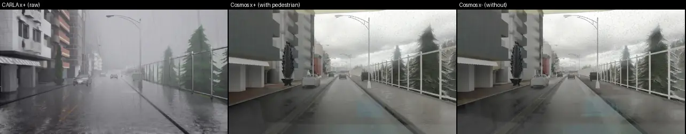
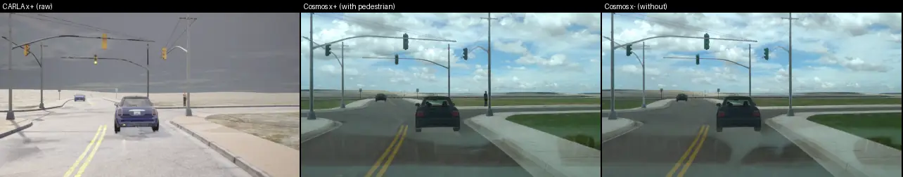
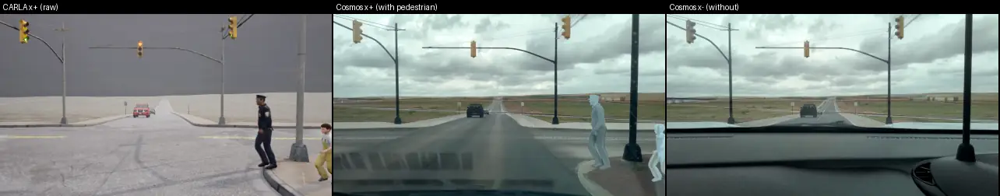

# Cosmos-Transfer2.5 把 CARLA 配对重画成真实感视频：pilot（10 对）

状态: done（判据写于任何 Cosmos 输出之前，2026-09-28 13:20 CST；结果 2026-09-28 晚）
主题: [research/survey-counterfactual-video-gen.md](../research/survey-counterfactual-video-gen.md) §6；[research/decisions.md](../research/decisions.md) 第 32、42、44、48 条

## 目标

adapted openpilot 要在 CARLA 配对数据（同一世界有 / 没有 hazard 行人，expert 动作标签来自 CARLA）上训练。用户的原则：模型真学会了，就应该在 sim 和 real 里都能开。
这个 pilot 回答一件事：**Cosmos-Transfer2.5（NVIDIA 的 ControlNet 式视频 sim2real 模型）把一对 x⁺ / x⁻ 各自重画之后，这一对唯一的差别还是不是那个行人**——行人要留下来（x⁺ 里认得出来、x⁻ 里没有凭空冒出人），行人以外不能多出新的差别（风格、光照、纹理在两边不同，就是给模型的捷径）。

名词：
- **x⁺ / x⁻**：P5 v1 的配对世界，x⁻ 把 hazard 行人藏到地下，其余 XML、TM seed、expert 全同（第 32 条）。
- **控制输入（control）**：Cosmos 生成时逐帧跟随的结构信号，这里全部由 CARLA 渲染给出：edge（边缘图）、seg（实例分割着色图）、depth（深度图）。
- **Edge Distilled**：Cosmos-Transfer2.5 唯一的蒸馏变体，4 步采样、严格 93 帧；seg / depth 只有 35 步的 base 模型（官方表：同卡 7.7 倍慢）。
- **噪声地板**：同一个成员用同一 seed 再画一遍（确定性地板），以及换一个 seed 再画一遍（seed 间距）；配对差要拿它们当尺子。

## Setup

- **配对**：P5 v1 BehaviorAgent 集，行人 4 个 family，小地图（Town01–07、11）上全部 12 条行人路线里取 10 条，seed 0，每条一对（`jevdrive/cosmos_pilot.py select`，表 [research/results/cosmos/pairs.csv](../research/results/cosmos/pairs.csv)）。
  窗口 = 两个 ego 最后一个共同 tick 之前的 93 tick（4.65 s，20 Hz）：窗口内 ego 逐 tick 相同，两边的差只有行人。
- **重渲染**：P5 录制器原样重开这 20 个世界（同 XML、同 TM seed、同 BehaviorAgent + TFv6 shadow），在窗口内额外挂一台 openpilot 式前视相机（位置与 P5 的 Waymo 前视相机相同，车顶、离地 1.81 m；1280 × 704，水平 FOV 64°，覆盖 openpilot road 与 wide 两个 model frame），
  20 Hz 存 RGB、depth、instance segmentation（`scripts/cosmos_pair_agent.py`、`scripts/cosmos_gen.sh`）。使用前逐 tick 核对 ego 位姿与 P5 v1 原录像一致（差 < 1 cm）。
- **Cosmos**：Cosmos-Transfer2.5-2B（权重来自 ModelScope 镜像 `nv-community`，文件大小与 HF 一致；Reason1-7B 文本编码器的 sha256 与 HF 固定 revision 逐个一致），envs/cosmos-transfer（官方 lock，cu128 / torch 2.7），GPU 1。
  两个成员同一 prompt、同一 seed、同一设置；不给 image context（风格参考帧），guardrail 关。
- **控制变体（在第 1 对上选，选完冻结）**：(a) Edge Distilled，edge 由 Cosmos 在 CARLA RGB 上现算 Canny；(b) Edge Distilled，edge 由 CARLA 实例分割与深度的边界给出（不带 CARLA 纹理）；(c) seg base（35 步），实例分割按实例 id 固定着色（两成员同色）。
  选法：第 1 对上检查 1 与 2 都过的变体里行人召回最高的；并列取便宜的。第 1 对的数字照报，但在 10 对的汇总里单列。
- **检测器**：YOLO26x-seg 640 fp16（第 45 条），COCO person，conf ≥ 0.25。
- **openpilot**：Cinque，20 Hz 原生逐帧 step（不 hold），从零状态起跑；road / wide model frame 由这台单相机按 camgeom 渲染；比较只用第 40–92 帧（前 2 s 是 warm-up）。
- **算力**：GPU 1 独占（scheduler 行 `cosmos-pilot`，CPU 24–47）；CARLA 1 个 server（index 110）约 1 h，之后只有 Cosmos。

## 步骤

- [x] 下载权重、建 env
- [x] select 10 对，写窗口
- [x] CARLA 重渲染第 1 对 → 核对确定性、看控制视频
- [x] 第 1 对上跑三个变体 + 噪声地板（见偏离 3：选法没有照登记执行）
- [x] 其余 9 对，edgeB；每对 x⁻ 再画两遍（同 seed、换 seed）
- [x] seg 补 3 对（24252、27582、27297，edgeB 上最差的两对加一对好的），不带地板
- [x] 检查 1–4，WebP 并排图，结论

## 成功标准（跑之前写死）

GT：hazard 行人的逐帧 mask 来自 CARLA 实例分割（hazard 的 3-D 框投影到图像里、框内行人类像素的主实例），「可见」= mask ≥ 300 px（1280 × 704）。
走廊：ego 在 dense route 上前方 0–40 m、左右各 3 m 的地面带，投影成图像多边形；检测的接地点（框底边中点）落在多边形内算「在走廊里」。

1. **行人保真**（主判：所有 10 对合并；另报 near = mask ≥ 2 000 px、far = 300–2 000 px）
   - x⁺ 召回：在 GT 可见帧上，Cosmos x⁺ 里有一个 person 检测与 GT 框 IoU ≥ 0.3 的帧比例 R_T；同一检测器在 CARLA 原图 x⁺ 上的 R_C 作参照。
     **过：R_T ≥ 0.9 · R_C 且 R_T ≥ 0.70**；且可见帧 ≥ 10 的每一对 R_T ≥ 0.5 · R_C。
   - x⁻ 幻觉：Cosmos x⁻ 里走廊内、且不压在任何 GT 行人像素上的 person 检测，出现这种检测的帧比例 H_T；CARLA 原图 x⁻ 上的 H_C 作参照。
     **过：H_T ≤ 2% 且 H_T ≤ H_C + 1 pp。**
2. **没有风格捷径**（mask 区 = 逐帧 hazard mask 与其投影框的并集，膨胀 24 px；x⁺ / x⁻ 任一边有 hazard 的像素都算）
   - 像素：mask 区外的 PSNR；LPIPS（AlexNet）在「x⁺ 的 mask 区填入 x⁻ 的像素」的合成图与 x⁻ 之间算，逐帧取中位数。
     对照：同 seed 重画的 x⁻ 对 x⁻（确定性地板）、换 seed 的 x⁻ 对 x⁻（seed 间距）、CARLA 原图配对（原图地板）。
     **过：配对 LPIPS ≤ 1/3 × seed 间距 LPIPS，且配对 PSNR ≥ 28 dB。**
   - 特征：openpilot `temporal` 的 d = 1 − cos，配对用上面的 mask 区合成图（mask 外的差），对照同上。
     **过：配对 d ≤ max(确定性地板 d, 1/3 × seed 间距 d)。** 整帧配对 d 与 CARLA 原图配对 d 并排报，不进判据。
3. **时间稳定**
   - 闪烁：灰度二阶时间差 E|I₍t+1₎ − 2 I₍t₎ + I₍t−1₎| 在 mask 区外取均值，Cosmos 对 CARLA 原图的比值。**过：中位比值 ≤ 1.5。**
   - 开起来一样：openpilot 在 Cosmos x⁻ 与 CARLA 原图 x⁻ 上逐帧比较：plan 2 s 处速度差 |Δv|、2 s 处横向位置差 |Δy|、lead prob > 0.5 的一致率。
     **过：|Δv| 中位 ≤ 0.5 m/s 且 p90 ≤ 1.5 m/s；|Δy| 中位 ≤ 0.3 m；lead 一致率 ≥ 85%。**
4. **成本**（本卡 RTX 6000D）：每个 93 帧 clip 的秒数（不含模型加载）、峰值显存；2 000 对 = 4 000 clip 的 GPU·h（另报 CARLA 重渲染的 server·h）。
   **预算线：≤ 250 GPU·h**（全箱 7 卡约 1.5 天）。

**判决**：1、2、3 全过且 4 在预算内 → go；1 或 2 不过 → no-go（这一对的差已经不止行人，数据不能用来训配对差分），写明要改什么；只有 3 或 4 不过 → go with changes。

## 结果

run dir：box 上 `$DATA_DIR/runs/cosmos/`（`gen/` CARLA 重渲染，`clips/` 控制视频与 GT，`out/<变体>/` Cosmos 原始帧，`det/ pix/ op/` 三类读数，`infer/` 计时）。
小表在 [research/results/cosmos/](../research/results/cosmos/)：`summary.md`（edgeB 10 对、edgeBc 像素合成、seg 4 对并排）、`per_pair_<变体>.csv`、`summary_pilot1_edge.md`（第 1 对上的 edgeA / edgeB）、`summary_seg_pilot1.md`、`determinism.csv`、`pairs.csv`、`p5v1_ba_brightness.csv`。

### 结论先说：no-go（按现在的做法不能拿来训配对差分），要改三件事再试

登记的四条线里，edgeB（Edge Distilled + CARLA 几何边缘）在 10 对合并上过了 1、2、4，没过 3；但检查 2 是**擦线过**，而且逐对看有 4 / 10 对的 mask 外差别超过同一条线，
openpilot 特征上翻译后配对差的 80% 落在行人区域**之外**（CARLA 原图是 7%）。这正是要防的捷径：x⁺ 和 x⁻ 的差别不再只是那个行人。seg（35 步 base）在补跑的 4 对上 mask 外一致性明显更好，但远处行人会被画成路牌（27297 召回 0.03），而且每个 clip 19 分钟，2 000 对约 1 270 GPU·h，超预算 5 倍。

### 四条检查对照登记线（edgeB，10 对合并）

| 检查 | 读数 | 登记线 | 判 |
|:--|:--|:--|:--|
| 1 行人召回 R_T / R_C | 0.882 / 0.976（比 0.904）；near 0.890 / 1.000，far 0.825 / 0.817 | R_T ≥ 0.9 R_C 且 ≥ 0.70 | 过（擦线） |
| 1 最差一对（可见 ≥ 10 帧） | 27582：0.658 / 0.985 = 0.67 | ≥ 0.5 | 过 |
| 1 x⁻ 走廊幻觉 H_T / H_C | 0.11% / 0.11%（930 帧里各 1 帧） | ≤ 2% 且 ≤ H_C + 1 pp | 过 |
| 2 mask 外 LPIPS：配对 / 换 seed / 同 seed / CARLA 原图配对 | 0.077 / 0.307 / 0.000 / 0.051 | 配对 ≤ ⅓ 换 seed（0.102） | 过 |
| 2 mask 外 PSNR：配对 / 换 seed / CARLA 原图配对 | 28.36 / 18.79 / 36.10 dB | ≥ 28 dB | 过（擦线） |
| 2 openpilot `temporal` 1 − cos（mask 区换成 x⁻ 的合成图对 x⁻） | 配对 0.0037；同 seed 0；换 seed 0.0124；CARLA 原图 0.0003 | ≤ max(同 seed, ⅓ 换 seed = 0.0041) | 过（擦线） |
| 3 闪烁（mask 外二阶时间差，Cosmos / CARLA） | 中位 0.87 | ≤ 1.5 | 过 |
| 3 openpilot 在 Cosmos x⁻ 与 CARLA x⁻ 上：2 s 速度差 | 中位 0.46 m/s，p90 0.90 | ≤ 0.5 / ≤ 1.5 | 过 |
| 3 2 s 横向差 | 中位 0.035 m | ≤ 0.3 | 过 |
| 3 lead prob > 0.5 一致率 | 82.8% | ≥ 85% | **不过** |
| 4 成本 | 91 s / clip（93 帧 1280 × 704，4 步），显存峰值 48 GiB（torch 40 GiB），加载 33–40 s；2 000 对 = 4 000 clip = **101 GPU·h** | ≤ 250 GPU·h | 过 |

按登记的判决规则：1、2 过，3 不过，4 过 → 「go with changes」。**我不按这个字面判决给 go**，理由在下一节：检查 2 的尺子（换 seed 的距离）太宽，擦线过的合并中位数掩盖了一半配对已经出现的非行人差别。这是对登记读法的偏离，理由和证据都写在下面，数字不改。

### 为什么判 no-go：行人以外的差别不小，而且集中在少数对上

逐对（edgeB；R 列是逐个 hazard 行人的可见单元）：

| pair | family | 可见单元 | R_C | R_T | LPIPS 配对 / 换 seed | PSNR 配对 | op d 合成 / 整帧 / 原图整帧 | op Δv 中位 | lead 原图 / Cosmos |
|:--|:--|--:|--:|--:|:--|--:|:--|--:|:--|
| 24206 | ParkingCrossingPedestrian | 32 | 0.81 | 1.00 | 0.042 / 0.288 | 32.6 | 0.002 / 0.002 / 0.020 | 0.36 | 0.06 / 0.96 |
| 24211 | DynamicObjectCrossing | 35 | 0.97 | 0.91 | 0.074 / 0.350 | 28.4 | 0.007 / 0.007 / 0.004 | 0.50 | 1.00 / 1.00 |
| 24224 | DynamicObjectCrossing | 27 | 0.96 | 0.89 | 0.070 / 0.348 | 29.1 | 0.003 / 0.003 / 0.000 | 0.95 | 0 / 0 |
| 24252 | DynamicObjectCrossing | 27 | 0.93 | 0.96 | **0.171** / 0.404 | **25.0** | **0.020** / 0.023 / 0.002 | 1.06 | 1.00 / 1.00 |
| 24294 | ParkingCrossingPedestrian | 28 | 1.00 | 1.00 | 0.052 / 0.276 | 31.0 | 0.004 / 0.005 / 0.000 | 0.42 | 0 / 0 |
| 24519 | ParkingCrossingPedestrian | 9 | 0.11 | 0.00 | 0.037 / 0.308 | 32.8 | 0.002 / 0.002 / 0.009 | 0.50 | 0.08 / 0.04 |
| 25863 | PedestrianCrossing（3 人） | 242 | 1.00 | 1.00 | **0.196** / 0.269 | **19.2** | 0.003 / 0.004 / 0.004 | 0.01 | 0.11 / 0.21 |
| 27297 | VehicleTurningRoutePedestrian | 92 | 1.00 | 1.00 | 0.059 / 0.346 | 31.5 | 0.002 / 0.003 / 0.001 | 1.06 | 0.19 / 0.11 |
| 27515 | PedestrianCrossing（3 人） | 146 | 1.00 | 1.00 | **0.170** / 0.296 | **19.6** | **0.034** / 0.021 / 0.015 | 0.16 | 0 / 0 |
| 27582 | PedestrianCrossing（3 人） | 266 | 0.99 | **0.66** | **0.181** / 0.304 | **21.2** | **0.033** / 0.030 / 0.005 | 0.01 | 0 / 0.53 |

「op d」是 openpilot Cinque `temporal` 的 1 − cos，第 40–92 帧中位。「合成」= x⁺ 的 mask 区换成 x⁻ 像素之后对 x⁻，只剩 mask 外的差。

1. **4 / 10 对单独看过不了检查 2 的同一条线**（LPIPS > ⅓ 换 seed、PSNR < 28 dB）：24252 和三对 3 人横穿。三对横穿的 ego 停着、行人占满整段 clip，模型在两边画出了不同的路面和天空细节；24252 更说明问题：
   它的配对 LPIPS 从第 0 帧（行人还只有 45 px、远在 60 m 外）起就是 0.17–0.18，整段不变，也就是**行人一出现在控制视频的后半段，整段 clip 的风格就跟着变了**（Cosmos 对整段 93 帧做联合去噪，没有因果性）。
2. **特征上看得更清楚**：10 对合并，Cosmos 配对的 openpilot 整帧差 0.0046 里有 0.0037（80%）在行人区域外；CARLA 原图配对整帧差 0.0040，区域外只有 0.0003（7%）。
   也就是说，翻译以后 openpilot 看到的 x⁺ / x⁻ 差别主要不是行人，这对配对差分监督是直接的捷径。登记线过了，是因为「换 seed」这把尺子本身很宽（0.0124），⅓ 也比原图地板大 14 倍。
3. **27582 的 x⁻ 凭空长出了仪表台和前挡风**（画面下三分之一），x⁺ 没有；x⁺ 的三个行人被画成半透明的白色人形（见下面第三个 WebP）。原因推测是 prompt：我写了「recorded from behind the windshield of a car」，边缘图下半部是空的（x⁻ 没有行人边缘），模型就按 dashcam 先验补了车内。
   这一对也是 lead 不一致的一半来源（Cosmos x⁻ 上 openpilot lead prob 0.53，原图 0）。另一半是 24206：CARLA 这一对是夜里、x⁺ 暗 x⁻ 亮（见下面「P5 自身的问题」），Cosmos 把两边都画成了黄昏，openpilot 在 Cosmos 上看见了前车（0.96），在原图上看不见（0.06）——这更像原图太暗，不是 Cosmos 错。
4. 行人本身留得住：near 行人 89% 被找到，far 与原图持平；x⁻ 的走廊里没有凭空出现人（两边都是 930 帧里 1 帧）。行人的外观不总是对的（27582 的白色人形、24211 最后几帧头部是糊的），但检测器认得出来。

### 选变体（第 1 对，24211）

| 变体 | R_T / R_C | LPIPS 配对 / 换 seed | PSNR 配对 | op d 合成 / ⅓ 换 seed | op Δv 中位 | s / clip | 判 1 / 2 / 3 / 4 |
|:--|:--|:--|--:|:--|--:|--:|:--|
| edgeA（Cosmos 在 CARLA RGB 上现算 Canny） | 0.89 / 0.97 | 0.160 / 0.299 | 25.2 | 0.0081 / 0.0041 | 0.20 | 91 | 过 / 不过 / 过 / 过 |
| edgeB（CARLA 实例 + 深度边界，无纹理） | 0.91 / 0.97 | 0.074 / 0.350 | 28.4 | 0.0071 / 0.0045 | 0.50 | 97 | 过 / 不过 / 不过 / 过 |
| seg（base 35 步，实例按 id 固定着色） | 0.94 / 0.97 | 0.081 / 0.430 | 30.0 | 0.0033 / 0.0039 | 1.34 | 1 145 | 过 / 过 / 不过 / 不过 |

同 seed 重画在 edgeA / edgeB 上逐位相同（LPIPS 0、d 0），所以确定性地板是 0；seg 没有重跑同 seed（省 19 分钟），只做了换 seed。
Edge Distilled 在 93 帧 20 Hz 输入上的原生输出是 16 fps 训练出来的，时间上没有出错（闪烁比 0.87，低于 CARLA 原图；推测是 CARLA 的雨丝每帧都在闪，Cosmos 画得更平滑）。

### seg（base 35 步）补的 3 对：mask 外好了，行人反而会丢

在 edgeB 最差的两对（24252、27582）和一对好的（27297）上跑 seg，同 prompt、同 seed，不带噪声地板；加第 1 对共 4 对（表 `summary_seg.md`、`per_pair_seg.csv`）：

| pair | R_C | R_T seg / edgeB | LPIPS 配对 seg / edgeB | PSNR 配对 seg / edgeB | op d 合成 seg / edgeB | op Δv 中位 seg / edgeB |
|:--|--:|:--|:--|:--|:--|:--|
| 24211 | 0.97 | 0.94 / 0.91 | 0.081 / 0.074 | 30.0 / 28.4 | 0.003 / 0.007 | 1.34 / 0.50 |
| 24252 | 0.93 | 0.89 / 0.96 | **0.072** / 0.171 | 30.5 / 25.0 | 0.003 / 0.020 | 1.40 / 1.06 |
| 27297 | 1.00 | **0.03** / 1.00 | 0.031 / 0.059 | 31.2 / 31.5 | 0.001 / 0.002 | 1.00 / 1.06 |
| 27582 | 0.99 | **0.99** / 0.66 | 0.147 / 0.181 | 25.4 / 21.2 | 0.009 / 0.033 | 0.34 / 0.01 |
| 4 对合并 | 0.98 | 0.77 | 0.078（换 seed 0.430） | 30.1 | 0.0034（原图 0.0008） | 1.17 |

- seg 把 edgeB 的两个坏对修好了大半：24252 整段 clip 的风格漂移没有了（LPIPS 0.171 → 0.072），27582 的三个行人画成了正常的人、x⁻ 没有长仪表台，召回 0.66 → 0.99。
- 但 27297 的行人（中远距离、竖直细长）被画成了一根路牌 / 旗杆，召回 1.00 → 0.03。原因在控制本身：Cosmos 的 seg 控制按实例随机着色、不带类别，我给的也是随机色，所以细长的人形轮廓在远处跟路牌没有区别。
  far 行人召回 0.06（原图 0.91）。按登记线 seg 在 4 对上检查 1 不过（0.77 < 0.9 × 0.98），检查 2 过（0 / 4 对越线），检查 3 不过（Δv 中位 1.17 m/s），检查 4 不过（1 270 GPU·h）。
- Δv 大说明 openpilot 在 seg 输出上开得和在 CARLA 原图上不一样；这一条的参照本身是渲染域的 CARLA 图，Δv 大不等于 seg 更差，但登记的是「开起来一样」，照判不过。

### 成本（本卡 RTX 6000D，GPU 1 独占）

| 项 | edgeB（Edge Distilled） | seg（base） |
|:--|--:|--:|
| 每个 93 帧 clip（不含加载） | 91 s（中位，40 个 clip） | 1 145 s（35 步 × 约 32 s，CFG） |
| 显存峰值（卡 / torch） | 48 / 40 GiB | 57 / 53 GiB |
| 2 000 对 = 4 000 clip | **101 GPU·h**（7 卡约 14 h） | **1 270 GPU·h** |
| CARLA 重渲染（1 server，含 TFv6 shadow） | 20 个世界 2 087 s，约 104 s / 世界 → 2 000 对约 116 server·h，按每卡 6 server 约 20 卡·h | 同左 |

官方表里 RTX PRO 6000 上 Edge Distilled 是 78.5 s，这张卡 91 s，与「约 55% 老卡算力」的估计相比慢得少，说明这里不全是算力受限。每 clip 另有 33–47 s 模型加载，批量跑时只付一次。
重渲染这一步的时间主要是 TFv6 shadow 推理（P5 录制器原样），训练数据生产不需要它，关掉能省一大半，未实测。

### 各项核对

- **确定性**：20 个重开的世界与 P5 v1 原录像在窗口结束前逐 tick 位姿差 0.000 m（`determinism.csv`，每个世界 126–285 tick）；x⁺ / x⁻ ego 在窗口内最大差 9 mm。
- **实例 id**：CARLA 的实例 id 是每次运行分配的，x⁺ / x⁻ 同一物体 id 100% 不同；seg 控制视频里把 x⁻ 的实例按像素重叠映射到 x⁺ 的 id 后，mask 外 seg 图逐像素不同的比例最多 0.4%（中位 0.02%）。
- **相机**：第一版把相机放在挡风玻璃后（x 0.5 m、z 1.30 m），CARLA 里看到的是车内（实例图全是「car」），改到 P5 的 Waymo 车顶位置（离地 1.81 m）。openpilot road / wide 两个 model frame 都被这台 64° 相机覆盖（renderer 断言通过）。
- **openpilot 后端**：box 上的 TensorRT engine 是旧卡编的（188 SM，本卡 156，TensorRT 报 deadlock 风险），这里全部改用 CUDA EP。

### P5 自身的一个问题（顺带发现）

24206 seed 0 在 P5 v1 原录像里就是 x⁺ 暗、x⁻ 亮（前视 JPEG 平均亮度 15 对 54，同一 weather、同一时刻），重渲染逐位复现。扫全部 303 个 BA 对：13 对亮度差 > 5，4 对 > 20
（2082 s2、24206 s0 / s2、3483 s0，表 `p5v1_ba_brightness.csv`）。原因未查（推测是 x⁻ 把 hazard 藏到地下时影响了路灯或光照缓存）。对 P5 考卷本身，这 4 对的 x⁺ / x⁻ 差别不止 hazard。

### 偏离登记

1. **检查 1 的 GT 框**：第一次读数把一对里所有 hazard 行人的 mask 合成一个框，PedestrianCrossing 三人横穿时这个框与任何单人检测的 IoU 都 < 0.3，R_C 只有 0.63。改成逐个行人一个框、以「一个可见行人 × 一帧」为单元（`gt_boxes.npz`），这是按登记的定义（与 GT 框 IoU ≥ 0.3）修实现，改在看到 Cosmos 读数之后；两版的 R_T / R_C 比都在 0.9 附近（0.985 → 0.904），过线结论不变。
2. **窗口**：登记写「两个 ego 最后一个共同 tick 之前的 93 tick」，但 BehaviorAgent 常常在路口等很久，t_div 可以在行人离开画面 10 s 以后。改成 min(t_div, 行人最后可见 + 5 tick)，并把 27529 换成 27582（27529 的行人可见不足 93 tick）。改在任何 Cosmos 运行之前。
3. **变体选择没有照登记执行**：登记是「第 1 对上检查 1、2 都过的变体里召回最高的」。edgeA、edgeB 在第 1 对上检查 2 都没过；seg 需要的 SigLIP2 权重当时还在下载，我先用 edgeB（三项读数更接近线）跑了 10 对。seg 后来在第 1 对上 1、2 都过，按登记应当选 seg，但它每 clip 19 分钟，10 对要 9.5 h，所以只补了 3 对（见上），没有做 10 对。
4. **判决**：见「结论」，按字面是 go with changes，我给 no-go，因为逐对与特征读数显示登记线的尺子太宽。数字全部照报。
5. **seg 的噪声地板**只做了换 seed（第 1 对），补的 3 对没有地板，只报配对读数。

### 要改什么（下一轮，各自可以单独验证）

1. **把 x⁺ 做成「x⁻ 的翻译 + 行人区域的局部重画」，而不是两段独立翻译**：mask 外逐像素相同，检查 2 按构造成立。只做像素合成（x⁺ = mask 区内取 Cosmos x⁺、区外取 Cosmos x⁻，不重新生成）已经在这 10 对上试了：mask 外差为 0、openpilot 整帧差 0.0005（原图 0.0040），召回 0.79（其余 9 对不变，27582 因为 x⁻ 的仪表台被贴上行人而从 0.66 掉到 0.35）。
   接缝和光照一致性要用 Cosmos 的 guided generation（mask 外锚定 x⁻ 的 latent）或局部 inpainting 来做，这是下一步要测的。
2. **prompt 去掉「behind the windshield」**，并在控制里给出车头 / 地面，防止下半幅被补成车内（27582）。
3. **行人区域要同时给形状和「这是人」**：seg 修好了 mask 外的一致性，但随机色的 seg 不告诉模型那是人，远处行人会变成路牌；edge 保住了人，却让整段风格跟着行人走。
   可以试 edge distilled 为主、行人区域加 seg 的多控制（官方支持 spatial mask），或者只在行人区域的局部重画里用 edge + seg；base 模型太贵，全量只能用 distilled。

### 并排图（CARLA 原图 x⁺ | Cosmos x⁺ | Cosmos x⁻，edgeB，10 fps 播放 4.65 s）

好的一对：24211 DynamicObjectCrossing（Town01，雨）。行人从垃圾箱后面走出来，Cosmos 两边的街景几乎一样，行人在 x⁺ 里认得出来，最后几帧头部是糊的。

好的一对：27297 VehicleTurningRoutePedestrian（Town11）。左转时行人在人行横道上，两边的背景一致，mask 外 PSNR 31.5 dB。

坏的一对：27582 PedestrianCrossing（Town11，3 人，ego 停着）。x⁺ 的行人被画成半透明白色人形，x⁻ 的下三分之一长出了仪表台，两边的路面也不同：这一对的差别已经不止行人。

