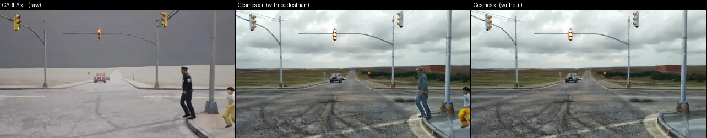
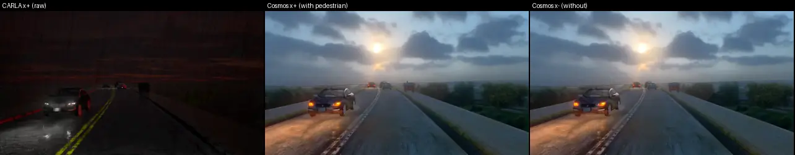
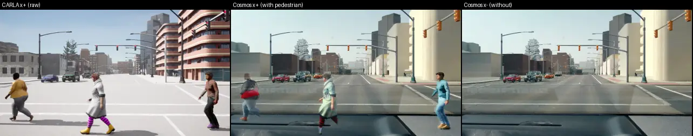
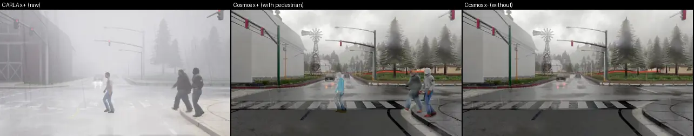
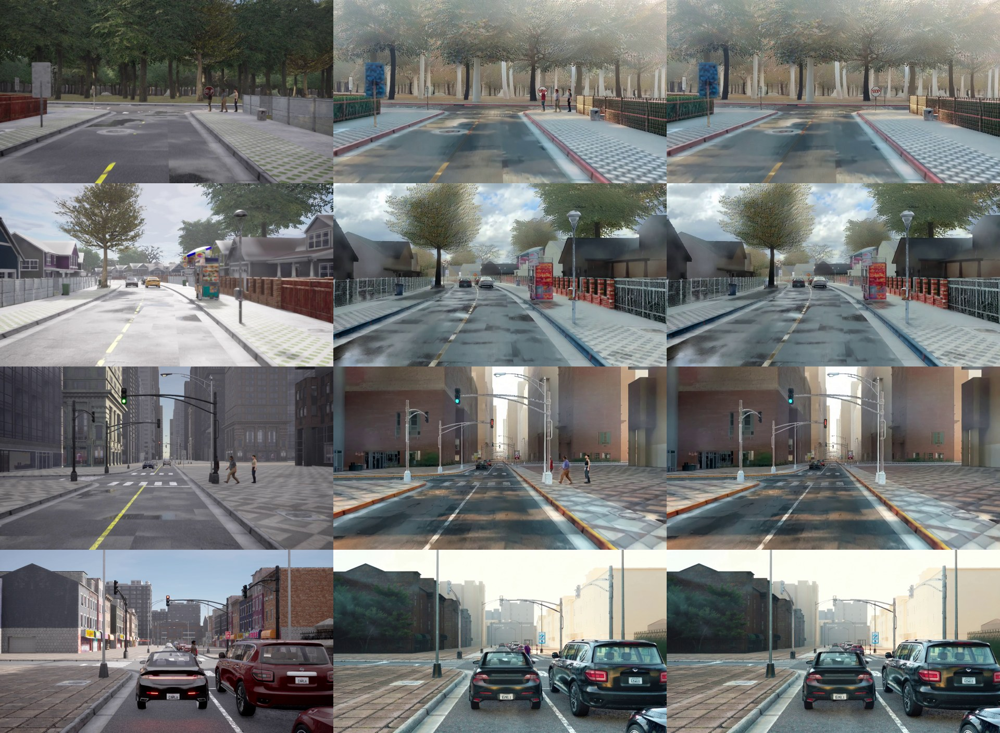

# Cosmos-Transfer2.5 把 CARLA 配对重画成真实感视频：pilot（10 对）

状态: 全量生成进行中（v1 判据 2026-09-28 13:20、v2 判据 20:10 CST 均写于输出之前；v2 结果 2026-09-29 凌晨；用户 2026-09-29 拍板 go，全量规则 10:20 CST 登记于任何全量数据之前）
主题: [research/survey-counterfactual-video-gen.md](../research/survey-counterfactual-video-gen.md) §6；[research/decisions.md](../research/decisions.md) 第 32、42、44、48 条

## 目标

adapted openpilot 要在 CARLA 配对数据（同一世界有 / 没有 hazard 行人，expert 动作标签来自 CARLA）上训练。用户的原则：模型真学会了，就应该在 sim 和 real 里都能开。
这个 pilot 回答一件事：**Cosmos-Transfer2.5（NVIDIA 的 ControlNet 式视频 sim2real 模型）把一对 x⁺ / x⁻ 各自重画之后，这一对唯一的差别还是不是那个行人**——行人要留下来（x⁺ 里认得出来、x⁻ 里没有凭空冒出人），行人以外不能多出新的差别（风格、光照、纹理在两边不同，就是给模型的捷径）。

名词：
- **x⁺ / x⁻**：P5 v1 的配对世界，x⁻ 把 hazard 行人藏到地下，其余 XML、TM seed、expert 全同（第 32 条）。
- **控制输入（control）**：Cosmos 生成时逐帧跟随的结构信号，这里全部由 CARLA 渲染给出：edge（边缘图）、seg（实例分割着色图）、depth（深度图）。
- **Edge Distilled**：Cosmos-Transfer2.5 唯一的蒸馏变体，4 步采样、严格 93 帧；seg / depth 只有 35 步的 base 模型（官方表：同卡 7.7 倍慢）。
- **噪声地板**：同一个成员用同一 seed 再画一遍（确定性地板），以及换一个 seed 再画一遍（seed 间距）；配对差要拿它们当尺子。

## Setup

- **配对**：P5 v1 BehaviorAgent 集，行人 4 个 family，小地图（Town01–07、11）上全部 12 条行人路线里取 10 条，seed 0，每条一对（`jevdrive/cosmos_pilot.py select`，表 [research/results/cosmos/pairs.csv](../research/results/cosmos/pairs.csv)）。
  窗口 = 两个 ego 最后一个共同 tick 之前的 93 tick（4.65 s，20 Hz）：窗口内 ego 逐 tick 相同，两边的差只有行人。
- **重渲染**：P5 录制器原样重开这 20 个世界（同 XML、同 TM seed、同 BehaviorAgent + TFv6 shadow），在窗口内额外挂一台 openpilot 式前视相机（位置与 P5 的 Waymo 前视相机相同，车顶、离地 1.81 m；1280 × 704，水平 FOV 64°，覆盖 openpilot road 与 wide 两个 model frame），
  20 Hz 存 RGB、depth、instance segmentation（`scripts/cosmos_pair_agent.py`、`scripts/cosmos_gen.sh`）。使用前逐 tick 核对 ego 位姿与 P5 v1 原录像一致（差 < 1 cm）。
- **Cosmos**：Cosmos-Transfer2.5-2B（权重来自 ModelScope 镜像 `nv-community`，文件大小与 HF 一致；Reason1-7B 文本编码器的 sha256 与 HF 固定 revision 逐个一致），envs/cosmos-transfer（官方 lock，cu128 / torch 2.7），GPU 1。
  两个成员同一 prompt、同一 seed、同一设置；不给 image context（风格参考帧），guardrail 关。
- **控制变体（在第 1 对上选，选完冻结）**：(a) Edge Distilled，edge 由 Cosmos 在 CARLA RGB 上现算 Canny；(b) Edge Distilled，edge 由 CARLA 实例分割与深度的边界给出（不带 CARLA 纹理）；(c) seg base（35 步），实例分割按实例 id 固定着色（两成员同色）。
  选法：第 1 对上检查 1 与 2 都过的变体里行人召回最高的；并列取便宜的。第 1 对的数字照报，但在 10 对的汇总里单列。
- **检测器**：YOLO26x-seg 640 fp16（第 45 条），COCO person，conf ≥ 0.25。
- **openpilot**：Cinque，20 Hz 原生逐帧 step（不 hold），从零状态起跑；road / wide model frame 由这台单相机按 camgeom 渲染；比较只用第 40–92 帧（前 2 s 是 warm-up）。
- **算力**：GPU 1 独占（scheduler 行 `cosmos-pilot`，CPU 24–47）；CARLA 1 个 server（index 110）约 1 h，之后只有 Cosmos。

## 步骤

- [x] 下载权重、建 env
- [x] select 10 对，写窗口
- [x] CARLA 重渲染第 1 对 → 核对确定性、看控制视频
- [x] 第 1 对上跑三个变体 + 噪声地板（见偏离 3：选法没有照登记执行）
- [x] 其余 9 对，edgeB；每对 x⁻ 再画两遍（同 seed、换 seed）
- [x] seg 补 3 对（24252、27582、27297，edgeB 上最差的两对加一对好的），不带地板
- [x] 检查 1–4，WebP 并排图，结论

## 成功标准（跑之前写死）

GT：hazard 行人的逐帧 mask 来自 CARLA 实例分割（hazard 的 3-D 框投影到图像里、框内行人类像素的主实例），「可见」= mask ≥ 300 px（1280 × 704）。
走廊：ego 在 dense route 上前方 0–40 m、左右各 3 m 的地面带，投影成图像多边形；检测的接地点（框底边中点）落在多边形内算「在走廊里」。

1. **行人保真**（主判：所有 10 对合并；另报 near = mask ≥ 2 000 px、far = 300–2 000 px）
   - x⁺ 召回：在 GT 可见帧上，Cosmos x⁺ 里有一个 person 检测与 GT 框 IoU ≥ 0.3 的帧比例 R_T；同一检测器在 CARLA 原图 x⁺ 上的 R_C 作参照。
     **过：R_T ≥ 0.9 · R_C 且 R_T ≥ 0.70**；且可见帧 ≥ 10 的每一对 R_T ≥ 0.5 · R_C。
   - x⁻ 幻觉：Cosmos x⁻ 里走廊内、且不压在任何 GT 行人像素上的 person 检测，出现这种检测的帧比例 H_T；CARLA 原图 x⁻ 上的 H_C 作参照。
     **过：H_T ≤ 2% 且 H_T ≤ H_C + 1 pp。**
2. **没有风格捷径**（mask 区 = 逐帧 hazard mask 与其投影框的并集，膨胀 24 px；x⁺ / x⁻ 任一边有 hazard 的像素都算）
   - 像素：mask 区外的 PSNR；LPIPS（AlexNet）在「x⁺ 的 mask 区填入 x⁻ 的像素」的合成图与 x⁻ 之间算，逐帧取中位数。
     对照：同 seed 重画的 x⁻ 对 x⁻（确定性地板）、换 seed 的 x⁻ 对 x⁻（seed 间距）、CARLA 原图配对（原图地板）。
     **过：配对 LPIPS ≤ 1/3 × seed 间距 LPIPS，且配对 PSNR ≥ 28 dB。**
   - 特征：openpilot `temporal` 的 d = 1 − cos，配对用上面的 mask 区合成图（mask 外的差），对照同上。
     **过：配对 d ≤ max(确定性地板 d, 1/3 × seed 间距 d)。** 整帧配对 d 与 CARLA 原图配对 d 并排报，不进判据。
3. **时间稳定**
   - 闪烁：灰度二阶时间差 E|I₍t+1₎ − 2 I₍t₎ + I₍t−1₎| 在 mask 区外取均值，Cosmos 对 CARLA 原图的比值。**过：中位比值 ≤ 1.5。**
   - 开起来一样：openpilot 在 Cosmos x⁻ 与 CARLA 原图 x⁻ 上逐帧比较：plan 2 s 处速度差 |Δv|、2 s 处横向位置差 |Δy|、lead prob > 0.5 的一致率。
     **过：|Δv| 中位 ≤ 0.5 m/s 且 p90 ≤ 1.5 m/s；|Δy| 中位 ≤ 0.3 m；lead 一致率 ≥ 85%。**
4. **成本**（本卡 RTX 6000D）：每个 93 帧 clip 的秒数（不含模型加载）、峰值显存；2 000 对 = 4 000 clip 的 GPU·h（另报 CARLA 重渲染的 server·h）。
   **预算线：≤ 250 GPU·h**（全箱 7 卡约 1.5 天）。

**判决**：1、2、3 全过且 4 在预算内 → go；1 或 2 不过 → no-go（这一对的差已经不止行人，数据不能用来训配对差分），写明要改什么；只有 3 或 4 不过 → go with changes。

## 结果

run dir：box 上 `$DATA_DIR/runs/cosmos/`（`gen/` CARLA 重渲染，`clips/` 控制视频与 GT，`out/<变体>/` Cosmos 原始帧，`det/ pix/ op/` 三类读数，`infer/` 计时）。
小表在 [research/results/cosmos/](../research/results/cosmos/)：`summary.md`（edgeB 10 对、edgeBc 像素合成、seg 4 对并排）、`per_pair_<变体>.csv`、`summary_pilot1_edge.md`（第 1 对上的 edgeA / edgeB）、`summary_seg_pilot1.md`、`determinism.csv`、`pairs.csv`、`p5v1_ba_brightness.csv`。

### 结论先说：no-go（按现在的做法不能拿来训配对差分），要改三件事再试

登记的四条线里，edgeB（Edge Distilled + CARLA 几何边缘）在 10 对合并上过了 1、2、4，没过 3；但检查 2 是**擦线过**，而且逐对看有 4 / 10 对的 mask 外差别超过同一条线，
openpilot 特征上翻译后配对差的 80% 落在行人区域**之外**（CARLA 原图是 7%）。这正是要防的捷径：x⁺ 和 x⁻ 的差别不再只是那个行人。seg（35 步 base）在补跑的 4 对上 mask 外一致性明显更好，但远处行人会被画成路牌（27297 召回 0.03），而且每个 clip 19 分钟，2 000 对约 1 270 GPU·h，超预算 5 倍。

### 四条检查对照登记线（edgeB，10 对合并）

| 检查 | 读数 | 登记线 | 判 |
|:--|:--|:--|:--|
| 1 行人召回 R_T / R_C | 0.882 / 0.976（比 0.904）；near 0.890 / 1.000，far 0.825 / 0.817 | R_T ≥ 0.9 R_C 且 ≥ 0.70 | 过（擦线） |
| 1 最差一对（可见 ≥ 10 帧） | 27582：0.658 / 0.985 = 0.67 | ≥ 0.5 | 过 |
| 1 x⁻ 走廊幻觉 H_T / H_C | 0.11% / 0.11%（930 帧里各 1 帧） | ≤ 2% 且 ≤ H_C + 1 pp | 过 |
| 2 mask 外 LPIPS：配对 / 换 seed / 同 seed / CARLA 原图配对 | 0.077 / 0.307 / 0.000 / 0.051 | 配对 ≤ ⅓ 换 seed（0.102） | 过 |
| 2 mask 外 PSNR：配对 / 换 seed / CARLA 原图配对 | 28.36 / 18.79 / 36.10 dB | ≥ 28 dB | 过（擦线） |
| 2 openpilot `temporal` 1 − cos（mask 区换成 x⁻ 的合成图对 x⁻） | 配对 0.0037；同 seed 0；换 seed 0.0124；CARLA 原图 0.0003 | ≤ max(同 seed, ⅓ 换 seed = 0.0041) | 过（擦线） |
| 3 闪烁（mask 外二阶时间差，Cosmos / CARLA） | 中位 0.87 | ≤ 1.5 | 过 |
| 3 openpilot 在 Cosmos x⁻ 与 CARLA x⁻ 上：2 s 速度差 | 中位 0.46 m/s，p90 0.90 | ≤ 0.5 / ≤ 1.5 | 过 |
| 3 2 s 横向差 | 中位 0.035 m | ≤ 0.3 | 过 |
| 3 lead prob > 0.5 一致率 | 82.8% | ≥ 85% | **不过** |
| 4 成本 | 91 s / clip（93 帧 1280 × 704，4 步），显存峰值 48 GiB（torch 40 GiB），加载 33–40 s；2 000 对 = 4 000 clip = **101 GPU·h** | ≤ 250 GPU·h | 过 |

按登记的判决规则：1、2 过，3 不过，4 过 → 「go with changes」。**我不按这个字面判决给 go**，理由在下一节：检查 2 的尺子（换 seed 的距离）太宽，擦线过的合并中位数掩盖了一半配对已经出现的非行人差别。这是对登记读法的偏离，理由和证据都写在下面，数字不改。

### 为什么判 no-go：行人以外的差别不小，而且集中在少数对上

逐对（edgeB；R 列是逐个 hazard 行人的可见单元）：

| pair | family | 可见单元 | R_C | R_T | LPIPS 配对 / 换 seed | PSNR 配对 | op d 合成 / 整帧 / 原图整帧 | op Δv 中位 | lead 原图 / Cosmos |
|:--|:--|--:|--:|--:|:--|--:|:--|--:|:--|
| 24206 | ParkingCrossingPedestrian | 32 | 0.81 | 1.00 | 0.042 / 0.288 | 32.6 | 0.002 / 0.002 / 0.020 | 0.36 | 0.06 / 0.96 |
| 24211 | DynamicObjectCrossing | 35 | 0.97 | 0.91 | 0.074 / 0.350 | 28.4 | 0.007 / 0.007 / 0.004 | 0.50 | 1.00 / 1.00 |
| 24224 | DynamicObjectCrossing | 27 | 0.96 | 0.89 | 0.070 / 0.348 | 29.1 | 0.003 / 0.003 / 0.000 | 0.95 | 0 / 0 |
| 24252 | DynamicObjectCrossing | 27 | 0.93 | 0.96 | **0.171** / 0.404 | **25.0** | **0.020** / 0.023 / 0.002 | 1.06 | 1.00 / 1.00 |
| 24294 | ParkingCrossingPedestrian | 28 | 1.00 | 1.00 | 0.052 / 0.276 | 31.0 | 0.004 / 0.005 / 0.000 | 0.42 | 0 / 0 |
| 24519 | ParkingCrossingPedestrian | 9 | 0.11 | 0.00 | 0.037 / 0.308 | 32.8 | 0.002 / 0.002 / 0.009 | 0.50 | 0.08 / 0.04 |
| 25863 | PedestrianCrossing（3 人） | 242 | 1.00 | 1.00 | **0.196** / 0.269 | **19.2** | 0.003 / 0.004 / 0.004 | 0.01 | 0.11 / 0.21 |
| 27297 | VehicleTurningRoutePedestrian | 92 | 1.00 | 1.00 | 0.059 / 0.346 | 31.5 | 0.002 / 0.003 / 0.001 | 1.06 | 0.19 / 0.11 |
| 27515 | PedestrianCrossing（3 人） | 146 | 1.00 | 1.00 | **0.170** / 0.296 | **19.6** | **0.034** / 0.021 / 0.015 | 0.16 | 0 / 0 |
| 27582 | PedestrianCrossing（3 人） | 266 | 0.99 | **0.66** | **0.181** / 0.304 | **21.2** | **0.033** / 0.030 / 0.005 | 0.01 | 0 / 0.53 |

「op d」是 openpilot Cinque `temporal` 的 1 − cos，第 40–92 帧中位。「合成」= x⁺ 的 mask 区换成 x⁻ 像素之后对 x⁻，只剩 mask 外的差。

1. **4 / 10 对单独看过不了检查 2 的同一条线**（LPIPS > ⅓ 换 seed、PSNR < 28 dB）：24252 和三对 3 人横穿。三对横穿的 ego 停着、行人占满整段 clip，模型在两边画出了不同的路面和天空细节；24252 更说明问题：
   它的配对 LPIPS 从第 0 帧（行人还只有 45 px、远在 60 m 外）起就是 0.17–0.18，整段不变，也就是**行人一出现在控制视频的后半段，整段 clip 的风格就跟着变了**（Cosmos 对整段 93 帧做联合去噪，没有因果性）。
2. **特征上看得更清楚**：10 对合并，Cosmos 配对的 openpilot 整帧差 0.0046 里有 0.0037（80%）在行人区域外；CARLA 原图配对整帧差 0.0040，区域外只有 0.0003（7%）。
   也就是说，翻译以后 openpilot 看到的 x⁺ / x⁻ 差别主要不是行人，这对配对差分监督是直接的捷径。登记线过了，是因为「换 seed」这把尺子本身很宽（0.0124），⅓ 也比原图地板大 14 倍。
3. **27582 的 x⁻ 凭空长出了仪表台和前挡风**（画面下三分之一），x⁺ 没有；x⁺ 的三个行人被画成半透明的白色人形（见下面第三个 WebP）。原因推测是 prompt：我写了「recorded from behind the windshield of a car」，边缘图下半部是空的（x⁻ 没有行人边缘），模型就按 dashcam 先验补了车内。
   这一对也是 lead 不一致的一半来源（Cosmos x⁻ 上 openpilot lead prob 0.53，原图 0）。另一半是 24206：CARLA 这一对是夜里、x⁺ 暗 x⁻ 亮（见下面「P5 自身的问题」），Cosmos 把两边都画成了黄昏，openpilot 在 Cosmos 上看见了前车（0.96），在原图上看不见（0.06）——这更像原图太暗，不是 Cosmos 错。
4. 行人本身留得住：near 行人 89% 被找到，far 与原图持平；x⁻ 的走廊里没有凭空出现人（两边都是 930 帧里 1 帧）。行人的外观不总是对的（27582 的白色人形、24211 最后几帧头部是糊的），但检测器认得出来。

### 选变体（第 1 对，24211）

| 变体 | R_T / R_C | LPIPS 配对 / 换 seed | PSNR 配对 | op d 合成 / ⅓ 换 seed | op Δv 中位 | s / clip | 判 1 / 2 / 3 / 4 |
|:--|:--|:--|--:|:--|--:|--:|:--|
| edgeA（Cosmos 在 CARLA RGB 上现算 Canny） | 0.89 / 0.97 | 0.160 / 0.299 | 25.2 | 0.0081 / 0.0041 | 0.20 | 91 | 过 / 不过 / 过 / 过 |
| edgeB（CARLA 实例 + 深度边界，无纹理） | 0.91 / 0.97 | 0.074 / 0.350 | 28.4 | 0.0071 / 0.0045 | 0.50 | 97 | 过 / 不过 / 不过 / 过 |
| seg（base 35 步，实例按 id 固定着色） | 0.94 / 0.97 | 0.081 / 0.430 | 30.0 | 0.0033 / 0.0039 | 1.34 | 1 145 | 过 / 过 / 不过 / 不过 |

同 seed 重画在 edgeA / edgeB 上逐位相同（LPIPS 0、d 0），所以确定性地板是 0；seg 没有重跑同 seed（省 19 分钟），只做了换 seed。
Edge Distilled 在 93 帧 20 Hz 输入上的原生输出是 16 fps 训练出来的，时间上没有出错（闪烁比 0.87，低于 CARLA 原图；推测是 CARLA 的雨丝每帧都在闪，Cosmos 画得更平滑）。

### seg（base 35 步）补的 3 对：mask 外好了，行人反而会丢

在 edgeB 最差的两对（24252、27582）和一对好的（27297）上跑 seg，同 prompt、同 seed，不带噪声地板；加第 1 对共 4 对（表 `summary_seg.md`、`per_pair_seg.csv`）：

| pair | R_C | R_T seg / edgeB | LPIPS 配对 seg / edgeB | PSNR 配对 seg / edgeB | op d 合成 seg / edgeB | op Δv 中位 seg / edgeB |
|:--|--:|:--|:--|:--|:--|:--|
| 24211 | 0.97 | 0.94 / 0.91 | 0.081 / 0.074 | 30.0 / 28.4 | 0.003 / 0.007 | 1.34 / 0.50 |
| 24252 | 0.93 | 0.89 / 0.96 | **0.072** / 0.171 | 30.5 / 25.0 | 0.003 / 0.020 | 1.40 / 1.06 |
| 27297 | 1.00 | **0.03** / 1.00 | 0.031 / 0.059 | 31.2 / 31.5 | 0.001 / 0.002 | 1.00 / 1.06 |
| 27582 | 0.99 | **0.99** / 0.66 | 0.147 / 0.181 | 25.4 / 21.2 | 0.009 / 0.033 | 0.34 / 0.01 |
| 4 对合并 | 0.98 | 0.77 | 0.078（换 seed 0.430） | 30.1 | 0.0034（原图 0.0008） | 1.17 |

- seg 把 edgeB 的两个坏对修好了大半：24252 整段 clip 的风格漂移没有了（LPIPS 0.171 → 0.072），27582 的三个行人画成了正常的人、x⁻ 没有长仪表台，召回 0.66 → 0.99。
- 但 27297 的行人（中远距离、竖直细长）被画成了一根路牌 / 旗杆，召回 1.00 → 0.03。原因在控制本身：Cosmos 的 seg 控制按实例随机着色、不带类别，我给的也是随机色，所以细长的人形轮廓在远处跟路牌没有区别。
  far 行人召回 0.06（原图 0.91）。按登记线 seg 在 4 对上检查 1 不过（0.77 < 0.9 × 0.98），检查 2 过（0 / 4 对越线），检查 3 不过（Δv 中位 1.17 m/s），检查 4 不过（1 270 GPU·h）。
- Δv 大说明 openpilot 在 seg 输出上开得和在 CARLA 原图上不一样；这一条的参照本身是渲染域的 CARLA 图，Δv 大不等于 seg 更差，但登记的是「开起来一样」，照判不过。

### 成本（本卡 RTX 6000D，GPU 1 独占）

| 项 | edgeB（Edge Distilled） | seg（base） |
|:--|--:|--:|
| 每个 93 帧 clip（不含加载） | 91 s（中位，40 个 clip） | 1 145 s（35 步 × 约 32 s，CFG） |
| 显存峰值（卡 / torch） | 48 / 40 GiB | 57 / 53 GiB |
| 2 000 对 = 4 000 clip | **101 GPU·h**（7 卡约 14 h） | **1 270 GPU·h** |
| CARLA 重渲染（1 server，含 TFv6 shadow） | 20 个世界 2 087 s，约 104 s / 世界 → 2 000 对约 116 server·h，按每卡 6 server 约 20 卡·h | 同左 |

官方表里 RTX PRO 6000 上 Edge Distilled 是 78.5 s，这张卡 91 s，与「约 55% 老卡算力」的估计相比慢得少，说明这里不全是算力受限。每 clip 另有 33–47 s 模型加载，批量跑时只付一次。
重渲染这一步的时间主要是 TFv6 shadow 推理（P5 录制器原样），训练数据生产不需要它，关掉能省一大半，未实测。

### 各项核对

- **确定性**：20 个重开的世界与 P5 v1 原录像在窗口结束前逐 tick 位姿差 0.000 m（`determinism.csv`，每个世界 126–285 tick）；x⁺ / x⁻ ego 在窗口内最大差 9 mm。
- **实例 id**：CARLA 的实例 id 是每次运行分配的，x⁺ / x⁻ 同一物体 id 100% 不同；seg 控制视频里把 x⁻ 的实例按像素重叠映射到 x⁺ 的 id 后，mask 外 seg 图逐像素不同的比例最多 0.4%（中位 0.02%）。
- **相机**：第一版把相机放在挡风玻璃后（x 0.5 m、z 1.30 m），CARLA 里看到的是车内（实例图全是「car」），改到 P5 的 Waymo 车顶位置（离地 1.81 m）。openpilot road / wide 两个 model frame 都被这台 64° 相机覆盖（renderer 断言通过）。
- **openpilot 后端**：box 上的 TensorRT engine 是旧卡编的（188 SM，本卡 156，TensorRT 报 deadlock 风险），这里全部改用 CUDA EP。

### P5 自身的一个问题（顺带发现）

24206 seed 0 在 P5 v1 原录像里就是 x⁺ 暗、x⁻ 亮（前视 JPEG 平均亮度 15 对 54，同一 weather、同一时刻），重渲染逐位复现。扫全部 303 个 BA 对：13 对亮度差 > 5，4 对 > 20
（2082 s2、24206 s0 / s2、3483 s0，表 `p5v1_ba_brightness.csv`）。原因未查（推测是 x⁻ 把 hazard 藏到地下时影响了路灯或光照缓存）。对 P5 考卷本身，这 4 对的 x⁺ / x⁻ 差别不止 hazard。

### 偏离登记

1. **检查 1 的 GT 框**：第一次读数把一对里所有 hazard 行人的 mask 合成一个框，PedestrianCrossing 三人横穿时这个框与任何单人检测的 IoU 都 < 0.3，R_C 只有 0.63。改成逐个行人一个框、以「一个可见行人 × 一帧」为单元（`gt_boxes.npz`），这是按登记的定义（与 GT 框 IoU ≥ 0.3）修实现，改在看到 Cosmos 读数之后；两版的 R_T / R_C 比都在 0.9 附近（0.985 → 0.904），过线结论不变。
2. **窗口**：登记写「两个 ego 最后一个共同 tick 之前的 93 tick」，但 BehaviorAgent 常常在路口等很久，t_div 可以在行人离开画面 10 s 以后。改成 min(t_div, 行人最后可见 + 5 tick)，并把 27529 换成 27582（27529 的行人可见不足 93 tick）。改在任何 Cosmos 运行之前。
3. **变体选择没有照登记执行**：登记是「第 1 对上检查 1、2 都过的变体里召回最高的」。edgeA、edgeB 在第 1 对上检查 2 都没过；seg 需要的 SigLIP2 权重当时还在下载，我先用 edgeB（三项读数更接近线）跑了 10 对。seg 后来在第 1 对上 1、2 都过，按登记应当选 seg，但它每 clip 19 分钟，10 对要 9.5 h，所以只补了 3 对（见上），没有做 10 对。
4. **判决**：见「结论」，按字面是 go with changes，我给 no-go，因为逐对与特征读数显示登记线的尺子太宽。数字全部照报。
5. **seg 的噪声地板**只做了换 seed（第 1 对），补的 3 对没有地板，只报配对读数。

### 要改什么（下一轮，各自可以单独验证）

1. **把 x⁺ 做成「x⁻ 的翻译 + 行人区域的局部重画」，而不是两段独立翻译**：mask 外逐像素相同，检查 2 按构造成立。只做像素合成（x⁺ = mask 区内取 Cosmos x⁺、区外取 Cosmos x⁻，不重新生成）已经在这 10 对上试了：mask 外差为 0、openpilot 整帧差 0.0005（原图 0.0040），召回 0.79（其余 9 对不变，27582 因为 x⁻ 的仪表台被贴上行人而从 0.66 掉到 0.35）。
   接缝和光照一致性要用 Cosmos 的 guided generation（mask 外锚定 x⁻ 的 latent）或局部 inpainting 来做，这是下一步要测的。
2. **prompt 去掉「behind the windshield」**，并在控制里给出车头 / 地面，防止下半幅被补成车内（27582）。
3. **行人区域要同时给形状和「这是人」**：seg 修好了 mask 外的一致性，但随机色的 seg 不告诉模型那是人，远处行人会变成路牌；edge 保住了人，却让整段风格跟着行人走。
   可以试 edge distilled 为主、行人区域加 seg 的多控制（官方支持 spatial mask），或者只在行人区域的局部重画里用 edge + seg；base 模型太贵，全量只能用 distilled。

### 并排图（CARLA 原图 x⁺ | Cosmos x⁺ | Cosmos x⁻，edgeB，10 fps 播放 4.65 s）

好的一对：24211 DynamicObjectCrossing（Town01，雨）。行人从垃圾箱后面走出来，Cosmos 两边的街景几乎一样，行人在 x⁺ 里认得出来，最后几帧头部是糊的。

好的一对：27297 VehicleTurningRoutePedestrian（Town11）。左转时行人在人行横道上，两边的背景一致，mask 外 PSNR 31.5 dB。

坏的一对：27582 PedestrianCrossing（Town11，3 人，ego 停着）。x⁺ 的行人被画成半透明白色人形，x⁻ 的下三分之一长出了仪表台，两边的路面也不同：这一对的差别已经不止行人。

## 用户审阅（2026-09-28 约 19:00，经协调者转述）

总体「做得还不错」，多数生成看起来是好的。四点意见：

1. 有些重画出来的车、行人、杆子是纯白的。是不是生成器画不出来时（比如行人）就画成白的？要诊断：哪个控制变体、哪些类别、哪些帧；跟控制输入（edge / seg 着色、没有深度、seg 不带类别）有关，还是跟 guidance / 步数有关，还是跟 prompt 有关。
2. 不能出现挡风玻璃、仪表台的反光或车内。改 prompt，支持的话加 negative prompt；在长出仪表台的那一对上验证。
3. 像素合成（x⁺ 取行人区、其余取 x⁻）原则上可以接受，但怀疑边缘会大量泄漏，所以 A 原样可能不行。**不要 B（放弃风格迁移）**，继续调生成引擎。
4. 做 v2 pilot：调到一对只差行人；加边缘泄漏指标；保留检查 1–4 并加逐对判据（合并中位数藏住了 4 / 10 个坏对）；白色物体单独一张表；先 2–3 对选设置，再冻结跑 10 对；预算 ≤ 15 GPU·h。

## v2（登记于任何 v2 生成之前，2026-09-28 20:10 CST）

### 白色物体：v1 输出上的诊断（已跑，CPU）

单元 = 一个 CARLA 物体实例（语义类 + 实例 id）在一帧里、≥ 300 px。看了 10 对的 x⁺ 接触表之后发现，「白」不是绝对的过曝白（按「一半像素 max ≥ 215 且饱和度 ≤ 0.15」只有 seg 的 2 个单元），
而是**发白、发平**：Cosmos 里物体中位亮度 ≥ 140、饱和度 ≤ 0.25、内部纹理（灰度标准差）≤ CARLA 的 0.6 倍，而 CARLA 原图里它本身不是这样（记作 pale-flat；例：27582 的三个行人，Cosmos 纹理 25 对 CARLA 41，饱和度 0.19 对 0.28）。
表：[results/cosmos/white.md](../research/results/cosmos/white.md)，逐单元 `white_units.csv.gz`。

| 类别 | edgeA（Cosmos 在 CARLA RGB 上算 Canny，1 对） | edgeB（CARLA 几何边缘，10 对） | seg（35 步 base，4 对） |
|:--|--:|--:|--:|
| pedestrian | 0 / 35 | **12.2%** / 903 | 0 / 419 |
| pole | 0 / 569 | 3.3% / 8 919 | 0 / 1 639 |
| static | 0 / 410 | 1.6% / 2 632 | 0 / 410 |
| traffic light | — | 0.9% / 1 922 | 0 / 992 |
| car、fence、dynamic、traffic sign | 0 | 0 | 0 |

| edgeB 的 pale-flat 率 | |
|:--|:--|
| 按距离 < 10 / 10–20 / 20–40 / > 40 m | 10.5% / 3.7% / 1.3% / 0.2% |
| 按物体内部的控制边缘密度（四分位，低 → 高） | 3.9% / 3.6% / 0.9% / 0.6% |
| 按帧（0–15 / 16–45 / 46–77 / 78–92） | 2.7% / 3.0% / 1.2% / 1.7% |

读法：**只在 edgeB 上出现**，同一对 24211 上 edgeA 与 seg 都是 0；集中在近处、内部没有控制边缘的物体（行人、杆子、静态道具）。edgeB 的边缘只画轮廓，轮廓里面是空的，模型就填一块平的浅色。
edgeA 也是 4 步蒸馏、不带 CFG、同一个 prompt，所以不是步数 / guidance / prompt 的问题，是**控制输入内部没有细节**；和帧序无关。edgeA 只有 1 对、seg 只有 4 对，这是描述性的；v2 的 E2 / M2 在同样的对上直接复测。

### v2 的四个 arm

- **P2**：edgeB + prompt v2（「装在车顶的相机，镜头在车外，路面一直延伸到画面底边」，去掉 behind the windshield）；只画 x⁻，只在 25863、27582 上，单测 prompt 能不能去掉仪表台。Edge Distilled 不吃 negative prompt（CFG 已蒸馏掉）。
- **E2**：edgeC（CARLA 几何边缘 ∪ 物体类内部的 CARLA RGB Canny，给物体内部细节），prompt v2，x⁺ / x⁻ 各自独立生成，外加 x⁻ 换 seed 地板。
- **G2**：x⁻ = E2 的 x⁻；x⁺ 用 x⁺ 的 edgeC 控制重新生成，但**行人区以外的 latent 每一步都钉在 E2 x⁻ 的 latent 上**（Cosmos 的 guided generation；蒸馏采样器原本不支持，按 base 采样器同一规则补上），
  行人区 = hazard mask ∪ 投影框膨胀 24 px、时间上 ±3 帧取并集；再在像素上羽化混合（混合区 = mask ∪ 框膨胀 8 px，σ 5 px 高斯羽化）得 **G2b**。
- **M2**：base 35 步多控制 edgeC 1.0 + depth 0.5 + 按类着色的 seg 1.0（CARLA 的 Cityscapes 调色板，所有行人同一个颜色），prompt v2 + negative prompt v2（车内、挡风玻璃、反光、雨刷、引擎盖、白色人偶）；贵，只在 27582、24252 上。
- 不测：image context（SigLIP 参考帧）只有 base 模型有，蒸馏模型没有这个输入；按区域调控制权重被 G2 的区域锚定覆盖，不单独测。

### 新增读数与判据（写死）

- **边缘泄漏**：行人自身像素 mask 外 1–12 px 的环上，x⁺ 对 x⁻ 的逐像素平均绝对差（MAD，0–255），取行人可见帧（≥ 300 px）中位；对照 CARLA 原图配对（真实的影子 / 遮挡变化）与换 seed 地板。
- **逐对判据**（每一对都要过）：
  1. R_T ≥ 0.8 R_C（可见单元 ≥ 10 的对），H_T ≤ H_C + 1 pp；
  2. 区外 LPIPS ≤ ⅓ 换 seed LPIPS，区外 PSNR ≥ 28 dB，openpilot `temporal` 区外差 d_comp ≤ CARLA 原图 d_comp + 0.001；
  3. 环上 MAD ≤ 2 × CARLA 原图环上 MAD + 2，且 ≤ ¼ 换 seed 环上 MAD。
  M2 没有自己的换 seed 地板，借 E2 的（同 prompt、同 x⁻ 几何）。
- **白色 / 车内**：行人 pale-flat 率 ≤ 5%（同一套单元定义）；车内 / 挡风玻璃 / 仪表台按每个 clip 第 0、46、92 帧的接触表人工判，出现一个就算这个 arm 不过（人工判，写明是人工）。
- **第 1 阶段选法**（24211、24252、25863、27582）：逐对判据过的对数最多、行人 pale-flat ≤ 5%、没有车内的 arm；并列取便宜的。选完冻结，跑 10 对，按原检查 1–4 的合并线 + 逐对判据判决：
  **go = 合并检查 1、2、4 过，且 ≥ 9 / 10 对逐对过，且没有车内**；逐对 < 9 / 10 → no-go；只有检查 3 不过 → go with changes。
- 预算：第 1 阶段约 3 GPU·h（M2 4 个 clip 约 2 h），第 2 阶段按选中的 arm，合计 ≤ 15 GPU·h。

## v2 结果（2026-09-29 凌晨）

run dir：box 上 `$DATA_DIR/runs/cosmos/`（`out/<arm>/` 原始帧，`v2-*.STATUS` 各阶段日志）。小表：[summary_v2_stage1.md](../research/results/cosmos/summary_v2_stage1.md)（第 1 阶段 7 个 arm 并排）、
[summary_v2_final.md](../research/results/cosmos/summary_v2_final.md)（10 对，G4b 对 v1 的 edgeB）、`per_pair_<arm>.csv`、[white_v2_final.md](../research/results/cosmos/white_v2_final.md)。

### 结论先说：按登记字面 no-go；登记里有一条线连 CARLA 原图自己都过不了，去掉它之后 G4 在 10 / 10 对上逐对过，剩下的问题是车内痕迹（1 对明显、2 对轻微）

冻结的 arm 是 **G4**：x⁻ 用 Edge Distilled 生成一次（控制 = CARLA 几何边缘 + 地面纹理边缘 + 物体内部对比度均衡后的边缘，记 edgeE），
x⁺ 用 x⁺ 的控制重新生成，行人区以外的 latent 每一步都钉在 x⁻ 上，再在行人像素外 6 px、羽化 3 px 的范围里混回 x⁻（G4b）。10 对合并：

| 检查 | G4b（v2） | edgeB（v1） | 登记线 | 判 |
|:--|:--|:--|:--|:--|
| 1 行人召回 Cosmos / CARLA；最差一对比值 | 0.982 / 0.976；0.97 | 0.882 / 0.976；0.67 | ≥ 0.9 倍且 ≥ 0.70 | 过 |
| 1 x⁻ 走廊幻觉 | 0 / 930 帧 | 1 / 930 | ≤ 2% | 过 |
| 2 行人区外 LPIPS / PSNR / openpilot 差 | 0 / ∞ / 0（按构造） | 0.077 / 28.4 dB / 0.0037 | ≤ ⅓ 换 seed / ≥ 28 / ≤ 0.0041 | 过 |
| 2 openpilot 整帧配对差（CARLA 原图 0.0040） | 0.0003 | 0.0046 | 不进判据 | — |
| 边缘泄漏：行人外 1–12 px 环上 MAD（CARLA 原图 / 换 seed） | 9.9（9.9 / 22.5） | — | ≤ 2 × 原图 + 2 且 ≤ ¼ 换 seed | 见下 |
| 3 闪烁比 | 1.34 | 0.87 | ≤ 1.5 | 过 |
| 3 openpilot 2 s 速度差中位 / p90；横向差；lead 一致 | 0.39 / 0.84 m/s；0.027 m；95.5% | 0.46 / 0.90；0.035；82.8% | ≤ 0.5 / 1.5；≤ 0.3；≥ 85% | 过（v1 lead 不过） |
| 4 成本 | x⁻ 94 s + x⁺ 119 s = 213 s / 对，峰值 30 GiB（文本编码器放 CPU 后）；2 000 对 ≈ **118 GPU·h** | 101 GPU·h | ≤ 250 | 过 |
| 行人 pale-flat（发白发平）率 | **0%** / 903 单元 | 12.2% | ≤ 5% | 过 |
| 车内 / 仪表台（人工看每个 clip 第 0、46、92 帧） | **27515 明显仪表台；24519 底边一条暗色引擎盖影子；24211 顶沿一条灰带（像车顶 / 遮阳板）** | 10 对里 6 对 | 0 | **不过** |
| 逐对判据（登记原样） | 1 / 10 | 0 / 10 | ≥ 9 / 10 | **不过** |

逐对（G4b，10 对；R 是逐个行人可见单元；环 MAD 三列是 Cosmos 配对 / CARLA 原图配对 / 换 seed）：

| pair | 可见单元 | R_C | R_T | 环 MAD | op Δv 中位 | lead 原图 / Cosmos | pp1 | pp2 | 环第一条（≤ 2 原图 + 2） | 环第二条（≤ ¼ 换 seed） |
|:--|--:|--:|--:|:--|--:|:--|:-:|:-:|:-:|:-:|
| 24206 | 32 | 0.81 | 1.00 | 12.9 / 32.8 / 26.5 | 0.42 | 0.06 / 0.36 | ✓ | ✓ | ✓ | ✗ |
| 24211 | 35 | 0.97 | 0.94 | 13.6 / 7.9 / 32.3 | 0.36 | 1.00 / 1.00 | ✓ | ✓ | ✓ | ✗ |
| 24224 | 27 | 0.96 | 1.00 | 10.6 / 7.0 / 21.2 | 0.51 | 0 / 0 | ✓ | ✓ | ✓ | ✗ |
| 24252 | 27 | 0.93 | 1.00 | 6.0 / 3.6 / 15.2 | **5.01** | 1.00 / 1.00 | ✓ | ✓ | ✓ | ✗ |
| 24294 | 28 | 1.00 | 1.00 | 12.4 / 13.1 / 23.9 | 0.47 | 0 / 0 | ✓ | ✓ | ✓ | ✗ |
| 24519 | 9 | 0.11 | 0.00 | 6.0 / 4.0 / 46.8 | 0.33 | 0.08 / 0.08 | ✓ | ✓ | ✓ | ✓ |
| 25863 | 242 | 1.00 | 1.00 | 9.2 / 14.6 / 23.9 | 0.01 | 0.11 / 0 | ✓ | ✓ | ✓ | ✗ |
| 27297 | 92 | 1.00 | 1.00 | 6.1 / 3.5 / 18.7 | 0.75 | 0.19 / 0.15 | ✓ | ✓ | ✓ | ✗ |
| 27515 | 146 | 1.00 | 0.99 | 8.4 / 16.5 / 20.7 | 0.01 | 0 / 0 | ✓ | ✓ | ✓ | ✗ |
| 27582 | 266 | 0.99 | 0.99 | 11.1 / 11.8 / 20.6 | 0.05 | 0 / 0 | ✓ | ✓ | ✓ | ✗ |

读法：

1. **登记的环判据第二条（≤ ¼ 换 seed）是我定错了**：CARLA 原图配对自己在环上的 MAD 就是 9.9（行人边缘的抗锯齿、运动模糊、影子都落在这 12 px 里），换 seed 地板 22.5 的 ¼ 是 5.6，10 对里 9 对连真值都过不了。
   第一条（不超过 CARLA 自己的 2 倍 + 2 个灰度）G4b 10 / 10 过，合并中位 9.9 与原图 9.9 相同。**去掉第二条，G4 逐对 10 / 10 过**。这是看到数之后的更正，所以按规矩写成偏离、不改判：按登记字面是 no-go。
2. **车内痕迹还剩 1 / 10 明显（27515 仪表台）、2 / 10 轻微（24519 底边暗带，24211 顶沿灰带，后者从 v1 起每个 arm 都有）**。27515 的 CARLA 路面是一大片没有纹理的浅色混凝土，地面 Canny 也给不出边缘，画面下沿又是空的；24519 是夜景，底边一条暗带。
   底部的两处都在画面最下面约 115 px 以内，而 openpilot 的两个 model frame 只用到相机下方 12.9°（这台 64° 相机的下沿是 19°，最下面 117 px 本来就不进 openpilot）。所以对 openpilot 训练它不进输入，但画面本身不干净。
3. 24252 的 openpilot 2 s 速度差 5.0 m/s：同一对上 E3 是 0.57，E4 的 x⁻ 让 openpilot 明显改变了速度判断，原因没查，登记的合并线仍过。24206 的 lead 差来自 CARLA 原图本身太暗（x⁺ 暗 x⁻ 亮，P5 的问题，见 v1）。

**我的建议（需要用户拍板）**：G4 可以当训练数据生成器用，前提是 (a) 接受环判据第二条作废；(b) 仪表台用一次便宜的改动解决：CARLA 相机上仰约 6°（或把 1280 × 704 的下沿 117 px 换成更高的视野），让画面下沿不再是车前紧贴的路面，再在 27515、24519、24211 上复测。两条都同意就是 go，按 2 000 对约 118 GPU·h。

### 第 1 阶段：7 个 arm 在 24211、24252、25863、27582 上

| arm | 做法 | R_T / R_C | 区外 LPIPS / 换 seed | openpilot 区外差 | 环 MAD（原图 9.9） | Δv 中位 / lead | 行人 pale-flat | 仪表台（4 对里） | s / clip |
|:--|:--|:--|:--|--:|--:|:--|--:|:-:|--:|
| P2 | edgeB + prompt v2（只画 x⁻） | — | — | — | — | — | — | **3** | 104 |
| E2 | edgeC（物体内部 Canny），独立生成 | 0.99 / 0.99 | 0.121 / 0.297 | 0.0030 | 20.6 | 0.40 / 80% | 1.6% | 3 | 98 |
| G2b | E2 的 x⁻ + 锚定重画 x⁺（框级区域） | 0.98 | 0 | 0 | 11.0 | 同 E2 | 1.9% | 3 | +116 |
| E3 | edgeD（+ 地面纹理边缘），独立 | 0.97 | 0.111 / 0.308 | 0.0076 | 20.2 | 0.30 / 94% | 0% | 0 | 93 |
| G3b | E3 的 x⁻ + 锚定重画（行人像素级区域） | 0.95 | 0 | 0 | 8.9 | 同 E3 | 0% | 0 | +121 |
| E4 | edgeE（+ CLAHE 物体内部边缘），独立 | 0.99 | 0.122 / 0.287 | 0.0061 | 19.5 | 0.21 / 97% | 0% | 0 | 94 |
| **G4b** | E4 的 x⁻ + 锚定重画（像素级） | **0.99** | 0 | 0 | 10.2 | 同 E4 | 0% | 0 | +119 |
| M2 | base 35 步，edgeC + depth + 按类 seg，negative prompt（2 对） | 0.99 | 0.066 / 0.329 | 0.0012 | 13.0 | 0.25 / 100% | 0% | 0 | **1 437** |

- **prompt 单独改没用**（P2）：去掉「behind the windshield」、写明「装在车顶、路面到画面底边」，4 对里 3 对照样画出仪表台 / 引擎盖；蒸馏模型没有 CFG，negative prompt 进不去。**有用的是控制**：给地面加纹理边缘（edgeD / edgeE）后第 1 阶段 4 对画面底部都没有了（24211 顶沿的灰带不变）；M2（有 negative prompt、有深度）也没有。表里「仪表台」一列只数底部的仪表台 / 引擎盖。
- **独立生成的两段在行人区外总是不一样**（E2 / E3 / E4 的区外 LPIPS 都是换 seed 的 ⅓ 以上，M2 在 24252 上 0.014 很好、在 27582 上 0.118 不过）：只要 x⁺ / x⁻ 各自采样，风格就会漂。锚定重画把区外差按构造变成 0，边缘泄漏降到与 CARLA 原图同一水平（G3b 8.9、G4b 10.2 对原图 9.9；框级区域的 G2b 在 24211 上把行人背后的垃圾箱重画成另一种颜色，环 MAD 20.9，所以区域收紧到行人像素）。
- 锚定重画需要自己给蒸馏采样器补 guided generation（官方只在 base 采样器里实现），实现与 base 同一规则（`scripts/cosmos_infer.py` `patch_guided_distilled`）；锚定区域相对 x⁻ 的像素差 1.8 灰度（VAE 往返），羽化后区外逐像素等于 x⁻。
- M2 画面最好（行人、没有仪表台、x⁻ 里没有多余东西），但 24 分钟一个 clip，2 000 对约 1 600 GPU·h，只作对照；它把地形画成了雪原（按类 seg 的 terrain 色），说明按类着色本身会被当成内容线索。
- image context（真实参考帧）只有 base 模型有，蒸馏模型没有这个输入，没测。

### 白色物体：诊断与结果（review 第 1 点）

原因是**控制输入里物体只有轮廓、轮廓里面是空的**，模型就往里填一块发白、发平的颜色：

| 证据 | 数 |
|:--|:--|
| v1 同一对 24211：edgeB（只有几何轮廓）/ edgeA（Canny 带内部纹理）/ seg | 发白单元有 / 0 / 0；edgeA 也是 4 步、无 CFG、同一 prompt，所以不是步数、guidance 或 prompt |
| v1 edgeB 按物体内部控制边缘密度四分位 | 3.9% / 3.6% / 0.9% / 0.6% |
| v1 edgeB 按距离 < 10 / 10–20 / 20–40 / > 40 m | 10.5% / 3.7% / 1.3% / 0.2%（近处物体大、内部空得多） |
| 行人发白率：edgeB → E2（物体内部 Canny）→ E3 / E4 / G4b / M2 | 12.2% → 1.6% → **0%** |
| 杆子：edgeB 7.3%（10 对）→ G4b 4.7% | 杆子细，内部本来没有纹理，残留在 10–20 m |
| 类别分布（v1 edgeB） | 行人 12.2%、杆 3.3%、静态道具 1.6%、红绿灯 0.9%；车、护栏 0 |
| 帧序 | 与帧序无关（0–15 / 16–45 / 46–77 / 78–92 帧：2.7 / 3.0 / 1.2 / 1.7%） |

（flag：Cosmos 里物体中位亮度 ≥ 140、饱和度 ≤ 0.25、纹理 ≤ CARLA 的 0.6 倍，或者近白、灰、平而 CARLA 里不白；另有一个「对比度降到 CARLA 一半以下」的 washed-out 指标，它对任何重打光都会触发，只作描述。）
**残留**：25863 雾天里一个深色外套的行人，在 E3 / G3 上是浅灰人形，E4 / G4 加了对比度均衡后的内部边缘，变成有细节的浅蓝灰人形，仍比 CARLA 淡；数值 flag 抓不到这一类（CARLA 里它自己也是低对比度），是人工看的。

### v2 的偏离

1. 环判据第二条作废的理由见上；判决照登记字面给 no-go。
2. arm 比登记多了 E3 / G3 / E4 / G4：E2 在第 1 阶段 3 / 4 对还有仪表台、25863 雾天行人发白，登记里没有能修这两件事的 arm，就加了地面纹理边缘（edgeD）和对比度均衡的物体内部边缘（edgeE），以及把锚定区域从行人框收紧到行人像素（G2 的垃圾箱变色）。每一项都在同样 4 对上测过再往下走。
3. 第 1 阶段选法按登记是「逐对判据过的最多」，所有 arm 都是 0 / 4（同一条作废的环判据）；按作废后的规则 G3b 与 G4b 都是 4 / 4、行人发白都是 0、仪表台都是 0，登记的并列规则是「取便宜的」，两者同价，我按检查 1、3 取了 G4（召回 0.99 对 0.95，lead 97% 对 94%）。
4. M2 只跑了 2 对、没有自己的换 seed 地板（借 E2 的）；第一次在 GPU 1 上与 3 个 P3 重建挤在一起时 OOM，P3 结束后重跑。
5. 预算：v2 Cosmos 合计 3.8 GPU·h（含 M2 1.6 h），评估约 0.5 GPU·h，≤ 15。

### v2 并排图（CARLA 原图 x⁺ | Cosmos x⁺ | Cosmos x⁻，G4b）

好：27582（v1 里长仪表台、行人是白色人形的那一对）。三个行人正常着色，x⁻ 没有仪表台，两边区外逐像素相同。

好：24252（v1 里整段风格随行人漂移的那一对）。行人只在 x⁺ 里出现，背景完全一致。

坏：27515。行人和配对都没问题，但两边的画面下沿都画出了仪表台（CARLA 路面没有纹理）。

一般：25863 雾天。左边深色外套的行人比 CARLA 淡，其余行人正常。

## 用户拍板（2026-09-29 上午，经 main 转达）

1. **环判据第二条（环上 MAD ≤ ¼ 换 seed）作废**。这是看到 v2 数字之后的更正，按偏离记（见「v2 的偏离」第 1 条），v2 按登记字面的 no-go 判决不改写。
2. **Cosmos v2 的输出照原样接受**。相机不改，不做 6° 上仰。残留的仪表台 / 引擎盖痕迹都在画面最下面约 115 px 以内，openpilot 的两个 model frame 看不到这一段。
3. **G4 go，做 2 000 对**：Cosmos 约 118 GPU·h，CARLA 重渲染约 116 server·h。用途是下一轮 op-adapt B（sim + real）的训练数据。

## 全量生成（登记于任何全量数据之前，2026-09-29 10:20 CST）

代码：`jevdrive/cosmos_full.py`（选窗、controls、lane 驱动）、`scripts/cosmos_full_worker.py`（Cosmos，一个 slot 一个进程）。box 上 run dir `$DATA_DIR/runs/cosmos_full/`，信号文件在 `lane/`。

### 场景来源，与考卷分开

- **Town12 的长路线切片**：Leaderboard 2.0 `routes_training.xml`（Town12）里行人 4 个 family 的每个 scenario 实例，按 Bench2Drive 自己的切法切成单场景 clip（`scripts/nq3_clips.py`：触发点前 12 m 到后 122 m，关键点每 2 m，天气取长路线在触发点处的插值）。
  同 town 触发点 5 m 以内算同一个实例，只留一条；再去掉触发点离任何 Bench2Drive 220 / 0.0.4 val 行人路线（P5 v1 考卷用的路线）触发点 60 m 以内的实例。剩 **209 个实例**（DynamicObjectCrossing 115、ParkingCrossingPedestrian 40、PedestrianCrossing 30、VehicleTurningRoutePedestrian 24）。
- **留给考卷的**：Town13 全部（`routes_validation.xml` 切出的 150 个实例）、所有小地图、Bench2Drive 220 与 0.0.4 val 的全部行人路线（含 P5 v1 BA 的 42 条）。以后的 CARLA 行人剂量考卷从这里面取，不碰 Town12 这 209 个实例。
  清单：[research/results/cosmos/full/scenes.csv](../research/results/cosmos/full/scenes.csv)（实例、来源长路线与 scenario 名、触发点坐标），全量结束后另有 `variants.csv`（每对用了哪个实例、哪个 TM seed、哪种天气、窗口 tick）。
- **变体**：实例 i 的第 v 个变体用 TM seed v mod 10；v = 0 用长路线自己的天气，v ≥ 1 用 14 个 CARLA 预设之一（第 (7i + v) mod 14 个；晴 / 阴 / 湿 / 小雨 / 中雨 × 正午 / 日落 / 夜，去掉 HardRain 和 DustStorm）。
  209 个实例凑 2 000 对，每个实例要用约 10–15 个变体；同一实例的变体共享路线、行人位置和场景几何，只有背景车流和天气不同。

### 两遍 CARLA

同一个录制器（`scripts/cosmos_pair_agent.py` 套在 P5 录制器上，BehaviorAgent 驾驶，x⁻ 把 hazard 藏到地下），与 pilot 的差别只有三处：不跑 TFv6 shadow、不挂 Waymo 三相机（`rig: false`，只留可见性统计用的分割视图）、`pass_stop_s = 0.5`（ego 越过行人 10 m 后 0.5 s 收尾）。
- **第 1 遍**：两个世界都开，记位姿、actor、行人在分割视图里的像素数，用来选窗。
- **第 2 遍**：再开一次，只在窗口内挂 20 Hz、1280 × 704、64° 的前视相机（pilot 同一台），窗口结束就停。
- 每次 CARLA 调用把上一批的第 2 遍排在下一批的第 1 遍前面，每张卡一个 `b2d_run`，server 一批只起一次。第 1 批 = 所有实例的 v = 0；之后每批给仍然有效的实例各加 1–3 个变体，直到已有的对按实测通过率能到 2 000。

### 选窗规则（第 1 遍 → 窗口）

与 pilot 的 `select` 同一条：
1. hazard 里至少有一个行人；非行人的 hazard（如自行车）在窗口里可见（≥ 20 px）就丢；
2. x⁺ 里行人首次可见（≥ 20 px）要早于两边 ego 分叉（t_div），否则丢；
3. k1 = min(t_div, 行人最后一次 ≥ 100 px 的 tick + 5)，k0 = k1 − 93，要求 k0 ≥ 8；
4. 窗口里行人 ≥ 100 px 的相机 tick（5 Hz）≥ 5 个，否则丢（24519 那种行人几乎看不见的对）；
5. 窗口里没有其他在两边不同的 actor 可见（P5 的 impure 计数为 0）。
一个实例在 v = 0 上因为结构原因失败（没有行人、从来不可见、从来不到 100 px、非行人 hazard 可见），或连续 3 个变体都失败，就不再加变体。

### controls 与渲染 QC（第 2 遍 → Cosmos 输入）

- **确定性**：第 2 遍两个世界在 k1 之前逐 tick 的 ego 位姿对第 1 遍，差 ≤ 0.01 m，否则丢（pilot 是 0.000 m）。
- **渲染 QC**（WL 发现约 4.6% 的 CARLA run 渲染故障：整幅过曝泛光、黄昏路灯没亮）：逐帧算 CARLA 原图 x⁺、x⁻ 在行人区域（hazard mask ∪ 框、膨胀 24 px）以外的平均亮度 Y（0–255），
  |Y⁺ − Y⁻| > 10 的帧占 ≥ 10%，或者两边整幅亮度的中位数 ≥ 200，就标记。两个世界在窗口内状态相同，干净的对在这里只差雨滴之类的噪声（pilot 24211 雨天中位差 3.2）。
  标记的对**两个世界一起重渲一次**（新的 route id，同一个窗口），再查一次，还标记就丢，不喂给 Cosmos。两个世界同时出同一种故障（比如都没开路灯）这个检查看不出来，接受这个漏检。
  如果 main 转来根因的修正（比如固定曝光），通过录制器的 `cosmos_rgb_attrs` 加到 RGB 相机上，在全量开跑之前生效。
- **GT 可见**：Cosmos 相机里行人 mask ≥ 300 px 的帧 < 10 帧就丢（不花 Cosmos）。
- **Cosmos 输入**：与 v2 的 G4 完全相同（edgeE、紧的锚定区、羽化 alpha；`controls_pair` 是 pilot 两段代码合成一遍，在 24211 上对 pilot 已存的输入逐位相同：rgb、edgeE、锚定 mask、alpha、GT 全部最大差 0）。

### Cosmos（G4 冻结，不改）

x⁻ 用 Edge Distilled 生成一次（E4，seed 2025，prompt v2；Town12 的地点短语是「a road in a mid-sized city with residential and commercial areas」，pilot 的地点表里没有 Town12），
x⁻ 写回无损视频当锚；x⁺ 用自己的 edgeE 重新生成，行人像素膨胀 24 px、±3 帧以外的 latent 每步钉在 x⁻；再在行人像素外 6 px、羽化 3 px 内混回 x⁻（G4b）。不做换 seed 地板。
每个 worker 进程只加载一次模型，文本编码的结果按 prompt 存盘，各 worker 共用。

### 存储

每对 `pairs/<pair>/`：`cosmos_plus.mp4`、`cosmos_minus.mp4`、`carla_plus.mp4`、`carla_minus.mp4`（H.264 crf 14，yuv420p，约 10–20 MB 一个）、`gt.npz`（逐帧行人 mask、区域、框、走廊、混合支撑）、`gt_boxes.npz`、`spec.json`。
读取用 `jevdrive.cosmos_full.load_pair(pair)`：x⁺ 在混合支撑以外直接取 x⁻ 的像素，所以两段各自有损压缩之后，区外仍然逐像素相同。无损的中间文件（rgb、edgeE、锚）在 Cosmos 做完后删掉。

### 分级启动的 checklist（写在任何全量数据之前）

先 1 对，看一遍；再约 10 对，逐条对照：
1. **完成率**：CARLA route 完成率 ≥ 95%，没有 server 反复崩；每个进了第 2 遍的对都有结论（ok / 标记 / 丢的原因）。
2. **选窗与 QC**：选窗通过率、QC 标记率照报；QC 标记率 ≤ 15%（WL 是 4.6% / run，一对两个 run 约 9%），确定性检查 0 个失败。
3. **G4 逐对数字留在 v2 的范围里**（`jevdrive/cosmos_eval.py` detect / pixels 与 `scripts/cosmos_openpilot.py`，同 v2 口径）：
   - 召回 R_T ≥ 0.8 R_C（可见单元 ≥ 10 的对），x⁻ 走廊幻觉 H_T ≤ H_C + 1 pp；
   - 行人区外 PSNR / LPIPS / openpilot 差按构造为 ∞ / 0 / 0（验证存储读回之后仍然成立）；
   - 行人外 1–12 px 环上 MAD ≤ 2 × CARLA 原图 + 2（第一条环判据；第二条已作废）；
   - openpilot 2 s 速度差中位 ≤ 1.0 m/s 的对 ≥ 80%（v2 10 对里 9 对 ≤ 0.75，24252 是 5.0）。
   这 10 对里 ≥ 8 对全过算过；不过就停，写明哪一条、哪几对。
4. **成本**：Cosmos 每对（x⁻ + x⁺，不含加载）中位 ≤ 260 s（v2 213 s，留 20% 给共卡）；CARLA 每对两遍合计的 server·s 照报，外推 2 000 对的 GPU·h / server·h 和墙钟。
5. 画面：人工看 1 对的并排 WebP（CARLA x⁺ | Cosmos x⁺ | Cosmos x⁻）。
不过的 checklist 停批，不开全量。

### 资源

GPU 0–4（用户给这条 lane），调度表行 `cosmos-full`；GPU 5 是 WL 特征，GPU 6 是测试卡，都不用。CARLA 与 Cosmos 共用这 5 张卡：每卡 ≤ 6 个 CARLA、≥ 8 GB 空闲、≤ 75 GB。CARLA 启动走全箱的 start slot（`b2d_run.py`）。每卡几个 CARLA、几个 Cosmos 由 profiling 定（见执行记录）。

### 执行记录

**2026-09-29 12:25 CST，分级启动结果（stage 1 与 stage 10，按上面登记的 checklist 逐条判）。** 数字在 `research/results/cosmos/full/{stage1,stage10}/`，图在 `research/figs/cosmos/`（`c*_G4b.webp` 是逐对并排，`stage10_montage.jpg` 是四对同帧拼图：CARLA x⁺ | Cosmos x⁺ | Cosmos x⁻）。

| checklist 条目 | 判据 | stage 10 实测 | 结论 |
|:--|:--|:--|:--|
| 1 完成率 | CARLA 完成 ≥ 95%，无 server 反复崩 | 102 / 102 条 route 完成（另有 stage 1 的 10 / 10） | 过 |
| 2 选窗与 QC | QC 标记 ≤ 15%，确定性 0 失败 | 36 个变体：选窗 ok 15、impure 15、window_too_early 6（通过率 0.42）；确定性失败 0；**真实 QC 标记 0 / 12**（`checklist.json` 里的 0.2 是把 3 个日落对手工排进重渲、按标记记账造成的，不是渲染故障） | 过 |
| 3 G4 逐对数字 | ≥ 8 / 10 对全过 | 12 对里 11 对全过；召回比最低 0.83，x⁻ 幻觉 0，区外 PSNR 99 / LPIPS 0（存储读回后 maxdiff 0），openpilot 速度差 ≤ 1 m/s 的对 100%；唯一不过的是 c096v00 的环带 MAD（13.8，CARLA 原图 1.7，上限 5.5） | 过 |
| 4 成本 | Cosmos 每对中位 ≤ 260 s | 中位 209 s（最大 227 s），全量共卡稳态 218–221 s | 过 |
| 5 画面 | 人工看并排图 | 行人只在 x⁺ 里出现，x⁻ 没有；背景两边一致；c007v01（WetSunset）的树冠有 Cosmos 的发白 / 点状伪影，x⁺ 与 x⁻ 都有，不影响配对 | 过 |

**渲染修正（main 转来，decisions 60）**：日落 / 夜晚第一条 route 的变暗来自 RouteLightsBehavior 关掉路灯，`B2D_KEEP_STREET_LIGHTS=1` 保住路灯。第 2 遍与重渲从 11:43 起都带这个开关（`agent.json` / `meta.json` / `spec.json` 的 `harness.keep_street_lights` 逐对记录）。此前没带开关渲过的第 2 遍里，太阳高度 < 25° 的对重渲：全量 3 对（c102v00、c164v00、c204v00，重渲后 QC 都过，亮度几乎不变，这三对本来就不是夜晚），stage 10 三个日落对（c007v01、c007v02、c099v01）。stage 10 里其余没开关渲的都是白天，保留。

**这一轮暴露并修好的两个驱动 bug**（都已提交）：① `append()` 把 `pass2_failed` 这类短行写进 ctl.csv 的错列（`reason` 读回来是 NaN），导致 DRAIN 中途打断的第 2 遍对永远不会被重排；② 因为 DRAIN 被打断的第 1 遍 chunk（有 variants 没有 sel）重启后没人接手，会直接走到 CARLA_DONE。现在重启会先把没选窗的变体补完。事故：一次启动漏传环境变量，stage 10 的驱动用默认值（主目录）空转了约 1 分钟，往主 `lane/` 写了 `CARLA_DONE` / `CONTROLS_DONE` 各一个和几行 STATUS，已删除这两个文件，没有改任何数据表。

**外推 2 000 对（全量共卡实测）**：Cosmos 每对 219 s，5 个 worker = 82 对 / h，2 000 对约 **24.4 h**，6 张卡约 20 h，7 张卡约 17 h。CARLA 每条 route 的墙钟：第 1 遍 123 s，第 2 遍 141 s，重渲 103 s；选窗通过率 0.42–0.46、QC 通过约 0.96，折合每交付 1 对约 **890 server·s**（含选窗失败的浪费），2 000 对 1.78 M server·s，25 个 server 约 20 h，30 个约 16.5 h。全程受 Cosmos 约束，约 24–28 h（≤ 36 h）。放宽 impure 规则（选窗通过率 0.44 → 0.6）只省 CARLA 约 19%，Cosmos 是瓶颈，不缩短墙钟。

四行依次是 c007v01（WetSunset）、c167v00、c099v01、c096v00；每行左为 CARLA x⁺，中为 Cosmos x⁺，右为 Cosmos x⁻。看行人：中间列有，右列没有；看背景：中、右两列除行人外一致。逐对动图：[c000v00](../research/figs/cosmos/c000v00_G4b.webp)、[c007v01](../research/figs/cosmos/c007v01_G4b.webp)、[c096v00](../research/figs/cosmos/c096v00_G4b.webp)、[c099v01](../research/figs/cosmos/c099v01_G4b.webp)、[c167v00](../research/figs/cosmos/c167v00_G4b.webp)。

**2026-09-29 15:33 / 17:52 CST, GPU 5 and CARLA cut (monitor agent).** 15:33 GPU 5 joined (6 CARLA + 1 Cosmos per card, invocation 6); pairs done 218 at 15:33 -> 385 at 17:35 = about 82 pairs / h (READY minus done stock 172 -> about 220, so CARLA produced about 107 pairs / h at 36 servers, 3.0 pairs / h / server). PIDs were 17.7k of 20480. Main asked to cut CARLA at an invocation boundary: needed production is about 83 pairs / h (1395 READY still needed, stock floor 100, about 18 h), so 5 servers per card (about 89 pairs / h) instead of 3 (about 53 pairs / h, would starve Cosmos). 17:52 restart at invocation 9 with `CARLA_W=0:5,...,5:5` (DRAIN at the invocation-8 boundary, 12 interrupted pass2_failed rows removed from ctl.csv, backup `ctl.csv.bak-1752`). The Cosmos rate is to be measured over >= 1 h and compared with 82 / h; keep the cut only if it is not slower.
Result 18:59 CST: Cosmos 409 done at 17:54 -> 512 at 18:59 = 95 pairs / h (was 82 / h), 214 s / pair per card, stock about 286 and growing, PIDs 16.9k. The cut to 5 CARLA per card is kept. ETA about 10:40 on 09-30.

**2026-09-29 23:42 CST, GPU 5 released (monitor agent, per main).** Rate on six cards since the 18:59 measurement: 729 done at 21:11 -> 970 at 23:37 = 99 pairs / h; stock (READY minus done) 292 (READY 1267, done 975). Supply check for five cards: production with 30 servers was about 93 pairs / h (READY 985 at 21:00 -> 1267 at 23:37), so 25 servers give about 78 pairs / h, against a Cosmos rate of about 80 pairs / h on five cards; stock stays near 290, no dry-out. DRAIN at 23:37, drained 23:42 (976 pairs; 52 pass2_failed rows from the interrupted invocation 16 removed from ctl.csv, backup `ctl.csv.bak-2343`), restarted with `CARLA_W=0:5..4:5`, `COSMOS_SLOTS=0,1,2,3,4`; the sch_table row is GPUs 0-4; GPU 5 empty (35 MiB, 0 %). Expected: about 80 pairs / h, 1024 pairs left, ETA about 12:30 on 09-30 (was about 10:20). The rate on five cards will be checked from guard.log at DONE.

**2026-09-30 07:53 CST, CARLA finished (monitor agent).** Driver wrote `CARLA_DONE` at 07:49 (ok 2061 pairs against target 2000; pass2_failed 61, controls_error 32, missing_frames 23, nondeterministic 22, gt_low_vis 2 dropped over the whole run); it shut its own servers down at the invocation end, no lane pid was alive 3 min later (`lane/CARLA_FREED`), so nothing had to be killed; the 9 CARLA servers left on the box belong to other lanes. Five Cosmos workers continue (util 100 % on GPUs 0, 2-4, VRAM 27-31 GB). sch_table row: workers 0, GPUs 0-4 (Cosmos only). Five-card Cosmos rate 23:42 -> 07:30 was 80.6 pairs / h (976 -> 1605); with no CARLA contending, 1637 done at 07:53, 363 left, stock 424 READY-not-done, so no starvation; ETA about 12:00 (to be measured from guard.log).

**2026-09-30 12:16 CST, full run DONE (monitor agent).** `lane/DONE: 2004 pairs`. `python -m jevdrive.cosmos_full summary`: pairs_done 2004, variants 4223, selected_ok 2207 (impure 1619, window_too_early 152, window_low_vis 120, missing_run 75, never_100px 24, load_error 17, never_visible 5, expert_before_visible 4), controls ok 2061 (pass2_failed 61, controls_error 32, missing_frames 23, nondeterministic 22, gt_low_vis 2), qc_flags_first_render 19, Cosmos median 220.8 s / pair, instances_used 162 (the summary's `wall_h` prints 0.0, a driver bug; the real wall clock is 24.3 h from 2026-09-29 12:00). About 123 GPU·h of Cosmos. All 2004 `pairs/<pair>/` dirs have done.json, 4 mp4 and gt.npz (checked). The lossless intermediates (clips/*/plus, minus) were already empty (the driver removes them per pair), so nothing was deleted; `gen/` (24 GB CARLA run outputs) and `stage10/` (7.9 GB, incl. `pairs_preflag/`) are left for main to decide. Results (summary.json, variants.csv, ctl.csv, sel.csv, guard.log) pulled to `research/results/cosmos/full/`. Five-card Cosmos rate from guard.log: 976 pairs at 23:42 -> 2004 at 12:16 = about 82 pairs / h (WL-2 and the CARLA end did not change it).
