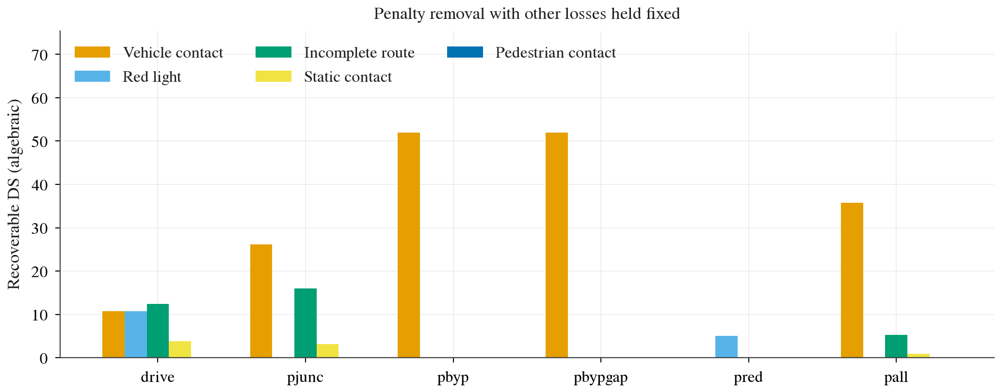
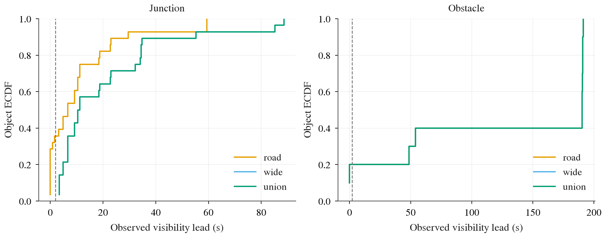

# B2D 特权上限：路口冲突、绕障与红灯（预登记）

任务已完成：按用户最新指示，只检查已有低分路线，停止696次扩样确认批，完成44次小规模失败诊断。原记录与全部已完成结果保留；一次日志错误已停批修复，原登记门不追认通过。结果正文只回答技能值多少、执行卡在哪里、物体能提前多久看见。

## 当前诊断范围（新增运行之前锁定）

低分定义为上一项实验原Cinque的dev（已有开发路线）两seed（交通随机种子）平均DS（路线完成度乘违规罚分的驾驶分数）小于100，来源为只读的`$DATA_DIR/runs/op_l_b2d/arms/ld-drive-s{0,1}/`。满足的恰好7条；不按本实验的新特权结果选路，也不复测历史满分的15102、22535、28147。

| 已有失败 | 锁定路线 | 同批比较 |
|:--|:--|:--|
| 路口碰撞、卡死与出车道 | 27043、9196、37969 | drive、pjunc、pall |
| 施工绕障卡死 | 24497 | drive、pbyp、pbypgap、pall |
| 闯红灯 | 24944、27870、27297 | drive、pred、pall |

每项都跑交通seed0/1，共44次闭环，三张卡动态领取任务，每卡仍最多2slot（一个模型服务与其驾驶进程队列）×4worker（独立驾驶进程）。保留冻结Cinque与已经锁定的规则、参数；只复用现有队列、事件解析、统计和录制，不增建评测框架。所有这44次直接录制对照视频，避免为了录像再跑一批；每臂按数值route/seed顺序挑首个实际成功与失败，缺哪种就如实写缺哪种。

开始前的日志修复单单位必须过原完整性、有限性、时延与无崩溃检查；既有13个非评测debug单位用修正后的官方状态检查重新复核，适用执行检查原线不变。源码必须自动证明相对锁定版只改日志序列化、控制计算与几何逐字节不变，才能复用调试证据而不重复调参。任一检查不过仍停批。

报告主表按上表各自对应路线比较，DS配对差、事件机会与失败、完成率、碰撞/红灯罚分、放行与回正、相机可见性都保留。所有区间仍按整条路线聚类bootstrap（路线重抽样）2000次、seed0；绕障只有1条路线，其退化区间不能代表总体不确定性。低分选样、路线数缩小和不同臂的样本范围都明确标记，因此这是诊断，不能沿用原“每技能每臂≥30机会”的确认读法，也不宣称推广到所有路线。原I0/J1/B1/B2/R1/X1/V1/A1阈值保留，原确认实验停止后不将其改成小样本通过线。

按既有装填吞吐外推44次约22min，再计低分路线长尾、录制、启动、统计与读图，暂估45–75min；这是执行预算，实际完成时间以日志为准。交付正文保持简洁，早先执行细节折叠在文末供核验。

已删除本任务的4个一次性中间脚本：旧调度drain、并发模型独立检查、独立读数检查、临时修复准备。仍需使用的源码核验合并到最终checks；最终保留focus（低分路线执行）、chain（并行队列）、geometry（特权几何）、checks（检查）、report（统计）、plots（绘图）六个任务脚本，原有驾驶与录制驱动继续复用。控制代码不因清理而改变。

## 完成结果（2026-10-01）

**44/44次低分路线诊断已完成，正式诊断运行耗时21.5min。红灯最值得先做；绕障能解开原来的卡死，但绕完仍撞车；当前路口规则没有显示可靠收益。** 原696次确认实验按用户指示停止，本表只使用新44次，不混入此前192条有效记录。

95% CI（置信区间）均按整条路线聚类bootstrap，2000次、seed0；先在每条路线内平均两个交通seed，再计算DS配对差。RC（路线完成百分比）与官方违规逐条核对。不同技能使用各自登记的对应路线，不能直接比较各臂均分。

| 特权臂／路线数 | 同批drive DS → 特权DS | DS配对差 [95% CI] | RC：drive → 特权 | 登记事件失败／机会：drive → 特权 | 失败率差，pp（百分点）[95% CI] |
|:--|--:|:--|:--|:--|:--|
| pjunc／3 | 38.97 → 40.96 | +2.00 [−0.16, +6.15] | 72.57 → 71.98 | 2/2 → 2/2 | 0 [0, 0] |
| pbyp／1 | 20.73 → 48.00 | +27.27 [27.27, 27.27] | 31.89 → 100 | 2/4 → 0/4 | −50 [−50, −50] |
| pbypgap／1 | 20.73 → 48.00 | +27.27 [27.27, 27.27] | 31.89 → 100 | 2/4 → 0/4 | −50 [−50, −50] |
| pred／3 | 75.00 → 95.00 | +20.00 [+15, +30] | 100 → 100 | 6/6 → 5/8† | −37.5 [−66.7, 0]† |
| pall／7 | 51.80 → 50.23 | −1.57 [−15.02, +11.62] | 78.52 → 90.45 | 15/33 → 15/38† | −5.98 [−23.14, +10.56]† |

绕障仅1条路线，区间退化不代表有精确的总体效果。路口实际识别出的主机会只有9196的两次；27043和37969的其他碰撞没有进入该规则定义的路口机会，不能用2/2代表所有路口失败。路口事件bootstrap有591/2000次无机会、红灯有84/2000次无机会；表中事件区间排除未定义重复，不满足确认功效。

† **红灯事件代理未通过与官方违规的一致性核验。** 代理用离散路线的停止线投影判断红灯越线，会在官方未判违规时计为越线，也把路线末端未超过投影终点计为未通过。原登记读数保留，没有看结果后换口径；pred及pall的相关事件数字只作代理诊断，不用于确认执行失败或技能价值。官方结果是红灯违规 **5次→1次**、发生违规的运行 **5/6→1/6**，且pred没有新增碰撞或卡死。后者作为事后补充读数，按路线重抽样的比例差为−66.7pp [−100, −50]，不能替代原R1事件检验。逐条差异见[red_readout_audit.csv](../research/results/b2d-privileged-ceiling/focus/red_readout_audit.csv)。

### 三个问题的答案

**技能值多少。** 在这批已有低分路线，红灯停车与绿灯恢复挽回20 DS；施工24497绕障挽回27.27 DS且RC从31.89升到100。路口单项只涨2 DS，区间跨0、官方撞车仍5次，不能支持现在就注入这版冲突规则。它使用当前真值的匀速预测，不能把这个阴性结果解释成完美决策没有价值。

**管线能否执行。** 绕障的两臂均4/4次登记机会绕过且回正、相关障碍接触从2→0，局部执行通路可用；但每臂两次运行仍出现3次官方撞车，DS停在48，说明下一步需要把绕行路径与周围车辆安全、纵向约束一起处理。该路线没有可量的对向最小间隙，pbyp与pbypgap相同不能证明间隙检查无用。pjunc的两次机会都加了约束，却仍接触并等待约60s，停等与通行链尚不可靠。pred记录的8个灯事件均观察到绿灯后速度超过1m/s，延迟0–0.95s、中位数0.875s、无删失、8/8≤3s；这是放行通路证据，事件越线代理的误差另计。

**物体能提前多久看见。** 下表是drive中的几何视野，union（任一模型相机可见）不包含遮挡判断。它只是记录窗口内几何可见性的上界；开头已可见的left-censored（首次可见早于记录起点）对象，表中提前量是几何提前量的下界，不能当成真实首次可见时刻。模型是否识别到物体没有测量。

| 类型／相机 | 对象观测数 | 开头已可见／窗口内未见 | 观测提前量中位数；范围，s | 确定<2s比例 [路线CI] | 首见距离中位数，m | 首见宽×高中位数，px（像素） |
|:--|--:|:--|:--|:--|--:|:--|
| 路口／road | 28 | 14／8 | 6.6；0–59.4 | 35.7% [35.7,35.7] | 78.4 | 72.3×47.9 |
| 路口／wide | 28 | 24／0 | 10.8；3.4–88.6 | 0% [0,0] | 69.0 | 16.2×18.7 |
| 路口／union | 28 | 24／0 | 10.8；3.4–88.6 | 0% [0,0] | 69.0 | 75.8×44.9 |
| 障碍／road | 10 | 8／2 | 190.2；0–191.2 | 20% [20,20] | 47.4 | 18.9×32.1 |
| 障碍／wide | 10 | 8／2 | 190.2；0–191.2 | 20% [20,20] | 47.4 | 4.1×6.9 |
| 障碍／union | 10 | 8／2 | 190.2；0–191.2 | 20% [20,20] | 47.4 | 18.9×32.1 |

对象数不是独立事件数，路口对象实际来自单条有机会的路线，591次bootstrap无分母；障碍也只有1条路线，两种退化CI不能推广。障碍的长提前量主要来自原车长时间停着；未见对象只表示本记录窗口内未见。当前不能判定“普遍缺相机输入”，也不能证明实际感知足够；wide确实覆盖了road几何未见的这批路口对象。

### 官方违规、配速与损失去向

以下违规为同批运行的总次数，平均车速单位m/s；撞行人、stop sign（停车标志违规）、route deviation（偏离路线）、官方route timeout（路线超时）和scenario timeout（场景超时）均为0。TickRuntime（达到仿真tick上限）6次和blocked（驾驶卡死）8次作为驾驶结局保留；Completed（评测流程结束）30次不等于无违规成功。

| 对应组／臂 | 运行数 | 撞车 | 撞静物 | 红灯 | 出车道 | 官方卡死 | 最低速度提示 | 平均车速 |
|:--|--:|--:|--:|--:|--:|--:|--:|--:|
| 路口／drive | 6 | 5 | 3 | 0 | 3 | 2 | 83 | 1.67 |
| 路口／pjunc | 6 | 5 | 2 | 0 | 2 | 2 | 82 | 1.59 |
| 绕障／drive | 2 | 0 | 2 | 0 | 0 | 0 | 10 | 0.23 |
| 绕障／pbyp | 2 | 3 | 0 | 0 | 0 | 0 | 36 | 2.74 |
| 绕障／pbypgap | 2 | 3 | 0 | 0 | 0 | 0 | 36 | 2.92 |
| 红灯／drive | 6 | 0 | 0 | 5 | 0 | 0 | 112 | 2.68 |
| 红灯／pred | 6 | 0 | 0 | 1 | 0 | 0 | 112 | 1.83 |
| 全7条／drive | 14 | 5 | 5 | 5 | 3 | 2 | 205 | 1.90 |
| 全7条／pall | 14 | 17 | 1 | 0 | 10 | 4 | 234 | 1.91 |

最低速度提示沿用官方列表计数，既有实现里的相对速度提示名称不能当成单纯慢车次数。特权臂改变配速；本实验不能分离多少收益来自单纯变慢。

丢分分解固定其他罚分，仅代数移除某一项；各项有乘法重叠，不能相加，也不是新增技能的因果收益。

| 对应组／臂 | 完全消除撞车 | 消除红灯 | 走完路线 | 消除撞静物 | 消除撞行人 | 实际DS−重建DS |
|:--|--:|--:|--:|--:|--:|--:|
| 路口／drive | 25.03 | 0 | 14.19 | 5.19 | 0 | −0.68 |
| 路口／pjunc | 26.15 | 0 | 16.02 | 3.16 | 0 | −0.35 |
| 绕障／drive | 0 | 0 | 44.27 | 11.16 | 0 | 0 |
| 绕障／pbyp、pbypgap | 52.00 | 0 | 0 | 0 | 0 | 0 |
| 红灯／drive | 0 | 25.00 | 0 | 0 | 0 | 0 |
| 红灯／pred | 0 | 5.00 | 0 | 0 | 0 | 0 |
| 全7条／drive | 10.73 | 10.71 | 12.41 | 3.82 | 0 | −0.29 |
| 全7条／pall | 35.70 | 0 | 5.28 | 0.87 | 0 | −3.06 |

pall消除了官方红灯违规，却将撞车5→17、出车道3→10，吞掉局部收益。原58条全覆盖的单项之和没有完成，不能判原A1交互。事后在每条低分路线上只比较其对应单项，按7条加权单项增益+13.32，pall相对它少14.89 DS，CI [−34.48,+0.27]；区间跨0，只能说点估计提示联合仲裁互相干扰，不能确认负交互。该补充定义和结果存于[secondary_contrasts.json](../research/results/b2d-privileged-ceiling/focus/secondary_contrasts.json)。

### 登记线与偏离

| 原登记线 | 最终判定 |
|:--|:--|
| I0：696齐、程序崩溃0、每主技能每臂≥30机会 | **未通过**：原批7次程序崩溃，停止扩样；新44次无程序崩溃，但不补足原确认范围与机会数。 |
| J1：路口失败率差CI上界<0且DS差>0 | **未通过**：当前上界0，主机会仅2次；原扩样检验未完成。 |
| B1/B2：绕障同样条件 | **不宣称通过**：选中路线的数值方向满足，但仅1条路线、4次机会，原功效条件不足。 |
| R1：全58条红灯失败率差CI上界<0且总体DS差>0 | **未通过／未完成**：代理CI上界0，且代理一致性失败、范围缩小；官方补充不能替代此线。 |
| X1：成功且回正/放行≥80%，执行失败≤10% | **仅绕障局部4/4满足，整体未通过**：路口0/2；红灯事件代理不可用于确认，放行8/8单独核验。 |
| V1：确定union<2s的CI下界>50%，机会≥30 | **未通过**：路口0%、障碍20%，机会不足且有删失与遮挡限制。 |
| A1：总体DS差>0、总体失败率CI上界<0与原单项和检验 | **未通过／原交互未完成**：当前DS差−1.57，事件差CI跨0。 |

偏离清单：①原最小试跑无红灯停车机会，用预先排除评测的debug路线补验证；②修正几何和日志错误，保留失败记录、停批检查，最终控制锁定后只修日志边界；③按用户指示从696次扩样改为7条历史低分、44次相关臂诊断，录像直接随运行录制；④最终发现红灯代理与官方口径不一致，保留代理并限制解释，没有改控制、阈值或重跑挑结果；⑤官方红灯运行发生率和“pall对每路对应单项”仅作事后补充。完整执行记录在折叠区，没有放宽登记线。

**已验证**：44个唯一route/arm/seed组合、原始官方DS/RC/主要违规逐条一致、程序崩溃0、44段视频的文件与非空画面检查、配对DS与登记事件bootstrap独立重算一致；调试执行、优化前后数值一致性证据仍保留。**只是推断或未验证**：向其他路线推广、相机真实遮挡与模型识别能力、技能的完美决策上限、间隙检查价值、联合负交互。红灯代理仅验证“按登记实现复算一致”，其有效性核验未通过。

下一步建议：先将红灯状态→停车→明确绿灯放行做成可学习信号或独立小头，保留当前仲裁通路；绕障先补局部安全与纵横向协同，再学路径候选；路口先修冲突机会覆盖、预测和停等/放行，不能直接把这版规则蒸馏进模型。此为诊断后的建议，没有在本任务训练或追加评测。

### 图与实际运行视频

红灯与绕障的DS收益清楚，路口和叠加的DS区间跨0。右侧红灯及叠加的事件差含有已识别的红灯代理误差；绕障区间退化不能读成总体证据。

绕障剩余损失主要是撞车，叠加臂也被撞车吃掉。各臂对应路线不同，只能结合上面的同组表读，不能横比柱高或将损失项相加。

wide补充了road的路口几何视野，不能据此判普遍缺相机输入。左删失与长时间等待都影响横轴，曲线不代表模型已经识别了对象；该图的ECDF（经验累积分布）以对象观测为单位。

视频都是这44次的真实记录，MP4（压缩视频文件）留box，无录像复跑。[videos.json](../research/results/b2d-privileged-ceiling/focus/videos.json)列出完整配对路径与画面检查；按已登记的首个route/seed成功或失败选例。路径统一为`$DATA_DIR/runs/b2d_privileged_ceiling/arms/focus-low-v6-{arm}-{arm}-s{seed}/attempts/{route}/{attempt}/chase.mp4`，实际attempt以JSON为准；drive配对为同route/seed的drive目录。

| 臂 | 成功示例 | 失败示例 |
|:--|:--|:--|
| pjunc | 本批无主事件成功 | 9196、seed0 |
| pbyp | 24497、seed0：局部绕障成功，整条仍撞车 | 本批无登记障碍事件失败；两次运行都非无违规成功 |
| pbypgap | 24497、seed0：同上 | 同上 |
| pred | 27297、seed0 | 24944、seed0：官方也有1次闯红灯 |
| pall | 24497、seed0：局部事件成功，仍撞车 | 9196、seed0 |

本批三卡平均利用率39.3%／40.3%／26.1%，峰值显存65.5／64.4／46.4GiB；尾部剩余任务较少。既有相同24单位的装填对照吞吐62.07→118.21次/h（1.90倍），串行/并发模型输出最大差0；本批含录制、视频处理的44次完成吞吐122.59次/h。实际运行17:19:55–17:41:28 UTC+8（日本18:19:55–18:41:28）；原始日志在`$DATA_DIR/runs/b2d_privileged_ceiling/chain-focus/20261001-171952/`，完整数值见[timing.json](../research/results/b2d-privileged-ceiling/focus/timing.json)和[final_checks.json](../research/results/b2d-privileged-ceiling/focus/final_checks.json)。4个中间脚本已删除，最终保留六个任务脚本。

原预登记与执行记录（核验备查）

## 原预登记（保留）

原状态：debug-v4与profile完成，696次正式评测于2026-10-01 15:05 UTC+8启动，后因检查失败停批。本文原预登记在本任务任何闭环运行或新结果之前提交并push；仅查了XML（路线与场景类型配置格式）场景类型与资源元数据，没有查看这些新路线的旧成绩。任务来自[main提示词](../tmp/2026-10-01-b2d-privileged-ceiling-prompt.md)。背景已读decisions第47/49/52/57/61/74/76/81条、[op-drive](2026-09-29-op-drive.md)、[适配闭环登记](2026-10-01-op-adapt-L-b2d-prereg.md)、[量具](../research/behavior-layer-instruments.md)及[录像诊断](../research/openpilot-seed0-video-diagnosis.md)；decisions只读，由main维护。

## 问题、共用管线与臂

B2D（Bench2Drive，按路线在CARLA仿真器里闭环驾驶）在这里量特权决策能挽回多少分，以及现有控制器能否执行。原openpilot Cinque保持冻结，不训练，不换模型、相机、desire（原生离散意图输入）或导航信息。特权只进仲裁，当前其他actor（交通参与者与障碍物）的真值位置、朝向、速度以及当前灯色可以用，active_scenarios（场景脚本登记）和脚本未来轨迹不可用。

所有臂复用op_arb_agent.py / op_arb_server.py / op_arb.sh和P7（已固定的路径跟踪控制器）。drive采用原curv（以原生曲率控制转向）横向执行、R1 resume（红/黄灯前不按驾驶员恢复键）、8m/s设定速度、原路线命令区/分歧兜底、lead IDM（前车跟驰减速）、行驶中plan约束、intent停车锁存、5s恢复与低速滑行，原参数不变。特权分支关掉时须保持逐数组恒等，不复制另一套drive代码。

| 臂 | 唯一改动 |
|:--|:--|
| drive | 同批重新运行的原管线；仅增加所有臂共有的评价日志 |
| pjunc | 路口冲突时添加纵向停车约束，清空后允许恢复；横向不变 |
| pbyp | 真值静止障碍触发邻车道几何路径，不查对向间隙；纵向约束与恢复保持原drive |
| pbypgap | 同pbyp，但仅当前真值对向间隙够时开启借道路径；间隙不够保留原路径及原纵向，不额外加停车规则 |
| pred | 沿用R3a真值红/黄灯约束，补绿灯后的明确放行；非灯相关停车仍是原R1 |
| pall | pjunc、pbypgap、pred同时开；冲突/灯优先于放行 |

pbypgap的范围有意严格：它是横向候选的间隙门，不额外给纵向真值障碍刹车。这意味着“等间隙时原纵向能否停住”也是现有仲裁的执行诊断；若因此撞原障碍，不能把该失败掩盖成借道决策没有价值。各臂可能变快或变慢，都报均速、等待、卡死和超时；无配速对照，本实验不能分离纯变慢贡献。

## 精确定义与固定参数

真值每0.20s更新，控制仍20Hz；用同一world snapshot（当前仿真状态）取位置/速度，不能访问未来。查询范围100m，忽略与ego（自车）高度差>2m的actor。向量化路径投影与预测须在合成子集上和逐actor参考计算对齐，几何坐标误差≤1e-6m、全部开关一致。所有臂记录独立collision sensor（碰撞传感器，仅评价），接触对象ID、时刻和冲量；不把它送入模型或用于提前控制。

**路口**：路线地图waypoint（车道中心点）的is_junction区连成冲突区，当前进度往前60m内查区。仅对当前速度≥0.5m/s、朝向与该区路线切向差≥30°（含对向）的其他车辆检查；同行跟车仍归原lead。用当前速度匀速外推0.25…5.0s，ego沿给定路线、按原base governor（设定速度/曲率/加减速）的5s剖面前进，双方二维有向包围盒加0.5m缓冲，用SAT（分离轴检验，判断两个矩形是否重叠）判断同一时刻冲突。不能用场景的将来轨迹。

纵向停车位置是冲突首次预测路线位置之前，给前保险杠留2m；用原IDM零速目标生成约束。冲突不存在持续0.8s后释放，若该特权约束导致站住，最多2s暂时去掉plan与latch（锁存）阻止放行的约束，保留base、lead和仍生效的灯/冲突约束；达到1m/s即结束这段放行。已经进入停车点、来不及刹住要照实记late，不调大时间窗追结果。

**静止障碍**：vehicle或static.prop对象速度≤0.2m/s连续2s，包围盒与原本车道路线路径走廊（ego半宽+对象投影半宽+0.15m）相交，位于前保险杠前50m至后5m，路线位置不在junction；车辆若处于路线红灯50m内则不当绕行障碍。同路线上相距≤20m的挡路物并为一组，用整组最前/最后包围盒确定绕行区。不能按scenario类别或active_scenarios定位。

邻道只取地图Driving车道，高度差≤0.75m、中心距2.5–4.5m；优先同向左、再同向右、最后对向左/右，固定顺序不看运行结果。不可达就记no_adjacent_lane。横移量用该邻道真实中心与原车道中心差；路线法线沿给定路线变化。首障碍前20m开始smoothstep（端点斜率为0的平滑插值），15m内移到邻道；最后障碍后8m开始回原道，15m内回正。原路线进度、原纵向信号保持；开启时临时改为路线P7跟踪该路径、curvature置空，结束后恢复原横向归属；只改这段几何，不改openpilot输出。

pbypgap借对向道时，以当前速度/位置外推对向车辆，与借道走廊相交的最早到达时间必须大于`(到整组末端+23m的距离)/max(ego速度,2m/s)+2s`，且当前最近纵向间隙≥15m才允许开启。已开始借道后完成回正，不因新出现车辆突然跳回原路；记录此时gap违规和最小二维包围盒表面间距。无间隙臂不做这道门。上述门只使路径保留原道或开放邻道，不暗加真值纵向刹车。

**红灯**：原R3a route stop waypoint定义，红灯距前保险杠≤50m、能以4m/s²停下时添加约束，停止线前0.5m停；黄灯沿原可停性判断。红/黄阻止plan、lead或timer释放灯相关停车。只有先前真值灯约束已触发且对应灯变绿，才启动上述最多2s的plan/latch放行窗口，保留其他特权冲突与lead，达到1m/s即退出。非红灯相关锁存不得无限等待绿灯。

所有参数现在写死；调试只允许下列非评测路线上的一次参数修订，若需要先追加理由/新值、commit/push，再重新完成调试阶段；调试后记录配置hash（文件校验）与commit锁定，正式评测不得调参。真bug修复记录偏离，原判定线永不放宽。

## 路线与功效

从bench2drive_0.0.4_val.xml按类型选，不看成绩、不优先小town：下表每个目标类型取XML顺序中前3条；不够3条取全部。剔除原held-out19条、调试8条、dev10条后选，再原样加入dev10条。冲突新增24、障碍新增24、dev10，共58条，每臂TM seed（交通随机种子）0/1，六臂共696次正式运行。每技能预计48–60个以上机会，但实际机会数按真值日志判，不能把场景数冒充机会数；每臂不足30个则功效门失败、不判技能无效，不依据效果挑路线补样本。

| 组 | 类型 | 固定路线与town |
|:--|:--|:--|
| junction | NonSignalizedJunctionLeftTurn | 7616 (Town12)、6999 (Town12)、7157 (Town12) |
| junction | NonSignalizedJunctionLeftTurnEnterFlow | 34183 (Town13) |
| junction | NonSignalizedJunctionRightTurn | 7841 (Town12) |
| junction | OppositeVehicleTakingPriority | 8859 (Town12)、9102 (Town12)、9218 (Town12) |
| junction | SignalizedJunctionLeftTurn | 4721 (Town12)、4104 (Town12)、4183 (Town12) |
| junction | SignalizedJunctionLeftTurnEnterFlow | 34391 (Town13)、35243 (Town13)、35330 (Town13) |
| junction | T_Junction | 25051 (Town01)、28180 (Town11)、27823 (Town15) |
| junction | MergerIntoSlowTrafficV2 | 36792 (Town13)、24162 (Town12)、37223 (Town13) |
| junction | SignalizedJunctionRightTurn | 5423 (Town12) |
| junction | VehicleTurningRoute | 10364 (Town12)、10255 (Town12)、9646 (Town12) |
| obstacle | Accident | 19324 (Town12)、19186 (Town12)、19359 (Town12) |
| obstacle | AccidentTwoWays | 31045 (Town13)、31100 (Town13)、30939 (Town13) |
| obstacle | ConstructionObstacle | 2520 (Town12)、18868 (Town12)、18512 (Town12) |
| obstacle | ConstructionObstacleTwoWays | 29893 (Town13)、29770 (Town13)、2608 (Town12) |
| obstacle | ParkedObstacle | 19832 (Town12)、19753 (Town12)、19681 (Town12) |
| obstacle | ParkedObstacleTwoWays | 2667 (Town12)、21546 (Town12)、21496 (Town12) |
| obstacle | HazardAtSideLane | 28387 (Town13)、29183 (Town13)、29073 (Town13) |
| obstacle | HazardAtSideLaneTwoWays | 21037 (Town12)、21188 (Town12)、21009 (Town12) |
| dev | SignalizedJunctionRightTurn | 27043 (Town15) |
| dev | VanillaSignalizedTurnEncounterGreenLight | 15102 (Town12) |
| dev | T_Junction | 24944 (Town02) |
| dev | VanillaNonSignalizedTurn | 27870 (Town04) |
| dev | StaticCutIn | 22535 (Town12) |
| dev | MergerIntoSlowTrafficV2 | 37969 (Town13) |
| dev | ConstructionObstacle | 24497 (Town06) |
| dev | VehicleTurningRoutePedestrian | 27297 (Town11) |
| dev | OppositeVehicleTakingPriority | 9196 (Town12) |
| dev | SignalizedJunctionLeftTurnEnterFlow | 28147 (Town10HD) |

调试路线8条为334、27787、24721、26872、26537、17749、25169、24955，均不进入58条评测：前6条沿用旧tuning（只调试的集），后2条增加事故/施工几何，仍按预先类型规则选。原held-out19条完全不运行。主技能统计用对应新增类型组，连续性dev单列；58条总体DS亦报，不能事后挑某一组的显著结果当主结论。

## 事件定义与读数

事件机会不以特权开关是否触发来定义，否则drive无机会。所有臂都由同一评价器独立检查真值。路口机会：当前或前60m路口区上，其他moving车辆的0–5s匀速轨迹与路线走廊相交且方向差≥30°；同一路口合并全部相关车辆，直到ego越过区末5m，或运行终止。报告机会数、涉及车辆数、接触碰撞、v<0.2m/s连续≥1s的等待、等待总时长；未越过区且连续等待≥60s或blocked/timeout终止算失败，碰撞也算失败。预测停车与真实安全通过是两个不同指标。

障碍机会按上述真值静止/挡路定义，同组只计一次；报告过去、过去且回正、停住卡死、与组对象碰撞、no_adjacent_lane。主成功要求越过组末6m、并在回正区末后恢复到原路线横向≤0.75m；碰撞、到运行终止仍没完成回正、或原地≥60s都算失败。借对向道的表面最小间隙、开始时gap、开放/关闭次数另报。

红灯机会：路线真值灯首次为红、距离(0,50]m，按灯ID/停止线合并至越过后5m或运行结束；报告停住、穿过时仍红、绿灯后首次v>1m/s的时差，未起步为右删失（只知道等待至少这么久）。黄灯控制保留但黄灯机会单列、不混红灯主分母。红灯主失败=闯红或仍未通过且blocked/timeout；放行≤3s比例另报，不让“没闯灯但永远不动”当成功。

碰撞采用额外sensor任意冲量≥1N的事件相关接触，同对象1s内接触合并；B2D违规计数另报，二者定义不同，不能混用。卡死/超时属于驾驶结局，不是程序崩溃。每事件保存开始/结束时刻、route进度、对象ID、几何与控制状态，未完成不悄悄从分母剔除。

汇总DS（Driving Score，路线完成率乘违规罚分）、RC（Route Completion，完成率）、各类违规、blocked/timeout、均速、横向执行偏差与控制时延。丢分分解用RC×0.5^撞人×0.6^撞车×0.65^撞静物×0.7^闯红重建，报与实际DS的差；每次删掉一项罚分反推该项可挽回的平均DS，路线未走完项把RC设100；这是代数反事实而非实测因果，各项乘法重叠，不能相加，stop sign等未建模罚分留在残差。

## 可见性：几何上界，不做遮挡

仅drive的自己的运行读数。0.2s真值轨迹中记录100m内对象3D包围盒，投影到原road/wide的native（原始相机图像）1928×1208平面，使用现有rig位置与焦距。包围盒前方角点的投影与图像边界相交且裁后面积≥4px²就算几何进入视野；记录两个相机分别和union（任一相机）首次时刻、距离、框宽/高/面积，终点取相关碰撞最早时刻，否则与ego二维表面间距最小时刻。20Hz相机、5Hz真值采样产生≤0.2s时刻量化误差。

不读depth/语义分割，也不做遮挡raycast（射线检查），所以首次几何可见提前量是实际无遮挡可见的上界；native图像含模型warp crop（输入裁剪）之外部分，又是对模型可见性的宽松上界。很早几何可见不证明模型读得出；上界仍<2s才支持输入来得太晚。首个记录已经在视野里的对象标left-censored（更早是否可见未知），不把截断的<2s算确定的不足；始终未进入两相机视野则提前量按0单列。报告完整分布、可估与删失数、<2s比例的下/上界，不把删失当成0。

## 统计、登记线与结局读法

全部CI（confidence interval，置信区间）按route聚类bootstrap（整条路线连两个交通seed一起重抽），2000次、seed0、两侧percentile 95%。DS先每路线平均两个seed后配对。事件比例每次重抽累加失败/机会再取比例，特权对drive配对重抽同一路线；不同臂可能遇到不同对象/时机，报告分母变化，这是策略改变曝光后的路线配对效应，不是相同个体事件的随机试验。控制条件为同类型组的drive，其他组为连续性/副读数。pbyp和pbypgap分别判，不依据成绩选最好当主臂。

| 线 | 固定判据与读法 |
|:--|:--|
| I0 功效/完整性 | 58×2×6结果齐，程序崩溃为0，每主技能组各臂实际机会≥30；不足则无法判、不能写无价值 |
| J1 路口值得注入 | pjunc在junction组失败率差的CI上界<0，且同组DS差点估计>0；DS CI下界>0另称强证据 |
| B1/B2 绕障值得注入 | pbyp/pbypgap在obstacle组分别满足同样的失败率与DS条件 |
| R1 红灯有价值 | pred在全58条的红灯失败率差CI上界<0且总体DS差>0；绿灯≤3s放行比例与删失照实报 |
| X1 执行可用 | 对应特权臂主组成功且回正/放行的比例≥0.80、因执行失败占比≤0.10；事件无改善则按触发→约束/几何→控制→放行→完成的链逐步定位，不据单个阴性CI断言无技能价值 |
| V1 观测不足 | drive对应类型组确定union提前<2s比例的整段CI下界>0.50，且机会≥30；几何上界如此短才标观测问题，其他情况不证明输入足够 |
| A1 联合上限 | pall总体DS差>0且总体事件失败率下降CI上界<0；单项和使用pjunc+pbypgap+pred在总体58条的DS差，报告pall差减三项和及CI：CI上界<0是遮挡/冗余，下界>0是协同，跨0无法区分相加；不把丢分分解项相加 |

事件改善而DS不增：按丢分分解和新增失败说明别的损失抵消。没有事件改善且触发错误/执行不动：诊断感知定义或执行仲裁，不能证明学习决策没用；只有特权信号和执行链经检查却仍没收益，才说“当前这项设计未显示上限收益”。所有统计结论受匀速预测非完美未来、几何视野不含遮挡、历史dev已见与两seed限制。

## 分级检查、profile与自推进链

先pred在27787、seed0、一个worker（独立CARLA评测进程）一个特权臂（非评测、录制）。S1：配置Cinque原模型/R1正确；结果与日志齐、无程序崩溃/非有限数；灯约束至少一次在红灯前触发且到停止线前v<0.2，变绿后至少一次v>1；非灯锁存仍保留5s通路；几何开关关闭逐位恒等，合成SAT/路径参考对齐；时延median≤75ms、p99≤200ms。若该route没有红→绿观测或检查不过，停止诊断，不用另一条更好成绩偷偷替换。

再约10单位：调试drive/pred在27787，drive/pjunc/pall在26872，drive/pbyp/pbypgap/pall在25169，drive/pbyp/pbypgap在24955，共12个路线臂单位、seed0；先前pred保留为调试证据，不进正式。按适用项查：冲突约束至少一次且清空恢复；至少一个障碍被检出、可用邻道、平滑路径最大横移2.5–4.5m、路径有限、绕后回正；全部程序崩溃0、每route最多3次infra启动尝试；可正常终止的Completed/blocked/TickRuntime算驾驶结局。任何执行检查失败则ERROR停链、保留日志、修bug，不进全批。

profile与中间阶段合并：before（优化前装填）每卡1slot（共享一台Cinque推理服务的调度单元）×2worker，after（优化后装填）每卡2slot×4worker，先看显存/PID才加负载；两个路径同合成子集数值对齐，参数不因打包而变。每5s记录GPU（图形处理器）的利用率/显存与CPU（中央处理器）忙核，报告单位墙钟、sim tick/s、计划/真值查询时延、卡尾空闲与瓶颈。全批切成每臂每seed的4条路线小shard（分片），六slot动态取队列，复用各自Cinque服务，完成一个shard即自动读数；每卡最多8 CARLA、2模型server，各slot12核，全部CPU0–74内，实际资源查过后登记自己的lane与index范围。PID软门17000、硬线17500；资源不足就等，不改参数或事件线。WORKERS登录变量不改，自己的并行变量PC_WORKERS/PC_SLOTS，只在子进程接口env传旧脚本需要的WORKERS。

预计正式696route runs、每次2–10min，24worker约2–5h；大地图/卡死尾部与启动预算乘1.5，预计4–8h，加调试/profile约1h，上限计划12h墙钟。不是预算到点就删失败或改线；实际profile后更新估计。队列带DONE/ERROR/STATUS，tmux jev通过tmux_run.sh和slot_run.sh；log.txt/events.jsonl/tb/俱全；每个job边界重查自己的GO。box当前3卡、75核/约276GiB，以实测为准；以前B2D lane已归档且无CARLA进程，才允许登记这些空闲资源，不改别人的记录。

## 视频、交付与执行日志

每个特权臂和对应drive先录调试视频，再在正式结果出来后按route ID数值顺序各取首个成功/首个失败做诊断重跑（最多每臂2段；无该结局则记不存在），同route/seed drive对照也录。这些附加重跑只为录像，不覆盖正式成绩，不把新轨迹冒充原运行录像。沿用op_drive_record_agent/record_video的追车相机与编码做法，模型相机不变，MP4留box，QA（文件与渲染检查）与路径写入todo。

代码在scripts/，所有新的大产物只写$DATA_DIR/runs/b2d_privileged_ceiling/；op_adapt_r2、op_adapt_L、op_l_b2d只读。小结果下载到[research/results/b2d-privileged-ceiling/](../research/results/b2d-privileged-ceiling/README.md)，论文风格PNG由此todo引用，每图后1–3句中文读法，PDF留box；不发布Artifact（网页产物）、不提交密钥，不改decisions。每次变更在main显式stage（暂存）自己的文件，commit/push后box pull；最终按精确PID关闭自己的server/window并finish自己的lane。

执行日志从此处追加；偏离须保留原因、发生时刻、是否已看正式结果及对解释的影响。最终写全每臂表、每条线的判定、verified（已实际核验）数字和inference（推断）边界，回答技能值多少、执行是否可用、相机可见多早。

### 2026-10-01 12:36 UTC+8：S1 停链与诊断

原登记pilot已实际执行：27787 / pred / seed0，1个worker，墙钟100.76s，Completed，DS=70、RC=100，1次闯红灯。median计划时延42.15ms、p99为65.498ms；合成路径投影最大误差0、200例SAT开关全部一致，disabled几何逐对象恒等。标量投影1497点/s、向量化182282点/s（仅合成几何吞吐，不能当CARLA提速）。这些数字来自实际文件；原始日志和视频保存在`$DATA_DIR/runs/b2d_privileged_ceiling/arms/pilot-pred-s0/attempts/27787/1/`。

S1红灯停车与绿灯恢复两项均失败，ERROR已停止全批，尚无正式评测读数。诊断发现：warmup（模型预热阶段）结束时灯是绿灯，7.80s才变红，此时保险杠到登记停止线仅0.17m、车速3.35m/s，原R3a可停性判断因此没有加停车约束。这是已验证的日志时序；为何灯色时序与历史27787不同尚未证实，不能归因于seed或启动时间。没有修改停止距离、可停性判断、时延线或事件线。

偏离：增加3个只诊断、不进入正式统计的固定debug运行：同27787/seed0重跑、27787/seed1、登记debug里的334/seed0，全部pred，分别放GPU0/1/2。这不是用别的好成绩替换原pilot；原失败保留，诊断链不会写DONE-pilot，也不会开启全批。目的是区分未观测到有效红→绿机会与停车/恢复实现错误，保留三个结果的全部日志。未看任何正式结果。

### 2026-10-01 12:49 UTC+8：补充S1真实闭环验证，保留原失败

三卡并行诊断全部完成：27787同seed重跑与seed1均仍不满足红灯停车/绿灯恢复，计划时延median分别42.20/43.20ms，p99分别66.688/67.820ms；334/pred/seed0则实际红灯停住并在绿灯后起步，median44.85ms、p9968.30ms。三个运行均Completed、无程序崩溃/非有限数。334的结果是执行通路证据，不是技能收益证据。

**明确的阶段路线偏离**：原S1选择27787没有可停车的红灯机会，无法验证实现；其失败不抹掉，不把334的数字冒充原pilot。在已经登记、且完全排除正式评测的debug集合中，用334的真实停车→恢复补充S1实现检查，继续中间阶段；27787仍保留并检查一般完整性/时延，增加334/pred的严格红灯停车/绿灯恢复检查。原S1在27787上的判定仍为失败，补充验证为通过。没有修订控制参数、正式58条路线/seed或I0/J1/B1/B2/R1/X1/V1/A1判据；没有查看正式成绩。该偏离只改变验证机会，不允许用27787阴性结果推出pred无效，也不允许用334阳性结果推出pred有价值。中间阶段其余冲突/绕行检查必须全部通过才允许正式启动。

### 2026-10-01 12:53 UTC+8：中间批捕获真实bug，暂停并修复

13个中间单位（三卡、每卡2slot，当前每slot只有1条路线）中，26872/pall在首个warmup之后因邻道`borrow`标志是NumPy bool_（数组库的布尔标量）而无法JSON（机器可读日志格式）序列化，agent崩溃。检查立即停止新单元；正在运行的单元保留，失败日志不覆盖。此时没有正式运行。修复是将该几何标志明确转换为Python bool，参数与判定线不变；增加日志序列化合成检查。链同时保留第一个ERROR，避免后续“队列已停止”的异常覆盖根因。

代码审查还发现两项实现与登记不符，正式之前纠正：静止预测点的朝向不能因atan2(0,0)变成世界0度，改用当前观测yaw；绕障横向几何改变不能暗改原base纵向剖面，保持原路径计算的governor剖面，仅将该时间剖面映射到绕行几何。新增`tl_id`评价日志，不修改灯信号。所有中间单位用新的debug-v2标签重跑，旧日志和视频保留；不能把首批崩溃藏在新结果中。

远端合成复查在导入check脚本时发现新增错误消息使用了Python 3.12才允许的f-string同引号嵌套；远端Python 3.8/3.11拒绝解析。该错误未影响已启动、使用旧版本加载的单元，但阻止新版复跑；已改成兼容引号，补充在远端Python 3.8编译所有新脚本。此项是实现错误，没有产生新的运行数字或改变任何登记线。

修复版远端Python 3.8编译与合成检查已通过：路径最大误差0、200例SAT一致、原几何恒等、邻道状态可JSON序列化。334调试结果的自动读数已成功产出（3个事件，仅解析验证、不作正式证据）；另用已知恒定差的合成表验证2000次route bootstrap、两个seed合并与机会数累加。新版复跑会等旧debug slot完全退出与server清理后自动开始，避免两版队列共用server/端口。当前正式样本仍为0。

profile的固定负载明确为已登记debug8条×3份（24次drive运行，seed0），before每卡1slot×2worker、after每卡2slot×4worker，使用同一批路线和相同仲裁参数，只改变装填。重复只为吞吐，不进入正式统计；输出每路线world/agent/tree/copy耗时、每卡利用率/显存/尾部空闲及基于全负载墙钟的696次运行估计。profile与正式仍必须先通过完整debug检查；不在ERROR之后盲目装满GPU。

### 2026-10-01 13:13 UTC+8：纵向保持逻辑纠正

修复版25169的pbyp与pbypgap已实测绕过并回正，全部适用检查通过；median/p99分别45.2/75.962ms与44.0/77.067ms。26872的pjunc/pall无崩溃但最终在路口内停车到TickRuntime，不能当作成功执行。逐帧诊断显示pjunc在7.05s首次预测的停止位置是25.32m，29.75s却随新预测移到了34.23m，车后来停在34.32m冲突区内；这是停止目标向前漂移的实现错误。还发现冲突短暂消失的0.8s保持期给的是全零剖面，导致车在离停止目标很远时急停，随后又恢复，未保持登记的IDM停止位置。

纠正为同一个未清空冲突episode（连续的一次冲突）保留最早停止目标；0.8s清空确认期间继续同一目标的IDM剖面，不改成全零。清空后按原2s窗口放行，新的episode重新设置目标；5s预测、2m保险杠余量、0.8s确认与2s放行均不变。此项为停车约束保持的bug修复，不改登记参数或技能判据；用debug-v3重跑全部中间单位，v2结果完整保留。没有正式评测数字。

资源监控补充cgroup CPU忙核数与内存读数；17500 PID硬线触发时不只是停新队列，而是按确切PID逐个终止本链wrapper及其子进程，并核对进程启动时刻防PID重用。不会匹配进程名，也不停止其他lane。正式运行之前记录控制源码SHA-256（内容校验），每个单元启动时检查一致性，修复版debug使用独立完成标记，不能复用旧版通过标记。

### 2026-10-01 13:36 UTC+8：debug-v3锁定，通过实现检查后开始profile

13个中间单位全部完成，无程序崩溃。适用检查均通过，包括334真实红灯停住→绿灯恢复，25169/24955的障碍检测→几何开启→绕后回正，26872的冲突约束与至少一次清空后恢复。完整逐项检查与控制校验在[debug_v3_checks.json](../research/results/b2d-privileged-ceiling/debug_v3_checks.json)与[debug_v3_lock.json](../research/results/b2d-privileged-ceiling/debug_v3_lock.json)。通过的是触发/执行通路检查；26872的pjunc仍在后续冲突中卡死，不能将该“检查通过”写成路线成功或X1通过。

已核验的调试方向：v2事故路线25169的drive为DS34.81/RC34.81，pbyp为DS36/RC100（撞车2次），pbypgap为DS21.6/RC100（撞车3次）；v2施工路线24955的drive为DS22.5225/RC34.65，pbyp及pbypgap为DS36/RC100（均撞车2次）。v3路口26872的drive为DS60/RC100（撞车1次），pjunc为DS38.8/RC38.8（无撞车、TickRuntime）。这些只有debug、seed0，不能用来判断J1/B1/B2/R1或替代正式CI；它们说明绕障能通过但碰撞仍吞分，路口减少碰撞却可能卡死。

真实代码的保持状态测试已核验：清空确认期仍保持有正位移的IDM剖面；观测到自有停车之后才放行；未观测自有停车时绿灯不能授权清除原锁存。最初测试跳过了停车观测帧，因此正确地没有放行；补齐该帧后上述四项通过，结果见[junction_hold_smoke.json](../research/results/b2d-privileged-ceiling/junction_hold_smoke.json)，并未改实现来迎合测试。

13:36开始三卡before装填：每卡1slot×2worker；完成后自动切after每卡2slot×4worker，再由同链进入696次正式评测。profile只用固定debug8条×3份，不读取正式效果；当前没有正式数字。实际整批估计待profile后更新，暂沿用预登记4–8h加调试/profile预算。

### 2026-10-01 14:04 UTC+8：正式之前纠正未来车身中心

最终几何审查发现，ego的未来包围盒朝向用了未来路线切向，但从rear axle（后轴轨迹参考点）平移到车身中心时仍用当前朝向；90°转弯时中心位置可错约1.964m，会影响SAT冲突判定。因此在FULL_STARTED仍不存在、无任何正式运行时，按确切自有PID停止了profile链及其子进程，保留原始结果。旧before的24次已完成，after尚未完成；整套使用v4独立标签重做，避免缓存跳过造成错误吞吐。

修复为未来车身中心沿未来朝向从后轴平移1.3886m；静止点继续用当前观测朝向。加入90°路径与静止路径的解析坐标检查，随后重做debug-v4全部13单位；v3仍保留为历史证据，不用旧的通过标记跳过。该修复纠正车辆几何定义，不改变5s匀速预测、任何控制参数、正式路线/seed或所有登记线；模型与相机不变，没有任何正式成绩可供选择。

14:13补清理停止后脱离wrapper（进程启动包装层）的16个自有CARLA进程：逐个核验环境中的本实验OP_ARB_DIR、预留index 300–335和PID启动时间，再按确切PID终止；不碰其他lane。停止wrapper时也终止了slot包装层，未自动留下failed标记，因此核验其确已退出、无正式启动之后，为自己的旧slot补写带原因的failed文件，解除v4等待。v4合成检查已通过，包括未来车身中心两例解析坐标；三卡六slot已实际开始重跑13单位。

正式前的读数审查还纠正了障碍事件合并：同一次观测若连接了两个历史障碍ID组，必须将两组并成一个机会，不能各计一次。此项落实登记的ID并集合并定义，只修改评价解析，不改控制、机会定义或统计判据。

14:17评价检查全部通过：[readout_checks.json](../research/results/b2d-privileged-ceiling/readout_checks.json)。构造历史验证两个独立障碍组被后续观测连接后只计一次机会；同一对象1s内重复接触只计一次；完成回正的无接触事件成功、有接触事件失败。已知差值表中4条路线×2seed的DS差固定+5、失败率差固定−1，2000次route bootstrap全部得到对应常数CI；三条真实debug的DS/RC/撞车/闯红灯数与官方记录一致，解析每条0.07–0.93s，没有正式数据进入检查。其中特定v3绕障调试的DS仅12.96、RC100，碰撞罚分依然严重，不能用较早v2的DS36当成稳定效果。已关闭完成的自有tmux窗口，原日志均保留。

评价字段补齐登记的借道开始时gap、门开关次数、已借道后gap关闭，以及单独的黄灯机会表；黄灯不进入任何主事件分母。执行触发归因改为核对当前事件对象ID，避免将附近另一障碍的绕行或另一路口的停车误记成本事件的约束。控制源码未变，正式数据仍为0。

### 2026-10-01 14:30 UTC+8：debug-v4通过，锁定后重做profile

13个单位全部完成，无程序崩溃；全部适用实现检查通过，[逐项检查](../research/results/b2d-privileged-ceiling/debug_v4_checks.json)与[控制锁定](../research/results/b2d-privileged-ceiling/debug_v4_lock.json)已保存。334/pred实测红灯停车与绿灯恢复，median/p99为37.6/61.432ms；26872/pjunc约束与至少一次清空恢复通过，median/p99为46.1/74.501ms，但之后仍TickRuntime；两条pbyp均完成绕后回正，median为44.6/47.0ms、p99为73.76/93.88ms。不能把这些实现检查写成X1已通过。

| debug路线（seed0） | drive DS / RC | pjunc DS / RC | pbyp DS / RC | pbypgap DS / RC | pall DS / RC |
|:--|--:|--:|--:|--:|--:|
| 26872 | 60 / 100 | 37.59 / 37.59 | — | — | 18.1246 / 37.59 |
| 25169 | 34.81 / 34.81 | — | 12.96 / 100 | 12.96 / 100 | 60 / 100 |
| 24955 | 22.5225 / 34.65 | — | 36 / 100 | 36 / 100 | — |

26872的pjunc/pall没有官方撞车，但仍没通过路线；25169的两个单绕障臂各有4次官方撞车，pall有1次；24955的两个绕障臂各有2次撞车。与先前版本的同seed调试记录有波动，不能把debug差值当可靠技能收益；这里未运行任何正式路线。14:30开始固定24次before装填，三卡各1slot×2worker；之后同链自动测after的2slot×4worker，再进入正式评测。

15:02补做packing（并发装填）本身的模型数值检查，见[pool_checks.json](../research/results/b2d-privileged-ceiling/pool_checks.json)：固定seed0的native road/wide BGRA（原始像素通道）输入，6个带历史状态的步骤与desire变化；先串行运行，再在4个彼此隔离、重新reset（清空历史状态）的会话中并发运行相同序列。pos/vel/yaw/acc/lead/meta等12项输出最大绝对差全部为0，登记的几何投影/SAT检查也全部一致；没有把随机闭环轨迹宣称为逐帧相同。使用after阶段已经完成的GPU0 slot0服务，仅0.13s串行和0.45s四序列并发，不新建CARLA/server、不更改模型输入或任何正式路线；这不足1s的诊断也在after阶段的原始资源采样窗口内，保留记录，不能用此小测试的耗时冒充整批吞吐。

### 2026-10-01 15:05 UTC+8：profile完成，正式全批启动

同一debug8条×3份、24次drive的完整装填结果见[profile.json](../research/results/b2d-privileged-ceiling/profile.json)、[逐路线before](../research/results/b2d-privileged-ceiling/profile_before_routes.csv)、[逐路线after](../research/results/b2d-privileged-ceiling/profile_after_routes.csv)。三卡各用登记CPU分区，正式采用每卡2slot×4worker、共24worker的动态队列；首先六个junction/drive/seed0分片，之后自动推进所有臂、seed、类型组，单个完成即解析。没有改控制或登记判据。

| 已测量指标 | before：每卡1×2 | after：每卡2×4 |
|:--|--:|--:|
| 24次路线墙钟 | 23.20min | 12.18min |
| 完整路线吞吐 | 62.07/h | 118.21/h |
| 去掉起始20tick后的总tick / 吞吐 | 45433 / 32.64tick/s | 44355 / 60.69tick/s |
| GPU0平均 / p95利用率 | 17.46% / 31.0% | 31.54% / 78.0% |
| GPU1平均 / p95利用率 | 17.14% / 32.0% | 33.05% / 68.75% |
| GPU2平均 / p95利用率 | 17.42% / 29.0% | 29.86% / 56.15% |
| 三卡各自显存峰值 | 16.32 / 16.06 / 16.35GiB | 51.17 / 51.13 / 48.48GiB |
| CPU平均 / 峰值忙核 | 14.38 / 19.64 | 19.89 / 38.48 |
| cgroup内存峰值（包含可回收file cache） | 223.77GiB | 270.80GiB |
| PID峰值 | 1797 | 2752 |

路线吞吐提升1.9045倍，tick吞吐提升约1.859倍；两个试跑的总tick差约2.4%，因此同时报tick工作量，不把相同路线/seed假定成同一条随机轨迹。profile平均GPU利用率包含启动与长尾：容易的四条完成后，同卡另一slot仍被卡死路线占用；正式用动态分片继续填空位，后续实测利用率另报，不能拿p95冒充平均。

瓶颈有实际计时：[profile_derived.json](../research/results/b2d-privileged-ceiling/profile_derived.json)中逐路线非加权平均agent阶段102.27→99.36ms，world tick14.38→11.56ms、tree6.50→4.87ms、copy9.72→7.36ms；这些计时可能嵌套，不相加。agent阶段仍是主耗时，装填提高并行覆盖；本实验额外真值snapshot按每20条计划抽样，中位数24.20→13.87ms、p9543.68→34.53ms，计划总时延中位数68.9→48.8ms，见[profile_pc_metrics.json](../research/results/b2d-privileged-ceiling/profile_pc_metrics.json)。额外真值查询仍有成本，不能宣称热路径已零开销；几何向量化与并发模型已经分别完成数值对齐，冻结批次保留当前实现。CPU、内存、PID按真实采样读数见[profile_cpu_metrics.json](../research/results/b2d-privileged-ceiling/profile_cpu_metrics.json)。

按after完整路线吞吐外推696次为5.8877h；这是debug负载的推算，不是实际完成时间。正式Town12/13比例更高，保留6–8h正式运行预期，统计与诊断录像另加约0.5–1h；不按预算截断失败路线。正式从15:05 UTC+8（日本时间16:05）启动，已发登记要求的一次启动通知。15:11首个正式4路线shard完整读数成功，尚不做任何技能CI或价值判定。

### 2026-10-01 15:47 UTC+8：调度粒度偏离，保留全部完整轨迹

正式前期观察到4路线shard的结构性长尾：其中快路线完成后，同slot的空闲worker必须等最慢路线终止才能领取下一片，导致有剩余任务却补不满。现暂停的只有自有协调器PID222243（核验启动时刻与命令后SIGSTOP，即暂停该进程），六个已启动的obstacle/drive/seed1包装进程与CARLA继续自然跑完；不会中途停止或丢掉任何驾驶失败。独立drain（等待当前包装进程自然完成）脚本带标准日志、TensorBoard与PID检查，完成后仅终止已暂停的协调器，旧slot留下明确失败/退出标记；新的同资源协调器依赖drain成功后才启动。

明确的执行偏离：后续每臂/seed/类型组按12条路线一片排队，每slot仍4个CARLA worker、每卡仍2slot、GPU0–2/CPU0–74不变。这样快路线结束便能在同一片领取下一条。仅改变队列粒度与完成缓存恢复；模型服务、输入、规则参数、58路线/两seed/六臂与所有判定线不变，控制源码SHA-256必须与debug-v4锁定逐字节一致。固定输入串行/四并发的12项输出误差0仍是这条执行路径的数值检查，不宣称不同闭环启动时刻的交通轨迹相同。

重启前扫描旧正式目录的done文件，核验无程序崩溃/非有限数、补齐每个自然完成分片的读数；已经完成的route/arm/seed不重跑，未完成的才进入新队列。将旧完成清单与新任务清单写成不可变队列文件，强制二者并集恰好为原登记696个唯一组合；重启也不因新完成结果改写片名或任务范围。原始FULL_STARTED时刻保留。此刻仅drive臂已执行或在执行，未运行任何特权臂；偏离的依据是资源空位与排队长尾，不是技能效果，不调整任何科学阈值。新调度的吞吐与每卡利用率将另报；原before/after比较仍为原固定24次负载，不用后续不同负载冒充受控提速。

16:00六个旧包装进程全部自然完成，drain检查通过，零条驾驶轨迹被中断；仅向已暂停且核验启动时间的协调器PID222243发SIGTERM/SIGCONT使其退出。16:01新协调器实际启动并恢复106条已终止正式读数，新队列51片、590条，与旧清单合并为恰好696个唯一组合。**当时写的“无程序崩溃”结论已撤回：16:34独立官方状态审查发现检查器漏掉带前缀的崩溃，不能把106条都称为有效。**控制源码校验仍为`8e6b2612e6c9a0faab1fa2caa77d7ca9df8034155442bb92fedaa0fd887be069`，与debug-v4锁定一致。证据见[queue_q12_checks.json](../research/results/b2d-privileged-ceiling/queue_q12_checks.json)，其中旧检查结果保留为错误的历史记录，不再支持零崩溃。新批首先补drive的dev/seed1，再跑pjunc，驾驶失败仍进入统计。正式初始时刻仍15:05:28；关闭已完成的旧协调器与drain窗口，仅保留活动q12窗口。

### 2026-10-01 16:34–16:44 UTC+8：官方崩溃状态漏检，停批修复日志

独立阅读B2D官方statistics_manager（写入成绩与状态的模块）发现，崩溃状态实际是`Failed - Agent crashed`等带前缀的文本；本检查器只比对`Agent crashed`等完整字符串，误将它们当成有效驾驶终止。审查时已发现6条，随后仍在运行的旧分片又产生同类崩溃，最终数以完整归档审查为准。出错路线是2667与28387的若干drive/pjunc运行；原始traceback（异常调用栈）均指向原op-drive停车锁存的`rel`计划日志字段包含NumPy bool_，`json.dumps`无法序列化。不是模型、真值规则或控制参数的错误，但它中断驾驶，因此原正式全批的I0“程序崩溃为0”已经失败，不能靠重试把这条历史改成通过。

16:34先核验PID541722的启动时间与命令，仅暂停协调器，停止新分片派发。最初安排当前分片自然结束；随后按照实质性检查失败必须停批的要求，于16:42核验每个PID启动时刻，终止自有6个wrapper的48个存活子树进程，再终止已暂停协调器；另外按环境中本实验目录核验并终止12个脱离wrapper的自有CARLA。停止时23个组合未完成，其中12个已有运行中的attempt（一次实际执行），11个尚未开始；全部原始文件保留，不删除，不将它们算完整结局。该次停止与15:47的零中断自然drain不同，分别保存记录。

修复范围提前写死：只将写日志时的`rec["rel"]`从NumPy bool_转成同值Python bool，其他值原样保留；完全不改用于仲裁的`rel`变量、状态机、模型、路径、速度、真值几何、参数、路线、seed或科学登记线。源码检查必须证明相对c1ab219唯一差异就是这一条日志字段转换，几何文件逐字节相同；真实日志表达式覆盖None、Python/NumPy真假值、timeout与privileged_clear。检查器改用官方失败消息子串判定，保留blocked/TickRuntime作为有效驾驶失败。

执行偏离：完成独立官方状态审查，把序列化崩溃的done指针及受影响的派生缓存移入本实验的`crash-audit/invalidated/`，原始attempt不动；已正常终止的驾驶失败绝不重跑。先在原崩溃路线2667跑一个明确标为诊断的drive/seed0单单位，验证日志可序列化、完整性/有限性/时延原线；它不是参数调试，也不进入正式估计。之后用独立v5标签重做原13个非评测debug单位，通过才重新锁定日志修复版并续跑未完成/工程崩溃的组合；队列与已有有效组合并集仍必须恰好696。原before/after profile继续作为同一控制计算路径的已测证据，不把日志修复诊断当成新的受控提速实验。

最终统计可以给出补齐后696条有效读数与原线的数值比较，但必须同时保留原始工程崩溃清单。**原登记I0保持失败；依赖I0的J1/B1/B2/R1/X1/A1不能正式宣称通过。**补齐后的效果称为日志修复后的诊断估计，明示与完整无崩溃预登记确认实验的区别；V1仍只按原几何可见性定义读，不能利用修复放宽可见性线。不会因任何已见效果调整规则或选择新路线。

16:45准备审查通过：[crash_repair_source_checks.json](../research/results/b2d-privileged-ceiling/crash_repair_source_checks.json)。最终归档为7条程序崩溃，192条有效已终止结果留用，原始attempt删除0；已终止的驾驶失败重跑0。新源码校验为`4c14ce8e6213adf1f14a41133a2a1c653d2f17c7afd1b8a839f4fb531645be40`，自动证明相对旧版只改一条写日志字段，真实表达式的7种值与带前缀官方状态全部检查通过。新的单单位与后续v5链已在tmux中依赖前一步成功推进，检查不通过不能进入补齐批。没有读取任何技能配对CI。

### 2026-10-01 16:50–16:57 UTC+8：单字段修复未通过，改为序列化边界覆盖嵌套标量

v5诊断单单位2667仍在19.8s模拟时刻触发同类NumPy bool_序列化崩溃；新的带前缀检查正确拒绝它，v5中间批和补齐批均未启动。median/p99为65.8/104.16ms，有限性与时延过线，但无崩溃检查失败，因此不能拿其他检查通过抵消。原始记录保存在`arms/repair-v5-2667-drive-s0/attempts/2667/1/`，不进入696条估计。

前面把具体字段归因到`rel`并不充分，现撤回“只修rel即可”的判断；检查出的事实是计划日志里有NumPy bool_。源码还存在`rb`等由NumPy距离比较短路得到的布尔值，这说明应在JSON的统一序列化边界处理，而不是猜一个字段。v6将原`rec`字段构造原样恢复，只给原`json.dumps(rec)`添加专用default转换器：NumPy标量返回同值`.item()`，其他未知类型仍报错。不会就地修改任何用于控制的变量，也不改变任何几何/仲裁表达式。

新的源码核验须证明：移除新增的纯日志转换器、把唯一的写日志调用恢复后，与c1ab219源码逐字节相同；几何文件也逐字节相同。合成检查直接编译并调用真实转换器，覆盖嵌套NumPy真假值/整数/浮点、字符串与None；原生Python记录序列化字节不变，未知对象仍拒绝。旧v5源码核验保留为历史文件，刷新后的核验补上单字段修复失败记录。随后重新跑v6单单位，再按原13个debug单位并行验证；只有全部适用检查通过才补齐剩余504个组合。原I0仍失败，科学参数、数据与所有判定线均不变。

### 用户缩小任务后的执行调整

用户要求只看历史低分路线并减少中间脚本，因此不再补齐504个扩样组合，也不重复运行已经完整通过的13个调试单位；在控制计算逐字节不变的源码核验之后，用新状态检查器重查其原始完整记录与适用执行线。额外的v6日志修复单单位仍要求完整结束并过线，低分44次批次依赖该单位成功；没有用运行中的片段冒充检查通过。历史696次确认批保持停止，其全部成绩与中断记录保留。

