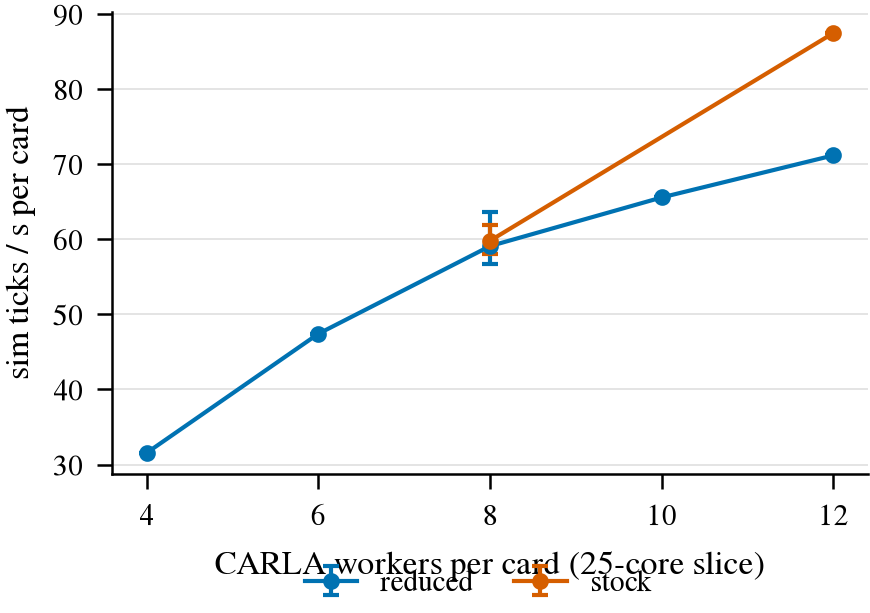

# 闭环基础设施收拢：jevdrive.cl 库 + worker profile 实验

状态: done（D1/D2/D3 已判；Stage C 的 stock run 收尾中）（lane `cl-lib`，2026-10-01 18:50 登记 GPU 1、2，核 52-76 / 77-101，server index 160-183 / 200-223）
主题: [docs/closed-loop-runbook.md](../docs/closed-loop-runbook.md)（实验完成后的英文定稿）

## 目标

把六个各自实现一遍调度的 lane 脚本（`nq4_g_lane.py`、`sch_cl_parallel.py`、`b2d_privileged_chain.py`、`op_l_b2d_chain.py` / `op_l_b2d_daemon.py`、`op_adapt_r2_lane.py`、`b2d_*_campaign.py`）里重复的部分收进一个库 `jevdrive/cl/`，新 lane 只写一份 job 声明；同时用一个便宜的预登记实验定下默认的 worker profile（worker = 一个 CARLA server + 一个 route client 进程），而不是沿用哪份文档里的数字。

现有证据（docs/carla.md「Threads per server」，2026-09-27，16 核亲和、5 worker、PDM-Lite 20 条路线）说 reduced 线程池（`-RPCThreads=4 -StreamingThreads=4 -SecondaryThreads=4`）与 stock 在 DS 上等价、线程数降到约 1/3。那次两组 arm 的 route client 都用 `--client-threads 8`，numeric thread（OMP/MKL/OPENBLAS/NUMBA 线程数）没有变，cores per worker 也只有一个点（3.2）。这次在现在的 box 上（3 卡、cgroup 75 核、每卡 25 核切片）补齐这三个轴。

## Setup

- box：2026-10-01，3 × RTX 6000D（83.6 GiB），cgroup `cpu.max` 75 核，`pids.max` 20480，内存约 276 GiB，host 208 个逻辑 CPU（2 × Xeon 8470Q，NUMA0 = 0-51,104-155，NUMA1 = 52-103,156-207）。GPU 1、2 都在 NUMA1，所以本 lane 的切片取 NUMA1 的物理核：GPU 1 → 52-76，GPU 2 → 77-101（各 25 核，不含超线程 sibling）。GPU 0 和核 0-51 留给别的 lane。
- agent：PDM-Lite（SimLingo 那份 Bench2Drive 里的 privileged expert，`scripts/b2d_expert_agent.py`，只挂 IMU，不渲染相机，所以这是 CPU/线程受限的场景）。确定性够用：2026-09-27 的 20 条里 17 条在所有重复间 DS 相同。
- 路线：40 条 = 2026-09-27 的 20 条（`scripts/carla_threads_routes.sh` 里的列表，可以和旧 run 直接对照）+ bench2drive220 其余 200 条按 id 排序后每 10 条取 1 条的前 20 条（1773,2201,2534,2844,3080,3248,3464,3666,3785,4468,14909,20920,23910,24240,24784,25383,25951,26408,27494,28099）。town 分布：Town12 25、Town13 5、其余 10。TM seed 0，每条最多 2 次 attempt，stall 480 s，route timeout 3600 s。
- profile 定义：`stock` = server 用 CARLA 自带线程池（`B2D_CARLA_POOLS=stock`）、route client 用默认线程数（每个 host 硬件线程一个，208）；`reduced` = 三个池各 4、`--client-threads 8`。numeric threads T = OMP/MKL/OPENBLAS/NUMBA 同设为 T。
- 算力：两张卡，估计约 2.7 h（每个 run 40 条约 16 min，含 server 启动和尾部）。低于 3 h，被测对象就是 harness 本身，不另做 profiling pass。

## 步骤

1. [x] 单位 1：1 条路线（1825）、1 个 worker、reduced、T = 2，GPU 1。2026-10-01 18:52 完成：finished，87 s，611 tick，server 在 index 160（RPC 10000，TM 16000）。
2. [x] 约 10 单位的 pilot：reduced / T2 / W8 的 40 条 run（一张卡），按下面的 checklist 检查；不过关就停整批。
3. [x] Stage A（profile × numeric threads）：W = 8（25 核 / 8 = 3.1 核每 worker），{stock, reduced} × T ∈ {1, 2, 4}，每格两次重复（一次 GPU 1、一次 GPU 2，顺序交错）。pilot 那个 run 计为 reduced/T2 的第一次重复。
4. [x] Stage B（workers per card）：用 Stage A 选中的 profile 和 T，W ∈ {4, 6, 10, 12}（W = 8 来自 A），外加落选 profile 在 W = 12 一次。
5. [~] Stage C（GPU 受限场景）：b2d_run 自带的相机 stub（front3，1600×900，不接模型），W = 6，stock 与 reduced 各一次，只比吞吐、线程、启动失败，不比 DS。
6. [x] 全部经 `jevdrive.cl` 调度（这同时就是交付 C：把 `carla_threads_routes.sh` 这个小 lane 改写到库上，和 2026-09-27 的旧 run 对照）。

## 测量口径

- 饱和吞吐（主指标）：每条路线的 tick 数 / 该路线 wall，按路线取均值得每 worker 速率，乘以 W 得每卡 tick/s。它不受尾部（最后几条路线时卡上 worker 不满）影响。
- 实际吞吐（辅指标）：Σ tick / （第一条 route_start 到最后一条 route_end），含尾部与 server 启动。
- 线程：每 15 s 采样一次 lane 自己进程树的线程数（server 与 client 分开），`pids.current`，切片核忙碌数，GPU util / 显存（`util.csv`）。
- 启动失败：server 启动后在第一个 tick 前死掉（`server_died` 且 0 tick）或 `RenderThread` 超时的 attempt 数。
- DS 一致：同一路线两个 run 的 DS 是否完全相同；按 pair 类型（stock-stock、reduced-reduced、stock-reduced）汇总，和 2026-09-27 的旧 run 也做同样的对照（`carla_threads.py compare`）。

## 成功标准（跑之前写死）

**D1 默认 profile。** reduced 成为默认，当且仅当以下全部成立，否则默认 stock：
(i) 饱和吞吐：Stage A 六对同 T 同重复配对里，reduced / stock 比值的中位数 ≥ 0.95；
(ii) 启动失败：Stage A 里 reduced 的启动失败次数 ≤ stock + 2；
(iii) DS：stock-reduced 配对的 DS 相同比例 ≥ stock-stock 配对的比例 − 0.10，且不一致的路线都在 stock-stock 自己也会翻的路线里，或在已知会翻的 {1956, 3564, 17563} 里；
(iv) 每 worker 线程数 reduced 更低。

**D2 numeric threads。** 在选中的 profile 下，取饱和吞吐 ≥ 最好那档 0.97 倍的最小 T。注意这只对 PDM-Lite 成立；带 torch 模型的 agent 可以在 profile 之外单独覆盖 T，这条在 runbook 里写明。

**D3 每卡 worker 数（25 核切片，CPU 受限的 agent）。** 取饱和吞吐达到各 W 中最大值 0.95 倍的最小 W，且该 run 通过 checklist；cores per worker = 25 / W。相机 agent 的 GPU knee（每卡约 6 个 server，bench2drive-cost.md）不由本实验改写，Stage C 只说明 profile 在 GPU 受限时是否有影响。

**每个 run 的 sanity checklist**（pilot 不过就停批；batch 里某个 run 不过，只把它标记出来并重跑一次，再不过就停）：
1. 40 条里 ≥ 38 条 finished，且没有 `worker_error`；
2. 所有 server 的 `-graphicsadapter` 是指定卡、RPC 端口在本 lane 的 index 块内、进程亲和是本卡切片；
3. 每个 server 的线程数在区间内：reduced 100-220，stock 250-500（25 核切片；按 docs/carla.md 的实测外推）；
4. 前 20 条（2026-09-27 那组）的平均 DS 在 [85, 100]（旧 run 是 90.6-95.75）；
5. run 期间卡上没有别人的 compute 进程（`util.csv` 的 CARLA 数等于本 run 的 server 数）；
6. 显存峰值 < 卡总量 − 8 GB。

## 执行记录

- 2026-10-01 18:48：box 全空（三张卡 0 MiB，`pids.current` 716；op-l-b2d、op-l-gate-curve、b2d-privileged-ceiling 都已归档）。登记 `cl-lib`，只拿 GPU 1、2。
- 2026-10-01 18:52：单位 1 通过。
- 2026-10-01 19:14：pilot（reduced / T2 / W8，40 条，GPU 1）9.7 min 完成，checklist 六项全过：40/40 finished，无 worker_error；8 个 server 都在 GPU 1、index 160-167；每个 server 154 线程；前 20 条 DS 93.49；卡上没有别人的进程；显存峰值 43.9 GB。
- 2026-10-01 19:15-20:18：Stage A 12 个 run 全部完成（pilot 计为 reduced/T2 的第一次重复），全部 40/40。
- 2026-10-01 19:52：GPU 0 空闲，追加登记到本 lane（核 0-24，NUMA0；index 230-253），在上面并行跑旧 lane 复现（`--arg stage=old`）和 Stage C，不等 Stage A。
- 偏离 1（2026-10-01 20:18，Stage B 开始前）：W = 8 时 25 核切片平均只有约 11 核忙，预登记的 W 上限 12 可能还没到 CPU 饱和，追加一个 W = 16 的 run。D3 仍按原规则，在所有 W（含 16）里判。
- 偏离 2：旧 lane 复现的两个 run 不独占卡（只比 DS，不比吞吐）。

## 结果

run dir：`$DATA_DIR/runs/cl_lib/profile`（A、B、旧 lane 复现的 arm 都在 `arms/` 下）和 `cl_lib/extra`（GPU 0 上的 lane 状态）。小表：[research/results/cl-lib/](../research/results/cl-lib/)（`arms.csv` 每个 run 一行，`summary.md` 含 DS 一致性，`routes.csv` 每条路线的 DS）。

**D1：默认 profile = reduced。** Stage A 六对（同 T、同重复）reduced / stock 的饱和吞吐比是 0.934、0.961、0.971、1.004、1.004、1.056，中位数 0.988（线 ≥ 0.95）；启动失败 reduced 1 次（一次 RenderThread 超时）、stock 0 次（线 ≤ stock + 2）；DS 完全相同的路线比例 stock-reduced 95.1%、stock-stock 94.5%、reduced-reduced 94.0%，不一致只出现在本来就会翻的 26408、2201、17563、3564 上；每个 worker 的线程 reduced 约 169（server 154 + client 15）、stock 约 561（346 + 215）。四条全部成立。

**D2：numeric threads = 2。** reduced 下 T1 / T2 / T4 的平均饱和吞吐 57.3 / 60.9 / 59.1 tick/s，只有 T2 在最好值 0.97 倍以内。只对 PDM-Lite 成立。

**D3：25 核切片、无相机 agent，每卡 12 个 worker。** reduced/T2 下 W = 4 / 6 / 8 / 10 / 12 的饱和吞吐 31.5 / 47.4 / 约 60 / 65.6 / 71.2；最大值 71.2 的 0.95 倍是 67.6，只有 W = 12 达到，所以 W* = 12（约 2.1 核每 worker 预算，实际只用 1 核左右：各 W 下切片都只有 8-12 核忙）。W = 16 没跑：16 × 6 GB 超过 75 GB 的卡预算，库的「永远放不下」检查直接拒了它（偏离 1 未执行）。相机 agent 仍按每卡 6 个的 GPU knee。

图：每卡饱和吞吐对 worker 数（25 核切片，PDM-Lite）。看橙/蓝两色在 W = 12 的差：只有一次 run，而 W = 8 时两者没有差别。

**没解决的矛盾**：W = 12 时 stock 的单次 run 87.5 tick/s，reduced 71.2（不同卡，reduced 那次还有 2 次早期启动失败）。按预登记规则 D1 只看 Stage A（W = 8），结论不变；但在密集、CPU 轻的批次之前，要先在同一张卡上重复这对 W = 12 的 A/B。在那之前建议 reduced 每卡不超过 10 个。

**旧 lane 复现（交付 C）**：`--arg stage=old` 在库上重跑 `carla_threads_routes.sh` 的设置（5 worker、client 8、两种 pool），20/20 完成，平均 DS 93.3（旧 run 90.6-95.3），与旧 run 的 DS 相同比例 0.93，旧 run 之间是 0.90；不一致只在 1956、3564、17563 上。

**Stage C**：相机 stub 的路线常跑满 4000 tick，一个 run 约 35 min；reduced 已完成，stock 在收尾，结果补在这里。

