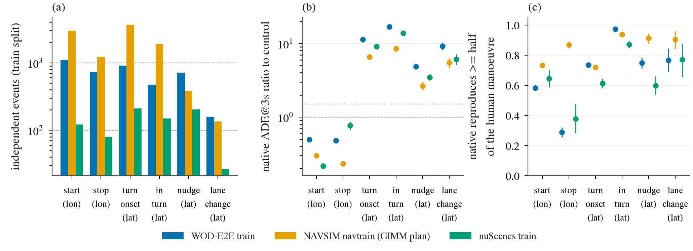

# Log expert audit：真实 log 里的专家轨迹有多少、原生 openpilot plan 在上面错多少

状态: done（2026-09-30 22:5x 开，约 1.5 h 收尾；本文「预登记」一节写于任何 slice 计数和误差数字之前，之后的偏离都记在「偏离」一节）
主题: [../research/decisions.md](../research/decisions.md) 第 47 条（严格 S 形 nudge 的定义）；op-adapt r2 [2026-09-29-op-adapt-r2-prereg.md](2026-09-29-op-adapt-r2-prereg.md)
协调: 不碰 op-adapt r2 的 run dir、chain 文件和进程；只读它的 `t/teacher/{wod,nav,nus}`（原生 Cinque plan，已跑完，文件时间 09-30 20:00–20:25）和 `index/`。纯 CPU，用 r2 没占的核（0–7、152–174）。不训练，不写 decisions。

## 问题

冻结的 openpilot（Cinque）在四类行为上跨 benchmark 有差距：从停止起步（start-from-stop）、路口前起转（turn onset）、窄路 / 绕障的横向机动（nudge、bypass）、恢复。
r2 现在的监督只有 CARLA 行人对加对原生 plan 做 13 种扰动的规则打分，表达不了这些行为。假设：真实 log 里人类自车的未来轨迹本身就是这些行为的正确专家轨迹，而且在真实域里。
训练之前先量两件事，按数据集 × 行为 slice：

1. **量**：多少帧、多少**独立事件**（同一个 log 里同一次机动的相邻帧合并）、多少个不同的 log。
2. **原生 plan 的误差**：对人类未来的 ADE（average displacement error，逐点位移误差的时间平均），拆成纵向和横向，与同数据集的「正常直行」对照 slice 比，按 log 聚类 bootstrap 出 CI。

恢复不在范围（log 里没有离开分布的起点）。

## 预登记（写于任何 slice 计数与误差之前）

### 数据与帧集合

| 数据集 | 事件计数用的帧（全 train split） | 原生 plan 来源 | 输入协议 |
|:--|:--|:--|:--|
| WOD-E2E train | 2 037 段，偶数帧（5 Hz，与 r2 缓存对齐） | r2 `t/teacher/wod`（op，fp16 port） | 前视，5 Hz 缓存，9 个 5 Hz context（1.6 s），未校准；另报纵向 ×1.06 校准 |
| WOD-E2E val | 479 段，偶数帧，只计数 | 误差用 `processed/wod_zeroshot/preds/op_cinque` 的 1 445 个 val 帧（官方协议，3 相机，10 s 历史），原始与 ×1.06 都报 | 见左 |
| NAVSIM navtrain | 103 288 个 token（2 Hz，相邻 token 相隔 0.5 s） | 主：r2 `t/teacher/nav`（NAVSIM 2 Hz sample-and-hold，全部 103 288，decisions 第 36 条记为 off-protocol）；辅：`runs/skill_pack/n1/feat/lb_n{1,2}train_*` 的 `native`（GIMM 补帧，60 k 个 token） | 见左 |
| nuScenes train | 全部 train scene（含 r2 的 50 个 dev scene），偶数 step 中每隔一个（5 Hz） | r2 `t/teacher/nus`（20 Hz 钟，每 keyframe 间隔 10 step） | 见左 |

缓存 plan 是每个 5 Hz slot 一条（33 点，openpilot 相机系），用 `op_adapt_score.plan_at` 转到后轴自车系（相机前移 `cam_x`：WOD 1.519、NAVSIM 1.646、nuScenes 1.70 m）后取 0.5…4.0 s 共 8 点。
误差只在有完整 9 个 context 的 slot 上算（`ctx` 全 ≥ 0），以免起段补零 hidden 的 plan 混进来；事件计数不受此限。不在本 lane 里重跑任何推理。

### 运动学量（全部只从自车位姿算，各数据集同一公式）

t0 自车系（x 前、y 左，后轴），未来位置 `p_k`（k = 1…8，t_k = 0.5 k s，`p_0` = 0），段 `seg_k = p_k − p_{k−1}`，段速 `sp_k = |seg_k| / 0.5`，段航向 `ψ_k = atan2(seg_k.y, seg_k.x)`（度），**只在 `sp_k ≥ 0.8 m/s` 时有效**。
`v0`、`v_{−0.5}`、`v_{−1}`：t0、−0.5 s、−1 s 的速度（WOD past 速度状态；NAVSIM `vel`；nuScenes 位姿 ±0.25 s 中心差分），`vmax1` = 三者最大。
`dpsi_past` = 过去段 `p(−1.0 s) → p(−0.5 s)` 在 t0 自车系里的航向绝对值（度），该段长 < 0.4 m 时记 0。
所有 slice 共用 4 s 的人类未来（NAVSIM 只有 4 s）；这比第 47 条的 5 s 短，是**偏离第 47 条的地方**，见下，另用第 47 条原规则（5 s，0.25 s 网格）在 WOD val 479 个 rater 帧上复现一次作实现检查（该条记 log nudge 15 帧）。

### Slice 定义（可重叠；括号里是 base 阈值）

| slice | 条件 |
|:--|:--|
| **start**（从停起步） | `vmax1 ≤ 0.5`，且 `|p_8| ≥ 3.0`，且 `max sp_k ≥ 1.5` |
| **stay**（镜像对照，停着不动） | `vmax1 ≤ 0.5`，且 `|p_8| ≤ 0.5` |
| **stop**（巡航到停） | `v0 ≥ 3.0`，且 `sp_7 ≤ 0.5` 且 `sp_8 ≤ 0.5`（3.5 s 内停住并保持到 4 s） |
| **turn_onset**（起转前） | 未在转（`dpsi_past < 10`），未来会转（有效 `|ψ_k|` 最大 ≥ 30），起转时刻 `t_s`（第一个有效 `|ψ_k| ≥ 10` 的 `t_k`）在 [0.5, 3.0] s |
| **in_turn**（已在转） | 未来会转（同上）且 `dpsi_past ≥ 10` |
| **nudge**（无转弯的 S 形横向） | 无转弯（有效 `|ψ_k|` 最大 < 30），`v0 ≥ 3`，8 段全有效且 `sp_k ≥ 2`；峰值 `peak = max|y_k|`、末端 `y_end = y_8`、末端航向 `h_end = ψ_8`、最大航向 `h_max`：`return`：`peak ≥ 1.0` 且 `|y_end| < 0.5 peak`；`hold`：`peak ≥ 1.0`、`1.0 ≤ |y_end| < 2.5`、`|h_end| < 5`、`h_max > 2 |h_end|`；nudge = return ∪ hold |
| **lane_change** | 同一「无转弯 / 全有效」前提，`|y_end| ≥ 2.5`、`|h_end| < 10`、`h_max > 2 |h_end|`（单列，不算 nudge） |
| **control**（稳态直行） | `v0 ≥ 5`，全部 `|sp_k − v0| ≤ 1.5`，有效 `|ψ_k|` 最大 ≤ 5，`max|y_k| ≤ 0.75`，`dpsi_past < 5`，且有 intent / command 时须为直行 |
| **all** | 有 plan 的全部帧（只作背景行） |

turn_onset 另按 intent 拆：WOD `intent` ∈ {2, 3}、NAVSIM `driving_command` 为左 / 右的占比；nuScenes 没有 command，不拆。
已知局限：没有地图，弯道里的 nudge 与弯道分不开（第 47 条同）；4 s 内 `y_end` 比 5 s 小，会少算慢速的 hold；`ψ_k` 在 0.5 s 段上有噪声，阈值取得比第 47 条的 3 点平滑宽。

**敏感性**（只用于事件计数，不用于误差）：loose：start `|p_8| ≥ 1.5`、`vmax1 ≤ 0.8`；stop `v0 ≥ 2`、`sp ≤ 0.8`；turn 30 → 20、10 → 7；nudge `peak ≥ 0.7`、lane_change `|y_end| ≥ 2.0`。strict：start `|p_8| ≥ 6`、`vmax1 ≤ 0.3`；stop `v0 ≥ 5`、`sp ≤ 0.3`；turn 30 → 45、10 → 15；nudge `peak ≥ 1.5`。

### 事件与计数

- **frames**：满足条件的 slot 数（各数据集自己的采样率：WOD 5 Hz、nuScenes 5 Hz、NAVSIM 2 Hz），同时报 **seconds** = frames / 采样率，两者可跨数据集比较。
- **independent events**：同一 (数据集, log) 里满足条件的帧按时间排序，相邻两帧时间差 > 1.0 s 就断开，每个连续段记 1 个事件；WOD log = 20 s segment，NAVSIM log = log_name，nuScenes log = scene（同一次驾驶会切成多个 scene，所以 nuScenes 的独立性比 WOD 弱，读数时注明）。**distinct logs** = 至少有 1 个事件的 log 数。
- 事件数在整个 train split（含无 plan 的帧）上算；带 plan 的事件数（`events_plan`）另列，作为误差那一列的样本量。

### 误差读数

对每个带 plan 的帧，plan（后轴自车系，同一 t0）与人类未来逐点比：`e_k = plan_k − p_k`。
- `ADE_H` = 平均 `‖e_k‖`（t_k ≤ H），`lonADE_H` = 平均 `|e_k.x|`，`latADE_H` = 平均 `|e_k.y|`，H ∈ {1, 2, 3, 4} s；另报有符号纵向偏差 `bias_lon_3` = 平均 `e_3s.x`（负 = plan 比人慢 / 短）。
- 与 control 的比：`ratio = slice 均值 / control 均值`，同一数据集内。
- **CI**：按 log 聚类 bootstrap（有放回重抽 log，slice 与 control 用同一次重抽，2 000 次，seed 0，取 2.5 / 97.5 分位）；均值是帧加权。CI 同时给 slice 均值与 ratio。
- WOD 报 raw 与 ×1.06（plan 的 x 乘 1.06）两版，NAVSIM 报两个 plan 来源，nuScenes 只有 raw。

### 判读规则（写死）

1. **量的分档**（train split，独立事件数）：A ≥ 1 000；B 100–999；C < 100。
2. **原生误差「明显高于 control」**：在 slice 对应的分量上 ADE@3s 与 ADE@4s 的 ratio 的 95% CI 下界都 > 1.5。对应分量：start / stop → `lonADE`；turn_onset / nudge / lane_change → `latADE`；同时也看总 `ADE`，但以对应分量为准。
   跨数据集：至少两个数据集都有 ≥ 30 个带 plan 的事件且点估计 ratio > 1.5 才算「跨数据集一致」；只有一个数据集达标的记为「单数据集」。
3. **归类**：A 档 + 明显高于 control + 跨数据集一致 → **log 模仿候选**；A 档但 ratio CI 含 ≤ 1.5 → 「数据够但原生已经不差，模仿的边际小」；B / C 档且明显高于 control → 「需要仿真数据补量」；C 档 → 「log 里基本没有」。
4. **ratio 的解读限度**：单条人类未来不是唯一正确答案（多模态），原生 plan 与它不同不等于错。所以只用 slice 对 control 的相对差，不读绝对 ADE 为「错」；start 与 stop 分量偏差的符号一起看。
5. 与 stay 比的镜像检查：start 的纵向误差应明显大于 stay（停着不动时原生应该也不动）；若 stay 的 lonADE 也高，说明原生在停车帧上有系统偏差，start 的高误差不能全算作「不会起步」。

### 预算与不做的事

约 4 h 墙钟，CPU 核 ≤ 数百 core·h，GPU 不用（缓存 plan 已有）。不训练；不改任何已登记协议；不写 decisions；不删除文件；每个 devkit / NAVSIM 进程带 `OPENBLAS_CORETYPE=Haswell`；不用 `pkill -f`。

## 步骤
- [x] 预登记提交（本节），推送，box 拉取
- [x] `scripts/log_expert_audit.py build`：三个数据集的帧表（位姿量 + 未来 8 点 + 缓存 plan）到 `$DATA_DIR/processed/log_expert_audit/`
- [x] 实现检查：第 47 条原规则在 WOD val 479 帧上复现；缓存 plan 与 wod_zeroshot preds 在重叠帧上数值一致
- [x] `analyze`：slice、事件、误差、bootstrap → `research/results/log-expert-audit/*.csv`
- [x] 图、结果表、报告

## 偏离

1. **4 s 视野与 0.5 s 段（预登记里已声明的偏离第 47 条）**：另用第 47 条原规则（5 s、0.25 s 网格、3 点平滑，`jevdrive/p6.mode_21` 原样复制）在 WOD 全部帧上单列 `nudge_47`。实现检查：val 479 个 rater 帧上该规则给出 nudge_return 1 + nudge_hold 12 = **13**，第 47 条记 log nudge 15，差 2（lane_change 3、curve_or_other 101、turn 84、stop 63、keep 215）。差的原因没查，可能是第 47 条当时用 `per_frame.npz` 的 `logged` 而不是 `future.npy`；不影响本文结论。
2. **NAVSIM 主 plan 换成 GIMM 补帧版**（看到数字之后改的）：预登记写主读数用 r2 `t/teacher/nav`（2 Hz sample-and-hold，全部 103 288）。它在 control 上 lonADE@3 = 12.8 m、`bias_lon3` = +21.7 m（plan 比人长 20 m），GIMM 版同一 slice 是 2.6 m、−4.2 m，说明 sample-and-hold 喂法（decisions 第 36 条已记 off-protocol）在有速度的帧上整体失效，误差被协议问题吞掉。所以 NAVSIM 主读数改用 skill-pack N1/N2 的 `native`（GIMM 补帧，60 k 个 token，`lb_n1train_n19968` + `lb_n2train_n40000`）；sample-and-hold 版仍完整出表并标注。事件计数不受影响。
3. **加了两个后验读数**（看到第一版误差表之后加的，预登记的读数不变、照常给出并放在前面）：(a) 匀速直行（constant velocity, CV）基线，同一组指标，报 native / CV；(b) 捕获率：plan 是否复现了人类机动的至少一半（start：4 s 位移；stop：plan 在 4 s 末段速 ≤ 1 m/s；turn_onset / in_turn / lane_change：4 s 横向偏移同号且 ≥ 一半；nudge：人类横向峰值处 plan 同号且 ≥ 一半）。原因：control 是 v0 ≥ 5 m/s 的稳态直行，纵向误差随速度放大、横向误差因选择方式趋近 0，与 start / stop（低速）和转弯类（横向大）比，ratio 主要在量速度和选择效应，不是「原生有多不会」。
4. 计数用的帧是各数据集的 5 Hz / 2 Hz 栅格；WOD val 的误差帧含少量奇数帧（官方 preds 帧），不进计数。
5. r2 teacher 覆盖率：WOD train 只有 ctx 完整的 slot 有 plan（92%）；nuScenes 起段（前 1.25 s）与末段（后 4 s）无位姿的 slot 已从表里去掉。

## 结果

Box：帧表 `$DATA_DIR/processed/log_expert_audit/{wod,nav,nus}.npz`；脚本 `scripts/log_expert_audit.py`（`build` / `check` / `analyze`）、`scripts/make_log_expert_audit_figs.py`；CSV [counts.csv](../research/results/log-expert-audit/counts.csv)（含 loose / strict 敏感性、第 47 条 5 s 规则）、[errors.csv](../research/results/log-expert-audit/errors.csv)（全部数据集 × slice × 指标 × CI）、[checks.json](../research/results/log-expert-audit/checks.json)。全程 CPU（30 核，缓存 plan 现成），分析 6 s，构建每个数据集 < 10 s。

图（NAVSIM 用 GIMM plan，WOD 用 raw）：(a) 看每个 slice 的独立事件数落在 100 / 1 000 虚线的哪一侧，WOD 与 NAVSIM 的 start、turn onset 在 1 000 上下，nudge / lane change 只有几百；(b) 是预登记的「对 control 的 ratio」，转弯和横向类高 5 到 17 倍、start / stop 反而低于 1，原因见偏离 3；(c) 是后验的捕获率，start 只有 58–73%、stop 在 WOD 只有 29%，其余 60–97%。

### 事件数（base 阈值，train split；括号内为 val）

| 数据集 | slice | frames | seconds | 独立事件 | distinct logs | 带 plan 的事件 |
|:--|:--|--:|--:|--:|--:|--:|
| WOD-E2E | start | 9770 | 1954 | 1096 (284) | 1033 | 1041 |
| WOD-E2E | stay | 17092 | 3418 | 639 (169) | 611 | 602 |
| WOD-E2E | stop | 4736 | 947 | 727 (202) | 695 | 667 |
| WOD-E2E | turn_onset | 16977 | 3395 | 912 (223) | 825 | 857 |
| WOD-E2E | in_turn | 2479 | 496 | 476 (81) | 459 | 449 |
| WOD-E2E | nudge | 1684 | 337 | 715 (184) | 569 | 667 |
| WOD-E2E | lane_change | 326 | 65 | 158 (34) | 137 | 148 |
| WOD-E2E | control | 40410 | 8082 | 2474 (526) | 1495 | 2302 |
| NAVSIM navtrain | start | 7281 | 3640 | 2994 | 948 | 2994 |
| NAVSIM navtrain | stay | 8 | 4 | 5 | 3 | 5 |
| NAVSIM navtrain | stop | 2402 | 1201 | 1225 | 576 | 1225 |
| NAVSIM navtrain | turn_onset | 13177 | 6588 | 3665 | 847 | 3665 |
| NAVSIM navtrain | in_turn | 5702 | 2851 | 1902 | 727 | 1902 |
| NAVSIM navtrain | nudge | 439 | 220 | 380 | 264 | 380 |
| NAVSIM navtrain | lane_change | 142 | 71 | 134 | 113 | 134 |
| NAVSIM navtrain | control | 2415 | 1208 | 1258 | 569 | 1258 |
| nuScenes | start | 918 | 184 | 122 (36) | 120 | 122 |
| nuScenes | stay | 7135 | 1427 | 180 (29) | 173 | 180 |
| nuScenes | stop | 395 | 79 | 80 (18) | 79 | 80 |
| nuScenes | turn_onset | 2598 | 520 | 211 (48) | 191 | 211 |
| nuScenes | in_turn | 1203 | 241 | 149 (33) | 141 | 149 |
| nuScenes | nudge | 425 | 85 | 204 (30) | 145 | 204 |
| nuScenes | lane_change | 57 | 11 | 27 (8) | 25 | 27 |
| nuScenes | control | 9641 | 1928 | 626 (132) | 409 | 626 |

**WOD-E2E train，r2 teacher，raw**

| slice | frames / events | lonADE@3 [CI] | latADE@3 [CI] | lon ratio to control [CI] | lat ratio to control [CI] | lon / CV | lat / CV | 捕获率 [CI] |
|:--|--:|:--|:--|:--|:--|--:|--:|:--|
| start | 9327 / 1041 | 0.73 [0.71, 0.75] | 0.08 [0.07, 0.08] | 0.49 [0.47, 0.52] | 1.35 [1.22, 1.48] | 0.50 | 0.80 | disp 0.58 [0.56, 0.60] |
| stay | 14730 / 603 | 0.06 [0.05, 0.07] | 0.01 [0.01, 0.01] | 0.04 [0.04, 0.05] | 0.13 [0.12, 0.15] | 4.24 | 11.96 |  |
| stop | 4285 / 667 | 0.71 [0.67, 0.75] | 0.06 [0.05, 0.06] | 0.48 [0.45, 0.51] | 1.01 [0.89, 1.15] | 0.23 | 0.63 | stop 0.29 [0.26, 0.32] |
| turn_onset | 16014 / 860 | 0.86 [0.83, 0.89] | 0.64 [0.62, 0.66] | 0.58 [0.55, 0.62] | 11.33 [10.85, 11.82] | 0.75 | 0.29 | lat_end 0.74 [0.72, 0.75] |
| in_turn | 2315 / 449 | 1.16 [1.08, 1.24] | 0.96 [0.91, 1.01] | 0.79 [0.72, 0.86] | 16.90 [15.87, 17.98] | 1.14 | 0.19 | lat_end 0.97 [0.95, 0.99] |
| nudge | 1591 / 667 | 1.48 [1.38, 1.58] | 0.27 [0.26, 0.29] | 1.00 [0.93, 1.07] | 4.83 [4.49, 5.19] | 1.62 | 0.38 | peak 0.75 [0.71, 0.78] |
| lane_change | 305 / 148 | 1.44 [1.26, 1.64] | 0.52 [0.46, 0.58] | 0.97 [0.85, 1.11] | 9.15 [8.08, 10.36] | 1.25 | 0.35 | lat_end 0.77 [0.69, 0.84] |
| control | 36197 / 2306 | 1.48 [1.41, 1.55] | 0.06 [0.06, 0.06] | 1.00 [1.00, 1.00] | 1.00 [1.00, 1.00] | 3.88 | 0.66 |  |
| all | 190955 / 2072 | 1.02 [0.99, 1.06] | 0.14 [0.14, 0.15] | 0.69 [0.67, 0.71] | 2.47 [2.37, 2.58] | 1.04 | 0.31 |  |

**WOD-E2E train，r2 teacher，纵向 ×1.06**

| slice | frames / events | lonADE@3 [CI] | latADE@3 [CI] | lon ratio to control [CI] | lat ratio to control [CI] | lon / CV | lat / CV | 捕获率 [CI] |
|:--|--:|:--|:--|:--|:--|--:|--:|:--|
| start | 9327 / 1041 | 0.72 [0.70, 0.75] | 0.08 [0.07, 0.08] | 0.78 [0.74, 0.83] | 1.35 [1.22, 1.48] | 0.50 | 0.80 | disp 0.59 [0.58, 0.61] |
| stay | 14730 / 603 | 0.07 [0.06, 0.08] | 0.01 [0.01, 0.01] | 0.07 [0.06, 0.09] | 0.13 [0.12, 0.15] | 4.49 | 11.96 |  |
| stop | 4285 / 667 | 0.73 [0.69, 0.77] | 0.06 [0.05, 0.06] | 0.79 [0.73, 0.85] | 1.01 [0.89, 1.15] | 0.24 | 0.63 | stop 0.28 [0.24, 0.31] |
| turn_onset | 16014 / 860 | 0.77 [0.75, 0.80] | 0.64 [0.62, 0.66] | 0.83 [0.78, 0.89] | 11.33 [10.85, 11.82] | 0.67 | 0.29 | lat_end 0.74 [0.72, 0.75] |
| in_turn | 2315 / 449 | 0.98 [0.91, 1.05] | 0.96 [0.91, 1.01] | 1.06 [0.97, 1.16] | 16.90 [15.87, 17.98] | 0.96 | 0.19 | lat_end 0.97 [0.95, 0.99] |
| nudge | 1591 / 667 | 1.08 [1.01, 1.16] | 0.27 [0.26, 0.29] | 1.17 [1.08, 1.26] | 4.83 [4.49, 5.19] | 1.18 | 0.38 | peak 0.75 [0.71, 0.78] |
| lane_change | 305 / 148 | 1.15 [1.00, 1.32] | 0.52 [0.46, 0.58] | 1.24 [1.07, 1.44] | 9.15 [8.08, 10.36] | 1.00 | 0.35 | lat_end 0.77 [0.69, 0.84] |
| control | 36197 / 2306 | 0.92 [0.88, 0.97] | 0.06 [0.06, 0.06] | 1.00 [1.00, 1.00] | 1.00 [1.00, 1.00] | 2.43 | 0.66 |  |
| all | 190955 / 2072 | 0.76 [0.74, 0.78] | 0.14 [0.14, 0.15] | 0.82 [0.79, 0.85] | 2.47 [2.37, 2.58] | 0.77 | 0.31 |  |

**WOD-E2E val，官方协议 preds（1 445 帧），raw**

| slice | frames / events | lonADE@3 [CI] | latADE@3 [CI] | lon ratio to control [CI] | lat ratio to control [CI] | lon / CV | lat / CV | 捕获率 [CI] |
|:--|--:|:--|:--|:--|:--|--:|--:|:--|
| start | 106 / 100 | 0.87 [0.74, 1.02] | 0.06 [0.05, 0.09] | 0.62 [0.50, 0.77] | 1.03 [0.71, 1.39] | 0.64 | 0.87 | disp 0.42 [0.33, 0.53] |
| stay | 89 / 84 | 0.06 [0.04, 0.09] | 0.01 [0.01, 0.02] | 0.05 [0.03, 0.07] | 0.23 [0.15, 0.34] | 1.78 | 10.14 |  |
| stop | 41 / 40 | 2.35 [1.64, 3.11] | 0.26 [0.07, 0.51] | 1.67 [1.14, 2.27] | 4.06 [1.17, 7.96] | 0.54 | 2.36 | stop 0.07 [0.00, 0.16] |
| turn_onset | 112 / 105 | 0.93 [0.81, 1.06] | 0.51 [0.44, 0.58] | 0.66 [0.54, 0.80] | 8.02 [6.66, 9.59] | 0.76 | 0.32 | lat_end 0.65 [0.57, 0.74] |
| in_turn | 14 / 14 | 1.58 [0.98, 2.20] | 1.17 [0.88, 1.48] | 1.13 [0.68, 1.62] | 18.47 [13.67, 24.14] | 1.35 | 0.24 | lat_end 1.00 [1.00, 1.00] |
| nudge | 14 / 14 | 1.00 [0.58, 1.61] | 0.39 [0.19, 0.66] | 0.71 [0.40, 1.16] | 6.22 [2.94, 10.45] | 0.63 | 0.51 | peak 0.79 [0.55, 1.00] |
| lane_change | 2 / 2 | 1.71 [0.24, 3.19] | 0.53 [0.24, 0.82] | 1.22 [0.16, 2.50] | 8.41 [3.52, 14.03] | 0.75 | 0.33 | lat_end 1.00 [1.00, 1.00] |
| control | 182 / 173 | 1.41 [1.22, 1.61] | 0.06 [0.06, 0.07] | 1.00 [1.00, 1.00] | 1.00 [1.00, 1.00] | 3.40 | 0.64 |  |
| all | 1445 / 1353 | 1.10 [1.02, 1.18] | 0.14 [0.13, 0.16] | 0.78 [0.69, 0.90] | 2.23 [1.92, 2.59] | 0.87 | 0.38 |  |

**WOD-E2E val，官方协议 preds，纵向 ×1.06**

| slice | frames / events | lonADE@3 [CI] | latADE@3 [CI] | lon ratio to control [CI] | lat ratio to control [CI] | lon / CV | lat / CV | 捕获率 [CI] |
|:--|--:|:--|:--|:--|:--|--:|--:|:--|
| start | 106 / 100 | 0.87 [0.74, 1.02] | 0.06 [0.05, 0.09] | 1.08 [0.86, 1.36] | 1.03 [0.71, 1.39] | 0.64 | 0.87 | disp 0.45 [0.36, 0.55] |
| stay | 89 / 84 | 0.07 [0.05, 0.09] | 0.01 [0.01, 0.02] | 0.08 [0.06, 0.12] | 0.23 [0.15, 0.34] | 1.87 | 10.14 |  |
| stop | 41 / 40 | 2.59 [1.78, 3.46] | 0.26 [0.07, 0.51] | 3.21 [2.16, 4.52] | 4.06 [1.17, 7.96] | 0.60 | 2.36 | stop 0.05 [0.00, 0.12] |
| turn_onset | 112 / 105 | 0.88 [0.77, 1.00] | 0.51 [0.44, 0.58] | 1.09 [0.89, 1.37] | 8.02 [6.66, 9.59] | 0.72 | 0.32 | lat_end 0.65 [0.57, 0.74] |
| in_turn | 14 / 14 | 1.31 [0.73, 1.95] | 1.17 [0.88, 1.48] | 1.63 [0.90, 2.52] | 18.47 [13.67, 24.14] | 1.11 | 0.24 | lat_end 1.00 [1.00, 1.00] |
| nudge | 14 / 14 | 0.71 [0.48, 1.02] | 0.39 [0.19, 0.66] | 0.88 [0.58, 1.30] | 6.22 [2.94, 10.45] | 0.45 | 0.51 | peak 0.79 [0.55, 1.00] |
| lane_change | 2 / 2 | 1.40 [1.07, 1.73] | 0.53 [0.24, 0.82] | 1.74 [1.18, 2.41] | 8.41 [3.52, 14.03] | 0.62 | 0.33 | lat_end 1.00 [1.00, 1.00] |
| control | 182 / 173 | 0.81 [0.67, 0.95] | 0.06 [0.06, 0.07] | 1.00 [1.00, 1.00] | 1.00 [1.00, 1.00] | 1.95 | 0.64 |  |
| all | 1445 / 1353 | 0.93 [0.86, 1.01] | 0.14 [0.13, 0.16] | 1.16 [0.99, 1.38] | 2.23 [1.92, 2.59] | 0.74 | 0.38 |  |

**NAVSIM navtrain，GIMM 补帧 plan（60 k token，主读数）**

| slice | frames / events | lonADE@3 [CI] | latADE@3 [CI] | lon ratio to control [CI] | lat ratio to control [CI] | lon / CV | lat / CV | 捕获率 [CI] |
|:--|--:|:--|:--|:--|:--|--:|--:|:--|
| start | 4213 / 2481 | 0.77 [0.75, 0.79] | 0.05 [0.05, 0.05] | 0.30 [0.28, 0.31] | 0.63 [0.56, 0.70] | 0.43 | 0.93 | disp 0.73 [0.71, 0.75] |
| stay | 4 / 4 | 0.06 [0.03, 0.07] | 0.01 [0.00, 0.02] | 0.02 [0.01, 0.03] | 0.16 [0.06, 0.20] | 0.33 | 5.69 |  |
| stop | 1422 / 936 | 0.60 [0.57, 0.63] | 0.07 [0.06, 0.07] | 0.23 [0.22, 0.25] | 0.82 [0.72, 0.95] | 0.24 | 0.81 | stop 0.87 [0.85, 0.89] |
| turn_onset | 7521 / 3602 | 1.96 [1.91, 2.01] | 0.53 [0.51, 0.54] | 0.76 [0.72, 0.80] | 6.59 [6.02, 7.19] | 1.97 | 0.35 | lat_end 0.72 [0.70, 0.74] |
| in_turn | 3271 / 1727 | 2.40 [2.32, 2.48] | 0.69 [0.66, 0.71] | 0.93 [0.88, 0.98] | 8.58 [7.81, 9.39] | 3.74 | 0.24 | lat_end 0.94 [0.93, 0.95] |
| nudge | 266 / 241 | 2.48 [2.27, 2.69] | 0.21 [0.19, 0.23] | 0.96 [0.88, 1.05] | 2.64 [2.33, 3.00] | 2.58 | 0.31 | peak 0.91 [0.88, 0.95] |
| lane_change | 84 / 82 | 2.53 [2.23, 2.86] | 0.44 [0.38, 0.49] | 0.98 [0.86, 1.12] | 5.48 [4.62, 6.38] | 3.26 | 0.29 | lat_end 0.90 [0.84, 0.96] |
| control | 1394 / 937 | 2.58 [2.47, 2.69] | 0.08 [0.07, 0.09] | 1.00 [1.00, 1.00] | 1.00 [1.00, 1.00] | 4.64 | 0.60 |  |
| all | 59968 / 22867 | 1.64 [1.61, 1.68] | 0.19 [0.19, 0.20] | 0.64 [0.61, 0.66] | 2.44 [2.24, 2.65] | 1.26 | 0.32 |  |

**NAVSIM navtrain，2 Hz sample-and-hold plan（全部 103 288，见偏离 2，不作主读数）**

| slice | frames / events | lonADE@3 [CI] | latADE@3 [CI] | lon ratio to control [CI] | lat ratio to control [CI] | lon / CV | lat / CV | 捕获率 [CI] |
|:--|--:|:--|:--|:--|:--|--:|--:|:--|
| start | 7281 / 2994 | 0.81 [0.79, 0.82] | 0.09 [0.09, 0.10] | 0.06 [0.06, 0.07] | 0.31 [0.28, 0.33] | 0.44 | 1.72 | disp 0.90 [0.89, 0.91] |
| stay | 8 / 5 | 0.28 [0.06, 0.31] | 0.01 [0.01, 0.02] | 0.02 [0.00, 0.03] | 0.04 [0.03, 0.06] | 1.01 | 1.74 |  |
| stop | 2402 / 1225 | 4.44 [4.32, 4.59] | 0.52 [0.45, 0.59] | 0.35 [0.33, 0.36] | 1.73 [1.46, 2.01] | 1.75 | 5.92 | stop 0.57 [0.54, 0.60] |
| turn_onset | 13177 / 3665 | 2.70 [2.61, 2.79] | 2.65 [2.60, 2.71] | 0.21 [0.20, 0.22] | 8.87 [8.23, 9.60] | 2.77 | 1.76 | lat_end 0.91 [0.90, 0.92] |
| in_turn | 5702 / 1902 | 1.61 [1.56, 1.65] | 2.89 [2.84, 2.94] | 0.13 [0.12, 0.13] | 9.67 [8.99, 10.44] | 2.52 | 1.03 | lat_end 0.99 [0.99, 0.99] |
| nudge | 439 / 380 | 9.94 [9.36, 10.51] | 0.77 [0.69, 0.86] | 0.78 [0.73, 0.83] | 2.57 [2.25, 2.93] | 9.75 | 1.09 | peak 0.56 [0.51, 0.62] |
| lane_change | 142 / 134 | 5.40 [4.44, 6.50] | 1.48 [1.29, 1.67] | 0.42 [0.35, 0.51] | 4.95 [4.22, 5.79] | 6.99 | 0.95 | lat_end 0.82 [0.76, 0.88] |
| control | 2415 / 1258 | 12.78 [12.37, 13.23] | 0.30 [0.28, 0.32] | 1.00 [1.00, 1.00] | 1.00 [1.00, 1.00] | 23.18 | 2.25 |  |
| all | 103288 / 17139 | 5.54 [5.40, 5.69] | 1.06 [1.02, 1.09] | 0.43 [0.42, 0.45] | 3.54 [3.29, 3.81] | 4.25 | 1.73 |  |

**nuScenes train，r2 teacher**

| slice | frames / events | lonADE@3 [CI] | latADE@3 [CI] | lon ratio to control [CI] | lat ratio to control [CI] | lon / CV | lat / CV | 捕获率 [CI] |
|:--|--:|:--|:--|:--|:--|--:|--:|:--|
| start | 918 / 122 | 0.66 [0.61, 0.71] | 0.08 [0.06, 0.10] | 0.22 [0.20, 0.23] | 0.88 [0.68, 1.13] | 0.47 | 1.05 | disp 0.64 [0.59, 0.70] |
| stay | 7135 / 180 | 0.03 [0.02, 0.04] | 0.01 [0.01, 0.01] | 0.01 [0.01, 0.01] | 0.08 [0.06, 0.09] | 3.81 | 4.38 |  |
| stop | 395 / 80 | 2.34 [2.04, 2.63] | 0.23 [0.14, 0.34] | 0.77 [0.67, 0.87] | 2.51 [1.51, 3.76] | 0.87 | 1.71 | stop 0.38 [0.28, 0.48] |
| turn_onset | 2598 / 211 | 1.84 [1.73, 1.95] | 0.82 [0.79, 0.86] | 0.60 [0.56, 0.64] | 9.12 [8.58, 9.69] | 1.82 | 0.58 | lat_end 0.61 [0.58, 0.64] |
| in_turn | 1203 / 149 | 1.53 [1.41, 1.66] | 1.25 [1.20, 1.30] | 0.50 [0.46, 0.55] | 13.85 [13.05, 14.64] | 2.09 | 0.44 | lat_end 0.87 [0.85, 0.90] |
| nudge | 425 / 204 | 2.80 [2.62, 2.98] | 0.31 [0.29, 0.34] | 0.92 [0.86, 0.98] | 3.47 [3.13, 3.83] | 3.38 | 0.50 | peak 0.60 [0.54, 0.66] |
| lane_change | 57 / 27 | 3.19 [2.38, 4.01] | 0.55 [0.47, 0.64] | 1.05 [0.78, 1.31] | 6.09 [5.18, 7.16] | 4.74 | 0.36 | lat_end 0.77 [0.66, 0.88] |
| control | 9641 / 626 | 3.05 [2.96, 3.13] | 0.09 [0.09, 0.09] | 1.00 [1.00, 1.00] | 1.00 [1.00, 1.00] | 7.42 | 0.79 |  |
| all | 49305 / 700 | 2.11 [2.03, 2.20] | 0.21 [0.19, 0.22] | 0.69 [0.67, 0.72] | 2.28 [2.11, 2.46] | 2.83 | 0.56 |  |

**nuScenes val，r2 teacher**

| slice | frames / events | lonADE@3 [CI] | latADE@3 [CI] | lon ratio to control [CI] | lat ratio to control [CI] | lon / CV | lat / CV | 捕获率 [CI] |
|:--|--:|:--|:--|:--|:--|--:|--:|:--|
| start | 284 / 36 | 0.64 [0.54, 0.76] | 0.10 [0.06, 0.15] | 0.22 [0.18, 0.26] | 1.17 [0.69, 1.72] | 0.48 | 1.07 | disp 0.65 [0.55, 0.75] |
| stay | 1175 / 29 | 0.02 [0.01, 0.03] | 0.00 [0.00, 0.01] | 0.01 [0.01, 0.01] | 0.06 [0.04, 0.07] | 5.16 | 5.46 |  |
| stop | 92 / 18 | 2.16 [1.76, 2.56] | 0.11 [0.06, 0.20] | 0.73 [0.59, 0.88] | 1.28 [0.70, 2.26] | 0.88 | 1.75 | stop 0.28 [0.14, 0.45] |
| turn_onset | 540 / 48 | 1.75 [1.54, 1.98] | 0.76 [0.70, 0.82] | 0.60 [0.52, 0.68] | 8.69 [7.75, 9.81] | 1.58 | 0.54 | lat_end 0.63 [0.57, 0.69] |
| in_turn | 231 / 33 | 1.36 [1.17, 1.57] | 1.22 [1.12, 1.31] | 0.46 [0.40, 0.54] | 13.96 [12.45, 15.73] | 2.14 | 0.44 | lat_end 0.92 [0.88, 0.96] |
| nudge | 63 / 30 | 2.83 [2.46, 3.15] | 0.33 [0.28, 0.37] | 0.96 [0.84, 1.09] | 3.78 [3.15, 4.40] | 3.71 | 0.50 | peak 0.54 [0.38, 0.71] |
| lane_change | 16 / 8 | 3.18 [1.82, 4.64] | 0.69 [0.56, 0.83] | 1.08 [0.62, 1.59] | 7.96 [6.25, 9.82] | 3.38 | 0.59 | lat_end 0.50 [0.31, 0.75] |
| control | 2484 / 132 | 2.94 [2.77, 3.10] | 0.09 [0.08, 0.10] | 1.00 [1.00, 1.00] | 1.00 [1.00, 1.00] | 7.24 | 0.72 |  |
| all | 10539 / 150 | 2.10 [1.93, 2.26] | 0.20 [0.18, 0.23] | 0.71 [0.66, 0.77] | 2.34 [1.99, 2.73] | 2.63 | 0.57 |  |

### 实现检查（`checks.json`）

- 转换：`plan_to_rear` 对官方 preds 里存的 `wod` 航点，max 绝对差 2.6 cm、中位 0.6 mm（说明 preds 里的 `wod` 是 raw，未校准）。
- r2 teacher 与官方协议 preds 在 179 个相同 val 帧上：逐点距离均值 1.1 cm，4 s 处纵向差均值 +0.6 cm。两条 WOD plan 数值上等价，所以 WOD train（teacher）与 val（preds）的误差可以直接对比，两者也确实一致（control lonADE@3 raw 1.48 / 1.41）。
- 第 47 条规则复现 13 / 15，见偏离 1。

### 读数（按预登记的判读规则）

**量的分档**（train split，独立事件；nuScenes 的 log = scene，同一次驾驶的多个 scene 不独立，偏乐观）：

| slice | WOD train | NAVSIM navtrain | nuScenes train | 档 |
|:--|--:|--:|--:|:--|
| start | 1 096 | 2 994 | 122 | WOD、NAVSIM 为 A（WOD 刚过线；NAVSIM 没有 stay，被 navtrain 过滤掉了停着的帧，所以起步事件是「马上要动」的选择集） |
| stop | 727 | 1 225 | 80 | NAVSIM A，WOD B |
| turn_onset | 912 | 3 665 | 211 | NAVSIM A，WOD 接近 A（B 上沿），98% 带转弯 intent |
| in_turn | 476 | 1 902 | 149 | NAVSIM A，其余 B |
| nudge（4 s 定义） | 715 | 380 | 204 | B；第 47 条 5 s 规则下 WOD 1 185（A） |
| lane_change | 158 | 134 | 27 | B（5 s 规则下 WOD 393） |

敏感性：strict 下 WOD start 887、turn_onset 791、nudge 411、stop 313；loose 下 start 1 193、turn_onset 1 072。档位对阈值的稳健性：start / turn onset 在 WOD 贴着 1 000，nudge / lane change 在任何阈值下都是几百。

**「明显高于 control」（规则 2，预登记读数）**：纵向类（start、stop）在三个数据集、raw 与 ×1.06 下，对应分量的 ADE@3、@4 ratio 都 < 1（WOD raw 0.49 / 0.48），**不满足**；例外只有 WOD val 的 stop（n = 41，raw 1.7、×1.06 后 3.2）和 NAVSIM sample-and-hold 版（无效协议）。横向类（turn_onset、in_turn、nudge、lane_change）的 latADE ratio 在所有数据集里下界远大于 1.5（WOD train 11.3、16.9、4.8、9.2；NAVSIM GIMM 6.6、8.6、2.6、5.5；nuScenes 9.1、13.9、3.5、6.1），**满足**，但这是选择效应：control 按「|y| ≤ 0.75 m」选出来，横向误差本来就 ≈ 0.06 m。规则 5（start 对 stay）：WOD start lon 0.73 m 对 stay 0.06 m，NAVSIM 无 stay，nuScenes 0.66 对 0.03，均满足，且 stay 的 lon 误差本身很小，说明 start 的误差不是停车帧的系统偏差。
预登记规则只按 ratio 到 control 归类，会得到「横向类全是候选、纵向类都不是」，我认为这个结论不可靠，所以下面同时给后验读数。

**后验读数（CV 基线与捕获率，WOD train raw / NAVSIM GIMM / nuScenes train）**：
- 横向类：native 的 latADE@3 只有 CV 的 0.19–0.58 倍（原生会跟道路转弯），捕获率 turn_onset 0.73 / 0.72 / 0.61，in_turn 0.97 / 0.94 / 0.87，nudge 0.75 / 0.91 / 0.60，lane_change 0.77 / 0.90 / 0.77。也就是说原生在这些 slice 上大多数帧已经朝对的方向走了一半以上；缺口在剩下的 25–40%，以及幅度。nudge 里混有弯道（没有 map，第 47 条同样的限制），所以 nudge 的捕获率是上界，真正「绕障」的捕获率更低，这里没法拆。
- start：捕获率 0.58 / 0.73 / 0.64，lon 误差 native / CV = 0.43–0.50；native 比 CV 强，但 27–42% 的帧没起步（plan 位移不到人的一半），`bias_lon3` 为负（WOD −1.3 m）。
- stop：捕获率差异很大，WOD 0.29（CI [0.26, 0.32]）、nuScenes 0.38、NAVSIM GIMM 0.87；WOD val 只有 0.07（n = 41）。native 的 lon 误差 / CV 在 WOD 0.23，在 nuScenes 0.87（几乎与 CV 一样）。WOD 上 native 多数不停车，是最明确的缺口，且 `bias_lon3` 为正（+0.9 m，plan 比人远）。
- 校准：WOD ×1.06 后 control 的 lonADE@3 从 1.48 降到 0.92，start / stop 基本不变，nudge / lane_change 的 ratio 上升是因为分母（control）降得更多。

**归类**（规则 3 + 后验读数，判断写在这里，用户复核）：
- **log 模仿候选**（A 档 + 原生有明显缺口 + 跨数据集）：**start**（WOD 1 096、NAVSIM 2 994，捕获率 58–73%，两个数据集一致；nuScenes 只有 122）；**stop** 在 WOD（727，B 档接近 A，原生只有 29% 停下）与 NAVSIM（1 225，但 NAVSIM 上原生捕获 87%，不一致）——WOD 有缺口、NAVSIM 没有，标为「单数据集」。
- **数据够、原生已经不差**：turn_onset、in_turn（A 档 NAVSIM，捕获率 0.72–0.97，误差远小于 CV），模仿的边际小，缺口主要在幅度上（未单独量化）。
- **只有几百，需要仿真补量**：nudge（204–715）、lane_change（27–158），且 nudge 混有弯道；第 47 条的 5 s 规则下 WOD 有 1 185 nudge，但那个口径更宽、更混弯道。
- 恢复不在范围。

### 意外与限制

- NAVSIM 的 r2 sample-and-hold plan 在有速度的帧上系统偏长 20 m（偏离 2）；如果有别的 lane 在用这份 `t/teacher/nav`，需要知道这一点。
- NAVSIM navtrain 里基本没有停着不动的 token（stay 只有 8 帧），起步事件因此是「几乎立刻起步」的帧，镜像对照缺。
- 单条人类未来不是唯一正确答案，捕获率的「一半」阈值是任意的，只用来做跨 slice 比较；nuScenes 的独立性弱于另两个。
- 已验证的数字：转换与 r2 / preds 等价、第 47 条复现（13 / 15）、事件与误差表的全部数值（由 CSV 直接生成）。推断的：横向类「幅度是缺口」、nudge 的弯道污染比例、NAVSIM sample-and-hold 失效的原因（只看到偏差，没查机制）。
