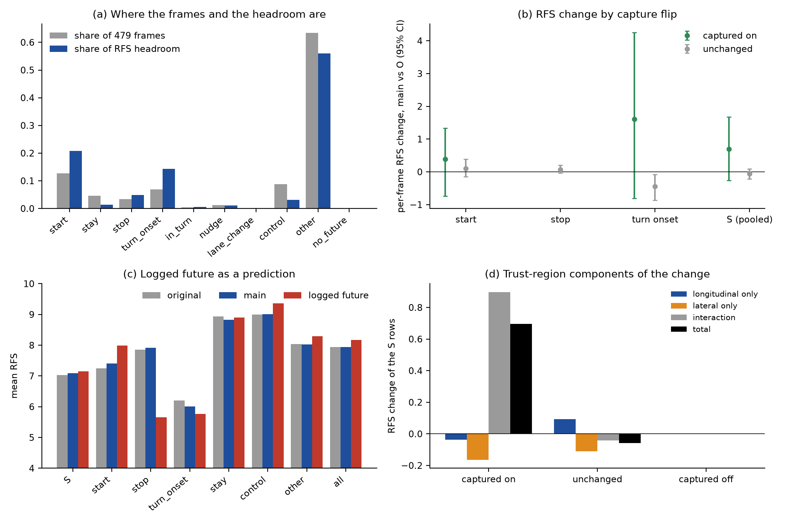

# op-adapt L：为什么 RFS 没动？（现有结果上的诊断，预登记）

状态: 预登记（写于任何数字之前；此前只读了 decisions 第 47、77、78 条、op-adapt L 预登记与后续、`log_expert_audit.py`、`op_adapt_l_readout.py`、`jevdrive/waymo.py` 里的 RFS 实现，没有算过任何切片计数、RFS 或距离）。
主题: [decisions 第 78 条](../research/decisions.md)、[op-adapt L 预登记](2026-10-01-op-adapt-L-prereg.md)、[后续检查](2026-10-01-op-adapt-L-followup.md)。
约束: 不训练、不动已登记的协议、不碰 test、不碰 r2 的 run 目录、不编辑 decisions。只读 `$DATA_DIR/runs/op_adapt_L/readout/{O,main-s0,main-s1,main-s2}/eval/rater.npz`（每个模型在 479 个 val rater 帧上的 plan，读数管线已存）与 WOD 的 index / past / future / rater 集合。纯 CPU，核 100–160，无 GPU，不登记调度表。

名词（首次使用处各给一句）：**RFS**（Rater Feedback Score）= WOD-E2E 榜单指标，每帧有 3 条 rater 轨迹与 0–10 的打分；plan 在 3 s 与 5 s 处各和每条 rater 轨迹比较，落进该 rater 的 **trust region**（信任区：沿该 rater 轨迹方向的纵向 ±4 m / 横向 ±1 m at 3 s，5 s 处 7.2 / 1.8 m，速度低于 1.4 m/s 时缩到一半）内就取该 rater 的分，区外每超一个阈值乘 0.1，取最好的 rater，两个时刻平均；不在任一 rater 的区内（两时刻同时）则不低于 floor 4。榜单口径 = 先按场景类别取均值再对类别等权平均。**capture**（捕获）= op-adapt L 预登记的定义（start = plan 4 s 位移 ≥ 人类的一半；stop = plan 最后 0.5 s 速度 ≤ 1 m/s；turn onset = plan 4 s 横向偏移与人类同号且 ≥ 人类的一半）。**rater 帧** = WOD val 里带 rater 打分的 479 帧（每段一帧，约第 149–150 帧）。`main` = 适配模型三个 seed（s0、s1、s2），`O` = 原模型。**×1.06** = plan 的 x 乘 1.06 的纵向校准（提交 7.92 用的约定）。

## 0. 公共定义

- **行集合**：479 个 val rater 帧，名字 `<sequence>-<frame>`；原模型与 `main` 在这些帧上的 plan 取 readout 已存的 `rater.npz`（同一个前向协议，O 的 RFS = 8.004）。RFS 用 `jevdrive/waymo.py::rater_feedback_score`（官方代码的移植，在本 lane 复现 8.004 / 官方 8.005）。
- **cluster**：段（sequence）。bootstrap = 段聚类，2 000 次，seed 0，同一组重抽权重用于被比较的两侧（`op_adapt_l.cluster_boot` / `boot_mean`）。
- **场景类别**：`sets["rater"]["cluster"]`（10 类，榜单口径）。帧 i 对榜单总分的**权重** w_i = 1 / (C · n_c(i))，C = 出现的类别数，n_c = 该类帧数，所以 Σ_i w_i x_i 就是榜单口径的「按类取均值再等权平均」。分项对榜单的贡献一律用 Σ w_i x_i 表示（单位 = RFS 点）。
- **切片**：用 `scripts/log_expert_audit.py::slices`（BASE 阈值）在 rater 帧的人类 logged future（0.5 s 格点 4 s 位移、后轴自车系）上打标签：start、stay、stop、turn_onset、in_turn、nudge、lane_change、control；另设 `other`（以上都不成立，有 future）和 `no_future`（该帧没有 logged future，切片不可判）。切片互相重叠，所以：**(a) 重叠计数**每个切片单独数；**(b) 互斥标签**按优先级 turn_onset > start > stop > stay > in_turn > nudge > lane_change > control > other（no_future 单独一类）给每帧一个标签，用于把总 Δ 精确拆成各项之和（分项加起来 = 总数，是自检）。**imitated 切片 S** = start ∪ stop ∪ turn_onset（重叠并集，op-adapt L 模仿过的三类）。
- **RFS 的 max**：每帧 RFS 的理论最大 = 该帧 3 位 rater 打分里的最大值（plan 取到该 rater 轨迹时 norm = 0）。frame gap_i = max_i − RFS_i（O 的）。
- 榜单顶 = 8.17（brief 给定）；O = 8.004，所以「到榜单顶的缺口」= 0.166。

## 1. Q1 覆盖与 headroom

表 1：每个切片（重叠计数与互斥标签各一列）的帧数、段数、类别分布；O 的切片平均 RFS；切片帧的满分 headroom H_slice = Σ_{i∈slice} w_i·gap_i（榜单单位）及占总 H_all = Σ_i w_i·gap_i 的份额、H_slice / 0.166（占到榜单顶缺口的倍数）；另列切片 rater 分的平均跨度（3 位 rater 打分的 max − min，衡量这一帧的「押注」大小）。

读法（先写死）：
- **R1a「imitated 切片 headroom 太小」**：H_S < 0.166（即使 S 帧全拿满分，也到不了榜单顶）**或** H_S / H_all < 0.15 时成立；否则否定。并列报 H_S / 0.166 的具体倍数。
- 哪个类别 headroom 最多：按类别 c 的 (1/C)·mean_i∈c gap_i（榜单单位），排序，并给每类里互斥标签的 headroom 分解（哪个切片占了类内 gap 的多数；占不到 50% 的部分归「无切片」）。

## 2. Q2 响应：RFS 随 capture 变了多少

对 S 里三个切片各自（重叠计数）与 `other`、`all` 给 `main` 对 O 的逐帧 ΔRFS（每帧每个 seed 一行，seed 三行各自对同一帧的 O；行的 bootstrap 按段聚类，所以段被抽到时三个 seed 一起进，CI 不含 seed 方差；seed 间散布另列），raw 与 ×1.06 各一份。再按**该切片自己的 capture 指示量**拆成：not→captured（O 没捕获 / main 捕获，「on」）、captured→not（「off」）、unchanged（两者同），各给行数、段数、ΔRFS 均值与 CI。另给互斥标签下各标签对总 Δ（榜单口径，Σ w_i Δ_i）的贡献；Σ 贡献 = 总 Δ 由计算核对。

读法（先写死）：
- **R2a「flip 带来了 RFS」**：一个切片的「on」行 ΔRFS 的 CI 下界 > 0，**并且**点估计 ≥ 0.3（RFS 是 0–10 量纲；0.3 相当于一帧的 3%，低于这个量我们不认为 capture 的翻转对一帧的 RFS 有实质效应）。CI 含 0 → 「无证据」；上界 < 0 → 「flip 伤 RFS」。
- **R2b「flip 相对 unchanged 的差」**：on 与 unchanged 的 ΔRFS 之差（同切片内）用同一重抽的配对 bootstrap 给 CI，读的是「flip 特有的」RFS 变化，排除适配模型整体漂移。
- **R2c「gains real but frames too few」**：S 的 on 行数 × 各切片 on 均值按 w_i 换成榜单单位，合成「on 翻转对榜单总分的预期贡献」E_on；若 R2a 成立而 E_on（以及 S 总贡献）< 0.07（= 现有 CI 半宽，低于它在 479 帧上看不见），则成立：增益可能真实，但 479 帧里 flip 的帧太少不足以显现。若 E_on ≥ 0.07 而总 Δ 仍是 +0.009 说明别的帧把它抵消了（读 off 行与 `other`）。

## 3. Q3 logged future 是不是 rater 偏好的目标

对 479 帧中有 logged future 的：rater 偏好轨迹 = 3 条 rater 轨迹里得分最高的一条（并列取第一条；报并列帧数）；与 logged future 的欧氏距离在 1、2、3、4 s（4 Hz 格点第 4、8、12、16 点）的中位数与 p90，另分纵向（沿 rater 偏好轨迹的 logged future 方向）/ 横向绝对差；「logged future 作 plan」的 RFS（`rater_feedback_score(future_xy, traj, scores, speed)`，5 s 全长；logged future 本身是 5 s 20 点）；它是否落在某 rater 的 trust region 内（`details` 的 inside 标志）；RFS ≤ 4.0（floor）的帧占比。按切片（重叠）报：RFS(logged)、RFS(O)、RFS(`main`)，以及 logged − O、`main` − logged 的配对 CI（段聚类）。

读法（先写死）：
- **R3a「logged future 是 RFS 好的目标」**：切片里 (logged − O) 的 CI 下界 > 0；**「RFS 中性」**：CI 含 0；**「RFS 差」**：上界 < 0。
- **R3b「logged future 不是 rater 偏好」成立**：S 上 (logged − O) 的 CI 下界 ≤ 0（即没有证据说模仿 logged future 能比 O 提高 RFS），或 S 上 logged future 的 RFS 均值低于 O 的。此时模仿 logged future 在机制上就不能指望抬 RFS（capture 与 RFS 目标不同），不必再问别的。
- 「`main` − logged」为正（适配后 plan 已比 logged future 的 RFS 还高）说明适配的 RFS 增益没有被 logged future 封顶。

## 4. Q4 RFS 的机制：纵向 / 横向分量

对每帧、每个模型（O 与 `main` 各 seed）按官方公式显式算出每位 rater、每个时刻（3 s、5 s）的 d_lng、d_lat 与阈值归一化后的 n_lng、n_lat 及 norm = max(n_lng, n_lat)，重建每帧 RFS（与 `rater_feedback_score` 逐位核对，差 < 1e-9，核对不过就停）。对 flip 行（on / off，切片按 S 的三个分开并合并）做反事实拆分：ΔRFS = Δ_lng-only + Δ_lat-only + 交互，其中 Δ_lng-only = S(d_lng 取 `main`、d_lat 取 O) − S(O)，Δ_lat-only = S(d_lng 取 O、d_lat 取 `main`) − S(O)，交互 = 总 Δ 减去前两项。另报：(i) trust region 状态的转移（inside: O → main 的 out→in、in→out、保持）；(ii) 在 O 与 `main` 各自得分最高的 rater 上，3 s、5 s 的 n_lng、n_lat 的均值与 binding 分量（norm 里取 max 的那个）是纵向还是横向的比例；(iii) 纵向 d_lng 的带符号均值（plan 相对 rater 轨迹在 rater 前进方向上是超前还是落后）。x×1.06 的情形同算一遍（只拆分，不汇报成两套表，放 CSV）。

读法（先写死）：
- **R4a「纵横向错位」**：on 行里 Δ_lng-only 与 Δ_lat-only **符号相反且各自 |均值| ≥ 0.1**，则成立（一个分量改善、另一个恶化、互相抵消）。
- **R4b「capture 翻转没让 plan 进 trust region」**：on 行里 out→in 的比例 < 50%，则成立（capture 用的是 4 s 位移的一半，trust region 是 3 s / 5 s 的 ±4 m / ±1 m，两者不是同一个口径，捕获可以发生在离 rater 轨迹仍很远时）。
- 以上两条的数字都以 S 内 on 行合并为主，切片分开的放 CSV。

## 5. Q5 决策输出

候选机制（先写死，各配一个「RFS 单位上界」）与判定，都由 §1–4 的数直接判定，不新增检验：

| 编号 | 机制 | 支持条件 | 上界（榜单单位） |
|:--|:--|:--|:--|
| H1 | imitated 切片 headroom 太小 | R1a 成立 | H_S |
| H2 | logged future 不是 rater 偏好 | R3b 成立 | Σ_S w_i·max(0, logged − O) |
| H3 | 增益真实但 flip 帧太少 | R2a 成立且 R2c 成立 | E_on |
| H4 | 纵向 / 横向错位 | R4a 成立 | Σ_on w_i·min(Δ_lng, Δ_lat) 的负部 |
| H5 | capture 口径与 trust region 错位 | R4b 成立 | Σ_on w_i·(n_out→in 之外的 on 行的 Δ) |

排序规则：成立的排在否定的前面；成立的之间按上界（榜单单位）从小到大排（上界最小的是对「RFS 没动」约束最紧的机制）；一个机制的上界 < 0.07 就意味着它单独足以让 +0.009 落在噪声里。同时给「headroom 最多的类别」与「要动它需要什么切片数据」：对 headroom 最多的前三个类别，给类内 gap ≥ 2 的帧数、它们的互斥标签分布、以及这些帧里有没有落在现有 audit 切片（若「无切片」占多数，则结论是：需要新定义这类帧的事件切片，而不是更多 start / stop / turn）。

## 6. 产物

- 脚本 `scripts/op_adapt_l_rfs_diagnosis.py`（子命令 `run`、`figure`）；在 box 上 `taskset -c 100-160` 运行（op-train 环境，`CUDA_VISIBLE_DEVICES=""`），总墙钟预计 < 5 min（479 帧 × 4 模型的 RFS 是毫秒级，bootstrap 2 000 次），所以不进 tmux。
- 小表 `research/results/op-adapt-L/rfs-diagnosis/*.csv`；图 `research/figs/op-adapt-L-rfs-diagnosis.png`（最多两张）；结果、偏离、已验证与推断都写在本文的「结果」节。

## 结果

运行：`scripts/op_adapt_l_rfs_diagnosis.py run` + `figure`（box，核 100–160，CPU，墙钟 < 1 min）；小表在 [research/results/op-adapt-L/rfs-diagnosis/](../research/results/op-adapt-L/rfs-diagnosis/)。自检全过：显式重建的 RFS 与 `waymo.rater_feedback_score` 差 < 1e-9；O 的 RFS 8.0036，`main` 三 seed 8.0198 / 8.0164 / 8.0027，每 seed 的 Δ 与 `metrics_all.csv` 一致（到 1e-7）；互斥标签的分项之和 = 总 Δ（差 < 1e-17）；榜单总 Δ = +0.0093（raw）/ +0.0188（×1.06）。479 帧全有 logged future，478 段（一段有两帧），10 个类别。

图：(a) 灰柱是各切片帧数占比、蓝柱是占 RFS headroom 的份额，看 `other` 一项占了 56%；(b) 各切片里按 capture 翻转拆的逐帧 ΔRFS（CI 按段聚类），看「captured on」的点估计为正但区间都跨 0、turn onset 的「unchanged」反而显著为负；(c) 各切片里 O、`main`、logged future 的平均 RFS，看 stop 与 turn onset 里红柱（logged）比灰柱低；(d) S 内 on 行的 ΔRFS 拆成纵向 / 横向 / 交互，看增益几乎全在交互项里（没有「captured off」行，整个样本里一个都没有）。

### Q1 覆盖与 headroom（表 1，重叠计数；O 的 RFS；H = 榜单单位的满分 headroom，总 H_all = 1.583，到榜单顶 8.17 的缺口 = 0.166）

| 切片 | 帧 | 占 479 | O 的 RFS | 帧 gap 均值 | H_slice | 占 H_all | H / 0.166 |
|:--|--:|--:|--:|--:|--:|--:|--:|
| start | 61 | 12.7% | 7.247 | 2.43 | 0.329 | 20.8% | 1.98 |
| stop | 16 | 3.3% | 7.849 | 2.15 | 0.077 | 4.9% | 0.46 |
| turn_onset | 33 | 6.9% | 6.204 | 3.37 | 0.227 | 14.4% | 1.37 |
| **S = 三者并集** | **102** | **21.3%** | **7.030** | **2.67** | **0.596** | **37.7%** | **3.59** |
| stay | 22 | 4.6% | 8.932 | 0.75 | 0.023 | 1.4% | 0.14 |
| control | 42 | 8.8% | 8.993 | 0.58 | 0.050 | 3.1% | 0.30 |
| nudge / in_turn / lane_change | 6 / 2 / 1 | — | — | — | 0.027 | 1.7% | — |
| other（任何切片都不是） | 304 | 63.5% | 8.039 | 1.54 | 0.887 | 56.0% | 5.33 |
| all | 479 | 100% | 7.940（按帧）/ 8.004（榜单口径） | 1.66 | 1.583 | 100% | 9.52 |

**R1a「headroom 太小」：否定**：H_S = 0.596 是到榜单顶缺口的 3.6 倍，占总 headroom 37.7%（> 15%）。（限定：H 是每帧取到 rater 最高分的理论上限，不是可达值；见 Q3。）

类别 headroom（(1/C)·类内平均 gap，榜单单位）：Multi-Lane Maneuvers 0.208（42 帧，gap 均值 2.08）、Interections 0.185（116 帧）、Foreign Object Debris 0.183（78）、Special Vehicles 0.170、Others 0.165、Cyclist 0.161、Construction 0.145、Single-Lane 0.135、Pedestrian 0.121、Cut_ins 0.111。各类差别不大（0.11–0.21）。前三类里 gap 落在 `other` 标签的份额是 69% / 58% / 65%；落在 turn_onset 的只有 15% / 11% / 18%；Intersections 的 turn_onset 只有 7 帧。帧数 gap ≥ 2 的共 176 帧占 H_all 的 87.6%：S 内 66 帧（占 36.8%）、S 外 110 帧（占 50.9%）。S 外的 110 帧（O 的 RFS 5.70）上 logged future 的 RFS 是 8.04（+2.35），O 的 plan 在 rater 最优轨迹上的纵向偏移带符号均值 −0.83 m（3 s）/ −1.12 m（5 s，落后），速度均值 5.2 m/s，94% 直行意图：即这些是「人继续开、O 落后或欠速」的巡航帧。

### Q2 响应（`main` 三 seed 对 O，每 (帧, seed) 一行，CI 按段聚类，raw；×1.06 在 `q2_response.csv`）

rater 帧上的 capture 率（O → `main` s0/s1/s2）：start 0.459 → 0.656 / 0.656 / 0.639；turn onset 0.606 → 0.727（三 seed 同）；**stop 0.062 → 0.062（一帧都没变）**，而 WOD val 全量上 stop 是 +0.31。

| 切片（行 = 帧 × 3 seed） | 行 / 段 | 全部 ΔRFS [CI] | captured on | unchanged | on 减 unchanged |
|:--|--:|:--|:--|:--|:--|
| start | 183 / 61 | +0.152 [−0.11, 0.45] | 35 行 / 12 段：+0.385 [−0.74, 1.34] | 148 行：+0.098 [−0.15, 0.38] | +0.29 [−0.85, 1.28] |
| stop | 48 / 16 | +0.065 [−0.03, 0.20] | 0 行 | 48 行：+0.065 | — |
| turn onset | 99 / 33 | −0.196 [−0.69, 0.32] | 12 行 / 4 段：+1.605 [−0.81, 4.26] | 87 行 / 29 段：**−0.445 [−0.86, −0.08]** | +2.05 [−0.38, 4.59] |
| **S（合并）** | 306 / 102 | +0.058 [−0.14, 0.27] | 47 行 / 16 段：**+0.696 [−0.26, 1.68]** | 259 行：−0.058 [−0.22, 0.09] | +0.755 [−0.25, 1.76] |
| stay | 66 / 22 | −0.104 [−0.20, −0.03] | | | |
| other | 912 / 303 | −0.016 [−0.09, 0.06] | | | |
| all | 1 437 / 478 | −0.002 [−0.07, 0.06] | | | |

没有 captured→not 的行（off = 0，三个切片都没有）。turn onset 的 unchanged 再拆：两者都捕获 60 行 −0.391 [−0.84, 0.04]，两者都没捕获 27 行 −0.563 [−1.55, 0.00]（这个拆分是第一次读数后加的，见偏离）。×1.06：S 的 on +0.594 [−0.18, 1.39]，turn onset 的 unchanged −0.493 [−0.87, −0.16]。seed 间散布小（S 的 seed 平均 +0.081 / +0.046 / +0.047）。

互斥标签对榜单总 Δ 的贡献（raw / ×1.06）：start +0.0344 / +0.0456，turn_onset −0.0119 / −0.0183，stop +0.0014 / +0.0042，stay −0.0042 / −0.0037，other −0.0102 / −0.0100，control +0.0011 / +0.0013，nudge −0.0013 / −0.0003；合计 +0.0093 / +0.0188。Intersections（116 帧）按类 Δ = −0.033 / −0.024（逐帧均值），其中 turn_onset 7 帧 −0.244 / −0.319，start 18 帧 −0.089 / −0.071，other 69 帧 −0.006 / 0。

**读法**：R2a（on 行 CI 下界 > 0 且均值 ≥ 0.3）在 start、stop、turn onset、S 全部**不成立**：S 的 on 点估计 +0.70 高于 0.3，但 CI 跨 0（16 段），所以是「无证据」而不是「无效应」。R2c：E_on = 0.0173（若 on 翻转按点估计兑现，对榜单总分的贡献）< 0.07，实际在 on 行上兑现 +0.0179。这意味着即使点估计为真，翻转带来的全部增益也只有 +0.017，埋在 ±0.07 的 CI 里；H3 按登记规则判「未成立」（R2a 这条腿不过），但第二条腿（量级）成立，整体读为**无法判定、功效不足**。

### Q3 logged future 作为 RFS 目标（raw；logged future = 5 s 全长 20 点，`rater_feedback_score`）

| 切片 | 帧 | RFS logged | RFS O | RFS `main` | logged − O [CI] | `main` − logged [CI] | logged 在某 rater 区内 | logged ≤ floor |
|:--|--:|--:|--:|--:|:--|:--|--:|--:|
| start | 61 | 7.987 | 7.247 | 7.400 | **+0.74 [0.18, 1.29]** | −0.59 [−1.12, −0.05] | 74% | 4.9% |
| stop | 16 | 5.655 | 7.849 | 7.914 | **−2.20 [−3.90, −0.67]** | +2.26 [0.75, 3.94] | 37.5% | 50% |
| turn onset | 33 | 5.761 | 6.204 | 6.007 | −0.44 [−1.39, 0.53] | +0.25 [−0.83, 1.31] | 18% | 33% |
| S | 102 | 7.156 | 7.030 | 7.087 | +0.13 [−0.42, 0.62] | −0.07 [−0.58, 0.47] | 56% | 19.6% |
| stay | 22 | 8.895 | 8.932 | 8.828 | −0.04 [−0.31, 0.25] | | 95.5% | 0 |
| control | 42 | 9.360 | 8.993 | 9.008 | +0.37 [−0.00, 0.85] | | 97.6% | 0 |
| other | 304 | 8.295 | 8.039 | 8.023 | +0.26 [−0.03, 0.54] | | 80% | 8.2% |
| all | 479 | 8.175 | 7.940 | 7.938 | +0.24 [0.01, 0.45] | | 77% | 9.4% |

rater 偏好轨迹（最高分那条，并列 6 帧取第一条）与 logged future 的距离（中位数，m；纵向 / 横向分量在 rater 轨迹自己的坐标系里）：

| 切片 | 1 s | 2 s | 3 s | 4 s | 3 s 纵 / 横 | 4 s 纵 / 横 |
|:--|--:|--:|--:|--:|:--|:--|
| start (61) | 0.15 | 0.79 | 1.38 | 2.10 | 1.30 / 0.04 | 1.81 / 0.10 |
| stop (16) | 1.14 | 5.45 | 11.56 | 18.41 | 11.41 / 0.21 | 18.08 / 0.27 |
| turn onset (33) | 0.43 | 0.77 | 1.31 | 1.86 | 0.82 / 0.82 | 1.26 / 1.18 |
| all (479) | 0.41 | 0.86 | 1.30 | 1.81 | 1.14 / 0.08 | 1.58 / 0.12 |

**读法**：R3a：start 上 logged future 是 RFS 好的目标（下界 > 0，+0.74，且 `main` 离它还差 0.59）；stop 上是 RFS **差**的目标（上界 < 0，−2.20）：rater 偏好的轨迹 3 s 时离 logged future 11.6 m，人类停下的帧里 rater 给的最高分轨迹并不停（只有 16 帧，且 rater 帧里 O 的 stop capture 只有 1/16）；turn onset 上中性（点估计 −0.44，CI 跨 0，logged 落在区内的只有 18%）。R3b（S 上没有证据说 logged future 比 O 好）**成立**：+0.13 [−0.42, 0.62]，但这是 start 的正与 stop / turn onset 的负抵消出来的，不是 logged future 一律不好。

### Q4 机制（S 内 on 行，47 行 / 16 段；raw）

| 量 | on（47 行） | unchanged（259） |
|:--|:--|:--|
| ΔRFS 总 | +0.696 | −0.058 |
| 只换纵向（lon from main, lat from O） | −0.037 | +0.092 |
| 只换横向 | −0.164 | −0.109 |
| 交互（总 − 两项） | **+0.897** | −0.041 |
| 在某 rater 区内：O → `main` | 61.7% → 59.6% | 53.7% → 58.3% |
| out→in / in→out / 保持在内 / 保持在外 | 10.6% / 12.8% / 48.9% / 27.7% | 5.4% / 0.8% / 52.9% / 40.9% |

分切片（on 行）：start 35 行，总 +0.385 = 纵向 −0.085 + 横向 −0.664 + 交互 +1.134；turn onset 12 行，总 +1.605 = 纵向 +0.106 + 横向 +1.294 + 交互 +0.206（横向归一化误差 3 s 从 1.22 降到 0.72，5 s 从 1.89 降到 0.93；这是唯一「横向真的修好」的一组，但只有 4 段）。start on 行上 plan 相对 rater 轨迹的纵向带符号偏差：O 在 3 s / 5 s 是 −1.02 / −0.87 m，`main` 是 −0.90 / **−2.36** m（5 s 落后更多：capture 看 4 s 位移是否过一半，RFS 看 3 / 5 s 与 rater 的 ±4 m 纵向区，`main` 起步了，但起得不够快）。turn onset 的 unchanged 行（87 行）5 s 的归一化纵向误差从 0.84 升到 1.08，横向 3 s 从 1.07 升到 1.28，也就是适配把没翻转的 turn onset 帧推坏了。O 与 `main` 在 on 行上 binding 分量（norm 里取 max 的）：纵向占 51% → 77%（3 s）/ 68% → 66%（5 s）。

**读法**：R4a（纵横向符号相反且各 ≥ 0.1）**不成立**：on 行的两个单分量项都是负的（−0.04、−0.16），增益全在交互项（+0.90）：RFS 取 max(纵向, 横向) 的归一化距离，单独修好一个分量不够，两个必须同时进区才兑现，所以读为「纵横向必须联合改善」而不是两个分量反向。R4b（out→in 比例 < 50%）**成立**：on 行里只有 10.6% 从区外进到区内，48.9% 本来就在区内，12.8% 反而从区内出去；capture 翻转在 RFS 的 trust region 口径下大多是「没有变化」。

### Q5 假设与排序（机械判定，`q5_hypotheses.csv`）

| 排名 | 假设 | 判定 | 数字 | 上界（榜单单位） |
|--:|:--|:--|:--|--:|
| 1 | H5 capture 翻转没进 trust region | **成立** | on 行 out→in 10.6%，in→out 12.8% | 0.011 |
| 2 | H2 logged future 不是 rater 偏好 | **成立（混合）** | S：+0.13 [−0.42, 0.62]；start +0.74 好，stop −2.20 差，turn onset −0.44 中性 | 0.226 |
| 3 | H3 增益真实但 flip 帧太少 | 未成立（规则）/ 无法判定（功效） | on +0.70 [−0.26, 1.68]；E_on 0.017 | 0.017 |
| 4 | H4 纵横向反向错位 | 否定（读成联合改善） | lng −0.04、lat −0.16、交互 +0.90 | 0.015 |
| 5 | H1 headroom 太小 | **否定** | H_S 0.596，为榜单缺口的 3.6 倍 | 0.596 |

（排序规则：成立在前，成立之间按上界升序；H3、H4 的上界也 < 0.07，但它们没有成立，不进前列。）

综合：**RFS 没动的直接原因是三件事叠加**。(i) 在 rater 帧上被模仿切片里真正翻转 capture 的帧很少（S 内 on 只有约 16 段，stop 一个翻转也没有——rater 帧上 stop capture 1/16 不变，WOD val 全量 +0.31 的主要增益根本没落到 rater 帧上），这 16 段按点估计也只能贡献 +0.017；(ii) 翻转本身大多没有让 plan 进入 rater 的 trust region（只有 10.6% out→in），增益只出现在纵横向同时改善的少数帧；(iii) turn onset 里没有翻转的 87 行是 −0.445（显著负），抵消了 start 的正向贡献（start +0.034，turn_onset −0.012，stay −0.004，other −0.010），这也是 Intersections −0.017 的来源（其 turn_onset 7 帧 Δ −0.24，且只有 7 帧）。headroom 不是瓶颈（S 的 H 是榜单缺口的 3.6 倍），但 headroom 最大的部分（51% 的 H）在 S 之外的 110 个巡航帧（O 落后 rater 轨迹约 0.8–1.1 m、logged future 的 RFS 比 O 高 2.35）。

**哪个类别 headroom 最多、要什么切片数据**：Multi-Lane Maneuvers（0.208）> Interections（0.185）> Foreign Object Debris（0.183），差别不大；三类的 gap 有 58–69% 在 `other`，也就是现有 audit 切片（start / stop / turn onset / nudge / lane change）覆盖不到。要动它们需要的不是更多 start / stop / turn 事件，而是定义「O 欠速 / 落后于人类」的巡航切片（例如 O 的 2 s 速度低于人类、`slow` 指示量，或 plan 4 s 纵向位移 < 人类的某比例）；在这个切片上 logged future 的 RFS 比 O 高 2.35，是 RFS 好的模仿目标，这是数字给出的方向。Single-Lane Maneuvers 里 turn_onset 占 37% 的 gap，但 38 帧里只有 4 帧 gap ≥ 2。

### 偏离

1. 第一次读数后加了三项**描述性**输出，规则不变、不影响任何登记判定：turn onset 的 unchanged 拆成「两者都捕获 / 两者都没捕获」；rater 帧上各切片的 capture 率表；gap ≥ 2 帧（S 内 / 外）的表与类别 × 标签表。turn onset「unchanged −0.445」在第一次读数的登记表里就已出现，拆分是为了看它是不是 capture 状态造成的（不是：两半都为负）。
2. 合并 S 的 flip 规则预登记时只写了「合并」：实现为「三个自身切片里任一个 capture 翻成 on 即为 on；否则任一翻成 off 为 off；其余 unchanged」（一行只记一次）。
3. §3「纵向 / 横向」的坐标系预登记写得含糊，实现为 rater 偏好轨迹自己的坐标系（与 RFS 公式一致）。
4. 总 Δ 的 CI 没有重算，引用 readout 里已有的 ±0.07；分项只给点估计与切片内的 CI。
5. rater 帧里 capture 用 audit 的 BASE 切片在 4 s 上判、RFS 用 3 s / 5 s，两个口径不同，已在读法里说明，没有对齐。

### 已验证与推断

验证的：RFS 显式重建与官方移植逐位一致；每 seed Δ 与已存 `metrics_all.csv` 一致；分项 = 总数；所有表由 CSV 生成。推断的：on 行只有 47 行 / 16 段，所有「on」读数都是点估计，CI 跨 0，不能说翻转「无效」，只能说 479 帧分辨不出来；「O 在巡航帧上欠速」来自 rater 轨迹的带符号纵向偏移均值，没有逐帧核对速度；对巡航切片的建议是数据指向，不是已验证的训练方案；capture 的 4 s 口径与 RFS 的 3 / 5 s 口径不同，「没进 trust region」的读法依赖后者。
