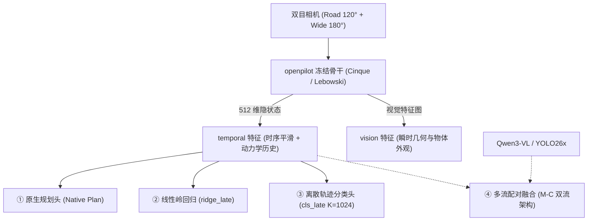

# OpenPilot 三大模型体系：能力边界、特征组合、配对训练与仿真策略接入全景指南

> **目标**：全面梳理系统中关于 openpilot 三大模型（small、Cinque、Lebowski）的实测能力边界、特征表征组合（`temporal` vs `vision`）、配对差分训练机制（Pair-Δ），以及如何无损接入闭环仿真器（CARLA / Bench2Drive）与底层策略执行器。  
> **文档位置**：`tmp/openpilot-models-capability-and-integration.md`

---

## 1. 三大模型谱系与基本架构（The Three Models）

在我们的评测与主线开发中，深入探究了 Comma.ai 演进史上的三个代表性端到端驾驶模型：

| 模型代号 | 架构与时钟特性 | 输入配置与感受野 | 核心定位与特点 |
|:---|:---|:---|:---|
| **small** | 轻量级早期模型，浅层 CNN + 循环时序单元 | 单路或双路低分辨率相机输入，时序记忆窗口短 | 资源开销极小，作为基线与极速边缘推理对照。 |
| **Cinque** (~0.9.7 时代主力) | **20 Hz 主时钟**，双目输入（road 120° + wide 180°），内部维护 **512 维 `temporal` 隐状态** | 512×256 model frame，透视投影校准（warp），RNN 时序记忆窗口达 5 秒 | **当前主线的主力 Backbone**。时序平滑度极高，动力学稳定性极佳，对前车与加塞极度敏感。 |
| **Lebowski** (最新大模型) | **5 Hz context rate**，深度网络，上下文容量大幅扩展 | 采用更大的模型容量与更长的 context step（0.2s 步长） | 拥有更强的长期上下文语义捕捉能力，但对时序抖动和输入延迟更敏感。 |

---

## 2. 真实能力边界（Capacity Boundaries & Empirical Findings）

通过在 Waymo (WOD-E2E)、NAVSIM 以及我们自研的 P5/P6 反事实考卷上的横向对比，摸清了其真实的物理能力边界：

### ① 开环真实道路水平（Waymo WOD-E2E）
* **结论**：**表现惊艳，逼近甚至匹敌专业大模型**。
  * 在 479 个人类驾驶仲裁帧（rater frames）上，Cinque 原生 Plan 的 RFS（人工偏好分）达到 **8.005**，Lebowski 达到 **7.886**，显著击败常规基线（如 CV 7.26），直接进入顶会顶尖模型梯队。
* **输入协议致命伤（NAVSIM 暴跌的真相）**：
  * openpilot 在 NAVSIM 上跑分暴跌，并不是模型不行，而是 **NAVSIM 的 2 Hz、1.5 秒采样并保持（sample-and-hold）协议对时序连续模型造成了降维打击**；
  * 实验证明：把 2 Hz 离散帧强行喂给 20 Hz 的 openpilot，其内部速度估计会被**虚假放大约 2.5 倍**，导致纵向剧烈超调；一旦恢复 10 Hz 真实时间流输入，模型能力立即恢复。

### ② 长尾避险能力边界（P5 考卷发现）
* **对车辆（Vehicles）极度敏感（天生就会）**：
  * 在高速加塞（HighwayCutIn）、盲区切入（StaticCutIn）、前车急刹上，Cinque 和 Lebowski 的原生定向反应翻转率高达 **86% ~ 89%**，甚至压制了 CARLA 专属强模型（如 TFv6 的 42%~46%）。
* **对行人（Pedestrians）几乎完全失灵（长尾盲区）**：
  * 原生模型在突发横穿行人题上，翻转率**直接跌到 0%**！
  * **根因分析**：Comma.ai 设计了约 700-bit 的视觉信息瓶颈，为了保证行车轨迹的高度稳定和平滑，极其稀疏的行人小像素被内部先验当成噪声过滤掉了。

---

## 3. 特征表征与读出头组合（Readout Combinations）

为了充分榨取 openpilot 的强大特征，我们对比了多种解耦组合：

1. **`temporal` vs `vision` 特征**：
   * `temporal` 是 512 维包含时序动力学记忆的循环特征，作为规划头输入时平滑性最好；
   * `vision` 包含更未被时序平滑的物体细节，线性探针（Probing）表明它对静止障碍、锥桶、事故车的可分性极高（AUC 0.88~0.97）。
2. **读出头（Heads）对比**：
   * **`ridge_late`（连续回归残差）**：最保避险反应，能完整保留连续减速与微调；
   * **`cls_late`（K=1024 轨迹词表分类）**：公开榜单常用，但致命弱点在于**词表内没有避障绕行轨迹**，且离散 Anchor 会引入量化跳跃噪声，反而压制了微小减速反应。
3. **M-C 双流异构融合（Multi-Stream Architecture）**：
   * 采用 **`openpilot temporal` ⊕ `Qwen3-VL (L18_last)` / `YOLO26x-seg`**；
   * 解决“偏科”问题：openpilot 负责车道保持、车辆博弈与平顺控制；外部感知分支专门作为“哨兵”，负责在出现行人与静态障碍时发出激发信号。

---

## 4. 配对差分训练（Pair-Difference Training / Elicitation）

常规均匀模仿学习（Imitation Learning）会把 99% 的平稳巡航当成主导，导致模型在关键时刻“不刹车”。为此，团队落地了**反事实配对差分训练**：

### 核心原理
利用 P5 物理引擎生成的反事实配对（$x^+$ 有行人 vs $x^-$ 无行人）：
$$\Delta f = f(x^+) - f(x^-)$$
$$\Delta y = y_{\text{expert}}(x^+) - y_{\text{expert}}(x^-)$$

训练一个轻量的残差头（Reaction Head），只以 $\Delta f \to \Delta y$ 为目标函数进行拟合。

### 实测成效
* 在原本翻转率为 0% 的行人场景中，经过配对差分训练的 M-C 双流 Head，在拟人专家（BA）标签下的**行人反应翻转率直接飙升至 42.1% ~ 46.7%**！
* 证实了：**骨干网络里并非看不见行人，而是需要差分监督将其因果反应显式“激发”出来。**

---

## 5. 策略怎么接入仿真与实车（Policy & Integration Guide）

将 openpilot 接入 CARLA（Bench2Drive）闭环仿真器并连接底层控制器，曾遇到过严重的冲出车道事故。经过深入复盘，锁定了三大关键修复与标准接入流程：

### ① 坐标系变换：相机原点 $\to$ 后轴中心（致命 Bug 修复）
* **踩坑血泪史**：
  * openpilot 输出的规划轨迹（Plan）的原点在**前挡风玻璃上的相机位置**；
  * 底层控制器（如 P7 / Pure Pursuit）默认要求的输入轨迹必须在**后轮轴中心（Rear Axle）**；
  * 早期适配器仅粗暴地做了 $x + 1.78\text{ m}$ 的平移，导致控制器认为 $t=0$ 时刻车身落后了 1.78 米，瞬间换算成 **$7.1\text{ m/s}$ 的全油门起步命令**！车在静止状态被瞬间拽翻冲出车道。
* **标准数学变换公式**：
  设相机相对后轴偏置为 $\mathbf{d} = (1.779, 0)$，相机系轨迹为 $(p_x(t), p_y(t))$、航向为 $\psi(t)$，转入后轴系坐标 $\mathbf{r}(t)$ 必须包含刚体旋转项：
  $$\mathbf{q}(t) = \big(p_x(t), -p_y(t)\big), \quad \psi'(t) = -\psi(t)$$
  $$\mathbf{r}_{\text{rear}}(t) = \mathbf{d} + \mathbf{q}(t) - \mathbf{R}\big(\psi'(t)\big) \cdot \mathbf{d}$$
  变换后，$t=0$ 时 $\mathbf{r}_{\text{rear}}(0) = \mathbf{0}$，静止时控制器进入平稳的 `stop_hold` 状态。

---

### ② 相机时序严格配对（Temporal Synchronization）
* **问题**：road 相机与 wide 相机如果采用异步采样，会出现 1~3 帧（50~150ms）的时序抖动，导致时序横向误差暴增 83%。
* **规范**：
  * CARLA 必须开启同步模式（Synchronous mode），设置 `sensor_tick = 0.05s`（20 Hz）；
  * 保证每个仿真步同时渲染 road 和 wide，严格锁死同一物理时间戳。

---

### ③ 循环隐状态冷启动预热（Warm-up Protocol）
* openpilot 的 RNN 依赖历史帧积累。场景刚开始的前 1 秒隐状态为空，第一帧规划距离会异常拉长至 85~90 米。
* **接入规范**：
  * 仿真开始后执行 **5 秒刹车保持预热（Warm-up）**；
  * 先喂入 25 个 context 步让网络隐状态收敛，随后再将轨迹接入底盘控制器。

---

### ④ 底层执行器对接（P7 Controller）
* **控制节拍**：openpilot 原生在 20 Hz 运行，每 4 个 step（即 5 Hz）向 P7 控制器投递一次轨迹切片；
* **控制器配置**：P7 采用 Pure Pursuit 纯追踪算法，限制正向加速度上限（$\le 2\text{ m/s}^2$），忠实执行轨迹跟踪，不人为添加平滑滤波混淆模型本身的规划质量。

---

### ⑤ 高层交互信号对接（Desire 变道脉冲）
* openpilot 支持通过高层 Desire 信号触发变道（如 `LaneChangeLeft`）；
* 在绕行避障场景（P6）中，当上游模式决策头判定需要借道时，在对应帧打入 Desire 上升沿脉冲，车辆即可在闭环动力学下完成大于 2.5 米的标准车道级绕障动作。

---

## 6. 核心工程落盘文件速查

* **模型抽取与特征定义**：`jevdrive/openpilot/`、`jevdrive/p5_openpilot.py`
* **坐标系变换与 CARLA 适配 Agent**：`scripts/b2d_zeroshot_agent.py`（核心函数 `plan_origin: rear`）
* **开环配对评测总表**：`research/results/openpilot-openloop/`
* **闭环执行层与 P7 控制器**：`todos/2026-09-23-tfv6-controller/controller-eval/P7.json`
