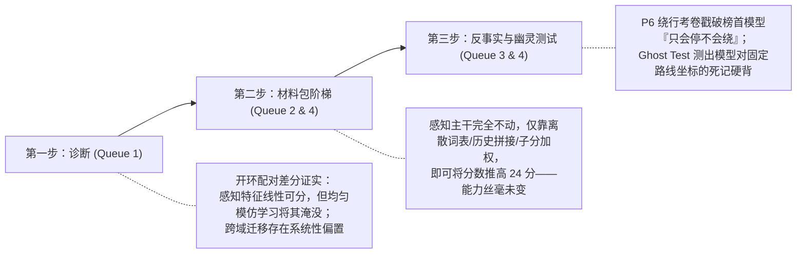

# 从「榜单神话」到「可证伪的物理智能」：近 48 小时（Queue 1–4）核心研发成果全景讲解

> **面向读者**：机器学习 / 自动驾驶方向博士生  
> **核心议题**：当前端到端自动驾驶模型到底具备真正的驾驶因果判断力，还是在通过评测 Trick（指标刷分配方）与死记硬背（路线过拟合）制造虚假繁荣？我们如何用反事实评测与幽灵测试戳破它？

---

## 1. 论文的核心故事线（Executive Summary）

目前自动驾驶社区（CARLA Bench2Drive、NAVSIM 等榜单）充斥着 80+ 高分的端到端模型（如 TFv6、BridgeDrive、BLUE、Hydra）。但只要深入其实际驾驶行为就会发现：**高分模型在突发危险（行人横穿、前车急刹、障碍绕行）面前频繁失灵，甚至视若无睹直接撞击。**

从昨天（09-25）到今天（09-26），团队通过 4 个连续迭代的任务队列（Queue 1 至 Queue 4），完成了从**「开环反事实诊断」**到**「闭环幽灵测试」**的完整闭环，确立了即将投稿的学术论文核心三部曲：



---

## 2. 核心黑话与概念速查字典（The Rosetta Stone）

为了防止被内部编号干扰，以下是将项目代号映射到标准机器学习概念的对照表：

| 内部黑话 / 编号 | 机器学习 / 自动驾驶专业概念 | 含义通俗解释 |
|:---|:---|:---|
| **P5 考卷** | 纵向反事实反应测试（Longitudinal Reactivity Benchmark） | 构造配对场景（$x^+$ 有行人 vs $x^-$ 无行人），测试模型是否会因目标存在而触发**减速翻转**。 |
| **P6 考卷** | 横向避让与多智能体博弈测试（Lateral Bypass & Negotiation） | 车辆面对静止障碍能否借道绕行；对向有来车时能否先减速等待空隙（Gap）再借道。 |
| **P7 执行层** | 底层纯追踪控制器（Pure Pursuit Controller） | 负责将 Planner 输出的轨迹点转化为车辆的油门、刹车和方向盘转角。 |
| **BA (BehaviorAgent)** | 拟人化反应型专家（Reactive Expert） | CARLA 内置的拟人专家，看到危险后约 1.2 秒才开始制动，接近真实人类生理延迟。 |
| **PDM-Lite** | 特权状态作弊型专家（Privileged Omniscient Expert） | 直接读取仿真器底层物理内存的无延迟专家，危险刚一露头（0.4s）即瞬间规避。 |
| **M-C / 配对差分 (Pair-Δ)** | 针对因果因子的轻量适配微调（Counterfactual Difference Elicitation） | 将有危险帧与无危险帧的表征做差分 $\Delta = f(x^+) - f(x^-)$，训练轻量 Head 提取避险反应。 |
| **Ghost Test (幽灵测试)** | 记忆性/背题证伪实验（Counterfactual Deletion for Memorization Test） | **把危险目标完全抹去**（Ghost 世界），看模型是否依然在固定地理坐标处踩刹车或大幅打方向。 |
| **材料包阶梯 (Recipe Ladder)** | 指标工程/刷分配方消融（Metric Gaming / Goodhart's Law Ablation） | 保持感知 Backbone 权重绝对冻结，仅叠加 Trick（词表滤波、历史拼接、打分头），观察分数虚增。 |

---

## 3. 四个队列（Queue 1–4）的递进研发全貌

### Queue 1（凌晨）：开环诊断与跨域迁移实验
- **做了什么**：
  1. **专家标签消融**：在 P5 考卷上分别用 PDM-Lite 和 BehaviorAgent (BA) 作为教师信号。
  2. **真实域迁移（Zero-shot on Waymo & HUGSIM）**：将 CARLA 学习的配对反应头直接迁移到真实数据（Waymo Open Dataset）与真实 3D 渲染车辆数据（HUGSIM 3DGS）。
  3. **快通道检测器选型**：评估 SAM 3.1、Grounding DINO、YOLO26x-seg 的推理延迟与 3D 接地召回率。
- **读出了什么**：
  - **标签特权陷阱**：PDM-Lite 的标签实际上是基于全局真值的“未来预判”（0.4s 内刹车），任何依赖相机的正常感知模型在其考卷上得分接近 0；只有拟人化的 BA 标签能够激发 42%~46% 的反应率。
  - **因果偏置的域迁移鸿沟**：在 CARLA 闭域激发的避险偏置 $\Delta$，直接加到真实驾驶域上是**有害的**（Waymo RFS 评测掉分），说明合成环境的反应向量无法盲目零样本泛化。
  - **感知架构确定**：SAM 耗时 >500ms 无法做实时避让，最终选定 YOLO26x-seg（23ms，单目尺度修复）。

---

### Queue 2（白天）：决策考卷构造与「感知失语症」诊断
- **做了什么**：
  1. **N1（P6 绕行考卷构造）**：在 220 条路线上构建了 605 个反事实世界，包括 4 种状态：
     - $x_{10}$：本车道有障碍物；
     - $x_{00}$：障碍物完全删除（隐形）；
     - $x_{11}$：本车道有障碍物 + 对向车道有固定车流（测试博弈等待）；
     - $x_{01}$：本车道无障碍物 + 对向车道有车流。
  2. **N2（线性探针 Probing 实验）**：探测视觉主干（openpilot Cinque/Lebowski）的冻结表征中是否编码了绕行所需的核心空间信息。
  3. **N3（Hydra 榜首打分头评估）**：评估 NAVSIM 榜首的 Hydra Head 在极端避障下的表现。
- **读出了什么**：
  - **表征极其丰富（AUC 0.88 ~ 0.97）**：视觉主干线性可分性极高，前方有静止障碍、侧方有车、对向来车在特征空间里一清二楚。
  - **结构性缺陷（感知失语症）**：
    - **执行器不足**：openpilot 的变道欲望（desire）在开环低速下最大横移仅 0.6~0.7 米，不足以完成完整绕行。
    - **词表严重受限**：主流的高分模型采用轨迹离散分类头（K=1024 聚类词表），检查发现**词表里根本没有任何一条轨迹具备向左借道再回正的绕行几何形状**！模型就算感知到了障碍，在输出层也无法表达。
  - **高分与安全能力的对立**：把反应 Head 强行结合到榜首 Hydra 模型上，NAVSIM 分数直接暴跌 5~8 分。榜单打分机制高度奖励轨迹平滑，把突发反应当成了惩罚项。

---

### Queue 3（傍晚）：闭环评测与真实榜单水平大摸底
- **做了什么**：
  1. **Q1（明星模型大考试）**：将当前所有开源明星模型（TFv6, BridgeDrive, BLUE, SimLingo, Alpamayo 1.5, NAVSIM 族）放入 P6 考卷进行同台竞技。
  2. **CL 闭环评测（Bench2Drive 220 路线）**：使用统一的 P7 底层执行层，消除不同控制器调优差异，实打实测试闭环驾驶分数（Driving Score）与成功率（Success Rate）。
  3. **Seen / Unseen 路线严格隔离**：将训练时录制过的路线与全新路线分离，严防数据泄露。
- **读出了什么**：
  - **公开模型普遍「只会停、不会绕」**：大部分高分模型面对本车道障碍物时，最优表现仅仅是刹停；甚至在稍微复杂的双向车道博弈中直接陷入死锁或迎头相撞。
  - **路线记忆性暴露**：模型在训练集见过的路线（Seen）和未见过的路线（Unseen）上分数出现大幅滑坡，为 Queue 4 的“背题签名”提供了直接动机。

---

### Queue 4（最新）：致命一击——幽灵测试与死记硬背的数学签名
- **做了什么**：
  1. **Ghost Test（幽灵测试）**：
     - 在 80 条官方高危路线上，将原本会触发危险的障碍物完全移除（沉入地下 500m 并关闭物理引擎与内存登记）；
     - 保持天气、道路拓扑、车流种子不变；
     - 观测各考生在空无一物的“幽灵路段”是否依然执行减速（$\ge 3$ m/s）或向外打方向。
  2. **Perturbation Collapse（扰动崩塌测试）**：
     - **空间位移（Shift）**：将危险发生点沿路线向前或向后移动 15 米；
     - **语义替换（Swap）**：同类别实体互换（如事故车换为施工锥桶，行人换为自行车）。
- **预期判读与理论证明（论文核心主张）**：
  ```
  【判定矩阵】
  1. 幽灵率显著高于对照段且发生扰动崩塌 ──> 证明模型严重依赖高精地图绝对坐标记忆（背题），并非视觉因果驱动。
  2. 幽灵率接近零但发生扰动崩塌 ─────────> 证明模型对特定视觉实例过拟合（Instance Overfitting），缺乏几何通用泛化。
  3. 材料包阶梯对比 ──────────────────────> 在同等骨干网络下，仅靠指标配方即可追平榜首高分，坐实公开榜单的“指标泡沫”。
  ```

---

## 4. 总结与论文贡献提炼

这一连串紧密实验最终提炼成了三个无可辩驳的学术论点：
1. **榜单高分是配方堆出来的虚火**：端到端模型的高分可以通过离散轨迹筛选、Ego 速度拼接和打分器加权凭空刷出来，其真实闭环泛化能力并无本质提升。
2. **端到端感知的“心口不一”**：强大的预训练视觉模型已经在隐空间看清了障碍与风险，但被下游拙劣的分类头（缺少绕行 Anchor）和模仿学习策略强行压制成了“盲人驾驶”。
3. **Ghost Test 成为可证伪的反作弊标尺**：通过反事实消除危险目标，我们首次给出了区分“模型是靠视觉避障”还是“靠固定路线死记硬背”的可重现评估工具。
